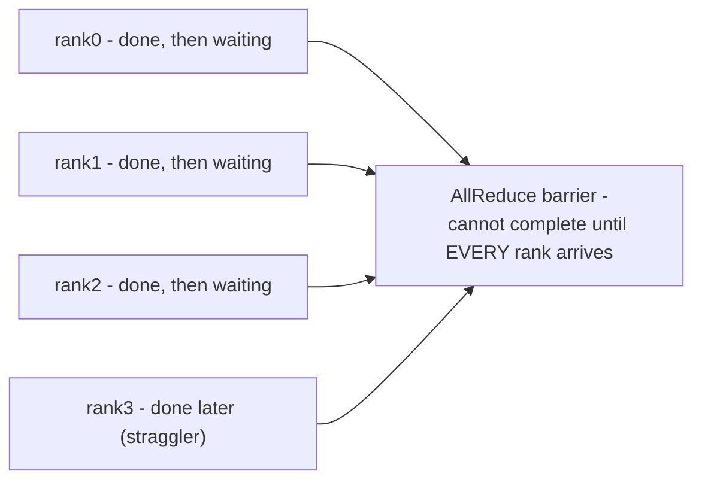
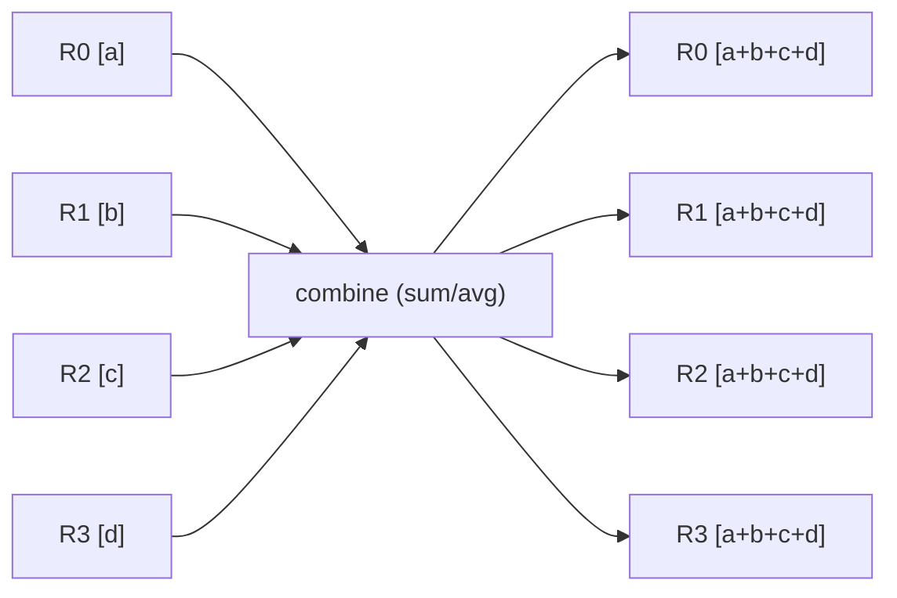
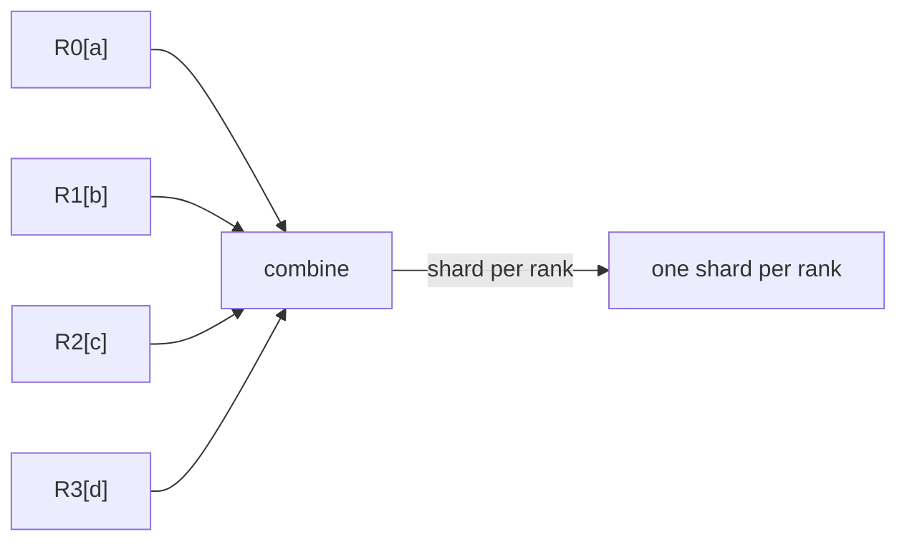
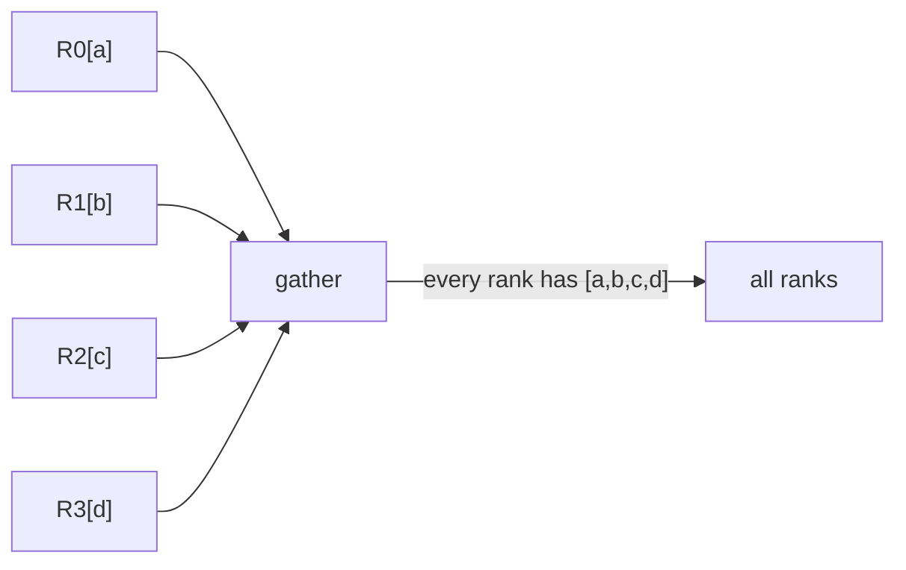
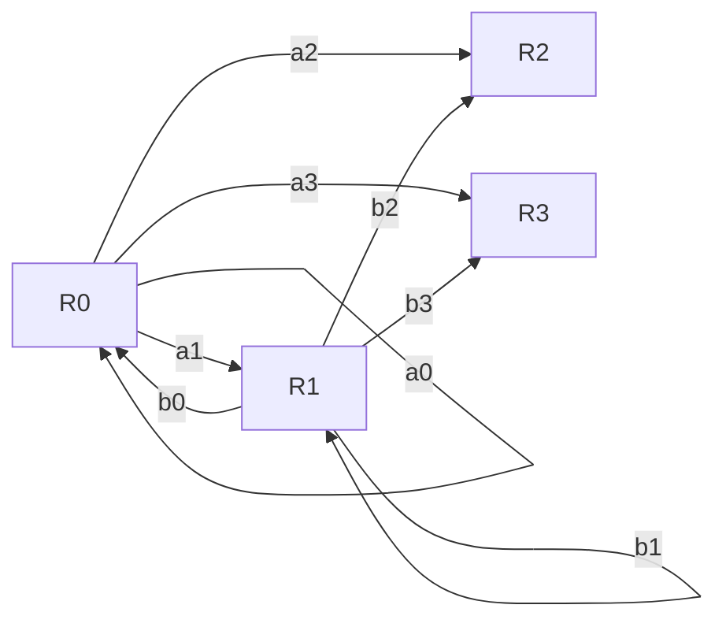

Distributed training performance is bounded by the slowest rank at synchronization points. AllReduce, AllGather, ReduceScatter and All-to-All move different amounts of data and stress the fabric differently. A single node with slower PCIe, NIC congestion, thermal throttling or storage delay can reduce throughput for the whole job. Therefore monitor distributions per rank/node, not only cluster averages.

NCCL chooses algorithms and transport based on topology and environment. Troubleshooting starts by confirming topology, then validating link state and RDMA path, then comparing NCCL logs and per-node timings. Avoid cargo-cult environment variables: each tuning flag changes transport or algorithm decisions and can hide the real infrastructure defect.

**Multi-node communication evidence**

```bash
# Topology and fabric evidence
nvidia-smi topo -m
ibv_devinfo
rdma link
ethtool -S <iface> | egrep -i 'drop|discard|pause|ecn|error'

# NCCL diagnostics - enable only for diagnosis because logs can be large
export NCCL_DEBUG=INFO
export NCCL_DEBUG_SUBSYS=INIT,NET,GRAPH
```

➕ **Sample output for the topology/fabric evidence commands, annotated:**
```text
$ rdma link
link mlx5_0/1 state ACTIVE physical_state LINK_UP netdev ens5f0
link mlx5_1/1 state ACTIVE physical_state LINK_UP netdev ens5f1

$ ibv_devinfo | grep -E 'hca_id|state|port_lid|active_speed'
hca_id: mlx5_0
        state:                  PORT_ACTIVE (4)
        port_lid:               12
        active_speed:           25.0 Gbps (x8 = 200Gb/s effective)
```
`rdma link` gives the fast, per-device up/down summary across every RDMA-capable NIC on the host in one line each — the first thing to check before anything else, because a `state DOWN` here makes every layer above it (NCCL, the training job) moot. `ibv_devinfo` gives the same information per-device in more detail, including `port_lid` (this device's address on the InfiniBand fabric, meaningless for RoCE) and `active_speed` (the actually-negotiated link rate — cross-check this against the NIC's rated speed exactly the way Chapter 3's `ibstat` example does, since a link stuck at a lower speed reports "up" everywhere while quietly halving your bandwidth).

➕ **Why `NCCL_DEBUG`/`NCCL_DEBUG_SUBSYS` are set with `export`, and why "enable only for diagnosis":** these are environment variables read once at NCCL library init inside the training process — `export` makes them visible to the child process the shell launches next (`python train.py`, `srun ...`), not to the current shell alone. `NCCL_DEBUG=INFO` turns on NCCL's own internal logging (topology detection, transport selection, channel setup) directly into the job's stdout/stderr; `NCCL_DEBUG_SUBSYS` narrows that logging to specific subsystems (`INIT`, `NET`, `GRAPH`) instead of every subsystem NCCL has, which matters because unfiltered `NCCL_DEBUG=INFO` on a large multi-rank job produces enough log volume per rank to slow the job down and flood log aggregation — this is why the comment says "enable only for diagnosis," not "leave this on by default."

## Senior addendum

**FOURTH EDITION — SENIOR ENGINEERING EXPANSION · VOLUME 6**

**HPC scheduling, accelerated networking and storage for multi-node AI**

This expansion keeps the Fourth Edition teaching flow and adds the depth expected from a senior infrastructure engineer and customer-facing Solutions Architect. The emphasis is mechanism first: understand what the system is doing, observe it with concrete tools, then reason about failure, scale, reliability, performance and trade-offs.

The practitioner material used to shape the scope is a signal, not an authority. Technical behavior is anchored in official documentation and first-principles systems reasoning. Your Staff Engineer study guide contributes useful patterns around Kubernetes, observability, distributed systems, platform design and failure isolation; the NVIDIA material adds GPU systems, AI workloads, accelerated networking and customer architecture.


_Figure A. A collective operation is a data path across GPU, PCIe/NVLink, NIC and fabric._

➕ **Why this figure is the thesis of the whole Deep Dives section, stated plainly:** every Deep Dive below (1 through 4 especially) is really examining one link in Figure A's chain — GPU (Deep Dive 1's straggler math), PCIe/NVLink (Deep Dive 2/3's topology and rail design), NIC/fabric (Deep Dive 2/3's RDMA and oversubscription), and the data that has to reach the GPU in the first place (Deep Dive 4's storage hierarchy). Reciting "it's a data path across GPU, PCIe/NVLink, NIC and fabric" and then walking an interviewer down that literal chain is a strong, structured way to open any question this volume's Deep Dives cover.

**Quick cross-reference (use both halves together, not as duplicates)**

| Deep Dive | Extends chapter(s) | What's genuinely new here vs the chapter |
|---|---|---|
| 1 — Collective communication and straggler amplification | Ch1, Ch4 | the straggler-amplification mechanism at a synchronization barrier, quantified |
| 2 — RDMA: InfiniBand vs RoCE | Ch3, Ch4 | side-by-side comparison table + GPUDirect end-to-end restated as one line |
| 3 — Network design: oversubscription, rails, failure domains | Ch2, Ch4 | bisection bandwidth math + rail-optimized topology diagram |
| 4 — Storage hierarchy and data pipeline architecture | Ch6 | tiering diagram tying capacity/throughput/IOPS/durability to the Ch6 pattern table |
| 5 — Slurm concepts beyond sbatch | Ch7 | GRES/TRES concretely, prolog/epilog failure mode, Enroot/Pyxis context |
| 6 — Kubernetes, Slurm and hybrid scheduling | Ch8 | the ownership-boundary checklist a hybrid estate actually needs |
| 7 — Distributed-system patterns from the Staff Engineer guide | new ground (cross-volume bridge) | partition/replication/lag mapped explicitly to AI infra nouns |

➕ **Straggler amplification, quantified — the mechanism this Deep Dive names but doesn't do the arithmetic for:**
```
8 nodes, ring AllReduce, 7 nodes take 100ms/step, 1 node takes 130ms/step (30% locally slower)

Naive intuition: "one node is 30% slower, so the job is ~30%/8 ≈ 4% slower overall" — WRONG
Reality: every rank BLOCKS at the barrier until the slowest rank arrives
Job step time = max(all rank times) = 130ms, not a weighted average
Job-wide slowdown = 130/100 - 1 = 30% — the ENTIRE job inherits the slow node's full penalty,
                                          not a fraction proportional to 1/8
```
This is "straggler amplification": at a synchronization barrier, the slowest participant's penalty is not diluted by the group size — it's imposed on the whole group in full. This is the single most important number to be able to produce live in an interview when this Deep Dive's topic comes up, and it's the direct justification for "monitor distributions per rank/node, not only cluster averages" from the original text — a cluster-average GPU utilization metric mathematically cannot see this effect; only a per-rank distribution (or a max/p99-vs-mean comparison) can.

➕ **View of the barrier itself:**


➕ **Diagram: the four collectives named above, and what each one actually moves**

AllReduce (e.g. gradient sync) — every rank ends with the SAME combined result:


ReduceScatter — each rank gets ONE shard of the combined result, not the whole:


AllGather — each rank ends with ALL ranks' data, unreduced, pure concatenation:


All-to-All (e.g. MoE expert routing) — every rank sends a DIFFERENT chunk to every other rank, a full N x N exchange, the heaviest fabric load pattern:

AllReduce is usually implemented internally as ReduceScatter followed by AllGather — which is why per-node timing tools that break down NCCL phases (rather than treating "AllReduce" as one opaque call) can localize a straggler to the reduce half or the gather half specifically. All-to-All's N×N exchange pattern is why MoE/expert-parallel workloads are far more sensitive to any single slow link than a dense model's AllReduce-only traffic.

➕ **Interview-ready line:** "In a synchronous collective, the fabric is only as fast as its slowest participant, every step, forever — this is why Chapter 4's node-replacement scenario treats a single topology outlier as a whole-job problem, not a 1/N problem."
