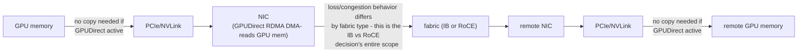
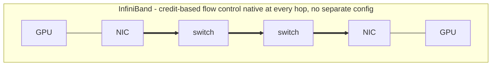
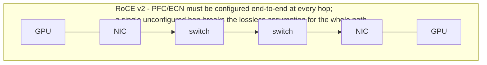

RDMA allows direct memory operations with low CPU overhead. InfiniBand provides an integrated RDMA fabric with its own link/network architecture. RoCE carries RDMA over Ethernet. RoCE therefore inherits Ethernet operational concerns and usually needs intentional congestion management, QoS and loss behavior. "The link is up" is not enough; validate MTU, queue configuration, ECN/PFC behavior where used, path symmetry and error/retry counters.

GPUDirect RDMA reduces unnecessary copies through host memory by enabling direct data movement between GPU memory and compatible NICs. It increases the importance of PCIe/NUMA topology and software compatibility. Think end-to-end: GPU -> PCIe/NVLink -> NIC -> fabric -> remote NIC -> remote GPU.

## Senior addendum

➕ **Diagram: the end-to-end path this Deep Dive says to "think" through**

Every hop except the middle "fabric" segment is identical regardless of InfiniBand-vs-RoCE — the choice this Deep Dive is about only changes how the fabric segment behaves under loss/congestion, not the GPU-NIC or NIC-GPU hops on either end.

➕ **Diagram: where each fabric enforces losslessness**

This is the mechanical reason "the link is up" is insufficient for RoCE specifically — InfiniBand's flow control is structural, so a healthy link implies lossless behavior; RoCE's is configuration, so a healthy link implies nothing about losslessness until every hop's PFC/ECN settings are verified.

➕ **Side-by-side, for the "which would you recommend and why" interview question — this table is new, the underlying facts are in Ch3/Ch4/this Deep Dive already:**

| | InfiniBand | RoCE (v2) |
|---|---|---|
| Loss handling | Fabric-native credit-based flow control — lossless by fabric design | Needs PFC and/or ECN explicitly configured on Ethernet switches to approximate lossless |
| Subnet/fabric management | Dedicated Subnet Manager (SM) | Standard Ethernet L2/L3 + existing IP infrastructure |
| Operational familiarity | Specialist skill (own tooling: `ibstat`, SM logs) | Reuses existing Ethernet ops skill/tooling (`ethtool`, standard switch CLI) |
| Typical use case fit | Purpose-built AI/HPC clusters, greenfield | Brownfield Ethernet-invested environments, converged fabric with other Ethernet traffic |
| Failure mode if misconfigured | SM/partition-key misconfig — access/connectivity failures | PFC storm / ECN mistuning — congestion collapse (Chapter 3 worked scenario) |

*(Chapter 3 already covers the "don't memorize 'RoCE needs lossless Ethernet' " caution and the PFC/ECN worked scenario in full depth — cross-reference rather than re-deriving here.)*

➕ **Interview-ready line for "InfiniBand or RoCE?":** "It's not a technology quality question, it's a fit question — InfiniBand if you're building a dedicated AI/HPC fabric from scratch and want the fabric-native lossless guarantee, RoCE if you're converging onto existing Ethernet investment and are willing to own PFC/ECN tuning as an ongoing operational responsibility, not a one-time setup step."
