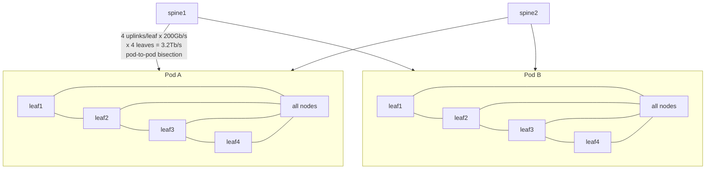
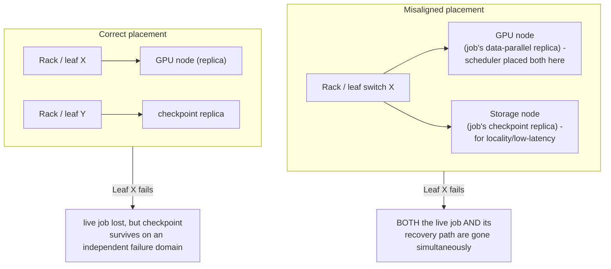

AI fabrics are capacity systems. Oversubscription that is acceptable for web traffic can devastate synchronized collectives. Model the expected communication pattern and bisection bandwidth. Multi-rail designs can improve throughput and resilience but require correct routing, NIC/GPU affinity and workload configuration. Failure domains should align with scheduler placement so a single leaf/spine or rack event does not destroy all replicas or checkpoints.

| Design variable | Why it matters | Evidence / validation |
| --- | --- | --- |
| Link rate and lane health | raw capacity | ethtool/IB port counters |
| MTU | fragmentation/compatibility | ip link, ping with DF where appropriate |
| Congestion | tail latency and retries | ECN/PFC/pause/drop counters |
| Topology/rails | collective parallelism | NCCL graph/topology, switch layout |
| NUMA locality | host/NIC/GPU path | nvidia-smi topo -m, lspci, numactl |

## Senior addendum

➕ **Bisection bandwidth, made concrete with the arithmetic behind "model the expected communication pattern":**
```
Fat-tree, 2 pods of 4 leaf switches, 4 uplinks/leaf to spine, each uplink 200Gb/s
Pod-to-pod bisection = 4 leaves × 4 uplinks × 200Gb/s = 3.2 Tb/s available cross-pod

If an AllReduce across the full cluster needs every node in pod A talking to every node in
pod B simultaneously (All-to-All is the worst case here), demanded bandwidth can exceed 3.2Tb/s
even though each INDIVIDUAL link is far from its own line rate — this is oversubscription biting
at the AGGREGATE/bisection level, invisible if you only check individual `ethtool` counters.
```

➕ **Diagram: the fat-tree bisection from the arithmetic above**

The bisection number lives at the spine layer — every individual leaf-to-spine link can report a healthy `ethtool` counter while the *sum* of simultaneous cross-pod demand still exceeds what the spine layer can carry, which is why oversubscription has to be modeled at the aggregate/pod level, not diagnosed link-by-link.

➕ **Diagram: failure-domain misalignment the text warns about**


➕ **Rail-optimized topology, drawn out (the diagram the "multi-rail designs" sentence needs):**
```text
GPU0 NIC0(rail0) NIC0(rail0) GPU0 (node A) (node B)
GPU1 NIC1(rail1) rail0 switches NIC1(rail1) GPU1
GPU2 NIC2(rail2) rail1 switches NIC2(rail2) GPU2
GPU3 NIC3(rail3) rail2/3 switches NIC3(rail3) GPU3
Each GPU's traffic stays on ITS OWN dedicated rail (switch plane) end-to-end — no rail shares
switch capacity with another rail's traffic, and NCCL is topology-aware enough to pick the
matching local NIC for each GPU (this is exactly what Chapter 4's `nvidia-smi topo -m` table
is telling you to verify per-node before assuming the fabric-wide rail design is being honored).
```

➕ **Failure-domain alignment — the sentence in the original text ("failure domains should align with scheduler placement") worked as a concrete failure:** if a training job's data-parallel replica *and* its checkpoint replica both land under the same leaf switch or rack PDU (because the scheduler placed them for locality, not for failure independence), a single leaf/rack event destroys both the live job and its recovery path simultaneously — the exact opposite of what replication was bought to prevent. This is the networking-layer version of the classic "don't put your primary and your backup in the same failure domain" rule, and it requires the scheduler (Slurm topology-aware placement, or a Kubernetes topology spread constraint) to actually know and respect the physical failure-domain map — it does not happen by default.
