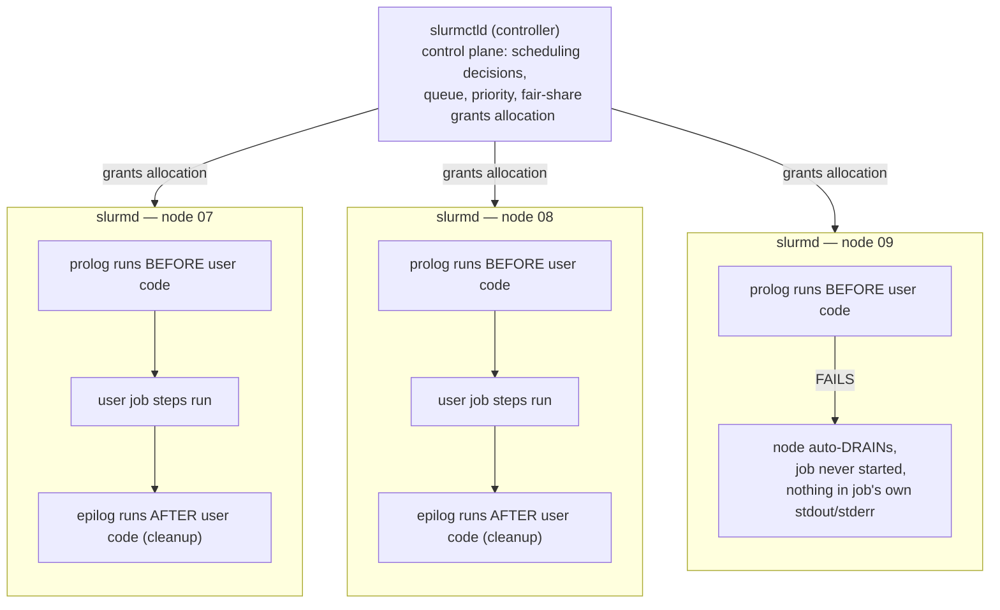

Slurm separates control and execution: slurmctld schedules jobs; slurmd runs on compute nodes; partitions group resources/policy; jobs request resources and can contain job steps. GRES/TRES express accelerators and track consumption. Fair-share, QoS, reservations and priorities shape queue behavior. Prolog/epilog hooks prepare and clean nodes; failures there can make nodes drain or jobs fail before user code runs.

**Slurm operational evidence**

```bash
sinfo -Nel
squeue -o '%.18i %.9P %.16j %.8u %.2t %.10M %.6D %R'
scontrol show job <JOBID>
scontrol show node <NODE>
sacct -j <JOBID> --format=JobID,State,Elapsed,AllocTRES,MaxRSS,ExitCode
```

➕ **Sample `sinfo -Nel` output, annotated (the node-centric view — one line per node, not per partition):**
```text
$ sinfo -Nel
NODELIST   NODES PARTITION STATE  CPUS S:C:T MEMORY GRES        REASON
gpu-node-07    1 gpu-a100  mixed    64 2:16:2 512000 gpu:a100:8  none
gpu-node-08    1 gpu-a100  alloc    64 2:16:2 512000 gpu:a100:8  none
gpu-node-09    1 gpu-a100  drain    64 2:16:2 512000 gpu:a100:8  Prolog error
```
`-N` switches `sinfo`'s default partition-centric view to one line per node (needed here because a partition can span many nodes in different states); `-e` shows every node individually instead of grouping identical-state nodes into a range; `-l` (long) adds the `CPUS`, `S:C:T` (sockets:cores:threads), `MEMORY`, `GRES` and `REASON` columns that the default view omits. `mixed` means the node has some but not all resources allocated (partially busy); `REASON=Prolog error` on `gpu-node-09` is the same auto-drain evidence the addendum below explains — visible here without having to run `scontrol show node` separately.

➕ **Sample `scontrol show job` / `scontrol show node`, annotated:**
```text
$ scontrol show job 40231 | grep -E 'JobState|NodeList|Gres'
   JobState=RUNNING Reason=None
   NodeList=gpu-node-[01-08]
   TresPerNode=gres:gpu:8

$ scontrol show node gpu-node-09 | grep -E 'State|Reason'
   State=DRAIN Reason=Prolog error on node [slurm@2026-07-28T03:14:02]
```
`scontrol show job`/`show node` give the full, single-object detail view that `sinfo`/`squeue`'s tabular output truncates — reach for these once a specific job or node is already the suspect, not as a first-pass survey tool.

NVIDIA Base Command Manager 2026 releases include current Slurm, CUDA, container toolkit and Enroot/Pyxis stacks. Enroot provides an HPC-friendly container runtime model; Pyxis integrates containers with Slurm. This is an important bridge for SAs because many AI factories use Slurm for tightly coupled batch workloads while teams may also run Kubernetes for services and platform workflows.

## Senior addendum

➕ **Diagram: Slurm's control/execution split, and where prolog/epilog sit in it**

`slurmctld` never runs user code — it only decides placement; the actual prolog/epilog/job-step execution is entirely `slurmd`'s job, on each allocated node independently, which is why a prolog failure is visible in that node's `scontrol show node` reason field, not in `sacct` or the job's own logs.

➕ **GRES vs TRES, concretely — the original text names both, this is the distinction spelled out:**
```
GRES (Generic RESource)  — what a NODE HAS:      gpu:8, gpu:a100:8, mps:100
TRES (Trackable RESource) — what a JOB CONSUMED (for accounting): cpu=64,mem=512G,gres/gpu=8,node=8
```
GRES is the *capability declaration* (configured per-node in `slurm.conf`/`gres.conf`); TRES is the *consumption record* (what `sacct`/`scontrol show job` reports was actually granted/used). You configure GRES once per node; you read TRES per job, every time, for accounting and troubleshooting — this is the same mechanism Chapter 7's `sacct --format=...,AllocTRES,...` output is displaying.

➕ **Prolog/epilog failure — the original text's warning ("failures there can make nodes drain or jobs fail before user code runs"), as a concrete incident pattern:**
```
$ scontrol show node gpu-node-09 | grep -E 'State|Reason'
   State=DRAIN Reason=Prolog error on node [slurm@2026-07-28T03:14:02]
```
A node auto-draining itself with `Prolog error` in the reason field means the *node preparation script* failed — e.g. it couldn't reset GPU state, mount a required filesystem, or verify a driver version — **before the user's job ever started**, so the user's application logs will show nothing, because their code never ran. This is a distinct failure class from an application crash and needs the *admin-side* prolog script's own log (not `sacct`, not the job's stdout) to diagnose — worth knowing this exists so "node just drained, job never even started, no error in my code" doesn't get misdiagnosed as an application bug.

➕ **Enroot/Pyxis, in one sentence each, tying the original text's mention to what an SA actually says about it:** Enroot is an unprivileged container runtime built for HPC (no root daemon, designed to run under a batch scheduler's process model rather than a long-lived container-orchestration daemon like containerd); Pyxis is the Slurm SPANK plugin that lets `srun --container-image=...` launch an Enroot container as a job step directly, which is *why* Base Command Manager environments can offer container-based workflows without adopting Kubernetes for the batch side at all — this is the concrete mechanism behind Chapter 8's "Slurm has its own container path" framing.
