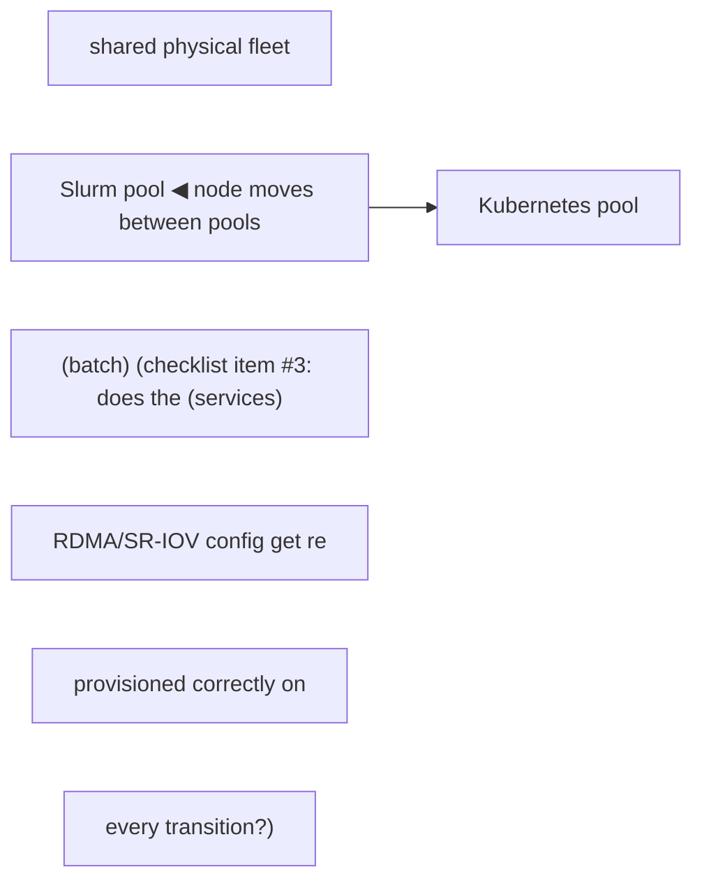

Kubernetes excels at declarative services, APIs, controllers and cloud-native platform integration. Slurm excels at queued HPC jobs, reservations, gang-like resource allocation and mature batch scheduling. The decision depends on workload shape, organizational model and integrations—not ideology. Hybrid estates often share physical infrastructure but need clear ownership of nodes, drivers, networking and storage to avoid conflicting control planes.

## Build from the normal path

**Diagram: the undefined-conflict failure mode checklist item #1 warns about**


**Diagram: a dynamically shared node pool crossing the ownership boundary**

A node that moves pools without re-running the fabric/driver provisioning step (Chapter 5's Network Operator flow) can end up scheduled by one control plane while still carrying network state configured for the other — exactly the "static assignment assumed" failure checklist item #3 calls out.

**The hybrid-ownership checklist — what "clear ownership" actually needs to enumerate before go-live:**
```
1. Node lifecycle    — who drains/reboots/re-images a physical node: the Slurm admin or the
                        Kubernetes cluster-admin? (Answer must be ONE of them, never "either.")
2. Driver/firmware   — GPU driver, NIC firmware, MOFED version: one source of truth (e.g. one
                        golden image / one Network-Operator-and-BCM pairing), not two independently
                        drifting update pipelines targeting the same physical hosts.
3. Network config    — if nodes move between Slurm and Kubernetes pools dynamically, does the
                        RDMA/RoCE fabric config (Chapter 5's SR-IOV VFs, partition keys) get
                        re-provisioned correctly on every pool transition, or does it assume a
                        static assignment?
4. Storage mounts    — shared filesystem mounts/credentials configured identically on both sides,
                        or does a job behave differently depending which scheduler placed it?
5. Observability     — one pane of glass, or two independent monitoring stacks that both claim
                        to know the ground truth about the same physical node?
```
A hybrid estate that hasn't explicitly answered all five is not "flexible," it's "has two control planes with an undefined conflict-resolution policy" — and #1 (node lifecycle ownership) is the one that causes the worst incidents when skipped, because a Slurm-side drain and a Kubernetes-side cordon of the same physical node, done independently by two different teams, can leave the node in a state neither system's dashboard represents correctly.
