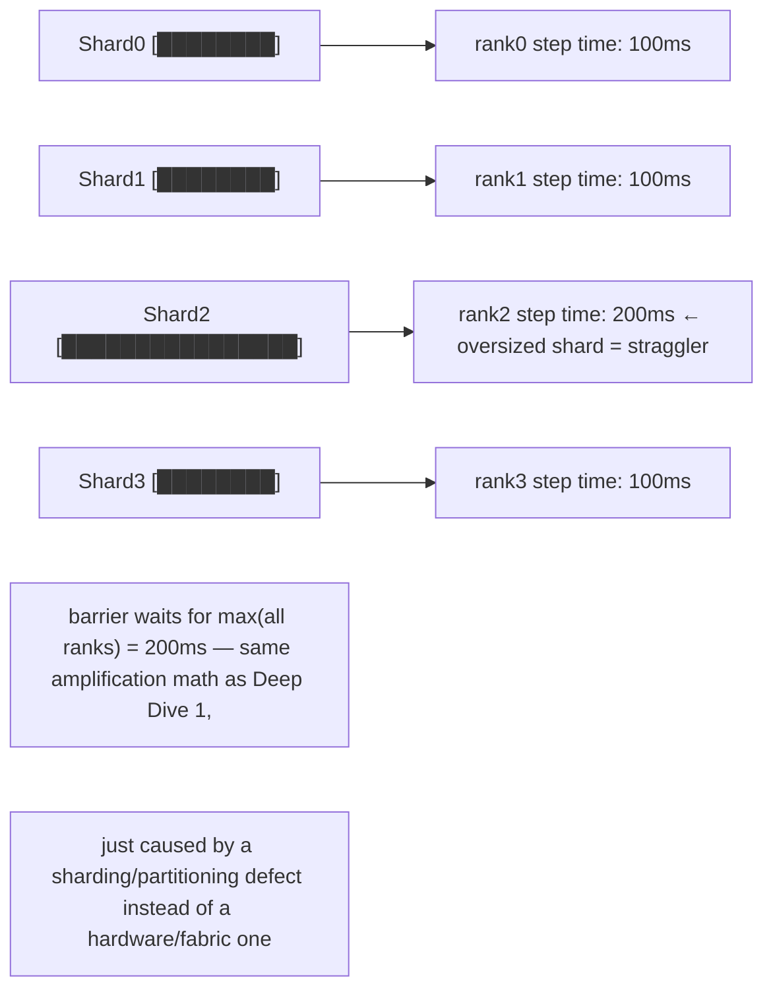
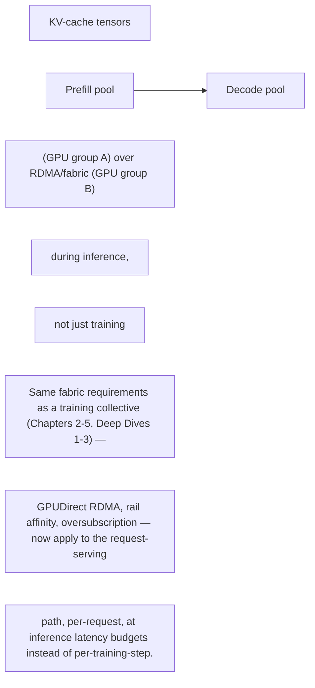

Kafka concepts from your study guide provide reusable reasoning patterns. A partition creates an ordered unit and parallelism boundary; replication trades capacity for fault tolerance; leader/follower state creates failover behavior; consumer lag measures backpressure. Map those ideas to AI systems: dataset shards, inference queues, checkpoint replicas, distributed schedulers and control-plane logs all have partitioning, replication and lag-like failure modes.

## Build from the normal path

**The mapping, made into a table so it's a fast recall tool rather than prose to re-derive live:**

| Kafka concept | AI-infra equivalent | Failure mode if ignored |
|---|---|---|
| Partition (ordering + parallelism boundary) | Dataset shard assigned to a rank/dataloader worker | Uneven shard sizes → straggler (Deep Dive 1) — the sharding IS the parallelism boundary, get it wrong and one worker becomes the bottleneck |
| Replication (capacity for fault tolerance) | Checkpoint replica count across storage/failure domains | Under-replicated checkpoint sitting in one failure domain = one event away from unrecoverable (Deep Dive 3's failure-domain point again, at the storage layer) |
| Leader/follower + failover | Primary/standby control-plane service (e.g. Slurm's `slurmctld` HA, or a scheduler leader-election) | Split-brain or failed failover = two components believing they're authoritative — same class of bug as any distributed system, no AI-specific exemption |
| Consumer lag (backpressure signal) | Inference request queue depth, or dataloader prefetch queue depth (Chapter 6) | Rising lag with no alerting = silent SLO breach discovered by users, not monitoring — identical shape to Kafka consumer-lag blindness |

**Diagram: dataset sharding as a partitioning boundary — uneven shards reproduce Deep Dive 1's straggler**

**Diagram: disaggregated serving's cross-node KV-cache path (the Dynamo tie-in below, drawn)**

**Interview-ready line:** "AI infrastructure doesn't need a new theory of distributed systems — sharding, replication, leader election and backpressure are the same four problems Kafka solves, wearing GPU-cluster clothing. Naming the Kafka-world term for what you're seeing is a fast way to signal you're reasoning from first principles, not pattern-matching on NVIDIA-specific vocabulary alone."

**Dynamo tie-in, worth one concrete sentence since the reference alone doesn't explain why it's here:** disaggregated serving (separating prefill and decode phases across different GPU pools) means KV-cache tensors move node-to-node *during inference*, not just during training collectives — so everything this volume covers about RDMA/GPUDirect/fabric design (Chapters 2-5, Deep Dives 1-3) now applies to the serving path too, which is the specific, current (2026) reason "accelerated networking is a serving concern, not only training" and worth stating unprompted if a Dynamo or disaggregated-serving question comes up.

## Targeted references and reinforcement

**NVIDIA Base Command Manager 11 release notes:** [https://docs.nvidia.com/base-command-manager/bcm-11-release-notes/](https://docs.nvidia.com/base-command-manager/bcm-11-release-notes/) — Current 2026 support context for Slurm, Enroot/Pyxis, CUDA and Network Operator.

**NVIDIA Dynamo disaggregated serving:** [https://docs.nvidia.com/dynamo/latest/user-guides/disaggregated-serving](https://docs.nvidia.com/dynamo/latest/user-guides/disaggregated-serving) — Cross-node KV transfer makes accelerated networking a serving concern, not only training.

**Staff Engineer study guide repository:** [https://github.com/jithinpnjm/studyguide-staff-engineer](https://github.com/jithinpnjm/studyguide-staff-engineer) — Distributed-log/partition/replication material used as a reasoning bridge, rewritten for AI infrastructure.

**NVIDIA Solutions Architect AI Infrastructure job signal:** [https://www.linkedin.com/jobs/view/senior-solutions-architect-ai-infrastructure-at-nvidia-4413184237](https://www.linkedin.com/jobs/view/senior-solutions-architect-ai-infrastructure-at-nvidia-4413184237) — Current SA family signal: compute/networking integration, POCs and accelerated networking for AI/HPC.
