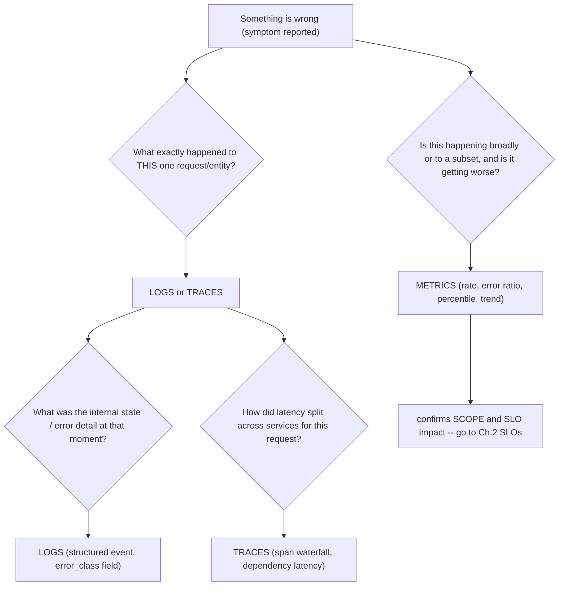
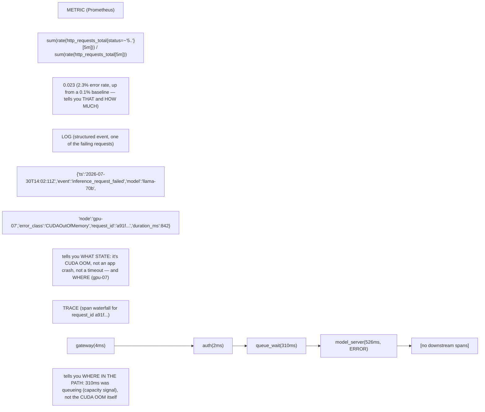
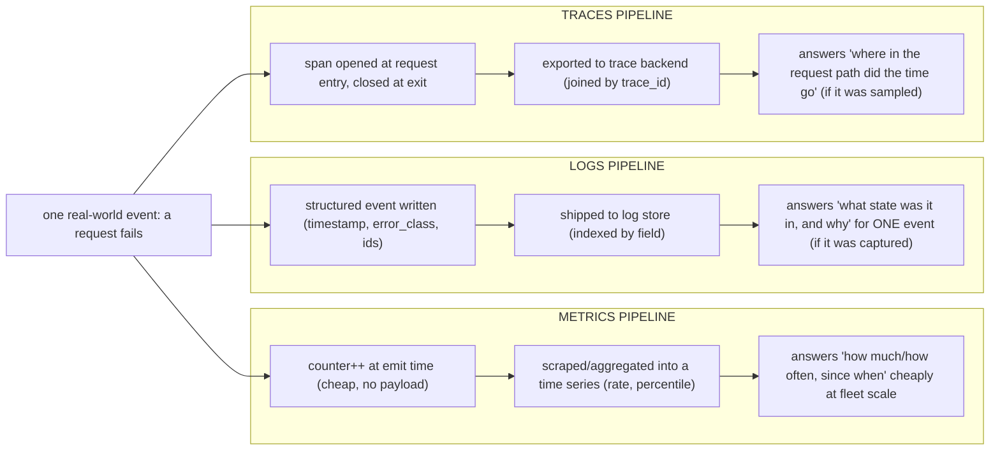

**VOLUME 7**

**Observability, Reliability and Troubleshooting**

From telemetry primitives to SLOs and full-stack incident diagnosis

> Fourth Edition - Teaching text with mechanisms, examples, visuals, scenarios and exercises

Independent study guide based on public documentation and public practitioner material. Not an NVIDIA publication.

*(original text preserved in full below; additions marked with ➕ so you can see exactly what changed)*

**Learning outcome:** Know what each telemetry type preserves and choose it by question.

Figure 1. Each evidence request should discriminate hypotheses and lead to a decision.

| Signal | Strength | Weakness |
|---|---|---|
| Metrics | cheap aggregation, trends, alerting, rates/percentiles | limited event context; labels/cardinality must be designed |
| Logs | rich event details, errors and state transitions | volume/cost; unstructured logs are hard to query |
| Traces | request path, spans and dependency latency | sampling/instrumentation complexity; not a replacement for metrics |

Telemetry is useful when it answers operational questions. Start from a user/workload symptom, define scope and SLO impact, then choose metrics/logs/traces. Dashboard browsing without a hypothesis can waste incident time.

➕ **Why this table is the correct opening move for the whole volume:** every later chapter (SLOs, PromQL, DCGM, incident playbooks) is really just "which of these three evidence types answers this specific question, and what does the other two look like when they lie to you." Memorize the failure mode of each signal, not just its strength:
- Metrics lie by **aggregation** — an average or a rate can look calm while individual requests are starving (see the TTFT-averaging trap in Deep Dive 5 and Chapter 7).
- Logs lie by **absence** — if the log line you need was never emitted (no correlation ID, no error class), no amount of `grep` recovers it after the fact.
- Traces lie by **sampling** — if the exact slow request wasn't sampled, the trace store has nothing to show you, no matter how good your instrumentation is.

➕ **Evidence-selection decision tree (the mechanism behind "choose it by question"):**

The point of the tree: metrics answer "how much/how often," logs answer "what state," traces answer "where in the request path." Asking a metric to answer a "what state" question (or grep'ing logs to answer a "how much" question) is the recurring anti-pattern this chapter is warning against.

➕ **Annotated example — the same incident seen through all three signals, showing what each one adds and what it alone cannot tell you:**

No single signal reconstructs the full incident. The metric told you it was real and quantified it; the log named the mechanism; the trace located it in the request path. This three-signal correlation is the model every later incident playbook chapter (9, 10) assumes you already have internalized.

➕ **Diagram: three evidence pipelines, running in parallel from the same event**

Same incident, three independent capture-and-store pipelines running the whole time — the chapter's table lists their strengths/weaknesses; this diagram is *when* each one commits its record, which is why a metric survives at fleet scale while a specific log line or trace can simply not exist for the one request you care about.

➕ **Shortcut / mnemonic:** *"Metrics count, Logs explain, Traces locate."* If an interviewer asks "why not just use logs for everything," the one-liner answer is: logs don't aggregate cheaply at scale (cardinality/volume cost) and don't natively show causality across services — that's what metrics and traces exist to solve, respectively.

**Interview-ready line:** "I pick telemetry by the shape of the question — metrics for 'how much and since when,' logs for 'what state and why,' traces for 'where in the request path' — and I never trust one signal alone to close an incident."

## Practice
➕ 1. Given only a Prometheus alert firing ("error ratio > 5%, 10m") and nothing else, write the exact next two queries/log searches you'd run before touching any dashboard, and justify the order.
➕ 2. A teammate proposes adding `user_id` and `full_prompt_text` as metric labels "for better debugging." Explain in two sentences why that request belongs in logs/traces instead, tying the answer to Chapter 3's cardinality warning.
