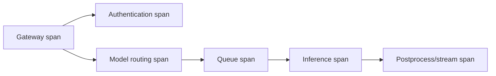
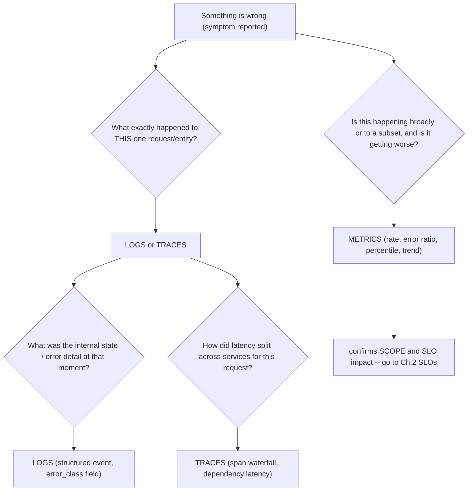
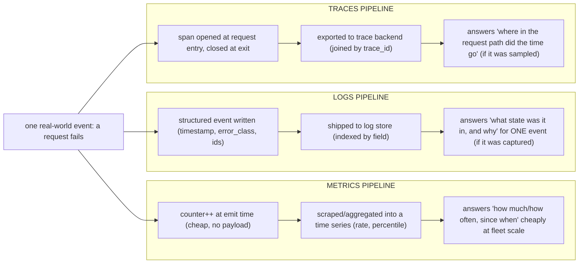

## Foundations: start here if observability and reliability are new to you

### What this volume is trying to teach

Reliability engineering keeps a service useful under expected operation and failure. Observability helps engineers understand internal system behavior from emitted evidence. Monitoring asks known questions continuously; observability also supports investigation when the exact failure was not predicted in advance.

Neither means collecting every possible metric. The goal is to connect user-visible outcomes to evidence across the request or job path.

### The first mental model

| Evidence | Best at answering | Limitation |
|---|---|---|
| Metric | How much, how often, and how it changes over time | Usually lacks per-event detail |
| Log | What a component reported about a specific event | Can be noisy, missing or unstructured |
| Trace | Where one distributed request spent time | Sampling and instrumentation affect coverage |
| Event/state | What an orchestrator or system changed and why | Often describes control-plane view, not outcome |
| Profile | Where code or hardware spends resources | Requires focused collection and interpretation |

Use them together. A dashboard suggests scope and timing; logs/events explain decisions; traces locate latency; profiles prove resource use at deeper levels.

### Essential language

- An **SLI** is a measured indicator of service behavior, such as successful-request ratio.
- An **SLO** is a target for an SLI over a defined window.
- An **SLA** is a business/contractual commitment and may include consequences.
- An **error budget** is the allowed unreliability implied by an SLO.
- **Latency** is time taken; **throughput** is work completed per time; **saturation** is pressure on a constrained resource.
- An **alert** calls for attention because action may be required.
- An **incident** is service impact requiring coordinated response.
- A **runbook** is an executable decision aid for a known operational situation.

### Start from impact, not the loudest component

A high CPU metric may be healthy useful work. A failed replica may be harmless if redundancy absorbs it. Conversely, a small latency increase may violate a strict inference SLO. Begin with affected users/workloads, scope, duration and objective; then map downward to dependencies.

### A real-life example

An AI service has normal HTTP success rate but slow first-token latency. CPU and GPU metrics alone cannot locate the delay. Trace queueing, model routing, prefill, cache behavior and downstream dependencies; correlate request-length and concurrency distributions. Reliability is defined by the service outcome, not whether each component process is alive.

### Define reliability from a user's journey

For an inference API, a candidate SLI might be:

```text
good requests / eligible requests
```

"Good" must be explicit: correct HTTP result, completed within a latency threshold, and perhaps valid model response. "Eligible" must define exclusions carefully; excluding every difficult request makes the SLI dishonest.

An SLO of 99.9% good requests over 30 days permits approximately 0.1% bad eligible requests. If there are 10 million eligible requests, the budget is about 10,000 bad requests. Error budgets let teams discuss reliability and change risk quantitatively; they do not mean deliberately causing failures.

### Metrics: understand value types before PromQL

| Type | Behavior | Example |
|---|---|---|
| Counter | generally increases until process restart | requests completed, errors, bytes sent |
| Gauge | can increase or decrease | queue depth, memory in use, temperature |
| Histogram | counts observations in configured buckets plus sum/count | request duration, batch size |

For a counter, the raw value since process start is rarely the service rate you want. Prometheus `rate()` estimates per-second change over a range:

```promql
sum(rate(http_requests_total{status=~"5.."}[5m]))
/
sum(rate(http_requests_total[5m]))
```

This is an example error ratio. Production queries must account for label definitions, missing series, resets, traffic volume and which requests qualify.

**Cardinality** is the number of distinct label combinations. Labels such as unbounded request ID, user ID or raw URL can create enormous series counts and cost. Put high-cardinality detail in logs/traces rather than every metric label.

### Logs that can survive an incident

A useful structured record includes stable time, severity, service/component, operation, outcome and correlation identifiers where appropriate:

```json
{
  "timestamp": "2026-08-02T10:14:21.482Z",
  "severity": "ERROR",
  "service": "model-router",
  "operation": "select_replica",
  "model": "example-70b",
  "request_id": "req-8f12",
  "reason": "no_ready_replica",
  "queue_depth": 42
}
```

Do not log prompts, credentials or customer data by default. Decide redaction and retention as security/privacy requirements.

### Traces: one request across boundaries

A trace is composed of spans representing timed operations. Parent/child relationships show the critical path across services.



A slow trace helps locate where this sampled request spent time. It does not by itself establish fleet frequency or cause; correlate trace attributes with metrics and logs.

### GPU and AI observability needs workload outcomes

Layer metrics:

| Layer | Examples |
|---|---|
| User/API | success, TTFT, inter-token latency, total latency |
| Queue/engine | waiting requests, batch size, execution count, cache pressure |
| GPU | activity, memory allocation, power, clocks, errors |
| Host | CPU, memory pressure, storage/network behavior |
| Distributed | per-rank step time, collective time, stragglers |

GPU activity can be high while users receive poor throughput or latency. Conversely, low GPU activity may be expected during sparse traffic. Alert on service risk/actionable failure, then use component telemetry for diagnosis.

### Incident evidence tree

**Symptom:** P99 TTFT increased from 2s to 9s.

1. Confirm SLI query, time window and affected models/regions/tenants.
2. Check request arrival, input-length and concurrency distributions.
3. Separate queue time from prefill/engine time using metrics/traces.
4. Compare ready replicas and recent deployments/model reloads.
5. Correlate engine batch/admission/cache behavior.
6. Compare GPU/CPU/network/storage evidence only for affected replicas/nodes.
7. Choose the smallest safe mitigation: traffic shift, rollback, capacity, admission control or isolation based on evidence.
8. Validate the original TTFT SLI, not only component recovery.
9. Preserve timeline and create prevention actions with owners.

### Alert-design questions

Before paging:

- Is a user or critical capability at risk?
- Is urgency appropriate to the evaluation window?
- Can the receiver take a meaningful action?
- Does the alert identify service, scope and runbook?
- Will maintenance or low traffic make the signal misleading?
- Are duplicate symptoms grouped?

### Guided exercise

Given 60 minutes of request counts and latency histograms:

1. define the eligible request population;
2. calculate success and latency SLIs;
3. graph traffic, errors and latency together;
4. segment by model/region without uncontrolled cardinality;
5. propose one page, one ticket-level alert and one dashboard-only signal;
6. write the first three runbook decisions for the page.

### Official and local references

- [Prometheus documentation](https://prometheus.io/docs/)
- [Prometheus metric types](https://prometheus.io/docs/concepts/metric_types/)
- [PromQL basics](https://prometheus.io/docs/prometheus/latest/querying/basics/)
- [OpenTelemetry concepts](https://opentelemetry.io/docs/concepts/)
- [Google SRE book](https://sre.google/sre-book/table-of-contents/)
- [NVIDIA DCGM Learn](https://docs.nvidia.com/datacenter/dcgm/latest/learn/)
- [Triton metrics](https://docs.nvidia.com/deeplearning/triton-inference-server/user-guide/docs/user_guide/metrics.html)
- Local Staff guide: `consolidated_guides/observability_consolidated.md`
- Local SRE foundation: `09-observability-slos-and-incident-response.md`

### How to study this volume

Learn evidence types, SLIs/SLOs and Prometheus reasoning first. Then add Kubernetes/GPU visibility, logs, traces, alerts and incident workflows. For every dashboard or alert, write the decision it enables. Postpone senior internals until you can build an evidence tree from user symptom to component boundary.

### Check your understanding

**Q1: Why can a high CPU value be healthy?**
A: It may represent useful work. Establish user impact, saturation, latency, and the expected workload before treating utilization as a fault.

**Q2: What does one slow trace prove?**
A: It proves where that sampled request spent time. Metrics and broader samples are needed to establish fleet frequency and scope.

### Glossary

- **SLI** — a measured indicator of service behavior.
- **SLO** — a target for an SLI over a defined window.
- **Error budget** — the unreliability allowed by an SLO.
- **Metric** — a numeric time-series observation suited to rates, trends, and aggregation.
- **Log** — an event record describing component state or a decision.
- **Trace** — linked spans showing one request across boundaries.
- **Cardinality** — the number of distinct metric label combinations.

### Ready to continue

- Explain which question metrics, logs, and traces answer best.
- Define a user-centered SLI and its eligible population.
- State what a single signal proves and which corroborating evidence is still required.

**VOLUME 7**

**Observability, Reliability and Troubleshooting**

From telemetry primitives to SLOs and full-stack incident diagnosis

> Fourth Edition - Teaching text with mechanisms, examples, visuals, scenarios and exercises

Independent study guide based on public documentation and public practitioner material. Not an NVIDIA publication.

*(original text preserved in full below; additions marked with ➕ so you can see exactly what changed)*

**Learning outcome:** Know what each telemetry type preserves and choose it by question.


Figure 1. Each evidence request should discriminate hypotheses and lead to a decision.

| Signal | Strength | Weakness |
|---|---|---|
| Metrics | cheap aggregation, trends, alerting, rates/percentiles | limited event context; labels/cardinality must be designed |
| Logs | rich event details, errors and state transitions | volume/cost; unstructured logs are hard to query |
| Traces | request path, spans and dependency latency | sampling/instrumentation complexity; not a replacement for metrics |

Telemetry is useful when it answers operational questions. Start from a user/workload symptom, define scope and SLO impact, then choose metrics/logs/traces. Dashboard browsing without a hypothesis can waste incident time.

➕ **Why this table is the correct opening move for the whole volume:** every later chapter (SLOs, PromQL, DCGM, incident playbooks) is really just "which of these three evidence types answers this specific question, and what does the other two look like when they lie to you." Memorize the failure mode of each signal, not just its strength:
- Metrics lie by **aggregation** — an average or a rate can look calm while individual requests are starving (see the TTFT-averaging trap in Deep Dive 5 and Chapter 7).
- Logs lie by **absence** — if the log line you need was never emitted (no correlation ID, no error class), no amount of `grep` recovers it after the fact.
- Traces lie by **sampling** — if the exact slow request wasn't sampled, the trace store has nothing to show you, no matter how good your instrumentation is.

➕ **Evidence-selection decision tree (the mechanism behind "choose it by question"):**

The point of the tree: metrics answer "how much/how often," logs answer "what state," traces answer "where in the request path." Asking a metric to answer a "what state" question (or grep'ing logs to answer a "how much" question) is the recurring anti-pattern this chapter is warning against.

➕ **Annotated example — the same incident seen through all three signals, showing what each one adds and what it alone cannot tell you:**
```text
METRIC (Prometheus)
sum(rate(http_requests_total{status=~"5.."}[5m])) / sum(rate(http_requests_total[5m]))
0.023 (2.3% error rate, up from a 0.1% baseline — tells you THAT and HOW MUCH)
LOG (structured event, one of the failing requests)
{"ts":"2026-07-30T14:02:11Z","event":"inference_request_failed","model":"llama-70b",
"node":"gpu-07","error_class":"CUDAOutOfMemory","request_id":"a91f...","duration_ms":842}
tells you WHAT STATE: it's CUDA OOM, not an app crash, not a timeout — and WHERE (gpu-07)
TRACE (span waterfall for request_id a91f...)
gateway(4ms)
auth(2ms)
queue_wait(310ms)
model_server(526ms, ERROR)
[no downstream spans]
tells you WHERE IN THE PATH: 310ms was queueing (capacity signal), not the CUDA OOM itself
```
No single signal reconstructs the full incident. The metric told you it was real and quantified it; the log named the mechanism; the trace located it in the request path. This three-signal correlation is the model every later incident playbook chapter (9, 10) assumes you already have internalized.

➕ **Diagram: three evidence pipelines, running in parallel from the same event**

Same incident, three independent capture-and-store pipelines running the whole time — the chapter's table lists their strengths/weaknesses; this diagram is *when* each one commits its record, which is why a metric survives at fleet scale while a specific log line or trace can simply not exist for the one request you care about.

➕ **Shortcut / mnemonic:** *"Metrics count, Logs explain, Traces locate."* If an interviewer asks "why not just use logs for everything," the one-liner answer is: logs don't aggregate cheaply at scale (cardinality/volume cost) and don't natively show causality across services — that's what metrics and traces exist to solve, respectively.

**Interview-ready line:** "I pick telemetry by the shape of the question — metrics for 'how much and since when,' logs for 'what state and why,' traces for 'where in the request path' — and I never trust one signal alone to close an incident."

## Practice
➕ 1. Given only a Prometheus alert firing ("error ratio > 5%, 10m") and nothing else, write the exact next two queries/log searches you'd run before touching any dashboard, and justify the order.
➕ 2. A teammate proposes adding `user_id` and `full_prompt_text` as metric labels "for better debugging." Explain in two sentences why that request belongs in logs/traces instead, tying the answer to Chapter 3's cardinality warning.
