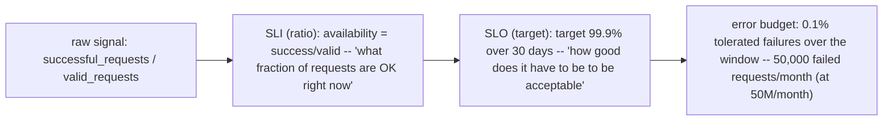

## Define reliability from a user's journey

For an inference API, a candidate SLI might be:

```text
good requests / eligible requests
```

"Good" must be explicit: correct HTTP result, completed within a latency threshold, and perhaps valid model response. "Eligible" must define exclusions carefully; excluding every difficult request makes the SLI dishonest.

An SLO of 99.9% good requests over 30 days permits approximately 0.1% bad eligible requests. If there are 10 million eligible requests, the budget is about 10,000 bad requests. Error budgets let teams discuss reliability and change risk quantitatively; they do not mean deliberately causing failures.

**Learning outcome:** Connect reliability work to measurable user outcomes instead of infrastructure percentages.

An SLI measures an outcome such as successful requests or latency under threshold. An SLO defines the target over a window. Error budget is the tolerated failure proportion. Infrastructure metrics explain causes, but an SLO should usually represent what the service/customer experiences.

```
availability = successful_requests / valid_requests
error_budget = 1 - target_slo
# 99.9% availability -> 0.1% error budget over the window
```

For training platforms, useful SLO-style measures might include job-start latency, successful completion rate, cluster availability or checkpoint/recovery expectations. For inference, request success and latency/tokens are closer to user experience.

**Turning the formula into an actual operating budget — worked arithmetic an interviewer expects instantly:**
```
Target SLO: 99.9% availability, 30-day rolling window
Total requests in window: 50,000,000
error_budget_ratio = 1 - 0.999 = 0.001
error_budget_requests = 50,000,000 * 0.001 = 50,000 failed requests allowed

If today's incident caused 12,000 failed requests:
budget_consumed = 12,000 / 50,000 = 24%  of the ENTIRE MONTH'S budget, in one incident
```
That last line — "24% of the month's budget in one incident" — is the sentence that makes error budgets real to a stakeholder who otherwise hears "99.9%" and assumes it means "basically never fails." Always convert the percentage into an absolute request count and a burn fraction; percentages alone don't communicate urgency.

**ASCII: error budget as a burn-down, and why burn RATE matters more than remaining balance:**


**Diagram: SLI to SLO to error budget, as one funnel**

Each stage narrows the question: the raw counters become one ratio (the SLI), the ratio gets a target (the SLO), and the gap between 100% and the target becomes a spendable budget in real request counts — the arithmetic worked above turns the rightmost box into the number stakeholders actually react to.

**Worked scenario — why an SLO must be the customer's SLO, not an infra metric wearing an SLO's clothes:**
> **Situation:** A training platform team sets an SLO on "node uptime ≥ 99.5%." Nodes are up 99.7% all quarter — SLO green throughout. Customers repeatedly complain training jobs "never actually finish on time."
> 1. Node uptime measures the *infrastructure's* claim, not the *job's* outcome — a node can be "up" (kubelet healthy, not cordoned) while its GPU is thermal-throttling, its NCCL collective is retrying, or its checkpoint write is silently failing.
> 2. The correct SLI is closer to the source-listed candidates for training platforms: job-start latency and successful completion rate — an SLI that fails exactly when the customer's actual experience fails.
> 3. Re-measuring with "successful completion rate" reveals 91% — a real, budget-consuming reliability problem the node-uptime metric had been masking for a full quarter.
> **Conclusion:** an SLO that can stay green while customers are unhappy is measuring the wrong thing — this is the single most common SLO-design mistake, and it is exactly the "infrastructure metrics explain causes, SLOs should represent customer experience" line from the core explanation made concrete.

**Shortcut:** *"If the SLO can be green while a customer is angry, it's the wrong SLI."* Use this as your gut check whenever asked to review someone else's proposed SLO in an interview.

**Interview-ready line:** "An error budget converts an abstract percentage into a concrete number of failures you're allowed before it's a policy conversation, not just an engineering one — that's what makes it actionable instead of aspirational."

## Practice
3. A service has a 99.95% latency SLO (p99 < 300ms) over a 7-day window with 20M requests/day. After a bad deploy, p99 breaches for 40 minutes. Estimate roughly how many requests were affected and what fraction of the weekly error budget that consumes, stating your assumptions.
4. Propose one SLI each for: (a) a GPU training cluster, (b) an LLM inference endpoint — and for each, name one infra metric a team might mistakenly substitute for it, using the node-uptime scenario above as the template for why that substitution fails.
