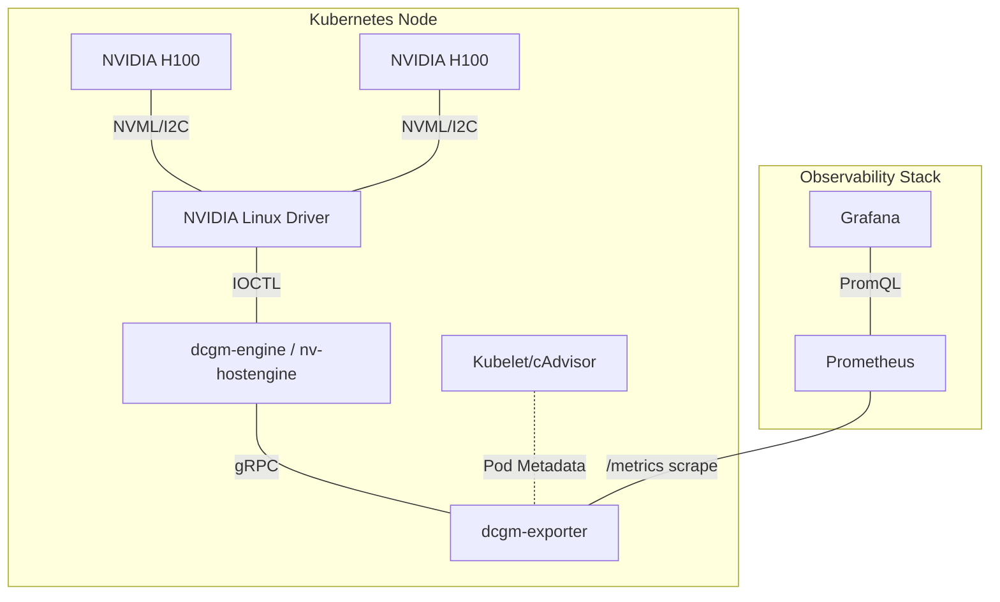
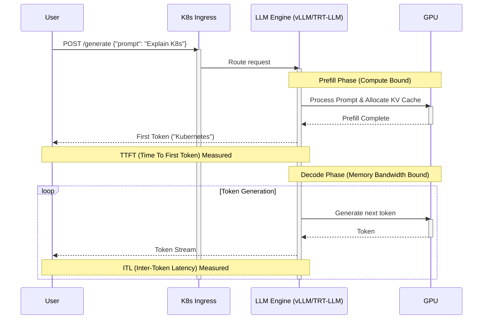

# Masterclass: Kubernetes GPU & Inference Observability

## Introduction: The Observability Gap in AI Infrastructure

Operating Large Language Models (LLMs) and massive distributed training jobs on Kubernetes introduces observability challenges that far exceed traditional microservices. In standard web applications, CPU, memory, and HTTP response times (RED metrics) are often sufficient to diagnose bottlenecks. In an NVIDIA AI Factory, the bottleneck could be anything from a congested PCIe Gen5 bus, an ECC memory error on an H100 GPU, a noisy neighbor saturating the InfiniBand network, or inefficient Key-Value (KV) cache allocation causing massive latency spikes during inference.

This masterclass is designed for Senior Platform Engineers, MLOps Practitioners, and AI Infrastructure Architects. We will build a complete, production-grade observability stack from the ground up, moving from basic Kubernetes cluster state monitoring to deep GPU telemetry via NVIDIA Data Center GPU Manager (DCGM), advanced application profiling, and finally, LLM-specific inference metrics (TTFT, ITL, TPOT).

By the end of this masterclass, you will understand how to trace an inference latency spike directly down to a hardware-level XID error or thermal throttling event.

---

## 1. The Kubernetes Observability Baseline

Before we can monitor GPUs, we must monitor the orchestrator that manages them. Kubernetes observability is fundamentally split into two domains:

1. **Object State (Control Plane):** What is the cluster *supposed* to be doing? (Deployments, Pods, Pending states).
2. **Runtime Evidence (Data Plane):** What are the nodes and containers *actually* doing? (cgroups, CPU/Mem, network I/O).

### 1.1 Kube-State-Metrics (KSM)

Kube-state-metrics listens to the Kubernetes API server and generates metrics about the state of the objects. For AI workloads, KSM is critical for identifying scheduling bottlenecks. When a massive MPIJob requests 512 GPUs, KSM will tell you why those Pods are stuck in a `Pending` state.

```yaml
# Example: Prometheus ServiceMonitor for kube-state-metrics
apiVersion: monitoring.coreos.com/v1
kind: ServiceMonitor
metadata:
  name: kube-state-metrics
  labels:
    app.kubernetes.io/name: kube-state-metrics
spec:
  jobLabel: app.kubernetes.io/name
  endpoints:
  - port: http
    interval: 15s
    scrapeTimeout: 10s
    metricRelabelings:
    # Drop high-cardinality metrics not needed for GPU clusters to save TSDB cardinality
    - action: drop
      regex: kube_endpoint_address_.*
      sourceLabels: [__name__]
  selector:
    matchLabels:
      app.kubernetes.io/name: kube-state-metrics
```

### 1.2 The Node Exporter and cAdvisor

While KSM handles cluster state, `node-exporter` handles host-level hardware metrics (CPU, RAM, Disk, Network). `cAdvisor` (embedded in the kubelet) handles container-level resource utilization. However, traditional cAdvisor is *blind* to GPU compute and GPU memory. This is why we need DCGM.

---

## 2. GPU Observability with DCGM (Data Center GPU Manager)

NVIDIA DCGM is a suite of tools for managing and monitoring NVIDIA datacenter GPUs in cluster environments. It provides low-overhead telemetry, diagnostics, and system validation. 

### 2.1 The DCGM Architecture

:::info DCGM Agent
The DCGM architecture separates the metrics collection engine (`nv-hostengine`) from the metrics exporter (`dcgm-exporter`) to maintain stability and performance.
:::



The standard deployment in Kubernetes is `dcgm-exporter`. It reads metrics from the `nv-hostengine` and formats them for Prometheus. Crucially, `dcgm-exporter` connects to the Kubelet API to append Kubernetes-specific labels (Pod Name, Namespace, Container) to the hardware metrics.

### 2.2 Production `dcgm-exporter` Deployment

Do not run `dcgm-exporter` without careful configuration in production. By default, it might scrape too frequently, causing overhead, or not scrape the specific advanced metrics (like NVLink throughput or XID errors) you need for debugging distributed training.

Here is a production-grade `DaemonSet` configuration for `dcgm-exporter`.

```yaml
apiVersion: apps/v1
kind: DaemonSet
metadata:
  name: dcgm-exporter
  namespace: gpu-operator
  labels:
    app.kubernetes.io/name: dcgm-exporter
spec:
  updateStrategy:
    type: RollingUpdate
  selector:
    matchLabels:
      app.kubernetes.io/name: dcgm-exporter
  template:
    metadata:
      labels:
        app.kubernetes.io/name: dcgm-exporter
    spec:
      containers:
      - name: exporter
        image: nvcr.io/nvidia/k8s/dcgm-exporter:3.3.5-3.4.0-ubuntu22.04
        env:
        - name: "DCGM_EXPORTER_LISTEN"
          value: ":9400"
        - name: "DCGM_EXPORTER_KUBERNETES"
          value: "true"
        - name: "DCGM_EXPORTER_COLLECTORS"
          value: "/etc/dcgm-exporter/custom-metrics.csv"
        # Enable device mapping to map logical GPU IDs to physical UUIDs
        - name: "DCGM_EXPORTER_DEVICE_PREFIX"
          value: "nvidia.com/gpu"
        ports:
        - name: metrics
          containerPort: 9400
        securityContext:
          runAsNonRoot: false
          runAsUser: 0
        volumeMounts:
        - name: pod-info
          mountPath: /var/lib/kubelet/pod-resources
          readOnly: true
        - name: custom-metrics
          mountPath: /etc/dcgm-exporter/custom-metrics.csv
          subPath: custom-metrics.csv
      volumes:
      - name: pod-info
        hostPath:
          path: /var/lib/kubelet/pod-resources
      - name: custom-metrics
        configMap:
          name: dcgm-custom-metrics
```

### 2.3 The `custom-metrics.csv`

The default metrics configuration is often too basic. For Large Language Model (LLM) inference and large-scale training, you need visibility into PCIe bandwidth, NVLink bandwidth, NVLink error counters, and memory ECC errors.

```yaml
apiVersion: v1
kind: ConfigMap
metadata:
  name: dcgm-custom-metrics
  namespace: gpu-operator
data:
  custom-metrics.csv: |
    # Format: 
    # DCGM_FIELD, Prometheus_Metric_Name, Prometheus_Metric_Type, Description
    
    # Core utilization
    DCGM_FI_DEV_SM_CLOCK, dcgm_sm_clock, gauge, SM clock frequency (in MHz).
    DCGM_FI_DEV_MEM_CLOCK, dcgm_memory_clock, gauge, Memory clock frequency (in MHz).
    DCGM_FI_DEV_GPU_UTIL, dcgm_gpu_utilization, gauge, GPU utilization (in %).
    DCGM_FI_DEV_MEM_COPY_UTIL, dcgm_mem_copy_utilization, gauge, Memory utilization (in %).
    
    # Memory
    DCGM_FI_DEV_FB_TOTAL, dcgm_fb_total, gauge, Framebuffer memory total (in MiB).
    DCGM_FI_DEV_FB_FREE, dcgm_fb_free, gauge, Framebuffer memory free (in MiB).
    DCGM_FI_DEV_FB_USED, dcgm_fb_used, gauge, Framebuffer memory used (in MiB).
    
    # Power and Thermal
    DCGM_FI_DEV_POWER_USAGE, dcgm_power_usage, gauge, Power draw (in W).
    DCGM_FI_DEV_GPU_TEMP, dcgm_gpu_temp, gauge, GPU temperature (in C).
    
    # PCIe & NVLink (Critical for Distributed workloads)
    DCGM_FI_DEV_PCIE_TX_THROUGHPUT, dcgm_pcie_tx_bytes, gauge, PCIe TX Bandwidth (in bytes).
    DCGM_FI_DEV_PCIE_RX_THROUGHPUT, dcgm_pcie_rx_bytes, gauge, PCIe RX Bandwidth (in bytes).
    DCGM_FI_DEV_NVLINK_BANDWIDTH_TOTAL, dcgm_nvlink_bandwidth_total, gauge, NVLink Bandwidth total (in bytes).
    
    # Errors & Diagnostics
    DCGM_FI_DEV_XID_ERRORS, dcgm_xid_errors, gauge, Value of the last XID error encountered.
    DCGM_FI_DEV_ECC_SBE_VOL_TOTAL, dcgm_ecc_sbe, gauge, Single-bit ECC errors.
    DCGM_FI_DEV_ECC_DBE_VOL_TOTAL, dcgm_ecc_dbe, gauge, Double-bit ECC errors.
    
    # Profiling Metrics (Requires DCGM Profiling to be enabled)
    DCGM_FI_PROF_TENSOR_CORE_ACTIVE, dcgm_tensor_core_active, gauge, Tensor Core Activity ratio.
    DCGM_FI_PROF_DRAM_ACTIVE, dcgm_dram_active, gauge, DRAM Activity ratio.
```

### 2.4 Understanding Key GPU Metrics

- **`dcgm_gpu_utilization` vs `dcgm_tensor_core_active`**: GPU Utilization merely means a kernel is executing on the GPU. It does *not* mean the GPU is doing useful work. A GPU can be at 100% utilization while spinning on a memory lock, doing zero math. `dcgm_tensor_core_active` measures if the specialized matrix-multiply hardware (Tensor Cores), which do the heavy lifting in AI, are actually being used. High GPU utilization + Low Tensor Core activity usually indicates a memory-bound workload or unoptimized kernels.
- **`dcgm_nvlink_bandwidth_total`**: In a multi-GPU training job (e.g., using DeepSpeed or Megatron-LM), GPUs communicate via NVLink (AllReduce operations). If this metric is zero or very low during training, your job has fallen back to PCIe, and performance will be abysmal.
- **`dcgm_xid_errors`**: The most critical health metric. Non-zero values indicate a driver or hardware fault. XID 31 (Memory Page Fault) or XID 119/120 (GSP Firmware Errors) often require Pod restarts or node cordoning.

---

## 3. GPU Profiling in Kubernetes

While DCGM provides system-level telemetry, it doesn't tell you *what* the application code is doing. To bridge the gap, you need application-level profiling.

### 3.1 Nsight Systems (nsys)

NVIDIA Nsight Systems is a system-wide performance analysis tool designed to visualize an application’s algorithms, identify the largest opportunities to optimize, and tune to scale efficiently.

To use `nsys` in a Kubernetes pod, the pod needs specific capabilities.

```yaml
apiVersion: v1
kind: Pod
metadata:
  name: profile-workload
spec:
  containers:
  - name: training-container
    image: my-training-image:latest
    command: ["/bin/sh", "-c"]
    # We wrap our python script in the nsys command
    args: 
      - >
        nsys profile 
        --trace=cuda,osrt,nvtx,cudnn,cublas 
        --output=/workspace/profiles/profile_%p.qdrep 
        --force-overwrite=true 
        python train.py
    securityContext:
      # Required for Nsight Systems to trace properly inside a container
      capabilities:
        add: ["SYS_ADMIN"]
    resources:
      limits:
        nvidia.com/gpu: 1
```

*Note on Security: `SYS_ADMIN` is a highly privileged capability. In production, profiling should be done in dedicated staging environments or via strict RBAC and Admission Controllers.*

### 3.2 PyTorch Profiler Integration

For deep learning engineers, PyTorch's native profiler, augmented with NVIDIA's Kineto library, is the standard. It emits traces that can be viewed in TensorBoard.

```python
import torch
import torch.profiler

# Mock variables for example
model = lambda x: x
get_data = lambda: []
optimizer = None

with torch.profiler.profile(
    activities=[
        torch.profiler.ProfilerActivity.CPU,
        torch.profiler.ProfilerActivity.CUDA,
    ],
    schedule=torch.profiler.schedule(wait=1, warmup=1, active=3, repeat=2),
    on_trace_ready=torch.profiler.tensorboard_trace_handler('./logs/profiler'),
    record_shapes=True,
    profile_memory=True,
    with_stack=True
) as prof:
    for step, batch in enumerate(get_data()):
        if step >= (1 + 1 + 3) * 2:
            break
        # Mock operations
        prof.step()
```

When running this in Kubernetes, map the `./logs/profiler` directory to a PersistentVolume (PV) or an S3 bucket via an init-container so the traces persist after the pod completes.

---

## 4. Advanced Inference Metrics (LLM Observability)

:::tip LLM Metrics Paradigm
Deploying a model like Llama 3 70B on NVIDIA Triton Inference Server, vLLM, or TensorRT-LLM introduces a new paradigm of observability. We no longer care just about "Request Latency". LLM inference is a streaming process. We must measure the different phases of generation.
:::



### 4.1 The Golden Metrics of LLM Inference

1.  **TTFT (Time To First Token):** The time from when the request hits the server to when the first generated token is returned. This measures the *Prefill Phase*, where the model processes the prompt and allocates the KV Cache. High TTFT means the server is overloaded, the prompt is massive, or KV cache allocation is blocked.
2.  **ITL (Inter-Token Latency):** The average time between consecutive generated tokens. This measures the *Decode Phase*. High ITL directly impacts user experience (the text generation looks slow/stuttery). It is strictly bottlenecked by GPU Memory Bandwidth.
3.  **TPOT (Time Per Output Token):** Similar to ITL, but often averaged over the entire sequence.
4.  **End-to-End Latency:** Total time for the request. (TTFT + (Number of Output Tokens * ITL)).
5.  **KV Cache Utilization:** The percentage of pre-allocated GPU memory used for storing attention keys and values. If this hits 100%, new requests are queued, severely impacting TTFT.

### 4.2 PromQL Queries for Inference

Assuming you are using an inference server that exports Prometheus metrics (like vLLM or Triton with the Prometheus endpoint enabled):

**Query: Average TTFT (Time To First Token) over 5m**
```promql
rate(vllm:time_to_first_token_seconds_sum[5m]) 
/ 
rate(vllm:time_to_first_token_seconds_count[5m])
```

**Query: P99 Inter-Token Latency**
```promql
histogram_quantile(0.99, sum(rate(vllm:time_per_output_token_seconds_bucket[5m])) by (le))
```

**Query: KV Cache Saturation**
```promql
vllm:gpu_cache_usage_perc > 0.90
```

---

## 5. The NVIDIA AI Factory Observability Stack

A true production environment merges K8s metrics, DCGM metrics, and Inference metrics into a single pane of glass.

### 5.1 Massive Grafana Dashboard for LLM & GPU Observability

Below is a truncated, but highly functional JSON configuration for a Grafana dashboard that correlates GPU health with LLM inference latency.

```json
{
  "annotations": {
    "list": [
      {
        "builtIn": 1,
        "datasource": "-- Grafana --",
        "enable": true,
        "hide": true,
        "iconColor": "rgba(0, 211, 255, 1)",
        "name": "Annotations & Alerts",
        "type": "dashboard"
      }
    ]
  },
  "editable": true,
  "fiscalYearStartMonth": 0,
  "graphTooltip": 0,
  "links": [],
  "liveNow": false,
  "panels": [
    {
      "title": "GPU Utilization (DCGM)",
      "type": "timeseries",
      "datasource": "Prometheus",
      "targets": [
        {
          "expr": "avg by(kubernetes_node) (dcgm_gpu_utilization)",
          "legendFormat": "{{kubernetes_node}}",
          "refId": "A"
        }
      ],
      "gridPos": { "h": 8, "w": 12, "x": 0, "y": 0 }
    },
    {
      "title": "Tensor Core Utilization",
      "type": "timeseries",
      "datasource": "Prometheus",
      "targets": [
        {
          "expr": "avg by(kubernetes_node) (dcgm_tensor_core_active)",
          "legendFormat": "{{kubernetes_node}}",
          "refId": "B"
        }
      ],
      "gridPos": { "h": 8, "w": 12, "x": 12, "y": 0 }
    },
    {
      "title": "LLM: P99 TTFT (Time To First Token)",
      "type": "timeseries",
      "datasource": "Prometheus",
      "targets": [
        {
          "expr": "histogram_quantile(0.99, sum(rate(vllm:time_to_first_token_seconds_bucket[2m])) by (le))",
          "legendFormat": "P99 TTFT",
          "refId": "C"
        }
      ],
      "gridPos": { "h": 8, "w": 8, "x": 0, "y": 8 },
      "fieldConfig": {
        "defaults": {
          "color": { "mode": "thresholds" },
          "thresholds": {
            "mode": "absolute",
            "steps": [
              { "color": "green", "value": null },
              { "color": "orange", "value": 0.5 },
              { "color": "red", "value": 1.0 }
            ]
          }
        }
      }
    },
    {
      "title": "LLM: KV Cache Usage",
      "type": "gauge",
      "datasource": "Prometheus",
      "targets": [
        {
          "expr": "avg(vllm:gpu_cache_usage_perc)",
          "legendFormat": "Cache %",
          "refId": "D"
        }
      ],
      "gridPos": { "h": 8, "w": 8, "x": 8, "y": 8 }
    },
    {
      "title": "Hardware: XID Errors",
      "type": "stat",
      "datasource": "Prometheus",
      "targets": [
        {
          "expr": "sum(dcgm_xid_errors > 0)",
          "legendFormat": "XID Error Count",
          "refId": "E"
        }
      ],
      "gridPos": { "h": 8, "w": 8, "x": 16, "y": 8 },
      "fieldConfig": {
        "defaults": {
          "color": { "mode": "thresholds" },
          "thresholds": {
            "mode": "absolute",
            "steps": [
              { "color": "green", "value": null },
              { "color": "red", "value": 1 }
            ]
          }
        }
      }
    }
  ],
  "refresh": "10s",
  "schemaVersion": 36,
  "style": "dark",
  "tags": ["kubernetes", "gpu", "llm"],
  "templating": {
    "list": []
  },
  "time": {
    "from": "now-1h",
    "to": "now"
  },
  "timepicker": {},
  "timezone": "",
  "title": "NVIDIA AI Factory Master Dashboard",
  "uid": "ai-factory-01",
  "version": 1
}
```

---

## 6. Senior Solutions Architect Troubleshooting Scenarios

This section covers real-world production outages and performance degradations, illustrating how to use the metrics discussed above to find the root cause.

### 6.1 Scenario 1: TTFT Spikes Under Load

**The Symptom:**
Users report that the AI chat application feels "unresponsive." Sometimes it takes 3-5 seconds for the bot to start typing.
The monitoring dashboard shows:
- `vllm:time_to_first_token_seconds` (TTFT) P99 is spiking from 0.2s to 4.5s.
- `vllm:time_per_output_token_seconds` (ITL) remains stable at 45ms.
- GPU Utilization (`dcgm_gpu_utilization`) is hovering around 85%.

**The Investigation:**
Because ITL is stable, we know the GPU memory bandwidth is not the bottleneck, and the GPUs are successfully processing the Decode phase. The delay is entirely in the Prefill phase (TTFT). 
1. We check `vllm:gpu_cache_usage_perc`. We see it is sitting at 99.5%.
2. We check K8s Ingress metrics. The request rate (RPS) has increased by 40%.

**The Root Cause:**
The KV Cache is saturated. LLM inference engines pre-allocate a chunk of GPU memory for the KV cache. When a new request arrives, it needs continuous blocks in the KV cache to store its attention states (Prefill). Because the cache is 99.5% full from ongoing requests, the engine puts the *new* request into a queue. The 4.5s TTFT is not compute time; it is queue time. The engine is waiting for older requests to finish and free up their KV cache slots.

**The Solution:**
1. **Short term:** Increase replica count (scale out the K8s Deployment) to distribute the load across more GPUs, thereby expanding the aggregate KV Cache available across the cluster.
2. **Medium term:** Evaluate if the `gpu_memory_utilization` flag in vLLM can be increased safely without causing OOMs, allocating a higher percentage of the physical VRAM to the KV cache.
3. **Long term:** Implement continuous batching tuning or evaluate chunked prefill techniques if long prompts are dominating the cache.

### 6.2 Scenario 2: XID 119 and Node Cordons

**The Symptom:**
A large 64-GPU (8-node) PyTorch distributed training job crashes after 14 hours. 
The K8s logs for the pod show a generic `CUDA error: uncorrectable ECC error encountered`.
Kube-state-metrics shows the Pod transitioned to `Failed`.

**The Investigation:**
1. We query Prometheus for `dcgm_xid_errors`. We see a spike to value `48` (Double Bit ECC error) and `119` (GSP firmware error) on `kubernetes_node="dgx-04"`, device `nvidia.com/gpu=3`.
2. We look at `dcgm_ecc_dbe` (Double Bit Errors). It incremented from 0 to 1 on that exact GPU at the time of the crash.

**The Root Cause:**
Hardware memory degradation. A cosmic ray or silicon defect caused a double-bit memory error in the H100's HBM. The NVIDIA driver caught it (XID 48), which caused the CUDA context to abort, crashing the training container.

**The Solution:**
1. The GPU operator should ideally have a node-problem-detector running that watches for XID 48/119 in `dmesg`.
2. When detected, the node is automatically `cordoned` via the K8s API so no new pods are scheduled.
3. The failing pod is evicted. The Job controller (e.g., Volcano or Kueue) schedules a replacement pod on a healthy node.
4. An infrastructure alert is fired to the SRE team to perform a hardware diagnostic (Field Service Request) on `dgx-04` GPU 3.

### 6.3 Scenario 3: NVLink Bandwidth Imbalance

**The Symptom:**
A customer complains that their Megatron-LM training job is scaling poorly. Moving from 1 node (8 GPUs) to 2 nodes (16 GPUs) resulted in only a 1.2x speedup instead of the expected 1.8x - 1.9x.

**The Investigation:**
1. We look at `dcgm_gpu_utilization`. It looks spiky, oscillating between 100% and 0%. This indicates a synchronization bottleneck; the GPUs are waiting for data.
2. We check `dcgm_nvlink_bandwidth_total`. On Node 1, it's near max capacity (~900 GB/s for H100). 
3. We check Network I/O (InfiniBand/RoCE) via `node-exporter` or custom IB exporters. Cross-node traffic is minimal, far below the 400Gbps capacity.
4. We look at `dcgm_pcie_tx_bytes`. We see massive spikes on the PCIe bus.

**The Root Cause:**
The NCCL (NVIDIA Collective Communications Library) topology detection failed or was misconfigured. Instead of using InfiniBand/RoCE for cross-node communication via GPU-Direct RDMA, NCCL fell back to routing traffic over the PCIe bus to the CPU, then out through the standard host ethernet. This severely chokes the AllReduce operations.

**The Solution:**
Ensure the Pod has the correct network annotations (e.g., Multus for secondary RDMA interfaces) and that the environment variables `NCCL_DEBUG=INFO` and `NCCL_IB_HCA=mlx5` are set correctly. Check the pod logs for NCCL startup strings to verify it has discovered the InfiniBand interfaces and GPU-Direct RDMA is established.

---

## 7. Senior Interview Questions & Answers

**Q: How does `dcgm-exporter` map a physical GPU (e.g., PCIe Bus ID 0000:81:00.0) to a Kubernetes Pod name?**
**A:** `dcgm-exporter` uses the Kubelet's `pod-resources` gRPC API. The Kubernetes device plugin advertises GPUs to the kubelet using UUIDs. When a Pod requests a GPU, the kubelet assigns a UUID. `dcgm-exporter` queries this local gRPC endpoint (`/var/lib/kubelet/pod-resources/kubelet.sock`), gets the mapping of Pod -> GPU UUID, and then uses NVML/DCGM to map the UUID to the physical hardware stats, appending the K8s metadata labels before exposing them to Prometheus.

**Q: You see high `dcgm_gpu_utilization` but low `dcgm_power_usage` and low `dcgm_tensor_core_active`. What is happening?**
**A:** The workload is likely memory-bound or PCIe-bound. The CUDA kernels are active (hence high utilization), but they are spending most of their time waiting for data to arrive from VRAM or over the PCIe bus. Because they are not doing intensive FP16/BF16 math on the Tensor Cores, the power draw remains relatively low.

**Q: Explain the difference between Continuous Batching and static batching, and how it affects the ITL metric.**
**A:** Static batching waits for a fixed number of requests to arrive, padding them to the same length, and processes them together. This causes massive latency for short requests waiting on long requests, skewing ITL. Continuous Batching (iteration-level scheduling) dynamically inserts new requests into the batch as soon as others finish, without waiting for the whole batch. This keeps GPU utilization extremely high and stabilizes ITL across requests of varying lengths.

---

## 8. Summary and Revisions

Kubernetes GPU Observability requires crossing the boundary between software orchestration (K8s) and deep hardware telemetry (NVIDIA DCGM). 
- Always ensure `dcgm-exporter` is configured with `custom-metrics.csv` to capture profiling, NVLink, and XID error data.
- Standard RED metrics do not apply to LLM Inference. Track TTFT, ITL, and KV Cache saturation.
- Correlate K8s cluster state (Pending/Failed Pods) with hardware state (XID errors) to automate node remediation.

### Cross-References
- For details on automated node cordoning based on XID errors, see `docs/volume-07/03-node-problem-detector-and-gpu-operator.md`.
- For deep dives into NCCL and GPU-Direct RDMA troubleshooting (Scenario 3), refer to `docs/volume-06/networking-in-ai-factories.md`.

### Further Reading
- [NVIDIA DCGM Documentation](https://docs.nvidia.com/datacenter/dcgm/latest/user-guide/index.html)
- [vLLM Metrics Output](https://docs.vllm.ai/en/latest/serving/metrics.html)
- [Understanding XID Errors](https://docs.nvidia.com/deploy/xid-errors/index.html)


## Extended Module 1: Multi-Node Training Traces and Observability Correlation

When a multi-node training job fails or degrades, standard observability isn't enough. You need correlated traces.

### 1. Correlating K8s Events with Prometheus Metrics

A classic problem is a `OOMKilled` event. In a CPU context, this is straightforward. In a GPU context, there is System OOM (host RAM) and GPU OOM (VRAM).

If a pod is `OOMKilled` (status 137), check:
1. `container_memory_working_set_bytes` (cAdvisor) -> If this hit the pod limit, it's a CPU RAM OOM.
2. `dcgm_fb_used` -> If this hit `dcgm_fb_total`, it's a CUDA OOM. *Crucially, a CUDA OOM does not usually cause the pod to be `OOMKilled` by the Kubelet. It causes a Python exception (`torch.cuda.OutOfMemoryError`), which causes the pod to crash with status 1 (Error).*

### 2. OpenTelemetry for Inference Pipelines

For complex RAG (Retrieval-Augmented Generation) pipelines, you cannot just look at TTFT in a vacuum. You must trace the entire user request:
- User -> API Gateway (Ingress)
- API Gateway -> Embedding Model (GPU)
- Vector DB lookup (CPU/Network)
- Prompt Builder (CPU)
- LLM Inference (GPU, where TTFT/ITL happen)

To do this, use OpenTelemetry (OTel). The NVIDIA Triton Inference Server has built-in OTel tracing support. You can configure it to export traces to Jaeger or Tempo.

```bash
# Example command line for Triton with OTel enabled
tritonserver \
  --model-repository=/models \
  --trace-config mode=opentelemetry \
  --trace-config opentelemetry,url=http://otel-collector:4318/v1/traces \
  --trace-config rate=1
```

By injecting the Trace ID from the K8s Ingress controller all the way down to the Triton C++ backend, you can perfectly measure the total end-to-end latency and immediately see if the bottleneck was the GPU (Triton) or the Network (Vector DB).

### 2. OpenTelemetry for Inference Pipelines

### 2. OpenTelemetry for Inference Pipelines

### 2. OpenTelemetry for Inference Pipelines

### 2. OpenTelemetry for Inference Pipelines

### 2. OpenTelemetry for Inference Pipelines

### 2. OpenTelemetry for Inference Pipelines

### 2. OpenTelemetry for Inference Pipelines

### 2. OpenTelemetry for Inference Pipelines

### 2. OpenTelemetry for Inference Pipelines

### 2. OpenTelemetry for Inference Pipelines

### 2. OpenTelemetry for Inference Pipelines

### 2. OpenTelemetry for Inference Pipelines

### 2. OpenTelemetry for Inference Pipelines

### 2. OpenTelemetry for Inference Pipelines