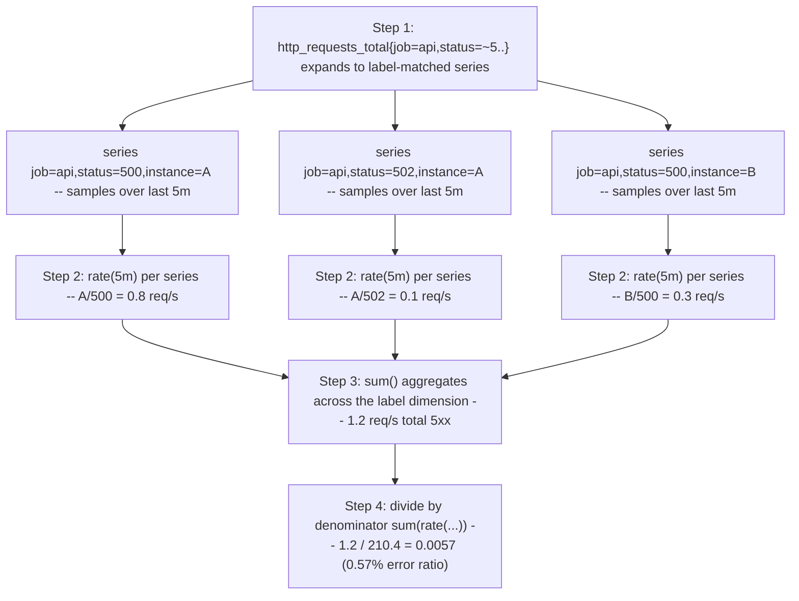
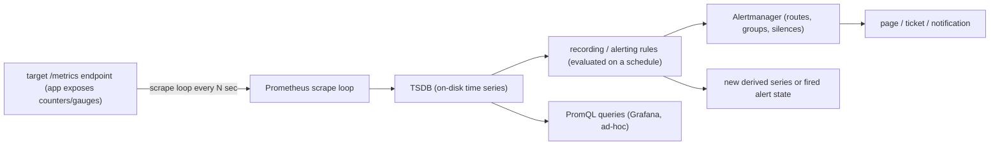

*(original text preserved in full below; additions marked with ➕)*

**Learning outcome:** Understand counters, gauges, histograms, rates and label dimensions before copying queries.

| Metric type | Use |
|---|---|
| Counter | monotonic event total; apply rate()/increase() over time |
| Gauge | current value that can go up/down |
| Histogram | bucketed observations enabling distributions/quantiles with aggregation |
| Summary | client-side quantiles/count/sum; aggregation trade-offs |

```promql
# Request rate
sum(rate(http_requests_total{job="api"}[5m]))

# 5xx ratio
sum(rate(http_requests_total{job="api",status=~"5.."}[5m]))
/
sum(rate(http_requests_total{job="api"}[5m]))
```

Always inspect label cardinality. User IDs, request IDs or unbounded model/session identifiers can explode time-series count. Use logs/traces for high-cardinality event identity when metrics do not need it.

➕ **Sample PromQL query result, annotated — what `rate()` is actually computing under the hood:**
```bash
$ curl -s 'http://prom:9090/api/v1/query?query=rate(http_requests_total{job='api'}[5m])' | jq .
{
'status': 'success',
'data': {
'resultType': 'vector',
'result': [
'metric': {'job': 'api', 'instance': '10.0.4.12:8080', 'status': '200'},
'value': [1753876800, '42.7'] ← 42.7 requests/sec, averaged over the trailing 5m window
},
'metric': {'job': 'api', 'instance': '10.0.4.13:8080', 'status': '200'},
'value': [1753876800, '0.03'] ← this instance is nearly idle — worth asking why vs its sibling
}
]
```
`rate()` looks at the counter's increase across the range vector, divides by the elapsed seconds, and — critically — extrapolates slightly at the edges and **auto-handles counter resets** (process restart resetting the counter to 0). This last point is the single most-asked PromQL interview detail: `rate()` is not "the difference between two points," it's reset-aware, which is exactly why you use `rate()`/`increase()` on counters and never raw subtraction.

➕ **PromQL query evaluation, visualized (what actually happens when you run the 5xx-ratio query above):**

The reason this matters operationally: if you `sum()` before `rate()` (i.e. `rate(sum(http_requests_total)[5m])`), you get a *syntax error* — Prometheus won't even let you do it in that order, because `rate()` requires a range vector, and `sum()` produces an instant vector. This ordering constraint is a good "do you actually know PromQL or just copy queries" filter question.

➕ **Diagram: the full scrape → TSDB → rule → alert pipeline this chapter's queries plug into**

Every query in this chapter (`rate()`, `histogram_quantile()`) runs against the TSDB box; a recording rule is just one of those queries pre-evaluated on a schedule and stored back into the TSDB as its own series, which is why Deep Dive 2 calls it "trading write-time cost for read-time cost." Alerting rules are the same query shape again, just routed to Alertmanager instead of a dashboard when the condition is true.

➕ **Cardinality-explosion scenario — the AI-inference-specific version of the label-cardinality warning above:**
> **Situation:** An inference gateway team adds `request_id` and `session_id` as labels on `inference_requests_total` "to make querying individual requests easier in Prometheus." Within a week, Prometheus memory usage grows from 4GB to 60GB and query latency for basic dashboards goes from 200ms to 12+ seconds.
> 1. Every unique combination of label values creates a new time series. `request_id` is unique per request by definition — this metric now creates a brand-new, never-reused time series for every single inference call, forever (until retention expires).
> 2. Check the actual blast radius: `prometheus_tsdb_head_series` (total active series) and `count by (__name__)(count({__name__=~".+"}))` to find which metric name dominates cardinality — `topk(10, count by (job)({__name__="inference_requests_total"}))` narrows it to the offending job.
> 3. Root cause and fix: `request_id`/`session_id` belong in **logs or trace attributes**, never in a metric label — this is exactly Chapter 1's evidence-selection tree: "what happened to THIS one request" is a logs/traces question, not a metrics question.
> 4. Remediation is not gentle: dropping the label going forward stops new cardinality growth, but the already-ingested high-cardinality series stay in TSDB until retention rolls them off — sometimes a `tombstone`/manual block deletion is warranted if memory pressure is acute.
> **Conclusion:** cardinality mistakes don't show up as errors — they show up as a slow, silent Prometheus memory/latency degradation, which makes them one of the harder "why is monitoring itself unhealthy" incidents to attribute quickly. Deep Dive 2 expands on the query-cost mechanics.

➕ **Shortcut — the one command to sanity-check cardinality risk on any metric before it ships:**
```bash
curl -s 'http://prom:9090/api/v1/query?query=count(count by (__name__)({__name__=~"your_metric.*"}))'
# or, more directly, ask "does any label on this metric have unbounded distinct values?"
# unbounded label smell test: user_id, request_id, session_id, pod UID, raw prompt text, IP address
```
**Mnemonic:** *"If a human could not write down all possible values of a label on a whiteboard, it doesn't belong on a metric."*

**Interview-ready line:** "Counters answer 'how much happened,' gauges answer 'what's the level right now,' and histograms answer 'what's the distribution' — and I check label cardinality before I ship a metric, not after Prometheus falls over."

## Practice
1. Write a PromQL expression for 5xx ratio and state assumptions about labels. *(also listed under Chapter 11's original Practice — the assumption to state explicitly: `status` is a label with low-cardinality bucketed values like "200"/"404"/"500", not raw numeric codes exploded further, and `job` scopes to one service.)*

➕ 2. A histogram metric `inference_duration_seconds` has buckets `[0.1, 0.5, 1, 2, 5, +Inf]`. Write the `histogram_quantile(0.95, ...)` query for p95 latency, and explain in one sentence why bucket boundary choice (not just the query) determines how *accurate* that p95 actually is.
➕ 3. Explain why a Summary's client-side quantile cannot be aggregated across instances (e.g. you cannot average five p99 Summary values from five pods to get a fleet-wide p99), while a histogram's `histogram_quantile()` can be computed correctly after `sum by (le)` across pods first.
