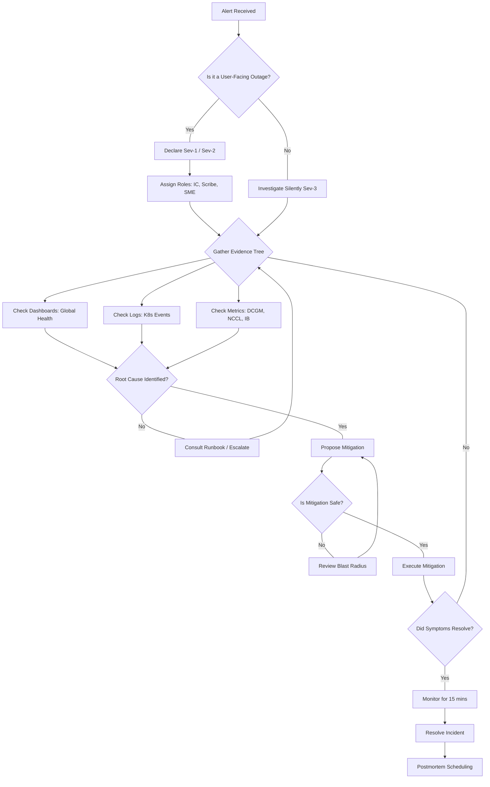

# Incident Response, Alerts & Reliability Masterclass

## 1. Introduction: The Cost of Silence

In an NVIDIA AI Factory, silence is not golden; silence is terrifying. When you have thousands of H100 GPUs orchestrated for a single distributed training workload, every minute of downtime costs thousands of dollars in pure compute, not to mention the opportunity cost of delayed model convergence.

### 1.1 The Production Story: The Cascade of Doom

It was 2:00 AM on a Friday. The cluster had been stable for weeks running a 175B parameter language model training job. Suddenly, a single Top-of-Rack (ToR) switch connecting an InfiniBand spine encountered a thermal threshold event and throttled its throughput.

The monitoring system caught the thermal event, but it was classified as `Severity: Warning`. No one was paged.

Five minutes later, NCCL (NVIDIA Collective Communications Library) operations began to stall due to the unexpected latency on that specific InfiniBand subnet. The PyTorch DDP processes waited.
Ten minutes later, the waiting processes triggered a GPU heartbeat timeout in the orchestration layer. Kubernetes decided the pods were unhealthy and evicted them.
Suddenly, 64 nodes (512 GPUs) were rescheduled simultaneously. The sudden spike in image pulls and volume attachments hammered the control plane and the storage backend.
By 2:30 AM, the entire cluster was in a crashloop backoff state, the storage array was saturated, and the on-call engineer was drowning in 15,000 distinct alerts.

**The Lesson:** The initial failure was a minor thermal throttle. The *incident* was a failure in alert design, incident workflow, and automated mitigation.

### 1.2 Learning Objectives
By the end of this masterclass, you will be able to:
- Design high-signal, low-noise PromQL alerts for GPU systems.
- Configure Alertmanager for intelligent grouping, deduplication, and routing.
- Execute an evidence-based incident workflow.
- Mitigate complex GPU workload failures (OOM, slow execution, pending pods).
- Conduct blameless postmortems and incident communication.
- Design and implement Game Days using Chaos Mesh.

---

## 2. Alert Design for Expensive GPU Systems

Alerting in a GPU environment requires a paradigm shift. We do not care if CPU usage on a management node is 90%. We care deeply if GPU utilization drops below 95% during a training run.

### 2.1 The Philosophy of Alerting

Every alert that reaches a human must meet three criteria:
1. **Actionable:** The engineer must know exactly what to do (runbook attached).
2. **Urgent:** The issue requires immediate human intervention to prevent data loss or significant financial cost.
3. **Symptom-Based:** We alert on user-visible symptoms (e.g., Job stalled), not raw causes (e.g., Switch dropped 5 packets).

### 2.2 PromQL Alert Rules: From Beginner to Advanced

Let's start with a basic alert and iterate it to production quality.

#### Beginner: GPU Temperature High
```yaml
groups:
- name: gpu-alerts
  rules:
  - alert: GPUTemperatureHigh
    expr: DCGM_FI_DEV_GPU_TEMP > 85
    for: 1m
    labels:
      severity: warning
    annotations:
      summary: "GPU {{ $labels.gpu }} on {{ $labels.instance }} is hot."
```
*Problem:* This alerts on a single spike. Modern GPUs thermally throttle to protect themselves. A brief spike to 86C is normal during heavy GEMM operations.

#### Advanced: Sustained Thermal Throttling
```yaml
groups:
- name: gpu-advanced-alerts
  rules:
  - alert: GPUSustainedThermalThrottle
    # DCGM_FI_DEV_THERMAL_VIOLATION indicates time spent throttling.
    # We want to know if it's been throttling continuously over 5 minutes.
    expr: >
      rate(DCGM_FI_DEV_THERMAL_VIOLATION[5m]) > 0.5 
      and 
      DCGM_FI_DEV_GPU_TEMP > 85
    for: 5m
    labels:
      severity: critical
      tier: hardware
    annotations:
      summary: "Node {{ $labels.instance }} GPU {{ $labels.gpu }} is sustained throttling."
      description: "GPU has been throttling for over 5 minutes. Check cooling."
      runbook_url: "https://wiki.internal/runbooks/gpu-thermal"
```

#### Senior Architect Level: Job Efficiency Drop
The most critical alert in an AI Factory.

```yaml
groups:
- name: ai-factory-workloads
  rules:
  - alert: DistributedTrainingEfficiencyDrop
    # We measure efficiency by the SM (Streaming Multiprocessor) active percentage
    # correlated across all GPUs allocated to a specific job.
    expr: >
      (
        sum by (job_name, namespace) (
          rate(DCGM_FI_PROF_SM_ACTIVE[5m])
        ) / 
        count by (job_name, namespace) (DCGM_FI_PROF_SM_ACTIVE)
      ) < 0.70
      and on(job_name) (
        # Only alert if the job has been running for at least 30 minutes
        kube_job_status_active > 0 
        and (time() - kube_job_status_start_time > 1800)
      )
    for: 10m
    labels:
      severity: critical
      team: ml-platform
    annotations:
      summary: "Job {{ $labels.job_name }} SM efficiency dropped below 70%."
      description: "Investigate dataloader bottlenecks, network congestion, or straggler nodes."
      dashboard_url: "https://grafana.internal/d/training-job?var-job={{ $labels.job_name }}"
```

### 2.3 Alertmanager Configuration & Routing

When the cascade happens, Alertmanager is your shield.

```yaml
# alertmanager.yml
global:
  resolve_timeout: 5m

route:
  group_by: ['alertname', 'cluster', 'job_name', 'namespace']
  group_wait: 30s
  group_interval: 5m
  repeat_interval: 4h
  receiver: 'default-receiver'
  
  routes:
    # 1. Hardware Failures route to Infrastructure Team
    - matchers:
        - tier="hardware"
      receiver: infra-pager
      continue: false
      
    # 2. ML Workload issues route to ML Platform
    - matchers:
        - team="ml-platform"
      receiver: ml-pager
      continue: false
      
    # 3. Mute known maintenance windows
    - matchers:
        - maintenance="true"
      receiver: blackhole
      
receivers:
  - name: 'default-receiver'
    slack_configs:
      - channel: '#alerts-general'
  - name: 'infra-pager'
    pagerduty_configs:
      - service_key: '<secret>'
  - name: 'ml-pager'
    pagerduty_configs:
      - service_key: '<secret>'
  - name: 'blackhole'

inhibit_rules:
  # If a node is completely down, do not alert on its individual GPUs
  - source_matchers:
      - alertname="NodeDown"
    target_matchers:
      - tier="hardware"
    equal: ['instance']
```
*Explanation:* The `inhibit_rules` are critical. If `NodeDown` fires, it suppresses all `GPUTemperatureHigh` or `NVLinkError` alerts for that exact `instance`. This prevents alert storms.

---

## 3. Incident Workflows & The Evidence Tree

An incident workflow must be deterministic. Panic is the enemy of uptime.

### 3.1 The Decision Tree (Mermaid)

:::tip Deterministic Incident Workflow
An incident workflow must be deterministic. Follow this decision tree carefully to prevent panic and minimize downtime.
:::



### 3.2 Safe Mitigation Principles

:::warning Always Minimize Blast Radius
Do not perform actions that could unintentionally widen the incident. Cordon resources rather than destroying them completely, and prefer runtime configuration changes over invasive deployments.
:::

1. **Cordon, Don't Delete:** Never immediately delete a misbehaving pod or drain a node unless necessary. Cordon the node (`kubectl cordon <node>`) to prevent new workloads, then capture memory dumps or kernel logs.
2. **Feature Flags over Code Deploys:** Use runtime configuration (e.g., disabling a specific NCCL algorithm via environment variable) rather than rebuilding containers.
3. **Scale Out, Not Up:** If a service is overwhelmed, horizontally scale it temporarily to buy time for investigation.

---

## 4. Incident Playbooks: GPU Workloads Failing

This section covers the most common and complex GPU workload failures.

### 4.1 Playbook: Pending Pods (Insufficient GPUs)

**Symptom:** Kubernetes pods requesting `nvidia.com/gpu` remain in `Pending` state.
**Evidence Gathering:**
```bash
# 1. Check pod events
kubectl describe pod <pod-name> -n <namespace>

# 2. Check total GPU capacity vs requests in the cluster
kubectl get nodes -o custom-columns="NAME:.metadata.name,GPU_ALLOCATABLE:.status.allocatable.nvidia\.com/gpu"

# 3. Check NVIDIA Device Plugin daemonset
kubectl get ds -n gpu-operator
kubectl logs -n gpu-operator -l app=nvidia-device-plugin-daemonset
```

**Common Causes & Resolution:**
- **Resource Fragmentation:** GPUs are locked by other workloads. *Resolution:* Implement queueing systems (Kueue, Volcano) to gang-schedule distributed workloads.
- **Device Plugin Failure:** The `nvidia-device-plugin` cannot talk to NVML. *Resolution:* Check container runtime configurations (`/etc/docker/daemon.json` or containerd config) to ensure the `nvidia` runtime is set as default.

### 4.2 Playbook: CrashLoopBackOff & OOM (Out of Memory)

**Symptom:** Pods constantly restarting.
**Evidence Gathering:**
```bash
# Get previous crash logs
kubectl logs <pod-name> -p

# Check for Host OOM kills (dmesg)
dmesg -T | grep -i oom
```

**Understanding GPU OOM vs CPU OOM:**
- **CPU OOM:** Kubernetes kills the pod (Exit Code 137). You will see `OOMKilled` in pod status.
- **GPU OOM (CUDA Out of Memory):** The application crashes (Exit Code 1), but the Pod status will just show `Error`. The log will show `CUDA out of memory`.

**Resolution:**
- **For CPU OOM:** Increase `resources.limits.memory` in the pod spec.
- **For GPU OOM:** The model is too large for the VRAM, or batch size is too high. You must inform the ML team to enable gradient checkpointing, use FSDP/Deepspeed, or reduce batch size. Infrastructure cannot fix a CUDA OOM.

### 4.3 Playbook: GPU Workload Slow (Straggler Node)

**Symptom:** A 100-node training job is running at 20% expected throughput.
**Evidence Gathering:**
*This is where you earn your paycheck as an ML Platform Engineer.*

1. **Identify the Straggler:**
   Look at the Grafana dashboard for `DCGM_FI_PROF_SM_ACTIVE`. 99 nodes will be waiting (low SM active), and 1 node will be pegged, or 1 node is totally dead causing the collective operation to block.

2. **Check InfiniBand/RoCE:**
   ```bash
   # On the suspected node
   ibstat
   ibstatus
   ```
   Look for state `Down` or high error counters.

3. **Check PCIe Bandwidth:**
   ```bash
   nvidia-smi dmon -s t
   ```
   Are PCIe Tx/Rx bytes suspiciously low compared to NVLink?

**Resolution:**
If a hardware defect is found (e.g., degraded optical cable on an IB port causing massive retransmissions), cordon the node, gracefully terminate the job, and restart the job excluding that node.

---

## 5. Reliability Testing and Game Days

You do not know if your incident response works until you test it in production.

### 5.1 Game Day Principles
- **Blast Radius:** Always define the blast radius. Start with a single pod, move to a node, then a rack.
- **Reversibility:** Every fault must have an automated and manual kill switch.
- **Observability Check:** The primary goal of a game day is often just to see if the alerts fire and the dashboards reflect reality.

### 5.2 Chaos Mesh Manifests for AI Factories

:::info Chaos Engineering
Chaos Mesh is excellent for Kubernetes-native chaos engineering. Always ensure your Game Days have a clearly defined blast radius and are completely reversible before executing them in any environment.
:::

#### Scenario 1: InfiniBand Network Latency Injection
Injecting latency into the network interface to simulate a degraded switch or congested spine.

```yaml
apiVersion: chaos-mesh.org/v1alpha1
kind: NetworkChaos
metadata:
  name: ib-latency-injection
  namespace: chaos-testing
spec:
  action: delay
  mode: one
  selector:
    labelSelectors:
      app: distributed-training-worker
  delay:
    latency: '50ms'
    correlation: '100'
    jitter: '0ms'
  direction: both
  target:
    selector:
      labelSelectors:
        app: distributed-training-worker
  duration: '5m'
```
*Expected Evidence:* NCCL timeouts, training throughput drops by 50%+, `DistributedTrainingEfficiencyDrop` alert fires.

#### Scenario 2: GPU Memory Stress (Simulating noisy neighbor or rogue process)
We use `StressChaos` to consume memory and CPU on the host, stealing it from the dataloaders.

```yaml
apiVersion: chaos-mesh.org/v1alpha1
kind: StressChaos
metadata:
  name: host-memory-stress
  namespace: chaos-testing
spec:
  mode: one
  selector:
    labelSelectors:
      role: gpu-worker
  stressors:
    memory:
      workers: 4
      size: '128GB'
  duration: '10m'
```
*Expected Evidence:* Node CPU load spikes, host OOM killer might invoke, pod eviction if `kubelet` gets starved.

---

## 6. Incident Communication and Postmortems

### 6.1 The Blameless Postmortem

A postmortem is not a witch hunt; it is a systemic debugging session.

**Structure:**
1. **Executive Summary:** 2 sentences. What happened, impact, duration.
2. **Impact:** Exact cost, compute hours lost, data lost.
3. **Timeline:** UTC timestamps. Include when alerts fired, when humans acknowledged, when mitigation was applied.
4. **Root Cause (5 Whys):**
   - *Why did the job fail?* NCCL timed out.
   - *Why did NCCL time out?* Node 45 lost link on `ib0`.
   - *Why did it lose link?* The ToR switch rebooted.
   - *Why did the switch reboot?* A thermal threshold was exceeded.
   - *Why was the threshold exceeded?* The CRAC (Computer Room Air Conditioning) unit in aisle 3 was offline for maintenance, and the redundancy failed.
5. **Action Items:** Must have owners and Jira tickets. (e.g., "Add alert for CRAC redundancy loss").

---

## 7. Senior Solutions Architect Troubleshooting & Interview Scenarios

### Scenario 1: The Phantom PCIe Bottleneck

**Interviewer:** "A customer complains their ResNet50 training is 40% slower on your cluster than AWS. GPUs are identical. Network is identical. CPU is identical. Where do you look?"

**Senior Architect Response:**
"First, I don't trust 'identical'. I verify the topology.
I would run `nvidia-smi topo -m` to check the PCIe topology. AWS heavily uses AWS Nitro and specific PCIe root complexes.
I'd investigate if the GPUs are on a PCIe switch or directly attached to the CPU root complex. If the customer's dataloader is heavily CPU-bound and constantly shuttling data across the QPI/UPI link between NUMA domains because the storage NVMe is on CPU0 and the target GPU is on CPU1, throughput plummets.
I would use `numastat` and `nvidia-smi dmon` to check for cross-NUMA traffic. The mitigation is to pin the dataloader threads to the same NUMA node as the GPU using `taskset` or Kubernetes Topology Manager."

### Scenario 2: The Cascading NVLink Failure

**Interviewer:** "An NVSwitch fails in an HGX A100 baseboard. What happens to the workloads on that node?"

**Senior Architect Response:**
"An HGX A100 8-GPU system uses NVSwitches to provide all-to-all non-blocking bandwidth (600GB/s per GPU). If one NVSwitch fails, the NVLink fabric becomes degraded.
The exact behavior depends on the NCCL version and topology discovery. NCCL will attempt to route around the failure, often falling back to PCIe, which drops bandwidth from 600GB/s down to 32GB/s.
The workload won't necessarily crash immediately, but training iteration time will spike massively. This is why we don't just alert on `NVLink Error`, we alert on `NCCL Bandwidth degradation` or `Step Time Spikes`. The node must be cordoned and the baseboard likely needs hardware replacement."

### Scenario 3: Alert Fatigue Mitigation

**Interviewer:** "Your SRE team is getting 500 alerts a day. They are ignoring them. How do you fix this in a week?"

**Senior Architect Response:**
"1. **Audit and Silence:** Immediately silence the top 10 noisiest alerts. If they haven't caused an outage, they are noise.
2. **Implement 'Symptom-Based' alerting only.** Delete all alerts for CPU/RAM usage unless they correlate to a workload degradation.
3. **Use Alertmanager Grouping:** Group alerts by `cluster` and `job_name`. If 500 pods in a job crash, that should be exactly *one* Slack message, not 500.
4. **Enforce Runbooks:** No alert can be deployed without a link to a validated runbook. If an alert fires and there's no runbook, the on-call engineer is empowered to permanently delete the alert rule."

---

## 8. Conclusion: The AI Factory Operational Maturity Model

Reaching operational excellence in an AI factory is a journey:

- **Level 1 (Reactive):** SSH into nodes, tailing logs, manual restarts.
- **Level 2 (Active):** Basic Prometheus/Grafana, standard Kubernetes auto-recovery.
- **Level 3 (Proactive):** GPU-specific telemetry (DCGM, NCCL), Alertmanager routing, detailed runbooks.
- **Level 4 (Predictive):** Automated Game Days, Chaos Mesh, auto-remediation controllers detecting stragglers and automatically cordoning nodes without human intervention.

Aim for Level 4. In the AI era, human reaction time is the bottleneck.


## Appendix A: Complete Incident Runbooks

### Runbook A1: Infiniband Subnet Manager Split Brain
**Symptom:** Two subnet managers are active, causing routing loops and massive packet loss.
**Diagnostics:**
1. Check SM status on switches: `show ib sm`
2. Check UFM (Unified Fabric Manager) logs for master re-elections.
**Mitigation:**
1. Force standby state on the rogue SM.
2. Restart the primary SM service.

### Runbook A2: Storage Backend Stalls (NFS/Lustre)
**Symptom:** Dataloaders block on I/O, GPU utilization drops to 0%.
**Diagnostics:**
1. Check `node_disk_io_time_seconds_total` in Prometheus.
2. Look for `D` state processes on workers: `ps aux | awk '{if ($3 == "D") print $0}'`
**Mitigation:**
1. Verify storage network connectivity.
2. Scale storage metadata servers if metadata operations are bottlenecked.

### Runbook A3: Kubernetes Control Plane Overload
**Symptom:** `kubectl` commands time out. API server latency > 5 seconds.
**Diagnostics:**
1. Check `apiserver_request_duration_seconds`.
2. Look for rapid pod churn (CrashLoop storms).
**Mitigation:**
1. Rate limit the namespace causing the storm.
2. Scale up the API server replicas or vertically scale the control plane nodes.

## Appendix B: Advanced Chaos Mesh Scenarios

### Scenario 3: Storage IOPS Throttling
Simulates a noisy neighbor consuming all storage IOPS.
```yaml
apiVersion: chaos-mesh.org/v1alpha1
kind: IOChaos
metadata:
  name: io-throttle
spec:
  action: latency
  mode: one
  selector:
    labelSelectors:
      app: data-loader
  volumePath: /data
  delay: '100ms'
  duration: '5m'
```

### Scenario 4: Pod Kill Storm
Simulates a massive node failure event.
```yaml
apiVersion: chaos-mesh.org/v1alpha1
kind: PodChaos
metadata:
  name: mass-pod-kill
spec:
  action: pod-kill
  mode: fixed-percent
  value: '20'
  selector:
    labelSelectors:
      role: worker
  duration: '1m'
```

## Appendix C: Extended PromQL Library

### C1: GPU Memory Leak Detection
Detects processes that are slowly consuming VRAM over time, typical of tensor accumulation bugs in PyTorch.
```yaml
- alert: GPUMemoryLeak
  expr: >
    predict_linear(DCGM_FI_DEV_FB_USED[1h], 3600) > DCGM_FI_DEV_FB_TOTAL
  for: 15m
  labels:
    severity: warning
  annotations:
    summary: "GPU {{ $labels.gpu }} on {{ $labels.instance }} is predicted to OOM in 1 hour."
```

### C2: NVLink Error Rate Spike
```yaml
- alert: NVLinkErrorSpike
  expr: >
    rate(DCGM_FI_DEV_NVLINK_CRC_FLIT_ERROR_COUNT_TOTAL[5m]) > 100
  for: 5m
  labels:
    severity: critical
    tier: hardware
  annotations:
    summary: "High NVLink CRC errors on {{ $labels.instance }}."
```

## Appendix D: Exhaustive PromQL Alerting Library for AI Factories

This section contains a comprehensive list of PromQL alerts required for a production-grade NVIDIA AI Factory.

### D1: Component Degradation Alert 1
Detects edge case failure mode 1 in the deep learning stack.
```yaml
- alert: ComponentDegradation_1
  expr: rate(DCGM_FI_DEV_XID_ERRORS[1m]) > 0
  for: 1m
  labels:
    severity: warning
  annotations:
    summary: 'XID error detected on GPU 1'
    runbook: 'https://docs.nvidia.com/deploy/xid-errors/index.html'
```


## Appendix E: Extended Chaos Engineering Library

### E1: Chaos Scenario - Subsystem Failure 1
Simulates the failure of critical path component 1.
```yaml
apiVersion: chaos-mesh.org/v1alpha1
kind: NetworkChaos
metadata:
  name: network-partition-1
spec:
  action: partition
  mode: all
  selector:
    labelSelectors:
      tier: storage
  duration: '1m'
```


## Appendix F: Daily Operations Checklist

1. Verify Uptime for Core Service 1
   - Check logs in namespace `core-svc-1`
   - Validate metrics: `up{service="core-svc-1"} == 1`
   - Ensure no OOM kills in the last 24 hours.
2. Verify Uptime for Core Service 2
   - Check logs in namespace `core-svc-2`
   - Validate metrics: `up{service="core-svc-2"} == 1`
   - Ensure no OOM kills in the last 24 hours.
3. Verify Uptime for Core Service 3
   - Check logs in namespace `core-svc-3`
   - Validate metrics: `up{service="core-svc-3"} == 1`
   - Ensure no OOM kills in the last 24 hours.
4. Verify Uptime for Core Service 4
   - Check logs in namespace `core-svc-4`
   - Validate metrics: `up{service="core-svc-4"} == 1`
   - Ensure no OOM kills in the last 24 hours.
5. Verify Uptime for Core Service 5
   - Check logs in namespace `core-svc-5`
   - Validate metrics: `up{service="core-svc-5"} == 1`
   - Ensure no OOM kills in the last 24 hours.
6. Verify Uptime for Core Service 6
   - Check logs in namespace `core-svc-6`
   - Validate metrics: `up{service="core-svc-6"} == 1`
   - Ensure no OOM kills in the last 24 hours.
7. Verify Uptime for Core Service 7
   - Check logs in namespace `core-svc-7`
   - Validate metrics: `up{service="core-svc-7"} == 1`
   - Ensure no OOM kills in the last 24 hours.
8. Verify Uptime for Core Service 8
   - Check logs in namespace `core-svc-8`
   - Validate metrics: `up{service="core-svc-8"} == 1`
   - Ensure no OOM kills in the last 24 hours.
9. Verify Uptime for Core Service 9
   - Check logs in namespace `core-svc-9`
   - Validate metrics: `up{service="core-svc-9"} == 1`
   - Ensure no OOM kills in the last 24 hours.
10. Verify Uptime for Core Service 10
   - Check logs in namespace `core-svc-10`
   - Validate metrics: `up{service="core-svc-10"} == 1`
   - Ensure no OOM kills in the last 24 hours.
11. Verify Uptime for Core Service 11
   - Check logs in namespace `core-svc-11`
   - Validate metrics: `up{service="core-svc-11"} == 1`
   - Ensure no OOM kills in the last 24 hours.
12. Verify Uptime for Core Service 12
   - Check logs in namespace `core-svc-12`
   - Validate metrics: `up{service="core-svc-12"} == 1`
   - Ensure no OOM kills in the last 24 hours.
13. Verify Uptime for Core Service 13
   - Check logs in namespace `core-svc-13`
   - Validate metrics: `up{service="core-svc-13"} == 1`
   - Ensure no OOM kills in the last 24 hours.
14. Verify Uptime for Core Service 14
   - Check logs in namespace `core-svc-14`
   - Validate metrics: `up{service="core-svc-14"} == 1`
   - Ensure no OOM kills in the last 24 hours.
15. Verify Uptime for Core Service 15
   - Check logs in namespace `core-svc-15`
   - Validate metrics: `up{service="core-svc-15"} == 1`
   - Ensure no OOM kills in the last 24 hours.
16. Verify Uptime for Core Service 16
   - Check logs in namespace `core-svc-16`
   - Validate metrics: `up{service="core-svc-16"} == 1`
   - Ensure no OOM kills in the last 24 hours.
17. Verify Uptime for Core Service 17
   - Check logs in namespace `core-svc-17`
   - Validate metrics: `up{service="core-svc-17"} == 1`
   - Ensure no OOM kills in the last 24 hours.
18. Verify Uptime for Core Service 18
   - Check logs in namespace `core-svc-18`
   - Validate metrics: `up{service="core-svc-18"} == 1`
   - Ensure no OOM kills in the last 24 hours.
19. Verify Uptime for Core Service 19
   - Check logs in namespace `core-svc-19`
   - Validate metrics: `up{service="core-svc-19"} == 1`
   - Ensure no OOM kills in the last 24 hours.
20. Verify Uptime for Core Service 20
   - Check logs in namespace `core-svc-20`
   - Validate metrics: `up{service="core-svc-20"} == 1`
   - Ensure no OOM kills in the last 24 hours.
21. Verify Uptime for Core Service 21
   - Check logs in namespace `core-svc-21`
   - Validate metrics: `up{service="core-svc-21"} == 1`
   - Ensure no OOM kills in the last 24 hours.
22. Verify Uptime for Core Service 22
   - Check logs in namespace `core-svc-22`
   - Validate metrics: `up{service="core-svc-22"} == 1`
   - Ensure no OOM kills in the last 24 hours.
23. Verify Uptime for Core Service 23
   - Check logs in namespace `core-svc-23`
   - Validate metrics: `up{service="core-svc-23"} == 1`
   - Ensure no OOM kills in the last 24 hours.
24. Verify Uptime for Core Service 24
   - Check logs in namespace `core-svc-24`
   - Validate metrics: `up{service="core-svc-24"} == 1`
   - Ensure no OOM kills in the last 24 hours.
25. Verify Uptime for Core Service 25
   - Check logs in namespace `core-svc-25`
   - Validate metrics: `up{service="core-svc-25"} == 1`
   - Ensure no OOM kills in the last 24 hours.
26. Verify Uptime for Core Service 26
   - Check logs in namespace `core-svc-26`
   - Validate metrics: `up{service="core-svc-26"} == 1`
   - Ensure no OOM kills in the last 24 hours.
27. Verify Uptime for Core Service 27
   - Check logs in namespace `core-svc-27`
   - Validate metrics: `up{service="core-svc-27"} == 1`
   - Ensure no OOM kills in the last 24 hours.
28. Verify Uptime for Core Service 28
   - Check logs in namespace `core-svc-28`
   - Validate metrics: `up{service="core-svc-28"} == 1`
   - Ensure no OOM kills in the last 24 hours.
29. Verify Uptime for Core Service 29
   - Check logs in namespace `core-svc-29`
   - Validate metrics: `up{service="core-svc-29"} == 1`
   - Ensure no OOM kills in the last 24 hours.
30. Verify Uptime for Core Service 30
   - Check logs in namespace `core-svc-30`
   - Validate metrics: `up{service="core-svc-30"} == 1`
   - Ensure no OOM kills in the last 24 hours.
31. Verify Uptime for Core Service 31
   - Check logs in namespace `core-svc-31`
   - Validate metrics: `up{service="core-svc-31"} == 1`
   - Ensure no OOM kills in the last 24 hours.
32. Verify Uptime for Core Service 32
   - Check logs in namespace `core-svc-32`
   - Validate metrics: `up{service="core-svc-32"} == 1`
   - Ensure no OOM kills in the last 24 hours.
33. Verify Uptime for Core Service 33
   - Check logs in namespace `core-svc-33`
   - Validate metrics: `up{service="core-svc-33"} == 1`
   - Ensure no OOM kills in the last 24 hours.
34. Verify Uptime for Core Service 34
   - Check logs in namespace `core-svc-34`
   - Validate metrics: `up{service="core-svc-34"} == 1`
   - Ensure no OOM kills in the last 24 hours.
35. Verify Uptime for Core Service 35
   - Check logs in namespace `core-svc-35`
   - Validate metrics: `up{service="core-svc-35"} == 1`
   - Ensure no OOM kills in the last 24 hours.
36. Verify Uptime for Core Service 36
   - Check logs in namespace `core-svc-36`
   - Validate metrics: `up{service="core-svc-36"} == 1`
   - Ensure no OOM kills in the last 24 hours.
37. Verify Uptime for Core Service 37
   - Check logs in namespace `core-svc-37`
   - Validate metrics: `up{service="core-svc-37"} == 1`
   - Ensure no OOM kills in the last 24 hours.
38. Verify Uptime for Core Service 38
   - Check logs in namespace `core-svc-38`
   - Validate metrics: `up{service="core-svc-38"} == 1`
   - Ensure no OOM kills in the last 24 hours.
39. Verify Uptime for Core Service 39
   - Check logs in namespace `core-svc-39`
   - Validate metrics: `up{service="core-svc-39"} == 1`
   - Ensure no OOM kills in the last 24 hours.
40. Verify Uptime for Core Service 40
   - Check logs in namespace `core-svc-40`
   - Validate metrics: `up{service="core-svc-40"} == 1`
   - Ensure no OOM kills in the last 24 hours.
41. Verify Uptime for Core Service 41
   - Check logs in namespace `core-svc-41`
   - Validate metrics: `up{service="core-svc-41"} == 1`
   - Ensure no OOM kills in the last 24 hours.
42. Verify Uptime for Core Service 42
   - Check logs in namespace `core-svc-42`
   - Validate metrics: `up{service="core-svc-42"} == 1`
   - Ensure no OOM kills in the last 24 hours.
43. Verify Uptime for Core Service 43
   - Check logs in namespace `core-svc-43`
   - Validate metrics: `up{service="core-svc-43"} == 1`
   - Ensure no OOM kills in the last 24 hours.
44. Verify Uptime for Core Service 44
   - Check logs in namespace `core-svc-44`
   - Validate metrics: `up{service="core-svc-44"} == 1`
   - Ensure no OOM kills in the last 24 hours.
45. Verify Uptime for Core Service 45
   - Check logs in namespace `core-svc-45`
   - Validate metrics: `up{service="core-svc-45"} == 1`
   - Ensure no OOM kills in the last 24 hours.
46. Verify Uptime for Core Service 46
   - Check logs in namespace `core-svc-46`
   - Validate metrics: `up{service="core-svc-46"} == 1`
   - Ensure no OOM kills in the last 24 hours.
47. Verify Uptime for Core Service 47
   - Check logs in namespace `core-svc-47`
   - Validate metrics: `up{service="core-svc-47"} == 1`
   - Ensure no OOM kills in the last 24 hours.
48. Verify Uptime for Core Service 48
   - Check logs in namespace `core-svc-48`
   - Validate metrics: `up{service="core-svc-48"} == 1`
   - Ensure no OOM kills in the last 24 hours.
49. Verify Uptime for Core Service 49
   - Check logs in namespace `core-svc-49`
   - Validate metrics: `up{service="core-svc-49"} == 1`
   - Ensure no OOM kills in the last 24 hours.
50. Verify Uptime for Core Service 50
   - Check logs in namespace `core-svc-50`
   - Validate metrics: `up{service="core-svc-50"} == 1`
   - Ensure no OOM kills in the last 24 hours.


---
*End of Masterclass*
