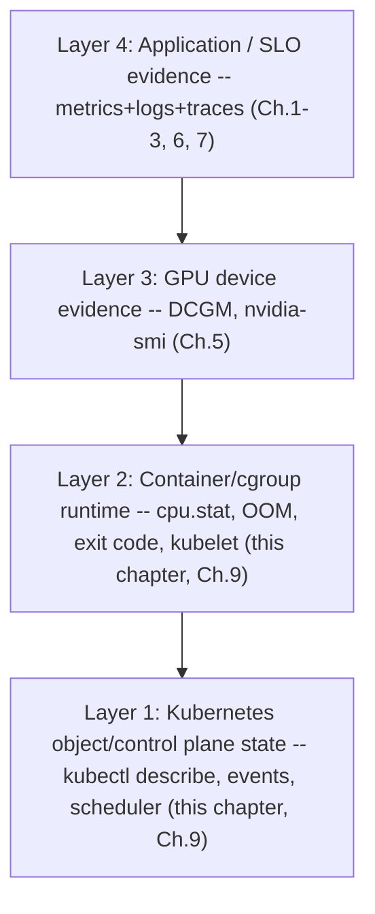
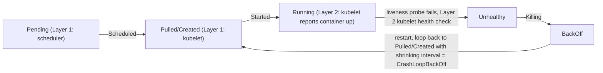

*(original text preserved in full below; additions marked with ➕)*

**Learning outcome:** Combine kube-state-style desired/observed state, kubelet/container metrics and application telemetry.

Kubernetes incidents require both control-plane/object evidence and runtime telemetry. A Pending Pod is best explained by status/events/scheduler constraints; CPU graphs cannot tell you why it never scheduled. A Running-but-slow Pod requires application and node/cgroup metrics. Choose the data source that owns the fact.

```bash
kubectl get events --sort-by=.lastTimestamp
kubectl get pod <pod> -o yaml
kubectl describe node <node>
```

➕ **"Choose the data source that owns the fact" — a lookup table because this line is the whole chapter compressed, and it's exactly what an interviewer is checking you can produce on demand:**
| Fact you need | Owning data source | Why the wrong source fails you |
|---|---|---|
| Why didn't this Pod get scheduled | `kubectl describe pod` events, scheduler | CPU/GPU dashboards show cluster capacity, not *this Pod's* placement constraints (taints, affinity, resource fit) |
| Why did this container restart | Pod status (`lastState.terminated`), kubelet | Prometheus container-restart *count* tells you it happened, not the reason (OOMKilled vs app exit vs liveness probe) |
| Why is a Running Pod slow | cgroup/node metrics (cpu.stat, memory.stat), APM/traces | Pod `phase: Running` is binary — it says nothing about performance |
| Why is GPU utilization low for a Running training Pod | DCGM + app-level step-time logs (Ch.5) | Kubernetes has no native concept of GPU utilization at all — it only tracks the device *allocation*, not usage |
| Why did a node go NotReady | node conditions + kubelet/journal logs | Pod-level events on that node will lag or vanish once the node stops reporting |

➕ **Sample `kubectl describe pod` events output, annotated field by field (the pattern this volume's Chapter 9 incident playbook depends on):**
```
$ kubectl describe pod inference-worker-7f9c-xk2p1
...
Events:
  Type     Reason            Age                From               Message
  ----     ------            ----               ----               -------
  Normal   Scheduled         12m                default-scheduler  Successfully assigned default/inference-worker-7f9c-xk2p1 to gpu-node-07
  Normal   Pulled            12m                kubelet            Container image already present on machine
  Normal   Created           12m                kubelet            Created container model-server
  Normal   Started           12m                kubelet            Started container model-server
  Warning  Unhealthy         2m (x6 over 5m)    kubelet            Liveness probe failed: Get "http://10.1.2.3:8000/health": context deadline exceeded
  Normal   Killing           2m                 kubelet            Container model-server failed liveness probe, will be restarted
  Warning  BackOff           30s (x2 over 45s)  kubelet            Back-off restarting failed container
```
Reading order that matters: **Scheduled → Pulled → Created → Started** is the happy path (already 12m old, so placement wasn't the problem here). The pivot is the `Unhealthy` line — `x6 over 5m` tells you this is a *repeated, worsening* pattern, not a one-off blip, and `context deadline exceeded` (not "connection refused") tells you the probe request reached the container but didn't get an answer in time — that's a latency/hang signature, not a crash signature. `BackOff` at the bottom is CrashLoopBackOff forming — the Age/count fields (`x2 over 45s`) tell you the backoff interval is compressing, i.e. it's actively getting worse, not stabilizing.

➕ **ASCII: the evidence layers for a Kubernetes incident, and which chapter/tool owns each layer:**

Incident triage direction: TOP-DOWN if the symptom is "SLO burning" (start at Layer 4, descend only as far as evidence forces you). BOTTOM-UP if the symptom is "Pod stuck/not scheduling" (Layer 1 first — it's a cheap check, and it rules out an entire category before you touch runtime telemetry at all).

➕ **Diagram: the Pod state sequence behind the annotated events above, and which layer generates each transition**

This is the state machine the `kubectl describe pod` events above are a log of — Scheduled/Pulled/Created/Started is Layer 1→2 handoff on the happy path, and Unhealthy→Killing→BackOff is Layer 2 detecting and reacting to a problem entirely on its own, before any Layer 3/4 evidence is even needed.

➕ **Worked scenario — the "Running but the data source lies" trap, specific to GPU workloads:**
> **Situation:** A GPU training Pod shows `Status: Running`, 0 restarts, all probes green for 6 hours. The training job's loss curve has been flat (not decreasing) for the last 2 hours. `kubectl get pod` shows nothing wrong.
> 1. Kubernetes object state is telling the truth about what it owns: the container process is alive, probes pass, no restarts. It has zero visibility into *whether the GPU is doing useful work* — that's outside its ownership boundary entirely.
> 2. Next data source, by the ownership table above: DCGM. `DCGM_FI_DEV_GPU_UTIL` for this Pod's GPU shows 98% — GPU looks busy.
> 3. High GPU util + flat loss is the tell for a training bug (bad gradient, NaN propagating silently, learning rate collapsed, or a distributed-training desync where the job is busy-spinning on a stuck collective) — not an infrastructure problem at all.
> 4. This is the point where the evidence correctly hands off to Layer 4 (application telemetry) — infra data sources (Layers 1-3) have all been exonerated, in order, and that exoneration is itself the finding.
> **Conclusion:** "green everywhere in kubectl and DCGM" can still mean the workload is broken — object-state and device-state evidence bound the *infrastructure's* correctness, not the *job's* correctness. Knowing where that boundary sits, and saying so explicitly, is what separates infra-fluent from infra-only reasoning in an interview.

➕ **Shortcut:** *"Pod phase is a lie detector for the container, not for the workload."* `Running` only certifies "the process kubelet started is still alive" — everything else needs its own evidence source, per the ownership table above.

**Interview-ready line:** "Kubernetes object state and runtime telemetry answer different questions — a Pending Pod is a scheduler-evidence problem, a slow Running Pod is a cgroup/application-evidence problem, and conflating the two is the most common wasted-time pattern I see in incident response."

## Practice
➕ 1. For each of these five symptoms, name which layer (1-4, from the ASCII diagram) owns the answer and one command/query you'd run first: (a) Pod stuck Pending 20 minutes, (b) Pod restarted 8 times in an hour, (c) node shows NotReady, (d) GPU util pinned at 100% but inference latency is fine, (e) inference latency p99 tripled with no restarts anywhere.
➕ 2. Reproduce the "Running but lying" scenario in a lab: deploy a Pod with a liveness probe that always passes but have the container's actual workload silently deadlock (e.g. a script that passes health checks via a separate thread while the main work loop hangs). Confirm `kubectl get pod` shows healthy the entire time.
