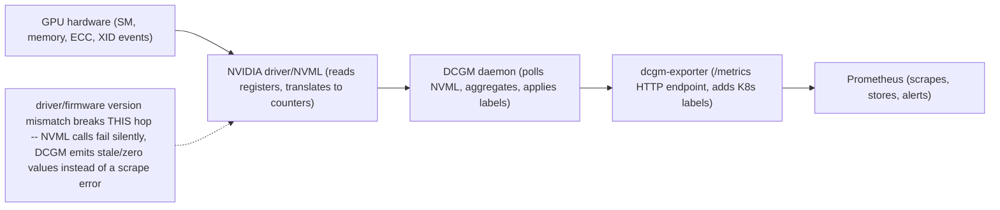

*(original text preserved in full below; additions marked with ➕)*

**Learning outcome:** Separate device health/utilization from workload demand and performance.

DCGM Exporter can expose GPU utilization, framebuffer memory, temperature, power and error/health-related metrics to Prometheus. Add Kubernetes ownership labels/joins so engineers can answer "which workload owns this GPU?" rather than staring at GPU index numbers.

For inference autoscaling, queue/demand metrics from the serving layer may be stronger triggers. For training, step time and collective/network behavior should be correlated with device utilization. The operational model is multi-layer.

## Practitioner lens
**Sagar Desai: GPU utilization is not service saturation**
A public post illustrates the distinction between DCGM hardware metrics and inference-server queue/request metrics. Use GPU telemetry to understand the device; use service telemetry to understand user demand and SLO saturation.

[Public source](https://www.linkedin.com/posts/sagar-s-desai_kubernetes-gpu-nvidia-activity-7413160079337684992-fOZI)

➕ **Sample DCGM Exporter Prometheus output, annotated field by field — the metric set worth having memorized:**
```bash
$ curl -s http://localhost:9400/metrics | grep -E 'DCGM_FI_DEV' | grep gpu='0'
DCGM_FI_DEV_GPU_UTIL{gpu='0',UUID='GPU-a1b2...',Hostname='gpu-node-07',pod='train-job-0',namespace='ml'} 97
DCGM_FI_DEV_FB_USED{gpu='0',UUID='GPU-a1b2...',pod='train-job-0'} 38214 ← MiB of framebuffer (device memory) used
DCGM_FI_DEV_FB_FREE{gpu='0',UUID='GPU-a1b2...',pod='train-job-0'} 2136 ← only ~2GB headroom left on an 80GB A100 slice
DCGM_FI_DEV_GPU_TEMP{gpu='0',UUID='GPU-a1b2...',pod='train-job-0'} 79 ← °C, within normal range (<85 typical throttle point)
DCGM_FI_DEV_POWER_USAGE{gpu='0',UUID='GPU-a1b2...',pod='train-job-0'} 385.4 ← watts, near TDP — GPU is genuinely working, not idling
DCGM_FI_DEV_SM_CLOCK{gpu='0',UUID='GPU-a1b2...',pod='train-job-0'} 1410 ← MHz; compare to rated boost clock to spot throttling
DCGM_FI_DEV_XID_ERRORS{gpu='0',UUID='GPU-a1b2...',pod='train-job-0'} 0 ← 0 is what you want; nonzero means driver-level fault events
DCGM_FI_DEV_ECC_DBE_VOL_TOTAL{gpu='0',UUID='GPU-a1b2...',pod='train-job-0'} 0 ← uncorrectable ECC errors; nonzero = hardware memory fault, not software
```
Reading order for a "is this GPU healthy vs busy" triage: **XID_ERRORS and ECC_DBE first** (any nonzero value here overrides everything else — it's a hardware-fault signal, go straight to Chapter 10/Deep Dive 4), then **UTIL+POWER+SM_CLOCK together** (all three should move together; if UTIL is high but POWER is low and SM_CLOCK is depressed, that's a throttling or stalling signature, not genuine compute), then **FB_USED/FB_FREE** (memory pressure — this is the metric that predicts CUDA OOM before it happens, seconds to minutes ahead).

➕ **Device health vs workload demand are orthogonal axes, not one scale — the multi-layer model the chapter names, made concrete:**

| | Low service saturation (queue/TTFT normal) | High service saturation (queue/TTFT degrading) |
|---|---|---|
| **High GPU util** | Quadrant A — genuinely busy, healthy device matched to demand | Quadrant B — busy but inefficient: check batch size, kernel launch overhead, memory-bound ops |
| **Low GPU util** | Quadrant D — idle and healthy, normal if demand is low | Quadrant C — the trap: device *reads* idle-ish while the service is actually degrading |

Quadrant C is the trap this chapter's practitioner-lens point names: GPU_UTIL reads modestly while queue depth/TTFT are degrading anyway, because the bottleneck is elsewhere (CPU-side tokenization, network, batching inefficiency, a single stuck worker not receiving traffic) — util alone cannot see this, which is exactly Sagar Desai's point above. Quadrant B is the inverse trap: util is pegged at 100% but that doesn't mean the GPU is doing useful work per request; it can mean tiny batch sizes driving kernel-launch-overhead-bound execution.

➕ **Diagram: the DCGM telemetry pipeline, and exactly where the silent-loss scenario below breaks it**

The scenario below is a break at the driver/NVML hop specifically: the exporter and Prometheus stay healthy (`up == 1`), so nothing downstream notices — which is exactly why the fix is a variance-based alert, not just an `up`-based one.

➕ **Worked scenario — silent DCGM telemetry loss (an evidence-availability failure, not a GPU failure):**
> **Situation:** An inference fleet's Grafana dashboards show `DCGM_FI_DEV_GPU_UTIL` flatlined at exactly 0 for 6 GPUs starting at 03:14, coincident with a driver update rollout. No alerts fired. Customers report normal service the whole time.
> 1. First hypothesis (wrong, but the tempting one): "6 GPUs went idle" — check inference request logs for those nodes: traffic and successful responses are completely normal throughout.
> 2. Second hypothesis (correct): the DCGM exporter itself lost the ability to query the driver post-update (a common NVML/driver-version mismatch failure mode) and is emitting a stale/zero last-known value instead of failing the scrape outright.
> 3. Confirming evidence: `up{job="dcgm-exporter"}` for those targets is still `1` (the exporter process is alive and scraping succeeds) — but `DCGM_FI_DEV_GPU_UTIL` staying at exactly 0.000 with zero variance for 6 straight hours, while every *other* correlated metric (power, temp) also flatlines at implausible fixed values, is the actual tell: the exporter is returning cached/default values because its NVML calls are failing silently.
> 4. Fix: match DCGM exporter/driver version compatibility explicitly in the upgrade runbook; add an alert not just on `up`, but on **metric variance** (e.g. `stddev_over_time(DCGM_FI_DEV_GPU_UTIL[30m]) == 0` while the node has active Pod scheduling) as a "telemetry is alive but not trustworthy" signal — this is a materially different failure than `up == 0`, and most DCGM alerting only checks the latter.
> **Conclusion:** a monitoring pipeline being *reachable* is not the same claim as it being *truthful* — silent telemetry loss (exporter up, values frozen/wrong) is a distinct and dangerous failure mode from telemetry being simply absent, because dashboards look populated and nobody notices.

➕ **Shortcut:** *"Correlate GPU UUID, not GPU index."* GPU index numbers (`gpu="0"`) can be reassigned across reboots/reschedules; `UUID` is the only identity guaranteed to survive them — this is exactly why the chapter calls for "Kubernetes ownership labels/joins," and it's the concrete mechanism behind Deep Dive 4's "correlate GPU UUID... so an incident survives node renumbering."

**Interview-ready line:** "DCGM tells me if the device is healthy and busy; it can't tell me if the *service* is saturated — those are two different telemetry planes, and I alert on both because high GPU utilization and a healthy customer experience are correlated, not identical."

## Practice
➕ 1. Using the metric list above, write the PromQL to alert on "framebuffer memory within 5% of capacity for 10 minutes" as an early-warning signal ahead of CUDA OOM, and explain why this is a better lead-time signal than alerting on the OOM event itself.
➕ 2. Design the "telemetry is alive but not trustworthy" alert from the scenario above as an actual PromQL expression, and state what legitimate (non-failure) condition could also produce zero variance, so you can explain why your alert wouldn't false-positive on it (hint: a genuinely idle, unscheduled GPU).
