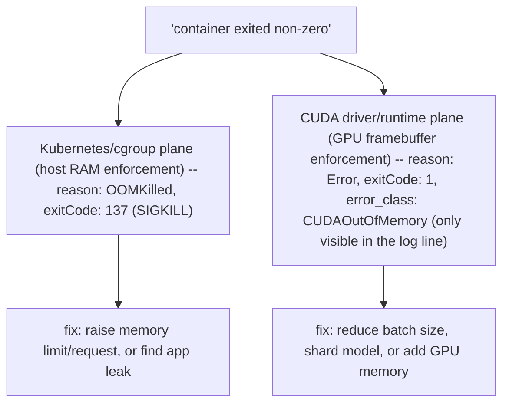

*(original text preserved in full below; additions marked with ➕)*

**Learning outcome:** Design event fields, severity and correlation; prevent secrets and noisy duplication.

A useful operational event contains timestamp, service/component, resource identity, operation, outcome, duration, attempt and correlation context where applicable. Log the error once at the layer with operational meaning; repeated stack traces at every layer increase noise. Sensitive prompts/tokens/credentials need explicit redaction policy.

```json
{
  "event": "model_load_failed",
  "model": "llama-x",
  "node": "gpu-12",
  "duration_ms": 18342,
  "attempt": 2,
  "error_class": "ArtifactTimeout"
}
```

➕ **The field list, as a checklist you can recite — annotate WHY each field earns its place, not just that it exists:**
| Field | Why it survives an incident |
|---|---|
| timestamp | orders events across services; without it, causality is a guess |
| service/component | scopes blast radius immediately — "which of my 40 services" |
| resource identity | (node, pod, GPU UUID, model name) — lets you join across DCGM/K8s/logs, per Ch.4/5 |
| operation | names what was being attempted, not just that something failed |
| outcome | success/failure as a structured field, not buried in free text — enables counting |
| duration | turns a log line into a latency data point — bridges logs toward metrics |
| attempt | distinguishes "failed once" from "failed and is retrying" — different urgency |
| correlation context | (trace/request ID) — the join key back to traces, per Ch.1/7 |

➕ **Diagram: correlation context is the join key that stitches one log line back to its metric and trace**
```text
METRIC series                    LOG line                              TRACE span
http_requests_total{             {'event':'inference_failed',          span_id=7d3e1a
 status='500'} +1           ◀──▶  'request_id':'a91f...',        ◀──▶  trace_id=a91f2c...
(fleet-wide count,                 'error_class':'CUDAOutOfMemory'}    (this one request's
 no request identity)              (the ONE event, full detail)        path across services)
                                             ▲
                                   correlation context field
                                   (request_id / trace_id) —
                                   the only thing that lets you
                                   go from 'the rate went up' to
                                   'here is the exact failing request'
```
Without the correlation-context field from the checklist above, the three signals in Chapter 1's table stay three separate, unjoinable pictures of the same incident — this field is what makes "three-signal correlation" (Ch.1) an actual query instead of a coincidence of timing.

➕ **The "log once at the layer with meaning" principle, shown as the anti-pattern it prevents:**
```text
BAD — the same failure logged 4 times, once per layer, all with stack traces
[gateway] ERROR: downstream call failed: <500-line stack trace>
[retry-wrapper] ERROR: retry exhausted: <500-line stack trace>
[model-server] ERROR: CUDA out of memory: <500-line stack trace>
[gpu-driver] ERROR: XID 79 (GPU fell off the bus): <driver dump>
4x the log volume, and an on-call engineer has to manually realize these are the SAME event.
GOOD — one structured event at the layer that has operational meaning (model-server,
where the actual mechanism is known), with attempt/correlation context letting the
gateway's failure be joined back to it instead of re-describing it
{'event':'inference_failed','layer':'model-server','error_class':'CUDAOutOfMemory',
'request_id':'a91f...','attempt':2,'upstream_retry_of':'gw-req-77213'}
gateway logs a ONE-LINE reference: {'event':'upstream_failed','request_id':'a91f...','forwarded_from':'model-server'}
```
➕ **The specific error_class distinction this chapter's own sample JSON invites you to generalize — and the one that most commonly gets alerting wrong (tie-in to Chapter 8/9): `OOMKilled` (cgroup/Kubernetes-level, host memory) vs `CUDAOutOfMemory` (device framebuffer memory) are different failure planes with different fixes** — raising a Kubernetes memory limit does nothing for the second, and adding GPU memory/reducing batch size does nothing for the first. A log's `error_class` field is frequently the *only* place this distinction survives, because `kubectl get pod` will show both as "container exited non-zero" with no further detail.

➕ **Diagram: two OOM failure planes that both look like "container exited non-zero" until you read error_class**

`kubectl get pod` shows both branches identically as "restarted, exited non-zero" — the `error_class` field is frequently the only surviving evidence of which branch you're actually on, which is why this chapter's field checklist insists on it.

➕ **Redaction policy — worked example, because "explicit redaction policy" as a phrase without a mechanism is not something you can demonstrate in an interview:**
```python
REDACT_KEYS = {"authorization", "api_key", "token", "password", "prompt", "completion"}

def safe_log_fields(raw: dict) -> dict:
    return {
        k: ("<redacted>" if k.lower() in REDACT_KEYS else v)
        for k, v in raw.items()
    }

# {"event": "inference_request", "model": "llama-x", "prompt": "<redacted>", "duration_ms": 812}
```
The operational trap: `prompt`/`completion` text is exactly the field engineers most want during debugging ("what input caused this crash?") and exactly the field most likely to contain PII or be contractually restricted from long-term log retention — this is a real tension, not a solved problem. The usual resolution: redact by default in the durable log sink, but allow short-TTL, access-controlled debug capture (e.g. a separate, tightly-retained store) opt-in per incident, not blanket capture.

➕ **Worked scenario — the AI-specific version of "log the error once, not four times," where the duplication is *cost*, not just noise:**
> **Situation:** An inference fleet logs the full prompt and full generated completion on every request "for debuggability," at 2,000 requests/sec, average combined prompt+completion of 4KB. Log ingestion costs and storage have become one of the platform's largest line items, and the security team has separately flagged prompt-body retention as a compliance risk.
> 1. Volume math: 2,000 req/s * 4KB * 86,400s/day ≈ 690 GB/day of raw text logging, most of which is never read.
> 2. This is the direct AI-infrastructure analogue of the chapter's "repeated stack traces at every layer increase noise" warning — except here the redundant/excessive data is the payload itself, not repetition across layers.
> 3. Fix: log structured metadata (model, token counts, duration, error_class, request_id) on every request by default; gate full prompt/completion capture behind sampling (e.g. 1% of traffic, or 100% only on already-failed requests) and the redaction policy above.
> **Conclusion:** "rich event details" (this chapter's stated strength of logs, from Chapter 1's table) has a cost curve — the right design captures richness *conditionally* (on failure, on sample), not unconditionally on every request.

➕ **Shortcut:** *"Structured field beats free-text grep, every time you'd need to count something."* If you ever find yourself writing a regex to extract a duration or error type out of a log message, that's a signal the field should have been structured at emission time, not parsed at query time.

**Interview-ready line:** "A log line's value is in its structured fields, not its prose — timestamp, resource identity, outcome, duration and a correlation ID are what let an incident be reconstructed and joined against metrics and traces after the fact."

## Practice
➕ 1. Take the chapter's own `model_load_failed` JSON example and add the two fields from the checklist table it's missing (correlation context, operation-as-distinct-from-event-name) — write the corrected JSON.
➕ 2. Design the sampling policy referenced in the worked scenario above as a concrete rule (e.g. "capture full prompt/completion if X, else only metadata") and justify the specific threshold you chose.
