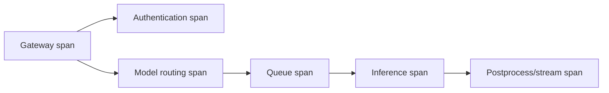
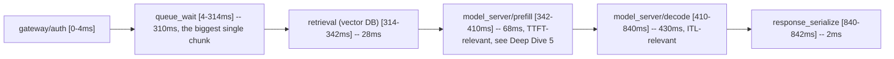
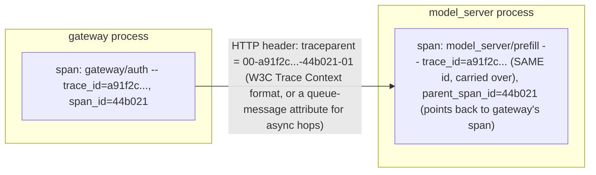

## Traces: one request across boundaries

A trace is composed of spans representing timed operations. Parent/child relationships show the critical path across services.



A slow trace helps locate where this sampled request spent time. It does not by itself establish fleet frequency or cause; correlate trace attributes with metrics and logs.

**Learning outcome:** Use spans to decompose request latency across gateway, queue, model server and dependencies.

A trace connects causal work across services. For inference, spans can separate gateway/auth, queueing, retrieval, model prefill/decode, external tool calls and state-store latency. Tracing is most valuable when services propagate context consistently and span attributes are bounded/meaningful.

**Span waterfall, made visual — the artifact this chapter is describing in prose, drawn out:**

(trace_id=a91f2c..., total=842ms)
Reading this waterfall the way an interviewer wants: total latency (842ms) is dominated by two things — `queue_wait` (310ms, a **capacity/admission** problem, nothing to do with the model) and `decode` (430ms, a **per-token generation** cost, proportional to output length). A team that only looks at "average end-to-end latency" would blend these two completely different bottleneck families into one number and optimize the wrong thing — this is the trace-level version of the averaging trap that Chapter 1 and Deep Dive 5 warn about at the metrics level.

**Sample OpenTelemetry span JSON (what actually gets exported/stored, one span from the waterfall above), annotated:**
```json
{
  "trace_id": "a91f2c4b8e...",
  "span_id": "7d3e1a",
  "parent_span_id": "44b021",
  "name": "model_server/prefill",
  "start_time_unix_nano": 1753876800342000000,
  "end_time_unix_nano": 1753876800410000000,
  "attributes": {
    "model": "llama-70b",
    "deployment": "prod-east",
    "input_tokens": 812,
    "gpu_node": "gpu-07"
  },
  "status": {"code": "OK"}
}
```
`parent_span_id` is the field that reconstructs the waterfall's nesting — without consistent propagation of `trace_id`/`parent_span_id` across a service boundary (an HTTP header, a queue message attribute), the two sides of that boundary produce **orphaned, unjoinable traces** — this is exactly the "propagate context consistently" requirement the chapter's last sentence names, made concrete: it is a hard technical requirement, not a nice-to-have.

**Diagram: trace-context propagation across the same service boundary the waterfall above crosses**

If this header is dropped at any hop — a proxy that strips unknown headers, a queue that doesn't forward message attributes — `model_server` starts a brand-new `trace_id` instead of inheriting one, and the waterfall above simply cannot be assembled: the two sides become orphaned, unjoinable traces, exactly as the OTel span JSON annotation above states.

**Worked scenario — TTFT degradation masked by an averaged latency dashboard, using this chapter's spans to find what the dashboard couldn't:**
> **Situation:** An inference service's dashboard shows "average end-to-end latency: 450ms, stable" for a week. A specific enterprise customer escalates that "the model feels like it's thinking forever before it starts responding" — their UX streams tokens, so users perceive TTFT, not total latency.
> 1. The average is a blend across all customers/request shapes; a customer sending long prompts (large `input_tokens`, hence long prefill) is invisible in a fleet-wide average dominated by short-prompt traffic.
> 2. Pull traces filtered to that customer's requests (via a `customer_id` **span attribute** — never a metric label, per Chapter 3's cardinality rule) — the waterfall shows `prefill` climbing from ~70ms to 900ms+ over the week while `decode` stays flat.
> 3. Cross-check against a metric that *isn't* an average: `histogram_quantile(0.95, ...)` on prefill duration, segmented by input-length bucket — confirms it's not one customer's imagination, p95 prefill for long-input requests has genuinely regressed.
> 4. Root cause direction: prefill duration scales with input length and available compute — check batching/scheduling (are long-prompt requests being batched inefficiently with short ones?) and KV-cache/memory pressure (Deep Dive 5's exact bottleneck-family table).
> **Conclusion:** "average is stable" and "no customer is having a bad time" are different claims — this scenario is the trace-level sibling of the throttling-vs-average trap from Volume 1 Chapter 1, applied to inference latency instead of CPU.

**Shortcut:** *"Averages hide, percentiles narrow, traces name."* A metric average tells you nothing is dramatically extreme on average; a percentile tells you how bad the tail is; a trace tells you exactly which span in exactly which request is the tail. Use all three in that order when a customer reports "it's slow" but dashboards look fine.

**Interview-ready line:** "A trace decomposes 'it's slow' into which span, in which service, for which request shape — that's the only telemetry type that can distinguish a queueing problem from a prefill problem from a decode problem, and those three have completely different fixes."

## Practice
1. Given the span waterfall above, write the PromQL-style question (not the query — the question in words) you'd ask of metrics to confirm whether the 310ms `queue_wait` is a fleet-wide capacity problem or isolated to this one trace.
2. Explain why `customer_id` is safe as a span attribute but unsafe as a Prometheus label, referencing both Chapter 1's evidence-selection tree and Chapter 3's cardinality rule in your answer.
