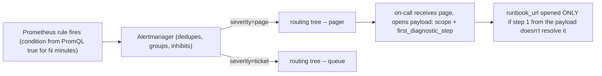

*(original text preserved in full below; additions marked with ➕)*

**Learning outcome:** Alert on actionable risk to an SLO or critical dependency, then make the first diagnostic steps deterministic.

A good alert tells the responder what is broken, scope, severity and where to begin. Avoid alerting on every transient metric threshold. Multi-window burn-rate approaches can detect fast and slow SLO consumption. Infrastructure alerts remain appropriate for imminent hard failures such as disk exhaustion or GPU hardware errors when action is required before user impact.

| Bad alert | Better question |
|---|---|
| CPU > 80% | Is service latency/error budget burning because CPU saturation is limiting work? |
| GPU util > 90% | Is queue/latency rising or is the GPU efficiently serving demand? |
| Pod restarted | Is restart rate abnormal and causing availability impact? |
| Disk 70% | At current growth, when will capacity breach safe threshold? |

➕ **Multi-window burn-rate alerting, worked with real numbers (the mechanism behind "detect fast and slow SLO consumption"):**
```text
SLO: 99.9% (0.1% error budget) over 30 days
Fast-burn window: 1 hour | Slow-burn window: 6 hours
Fast-burn threshold: burning budget 14.4x normal rate (exhausts a 30-day budget in ~1 day if sustained)
Slow-burn threshold: burning budget 6x normal rate (exhausts a 30-day budget in ~5 days if sustained)
fast_burn_rate = error_ratio_1h / 0.001
slow_burn_rate = error_ratio_6h / 0.001
ALERT: fast_burn_rate > 14.4 AND slow_burn_rate > 6 ← page immediately, high confidence + fast
ALERT: slow_burn_rate > 6 AND fast_burn_rate < 14.4 ← ticket/lower urgency, sustained but not acute
```
The reason for the AND-of-two-windows structure: a short window alone is noisy (a 2-minute blip trips it and pages someone for nothing); a long window alone is slow (by the time a 6-hour average notices, you've already burned hours of budget). Requiring both windows to agree is what makes the alert both *fast* and *precise* — this two-window pattern is Google SRE's published methodology and is worth citing by name.

➕ **Diagram: fast/slow burn-rate windows plotted together — why BOTH must agree before paging**
```text
error ratio
0.018 ╭ ╮ ← 1h window: spikes fast, also noisy
╱ ╲
0.007 ╭ ╱ ╲ ← 6h window: smooth, slower to react
╱
0.001 ┼ ← SLO budget line (0.1%)
time
6h window crosses 1h window crosses
threshold here threshold here (later
(slow, confirms start, but both are
it's sustained) above threshold NOW)
both true at this point = PAGE
```
A 1h-only alert would have paged at the first spike, possibly on noise; a 6h-only alert would page hours later. Requiring both windows above their respective thresholds *at the same time* is what the AND in the fast/slow rule above encodes — precision from the slow window, speed from the fast window.

➕ **Sample alert payload, annotated for what makes it "good" per this chapter's own definition (what's broken / scope / severity / where to begin):**
```json
{
  "alertname": "InferenceSLOFastBurn",
  "severity": "page",
  "summary": "Inference error budget burning 18x normal rate (fast+slow window agree)",
  "scope": "service=llm-gateway region=us-east deployment=prod",
  "since": "2026-07-30T14:00:00Z",
  "current_error_ratio_1h": 0.018,
  "current_error_ratio_6h": 0.007,
  "runbook_url": "https://runbooks.internal/inference-slo-burn",
  "first_diagnostic_step": "check DCGM_FI_DEV_XID_ERRORS and CUDAOutOfMemory error_class rate for scope above"
}
```
Every one of this chapter's four required fields (what's broken, scope, severity, where to begin) maps to a literal field in the payload — `summary`, `scope`, `severity`, `first_diagnostic_step`/`runbook_url`. If your alert payload can't fill in all four, it fails this chapter's own bar before it ever fires.

➕ **The "Better question" column, extended with the GPU-specific alert design trap this chapter's table doesn't spell out yet — missed OOMKilled vs CUDA OOM in alerting:**
> **Situation:** A single alert rule fires on "container restart count > threshold" for GPU inference Pods. It pages on-call for both a Kubernetes `OOMKilled` event (host memory exhaustion — fixable by raising the Pod's memory limit) and a `CUDAOutOfMemory` application exit (device framebuffer exhaustion — fixable by reducing batch size or model sharding, memory limit is irrelevant). On-call keeps "fixing" the wrong knob because the alert doesn't distinguish them.
> 1. This is a direct instance of the "Pod restarted → is restart rate abnormal and causing availability impact" better-question row — but it's actually one layer worse: even the *better question* doesn't split by root cause.
> 2. Fix: alert should branch on `error_class` (from Chapter 6's structured logging) or on the distinguishing Kubernetes evidence Chapter 11's Practice question 3 asks for (`OOMKilled` reason in container status vs a non-OOM nonzero exit code with a CUDA error string in logs) — two separate alerts, two separate runbook links.
> **Conclusion:** an alert that can't distinguish two root causes needing two different fixes will train on-call to apply the wrong fix by habit — this is the concrete AI-infra failure mode behind "alert on actionable risk," because "restart count high" isn't actionable on its own, only the *specific* branch is.

➕ **Diagram: alert routing, from firing rule to a human's first action**

The payload fields from the sample above (`scope`, `first_diagnostic_step`, `runbook_url`) map directly onto the last two boxes — a well-designed alert lets on-call start working before the runbook link is even clicked, which is the point of the shortcut below.

➕ **Shortcut:** *"If the alert's fix isn't obvious from the alert, the alert is incomplete — not the runbook."* A well-designed alert payload plus scope should make the *first* diagnostic step obvious without opening a runbook at all; the runbook exists for steps 2+.

**Interview-ready line:** "I design alerts around SLO burn rate with paired fast/slow windows for precision plus speed, and every alert payload carries enough scope and first-step guidance that a new on-call engineer doesn't need the runbook open just to start."

## Practice
➕ 1. Using the burn-rate arithmetic above, compute the fast-burn threshold multiplier for a 99.95% SLO (instead of 99.9%) with the same 1-day/5-day budget-exhaustion targets, and explain why a tighter SLO needs a *different* multiplier, not the same 14.4x.
➕ 2. Redesign the "Pod restarted" alert from the worked scenario into two separate alert definitions (one for `OOMKilled`, one for `CUDAOutOfMemory`), specifying the distinguishing evidence field each one keys off.
