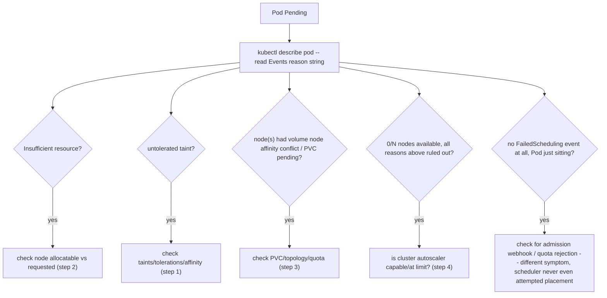
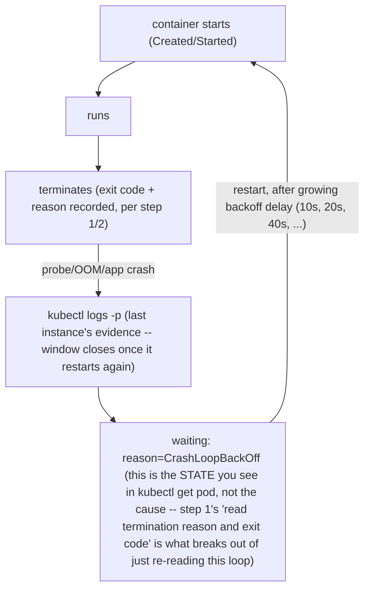

*(original text preserved in full below; additions marked with ➕)*

**Learning outcome:** Use object/event evidence before host-level investigation, then descend the stack.

## Worked scenario
**Situation:** A production Pod is Pending for 15 minutes.

1. kubectl describe Pod and read scheduling events: resource, taint, affinity, PVC, topology or admission reason.
2. Check eligible nodes and allocatable/requested resources.
3. Check PVC binding/topology and quota if referenced.
4. Check autoscaler ability/limits only if adding a node could satisfy the Pod.
5. Make one change that directly addresses the proven constraint.

**Conclusion:** Pending is a desired placement problem; start with scheduler evidence, not container logs.

➕ **Sample `kubectl describe pod` output for a GPU-specific Pending case, annotated (the event message that actually names the constraint):**
```text
$ kubectl describe pod gpu-train-job-9f2a
...
Events:
  Type     Reason            Age   From               Message
  ----     ------            ----  ----               -------
  Warning  FailedScheduling  15m   default-scheduler  0/12 nodes are available: 8 Insufficient nvidia.com/gpu,
                                                        4 node(s) had untolerated taint {dedicated: training-only}.
```
This single event line answers both "how many nodes were even candidates" (0 of 12) and "why, split by reason" (8 lacked free GPU allocatable capacity, 4 were tainted and this Pod has no matching toleration). The arithmetic check that follows immediately: `kubectl describe node <gpu-node> | grep -A5 Allocated` to confirm whether the 8 GPU-insufficient nodes are *genuinely* full or whether requested-vs-allocatable accounting is the actual problem (e.g. a stuck Pod holding a GPU request without using it).

➕ **ASCII: the Pending-Pod evidence tree, generalized from steps 1-5 above:**


➕ **Worked scenario — the specific GPU-fleet variant of "Pending," where the resource math is the whole answer:**
> **Situation:** A GPU training job requests 8x A100 with a strict pod-anti-affinity rule (all 8 GPUs on the same node, for NVLink locality). Cluster has 4 nodes, each with 8 A100s, currently running smaller 1-2 GPU inference jobs scattered across all 4 nodes such that no single node has 8 free.
> 1. `FailedScheduling` event: "0/4 nodes are available: 4 Insufficient nvidia.com/gpu" — technically true per-node, even though the *cluster-wide* free GPU count (say, 10 free GPUs total) looks like it should be enough.
> 2. The gap is bin-packing, not raw capacity: Kubernetes' default scheduler doesn't defragment running workloads to make room; it only places new Pods into existing free capacity shaped correctly.
> 3. Fix directions, with tradeoffs: (a) descheduler/bin-packing policy to consolidate small jobs — disruptive, has its own risk; (b) reserve/cordon a node ahead of large training jobs via scheduling policy — wastes capacity when not in use; (c) relax the anti-affinity to allow the job across nodes with a slower interconnect — changes the job's own performance profile.
> **Conclusion:** "Insufficient nvidia.com/gpu" can mean either "genuinely out of GPUs" or "enough GPUs exist but not shaped/located right for this Pod's constraints" — the fix is completely different depending on which, and the allocatable-vs-requested-vs-*fragmentation* distinction is the senior-level addition to a Pending investigation.

## Worked scenario
**Situation:** A Pod alternates Running and CrashLoopBackOff.

1. Read current/previous container termination reason and exit code.
2. Read previous logs (kubectl logs -p) because the last process instance may already be gone.
3. Separate application exit, OOM, probe-triggered restart and external eviction/node failure.
4. Reproduce with the same config/secret/env if safe; do not simply increase restart backoff.

**Conclusion:** CrashLoopBackOff is a retry state, not the root cause.

➕ **Sample `kubectl get pod -o yaml` container status, annotated — the exact fields step 1 is asking you to read:**
```yaml
containerStatuses:
- name: model-server
  restartCount: 7
  lastState:
    terminated:
      reason: OOMKilled          ← this is the answer step 1/3 want; NOT "app exit"
      exitCode: 137              ← 137 = 128+9 = SIGKILL, consistent with OOMKilled
      startedAt: "2026-07-30T13:58:02Z"
      finishedAt: "2026-07-30T14:01:47Z"
  state:
    waiting:
      reason: CrashLoopBackOff   ← the retry STATE, not the cause — this is the chapter's own conclusion line, in yaml form
```
`exitCode: 137` paired with `reason: OOMKilled` is unambiguous — this is Kubernetes/cgroup memory enforcement, the fix is a memory limit/request change or a memory leak investigation in the app, and it has **nothing to do with CUDA memory**. Contrast with an app-level crash: `reason: Error`, `exitCode: 1` (or whatever the app's own exit convention is), `lastState.terminated.message` populated with an app-specific string — that's step 3's "application exit" branch, and the fix lives in application code, not resource limits.

➕ **Diagram: the CrashLoopBackOff cycle — a retry state, not a root cause, made visual**

Every lap of this loop erases the previous container instance's live process — `kubectl logs -p` is the only window onto the lap that just ended, which is exactly why step 2 calls it out explicitly rather than assuming `kubectl logs` (no `-p`) is good enough.

➕ **Shortcut — the exit-code decoder every senior SRE should have memorized cold:**

| Exit code | Decode | What it means |
|---|---|---|
| `0` | clean exit | shouldn't be in CrashLoopBackOff at all — check the app's own restart logic |
| `1` | generic app error | check `logs -p` for the actual message |
| `137` | 128+9 = SIGKILL | OOMKilled (check `reason` field) or manual `kill -9` / eviction |
| `143` | 128+15 = SIGTERM | graceful shutdown signal received (check if it handled it correctly) |
| `139` | 128+11 = SIGSEGV | segfault, usually native code/library issue, not "the app decided to exit" |

**Mnemonic:** *subtract 128 from any exit code ≥128 and you get the signal number.*

➕ **Worked scenario — OOMKilled vs CUDA OOM, the distinction Chapter 11's own Practice question 3 asks you to articulate, worked end to end here:**
> **Situation:** Two GPU Pods both restart repeatedly. Pod A: `restartCount: 5`, `lastState.terminated.reason: OOMKilled`, `exitCode: 137`. Pod B: `restartCount: 5`, `lastState.terminated.reason: Error`, `exitCode: 1`, and `kubectl logs -p` on Pod B shows `RuntimeError: CUDA out of memory. Tried to allocate 2.00 GiB...`.
> 1. Pod A's OOM is enforced by the **Kubernetes/cgroup memory controller** on host RAM — Kubernetes killed it, and it shows up as `reason: OOMKilled` because Kubernetes *knows* it did this.
> 2. Pod B's OOM is enforced by the **CUDA driver/runtime** on GPU framebuffer memory — Kubernetes has no visibility into GPU memory at all (per Chapter 4's ownership table), so it just sees an ordinary nonzero application exit; the *only* place the real cause survives is the application's own log line.
> 3. This means: if you only ever look at Kubernetes-level fields (`reason`, `exitCode`) and never `kubectl logs -p`, Pod B's CUDA OOM is **indistinguishable from any other app crash** — you would misdiagnose it as "flaky application code" and waste time in the wrong codebase.
> **Conclusion:** the distinguishing evidence for CUDA OOM specifically requires descending to logs even when Kubernetes fields look like a routine app error — this is the direct answer to Chapter 11 Practice #3, worked with real field values instead of stated abstractly.

**Interview-ready line:** "CrashLoopBackOff is Kubernetes' retry policy talking, not the failure — the actual cause is always one of exit code plus termination reason plus previous logs, and OOMKilled versus a CUDA-OOM string in the logs are two different fixes wearing the same restart count."

## Practice
➕ 1. Given `exitCode: 143` and `reason: Error` on a Pod that restarts every time right after a rolling deploy of a *different* service, name the two most likely explanations and the one piece of evidence that would distinguish them (hint: was this Pod's termination initiated by its own app, or externally).
➕ 2. Write the one-line `kubectl` command to pull `lastState.terminated.reason` and `exitCode` for every Pod in a namespace at once, so you don't have to `describe` each Pod individually during an incident with many restarting Pods.
