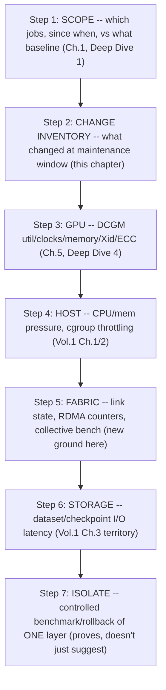
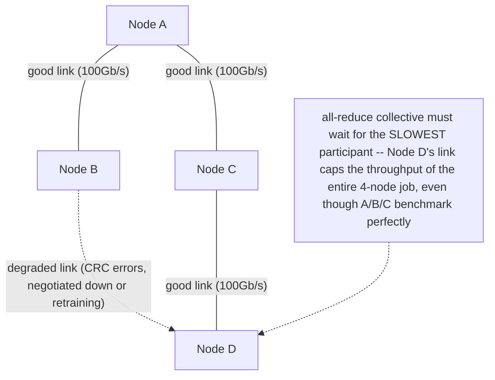

*(original text preserved in full below; additions marked with ➕)*

**Learning outcome:** Walk from workload SLO through GPU, container/runtime, host, network and storage evidence.

## Worked scenario
**Situation:** Distributed training throughput drops 35% after maintenance with no application code change.

1. Scope: one job/node group/all jobs; compare a known-good baseline.
2. Inventory changes: driver, firmware, operator, kernel, NIC, switch, storage, topology.
3. GPU: utilization, clocks, memory, health/error/throttle indicators.
4. Host: CPU/memory/I/O pressure and cgroup throttling.
5. Fabric: link state, RDMA/NIC counters, drops/congestion, collective benchmark.
6. Storage: dataset/checkpoint latency if step timeline aligns with I/O.
7. Perform a controlled node/path benchmark or rollback that isolates the changed layer.

**Conclusion:** "No code change" narrows change history, but evidence must still identify the bottleneck.

➕ **ASCII: the full evidence-descent order from step 1-7, drawn as the layered stack this whole volume has been building toward:**

The ordering is deliberate: GPU (Step 3) before Host (Step 4) because GPU telemetry is cheaper to check and rules out/in the highest-signal layer first; Fabric (Step 5) after Host because a fabric problem often *presents* as host-level stalling (a stuck NCCL collective looks like a hung process); Storage (Step 6) last because it only matters "if the step timeline aligns with I/O" — you check it conditionally, not by default.

➕ **Sample fabric-layer evidence for step 5, annotated — the piece the original text names but doesn't show output for:**

```mermaid
flowchart TD
  %% Converted from the original ASCII diagram; source wording is preserved.
  n0["$ nvidia-smi nvlink -e # NVLink error counters, per GPU"]
  n1["GPU 0: NVLink Errors"]
  n2["Link 0: Replay Errors: 0, Recovery Errors: 0, CRC Errors: 0"]
  n3["Link 1: Replay Errors: 142, Recovery Errors: 3, CRC Errors: 891 ← link 1 is unhealthy"]
  n4["$ ibstat mlx5_0 | grep -E 'State|Rate'"]
  n5["State: Active"]
  n6["Rate: 100 ← Gb/s; if this reads lower than the NIC's rated speed, link negotiated down after maintenance"]
  n7["$ ib_write_bw -d mlx5_0 -F --report_gbits # controlled RDMA bandwidth benchmark (step 7's 'isolate')"]
  n8["..."]
  n9["Bandwidth peak[Gb/sec] 94.2 ← compare directly to a known-good baseline number from before maintenance"]
```

`CRC Errors: 891` on one link with all others at 0 is the exact kind of asymmetric evidence that separates "the whole fabric degraded" from "one bad cable/port after a maintenance window that involved physical reseating" — worth naming explicitly, because the fix (replace one cable) is trivial once you have this evidence and a nightmare to find without it.

➕ **Diagram: why a synchronous collective is only as fast as its slowest link — one bad link, whole-job impact**

This is why step 3 (per-GPU DCGM, clean) and step 5 (fabric, one bad link) can disagree completely — per-GPU health has no visibility into the links *between* GPUs, and a distributed job's reported throughput is gated by whichever node/link is worst, not the average.

➕ **Worked scenario — the "GPU looks fine but the collective is still slow" trap, extending step 3 vs step 5:**
> **Situation:** Following the maintenance in the original scenario: DCGM shows normal utilization, clocks, temps and zero Xid/ECC errors on every GPU in the affected job (step 3 fully exonerated). Throughput is still down 35%.
> 1. Per-GPU health being clean doesn't test the *fabric between* GPUs — a training job's throughput depends on collective operations (all-reduce, etc.) whose latency is dominated by interconnect, not by any single GPU's own health.
> 2. Move to step 5: NVLink/InfiniBand counters as shown above. Find one degraded link (asymmetric CRC errors) or a negotiated-down link rate.
> 3. Run `ib_write_bw` (step 7's controlled benchmark) node-pair by node-pair to localize which specific link/node is the laggard — a distributed job's overall throughput is gated by its *slowest* participant in a synchronous collective, so one bad link can drag down the entire job's reported throughput even though every other node/GPU benchmarks perfectly.
> **Conclusion:** "no code change" plus "GPU health is clean" still leaves an entire evidence layer (fabric) unexamined — this is precisely why the chapter's step list has GPU and Fabric as separate steps rather than folding fabric into "GPU," and it's a common miss for engineers who stop investigating once `nvidia-smi`/DCGM look clean.

➕ **Shortcut:** *"A synchronous collective is only as fast as its slowest link — check pairwise, not just per-GPU."* If DCGM is clean everywhere but throughput is still down on a multi-node job, go straight to fabric counters and a pairwise bandwidth benchmark rather than re-checking GPU health again.

**Interview-ready line:** "For a GPU throughput regression with no code change, I walk GPU health, then host pressure, then fabric — because per-GPU telemetry being clean only exonerates the device, not the interconnect a distributed job's collectives actually depend on."

## Practice
➕ 1. A single-node (no fabric involved) inference job's throughput drops 20% after the same maintenance window. Explain which step of the 7-step list becomes irrelevant for this scoped case and why, and re-order the remaining checks by expected information-per-minute-spent for a single-node scenario.
➕ 2. Using the `nvidia-smi nvlink -e` output above, write the one-liner that would scan all 8 GPUs on a node and print only links with nonzero CRC errors, so you don't have to eyeball every link on every GPU during an incident.
