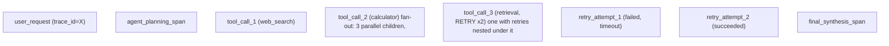

Traces become valuable when a user request spans gateway, retrieval, reranking, inference and tool calls. Carry a correlation/trace context through those boundaries and attach low-cardinality attributes such as model, deployment, region and operation. Avoid embedding prompts or secrets in telemetry by default. For agentic systems, trace fan-out and retries because a single user action can become dozens of downstream operations.

## Build from the normal path

OpenTelemetry is a vendor-neutral instrumentation and transport framework. An application or auto-instrumentation library creates telemetry; an SDK batches and exports it; an OpenTelemetry Collector receives, processes and exports it to one or more backends. The Collector is not the trace database and does not make missing context reappear.

The W3C `traceparent` header carries a trace ID, parent span ID and sampling flags across HTTP boundaries. Message queues need the same context injected into message metadata and extracted by the consumer. If a service starts a new trace instead of continuing the incoming context, the backend shows two plausible but disconnected traces.

| Boundary | What must propagate | Useful attributes | Avoid by default |
|---|---|---|---|
| gateway → retrieval | trace context and request correlation | route, region, operation | raw prompt, bearer token |
| retrieval → reranker | parent context | index, top-k bucket, outcome | retrieved private document text |
| inference request | parent context | model/deployment, batch bucket, finish status | prompt or generated text |
| agent → tool | parent context plus attempt number | tool name, timeout class, result status | tool credentials and full payload |

Sampling is a cost and evidence decision. Head sampling decides near the start and can miss rare failures. Tail sampling waits for completed traces and can retain errors or slow requests, but needs collector memory and a policy for incomplete traces. Always retain metrics that show total traffic; sampled traces cannot prove the population-wide error rate by themselves.

**Agentic fan-out, visualized — why "trace the request" becomes "trace the tree" for agentic systems:**

A single user action becoming "dozens of downstream operations" (the core explanation's own phrase) means the waterfall from Ch.7 — a linear sequence — is the wrong mental picture for agentic tracing; it's a **tree**, and retries specifically must nest as children of the operation they're retrying, not as siblings, or the trace misrepresents causality (it would look like 3 independent retrieval attempts instead of 1 operation that needed 2 tries).

### Troubleshooting a broken trace

1. Capture one request ID and verify the gateway created or accepted trace context.
2. Check that the next service received the same trace ID and created a child span rather than a new root.
3. Inspect SDK/exporter errors and Collector receiver, queue, retry and dropped-span metrics.
4. Confirm backend ingestion only after the application and Collector paths are proven.
5. Compare trace duration with service metrics and logs. Clock skew, sampling and missing spans can make a trace incomplete even when it renders successfully.

The success criterion is not “a waterfall appeared.” Every required boundary must be connected, sensitive data excluded, error status recorded consistently, and the trace correlated with logs and aggregate metrics.
