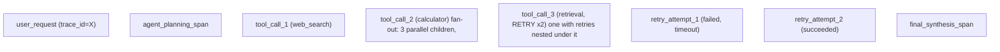

Traces become valuable when a user request spans gateway, retrieval, reranking, inference and tool calls. Carry a correlation/trace context through those boundaries and attach low-cardinality attributes such as model, deployment, region and operation. Avoid embedding prompts or secrets in telemetry by default. For agentic systems, trace fan-out and retries because a single user action can become dozens of downstream operations.

## Senior addendum

*(original text preserved — Ch.7 already covers the single-request span waterfall and context-propagation requirement in depth; the genuinely new piece is fan-out)*

➕ **Agentic fan-out, visualized — why "trace the request" becomes "trace the tree" for agentic systems:**

A single user action becoming "dozens of downstream operations" (the original text's own phrase) means the waterfall from Ch.7 — a linear sequence — is the wrong mental picture for agentic tracing; it's a **tree**, and retries specifically must nest as children of the operation they're retrying, not as siblings, or the trace misrepresents causality (it would look like 3 independent retrieval attempts instead of 1 operation that needed 2 tries).
