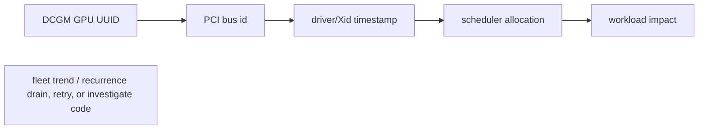

A GPU dashboard should combine device health and workload performance. Device health: temperature, power, clocks, memory, ECC/error events, NVLink/PCIe status. Workload: utilization, memory occupancy, engine behavior, throughput and job identity. Driver logs provide Xid context. Correlate GPU UUID across DCGM, nvidia-smi, Kubernetes labels/allocations and job logs so that an incident survives node renumbering or Pod rescheduling.

## Senior addendum

*(original text preserved — Ch.5's addendum already covers the DCGM metric set, UUID-vs-index, and a silent-telemetry-loss scenario in depth; the genuinely new piece is the Xid table this Deep Dive names but doesn't enumerate)*

➕ **Common Xid codes worth recognizing by number, not just "check driver logs" — a lookup table for the interview:**

| Xid | Meaning | Typical response |
|---|---|---|
| 13 | Graphics Engine Exception | often app/kernel-launch fault; check the specific CUDA call |
| 31 | GPU memory page fault | often an application bug (invalid pointer/address) |
| 48 | Double-bit ECC error (uncorrectable) | hardware memory fault — drain and RMA-track the GPU |
| 62 | Internal micro-controller halt | firmware/hardware issue — drain node |
| 79 | GPU has fallen off the bus | severe — PCIe/power/hardware fault, drain immediately, used in Ch.11's worked postmortem |
| 94/95 | Contained/uncontained ECC error | correlate with Xid 48 pattern; contained = isolated, uncontained = broader impact |

Xid codes are what turn "driver logs provide context" (the original line) into an actual triage table — cross-reference `dmesg`/`journalctl` Xid lines against DCGM's `DCGM_FI_DEV_XID_ERRORS` counter (Ch.5's metric list) to confirm the device-level metric and the driver-level log agree, then act on severity: 79/48/62 warrant immediate drain, 13/31 warrant an application-code look first.

➕ **Visual model — bind a fleet metric to a physical device before action:**

**Memory hook:** *"UUID finds the card; time finds the event; allocation finds the customer impact."*
