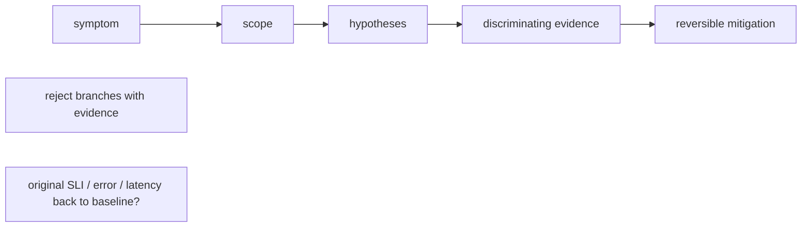

Separate mitigation from root cause. Draining a node, rolling back a release or reducing concurrency may restore service, but the incident is not understood until evidence explains why the action worked. Preserve logs, metrics, manifests, versions and topology before destructive remediation when possible.

**•** Define symptom and blast radius; identify the first known-bad interval.

**•** List top hypotheses across application, orchestration, host, GPU, network and storage.

**•** Choose the cheapest/highest-information test for each hypothesis.

**•** Mitigate only when the customer/SLO requires it; record what changed.

**•** Validate recovery with the original symptom metric, not “pods are green”.

**•** Perform root-cause and contributing-factor analysis; create prevention or faster-detection actions.

## Build from the normal path

**"Mitigation restores service; root cause explains why it worked" — the discipline made concrete, because this line is easy to state and easy to skip under pressure:**

> A team drains a node during the Ch.11 Xid-79 incident and error rates recover. It would be tempting to close the incident there — service is restored, the graph is green. The workflow's own bullet list requires one more step first: *"Validate recovery with the original symptom metric, not 'pods are green.'"* Confirming the *error-ratio metric itself* (not just Pod status) returned to baseline is the difference between "we did something and it happened to get better" and "we know the drain is what fixed it" — a coincidental recovery (e.g. traffic simply dropped at the same moment) would pass a "pods are green" check but fail an error-ratio check if the underlying fault were still present and traffic later returned.

**Visual model — an evidence tree closes only when the symptom metric recovers:**

**Key takeaway:** *"Mitigate the impact, then prove the mechanism."*
