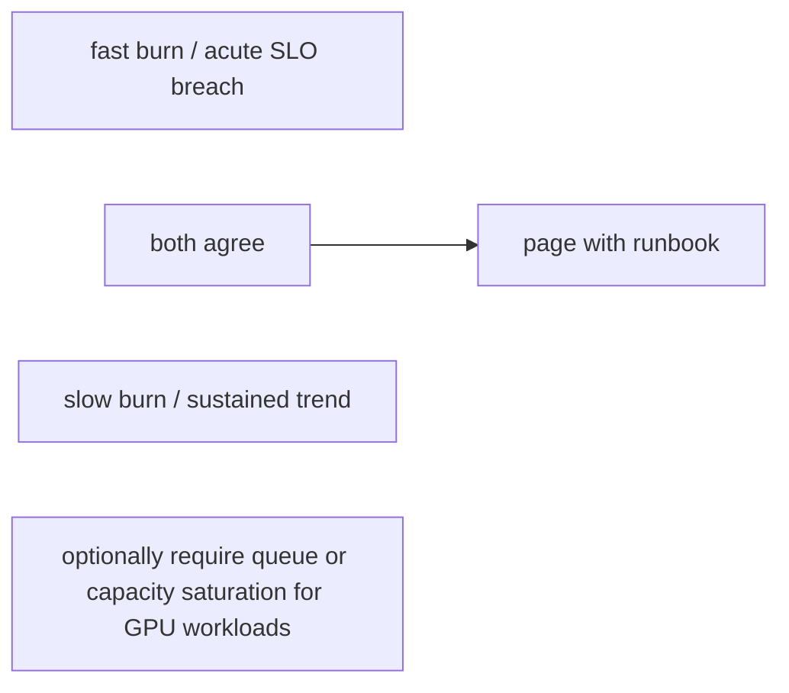

Alert on conditions that require human action. Capacity alerts should give enough lead time to acquire or shift scarce GPU capacity. Health alerts should avoid paging on transient telemetry gaps unless redundancy is affected. Multi-signal alerts can reduce false positives—for example sustained inference SLO violation plus queue saturation, rather than GPU utilization alone.

## Senior addendum

*(original text preserved — Ch.8's addendum already covers burn-rate math and alert-payload design in depth; the genuinely new piece is multi-signal composition)*

➕ **Multi-signal alert composition, one concrete example extending Ch.8's burn-rate alert with the "GPU utilization alone" trap this Deep Dive names:**

```promql
# BAD (single-signal, exactly what this Deep Dive warns against):
DCGM_FI_DEV_GPU_UTIL > 90

# BETTER (multi-signal — sustained SLO violation AND queue saturation together):
(
  histogram_quantile(0.95, sum by (le)(rate(inference_ttft_seconds_bucket[10m]))) > 2.0
)
and
(
  sum(inference_queue_depth) > 50
)
```

The AND composition mirrors Ch.8's fast+slow burn-rate AND structure exactly — both are "require two independent signals to agree before paging" to suppress false positives, just composed across *different signal types* here (SLO + capacity) instead of *different time windows*. Worth naming this as the same underlying principle applied twice: agreement across independent signals is what buys precision, whether the two signals are two time windows or two telemetry planes.

➕ **Visual model — page on impact plus persistence, not a noisy raw signal:**

**Memory hook:** *"Two independent agreements beat one dramatic graph."*
