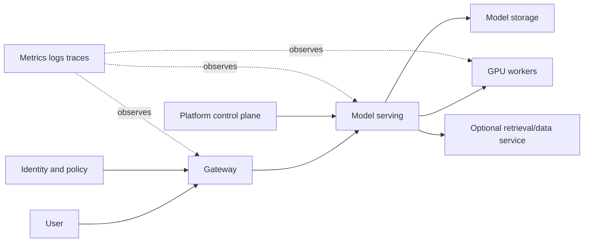

# Foundation — what a Solutions Architect actually does

## What this volume is trying to teach

A Solutions Architect converts an incomplete business or technical need into a defensible, testable system recommendation. The role is not to draw the most complex diagram or name the newest product. It is to discover constraints, model the important paths, compare options, explain trade-offs and reduce uncertainty before large commitments are made.

## The first mental model

| Stage | Question | Deliverable |
|---|---|---|
| Discover | What outcome, workload and constraints are real? | clarified requirements and unknowns |
| Model | Which data, control, trust and failure paths matter? | shared architecture model |
| Compare | Which feasible options differ on important criteria? | trade-off matrix |
| Recommend | Which option best fits now, and why? | decision with assumptions |
| Validate | Which uncertain claims must be tested? | PoC/benchmark acceptance plan |
| Adopt | How will people migrate, operate and govern it? | staged operating/adoption plan |

## Essential language

- A **requirement** states a necessary outcome or constraint.
- An **assumption** is believed but not yet confirmed.
- A **constraint** limits feasible choices: time, skills, regulation, budget or existing systems.
- A **trade-off** improves one important property while accepting cost elsewhere.
- A **failure domain** is a set of components likely to fail together.
- A **PoC** should test uncertainty, not merely demonstrate that a product starts.
- **TCO** includes acquisition and ongoing operational cost, not hardware price alone.
- A **recommendation** includes rationale, risks, validation and next steps.

## Discovery before products

When a customer requests 32 GPUs, ask about workload type, model/data size, concurrency, latency/deadline, training duration, network/storage, security, availability, growth and existing skills. The stated component count may be a proposed solution rather than the underlying requirement.

## A real-life example

A customer mandates Kubernetes while a research team prefers Slurm. The architecture question is not "which technology wins?" Discover workload mix, operational ownership, isolation, queues/services, skills and lifecycle needs. Options may include separated node pools, separate clusters with shared services, or a consciously designed hybrid. Validate scheduling and operational boundaries so two systems never assume ownership of the same resource.

## A complete discovery example

Customer statement: "We need a 64-GPU Kubernetes AI platform in three months."

Do not accept the proposed solution as the requirement. Explore:

### Outcome and workload

- Is the platform for training, fine-tuning, batch inference or online inference?
- Which model sizes, data volumes and frameworks?
- Concurrent jobs/users and growth?
- Latency, throughput, deadline, availability and recovery objectives?

### Current state

- Existing clusters, identity, CI/CD, storage and observability?
- Team skills and operational ownership?
- On-premises, cloud or hybrid constraints?
- Which parts already work and which pain created the project?

### Constraints and governance

- Budget and delivery milestones?
- Data residency/classification and tenant separation?
- Approved vendors, support and lifecycle requirements?
- Power, cooling, rack, network and procurement realities?

### Unknowns requiring validation

- Can representative models meet SLOs on candidate hardware/software?
- Does storage sustain data/checkpoint patterns?
- Does multi-node communication achieve the needed scaling efficiency?
- Can the team operate upgrade, failure and security workflows?

## Architecture is paths and state

Draw at least:

- request/data path;
- control/management path;
- identity/trust path;
- persistent state and ownership;
- failure domains and redundancy;
- observability and operational access.



Boxes alone are incomplete. Label protocols, data sensitivity, scale, ownership, SLO and what happens when each dependency fails.

## Turn requirements into a trade-off matrix

Example scheduler/platform comparison:

| Criterion | Weight | Option A | Option B | Evidence/assumption |
|---|---:|---:|---:|---|
| Long-running batch scheduling | 5 | score | score | representative queue/policy needs |
| Online-service reconciliation | 5 | score | score | rollout/autoscaling requirements |
| GPU topology/gang behavior | 4 | score | score | tested scheduler capabilities |
| Team operating skill | 4 | score | score | current support/on-call model |
| Multi-tenancy/governance | 4 | score | score | explicit controls and audits |
| Ecosystem integration | 3 | score | score | version-matched product support |

Scores without evidence are decoration. Perform sensitivity analysis: if a small weight change reverses the recommendation, the decision is fragile and needs better evidence.

## PoC as an uncertainty-reduction experiment

Bad PoC: install software and show a sample Pod.

Better PoC:

1. **Claim:** candidate system can train a representative model across 16 GPUs with at least the required step-time/scaling efficiency.
2. **Environment:** hardware topology, driver/container/framework versions, network and storage recorded.
3. **Workload:** representative data, model, precision and checkpoint pattern.
4. **Metrics:** correctness, step time distribution, collective time, GPU/CPU/network/storage evidence.
5. **Failure tests:** one worker/node loss, checkpoint recovery and node replacement workflow.
6. **Threshold:** agreed pass/fail numbers and maximum operational recovery time.
7. **Decision:** proceed, change design or gather another targeted test.

## Capacity estimate with uncertainty

For online inference:

```text
required replicas ≈ peak required goodput / validated goodput per replica
```

Then adjust for tail-latency headroom, failure capacity, maintenance, warm-up, workload distribution and growth. "GPU utilization target" is not a capacity model.

For training, use measured job resource shape, duration, arrival/queue objectives and failure/retry/checkpoint behavior. Show assumptions as ranges rather than false precision.

## Communicate at three levels

- Executive: outcome, risk, cost range, decision and next step.
- Engineering leadership: architecture boundaries, trade-offs, operating model and validation.
- Implementer: versions, APIs/configuration, rollout, observability and runbooks.

The recommendation should remain consistent while vocabulary and detail change.

## Design-review checklist

- Requirements have owners and measurable acceptance criteria.
- Assumptions/unknowns are visible.
- Data/control/trust paths and persistent state are drawn.
- Failure domains and recovery objectives are explicit.
- Security is integrated, not a final box.
- Capacity uses representative benchmarks and workload distributions.
- Alternatives and rejected options are documented.
- PoC tests uncertainty.
- Migration/operations/upgrade ownership exists.
- Recommendation states conditions under which it should be revisited.

## Local reinforcement

- Staff guides: `platform-engineering_consolidated.md`, `general-devops_consolidated.md`, `cloud-platforms_consolidated.md`
- SRE foundations: `07-system-design-cloud-architecture.md`, `28-complete-sre-study-curriculum.md`
- SRE cloud-design labs in `interview-prep/hands-on-labs/cloud-design/`

## How to study this volume

Practice discovery and path modeling before capacity math or product selection. For each chapter, produce a one-page customer artifact: questions, diagram, comparison, PoC, migration or executive explanation. Senior depth is demonstrated by clear decisions under uncertainty, not jargon density.
