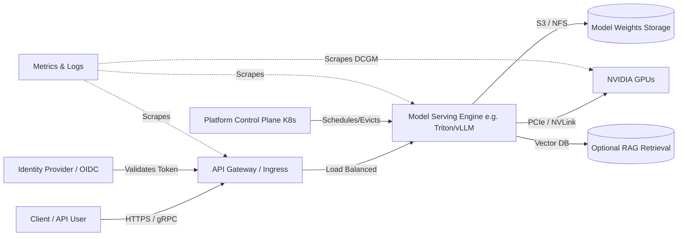

# Chapter 1 — Architecture Design Masterclass

| Chapter metadata | Value |
|---|---|
| Volume | 08 — Architecture, Strategy, and Technical Leadership |
| Difficulty | Expert |
| Estimated reading time | 35 minutes |
| Primary audience | Solutions Architects, Principal DevOps, Platform Leaders |
| Core question | How do you convert an ambiguous, multi-million dollar business request into a defensible, production-ready AI infrastructure design? |

## Introduction

Engineering is easy; architecture is hard. 

A junior engineer hears a request for "32 GPUs" and immediately starts writing a Terraform script to provision a Kubernetes cluster. A Senior Solutions Architect hears the exact same request and asks: *"What model are you serving, what is your P95 latency Service Level Objective (SLO), and what happens to the business when a node inevitably fails?"*

The Solutions Architect's job is not to draw the most complex diagram or to name-drop the newest NVIDIA product. The job is to discover constraints, model the critical data paths, compare viable options, explicitly state trade-offs, and reduce technical uncertainty before a company commits millions of dollars.

This chapter defines the professional methodology for designing AI infrastructure. We move beyond product documentation and into the physics of system design.

## 1. The Architecture Methodology Framework

A defensible architecture is built using a strict six-stage framework. If you skip a stage, you are gambling with production.

| Stage | The Core Question | The Concrete Deliverable |
|---|---|---|
| **1. Discover** | What is the actual workload and what are the unyielding constraints? | Clarified requirements document and a list of unknowns. |
| **2. Model** | Which data, control, trust, and failure paths matter? | A shared architecture diagram and mental model. |
| **3. Compare** | Which feasible options differ on the most important criteria? | A trade-off matrix. |
| **4. Recommend** | Which option best fits the business right now, and why? | A formal decision log with stated assumptions. |
| **5. Validate** | Which uncertain claims must be tested before going to production? | A Proof of Concept (PoC) or benchmarking acceptance plan. |
| **6. Adopt** | How will people actually migrate, operate, and govern this system? | A staged operational rollout and Day-2 runbook plan. |

### Essential Language
To navigate this framework, you must use precise language:
*   **Requirement:** A mathematically necessary outcome (e.g., "P99 latency must be under 50ms").
*   **Assumption:** A belief that is not yet proven (e.g., "We assume our existing 100G network can handle the checkpoint traffic"). 
*   **Constraint:** A hard limit on choices (e.g., "The data cannot leave the EU," or "We must use existing VMware licenses").
*   **Trade-off:** Improving one property by intentionally degrading another (e.g., "We choose lower hardware utilization to guarantee strict tenant isolation via physical node separation").
*   **Failure Domain:** A set of components that will fail together (e.g., "All 8 GPUs in this chassis share a single power bus; they are a single failure domain").

## 2. Discovery: Never Trust the Initial Request

The most dangerous thing an architect can do is build exactly what the customer initially asked for. The stated component count or technology choice is usually a proposed solution masquerading as a requirement.

**Customer Request:** *"We need a 64-GPU Kubernetes AI platform built in three months."*

A Senior Architect does not accept this. They systematically unpack the request across four dimensions:

### A. Outcome and Workload
*   Is this for distributed training, fine-tuning, batch inference, or online low-latency inference? 
*   What are the model sizes (e.g., 8B vs. 70B parameters), data volumes, and frameworks (PyTorch, Triton, vLLM)?
*   What is the target concurrency (concurrent users/jobs)?
*   What are the throughput constraints and latency deadlines?

### B. Current State and Constraints
*   What existing CI/CD, identity (OIDC/Active Directory), and observability (Prometheus/Datadog) tools must this integrate with?
*   What are the team's existing operational skills? (Do they actually know Kubernetes, or did they just read a blog post?)
*   Are there hard data residency or compliance boundaries?

### C. Unknowns Requiring Validation
*   Can the candidate hardware actually meet the SLOs for this specific model?
*   Will the existing NAS storage bottleneck the training checkpoint writes?
*   Does the team have the capability to operate and upgrade the system (e.g., GPU Operator lifecycles) once the architect leaves?

## 3. Modeling: Architecture is Paths and State

Once the requirements are real, the architect must model the system. A diagram that just shows boxes labeled "Kubernetes" and "GPUs" is useless. 

A professional architecture model must explicitly map six critical paths:
1.  **Data/Request Path:** How does a user prompt enter the system and reach a GPU?
2.  **Control Path:** How does the orchestrator (Kubernetes/Slurm) assign workloads?
3.  **Trust/Identity Path:** How is the user authenticated, and how are secrets (API keys, HuggingFace tokens) injected safely?
4.  **Persistent State:** Where do model weights and training datasets physically live, and who owns the lifecycle of that storage?
5.  **Failure Domains:** If a Top-of-Rack switch dies, what exactly goes down?
6.  **Observability Path:** How do logs and metrics escape the nodes and reach the monitoring system?

### High-Level AI Serving Architecture

## Customer Scenario (Senior Level)

**The Situation:**
A financial customer has two distinct teams. The Data Science research team demands a massive Slurm cluster for training foundational models. The MLOps production team demands a strict Kubernetes environment because that is their corporate standard. The CIO has budget for only one cluster and demands that the architect recommend a single platform that makes both teams happy.

**The Senior Architect Response:**
"Attempting to force both workloads into a single, identical control plane without explicit isolation is an architectural anti-pattern that will result in both teams failing. 

First, we must discover the true constraints. Slurm is designed for batch-scheduled, tightly-coupled, MPI-driven distributed training where jobs queue and run to completion. Kubernetes is designed for microservices, high-availability, and endless loops. 

If we force the research team to use Kubernetes for massive training without specialized operators (like Kueue or Volcano), they will suffer from poor gang-scheduling and network topology blindness. If we force the MLOps team to use Slurm for web-facing inference, they will lack native Ingress, auto-scaling, and self-healing.

We must map the **Trade-off Matrix**. 
Option A: A consciously designed hybrid. We deploy a bare-metal Slurm cluster for the research team, optimized for InfiniBand and parallel file systems. We deploy a separate GPU-enabled Kubernetes cluster for inference. 
Option B: We standardize on Kubernetes but heavily invest in Kubernetes-native batch scheduling (e.g., Run:ai or Volcano) to emulate Slurm's capabilities, accepting the trade-off of a much higher operational engineering burden for the platform team.

The recommendation depends entirely on the MLOps team's current Kubernetes maturity. If they cannot write custom scheduling operators, Option A (separated node pools with distinct control planes sharing a common storage backend) is the only defensible path to production."

## Interview Preparation

**Conceptual:** What is the difference between a Constraint and a Trade-off? *(Hint: A constraint is a hard, unyielding boundary, such as a regulatory requirement or a fixed budget. A trade-off is a strategic choice made by the architect to sacrifice one property, like resource utilization, to gain another, like strict tenant security).*

**Architecture:** A customer asks for "100 GPUs for AI." What are the first three discovery questions you ask to translate this into an architecture? *(Hint: 1. Are these GPUs for distributed training, batch inference, or low-latency interactive serving? 2. What specific models and frameworks are you running? 3. What are your Service Level Objectives (SLOs) for uptime and latency, and how will we measure success?)*
