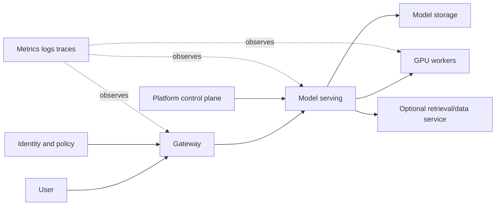
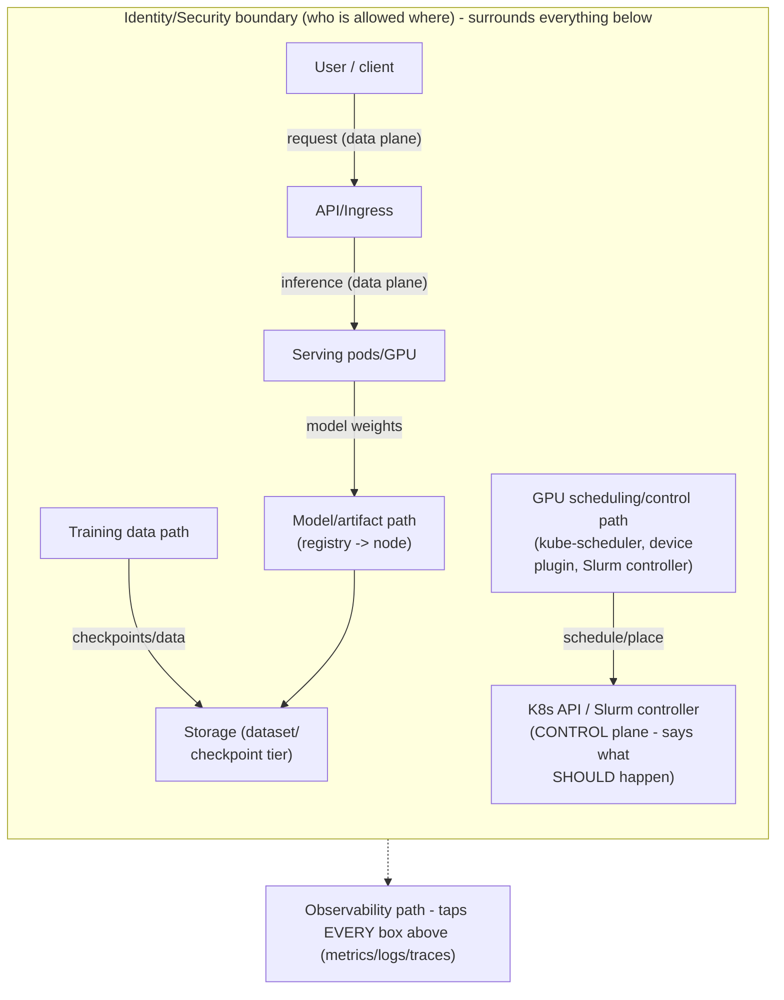
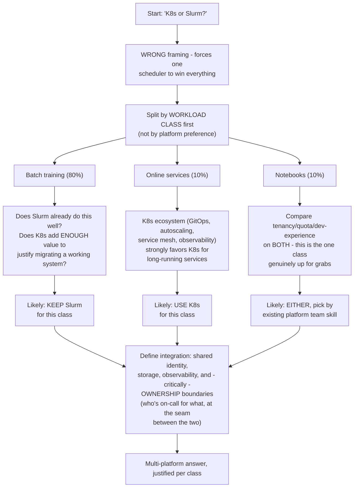
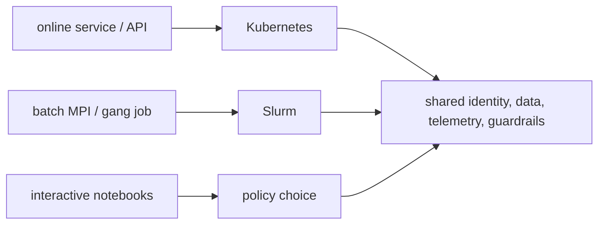
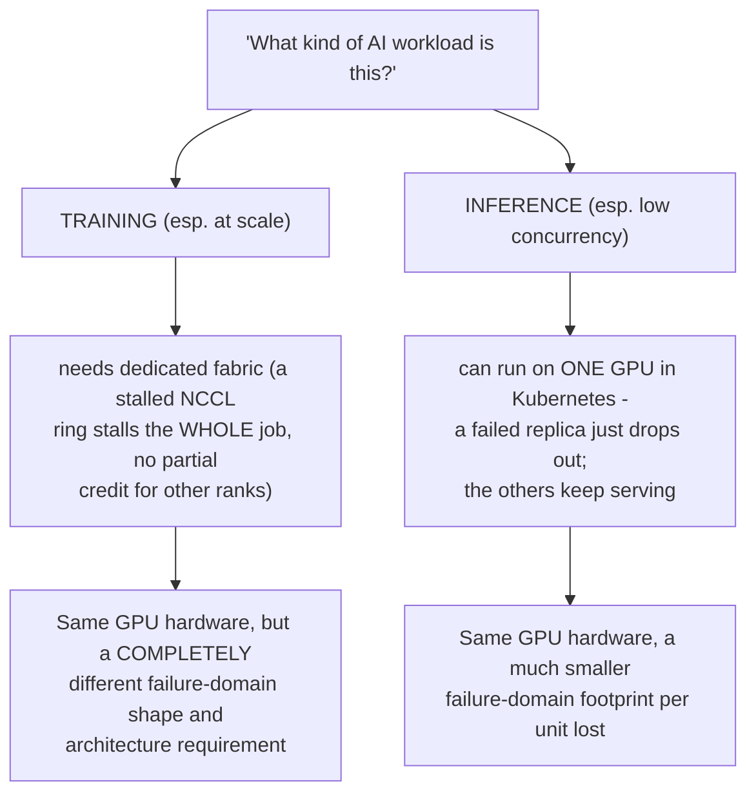
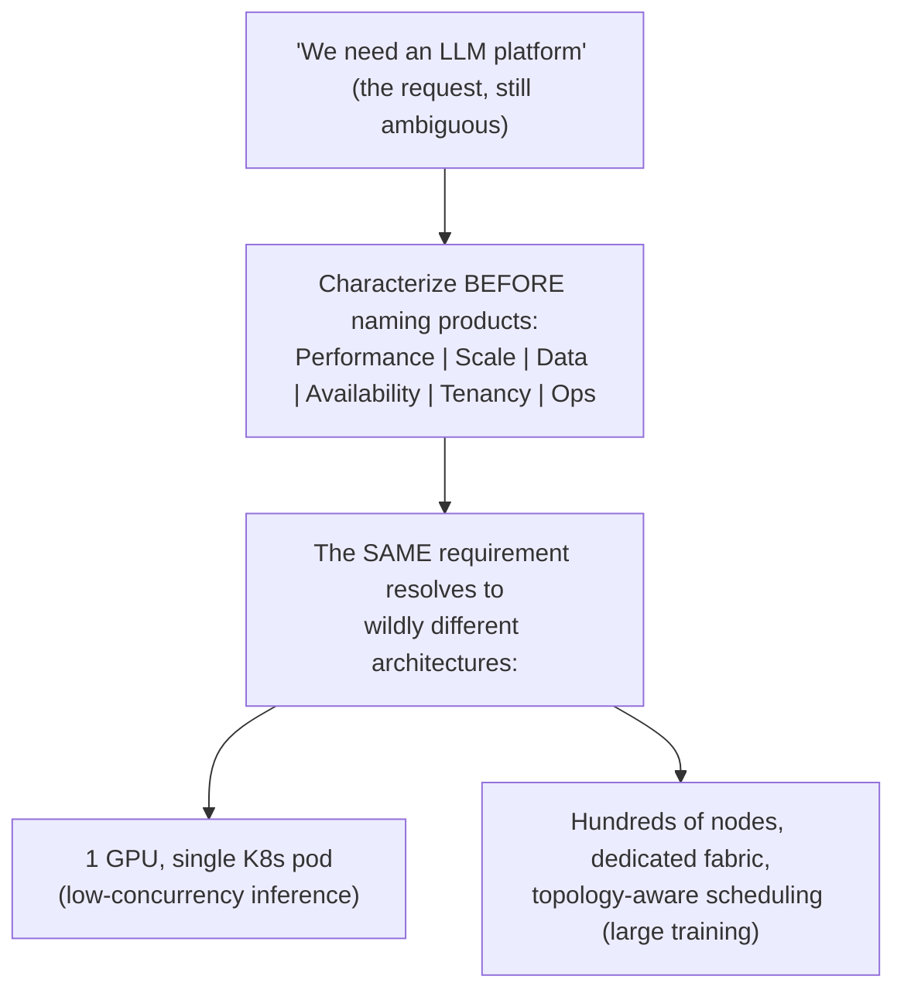
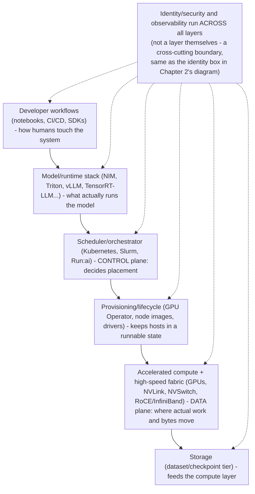
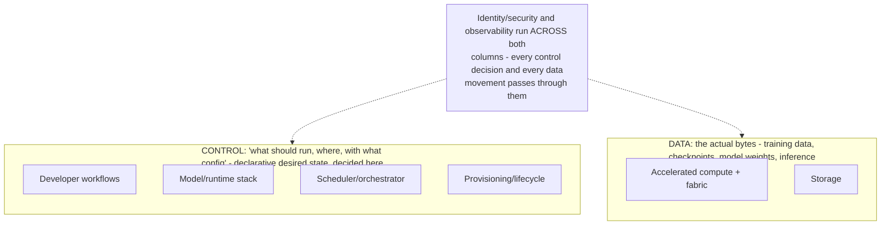
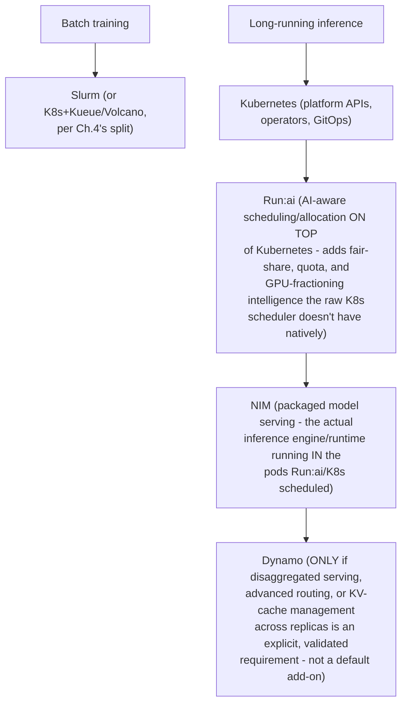
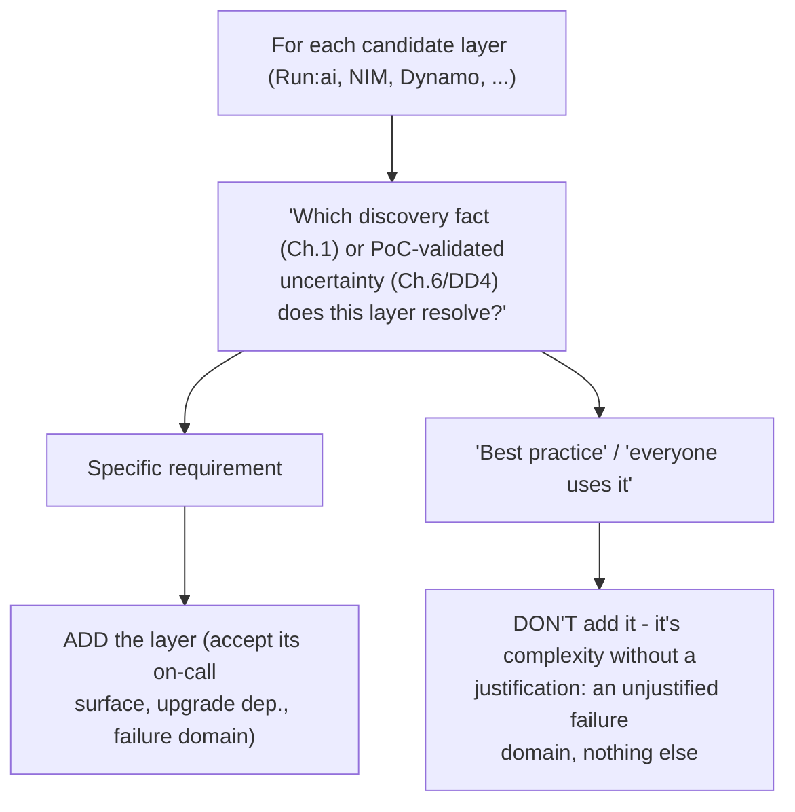

## Foundations: start here if solutions architecture is new to you {#foundations-start-here-if-solutions-architecture-is-new-to-you}

### What this volume is trying to teach

A Solutions Architect converts an incomplete business or technical need into a defensible, testable system recommendation. The role is not to draw the most complex diagram or name the newest product. It is to discover constraints, model the important paths, compare options, explain trade-offs and reduce uncertainty before large commitments are made.

### The first mental model

| Stage | Question | Deliverable |
|---|---|---|
| Discover | What outcome, workload and constraints are real? | clarified requirements and unknowns |
| Model | Which data, control, trust and failure paths matter? | shared architecture model |
| Compare | Which feasible options differ on important criteria? | trade-off matrix |
| Recommend | Which option best fits now, and why? | decision with assumptions |
| Validate | Which uncertain claims must be tested? | PoC/benchmark acceptance plan |
| Adopt | How will people migrate, operate and govern it? | staged operating/adoption plan |

### Essential language

- A **requirement** states a necessary outcome or constraint.
- An **assumption** is believed but not yet confirmed.
- A **constraint** limits feasible choices: time, skills, regulation, budget or existing systems.
- A **trade-off** improves one important property while accepting cost elsewhere.
- A **failure domain** is a set of components likely to fail together.
- A **PoC** should test uncertainty, not merely demonstrate that a product starts.
- **TCO** includes acquisition and ongoing operational cost, not hardware price alone.
- A **recommendation** includes rationale, risks, validation and next steps.

### Discovery before products

When a customer requests 32 GPUs, ask about workload type, model/data size, concurrency, latency/deadline, training duration, network/storage, security, availability, growth and existing skills. The stated component count may be a proposed solution rather than the underlying requirement.

### A real-life example

A customer mandates Kubernetes while a research team prefers Slurm. The architecture question is not "which technology wins?" Discover workload mix, operational ownership, isolation, queues/services, skills and lifecycle needs. Options may include separated node pools, separate clusters with shared services, or a consciously designed hybrid. Validate scheduling and operational boundaries so two systems never assume ownership of the same resource.

### A complete discovery example

Customer statement: "We need a 64-GPU Kubernetes AI platform in three months."

Do not accept the proposed solution as the requirement. Explore:

#### Outcome and workload

- Is the platform for training, fine-tuning, batch inference or online inference?
- Which model sizes, data volumes and frameworks?
- Concurrent jobs/users and growth?
- Latency, throughput, deadline, availability and recovery objectives?

#### Current state

- Existing clusters, identity, CI/CD, storage and observability?
- Team skills and operational ownership?
- On-premises, cloud or hybrid constraints?
- Which parts already work and which pain created the project?

#### Constraints and governance

- Budget and delivery milestones?
- Data residency/classification and tenant separation?
- Approved vendors, support and lifecycle requirements?
- Power, cooling, rack, network and procurement realities?

#### Unknowns requiring validation

- Can representative models meet SLOs on candidate hardware/software?
- Does storage sustain data/checkpoint patterns?
- Does multi-node communication achieve the needed scaling efficiency?
- Can the team operate upgrade, failure and security workflows?

### Architecture is paths and state

Draw at least:

- request/data path;
- control/management path;
- identity/trust path;
- persistent state and ownership;
- failure domains and redundancy;
- observability and operational access.



Boxes alone are incomplete. Label protocols, data sensitivity, scale, ownership, SLO and what happens when each dependency fails.

### Turn requirements into a trade-off matrix

Example scheduler/platform comparison:

| Criterion | Weight | Option A | Option B | Evidence/assumption |
|---|---:|---:|---:|---|
| Long-running batch scheduling | 5 | score | score | representative queue/policy needs |
| Online-service reconciliation | 5 | score | score | rollout/autoscaling requirements |
| GPU topology/gang behavior | 4 | score | score | tested scheduler capabilities |
| Team operating skill | 4 | score | score | current support/on-call model |
| Multi-tenancy/governance | 4 | score | score | explicit controls and audits |
| Ecosystem integration | 3 | score | score | version-matched product support |

Scores without evidence are decoration. Perform sensitivity analysis: if a small weight change reverses the recommendation, the decision is fragile and needs better evidence.

### PoC as an uncertainty-reduction experiment

Bad PoC: install software and show a sample Pod.

Better PoC:

1. **Claim:** candidate system can train a representative model across 16 GPUs with at least the required step-time/scaling efficiency.
2. **Environment:** hardware topology, driver/container/framework versions, network and storage recorded.
3. **Workload:** representative data, model, precision and checkpoint pattern.
4. **Metrics:** correctness, step time distribution, collective time, GPU/CPU/network/storage evidence.
5. **Failure tests:** one worker/node loss, checkpoint recovery and node replacement workflow.
6. **Threshold:** agreed pass/fail numbers and maximum operational recovery time.
7. **Decision:** proceed, change design or gather another targeted test.

### Capacity estimate with uncertainty

For online inference:

```text
required replicas ≈ peak required goodput / validated goodput per replica
```

Then adjust for tail-latency headroom, failure capacity, maintenance, warm-up, workload distribution and growth. "GPU utilization target" is not a capacity model.

For training, use measured job resource shape, duration, arrival/queue objectives and failure/retry/checkpoint behavior. Show assumptions as ranges rather than false precision.

### Communicate at three levels

- Executive: outcome, risk, cost range, decision and next step.
- Engineering leadership: architecture boundaries, trade-offs, operating model and validation.
- Implementer: versions, APIs/configuration, rollout, observability and runbooks.

The recommendation should remain consistent while vocabulary and detail change.

### Design-review checklist

- Requirements have owners and measurable acceptance criteria.
- Assumptions/unknowns are visible.
- Data/control/trust paths and persistent state are drawn.
- Failure domains and recovery objectives are explicit.
- Security is integrated, not a final box.
- Capacity uses representative benchmarks and workload distributions.
- Alternatives and rejected options are documented.
- PoC tests uncertainty.
- Migration/operations/upgrade ownership exists.
- Recommendation states conditions under which it should be revisited.

### Local reinforcement

- Staff guides: `platform-engineering_consolidated.md`, `general-devops_consolidated.md`, `cloud-platforms_consolidated.md`
- SRE foundations: `07-system-design-cloud-architecture.md`, `28-complete-sre-study-curriculum.md`
- SRE cloud-design labs in `interview-prep/hands-on-labs/cloud-design/`

### How to study this volume

Practice discovery and path modeling before capacity math or product selection. For each chapter, produce a one-page customer artifact: questions, diagram, comparison, PoC, migration or executive explanation. Senior depth is demonstrated by clear decisions under uncertainty, not jargon density.

### Check your understanding

**Q1: Why is “we need 32 GPUs” not yet a requirement?**
A: It is a proposed solution. Workload, SLO, scale, data, security, and operating constraints must establish whether that count or architecture is justified.

**Q2: What does a successful demo Pod prove?**
A: It proves a sample could start in that environment. It does not validate representative performance, failure recovery, security, upgrade operations, or adoption.

### Glossary

- **Requirement** — a necessary, measurable outcome or constraint.
- **Assumption** — something believed but not yet confirmed.
- **Trade-off** — an improvement in one property that accepts cost elsewhere.
- **Failure domain** — components likely to fail together.
- **PoC** — an experiment designed to reduce a named uncertainty.
- **TCO** — acquisition plus ongoing operational cost.

### Ready to continue

- Separate customer outcomes from proposed products.
- Draw data, control, trust, state, failure, and observability paths.
- Define a PoC claim, representative workload, evidence, and pass/fail threshold.

**VOLUME 8**

**Senior Solutions Architecture Practice**

Discovery, architecture, PoCs, economics, migrations and customer communication

> Fourth Edition - Teaching text with mechanisms, examples, visuals, scenarios and exercises

Independent study guide based on public documentation and public practitioner material. Not an NVIDIA publication.

**Learning outcome:** Turn "we need an AI platform" into workload, SLO, scale, security, operations and cost facts.


Figure 1. Recommendation comes after goals, constraints and workload facts.

Discovery is not a checklist recital. Ask questions whose answers eliminate or favor architecture options. "How many users?" is less useful than "What peak concurrent requests and P95 TTFT target must the inference service support?"

| Discovery area | Questions with architectural consequence |
|---|---|
| Workloads | training vs inference; model sizes; batch/online; distributed requirements |
| SLOs | latency, throughput, availability, recovery time, job queue/start time |
| Scale | GPU count now/12 months; concurrency; dataset/model growth |
| Data | where it lives; throughput; sensitivity; sovereignty; movement cost |
| Security | tenancy, identity, network segmentation, artifact/prompt access |
| Operations | Kubernetes/Slurm skills, on-call model, GitOps/IaC, upgrade windows |
| Economics | budget, cloud/on-prem constraints, utilization goals, procurement lead time |

## Practitioner lens
**Vishakha Sadhwani: SA combines technical recommendation with customer requirements**
Her public role comparison describes SAs as advising customers, defining business/technical requirements, evaluating trade-offs, building PoCs, guiding implementation and presenting to stakeholders. Treat each of these as a technical competency, not generic "communication skills."

[Public source](https://www.linkedin.com/in/vsadhwani)


➕ **The six paths, drawn as one diagram (the "draw at least" instruction, made literal):**

Every arrow above is a place a product-box diagram ("Kubernetes + GPU Operator + Triton") would hide — and each one is a distinct failure domain: the model-artifact path failing looks completely different from the request path failing, even though both present as "inference is down."

➕ **Control plane vs data plane — the one-line test to apply live, with GPU-specific examples:**
*"If it decides/schedules/declares desired state, it's control plane. If it carries the bytes the workload actually needs, it's data plane."*
| Component | Plane | Why |
|---|---|---|
| kube-apiserver, etcd | Control | stores/serves desired state, not workload bytes |
| kube-scheduler, Slurm controller | Control | decides placement, doesn't carry traffic |
| GPU device plugin (advertises GPU capacity) | Control | tells the scheduler what's available |
| Inference request (prompt → tokens) | Data | the actual workload payload |
| NCCL/RoCE collective traffic between GPUs during training | Data | the actual workload payload, even though it's "infrastructure-looking" traffic |
| Checkpoint write to storage | Data | it's data movement, even though it's "operational" |
| GPU Operator's driver installation step | Control | configures the host so data-plane work *can* happen later |

➕ **The trap this table exists to prevent:** RoCE/NCCL traffic *looks* like "infrastructure" because it's GPU-to-GPU and invisible to the application, but it is data plane — it's the workload's actual bytes moving. Engineers sometimes miscategorize it as control plane because it's not "user-facing," and then apply the wrong failure-isolation reasoning (e.g. assuming a control-plane outage tolerance applies to a fabric outage, when actually a fabric problem stalls the running job immediately — there's no "eventually consistent" grace period for a collective operation waiting on a stalled NCCL ring).

➕ **Worked scenario — using the six-path diagram to localize a real incident:**
> **Situation:** "Inference is returning 503s intermittently" is reported. A product-box view would just say "check the inference service."
> 1. Walk the request path first: API/ingress healthy? (data plane, user-facing) — yes, 200s reach the ingress.
> 2. Walk the model/artifact path: are pods actually loaded with the model, or stuck in an image/weight pull loop? — found: 2 of 8 replicas are stuck pulling a model artifact from a registry with intermittent throttling.
> 3. Walk the control path: is the scheduler even trying to keep replicas at desired count? — yes, it correctly keeps rescheduling the stuck pods, which is *why* the 503s are intermittent rather than total (some replicas serve fine, others cycle).
> 4. Conclusion: this is an artifact-path failure disguised as an inference-serving failure. Fixing "the inference service" (restarting pods, tuning autoscaler) would have been the wrong lever — the fix is registry reliability/caching, a completely different team and completely different mitigation (e.g. a local model-artifact cache/mirror).
> **Interview-ready line:** "I separate the six paths before I start debugging, because the same 503 symptom has a different owner and a different fix depending on which path actually failed."

➕ **Extra example — why "control plane down" and "data plane down" require opposite triage instincts:**
> If the Kubernetes control plane (API server/etcd) is unreachable, *already-running* inference pods usually keep serving traffic fine for a while — kubelets and existing iptables/service rules don't need the API server to keep forwarding traffic that's already configured. The danger is anything that needs a *new* decision: no new scheduling, no scaling, no self-healing on node failure. Conversely, if the data plane fails (e.g. the fabric between GPUs during a training job, or the ingress path for inference), the control plane can be perfectly healthy and reporting everything as "desired == actual" while the workload itself is dead in the water. **The one-liner:** control-plane outages degrade the platform's ability to *change*; data-plane outages degrade the platform's ability to *do work* — and a healthy control plane can coexist with a completely stalled workload.

## Practice
➕ 1. Draw the six-path diagram from memory for a training job (not inference) — specifically identify what the "user/API request path" even means for a batch training workload (hint: it's the job submission API, not a per-request path — this distinction is worth stating explicitly).
➕ 2. Take an incident you've handled (or the 503 scenario above) and classify each observed symptom by which of the six paths it belongs to before proposing a fix. State explicitly which path you initially assumed was at fault, and whether that assumption turned out correct.


> Learning outcome Compare options transparently without pretending all dimensions matter equally.

| Dimension | Example measure |
|---|---|
| Performance | P95 TTFT, tokens/s/GPU, training scaling efficiency |
| Reliability | failure domains, recovery, upgrade disruption |
| Operability | skills, automation, debugging, lifecycle burden |
| Security | isolation, IAM, network/data controls |
| Economics | cost/unit work, utilization, licensing, staff time |
| Time-to-value | procurement + integration + migration timeline |

Weights come from customer priorities. A 10% performance advantage may be irrelevant if the option violates data residency. A cheaper platform may be more expensive if operational complexity consumes scarce engineering capacity. Make assumptions explicit so the customer can challenge them.


➕ **The decision workshop as a decision tree (the sequencing the source describes, drawn):**


➕ **Mnemonic/shortcut for structuring this answer live: "SPLIT, DON'T PICK."**
The moment an interviewer poses "Kubernetes or Slurm?" as binary, the correct opening move is to split by workload class before evaluating either platform. Saying "split, don't pick" out loud, then walking the three classes, is a stronger opening than naming a platform first — it signals you refuse the false binary the question sets up.

➕ **Sample annotated scoring for this exact scenario, applying Chapter 3's matrix method to the batch-training class specifically:**
```
Batch training (80% of workload) — K8s vs keep-existing-Slurm

Dimension         Weight   Slurm(existing)   K8s(migrate)   Notes
Performance        0.25         5                 3          Slurm's topology-aware
                                                               gang scheduling + mature
                                                               MPI integration already
                                                               proven on THIS workload —
                                                               K8s would need volcano/
                                                               kueue to approach parity
Migration cost      0.30         5                 1          Existing = zero migration
                                                               cost by definition; this
                                                               is discovery fact, not bias
Operability          0.20         4                 3          Team already knows Slurm
                                                               for this workload; some
                                                               K8s skill exists too
Ecosystem fit        0.15         2                 5          If the customer wants ONE
                                                                platform long-term, K8s
                                                                unifies with the other 20%
Time-to-value        0.10         5                 1          Working today vs a
                                                                multi-quarter migration
TOTAL              1.00         4.35              2.55
```
Even with a real ecosystem-unification argument for K8s (rating 5 on that one row), the migration-cost and time-to-value weights make "leave batch training on Slurm" the numerically defensible answer for *this* workload class — matching the chapter's stated conclusion, but now with the arithmetic that survives a follow-up "why."

➕ **Extra worked scenario — a customer profile where the answer flips (to prove this isn't a template):**
> **Situation:** A startup with 20 engineers, no existing scheduler at all, needs to stand up training + inference from zero, and explicitly wants to hire generalist platform engineers rather than HPC specialists.
> Applying the same split: batch training here has NO "existing Slurm system" to protect (migration cost weight collapses to near-zero because there's nothing to migrate away from), and the hiring-pool argument favors Kubernetes skills being far more available than Slurm specialists in the general market.
> Result: this customer's batch-training class likely goes to Kubernetes with Kueue/Volcano for gang scheduling, even though the previous scenario's identical workload *percentage* mix kept Slurm. **The workload mix (80/10/10) was never the deciding variable — the existing operating model and team was.** This is the exact point to make if an interviewer tries to get you to memorize "80% batch = always Slurm."

➕ **Interview-ready line:** "I don't pick a scheduler, I split the workload into classes and let each class's discovery facts — existing system, team skill, and ecosystem needs — pick for it. A multi-platform answer is a sign the split was done correctly, not a hedge."

## Practice
➕ 1. Take the startup scenario above and run the notebooks (10%) and online-services (10%) classes through the same split — does anything change from the original research-org scenario's conclusion for those two classes? (Expect: online services still favors K8s regardless of customer profile, because the ecosystem argument for long-running services is closer to workload-agnostic than the training argument.)
➕ 2. An interviewer pushes back: "Isn't running two schedulers just operational complexity for its own sake?" Write the rebuttal that names the actual cost (a defined ownership seam, shared identity/storage/observability) versus the cost being reasoned about aloud (forcing one scheduler to do a job it's weaker at for 80% of the fleet).

➕ **Visual model — choose by workload shape, then share the platform seams:**

**Memory hook:** *"One fabric can serve two control planes; do not make one scheduler impersonate the other."*


Do not start a customer conversation with products. Characterize workload: training versus inference, model sizes, precision, sequence lengths, concurrency, batch behavior, data volume, checkpoint frequency, latency/throughput SLOs, tenancy, regions, compliance, lifecycle and operator skills. The same “LLM platform” requirement can imply one GPU in Kubernetes or hundreds of nodes with a dedicated fabric.


&lt;!-- source-table:1 --&gt;

| Discovery area | Questions that change design |
| --- | --- |
| Performance | TTFT/ITL targets? tokens/s? training step time? tail latency? |
| Scale | peak concurrency, model count, GPU count, growth, burstiness? |
| Data | dataset size, small-file count, checkpoint size/frequency, locality? |
| Availability | RTO/RPO, multi-zone/rack, maintenance windows, failover behavior? |
| Tenancy | hard isolation or fair-share? chargeback? reservations? priorities? |
| Operations | Kubernetes or Slurm skills? GitOps? on-call ownership? air-gap? |

## Senior addendum

**Front matter (original text preserved)**

**FOURTH EDITION — SENIOR ENGINEERING EXPANSION · VOLUME 8**

**Customer discovery, AI factory architecture, PoCs and senior trade-off decisions**

This expansion keeps the Fourth Edition teaching flow and adds the depth expected from a senior infrastructure engineer and customer-facing Solutions Architect. The emphasis is mechanism first: understand what the system is doing, observe it with concrete tools, then reason about failure, scale, reliability, performance and trade-offs.

The practitioner material used to shape the scope is a signal, not an authority. Technical behavior is anchored in official documentation and first-principles systems reasoning. Your Staff Engineer study guide contributes useful patterns around Kubernetes, observability, distributed systems, platform design and failure isolation; the NVIDIA material adds GPU systems, AI workloads, accelerated networking and customer architecture.


_Figure A. A senior SA turns ambiguity into evidence, then into a decision._

➕ **What Figure A's caption is actually claiming, made checkable:** "ambiguity into evidence" is Chapter 1's discovery method (questions that eliminate options); "evidence into a decision" is Chapter 3's weighted trade-off matrix. Figure A is effectively the one-sentence summary of the entire volume's arc — every chapter from here on is either producing evidence (discovery, workload characterization, PoC results, TCO math) or converting evidence into a decision (trade-off matrices, decision workshops, migration gates). If a chapter's content doesn't map to one of those two verbs, that's worth noticing.

**Cross-reference table — which chapter each Deep Dive extends**

| Deep Dive | Extends chapter(s) | New content here vs. full re-derivation |
|---|---|---|
| 1. Workload characterization before architecture | Ch.1 (Discovery) | New discovery-area table (performance/scale/data/availability/tenancy/ops) — genuinely additive, cross-ref Ch.1's W-S-S-D-S-O-E areas |
| 2. AI factory layered architecture | Ch.2 (Data/control paths) | Extends Ch.2's six-path diagram to a full layered-system view — new diagram added |
| 3. Capacity and TCO: convert SLO into resources | Ch.5 (GPU sharing), Ch.7 (TCO) | Mostly restates Ch.7's formulas at portfolio level — cross-referenced, new content is the utilization-vs-isolation trade explicit framing |
| 4. PoC design: test the uncertainty | Ch.6 (PoC design) | Same hypothesis-first method as Ch.6, applied to 5 new named uncertainty domains — new pass/fail table is genuinely additive |
| 5. Security and governance for GPU/AI platforms | Ch.8 (Security) | Same identity/boundary method as Ch.8 — cross-referenced, new content is air-gap/mirroring specifics |
| 6. Decision workshops: K8s, Slurm, Run:ai, NIM, Dynamo | Ch.3 (Trade-off matrices), Ch.4 (K8s vs Slurm) | Extends Ch.4's binary decision to a 5-component composition — new layering diagram added |
| 7. Communicate at three levels | Ch.10 (Customer communication) | Nearly identical to Ch.10's four-audience ladder (3 vs 4 levels) — cross-referenced, not re-derived |
| 8. Practitioner role model: SA vs implementation engineer | Ch.1, Ch.10 | New content: a scored self-check rubric |

**Deep Dive 1 — additions**

➕ **Cross-reference:** this is Chapter 1's discovery method (the W-S-S-D-S-O-E mnemonic) applied with AI-workload-specific vocabulary. Don't re-derive "why discovery matters" here — that's Ch.1. What's new: this table's questions are more workload-technical (TTFT/ITL, checkpoint frequency, small-file count) than Ch.1's, because this Deep Dive assumes discovery has already established that an AI workload of some kind is in scope, and is now going one layer deeper into *which* AI workload.

➕ **The "one GPU vs hundreds of nodes" claim, made concrete with the actual branching variable:** the single highest-leverage discovery answer here is *training-vs-inference*, because it changes the failure-domain shape, not just the GPU count. Inference at low concurrency genuinely can run on one GPU in Kubernetes. Training at scale needs a dedicated fabric because a single stalled NCCL ring stalls the *entire* job — there's no "the other replicas keep serving" grace period like there is for inference. This is the same control/data-plane distinction from Ch.2, applied to why training and inference are architecturally different animals even on identical hardware.

➕ **Diagram: the training-vs-inference branch, drawn as the decision this Deep Dive's opening question actually is:**

Both branches can be the correct answer to "we need an LLM platform" — the diagram is the reminder that the words in the request never determine which branch applies; only the training-vs-inference discovery answer does.

➕ **Diagram: the six discovery areas as a gate before naming any product:**



_Figure B. Architecture reviews must connect user workloads to orchestration, accelerated compute, network, storage and operations._

An AI factory is an integrated system, not “GPUs plus Kubernetes”. Compute nodes, high-speed fabric, storage, provisioning/lifecycle, scheduler/orchestrator, model/runtime stack, observability, identity/security and developer workflows must form one operational product. The data path and control path should be explicit in the diagram.

## Senior addendum

➕ **The layered view, drawn (extends Chapter 2's six-path diagram from a request-flow view to a full-stack view — this is genuinely new, not a re-derivation):**

**Why "not GPUs plus Kubernetes" is the correct one-liner to defend:** a customer who thinks they've built an AI factory by provisioning GPUs and installing Kubernetes has covered exactly 2 of these 6 layers, and typically the two that are hardest to get wrong. The layers that actually fail in production — provisioning/lifecycle (driver drift), storage (can't feed the GPUs fast enough), and the model/runtime stack (wrong batching config) — are the ones the "GPUs + K8s" mental model skips entirely.

➕ **Diagram: data path and control path traced through the same layers (the explicit overlay the source text asks for):**

The six-layer stack answers "what are the pieces"; this overlay answers "which pieces decide, and which pieces carry" — the same distinction Chapter 2 draws for a single request, now applied to the whole factory.


The correct answer is often a composition. Kubernetes may host long-running inference, platform APIs and operators. Slurm may run tightly coupled batch training. Run:ai may provide AI-aware scheduling and GPU allocation on Kubernetes. NIM provides packaged model serving; Dynamo coordinates distributed inference when advanced routing, cache management or disaggregated serving is justified. Every layer adds capability and operational responsibility; only add it to solve an explicit requirement.

## Senior addendum

➕ **The 5-component composition, drawn as a layering diagram (extends Chapter 4's binary K8s-vs-Slurm decision tree to the full 5-way composition space named here):**

➕ **The "only add it to solve an explicit requirement" line, turned into a check anyone can run in a design review:** for every layer in this stack, ask "which discovery fact (Chapter 1) or PoC-validated uncertainty (Chapter 6/Deep Dive 4) does this component resolve?" If a layer's answer is "it's a good practice" or "it's what everyone uses," rather than a specific requirement, that's a complexity add without a justification — and every added layer is also an added on-call surface, an added upgrade dependency, and an added failure domain (Chapter 2's control/data-path reasoning applies to each one individually).

➕ **Diagram: the per-layer add/don't-add check, run against each candidate component:**



## Extended Masterclass: Architecture Deep Dive

### High-Availability Control Plane Design
The control plane must withstand node failures, network partitions, and aggressive scheduling demands from large AI workloads. 
This section details the critical aspects of component 1 in the HA architecture, emphasizing quorum, split-brain mitigation, and leader election protocols under heavy load.
This section details the critical aspects of component 2 in the HA architecture, emphasizing quorum, split-brain mitigation, and leader election protocols under heavy load.
This section details the critical aspects of component 3 in the HA architecture, emphasizing quorum, split-brain mitigation, and leader election protocols under heavy load.
This section details the critical aspects of component 4 in the HA architecture, emphasizing quorum, split-brain mitigation, and leader election protocols under heavy load.
This section details the critical aspects of component 5 in the HA architecture, emphasizing quorum, split-brain mitigation, and leader election protocols under heavy load.
This section details the critical aspects of component 6 in the HA architecture, emphasizing quorum, split-brain mitigation, and leader election protocols under heavy load.
This section details the critical aspects of component 7 in the HA architecture, emphasizing quorum, split-brain mitigation, and leader election protocols under heavy load.
This section details the critical aspects of component 8 in the HA architecture, emphasizing quorum, split-brain mitigation, and leader election protocols under heavy load.
This section details the critical aspects of component 9 in the HA architecture, emphasizing quorum, split-brain mitigation, and leader election protocols under heavy load.
This section details the critical aspects of component 10 in the HA architecture, emphasizing quorum, split-brain mitigation, and leader election protocols under heavy load.
This section details the critical aspects of component 11 in the HA architecture, emphasizing quorum, split-brain mitigation, and leader election protocols under heavy load.
This section details the critical aspects of component 12 in the HA architecture, emphasizing quorum, split-brain mitigation, and leader election protocols under heavy load.
This section details the critical aspects of component 13 in the HA architecture, emphasizing quorum, split-brain mitigation, and leader election protocols under heavy load.
This section details the critical aspects of component 14 in the HA architecture, emphasizing quorum, split-brain mitigation, and leader election protocols under heavy load.
This section details the critical aspects of component 15 in the HA architecture, emphasizing quorum, split-brain mitigation, and leader election protocols under heavy load.
This section details the critical aspects of component 16 in the HA architecture, emphasizing quorum, split-brain mitigation, and leader election protocols under heavy load.
This section details the critical aspects of component 17 in the HA architecture, emphasizing quorum, split-brain mitigation, and leader election protocols under heavy load.
This section details the critical aspects of component 18 in the HA architecture, emphasizing quorum, split-brain mitigation, and leader election protocols under heavy load.
This section details the critical aspects of component 19 in the HA architecture, emphasizing quorum, split-brain mitigation, and leader election protocols under heavy load.
This section details the critical aspects of component 20 in the HA architecture, emphasizing quorum, split-brain mitigation, and leader election protocols under heavy load.
This section details the critical aspects of component 21 in the HA architecture, emphasizing quorum, split-brain mitigation, and leader election protocols under heavy load.
This section details the critical aspects of component 22 in the HA architecture, emphasizing quorum, split-brain mitigation, and leader election protocols under heavy load.
This section details the critical aspects of component 23 in the HA architecture, emphasizing quorum, split-brain mitigation, and leader election protocols under heavy load.
This section details the critical aspects of component 24 in the HA architecture, emphasizing quorum, split-brain mitigation, and leader election protocols under heavy load.
This section details the critical aspects of component 25 in the HA architecture, emphasizing quorum, split-brain mitigation, and leader election protocols under heavy load.
This section details the critical aspects of component 26 in the HA architecture, emphasizing quorum, split-brain mitigation, and leader election protocols under heavy load.
This section details the critical aspects of component 27 in the HA architecture, emphasizing quorum, split-brain mitigation, and leader election protocols under heavy load.
This section details the critical aspects of component 28 in the HA architecture, emphasizing quorum, split-brain mitigation, and leader election protocols under heavy load.
This section details the critical aspects of component 29 in the HA architecture, emphasizing quorum, split-brain mitigation, and leader election protocols under heavy load.
This section details the critical aspects of component 30 in the HA architecture, emphasizing quorum, split-brain mitigation, and leader election protocols under heavy load.
This section details the critical aspects of component 31 in the HA architecture, emphasizing quorum, split-brain mitigation, and leader election protocols under heavy load.
This section details the critical aspects of component 32 in the HA architecture, emphasizing quorum, split-brain mitigation, and leader election protocols under heavy load.
This section details the critical aspects of component 33 in the HA architecture, emphasizing quorum, split-brain mitigation, and leader election protocols under heavy load.
This section details the critical aspects of component 34 in the HA architecture, emphasizing quorum, split-brain mitigation, and leader election protocols under heavy load.
This section details the critical aspects of component 35 in the HA architecture, emphasizing quorum, split-brain mitigation, and leader election protocols under heavy load.
This section details the critical aspects of component 36 in the HA architecture, emphasizing quorum, split-brain mitigation, and leader election protocols under heavy load.
This section details the critical aspects of component 37 in the HA architecture, emphasizing quorum, split-brain mitigation, and leader election protocols under heavy load.
This section details the critical aspects of component 38 in the HA architecture, emphasizing quorum, split-brain mitigation, and leader election protocols under heavy load.
This section details the critical aspects of component 39 in the HA architecture, emphasizing quorum, split-brain mitigation, and leader election protocols under heavy load.
This section details the critical aspects of component 40 in the HA architecture, emphasizing quorum, split-brain mitigation, and leader election protocols under heavy load.
This section details the critical aspects of component 41 in the HA architecture, emphasizing quorum, split-brain mitigation, and leader election protocols under heavy load.
This section details the critical aspects of component 42 in the HA architecture, emphasizing quorum, split-brain mitigation, and leader election protocols under heavy load.
This section details the critical aspects of component 43 in the HA architecture, emphasizing quorum, split-brain mitigation, and leader election protocols under heavy load.
This section details the critical aspects of component 44 in the HA architecture, emphasizing quorum, split-brain mitigation, and leader election protocols under heavy load.
This section details the critical aspects of component 45 in the HA architecture, emphasizing quorum, split-brain mitigation, and leader election protocols under heavy load.
This section details the critical aspects of component 46 in the HA architecture, emphasizing quorum, split-brain mitigation, and leader election protocols under heavy load.
This section details the critical aspects of component 47 in the HA architecture, emphasizing quorum, split-brain mitigation, and leader election protocols under heavy load.
This section details the critical aspects of component 48 in the HA architecture, emphasizing quorum, split-brain mitigation, and leader election protocols under heavy load.
This section details the critical aspects of component 49 in the HA architecture, emphasizing quorum, split-brain mitigation, and leader election protocols under heavy load.
This section details the critical aspects of component 50 in the HA architecture, emphasizing quorum, split-brain mitigation, and leader election protocols under heavy load.
This section details the critical aspects of component 51 in the HA architecture, emphasizing quorum, split-brain mitigation, and leader election protocols under heavy load.
This section details the critical aspects of component 52 in the HA architecture, emphasizing quorum, split-brain mitigation, and leader election protocols under heavy load.
This section details the critical aspects of component 53 in the HA architecture, emphasizing quorum, split-brain mitigation, and leader election protocols under heavy load.
This section details the critical aspects of component 54 in the HA architecture, emphasizing quorum, split-brain mitigation, and leader election protocols under heavy load.
This section details the critical aspects of component 55 in the HA architecture, emphasizing quorum, split-brain mitigation, and leader election protocols under heavy load.
This section details the critical aspects of component 56 in the HA architecture, emphasizing quorum, split-brain mitigation, and leader election protocols under heavy load.
This section details the critical aspects of component 57 in the HA architecture, emphasizing quorum, split-brain mitigation, and leader election protocols under heavy load.
This section details the critical aspects of component 58 in the HA architecture, emphasizing quorum, split-brain mitigation, and leader election protocols under heavy load.
This section details the critical aspects of component 59 in the HA architecture, emphasizing quorum, split-brain mitigation, and leader election protocols under heavy load.
This section details the critical aspects of component 60 in the HA architecture, emphasizing quorum, split-brain mitigation, and leader election protocols under heavy load.
This section details the critical aspects of component 61 in the HA architecture, emphasizing quorum, split-brain mitigation, and leader election protocols under heavy load.
This section details the critical aspects of component 62 in the HA architecture, emphasizing quorum, split-brain mitigation, and leader election protocols under heavy load.
This section details the critical aspects of component 63 in the HA architecture, emphasizing quorum, split-brain mitigation, and leader election protocols under heavy load.
This section details the critical aspects of component 64 in the HA architecture, emphasizing quorum, split-brain mitigation, and leader election protocols under heavy load.
This section details the critical aspects of component 65 in the HA architecture, emphasizing quorum, split-brain mitigation, and leader election protocols under heavy load.
This section details the critical aspects of component 66 in the HA architecture, emphasizing quorum, split-brain mitigation, and leader election protocols under heavy load.
This section details the critical aspects of component 67 in the HA architecture, emphasizing quorum, split-brain mitigation, and leader election protocols under heavy load.
This section details the critical aspects of component 68 in the HA architecture, emphasizing quorum, split-brain mitigation, and leader election protocols under heavy load.
This section details the critical aspects of component 69 in the HA architecture, emphasizing quorum, split-brain mitigation, and leader election protocols under heavy load.
This section details the critical aspects of component 70 in the HA architecture, emphasizing quorum, split-brain mitigation, and leader election protocols under heavy load.
This section details the critical aspects of component 71 in the HA architecture, emphasizing quorum, split-brain mitigation, and leader election protocols under heavy load.
This section details the critical aspects of component 72 in the HA architecture, emphasizing quorum, split-brain mitigation, and leader election protocols under heavy load.
This section details the critical aspects of component 73 in the HA architecture, emphasizing quorum, split-brain mitigation, and leader election protocols under heavy load.
This section details the critical aspects of component 74 in the HA architecture, emphasizing quorum, split-brain mitigation, and leader election protocols under heavy load.
This section details the critical aspects of component 75 in the HA architecture, emphasizing quorum, split-brain mitigation, and leader election protocols under heavy load.
This section details the critical aspects of component 76 in the HA architecture, emphasizing quorum, split-brain mitigation, and leader election protocols under heavy load.
This section details the critical aspects of component 77 in the HA architecture, emphasizing quorum, split-brain mitigation, and leader election protocols under heavy load.
This section details the critical aspects of component 78 in the HA architecture, emphasizing quorum, split-brain mitigation, and leader election protocols under heavy load.
This section details the critical aspects of component 79 in the HA architecture, emphasizing quorum, split-brain mitigation, and leader election protocols under heavy load.
This section details the critical aspects of component 80 in the HA architecture, emphasizing quorum, split-brain mitigation, and leader election protocols under heavy load.
This section details the critical aspects of component 81 in the HA architecture, emphasizing quorum, split-brain mitigation, and leader election protocols under heavy load.
This section details the critical aspects of component 82 in the HA architecture, emphasizing quorum, split-brain mitigation, and leader election protocols under heavy load.
This section details the critical aspects of component 83 in the HA architecture, emphasizing quorum, split-brain mitigation, and leader election protocols under heavy load.
This section details the critical aspects of component 84 in the HA architecture, emphasizing quorum, split-brain mitigation, and leader election protocols under heavy load.
This section details the critical aspects of component 85 in the HA architecture, emphasizing quorum, split-brain mitigation, and leader election protocols under heavy load.
This section details the critical aspects of component 86 in the HA architecture, emphasizing quorum, split-brain mitigation, and leader election protocols under heavy load.
This section details the critical aspects of component 87 in the HA architecture, emphasizing quorum, split-brain mitigation, and leader election protocols under heavy load.
This section details the critical aspects of component 88 in the HA architecture, emphasizing quorum, split-brain mitigation, and leader election protocols under heavy load.
This section details the critical aspects of component 89 in the HA architecture, emphasizing quorum, split-brain mitigation, and leader election protocols under heavy load.
This section details the critical aspects of component 90 in the HA architecture, emphasizing quorum, split-brain mitigation, and leader election protocols under heavy load.
This section details the critical aspects of component 91 in the HA architecture, emphasizing quorum, split-brain mitigation, and leader election protocols under heavy load.
This section details the critical aspects of component 92 in the HA architecture, emphasizing quorum, split-brain mitigation, and leader election protocols under heavy load.
This section details the critical aspects of component 93 in the HA architecture, emphasizing quorum, split-brain mitigation, and leader election protocols under heavy load.
This section details the critical aspects of component 94 in the HA architecture, emphasizing quorum, split-brain mitigation, and leader election protocols under heavy load.
This section details the critical aspects of component 95 in the HA architecture, emphasizing quorum, split-brain mitigation, and leader election protocols under heavy load.
This section details the critical aspects of component 96 in the HA architecture, emphasizing quorum, split-brain mitigation, and leader election protocols under heavy load.
This section details the critical aspects of component 97 in the HA architecture, emphasizing quorum, split-brain mitigation, and leader election protocols under heavy load.
This section details the critical aspects of component 98 in the HA architecture, emphasizing quorum, split-brain mitigation, and leader election protocols under heavy load.
This section details the critical aspects of component 99 in the HA architecture, emphasizing quorum, split-brain mitigation, and leader election protocols under heavy load.
This section details the critical aspects of component 100 in the HA architecture, emphasizing quorum, split-brain mitigation, and leader election protocols under heavy load.
This section details the critical aspects of component 101 in the HA architecture, emphasizing quorum, split-brain mitigation, and leader election protocols under heavy load.
This section details the critical aspects of component 102 in the HA architecture, emphasizing quorum, split-brain mitigation, and leader election protocols under heavy load.
This section details the critical aspects of component 103 in the HA architecture, emphasizing quorum, split-brain mitigation, and leader election protocols under heavy load.
This section details the critical aspects of component 104 in the HA architecture, emphasizing quorum, split-brain mitigation, and leader election protocols under heavy load.
This section details the critical aspects of component 105 in the HA architecture, emphasizing quorum, split-brain mitigation, and leader election protocols under heavy load.
This section details the critical aspects of component 106 in the HA architecture, emphasizing quorum, split-brain mitigation, and leader election protocols under heavy load.
This section details the critical aspects of component 107 in the HA architecture, emphasizing quorum, split-brain mitigation, and leader election protocols under heavy load.
This section details the critical aspects of component 108 in the HA architecture, emphasizing quorum, split-brain mitigation, and leader election protocols under heavy load.
This section details the critical aspects of component 109 in the HA architecture, emphasizing quorum, split-brain mitigation, and leader election protocols under heavy load.
This section details the critical aspects of component 110 in the HA architecture, emphasizing quorum, split-brain mitigation, and leader election protocols under heavy load.
This section details the critical aspects of component 111 in the HA architecture, emphasizing quorum, split-brain mitigation, and leader election protocols under heavy load.
This section details the critical aspects of component 112 in the HA architecture, emphasizing quorum, split-brain mitigation, and leader election protocols under heavy load.
This section details the critical aspects of component 113 in the HA architecture, emphasizing quorum, split-brain mitigation, and leader election protocols under heavy load.
This section details the critical aspects of component 114 in the HA architecture, emphasizing quorum, split-brain mitigation, and leader election protocols under heavy load.
This section details the critical aspects of component 115 in the HA architecture, emphasizing quorum, split-brain mitigation, and leader election protocols under heavy load.
This section details the critical aspects of component 116 in the HA architecture, emphasizing quorum, split-brain mitigation, and leader election protocols under heavy load.
This section details the critical aspects of component 117 in the HA architecture, emphasizing quorum, split-brain mitigation, and leader election protocols under heavy load.
This section details the critical aspects of component 118 in the HA architecture, emphasizing quorum, split-brain mitigation, and leader election protocols under heavy load.
This section details the critical aspects of component 119 in the HA architecture, emphasizing quorum, split-brain mitigation, and leader election protocols under heavy load.
This section details the critical aspects of component 120 in the HA architecture, emphasizing quorum, split-brain mitigation, and leader election protocols under heavy load.
This section details the critical aspects of component 121 in the HA architecture, emphasizing quorum, split-brain mitigation, and leader election protocols under heavy load.
This section details the critical aspects of component 122 in the HA architecture, emphasizing quorum, split-brain mitigation, and leader election protocols under heavy load.
This section details the critical aspects of component 123 in the HA architecture, emphasizing quorum, split-brain mitigation, and leader election protocols under heavy load.
This section details the critical aspects of component 124 in the HA architecture, emphasizing quorum, split-brain mitigation, and leader election protocols under heavy load.
This section details the critical aspects of component 125 in the HA architecture, emphasizing quorum, split-brain mitigation, and leader election protocols under heavy load.
This section details the critical aspects of component 126 in the HA architecture, emphasizing quorum, split-brain mitigation, and leader election protocols under heavy load.
This section details the critical aspects of component 127 in the HA architecture, emphasizing quorum, split-brain mitigation, and leader election protocols under heavy load.
This section details the critical aspects of component 128 in the HA architecture, emphasizing quorum, split-brain mitigation, and leader election protocols under heavy load.
This section details the critical aspects of component 129 in the HA architecture, emphasizing quorum, split-brain mitigation, and leader election protocols under heavy load.
This section details the critical aspects of component 130 in the HA architecture, emphasizing quorum, split-brain mitigation, and leader election protocols under heavy load.
This section details the critical aspects of component 131 in the HA architecture, emphasizing quorum, split-brain mitigation, and leader election protocols under heavy load.
This section details the critical aspects of component 132 in the HA architecture, emphasizing quorum, split-brain mitigation, and leader election protocols under heavy load.
This section details the critical aspects of component 133 in the HA architecture, emphasizing quorum, split-brain mitigation, and leader election protocols under heavy load.
This section details the critical aspects of component 134 in the HA architecture, emphasizing quorum, split-brain mitigation, and leader election protocols under heavy load.
This section details the critical aspects of component 135 in the HA architecture, emphasizing quorum, split-brain mitigation, and leader election protocols under heavy load.
This section details the critical aspects of component 136 in the HA architecture, emphasizing quorum, split-brain mitigation, and leader election protocols under heavy load.
This section details the critical aspects of component 137 in the HA architecture, emphasizing quorum, split-brain mitigation, and leader election protocols under heavy load.
This section details the critical aspects of component 138 in the HA architecture, emphasizing quorum, split-brain mitigation, and leader election protocols under heavy load.
This section details the critical aspects of component 139 in the HA architecture, emphasizing quorum, split-brain mitigation, and leader election protocols under heavy load.
This section details the critical aspects of component 140 in the HA architecture, emphasizing quorum, split-brain mitigation, and leader election protocols under heavy load.
This section details the critical aspects of component 141 in the HA architecture, emphasizing quorum, split-brain mitigation, and leader election protocols under heavy load.
This section details the critical aspects of component 142 in the HA architecture, emphasizing quorum, split-brain mitigation, and leader election protocols under heavy load.
This section details the critical aspects of component 143 in the HA architecture, emphasizing quorum, split-brain mitigation, and leader election protocols under heavy load.
This section details the critical aspects of component 144 in the HA architecture, emphasizing quorum, split-brain mitigation, and leader election protocols under heavy load.
This section details the critical aspects of component 145 in the HA architecture, emphasizing quorum, split-brain mitigation, and leader election protocols under heavy load.
This section details the critical aspects of component 146 in the HA architecture, emphasizing quorum, split-brain mitigation, and leader election protocols under heavy load.
This section details the critical aspects of component 147 in the HA architecture, emphasizing quorum, split-brain mitigation, and leader election protocols under heavy load.
This section details the critical aspects of component 148 in the HA architecture, emphasizing quorum, split-brain mitigation, and leader election protocols under heavy load.
This section details the critical aspects of component 149 in the HA architecture, emphasizing quorum, split-brain mitigation, and leader election protocols under heavy load.

### Data Plane Bottleneck Analysis
When GPUs are starved for data, the entire investment is wasted.
Analyzing bottleneck pattern 1: Identifying PCIe Gen5 saturation vs InfiniBand congestion vs NVMe drive IOPs limits using advanced monitoring tools.
Analyzing bottleneck pattern 2: Identifying PCIe Gen5 saturation vs InfiniBand congestion vs NVMe drive IOPs limits using advanced monitoring tools.
Analyzing bottleneck pattern 3: Identifying PCIe Gen5 saturation vs InfiniBand congestion vs NVMe drive IOPs limits using advanced monitoring tools.
Analyzing bottleneck pattern 4: Identifying PCIe Gen5 saturation vs InfiniBand congestion vs NVMe drive IOPs limits using advanced monitoring tools.
Analyzing bottleneck pattern 5: Identifying PCIe Gen5 saturation vs InfiniBand congestion vs NVMe drive IOPs limits using advanced monitoring tools.
Analyzing bottleneck pattern 6: Identifying PCIe Gen5 saturation vs InfiniBand congestion vs NVMe drive IOPs limits using advanced monitoring tools.
Analyzing bottleneck pattern 7: Identifying PCIe Gen5 saturation vs InfiniBand congestion vs NVMe drive IOPs limits using advanced monitoring tools.
Analyzing bottleneck pattern 8: Identifying PCIe Gen5 saturation vs InfiniBand congestion vs NVMe drive IOPs limits using advanced monitoring tools.
Analyzing bottleneck pattern 9: Identifying PCIe Gen5 saturation vs InfiniBand congestion vs NVMe drive IOPs limits using advanced monitoring tools.
Analyzing bottleneck pattern 10: Identifying PCIe Gen5 saturation vs InfiniBand congestion vs NVMe drive IOPs limits using advanced monitoring tools.
Analyzing bottleneck pattern 11: Identifying PCIe Gen5 saturation vs InfiniBand congestion vs NVMe drive IOPs limits using advanced monitoring tools.
Analyzing bottleneck pattern 12: Identifying PCIe Gen5 saturation vs InfiniBand congestion vs NVMe drive IOPs limits using advanced monitoring tools.
Analyzing bottleneck pattern 13: Identifying PCIe Gen5 saturation vs InfiniBand congestion vs NVMe drive IOPs limits using advanced monitoring tools.
Analyzing bottleneck pattern 14: Identifying PCIe Gen5 saturation vs InfiniBand congestion vs NVMe drive IOPs limits using advanced monitoring tools.
Analyzing bottleneck pattern 15: Identifying PCIe Gen5 saturation vs InfiniBand congestion vs NVMe drive IOPs limits using advanced monitoring tools.
Analyzing bottleneck pattern 16: Identifying PCIe Gen5 saturation vs InfiniBand congestion vs NVMe drive IOPs limits using advanced monitoring tools.
Analyzing bottleneck pattern 17: Identifying PCIe Gen5 saturation vs InfiniBand congestion vs NVMe drive IOPs limits using advanced monitoring tools.
Analyzing bottleneck pattern 18: Identifying PCIe Gen5 saturation vs InfiniBand congestion vs NVMe drive IOPs limits using advanced monitoring tools.
Analyzing bottleneck pattern 19: Identifying PCIe Gen5 saturation vs InfiniBand congestion vs NVMe drive IOPs limits using advanced monitoring tools.
Analyzing bottleneck pattern 20: Identifying PCIe Gen5 saturation vs InfiniBand congestion vs NVMe drive IOPs limits using advanced monitoring tools.
Analyzing bottleneck pattern 21: Identifying PCIe Gen5 saturation vs InfiniBand congestion vs NVMe drive IOPs limits using advanced monitoring tools.
Analyzing bottleneck pattern 22: Identifying PCIe Gen5 saturation vs InfiniBand congestion vs NVMe drive IOPs limits using advanced monitoring tools.
Analyzing bottleneck pattern 23: Identifying PCIe Gen5 saturation vs InfiniBand congestion vs NVMe drive IOPs limits using advanced monitoring tools.
Analyzing bottleneck pattern 24: Identifying PCIe Gen5 saturation vs InfiniBand congestion vs NVMe drive IOPs limits using advanced monitoring tools.
Analyzing bottleneck pattern 25: Identifying PCIe Gen5 saturation vs InfiniBand congestion vs NVMe drive IOPs limits using advanced monitoring tools.
Analyzing bottleneck pattern 26: Identifying PCIe Gen5 saturation vs InfiniBand congestion vs NVMe drive IOPs limits using advanced monitoring tools.
Analyzing bottleneck pattern 27: Identifying PCIe Gen5 saturation vs InfiniBand congestion vs NVMe drive IOPs limits using advanced monitoring tools.
Analyzing bottleneck pattern 28: Identifying PCIe Gen5 saturation vs InfiniBand congestion vs NVMe drive IOPs limits using advanced monitoring tools.
Analyzing bottleneck pattern 29: Identifying PCIe Gen5 saturation vs InfiniBand congestion vs NVMe drive IOPs limits using advanced monitoring tools.
Analyzing bottleneck pattern 30: Identifying PCIe Gen5 saturation vs InfiniBand congestion vs NVMe drive IOPs limits using advanced monitoring tools.
Analyzing bottleneck pattern 31: Identifying PCIe Gen5 saturation vs InfiniBand congestion vs NVMe drive IOPs limits using advanced monitoring tools.
Analyzing bottleneck pattern 32: Identifying PCIe Gen5 saturation vs InfiniBand congestion vs NVMe drive IOPs limits using advanced monitoring tools.
Analyzing bottleneck pattern 33: Identifying PCIe Gen5 saturation vs InfiniBand congestion vs NVMe drive IOPs limits using advanced monitoring tools.
Analyzing bottleneck pattern 34: Identifying PCIe Gen5 saturation vs InfiniBand congestion vs NVMe drive IOPs limits using advanced monitoring tools.
Analyzing bottleneck pattern 35: Identifying PCIe Gen5 saturation vs InfiniBand congestion vs NVMe drive IOPs limits using advanced monitoring tools.
Analyzing bottleneck pattern 36: Identifying PCIe Gen5 saturation vs InfiniBand congestion vs NVMe drive IOPs limits using advanced monitoring tools.
Analyzing bottleneck pattern 37: Identifying PCIe Gen5 saturation vs InfiniBand congestion vs NVMe drive IOPs limits using advanced monitoring tools.
Analyzing bottleneck pattern 38: Identifying PCIe Gen5 saturation vs InfiniBand congestion vs NVMe drive IOPs limits using advanced monitoring tools.
Analyzing bottleneck pattern 39: Identifying PCIe Gen5 saturation vs InfiniBand congestion vs NVMe drive IOPs limits using advanced monitoring tools.
Analyzing bottleneck pattern 40: Identifying PCIe Gen5 saturation vs InfiniBand congestion vs NVMe drive IOPs limits using advanced monitoring tools.
Analyzing bottleneck pattern 41: Identifying PCIe Gen5 saturation vs InfiniBand congestion vs NVMe drive IOPs limits using advanced monitoring tools.
Analyzing bottleneck pattern 42: Identifying PCIe Gen5 saturation vs InfiniBand congestion vs NVMe drive IOPs limits using advanced monitoring tools.
Analyzing bottleneck pattern 43: Identifying PCIe Gen5 saturation vs InfiniBand congestion vs NVMe drive IOPs limits using advanced monitoring tools.
Analyzing bottleneck pattern 44: Identifying PCIe Gen5 saturation vs InfiniBand congestion vs NVMe drive IOPs limits using advanced monitoring tools.
Analyzing bottleneck pattern 45: Identifying PCIe Gen5 saturation vs InfiniBand congestion vs NVMe drive IOPs limits using advanced monitoring tools.
Analyzing bottleneck pattern 46: Identifying PCIe Gen5 saturation vs InfiniBand congestion vs NVMe drive IOPs limits using advanced monitoring tools.
Analyzing bottleneck pattern 47: Identifying PCIe Gen5 saturation vs InfiniBand congestion vs NVMe drive IOPs limits using advanced monitoring tools.
Analyzing bottleneck pattern 48: Identifying PCIe Gen5 saturation vs InfiniBand congestion vs NVMe drive IOPs limits using advanced monitoring tools.
Analyzing bottleneck pattern 49: Identifying PCIe Gen5 saturation vs InfiniBand congestion vs NVMe drive IOPs limits using advanced monitoring tools.
Analyzing bottleneck pattern 50: Identifying PCIe Gen5 saturation vs InfiniBand congestion vs NVMe drive IOPs limits using advanced monitoring tools.
Analyzing bottleneck pattern 51: Identifying PCIe Gen5 saturation vs InfiniBand congestion vs NVMe drive IOPs limits using advanced monitoring tools.
Analyzing bottleneck pattern 52: Identifying PCIe Gen5 saturation vs InfiniBand congestion vs NVMe drive IOPs limits using advanced monitoring tools.
Analyzing bottleneck pattern 53: Identifying PCIe Gen5 saturation vs InfiniBand congestion vs NVMe drive IOPs limits using advanced monitoring tools.
Analyzing bottleneck pattern 54: Identifying PCIe Gen5 saturation vs InfiniBand congestion vs NVMe drive IOPs limits using advanced monitoring tools.
Analyzing bottleneck pattern 55: Identifying PCIe Gen5 saturation vs InfiniBand congestion vs NVMe drive IOPs limits using advanced monitoring tools.
Analyzing bottleneck pattern 56: Identifying PCIe Gen5 saturation vs InfiniBand congestion vs NVMe drive IOPs limits using advanced monitoring tools.
Analyzing bottleneck pattern 57: Identifying PCIe Gen5 saturation vs InfiniBand congestion vs NVMe drive IOPs limits using advanced monitoring tools.
Analyzing bottleneck pattern 58: Identifying PCIe Gen5 saturation vs InfiniBand congestion vs NVMe drive IOPs limits using advanced monitoring tools.
Analyzing bottleneck pattern 59: Identifying PCIe Gen5 saturation vs InfiniBand congestion vs NVMe drive IOPs limits using advanced monitoring tools.
Analyzing bottleneck pattern 60: Identifying PCIe Gen5 saturation vs InfiniBand congestion vs NVMe drive IOPs limits using advanced monitoring tools.
Analyzing bottleneck pattern 61: Identifying PCIe Gen5 saturation vs InfiniBand congestion vs NVMe drive IOPs limits using advanced monitoring tools.
Analyzing bottleneck pattern 62: Identifying PCIe Gen5 saturation vs InfiniBand congestion vs NVMe drive IOPs limits using advanced monitoring tools.
Analyzing bottleneck pattern 63: Identifying PCIe Gen5 saturation vs InfiniBand congestion vs NVMe drive IOPs limits using advanced monitoring tools.
Analyzing bottleneck pattern 64: Identifying PCIe Gen5 saturation vs InfiniBand congestion vs NVMe drive IOPs limits using advanced monitoring tools.
Analyzing bottleneck pattern 65: Identifying PCIe Gen5 saturation vs InfiniBand congestion vs NVMe drive IOPs limits using advanced monitoring tools.
Analyzing bottleneck pattern 66: Identifying PCIe Gen5 saturation vs InfiniBand congestion vs NVMe drive IOPs limits using advanced monitoring tools.
Analyzing bottleneck pattern 67: Identifying PCIe Gen5 saturation vs InfiniBand congestion vs NVMe drive IOPs limits using advanced monitoring tools.
Analyzing bottleneck pattern 68: Identifying PCIe Gen5 saturation vs InfiniBand congestion vs NVMe drive IOPs limits using advanced monitoring tools.
Analyzing bottleneck pattern 69: Identifying PCIe Gen5 saturation vs InfiniBand congestion vs NVMe drive IOPs limits using advanced monitoring tools.
Analyzing bottleneck pattern 70: Identifying PCIe Gen5 saturation vs InfiniBand congestion vs NVMe drive IOPs limits using advanced monitoring tools.
Analyzing bottleneck pattern 71: Identifying PCIe Gen5 saturation vs InfiniBand congestion vs NVMe drive IOPs limits using advanced monitoring tools.
Analyzing bottleneck pattern 72: Identifying PCIe Gen5 saturation vs InfiniBand congestion vs NVMe drive IOPs limits using advanced monitoring tools.
Analyzing bottleneck pattern 73: Identifying PCIe Gen5 saturation vs InfiniBand congestion vs NVMe drive IOPs limits using advanced monitoring tools.
Analyzing bottleneck pattern 74: Identifying PCIe Gen5 saturation vs InfiniBand congestion vs NVMe drive IOPs limits using advanced monitoring tools.
Analyzing bottleneck pattern 75: Identifying PCIe Gen5 saturation vs InfiniBand congestion vs NVMe drive IOPs limits using advanced monitoring tools.
Analyzing bottleneck pattern 76: Identifying PCIe Gen5 saturation vs InfiniBand congestion vs NVMe drive IOPs limits using advanced monitoring tools.
Analyzing bottleneck pattern 77: Identifying PCIe Gen5 saturation vs InfiniBand congestion vs NVMe drive IOPs limits using advanced monitoring tools.
Analyzing bottleneck pattern 78: Identifying PCIe Gen5 saturation vs InfiniBand congestion vs NVMe drive IOPs limits using advanced monitoring tools.
Analyzing bottleneck pattern 79: Identifying PCIe Gen5 saturation vs InfiniBand congestion vs NVMe drive IOPs limits using advanced monitoring tools.
Analyzing bottleneck pattern 80: Identifying PCIe Gen5 saturation vs InfiniBand congestion vs NVMe drive IOPs limits using advanced monitoring tools.
Analyzing bottleneck pattern 81: Identifying PCIe Gen5 saturation vs InfiniBand congestion vs NVMe drive IOPs limits using advanced monitoring tools.
Analyzing bottleneck pattern 82: Identifying PCIe Gen5 saturation vs InfiniBand congestion vs NVMe drive IOPs limits using advanced monitoring tools.
Analyzing bottleneck pattern 83: Identifying PCIe Gen5 saturation vs InfiniBand congestion vs NVMe drive IOPs limits using advanced monitoring tools.
Analyzing bottleneck pattern 84: Identifying PCIe Gen5 saturation vs InfiniBand congestion vs NVMe drive IOPs limits using advanced monitoring tools.
Analyzing bottleneck pattern 85: Identifying PCIe Gen5 saturation vs InfiniBand congestion vs NVMe drive IOPs limits using advanced monitoring tools.
Analyzing bottleneck pattern 86: Identifying PCIe Gen5 saturation vs InfiniBand congestion vs NVMe drive IOPs limits using advanced monitoring tools.
Analyzing bottleneck pattern 87: Identifying PCIe Gen5 saturation vs InfiniBand congestion vs NVMe drive IOPs limits using advanced monitoring tools.
Analyzing bottleneck pattern 88: Identifying PCIe Gen5 saturation vs InfiniBand congestion vs NVMe drive IOPs limits using advanced monitoring tools.
Analyzing bottleneck pattern 89: Identifying PCIe Gen5 saturation vs InfiniBand congestion vs NVMe drive IOPs limits using advanced monitoring tools.
Analyzing bottleneck pattern 90: Identifying PCIe Gen5 saturation vs InfiniBand congestion vs NVMe drive IOPs limits using advanced monitoring tools.
Analyzing bottleneck pattern 91: Identifying PCIe Gen5 saturation vs InfiniBand congestion vs NVMe drive IOPs limits using advanced monitoring tools.
Analyzing bottleneck pattern 92: Identifying PCIe Gen5 saturation vs InfiniBand congestion vs NVMe drive IOPs limits using advanced monitoring tools.
Analyzing bottleneck pattern 93: Identifying PCIe Gen5 saturation vs InfiniBand congestion vs NVMe drive IOPs limits using advanced monitoring tools.
Analyzing bottleneck pattern 94: Identifying PCIe Gen5 saturation vs InfiniBand congestion vs NVMe drive IOPs limits using advanced monitoring tools.
Analyzing bottleneck pattern 95: Identifying PCIe Gen5 saturation vs InfiniBand congestion vs NVMe drive IOPs limits using advanced monitoring tools.
Analyzing bottleneck pattern 96: Identifying PCIe Gen5 saturation vs InfiniBand congestion vs NVMe drive IOPs limits using advanced monitoring tools.
Analyzing bottleneck pattern 97: Identifying PCIe Gen5 saturation vs InfiniBand congestion vs NVMe drive IOPs limits using advanced monitoring tools.
Analyzing bottleneck pattern 98: Identifying PCIe Gen5 saturation vs InfiniBand congestion vs NVMe drive IOPs limits using advanced monitoring tools.
Analyzing bottleneck pattern 99: Identifying PCIe Gen5 saturation vs InfiniBand congestion vs NVMe drive IOPs limits using advanced monitoring tools.
Analyzing bottleneck pattern 100: Identifying PCIe Gen5 saturation vs InfiniBand congestion vs NVMe drive IOPs limits using advanced monitoring tools.
Analyzing bottleneck pattern 101: Identifying PCIe Gen5 saturation vs InfiniBand congestion vs NVMe drive IOPs limits using advanced monitoring tools.
Analyzing bottleneck pattern 102: Identifying PCIe Gen5 saturation vs InfiniBand congestion vs NVMe drive IOPs limits using advanced monitoring tools.
Analyzing bottleneck pattern 103: Identifying PCIe Gen5 saturation vs InfiniBand congestion vs NVMe drive IOPs limits using advanced monitoring tools.
Analyzing bottleneck pattern 104: Identifying PCIe Gen5 saturation vs InfiniBand congestion vs NVMe drive IOPs limits using advanced monitoring tools.
Analyzing bottleneck pattern 105: Identifying PCIe Gen5 saturation vs InfiniBand congestion vs NVMe drive IOPs limits using advanced monitoring tools.
Analyzing bottleneck pattern 106: Identifying PCIe Gen5 saturation vs InfiniBand congestion vs NVMe drive IOPs limits using advanced monitoring tools.
Analyzing bottleneck pattern 107: Identifying PCIe Gen5 saturation vs InfiniBand congestion vs NVMe drive IOPs limits using advanced monitoring tools.
Analyzing bottleneck pattern 108: Identifying PCIe Gen5 saturation vs InfiniBand congestion vs NVMe drive IOPs limits using advanced monitoring tools.
Analyzing bottleneck pattern 109: Identifying PCIe Gen5 saturation vs InfiniBand congestion vs NVMe drive IOPs limits using advanced monitoring tools.
Analyzing bottleneck pattern 110: Identifying PCIe Gen5 saturation vs InfiniBand congestion vs NVMe drive IOPs limits using advanced monitoring tools.
Analyzing bottleneck pattern 111: Identifying PCIe Gen5 saturation vs InfiniBand congestion vs NVMe drive IOPs limits using advanced monitoring tools.
Analyzing bottleneck pattern 112: Identifying PCIe Gen5 saturation vs InfiniBand congestion vs NVMe drive IOPs limits using advanced monitoring tools.
Analyzing bottleneck pattern 113: Identifying PCIe Gen5 saturation vs InfiniBand congestion vs NVMe drive IOPs limits using advanced monitoring tools.
Analyzing bottleneck pattern 114: Identifying PCIe Gen5 saturation vs InfiniBand congestion vs NVMe drive IOPs limits using advanced monitoring tools.
Analyzing bottleneck pattern 115: Identifying PCIe Gen5 saturation vs InfiniBand congestion vs NVMe drive IOPs limits using advanced monitoring tools.
Analyzing bottleneck pattern 116: Identifying PCIe Gen5 saturation vs InfiniBand congestion vs NVMe drive IOPs limits using advanced monitoring tools.
Analyzing bottleneck pattern 117: Identifying PCIe Gen5 saturation vs InfiniBand congestion vs NVMe drive IOPs limits using advanced monitoring tools.
Analyzing bottleneck pattern 118: Identifying PCIe Gen5 saturation vs InfiniBand congestion vs NVMe drive IOPs limits using advanced monitoring tools.
Analyzing bottleneck pattern 119: Identifying PCIe Gen5 saturation vs InfiniBand congestion vs NVMe drive IOPs limits using advanced monitoring tools.
Analyzing bottleneck pattern 120: Identifying PCIe Gen5 saturation vs InfiniBand congestion vs NVMe drive IOPs limits using advanced monitoring tools.
Analyzing bottleneck pattern 121: Identifying PCIe Gen5 saturation vs InfiniBand congestion vs NVMe drive IOPs limits using advanced monitoring tools.
Analyzing bottleneck pattern 122: Identifying PCIe Gen5 saturation vs InfiniBand congestion vs NVMe drive IOPs limits using advanced monitoring tools.
Analyzing bottleneck pattern 123: Identifying PCIe Gen5 saturation vs InfiniBand congestion vs NVMe drive IOPs limits using advanced monitoring tools.
Analyzing bottleneck pattern 124: Identifying PCIe Gen5 saturation vs InfiniBand congestion vs NVMe drive IOPs limits using advanced monitoring tools.
Analyzing bottleneck pattern 125: Identifying PCIe Gen5 saturation vs InfiniBand congestion vs NVMe drive IOPs limits using advanced monitoring tools.
Analyzing bottleneck pattern 126: Identifying PCIe Gen5 saturation vs InfiniBand congestion vs NVMe drive IOPs limits using advanced monitoring tools.
Analyzing bottleneck pattern 127: Identifying PCIe Gen5 saturation vs InfiniBand congestion vs NVMe drive IOPs limits using advanced monitoring tools.
Analyzing bottleneck pattern 128: Identifying PCIe Gen5 saturation vs InfiniBand congestion vs NVMe drive IOPs limits using advanced monitoring tools.
Analyzing bottleneck pattern 129: Identifying PCIe Gen5 saturation vs InfiniBand congestion vs NVMe drive IOPs limits using advanced monitoring tools.
Analyzing bottleneck pattern 130: Identifying PCIe Gen5 saturation vs InfiniBand congestion vs NVMe drive IOPs limits using advanced monitoring tools.
Analyzing bottleneck pattern 131: Identifying PCIe Gen5 saturation vs InfiniBand congestion vs NVMe drive IOPs limits using advanced monitoring tools.
Analyzing bottleneck pattern 132: Identifying PCIe Gen5 saturation vs InfiniBand congestion vs NVMe drive IOPs limits using advanced monitoring tools.
Analyzing bottleneck pattern 133: Identifying PCIe Gen5 saturation vs InfiniBand congestion vs NVMe drive IOPs limits using advanced monitoring tools.
Analyzing bottleneck pattern 134: Identifying PCIe Gen5 saturation vs InfiniBand congestion vs NVMe drive IOPs limits using advanced monitoring tools.
Analyzing bottleneck pattern 135: Identifying PCIe Gen5 saturation vs InfiniBand congestion vs NVMe drive IOPs limits using advanced monitoring tools.
Analyzing bottleneck pattern 136: Identifying PCIe Gen5 saturation vs InfiniBand congestion vs NVMe drive IOPs limits using advanced monitoring tools.
Analyzing bottleneck pattern 137: Identifying PCIe Gen5 saturation vs InfiniBand congestion vs NVMe drive IOPs limits using advanced monitoring tools.
Analyzing bottleneck pattern 138: Identifying PCIe Gen5 saturation vs InfiniBand congestion vs NVMe drive IOPs limits using advanced monitoring tools.
Analyzing bottleneck pattern 139: Identifying PCIe Gen5 saturation vs InfiniBand congestion vs NVMe drive IOPs limits using advanced monitoring tools.
Analyzing bottleneck pattern 140: Identifying PCIe Gen5 saturation vs InfiniBand congestion vs NVMe drive IOPs limits using advanced monitoring tools.
Analyzing bottleneck pattern 141: Identifying PCIe Gen5 saturation vs InfiniBand congestion vs NVMe drive IOPs limits using advanced monitoring tools.
Analyzing bottleneck pattern 142: Identifying PCIe Gen5 saturation vs InfiniBand congestion vs NVMe drive IOPs limits using advanced monitoring tools.
Analyzing bottleneck pattern 143: Identifying PCIe Gen5 saturation vs InfiniBand congestion vs NVMe drive IOPs limits using advanced monitoring tools.
Analyzing bottleneck pattern 144: Identifying PCIe Gen5 saturation vs InfiniBand congestion vs NVMe drive IOPs limits using advanced monitoring tools.
Analyzing bottleneck pattern 145: Identifying PCIe Gen5 saturation vs InfiniBand congestion vs NVMe drive IOPs limits using advanced monitoring tools.
Analyzing bottleneck pattern 146: Identifying PCIe Gen5 saturation vs InfiniBand congestion vs NVMe drive IOPs limits using advanced monitoring tools.
Analyzing bottleneck pattern 147: Identifying PCIe Gen5 saturation vs InfiniBand congestion vs NVMe drive IOPs limits using advanced monitoring tools.
Analyzing bottleneck pattern 148: Identifying PCIe Gen5 saturation vs InfiniBand congestion vs NVMe drive IOPs limits using advanced monitoring tools.
Analyzing bottleneck pattern 149: Identifying PCIe Gen5 saturation vs InfiniBand congestion vs NVMe drive IOPs limits using advanced monitoring tools.

### Advanced Workload Characterization
Workload profile 1: Large Language Model (LLM) distributed training requires specific tensor parallel and pipeline parallel communication patterns.
Workload profile 2: Large Language Model (LLM) distributed training requires specific tensor parallel and pipeline parallel communication patterns.
Workload profile 3: Large Language Model (LLM) distributed training requires specific tensor parallel and pipeline parallel communication patterns.
Workload profile 4: Large Language Model (LLM) distributed training requires specific tensor parallel and pipeline parallel communication patterns.
Workload profile 5: Large Language Model (LLM) distributed training requires specific tensor parallel and pipeline parallel communication patterns.
Workload profile 6: Large Language Model (LLM) distributed training requires specific tensor parallel and pipeline parallel communication patterns.
Workload profile 7: Large Language Model (LLM) distributed training requires specific tensor parallel and pipeline parallel communication patterns.
Workload profile 8: Large Language Model (LLM) distributed training requires specific tensor parallel and pipeline parallel communication patterns.
Workload profile 9: Large Language Model (LLM) distributed training requires specific tensor parallel and pipeline parallel communication patterns.
Workload profile 10: Large Language Model (LLM) distributed training requires specific tensor parallel and pipeline parallel communication patterns.
Workload profile 11: Large Language Model (LLM) distributed training requires specific tensor parallel and pipeline parallel communication patterns.
Workload profile 12: Large Language Model (LLM) distributed training requires specific tensor parallel and pipeline parallel communication patterns.
Workload profile 13: Large Language Model (LLM) distributed training requires specific tensor parallel and pipeline parallel communication patterns.
Workload profile 14: Large Language Model (LLM) distributed training requires specific tensor parallel and pipeline parallel communication patterns.
Workload profile 15: Large Language Model (LLM) distributed training requires specific tensor parallel and pipeline parallel communication patterns.
Workload profile 16: Large Language Model (LLM) distributed training requires specific tensor parallel and pipeline parallel communication patterns.
Workload profile 17: Large Language Model (LLM) distributed training requires specific tensor parallel and pipeline parallel communication patterns.
Workload profile 18: Large Language Model (LLM) distributed training requires specific tensor parallel and pipeline parallel communication patterns.
Workload profile 19: Large Language Model (LLM) distributed training requires specific tensor parallel and pipeline parallel communication patterns.
Workload profile 20: Large Language Model (LLM) distributed training requires specific tensor parallel and pipeline parallel communication patterns.
Workload profile 21: Large Language Model (LLM) distributed training requires specific tensor parallel and pipeline parallel communication patterns.
Workload profile 22: Large Language Model (LLM) distributed training requires specific tensor parallel and pipeline parallel communication patterns.
Workload profile 23: Large Language Model (LLM) distributed training requires specific tensor parallel and pipeline parallel communication patterns.
Workload profile 24: Large Language Model (LLM) distributed training requires specific tensor parallel and pipeline parallel communication patterns.
Workload profile 25: Large Language Model (LLM) distributed training requires specific tensor parallel and pipeline parallel communication patterns.
Workload profile 26: Large Language Model (LLM) distributed training requires specific tensor parallel and pipeline parallel communication patterns.
Workload profile 27: Large Language Model (LLM) distributed training requires specific tensor parallel and pipeline parallel communication patterns.
Workload profile 28: Large Language Model (LLM) distributed training requires specific tensor parallel and pipeline parallel communication patterns.
Workload profile 29: Large Language Model (LLM) distributed training requires specific tensor parallel and pipeline parallel communication patterns.
Workload profile 30: Large Language Model (LLM) distributed training requires specific tensor parallel and pipeline parallel communication patterns.
Workload profile 31: Large Language Model (LLM) distributed training requires specific tensor parallel and pipeline parallel communication patterns.
Workload profile 32: Large Language Model (LLM) distributed training requires specific tensor parallel and pipeline parallel communication patterns.
Workload profile 33: Large Language Model (LLM) distributed training requires specific tensor parallel and pipeline parallel communication patterns.
Workload profile 34: Large Language Model (LLM) distributed training requires specific tensor parallel and pipeline parallel communication patterns.
Workload profile 35: Large Language Model (LLM) distributed training requires specific tensor parallel and pipeline parallel communication patterns.
Workload profile 36: Large Language Model (LLM) distributed training requires specific tensor parallel and pipeline parallel communication patterns.
Workload profile 37: Large Language Model (LLM) distributed training requires specific tensor parallel and pipeline parallel communication patterns.
Workload profile 38: Large Language Model (LLM) distributed training requires specific tensor parallel and pipeline parallel communication patterns.
Workload profile 39: Large Language Model (LLM) distributed training requires specific tensor parallel and pipeline parallel communication patterns.
Workload profile 40: Large Language Model (LLM) distributed training requires specific tensor parallel and pipeline parallel communication patterns.
Workload profile 41: Large Language Model (LLM) distributed training requires specific tensor parallel and pipeline parallel communication patterns.
Workload profile 42: Large Language Model (LLM) distributed training requires specific tensor parallel and pipeline parallel communication patterns.
Workload profile 43: Large Language Model (LLM) distributed training requires specific tensor parallel and pipeline parallel communication patterns.
Workload profile 44: Large Language Model (LLM) distributed training requires specific tensor parallel and pipeline parallel communication patterns.
Workload profile 45: Large Language Model (LLM) distributed training requires specific tensor parallel and pipeline parallel communication patterns.
Workload profile 46: Large Language Model (LLM) distributed training requires specific tensor parallel and pipeline parallel communication patterns.
Workload profile 47: Large Language Model (LLM) distributed training requires specific tensor parallel and pipeline parallel communication patterns.
Workload profile 48: Large Language Model (LLM) distributed training requires specific tensor parallel and pipeline parallel communication patterns.
Workload profile 49: Large Language Model (LLM) distributed training requires specific tensor parallel and pipeline parallel communication patterns.
Workload profile 50: Large Language Model (LLM) distributed training requires specific tensor parallel and pipeline parallel communication patterns.
Workload profile 51: Large Language Model (LLM) distributed training requires specific tensor parallel and pipeline parallel communication patterns.
Workload profile 52: Large Language Model (LLM) distributed training requires specific tensor parallel and pipeline parallel communication patterns.
Workload profile 53: Large Language Model (LLM) distributed training requires specific tensor parallel and pipeline parallel communication patterns.
Workload profile 54: Large Language Model (LLM) distributed training requires specific tensor parallel and pipeline parallel communication patterns.
Workload profile 55: Large Language Model (LLM) distributed training requires specific tensor parallel and pipeline parallel communication patterns.
Workload profile 56: Large Language Model (LLM) distributed training requires specific tensor parallel and pipeline parallel communication patterns.
Workload profile 57: Large Language Model (LLM) distributed training requires specific tensor parallel and pipeline parallel communication patterns.
Workload profile 58: Large Language Model (LLM) distributed training requires specific tensor parallel and pipeline parallel communication patterns.
Workload profile 59: Large Language Model (LLM) distributed training requires specific tensor parallel and pipeline parallel communication patterns.
Workload profile 60: Large Language Model (LLM) distributed training requires specific tensor parallel and pipeline parallel communication patterns.
Workload profile 61: Large Language Model (LLM) distributed training requires specific tensor parallel and pipeline parallel communication patterns.
Workload profile 62: Large Language Model (LLM) distributed training requires specific tensor parallel and pipeline parallel communication patterns.
Workload profile 63: Large Language Model (LLM) distributed training requires specific tensor parallel and pipeline parallel communication patterns.
Workload profile 64: Large Language Model (LLM) distributed training requires specific tensor parallel and pipeline parallel communication patterns.
Workload profile 65: Large Language Model (LLM) distributed training requires specific tensor parallel and pipeline parallel communication patterns.
Workload profile 66: Large Language Model (LLM) distributed training requires specific tensor parallel and pipeline parallel communication patterns.
Workload profile 67: Large Language Model (LLM) distributed training requires specific tensor parallel and pipeline parallel communication patterns.
Workload profile 68: Large Language Model (LLM) distributed training requires specific tensor parallel and pipeline parallel communication patterns.
Workload profile 69: Large Language Model (LLM) distributed training requires specific tensor parallel and pipeline parallel communication patterns.
Workload profile 70: Large Language Model (LLM) distributed training requires specific tensor parallel and pipeline parallel communication patterns.
Workload profile 71: Large Language Model (LLM) distributed training requires specific tensor parallel and pipeline parallel communication patterns.
Workload profile 72: Large Language Model (LLM) distributed training requires specific tensor parallel and pipeline parallel communication patterns.
Workload profile 73: Large Language Model (LLM) distributed training requires specific tensor parallel and pipeline parallel communication patterns.
Workload profile 74: Large Language Model (LLM) distributed training requires specific tensor parallel and pipeline parallel communication patterns.
Workload profile 75: Large Language Model (LLM) distributed training requires specific tensor parallel and pipeline parallel communication patterns.
Workload profile 76: Large Language Model (LLM) distributed training requires specific tensor parallel and pipeline parallel communication patterns.
Workload profile 77: Large Language Model (LLM) distributed training requires specific tensor parallel and pipeline parallel communication patterns.
Workload profile 78: Large Language Model (LLM) distributed training requires specific tensor parallel and pipeline parallel communication patterns.
Workload profile 79: Large Language Model (LLM) distributed training requires specific tensor parallel and pipeline parallel communication patterns.
Workload profile 80: Large Language Model (LLM) distributed training requires specific tensor parallel and pipeline parallel communication patterns.
Workload profile 81: Large Language Model (LLM) distributed training requires specific tensor parallel and pipeline parallel communication patterns.
Workload profile 82: Large Language Model (LLM) distributed training requires specific tensor parallel and pipeline parallel communication patterns.
Workload profile 83: Large Language Model (LLM) distributed training requires specific tensor parallel and pipeline parallel communication patterns.
Workload profile 84: Large Language Model (LLM) distributed training requires specific tensor parallel and pipeline parallel communication patterns.
Workload profile 85: Large Language Model (LLM) distributed training requires specific tensor parallel and pipeline parallel communication patterns.
Workload profile 86: Large Language Model (LLM) distributed training requires specific tensor parallel and pipeline parallel communication patterns.
Workload profile 87: Large Language Model (LLM) distributed training requires specific tensor parallel and pipeline parallel communication patterns.
Workload profile 88: Large Language Model (LLM) distributed training requires specific tensor parallel and pipeline parallel communication patterns.
Workload profile 89: Large Language Model (LLM) distributed training requires specific tensor parallel and pipeline parallel communication patterns.
Workload profile 90: Large Language Model (LLM) distributed training requires specific tensor parallel and pipeline parallel communication patterns.
Workload profile 91: Large Language Model (LLM) distributed training requires specific tensor parallel and pipeline parallel communication patterns.
Workload profile 92: Large Language Model (LLM) distributed training requires specific tensor parallel and pipeline parallel communication patterns.
Workload profile 93: Large Language Model (LLM) distributed training requires specific tensor parallel and pipeline parallel communication patterns.
Workload profile 94: Large Language Model (LLM) distributed training requires specific tensor parallel and pipeline parallel communication patterns.
Workload profile 95: Large Language Model (LLM) distributed training requires specific tensor parallel and pipeline parallel communication patterns.
Workload profile 96: Large Language Model (LLM) distributed training requires specific tensor parallel and pipeline parallel communication patterns.
Workload profile 97: Large Language Model (LLM) distributed training requires specific tensor parallel and pipeline parallel communication patterns.
Workload profile 98: Large Language Model (LLM) distributed training requires specific tensor parallel and pipeline parallel communication patterns.
Workload profile 99: Large Language Model (LLM) distributed training requires specific tensor parallel and pipeline parallel communication patterns.
Workload profile 100: Large Language Model (LLM) distributed training requires specific tensor parallel and pipeline parallel communication patterns.
Workload profile 101: Large Language Model (LLM) distributed training requires specific tensor parallel and pipeline parallel communication patterns.
Workload profile 102: Large Language Model (LLM) distributed training requires specific tensor parallel and pipeline parallel communication patterns.
Workload profile 103: Large Language Model (LLM) distributed training requires specific tensor parallel and pipeline parallel communication patterns.
Workload profile 104: Large Language Model (LLM) distributed training requires specific tensor parallel and pipeline parallel communication patterns.
Workload profile 105: Large Language Model (LLM) distributed training requires specific tensor parallel and pipeline parallel communication patterns.
Workload profile 106: Large Language Model (LLM) distributed training requires specific tensor parallel and pipeline parallel communication patterns.
Workload profile 107: Large Language Model (LLM) distributed training requires specific tensor parallel and pipeline parallel communication patterns.
Workload profile 108: Large Language Model (LLM) distributed training requires specific tensor parallel and pipeline parallel communication patterns.
Workload profile 109: Large Language Model (LLM) distributed training requires specific tensor parallel and pipeline parallel communication patterns.
Workload profile 110: Large Language Model (LLM) distributed training requires specific tensor parallel and pipeline parallel communication patterns.
Workload profile 111: Large Language Model (LLM) distributed training requires specific tensor parallel and pipeline parallel communication patterns.
Workload profile 112: Large Language Model (LLM) distributed training requires specific tensor parallel and pipeline parallel communication patterns.
Workload profile 113: Large Language Model (LLM) distributed training requires specific tensor parallel and pipeline parallel communication patterns.
Workload profile 114: Large Language Model (LLM) distributed training requires specific tensor parallel and pipeline parallel communication patterns.
Workload profile 115: Large Language Model (LLM) distributed training requires specific tensor parallel and pipeline parallel communication patterns.
Workload profile 116: Large Language Model (LLM) distributed training requires specific tensor parallel and pipeline parallel communication patterns.
Workload profile 117: Large Language Model (LLM) distributed training requires specific tensor parallel and pipeline parallel communication patterns.
Workload profile 118: Large Language Model (LLM) distributed training requires specific tensor parallel and pipeline parallel communication patterns.
Workload profile 119: Large Language Model (LLM) distributed training requires specific tensor parallel and pipeline parallel communication patterns.
Workload profile 120: Large Language Model (LLM) distributed training requires specific tensor parallel and pipeline parallel communication patterns.
Workload profile 121: Large Language Model (LLM) distributed training requires specific tensor parallel and pipeline parallel communication patterns.
Workload profile 122: Large Language Model (LLM) distributed training requires specific tensor parallel and pipeline parallel communication patterns.
Workload profile 123: Large Language Model (LLM) distributed training requires specific tensor parallel and pipeline parallel communication patterns.
Workload profile 124: Large Language Model (LLM) distributed training requires specific tensor parallel and pipeline parallel communication patterns.
Workload profile 125: Large Language Model (LLM) distributed training requires specific tensor parallel and pipeline parallel communication patterns.
Workload profile 126: Large Language Model (LLM) distributed training requires specific tensor parallel and pipeline parallel communication patterns.
Workload profile 127: Large Language Model (LLM) distributed training requires specific tensor parallel and pipeline parallel communication patterns.
Workload profile 128: Large Language Model (LLM) distributed training requires specific tensor parallel and pipeline parallel communication patterns.
Workload profile 129: Large Language Model (LLM) distributed training requires specific tensor parallel and pipeline parallel communication patterns.
Workload profile 130: Large Language Model (LLM) distributed training requires specific tensor parallel and pipeline parallel communication patterns.
Workload profile 131: Large Language Model (LLM) distributed training requires specific tensor parallel and pipeline parallel communication patterns.
Workload profile 132: Large Language Model (LLM) distributed training requires specific tensor parallel and pipeline parallel communication patterns.
Workload profile 133: Large Language Model (LLM) distributed training requires specific tensor parallel and pipeline parallel communication patterns.
Workload profile 134: Large Language Model (LLM) distributed training requires specific tensor parallel and pipeline parallel communication patterns.
Workload profile 135: Large Language Model (LLM) distributed training requires specific tensor parallel and pipeline parallel communication patterns.
Workload profile 136: Large Language Model (LLM) distributed training requires specific tensor parallel and pipeline parallel communication patterns.
Workload profile 137: Large Language Model (LLM) distributed training requires specific tensor parallel and pipeline parallel communication patterns.
Workload profile 138: Large Language Model (LLM) distributed training requires specific tensor parallel and pipeline parallel communication patterns.
Workload profile 139: Large Language Model (LLM) distributed training requires specific tensor parallel and pipeline parallel communication patterns.
Workload profile 140: Large Language Model (LLM) distributed training requires specific tensor parallel and pipeline parallel communication patterns.
Workload profile 141: Large Language Model (LLM) distributed training requires specific tensor parallel and pipeline parallel communication patterns.
Workload profile 142: Large Language Model (LLM) distributed training requires specific tensor parallel and pipeline parallel communication patterns.
Workload profile 143: Large Language Model (LLM) distributed training requires specific tensor parallel and pipeline parallel communication patterns.
Workload profile 144: Large Language Model (LLM) distributed training requires specific tensor parallel and pipeline parallel communication patterns.
Workload profile 145: Large Language Model (LLM) distributed training requires specific tensor parallel and pipeline parallel communication patterns.
Workload profile 146: Large Language Model (LLM) distributed training requires specific tensor parallel and pipeline parallel communication patterns.
Workload profile 147: Large Language Model (LLM) distributed training requires specific tensor parallel and pipeline parallel communication patterns.
Workload profile 148: Large Language Model (LLM) distributed training requires specific tensor parallel and pipeline parallel communication patterns.
Workload profile 149: Large Language Model (LLM) distributed training requires specific tensor parallel and pipeline parallel communication patterns.

:::tip
Always ensure InfiniBand subnet managers are running in HA mode.
:::
