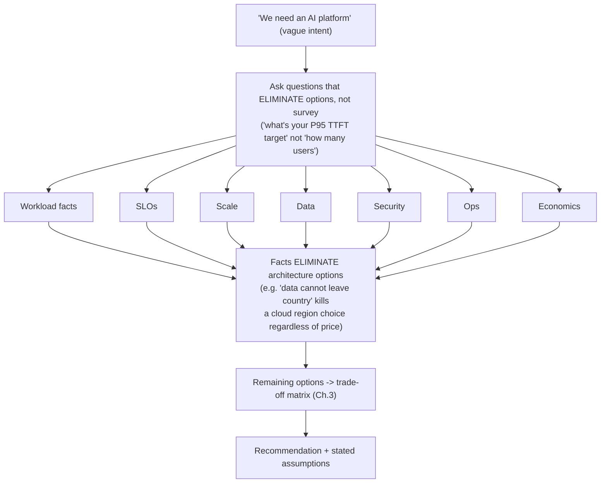
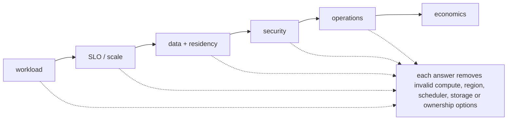

## The first working model

| Stage | Question | Deliverable |
|---|---|---|
| Discover | What outcome, workload and constraints are real? | clarified requirements and unknowns |
| Model | Which data, control, trust and failure paths matter? | shared architecture model |
| Compare | Which feasible options differ on important criteria? | trade-off matrix |
| Recommend | Which option best fits now, and why? | decision with assumptions |
| Validate | Which uncertain claims must be tested? | PoC/benchmark acceptance plan |
| Adopt | How will people migrate, operate and govern it? | staged operating/adoption plan |

## Essential language

- A **requirement** states a necessary outcome or constraint.
- An **assumption** is believed but not yet confirmed.
- A **constraint** limits feasible choices: time, skills, regulation, budget or existing systems.
- A **trade-off** improves one important property while accepting cost elsewhere.
- A **failure domain** is a set of components likely to fail together.
- A **PoC** should test uncertainty, not merely demonstrate that a product starts.
- **TCO** includes acquisition and ongoing operational cost, not hardware price alone.
- A **recommendation** includes rationale, risks, validation and next steps.

## Discovery before products

When a customer requests 32 GPUs, ask about workload type, model/data size, concurrency, latency/deadline, training duration, network/storage, security, availability, growth and existing skills. The stated component count may be a proposed solution rather than the underlying requirement.

## A real-life example

A customer mandates Kubernetes while a research team prefers Slurm. The architecture question is not "which technology wins?" Discover workload mix, operational ownership, isolation, queues/services, skills and lifecycle needs. Options may include separated node pools, separate clusters with shared services, or a consciously designed hybrid. Validate scheduling and operational boundaries so two systems never assume ownership of the same resource.

## A complete discovery example

Customer statement: "We need a 64-GPU Kubernetes AI platform in three months."

Do not accept the proposed solution as the requirement. Explore:

### Outcome and workload

- Is the platform for training, fine-tuning, batch inference or online inference?
- Which model sizes, data volumes and frameworks?
- Concurrent jobs/users and growth?
- Latency, throughput, deadline, availability and recovery objectives?

### Current state

- Existing clusters, identity, CI/CD, storage and observability?
- Team skills and operational ownership?
- On-premises, cloud or hybrid constraints?
- Which parts already work and which pain created the project?

### Constraints and governance

- Budget and delivery milestones?
- Data residency/classification and tenant separation?
- Approved vendors, support and lifecycle requirements?
- Power, cooling, rack, network and procurement realities?

### Unknowns requiring validation

- Can representative models meet SLOs on candidate hardware/software?
- Does storage sustain data/checkpoint patterns?
- Does multi-node communication achieve the needed scaling efficiency?
- Can the team operate upgrade, failure and security workflows?

## Start here: what a Solutions Architect actually does

A Solutions Architect turns an incomplete request into a defensible technical decision. The job is not to name the newest product or draw the busiest diagram. It is to discover the outcome, workload, constraints and unknowns; model the important paths; compare feasible options; reduce uncertainty with evidence; and explain the recommendation at the right level.

Use this sequence throughout the volume: discover the outcome, workload and constraints; model request/data, control, identity, state and failure paths; compare options against weighted requirements and evidence; recommend one option with assumptions and risks; validate uncertain claims with a benchmark or proof of concept; and adopt through migration waves, ownership, operations and governance.

Keep these nouns distinct: a requirement is a necessary outcome; an assumption is believed but unconfirmed; a constraint limits feasible choices; a trade-off improves one property while accepting cost elsewhere; a failure domain contains components likely to fail together; TCO includes ongoing operational cost; a PoC tests uncertainty rather than merely proving that software starts.

When a customer says “we need 32 GPUs,” treat that as a proposed solution until you know whether the workload is training, fine-tuning, batch inference or online inference; what latency, throughput, availability and recovery targets apply; how data and models move; who operates the platform; and what security, budget, power and growth constraints exist. The rest of this volume teaches how to turn those answers into architecture.

**VOLUME 8**

**Senior Solutions Architecture Practice**

Discovery, architecture, PoCs, economics, migrations and customer communication

> Fourth Edition - Teaching text with mechanisms, examples, visuals, scenarios and exercises

Independent study guide based on public documentation and public practitioner material. Not an NVIDIA publication.

**Learning outcome:** Turn "we need an AI platform" into workload, SLO, scale, security, operations and cost facts.


Figure 1. Recommendation comes after goals, constraints and workload facts.

Discovery is not a checklist recital. Ask questions whose answers eliminate or favor architecture options. "How many users?" is less useful than "What peak concurrent requests and P95 TTFT target must the inference service support?"

| Discovery area | Questions with architectural consequence |
|---|---|
| Workloads | training vs inference; model sizes; batch/online; distributed requirements |
| SLOs | latency, throughput, availability, recovery time, job queue/start time |
| Scale | GPU count now/12 months; concurrency; dataset/model growth |
| Data | where it lives; throughput; sensitivity; sovereignty; movement cost |
| Security | tenancy, identity, network segmentation, artifact/prompt access |
| Operations | Kubernetes/Slurm skills, on-call model, GitOps/IaC, upgrade windows |
| Economics | budget, cloud/on-prem constraints, utilization goals, procurement lead time |

## Practitioner lens
**Vishakha Sadhwani: SA combines technical recommendation with customer requirements**
Her public role comparison describes SAs as advising customers, defining business/technical requirements, evaluating trade-offs, building PoCs, guiding implementation and presenting to stakeholders. Treat each of these as a technical competency, not generic "communication skills."

[Public source](https://www.linkedin.com/in/vsadhwani)

---

**Discovery → architecture flow, drawn out (the mechanism the checklist hides):**

The point of this flow: a discovery question that doesn't change which box survives to the trade-off matrix was the wrong question to spend time on in the room. This is the operational test for "is this a good discovery question" — **does the answer eliminate or favor an option?** If both answers leave every architecture choice unchanged, it's small talk, not discovery.

**Shortcut/mnemonic — the seven discovery areas, in the order the source table lists them (W-S-S-D-S-O-E):**
*"**W**ise **S**As **S**ee **D**ata **S**tay **O**perationally **E**conomical."*
Workloads → SLOs → Scale → Data → Security → Operations → Economics. Say the sentence, and you've named every column of the table without looking at it — useful when an interviewer says "walk me through your discovery framework" cold.

**Sample annotated discovery transcript — the artifact this chapter is missing, worked with real dialogue:**
```
Customer:  "We want an AI platform for our data science team."

SA asks:   "What will run on it — training new models, fine-tuning,
            or serving models to an application?"
Customer:  "Mostly fine-tuning 7B-13B models, and then serving the
            results to an internal chatbot."
  ➤ WHY this question: eliminates pure-HPC-batch-only architectures;
    confirms an inference serving path is required, which pulls in
    Kubernetes/NIM/autoscaling considerations, not just Slurm.

SA asks:   "For the chatbot — what's the target P95 time-to-first-token,
            and how many concurrent users at peak?"
Customer:  "We don't have a number... maybe 'fast'?"
  ➤ WHY this question: exposes an SLO gap. "Fast" cannot size GPUs
    or pick a serving engine. The SA now knows the NEXT discovery
    step is a latency-sensitivity workshop, not a hardware quote.

SA asks:   "Is any of the fine-tuning data subject to data residency
            or export control requirements?"
Customer:  "Yes — some of it is EU customer data that can't leave
            the region."
  ➤ WHY this question: this single answer ELIMINATES any option
    that centralizes training in a non-EU region, regardless of
    cost advantage. This is the highest-leverage question asked
    so far — one answer removed entire architecture branches.

SA asks:   "Who operates this once it's live — do you have a
            Kubernetes platform team, or would this be new
            territory operationally?"
Customer:  "We have a small platform team, mostly Kubernetes,
            no Slurm experience."
  ➤ WHY this question: this answer weighs directly on Chapter 4's
    Kubernetes-vs-Slurm decision — even if Slurm were technically
    better for training, the team's operating model is real
    architectural evidence, not a soft factor.
```
Notice the pattern: every "WHY" annotation names a **specific downstream decision** the answer affects. That's the difference between "asking good questions" (soft skill framing) and "discovery that changes the architecture" (the chapter's actual title) — each question is load-bearing.

**Worked scenario — same discovery, wrong order (the failure mode to name explicitly in an interview):**
> A less experienced SA opens with "What's your budget?" and "Which cloud do you prefer?" before establishing workload type or SLOs. Both answers get anchored early, and the customer then evaluates every later technical recommendation against a budget number that was set without knowing whether the workload needs 4 GPUs or 400. The fix is sequencing: workload and SLO facts first (they bound the *solution space*), economics later (it bounds the *selection inside* that space). Asking budget first doesn't just risk a wrong number — it primes the customer to reject correct technical answers that don't fit a premature anchor.
>
> **Interview-ready line:** "I sequence discovery so budget and vendor preference come after workload and SLO facts — those two determine the solution space; budget only picks inside it."

**Extra worked example — one discovery answer, converted into an architecture-eliminating fact with real numbers:**
> Customer says: "We need to serve a 70B parameter model with P95 TTFT under 800ms at 500 concurrent users."
> - 70B params at FP16 ≈ 140GB of weights alone — already rules out single-GPU serving on anything below an H100 80GB×2 minimum footprint before KV cache is even added.
> - 500 concurrent users at sub-second TTFT rules out CPU inference categorically and immediately raises the question of tensor-parallel or pipeline-parallel serving, not just "which GPU."
> - This is discovery doing real elimination work in under one sentence of customer input — no product name was mentioned, and three architecture branches (CPU-only, single-GPU, unparallelized serving) are already gone.

## Practice
1. Run a 15-minute discovery role-play for an inference platform and list only questions whose answers change architecture.

2. Take the transcript above and identify which single answer had the *largest* elimination effect (hint: the data-residency answer — it removed an entire region/cloud category, not just a sizing parameter). Explain why elimination power, not information volume, is the right way to prioritize discovery questions under time pressure.
3. A customer gives you only 10 minutes for discovery before an executive review. Using the W-S-S-D-S-O-E mnemonic, pick the 3 areas you'd prioritize for a "greenfield inference platform" request versus a "migrate existing Slurm training to something else" request, and justify the difference.

**Visual model — discovery eliminates architecture branches before sizing them:**

**Key takeaway:** *"Ask the question that removes the most wrong designs."*
