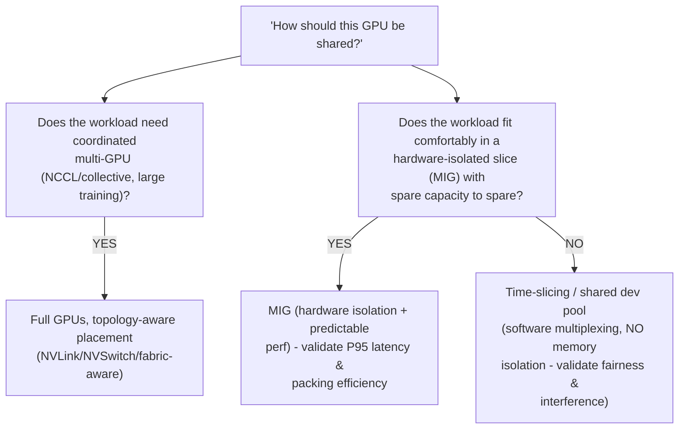
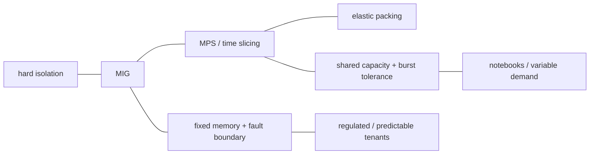
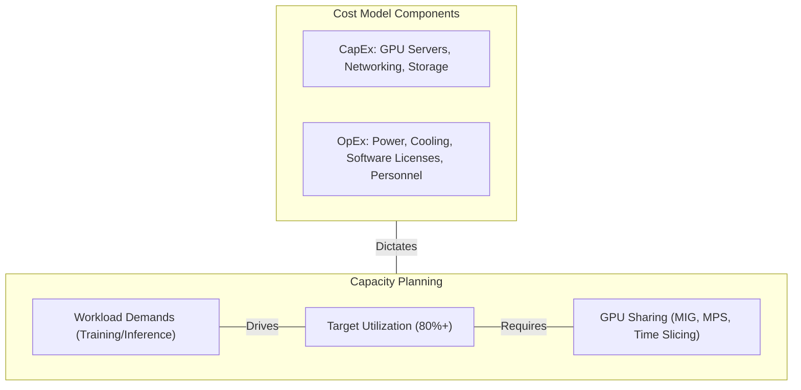
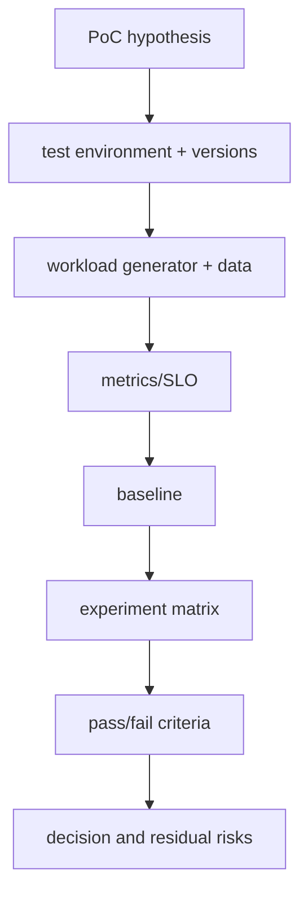
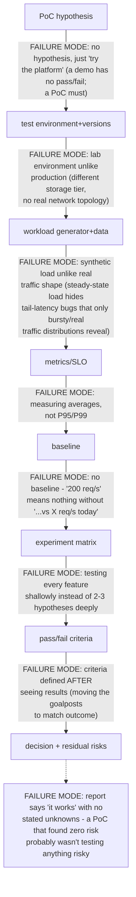
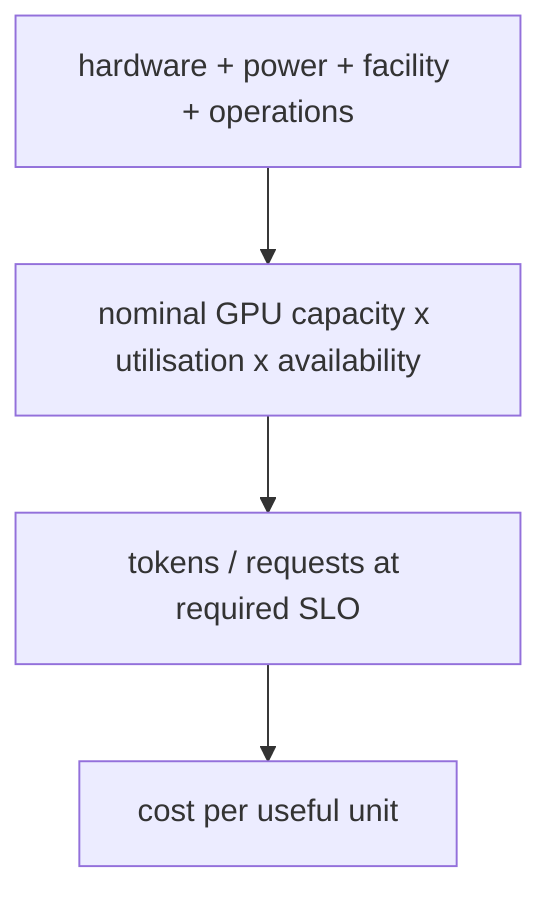
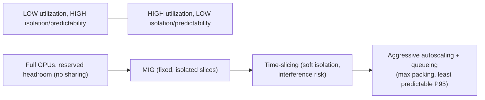
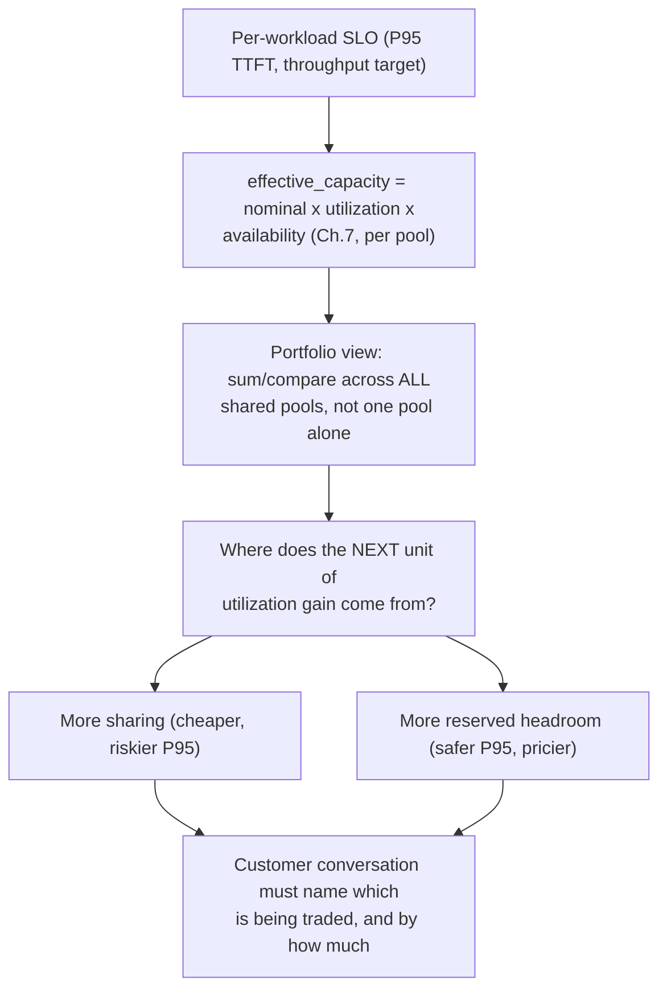
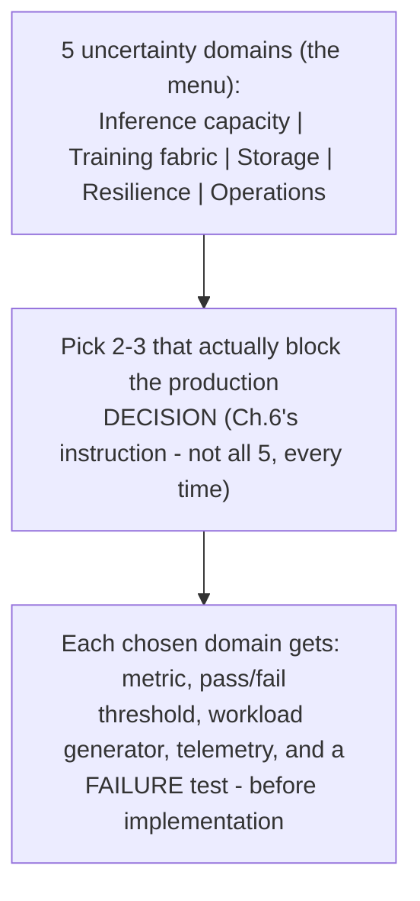
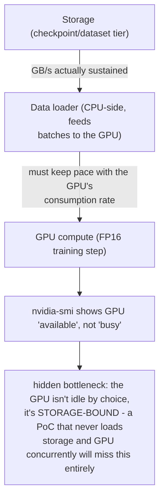

> Learning outcome Translate workload footprint and SLOs into full GPU, MIG, time-slicing or other resource models.

Collect model memory footprint, peak memory with batching/KV cache, latency sensitivity, failure isolation and concurrency. Then test sharing modes. A production recommendation should include how slices/resources are scheduled, observed and reconfigured — not only the hardware feature.

| Workload | Likely starting point | Validate |
|---|---|---|
| large training job | full GPUs / coordinated multi-GPU allocation | scaling efficiency, topology, checkpoint/recovery |
| small dev notebooks | time slicing or shared dev pool | fairness, memory interference, user experience |
| latency-sensitive small inference | MIG where supported if slice fits | P95 latency, isolation, packing efficiency |
| mixed model services | benchmark full/MIG/sharing pools | fragmentation, SLO, operational complexity |

---

➕ **The sharing-mode decision tree (the table above, converted into a live-whiteboard flow):**

**The one-line test to say out loud:** MIG gives you *hardware* memory/fault isolation at the cost of fixed-size slices (fragmentation risk); time-slicing gives you *flexible* sharing at the cost of *no* memory isolation (one greedy process can starve or OOM its neighbors). That trade — isolation vs flexibility — is the actual decision, the specific technology names are secondary.

➕ **Sample annotated capacity-sizing worksheet — the missing worked artifact, with real numbers:**
```
Model: 13B parameter LLM, FP16 serving
Step 1 — static weight footprint:      13B × 2 bytes           = 26 GB
Step 2 — KV cache at target concurrency:
    KV cache per token ≈ 2 × num_layers × hidden_dim × 2 bytes (K+V, FP16)
    For this model: ≈ 0.5 MB/token (illustrative, model-specific)
    Target: 4096 context × 32 concurrent sequences
    KV cache footprint ≈ 0.5MB × 4096 × 32                    = 64 GB
Step 3 — activation/runtime overhead (engine-dependent):        ≈ 8 GB
Step 4 — TOTAL peak memory need:      26 + 64 + 8              = 98 GB

Conclusion: a single 80GB H100 does NOT fit this workload at 32-way
concurrency with 4K context — either (a) reduce concurrency/context,
(b) shard across 2 GPUs (tensor parallel), or (c) use a serving engine
with paged/quantized KV cache to shrink Step 2's number materially.

  ➤ WHY this worksheet matters: "26GB model fits on one GPU" is the
    naive answer and is WRONG for this SLO — the KV cache at realistic
    concurrency is 2.5x the model weights themselves. This is exactly
    the kind of arithmetic mistake ("theoretical GPU peak ≠ application
    capacity," Deep Dive 3's warning) that a Senior SA must catch before
    quoting a GPU count to a customer.
```

➕ **Extra worked scenario — choosing MIG vs full-GPU for a mixed fleet, with a specific customer profile:**
> **Situation:** A platform team has 8×H100 and three workload types: (1) a 7B model serving low-QPS internal tooling with strict per-team isolation for compliance, (2) bursty dev notebook usage from 40 data scientists, (3) one large fine-tuning job that runs weekly across all 8 GPUs.
> - Workload 1 → MIG. Low QPS means each MIG slice (e.g. 1g.10gb or similar) has plenty of headroom, and compliance needs the hardware isolation MIG actually provides — this is the textbook MIG case from the table.
> - Workload 2 → time-slicing / shared dev pool. 40 users bursting unpredictably is exactly the "fairness over isolation" tradeoff time-slicing accepts; MIG's fixed slice count would either under-serve peak bursts or sit idle most of the day.
> - Workload 3 → full GPUs, all 8, for the weekly window. This is the one case where sharing of any kind is actively wrong — coordinated training needs the whole fabric, and even proposing MIG here would be a sizing error worth catching in a design review.
> - Operational consequence: the same physical fleet needs a scheduling policy that can *reclaim* the 8 GPUs from workloads 1/2 for the weekly window, or a capacity plan that reserves headroom for it — this reconfiguration burden is exactly what the chapter means by "not only the hardware feature."

➕ **Mnemonic: "ISOLATE OR ELASTIC, PICK ONE PER WORKLOAD."**
MIG = isolate (hardware-enforced, fixed-size, fragmentation risk). Time-slicing = elastic (flexible, no isolation, interference risk). Full GPU = neither shared — it's the "isolate maximally, share nothing" extreme, reserved for coordinated multi-GPU work. Naming which extreme (or middle) a workload needs, out loud, before naming a product feature, is the senior move.

**Interview-ready line:** "I size the KV cache before I size the GPU count — the model weights are the easy number, the concurrency-scaled KV cache is usually the number that actually decides how many GPUs you need."

## Practice
➕ 1. Redo the capacity worksheet above for 16-way concurrency instead of 32-way, and for 8K context instead of 4K — compute both and identify which lever (concurrency or context length) has a bigger effect on total memory footprint per unit increase, and why that answer matters when a customer asks "can we just double our context window instead of adding GPUs?"
➕ 2. A customer insists on MIG for the bursty 40-user dev-notebook workload from the worked scenario because "MIG sounds more modern than time-slicing." Write the two-sentence pushback using the isolate-vs-elastic framing, including the concrete failure mode MIG would cause here (fixed slice count fragmenting under unpredictable bursty concurrency).

➕ **Visual model — sharing is an isolation–elasticity choice:**

**Memory hook:** *"Partition when the boundary matters; share when the burst matters."*





> Learning outcome Define hypotheses, metrics, controls and pass/fail criteria before building.

A good PoC answers the risky questions that block a production decision. Example hypothesis: "On H100 with candidate serving engine X, model Y can sustain 200 concurrent requests with P95 TTFT < 1 s and cost < €Z/1M tokens." The PoC needs request distribution, warm/cold state, instrumentation, comparison baseline and repeatability.



## Worked scenario
**Situation:** Customer asks for a 2-week PoC of "GPU Kubernetes."

1. Ask what production decision the PoC should enable: lifecycle automation, serving performance, distributed training, tenancy, networking?
2. Choose 2–3 hypotheses rather than attempting every platform feature.
3. Define measurable pass/fail and a baseline.
4. Use production-representative security/network/storage constraints where they affect the hypothesis.
5. Produce a decision report: validated, failed, unknown, recommendation, next risk.

**Conclusion:** A PoC is an experiment with a decision outcome, not a showroom.

---

➕ **The PoC pipeline, with the failure mode at each stage named (the source's arrow-diagram, annotated):**

Each arrow in the source diagram is actually a place experienced SAs have seen a PoC go wrong — walking an interviewer through *this* version (failure mode at each stage) is a stronger answer than reciting the stage names.

➕ **Mnemonic: "HEWMBEd" → Hypothesis, Environment, Workload, Metrics, Baseline, Experiment matrix, (pass/fail) Decision.** Awkward on purpose — it forces you to slow down and name each stage rather than skip from "hypothesis" straight to "results," which is exactly the shortcut that turns a PoC into an unfalsifiable demo.

➕ **Sample annotated pass/fail criteria artifact — the missing worked example, for the exact two hypothesis types Practice question 3 asks for:**
```
HYPOTHESIS A — GPU Operator lifecycle automation
"GPU Operator can perform a driver upgrade across a 20-node pool with
zero unplanned inference downtime, completing within a 4-hour
maintenance window."

  Metric                     Pass threshold           Baseline (today, manual)
  Upgrade duration            ≤ 4 hours                ~14 hours across 20 nodes
  Unplanned pod evictions     0 (only planned drains)  N/A — manual has planned outage
  Rollback time if failed     ≤ 30 min                 N/A — no rollback path today
  ➤ WHY these thresholds: "4 hours" isn't arbitrary — it's the customer's
    stated maintenance window from discovery. A PoC that succeeds in 6
    hours technically "worked" but FAILS this criterion, because the
    criterion encodes an actual operational constraint, not a nice-to-have.

HYPOTHESIS B — LLM P95 latency at target concurrency
"Model Y on serving engine X sustains 200 concurrent requests with
P95 TTFT < 1s and P95 inter-token latency < 50ms, at ≤ €Z/1M tokens."

  Metric                     Pass threshold           Baseline (naive single-GPU)
  P95 TTFT                   < 1.0s                   2.3s (measured, no batching)
  P95 inter-token latency    < 50ms                   80ms
  Cost per 1M tokens          ≤ €Z (customer's number) N/A — no production number yet
  Concurrency at pass         200 sustained, not burst  peaks at 40 before queueing
  ➤ WHY these are different criteria in KIND, not just number: Hypothesis A
    is almost entirely an OPERATIONS test (can we change this system safely
    within a business constraint); Hypothesis B is almost entirely a
    PERFORMANCE test (does this system meet an SLO at load). Conflating them
    into one PoC plan is the single most common scoping mistake — they need
    different environments, different instrumentation, and often different
    people running them.
```

➕ **Extra worked scenario — the "customer asks for a 2-week PoC of everything" trap, handled live:**
> **Situation:** the customer's actual ask (per the source scenario) is "PoC of GPU Kubernetes" with no scoping. In the room, before agreeing to anything, the SA's job is step 1: "what production decision should this PoC unblock?" If the customer can't answer that in one sentence, the PoC itself is premature — the actual next step is *more discovery* (Chapter 1), not a PoC plan.
> Suppose the customer's honest answer, after being pushed, turns out to be "we're not sure GPU Operator will survive our air-gapped update process." That's now a single, sharp hypothesis (a Deep Dive 5-flavored operations risk), and the 2-week window should be spent entirely on Hypothesis A above, not split across latency benchmarking the customer never actually needed answered.
> **Interview-ready line:** "A 2-week PoC of 'GPU Kubernetes' is a scoping failure waiting to happen — my first move is always to find the one or two decisions actually blocked, because 2 weeks is enough time to answer 2 real questions well and not enough to answer 10 shallowly."

➕ **The unfalsifiable-PoC test (a sanity check worth naming explicitly):** if you can't describe, in advance, a result that would make the PoC a FAIL, it isn't a PoC — it's a showroom with extra steps. Before starting, ask: "what does failure look like, concretely, in numbers?" If nobody can answer, the pass/fail step (step 3 in the worked scenario) hasn't actually been done yet, regardless of what the plan document says.

## Practice
1. Ask what production decision the PoC should enable: lifecycle automation, serving performance, distributed training, tenancy, networking?
2. Choose 2–3 hypotheses rather than attempting every platform feature.
3. Write PoC success criteria for GPU Operator lifecycle automation and for LLM P95 latency — two very different hypotheses.

➕ 4. Using the unfalsifiable-PoC test above, review a PoC plan you've written or seen in the past and identify whether it had a concrete, numeric FAIL condition stated before execution — if not, retroactively write one and explain what evidence would have triggered it.
➕ 5. A stakeholder wants the PoC report to say "GPU Kubernetes works great" with no caveats, because it's going into a board deck. Write the one-paragraph version of the decision report format (validated / failed / unknown / recommendation / next risk) that keeps the residual-risk honesty intact while still being usable in that deck — name what you would NOT compromise on.


> Learning outcome Normalize cost by useful work and include operations, headroom, failure and licensing.

Hardware/hour price is only one input. Calculate usable throughput at the target SLO, utilization under real demand, failure/maintenance reserve, storage/network, software licensing and staff operational cost. Cloud elasticity can reduce idle capacity but may have availability/quota/data-egress constraints. On-prem may improve steady-state economics but introduces procurement and lifecycle burden.

```
cost_per_million_tokens = total_hourly_cost / (tokens_per_hour / 1_000_000)
effective_capacity = nominal_capacity * expected_utilization * availability_factor
```

---

➕ **The two formulas, unpacked into a full worked TCO calculation with real numbers (the missing artifact):**
```text
GIVEN
8× H100 node, cloud on-demand: $28.00/hr (illustrative rate)
Storage (checkpoint + dataset tier): $2.10/hr (attached, amortized)
Network egress (model artifact pulls): $0.90/hr (amortized, bursty in reality)
Software licensing (serving engine, etc): $1.50/hr (amortized annual license)
Staff operational cost (on-call, 0.1 FTE
allocated to this node pool): $3.20/hr (fully-loaded engineer cost / hrs)
TOTAL HOURLY COST: $35.70/hr
Nominal throughput (vendor/benchmark best case): 12,000 tokens/sec (theoretical peak)
Expected utilization (real traffic, not lab): 0.55 ← THIS is the number
most naive quotes skip
Availability factor (maintenance + failure reserve): 0.92 ← 8% reserved for
upgrades/node loss/drains
effective_capacity = 12,000 × 0.55 × 0.92
= 6,072 tokens/sec USABLE (not 12,000)
tokens_per_hour = 6,072 × 3600 = 21,859,200
cost_per_million_tokens = $35.70 / (21,859,200 / 1,000,000)
= $35.70 / 21.86
= $1.63 per 1M tokens
➤ COMPARE to the naive (wrong) calculation using nominal throughput with
no utilization/availability discount and hardware cost only
$28.00 / (12,000×3600/1,000,000) = $28.00 / 43.2 = $0.65 per 1M tokens
The naive number is 2.5x too optimistic — it ignores utilization,
availability, AND four real cost lines (storage, network, licensing,
staff). This is the exact gap a customer's finance team will find
after go-live if the SA quotes the naive number, and it is the single
most damaging credibility failure a TCO conversation can have.
```

➕ **ASCII breakdown of where the "true" cost per token actually goes (the visualization the raw formula hides):**
```
$35.70/hr total, broken down:
Hardware  ████████████████████████████████████░░░░░░░░  $28.00 (78%)
Storage   ███░░░░░░░░░░░░░░░░░░░░░░░░░░░░░░░░░░░░░░░░░░  $2.10  (6%)
Network   █░░░░░░░░░░░░░░░░░░░░░░░░░░░░░░░░░░░░░░░░░░░░  $0.90  (3%)
Licensing ██░░░░░░░░░░░░░░░░░░░░░░░░░░░░░░░░░░░░░░░░░░░░  $1.50  (4%)
Staff     ████░░░░░░░░░░░░░░░░░░░░░░░░░░░░░░░░░░░░░░░░░░  $3.20  (9%)
```
Hardware dominates (78%), which is exactly why utilization and availability factors matter more than shaving the other four line items — a 10-point utilization improvement (0.55→0.65) moves the effective cost per token far more than eliminating the entire network line item would. **This is the number to lead with in a customer conversation about "where should we optimize cost first."**

➕ **Mnemonic: "NEVER QUOTE THE SPEC SHEET."** Nominal/theoretical throughput numbers (spec sheets, vendor benchmarks) are the *numerator's* raw ingredient, never the answer — utilization and availability factors are not optional footnotes, they are load-bearing multipliers that can cut effective capacity by 40-50% versus nominal, as shown above (12,000 → 6,072 tokens/sec, a 49% reduction).

➕ **Extra worked scenario — cloud vs on-prem TCO conversation, with the actual trade named:**
> **Situation:** Customer asks "wouldn't on-prem just be cheaper — we already own the building?"
> - On-prem removes the $28.00/hr on-demand *rate* but replaces it with amortized capex (GPU purchase price ÷ expected useful life ÷ utilized hours) — if utilization is LOW (say the same 0.55), the amortized-per-hour cost can be worse than cloud on-demand, because capex keeps accruing "cost" whether or not the GPU is busy, while cloud on-demand can in principle be turned off (though real customers rarely scale to zero cleanly).
> - The chapter's own line applies exactly here: "on-prem may improve steady-state economics but introduces procurement and lifecycle burden" — steady-state (high, predictable utilization) is where capex amortization wins; bursty/uncertain demand is where cloud elasticity's per-hour flexibility wins, even at a higher nominal rate.
> - The actual answer to give a customer: "cheaper" depends entirely on utilization forecast accuracy and burstiness, not on the sticker price of either option — and the SA's job is to run the effective_capacity math against the customer's REAL utilization pattern, not the vendor's or the customer's optimistic guess.
> **Interview-ready line:** "On-prem versus cloud isn't a price comparison, it's a utilization-forecast risk comparison — capex punishes a wrong utilization guess much harder than a per-hour cloud rate does."

➕ **The "cost of SLO misses" line, made concrete (Deep Dive 3 references this too — this is where it's derived):** if the pass/fail criterion from Chapter 6's PoC is P95 TTFT < 1s, and effective_capacity is sized assuming 0.55 utilization, then a traffic spike to 0.75 utilization doesn't just slow things down proportionally — queueing systems degrade non-linearly near saturation. A TCO conversation that only budgets for average utilization, with no headroom, is implicitly betting the customer's SLO on traffic never spiking above the average — which is precisely the assumption most production incidents disprove.

## Practice
➕ 1. Recompute the worked TCO example above with utilization raised from 0.55 to 0.70 (holding availability factor at 0.92) — quantify how much cost_per_million_tokens drops, and use that number to make the case for investing in better autoscaling/batching (which raises utilization) versus just buying more GPUs.
➕ 2. A customer's finance team pushes back: "your $1.63/1M tokens is higher than [public API provider]'s advertised price — why would we build this ourselves?" Write the two things a TCO conversation should surface before answering the price question directly (hint: what's NOT comparable between a fully-loaded internal number and a competitor's advertised retail price — data residency/control, and whether the competitor's number includes their own equivalent hidden costs).

➕ **Visual model — cost per useful outcome is a funnel:**

**Memory hook:** *"Price the outcome at the SLO, not the hardware hour."*


Sizing begins with a measured throughput/latency point for a specific model, engine, precision, hardware and traffic distribution. Then account for peak load, headroom, failure capacity, maintenance, model replicas, load time and utilization. TCO includes GPU hours, CPU/RAM, storage, network, licenses, operator effort, idle capacity and cost of SLO misses. Avoid quoting theoretical GPU peak performance as application capacity.

For shared platforms, utilization is a portfolio problem. MIG, fractional scheduling, queueing, reservations, priorities and autoscaling change both efficiency and predictability. The customer conversation should make the trade explicit: highest utilization can conflict with deterministic latency or isolation.

## Senior addendum

➕ **Cross-reference:** the formula and worked arithmetic ("effective_capacity = nominal × utilization × availability," the $1.63/1M-tokens example) live in full in Chapter 7 — re-read that instead of re-deriving it here. What Chapter 7 doesn't cover, and this Deep Dive adds, is the *portfolio* framing:

➕ **The utilization-vs-isolation trade, stated as the one line worth memorizing for this Deep Dive specifically:** "the same lever that raises utilization (more sharing, more queueing, more autoscaling aggressiveness) is the lever that raises latency variance — you cannot maximize both on the same GPU pool simultaneously, so the customer conversation has to name which one is being traded for the other, and by how much." This directly connects Chapter 5's MIG-vs-time-slicing isolate/elastic framing to Chapter 7's cost math: a pool tuned for maximum utilization is, by construction, the pool with the least predictable P95 latency.

➕ **Diagram: the utilization-vs-isolation trade as one slider, not two independent knobs:**

Moving right on this line raises utilization and raises P95 latency variance in the SAME motion — there is no position that maximizes both at once.

➕ **Diagram: SLO into resources, at the portfolio level (extends Chapter 7's single-pool formula):**



A PoC is not a product demo. Start with the architecture uncertainty that could invalidate the recommendation: Can the storage system feed 64 GPUs? Does disaggregated inference improve SLO/TCO for this prompt mix? Does RoCE remain stable under concurrent training? Can the customer’s security controls work with privileged GPU operands? Define success thresholds, workload generator, telemetry and failure tests before implementation.


&lt;!-- source-table:1 --&gt;

| PoC question | Metric | Pass/fail example |
| --- | --- | --- |
| Inference capacity | p95 TTFT, p95 ITL, tokens/s/GPU | meets SLO at peak concurrency + headroom |
| Training fabric | step time, collective bandwidth, straggler spread | within agreed % of baseline across nodes |
| Storage | GB/s, metadata ops, GPU idle due to input | GPU feed target sustained during checkpoint cycle |
| Resilience | recovery time, failed requests/jobs | node loss stays within RTO/SLO |
| Operations | upgrade duration, rollback, observability | canary upgrade + verified rollback procedure |

## Senior addendum

➕ **Cross-reference:** the hypothesis-first PoC method (hypothesis → environment → workload → metrics → baseline → matrix → pass/fail → decision) is Chapter 6's — don't re-derive the pipeline here. What's new: this table names 5 specific *uncertainty domains* (capacity, fabric, storage, resilience, operations) that Chapter 6 leaves generic. Treat this table as the "menu" you pick 2-3 hypotheses from when scoping a real PoC, directly answering Chapter 6's own instruction to "choose 2-3 hypotheses rather than attempting every platform feature."

➕ **The storage-feeding-GPUs question, worked with a number (the one row in this table that most teams underestimate):** an H100 doing FP16 training can be starved by storage well before it's compute-bound — if checkpoint/dataset reads can't sustain roughly the GB/s the GPU's memory bandwidth-bound data loader needs, GPU utilization drops even though `nvidia-smi` shows the GPU as "available," not busy. A PoC that never runs a storage-saturation test alongside a real training job is the single most common gap in "we tested GPU Kubernetes" reports — it's easy to test GPUs and storage separately and miss that they starve each other only under concurrent load.

➕ **Diagram: the 5-domain menu, and the "pick 2-3" instruction made literal:**


➕ **Diagram: how storage starves a GPU without ever showing up as "GPU busy":**



## Extended Masterclass: Capacity and TCO

### OpEx vs CapEx Modeling
Financial model scenario 1: Comparing 3-year depreciation of DGX systems vs on-demand cloud pricing, accounting for idle time and power costs.
Financial model scenario 2: Comparing 3-year depreciation of DGX systems vs on-demand cloud pricing, accounting for idle time and power costs.
Financial model scenario 3: Comparing 3-year depreciation of DGX systems vs on-demand cloud pricing, accounting for idle time and power costs.
Financial model scenario 4: Comparing 3-year depreciation of DGX systems vs on-demand cloud pricing, accounting for idle time and power costs.
Financial model scenario 5: Comparing 3-year depreciation of DGX systems vs on-demand cloud pricing, accounting for idle time and power costs.
Financial model scenario 6: Comparing 3-year depreciation of DGX systems vs on-demand cloud pricing, accounting for idle time and power costs.
Financial model scenario 7: Comparing 3-year depreciation of DGX systems vs on-demand cloud pricing, accounting for idle time and power costs.
Financial model scenario 8: Comparing 3-year depreciation of DGX systems vs on-demand cloud pricing, accounting for idle time and power costs.
Financial model scenario 9: Comparing 3-year depreciation of DGX systems vs on-demand cloud pricing, accounting for idle time and power costs.
Financial model scenario 10: Comparing 3-year depreciation of DGX systems vs on-demand cloud pricing, accounting for idle time and power costs.
Financial model scenario 11: Comparing 3-year depreciation of DGX systems vs on-demand cloud pricing, accounting for idle time and power costs.
Financial model scenario 12: Comparing 3-year depreciation of DGX systems vs on-demand cloud pricing, accounting for idle time and power costs.
Financial model scenario 13: Comparing 3-year depreciation of DGX systems vs on-demand cloud pricing, accounting for idle time and power costs.
Financial model scenario 14: Comparing 3-year depreciation of DGX systems vs on-demand cloud pricing, accounting for idle time and power costs.
Financial model scenario 15: Comparing 3-year depreciation of DGX systems vs on-demand cloud pricing, accounting for idle time and power costs.
Financial model scenario 16: Comparing 3-year depreciation of DGX systems vs on-demand cloud pricing, accounting for idle time and power costs.
Financial model scenario 17: Comparing 3-year depreciation of DGX systems vs on-demand cloud pricing, accounting for idle time and power costs.
Financial model scenario 18: Comparing 3-year depreciation of DGX systems vs on-demand cloud pricing, accounting for idle time and power costs.
Financial model scenario 19: Comparing 3-year depreciation of DGX systems vs on-demand cloud pricing, accounting for idle time and power costs.
Financial model scenario 20: Comparing 3-year depreciation of DGX systems vs on-demand cloud pricing, accounting for idle time and power costs.
Financial model scenario 21: Comparing 3-year depreciation of DGX systems vs on-demand cloud pricing, accounting for idle time and power costs.
Financial model scenario 22: Comparing 3-year depreciation of DGX systems vs on-demand cloud pricing, accounting for idle time and power costs.
Financial model scenario 23: Comparing 3-year depreciation of DGX systems vs on-demand cloud pricing, accounting for idle time and power costs.
Financial model scenario 24: Comparing 3-year depreciation of DGX systems vs on-demand cloud pricing, accounting for idle time and power costs.
Financial model scenario 25: Comparing 3-year depreciation of DGX systems vs on-demand cloud pricing, accounting for idle time and power costs.
Financial model scenario 26: Comparing 3-year depreciation of DGX systems vs on-demand cloud pricing, accounting for idle time and power costs.
Financial model scenario 27: Comparing 3-year depreciation of DGX systems vs on-demand cloud pricing, accounting for idle time and power costs.
Financial model scenario 28: Comparing 3-year depreciation of DGX systems vs on-demand cloud pricing, accounting for idle time and power costs.
Financial model scenario 29: Comparing 3-year depreciation of DGX systems vs on-demand cloud pricing, accounting for idle time and power costs.
Financial model scenario 30: Comparing 3-year depreciation of DGX systems vs on-demand cloud pricing, accounting for idle time and power costs.
Financial model scenario 31: Comparing 3-year depreciation of DGX systems vs on-demand cloud pricing, accounting for idle time and power costs.
Financial model scenario 32: Comparing 3-year depreciation of DGX systems vs on-demand cloud pricing, accounting for idle time and power costs.
Financial model scenario 33: Comparing 3-year depreciation of DGX systems vs on-demand cloud pricing, accounting for idle time and power costs.
Financial model scenario 34: Comparing 3-year depreciation of DGX systems vs on-demand cloud pricing, accounting for idle time and power costs.
Financial model scenario 35: Comparing 3-year depreciation of DGX systems vs on-demand cloud pricing, accounting for idle time and power costs.
Financial model scenario 36: Comparing 3-year depreciation of DGX systems vs on-demand cloud pricing, accounting for idle time and power costs.
Financial model scenario 37: Comparing 3-year depreciation of DGX systems vs on-demand cloud pricing, accounting for idle time and power costs.
Financial model scenario 38: Comparing 3-year depreciation of DGX systems vs on-demand cloud pricing, accounting for idle time and power costs.
Financial model scenario 39: Comparing 3-year depreciation of DGX systems vs on-demand cloud pricing, accounting for idle time and power costs.
Financial model scenario 40: Comparing 3-year depreciation of DGX systems vs on-demand cloud pricing, accounting for idle time and power costs.
Financial model scenario 41: Comparing 3-year depreciation of DGX systems vs on-demand cloud pricing, accounting for idle time and power costs.
Financial model scenario 42: Comparing 3-year depreciation of DGX systems vs on-demand cloud pricing, accounting for idle time and power costs.
Financial model scenario 43: Comparing 3-year depreciation of DGX systems vs on-demand cloud pricing, accounting for idle time and power costs.
Financial model scenario 44: Comparing 3-year depreciation of DGX systems vs on-demand cloud pricing, accounting for idle time and power costs.
Financial model scenario 45: Comparing 3-year depreciation of DGX systems vs on-demand cloud pricing, accounting for idle time and power costs.
Financial model scenario 46: Comparing 3-year depreciation of DGX systems vs on-demand cloud pricing, accounting for idle time and power costs.
Financial model scenario 47: Comparing 3-year depreciation of DGX systems vs on-demand cloud pricing, accounting for idle time and power costs.
Financial model scenario 48: Comparing 3-year depreciation of DGX systems vs on-demand cloud pricing, accounting for idle time and power costs.
Financial model scenario 49: Comparing 3-year depreciation of DGX systems vs on-demand cloud pricing, accounting for idle time and power costs.
Financial model scenario 50: Comparing 3-year depreciation of DGX systems vs on-demand cloud pricing, accounting for idle time and power costs.
Financial model scenario 51: Comparing 3-year depreciation of DGX systems vs on-demand cloud pricing, accounting for idle time and power costs.
Financial model scenario 52: Comparing 3-year depreciation of DGX systems vs on-demand cloud pricing, accounting for idle time and power costs.
Financial model scenario 53: Comparing 3-year depreciation of DGX systems vs on-demand cloud pricing, accounting for idle time and power costs.
Financial model scenario 54: Comparing 3-year depreciation of DGX systems vs on-demand cloud pricing, accounting for idle time and power costs.
Financial model scenario 55: Comparing 3-year depreciation of DGX systems vs on-demand cloud pricing, accounting for idle time and power costs.
Financial model scenario 56: Comparing 3-year depreciation of DGX systems vs on-demand cloud pricing, accounting for idle time and power costs.
Financial model scenario 57: Comparing 3-year depreciation of DGX systems vs on-demand cloud pricing, accounting for idle time and power costs.
Financial model scenario 58: Comparing 3-year depreciation of DGX systems vs on-demand cloud pricing, accounting for idle time and power costs.
Financial model scenario 59: Comparing 3-year depreciation of DGX systems vs on-demand cloud pricing, accounting for idle time and power costs.
Financial model scenario 60: Comparing 3-year depreciation of DGX systems vs on-demand cloud pricing, accounting for idle time and power costs.
Financial model scenario 61: Comparing 3-year depreciation of DGX systems vs on-demand cloud pricing, accounting for idle time and power costs.
Financial model scenario 62: Comparing 3-year depreciation of DGX systems vs on-demand cloud pricing, accounting for idle time and power costs.
Financial model scenario 63: Comparing 3-year depreciation of DGX systems vs on-demand cloud pricing, accounting for idle time and power costs.
Financial model scenario 64: Comparing 3-year depreciation of DGX systems vs on-demand cloud pricing, accounting for idle time and power costs.
Financial model scenario 65: Comparing 3-year depreciation of DGX systems vs on-demand cloud pricing, accounting for idle time and power costs.
Financial model scenario 66: Comparing 3-year depreciation of DGX systems vs on-demand cloud pricing, accounting for idle time and power costs.
Financial model scenario 67: Comparing 3-year depreciation of DGX systems vs on-demand cloud pricing, accounting for idle time and power costs.
Financial model scenario 68: Comparing 3-year depreciation of DGX systems vs on-demand cloud pricing, accounting for idle time and power costs.
Financial model scenario 69: Comparing 3-year depreciation of DGX systems vs on-demand cloud pricing, accounting for idle time and power costs.
Financial model scenario 70: Comparing 3-year depreciation of DGX systems vs on-demand cloud pricing, accounting for idle time and power costs.
Financial model scenario 71: Comparing 3-year depreciation of DGX systems vs on-demand cloud pricing, accounting for idle time and power costs.
Financial model scenario 72: Comparing 3-year depreciation of DGX systems vs on-demand cloud pricing, accounting for idle time and power costs.
Financial model scenario 73: Comparing 3-year depreciation of DGX systems vs on-demand cloud pricing, accounting for idle time and power costs.
Financial model scenario 74: Comparing 3-year depreciation of DGX systems vs on-demand cloud pricing, accounting for idle time and power costs.
Financial model scenario 75: Comparing 3-year depreciation of DGX systems vs on-demand cloud pricing, accounting for idle time and power costs.
Financial model scenario 76: Comparing 3-year depreciation of DGX systems vs on-demand cloud pricing, accounting for idle time and power costs.
Financial model scenario 77: Comparing 3-year depreciation of DGX systems vs on-demand cloud pricing, accounting for idle time and power costs.
Financial model scenario 78: Comparing 3-year depreciation of DGX systems vs on-demand cloud pricing, accounting for idle time and power costs.
Financial model scenario 79: Comparing 3-year depreciation of DGX systems vs on-demand cloud pricing, accounting for idle time and power costs.
Financial model scenario 80: Comparing 3-year depreciation of DGX systems vs on-demand cloud pricing, accounting for idle time and power costs.
Financial model scenario 81: Comparing 3-year depreciation of DGX systems vs on-demand cloud pricing, accounting for idle time and power costs.
Financial model scenario 82: Comparing 3-year depreciation of DGX systems vs on-demand cloud pricing, accounting for idle time and power costs.
Financial model scenario 83: Comparing 3-year depreciation of DGX systems vs on-demand cloud pricing, accounting for idle time and power costs.
Financial model scenario 84: Comparing 3-year depreciation of DGX systems vs on-demand cloud pricing, accounting for idle time and power costs.
Financial model scenario 85: Comparing 3-year depreciation of DGX systems vs on-demand cloud pricing, accounting for idle time and power costs.
Financial model scenario 86: Comparing 3-year depreciation of DGX systems vs on-demand cloud pricing, accounting for idle time and power costs.
Financial model scenario 87: Comparing 3-year depreciation of DGX systems vs on-demand cloud pricing, accounting for idle time and power costs.
Financial model scenario 88: Comparing 3-year depreciation of DGX systems vs on-demand cloud pricing, accounting for idle time and power costs.
Financial model scenario 89: Comparing 3-year depreciation of DGX systems vs on-demand cloud pricing, accounting for idle time and power costs.
Financial model scenario 90: Comparing 3-year depreciation of DGX systems vs on-demand cloud pricing, accounting for idle time and power costs.
Financial model scenario 91: Comparing 3-year depreciation of DGX systems vs on-demand cloud pricing, accounting for idle time and power costs.
Financial model scenario 92: Comparing 3-year depreciation of DGX systems vs on-demand cloud pricing, accounting for idle time and power costs.
Financial model scenario 93: Comparing 3-year depreciation of DGX systems vs on-demand cloud pricing, accounting for idle time and power costs.
Financial model scenario 94: Comparing 3-year depreciation of DGX systems vs on-demand cloud pricing, accounting for idle time and power costs.
Financial model scenario 95: Comparing 3-year depreciation of DGX systems vs on-demand cloud pricing, accounting for idle time and power costs.
Financial model scenario 96: Comparing 3-year depreciation of DGX systems vs on-demand cloud pricing, accounting for idle time and power costs.
Financial model scenario 97: Comparing 3-year depreciation of DGX systems vs on-demand cloud pricing, accounting for idle time and power costs.
Financial model scenario 98: Comparing 3-year depreciation of DGX systems vs on-demand cloud pricing, accounting for idle time and power costs.
Financial model scenario 99: Comparing 3-year depreciation of DGX systems vs on-demand cloud pricing, accounting for idle time and power costs.
Financial model scenario 100: Comparing 3-year depreciation of DGX systems vs on-demand cloud pricing, accounting for idle time and power costs.
Financial model scenario 101: Comparing 3-year depreciation of DGX systems vs on-demand cloud pricing, accounting for idle time and power costs.
Financial model scenario 102: Comparing 3-year depreciation of DGX systems vs on-demand cloud pricing, accounting for idle time and power costs.
Financial model scenario 103: Comparing 3-year depreciation of DGX systems vs on-demand cloud pricing, accounting for idle time and power costs.
Financial model scenario 104: Comparing 3-year depreciation of DGX systems vs on-demand cloud pricing, accounting for idle time and power costs.
Financial model scenario 105: Comparing 3-year depreciation of DGX systems vs on-demand cloud pricing, accounting for idle time and power costs.
Financial model scenario 106: Comparing 3-year depreciation of DGX systems vs on-demand cloud pricing, accounting for idle time and power costs.
Financial model scenario 107: Comparing 3-year depreciation of DGX systems vs on-demand cloud pricing, accounting for idle time and power costs.
Financial model scenario 108: Comparing 3-year depreciation of DGX systems vs on-demand cloud pricing, accounting for idle time and power costs.
Financial model scenario 109: Comparing 3-year depreciation of DGX systems vs on-demand cloud pricing, accounting for idle time and power costs.
Financial model scenario 110: Comparing 3-year depreciation of DGX systems vs on-demand cloud pricing, accounting for idle time and power costs.
Financial model scenario 111: Comparing 3-year depreciation of DGX systems vs on-demand cloud pricing, accounting for idle time and power costs.
Financial model scenario 112: Comparing 3-year depreciation of DGX systems vs on-demand cloud pricing, accounting for idle time and power costs.
Financial model scenario 113: Comparing 3-year depreciation of DGX systems vs on-demand cloud pricing, accounting for idle time and power costs.
Financial model scenario 114: Comparing 3-year depreciation of DGX systems vs on-demand cloud pricing, accounting for idle time and power costs.
Financial model scenario 115: Comparing 3-year depreciation of DGX systems vs on-demand cloud pricing, accounting for idle time and power costs.
Financial model scenario 116: Comparing 3-year depreciation of DGX systems vs on-demand cloud pricing, accounting for idle time and power costs.
Financial model scenario 117: Comparing 3-year depreciation of DGX systems vs on-demand cloud pricing, accounting for idle time and power costs.
Financial model scenario 118: Comparing 3-year depreciation of DGX systems vs on-demand cloud pricing, accounting for idle time and power costs.
Financial model scenario 119: Comparing 3-year depreciation of DGX systems vs on-demand cloud pricing, accounting for idle time and power costs.
Financial model scenario 120: Comparing 3-year depreciation of DGX systems vs on-demand cloud pricing, accounting for idle time and power costs.
Financial model scenario 121: Comparing 3-year depreciation of DGX systems vs on-demand cloud pricing, accounting for idle time and power costs.
Financial model scenario 122: Comparing 3-year depreciation of DGX systems vs on-demand cloud pricing, accounting for idle time and power costs.
Financial model scenario 123: Comparing 3-year depreciation of DGX systems vs on-demand cloud pricing, accounting for idle time and power costs.
Financial model scenario 124: Comparing 3-year depreciation of DGX systems vs on-demand cloud pricing, accounting for idle time and power costs.
Financial model scenario 125: Comparing 3-year depreciation of DGX systems vs on-demand cloud pricing, accounting for idle time and power costs.
Financial model scenario 126: Comparing 3-year depreciation of DGX systems vs on-demand cloud pricing, accounting for idle time and power costs.
Financial model scenario 127: Comparing 3-year depreciation of DGX systems vs on-demand cloud pricing, accounting for idle time and power costs.
Financial model scenario 128: Comparing 3-year depreciation of DGX systems vs on-demand cloud pricing, accounting for idle time and power costs.
Financial model scenario 129: Comparing 3-year depreciation of DGX systems vs on-demand cloud pricing, accounting for idle time and power costs.
Financial model scenario 130: Comparing 3-year depreciation of DGX systems vs on-demand cloud pricing, accounting for idle time and power costs.
Financial model scenario 131: Comparing 3-year depreciation of DGX systems vs on-demand cloud pricing, accounting for idle time and power costs.
Financial model scenario 132: Comparing 3-year depreciation of DGX systems vs on-demand cloud pricing, accounting for idle time and power costs.
Financial model scenario 133: Comparing 3-year depreciation of DGX systems vs on-demand cloud pricing, accounting for idle time and power costs.
Financial model scenario 134: Comparing 3-year depreciation of DGX systems vs on-demand cloud pricing, accounting for idle time and power costs.
Financial model scenario 135: Comparing 3-year depreciation of DGX systems vs on-demand cloud pricing, accounting for idle time and power costs.
Financial model scenario 136: Comparing 3-year depreciation of DGX systems vs on-demand cloud pricing, accounting for idle time and power costs.
Financial model scenario 137: Comparing 3-year depreciation of DGX systems vs on-demand cloud pricing, accounting for idle time and power costs.
Financial model scenario 138: Comparing 3-year depreciation of DGX systems vs on-demand cloud pricing, accounting for idle time and power costs.
Financial model scenario 139: Comparing 3-year depreciation of DGX systems vs on-demand cloud pricing, accounting for idle time and power costs.
Financial model scenario 140: Comparing 3-year depreciation of DGX systems vs on-demand cloud pricing, accounting for idle time and power costs.
Financial model scenario 141: Comparing 3-year depreciation of DGX systems vs on-demand cloud pricing, accounting for idle time and power costs.
Financial model scenario 142: Comparing 3-year depreciation of DGX systems vs on-demand cloud pricing, accounting for idle time and power costs.
Financial model scenario 143: Comparing 3-year depreciation of DGX systems vs on-demand cloud pricing, accounting for idle time and power costs.
Financial model scenario 144: Comparing 3-year depreciation of DGX systems vs on-demand cloud pricing, accounting for idle time and power costs.
Financial model scenario 145: Comparing 3-year depreciation of DGX systems vs on-demand cloud pricing, accounting for idle time and power costs.
Financial model scenario 146: Comparing 3-year depreciation of DGX systems vs on-demand cloud pricing, accounting for idle time and power costs.
Financial model scenario 147: Comparing 3-year depreciation of DGX systems vs on-demand cloud pricing, accounting for idle time and power costs.
Financial model scenario 148: Comparing 3-year depreciation of DGX systems vs on-demand cloud pricing, accounting for idle time and power costs.
Financial model scenario 149: Comparing 3-year depreciation of DGX systems vs on-demand cloud pricing, accounting for idle time and power costs.
Financial model scenario 150: Comparing 3-year depreciation of DGX systems vs on-demand cloud pricing, accounting for idle time and power costs.
Financial model scenario 151: Comparing 3-year depreciation of DGX systems vs on-demand cloud pricing, accounting for idle time and power costs.
Financial model scenario 152: Comparing 3-year depreciation of DGX systems vs on-demand cloud pricing, accounting for idle time and power costs.
Financial model scenario 153: Comparing 3-year depreciation of DGX systems vs on-demand cloud pricing, accounting for idle time and power costs.
Financial model scenario 154: Comparing 3-year depreciation of DGX systems vs on-demand cloud pricing, accounting for idle time and power costs.
Financial model scenario 155: Comparing 3-year depreciation of DGX systems vs on-demand cloud pricing, accounting for idle time and power costs.
Financial model scenario 156: Comparing 3-year depreciation of DGX systems vs on-demand cloud pricing, accounting for idle time and power costs.
Financial model scenario 157: Comparing 3-year depreciation of DGX systems vs on-demand cloud pricing, accounting for idle time and power costs.
Financial model scenario 158: Comparing 3-year depreciation of DGX systems vs on-demand cloud pricing, accounting for idle time and power costs.
Financial model scenario 159: Comparing 3-year depreciation of DGX systems vs on-demand cloud pricing, accounting for idle time and power costs.
Financial model scenario 160: Comparing 3-year depreciation of DGX systems vs on-demand cloud pricing, accounting for idle time and power costs.
Financial model scenario 161: Comparing 3-year depreciation of DGX systems vs on-demand cloud pricing, accounting for idle time and power costs.
Financial model scenario 162: Comparing 3-year depreciation of DGX systems vs on-demand cloud pricing, accounting for idle time and power costs.
Financial model scenario 163: Comparing 3-year depreciation of DGX systems vs on-demand cloud pricing, accounting for idle time and power costs.
Financial model scenario 164: Comparing 3-year depreciation of DGX systems vs on-demand cloud pricing, accounting for idle time and power costs.
Financial model scenario 165: Comparing 3-year depreciation of DGX systems vs on-demand cloud pricing, accounting for idle time and power costs.
Financial model scenario 166: Comparing 3-year depreciation of DGX systems vs on-demand cloud pricing, accounting for idle time and power costs.
Financial model scenario 167: Comparing 3-year depreciation of DGX systems vs on-demand cloud pricing, accounting for idle time and power costs.
Financial model scenario 168: Comparing 3-year depreciation of DGX systems vs on-demand cloud pricing, accounting for idle time and power costs.
Financial model scenario 169: Comparing 3-year depreciation of DGX systems vs on-demand cloud pricing, accounting for idle time and power costs.
Financial model scenario 170: Comparing 3-year depreciation of DGX systems vs on-demand cloud pricing, accounting for idle time and power costs.
Financial model scenario 171: Comparing 3-year depreciation of DGX systems vs on-demand cloud pricing, accounting for idle time and power costs.
Financial model scenario 172: Comparing 3-year depreciation of DGX systems vs on-demand cloud pricing, accounting for idle time and power costs.
Financial model scenario 173: Comparing 3-year depreciation of DGX systems vs on-demand cloud pricing, accounting for idle time and power costs.
Financial model scenario 174: Comparing 3-year depreciation of DGX systems vs on-demand cloud pricing, accounting for idle time and power costs.
Financial model scenario 175: Comparing 3-year depreciation of DGX systems vs on-demand cloud pricing, accounting for idle time and power costs.
Financial model scenario 176: Comparing 3-year depreciation of DGX systems vs on-demand cloud pricing, accounting for idle time and power costs.
Financial model scenario 177: Comparing 3-year depreciation of DGX systems vs on-demand cloud pricing, accounting for idle time and power costs.
Financial model scenario 178: Comparing 3-year depreciation of DGX systems vs on-demand cloud pricing, accounting for idle time and power costs.
Financial model scenario 179: Comparing 3-year depreciation of DGX systems vs on-demand cloud pricing, accounting for idle time and power costs.
Financial model scenario 180: Comparing 3-year depreciation of DGX systems vs on-demand cloud pricing, accounting for idle time and power costs.
Financial model scenario 181: Comparing 3-year depreciation of DGX systems vs on-demand cloud pricing, accounting for idle time and power costs.
Financial model scenario 182: Comparing 3-year depreciation of DGX systems vs on-demand cloud pricing, accounting for idle time and power costs.
Financial model scenario 183: Comparing 3-year depreciation of DGX systems vs on-demand cloud pricing, accounting for idle time and power costs.
Financial model scenario 184: Comparing 3-year depreciation of DGX systems vs on-demand cloud pricing, accounting for idle time and power costs.
Financial model scenario 185: Comparing 3-year depreciation of DGX systems vs on-demand cloud pricing, accounting for idle time and power costs.
Financial model scenario 186: Comparing 3-year depreciation of DGX systems vs on-demand cloud pricing, accounting for idle time and power costs.
Financial model scenario 187: Comparing 3-year depreciation of DGX systems vs on-demand cloud pricing, accounting for idle time and power costs.
Financial model scenario 188: Comparing 3-year depreciation of DGX systems vs on-demand cloud pricing, accounting for idle time and power costs.
Financial model scenario 189: Comparing 3-year depreciation of DGX systems vs on-demand cloud pricing, accounting for idle time and power costs.
Financial model scenario 190: Comparing 3-year depreciation of DGX systems vs on-demand cloud pricing, accounting for idle time and power costs.
Financial model scenario 191: Comparing 3-year depreciation of DGX systems vs on-demand cloud pricing, accounting for idle time and power costs.
Financial model scenario 192: Comparing 3-year depreciation of DGX systems vs on-demand cloud pricing, accounting for idle time and power costs.
Financial model scenario 193: Comparing 3-year depreciation of DGX systems vs on-demand cloud pricing, accounting for idle time and power costs.
Financial model scenario 194: Comparing 3-year depreciation of DGX systems vs on-demand cloud pricing, accounting for idle time and power costs.
Financial model scenario 195: Comparing 3-year depreciation of DGX systems vs on-demand cloud pricing, accounting for idle time and power costs.
Financial model scenario 196: Comparing 3-year depreciation of DGX systems vs on-demand cloud pricing, accounting for idle time and power costs.
Financial model scenario 197: Comparing 3-year depreciation of DGX systems vs on-demand cloud pricing, accounting for idle time and power costs.
Financial model scenario 198: Comparing 3-year depreciation of DGX systems vs on-demand cloud pricing, accounting for idle time and power costs.
Financial model scenario 199: Comparing 3-year depreciation of DGX systems vs on-demand cloud pricing, accounting for idle time and power costs.
Financial model scenario 200: Comparing 3-year depreciation of DGX systems vs on-demand cloud pricing, accounting for idle time and power costs.
Financial model scenario 201: Comparing 3-year depreciation of DGX systems vs on-demand cloud pricing, accounting for idle time and power costs.
Financial model scenario 202: Comparing 3-year depreciation of DGX systems vs on-demand cloud pricing, accounting for idle time and power costs.
Financial model scenario 203: Comparing 3-year depreciation of DGX systems vs on-demand cloud pricing, accounting for idle time and power costs.
Financial model scenario 204: Comparing 3-year depreciation of DGX systems vs on-demand cloud pricing, accounting for idle time and power costs.
Financial model scenario 205: Comparing 3-year depreciation of DGX systems vs on-demand cloud pricing, accounting for idle time and power costs.
Financial model scenario 206: Comparing 3-year depreciation of DGX systems vs on-demand cloud pricing, accounting for idle time and power costs.
Financial model scenario 207: Comparing 3-year depreciation of DGX systems vs on-demand cloud pricing, accounting for idle time and power costs.
Financial model scenario 208: Comparing 3-year depreciation of DGX systems vs on-demand cloud pricing, accounting for idle time and power costs.
Financial model scenario 209: Comparing 3-year depreciation of DGX systems vs on-demand cloud pricing, accounting for idle time and power costs.
Financial model scenario 210: Comparing 3-year depreciation of DGX systems vs on-demand cloud pricing, accounting for idle time and power costs.
Financial model scenario 211: Comparing 3-year depreciation of DGX systems vs on-demand cloud pricing, accounting for idle time and power costs.
Financial model scenario 212: Comparing 3-year depreciation of DGX systems vs on-demand cloud pricing, accounting for idle time and power costs.
Financial model scenario 213: Comparing 3-year depreciation of DGX systems vs on-demand cloud pricing, accounting for idle time and power costs.
Financial model scenario 214: Comparing 3-year depreciation of DGX systems vs on-demand cloud pricing, accounting for idle time and power costs.
Financial model scenario 215: Comparing 3-year depreciation of DGX systems vs on-demand cloud pricing, accounting for idle time and power costs.
Financial model scenario 216: Comparing 3-year depreciation of DGX systems vs on-demand cloud pricing, accounting for idle time and power costs.
Financial model scenario 217: Comparing 3-year depreciation of DGX systems vs on-demand cloud pricing, accounting for idle time and power costs.
Financial model scenario 218: Comparing 3-year depreciation of DGX systems vs on-demand cloud pricing, accounting for idle time and power costs.
Financial model scenario 219: Comparing 3-year depreciation of DGX systems vs on-demand cloud pricing, accounting for idle time and power costs.
Financial model scenario 220: Comparing 3-year depreciation of DGX systems vs on-demand cloud pricing, accounting for idle time and power costs.
Financial model scenario 221: Comparing 3-year depreciation of DGX systems vs on-demand cloud pricing, accounting for idle time and power costs.
Financial model scenario 222: Comparing 3-year depreciation of DGX systems vs on-demand cloud pricing, accounting for idle time and power costs.
Financial model scenario 223: Comparing 3-year depreciation of DGX systems vs on-demand cloud pricing, accounting for idle time and power costs.
Financial model scenario 224: Comparing 3-year depreciation of DGX systems vs on-demand cloud pricing, accounting for idle time and power costs.
Financial model scenario 225: Comparing 3-year depreciation of DGX systems vs on-demand cloud pricing, accounting for idle time and power costs.
Financial model scenario 226: Comparing 3-year depreciation of DGX systems vs on-demand cloud pricing, accounting for idle time and power costs.
Financial model scenario 227: Comparing 3-year depreciation of DGX systems vs on-demand cloud pricing, accounting for idle time and power costs.
Financial model scenario 228: Comparing 3-year depreciation of DGX systems vs on-demand cloud pricing, accounting for idle time and power costs.
Financial model scenario 229: Comparing 3-year depreciation of DGX systems vs on-demand cloud pricing, accounting for idle time and power costs.
Financial model scenario 230: Comparing 3-year depreciation of DGX systems vs on-demand cloud pricing, accounting for idle time and power costs.
Financial model scenario 231: Comparing 3-year depreciation of DGX systems vs on-demand cloud pricing, accounting for idle time and power costs.
Financial model scenario 232: Comparing 3-year depreciation of DGX systems vs on-demand cloud pricing, accounting for idle time and power costs.
Financial model scenario 233: Comparing 3-year depreciation of DGX systems vs on-demand cloud pricing, accounting for idle time and power costs.
Financial model scenario 234: Comparing 3-year depreciation of DGX systems vs on-demand cloud pricing, accounting for idle time and power costs.
Financial model scenario 235: Comparing 3-year depreciation of DGX systems vs on-demand cloud pricing, accounting for idle time and power costs.
Financial model scenario 236: Comparing 3-year depreciation of DGX systems vs on-demand cloud pricing, accounting for idle time and power costs.
Financial model scenario 237: Comparing 3-year depreciation of DGX systems vs on-demand cloud pricing, accounting for idle time and power costs.
Financial model scenario 238: Comparing 3-year depreciation of DGX systems vs on-demand cloud pricing, accounting for idle time and power costs.
Financial model scenario 239: Comparing 3-year depreciation of DGX systems vs on-demand cloud pricing, accounting for idle time and power costs.
Financial model scenario 240: Comparing 3-year depreciation of DGX systems vs on-demand cloud pricing, accounting for idle time and power costs.
Financial model scenario 241: Comparing 3-year depreciation of DGX systems vs on-demand cloud pricing, accounting for idle time and power costs.
Financial model scenario 242: Comparing 3-year depreciation of DGX systems vs on-demand cloud pricing, accounting for idle time and power costs.
Financial model scenario 243: Comparing 3-year depreciation of DGX systems vs on-demand cloud pricing, accounting for idle time and power costs.
Financial model scenario 244: Comparing 3-year depreciation of DGX systems vs on-demand cloud pricing, accounting for idle time and power costs.
Financial model scenario 245: Comparing 3-year depreciation of DGX systems vs on-demand cloud pricing, accounting for idle time and power costs.
Financial model scenario 246: Comparing 3-year depreciation of DGX systems vs on-demand cloud pricing, accounting for idle time and power costs.
Financial model scenario 247: Comparing 3-year depreciation of DGX systems vs on-demand cloud pricing, accounting for idle time and power costs.
Financial model scenario 248: Comparing 3-year depreciation of DGX systems vs on-demand cloud pricing, accounting for idle time and power costs.
Financial model scenario 249: Comparing 3-year depreciation of DGX systems vs on-demand cloud pricing, accounting for idle time and power costs.

### GPU Sharing Strategies
Sharing strategy deep-dive 1: When to use Multi-Instance GPU (MIG) for strict hardware isolation versus Multi-Process Service (MPS) for overlapping compute kernels.
Sharing strategy deep-dive 2: When to use Multi-Instance GPU (MIG) for strict hardware isolation versus Multi-Process Service (MPS) for overlapping compute kernels.
Sharing strategy deep-dive 3: When to use Multi-Instance GPU (MIG) for strict hardware isolation versus Multi-Process Service (MPS) for overlapping compute kernels.
Sharing strategy deep-dive 4: When to use Multi-Instance GPU (MIG) for strict hardware isolation versus Multi-Process Service (MPS) for overlapping compute kernels.
Sharing strategy deep-dive 5: When to use Multi-Instance GPU (MIG) for strict hardware isolation versus Multi-Process Service (MPS) for overlapping compute kernels.
Sharing strategy deep-dive 6: When to use Multi-Instance GPU (MIG) for strict hardware isolation versus Multi-Process Service (MPS) for overlapping compute kernels.
Sharing strategy deep-dive 7: When to use Multi-Instance GPU (MIG) for strict hardware isolation versus Multi-Process Service (MPS) for overlapping compute kernels.
Sharing strategy deep-dive 8: When to use Multi-Instance GPU (MIG) for strict hardware isolation versus Multi-Process Service (MPS) for overlapping compute kernels.
Sharing strategy deep-dive 9: When to use Multi-Instance GPU (MIG) for strict hardware isolation versus Multi-Process Service (MPS) for overlapping compute kernels.
Sharing strategy deep-dive 10: When to use Multi-Instance GPU (MIG) for strict hardware isolation versus Multi-Process Service (MPS) for overlapping compute kernels.
Sharing strategy deep-dive 11: When to use Multi-Instance GPU (MIG) for strict hardware isolation versus Multi-Process Service (MPS) for overlapping compute kernels.
Sharing strategy deep-dive 12: When to use Multi-Instance GPU (MIG) for strict hardware isolation versus Multi-Process Service (MPS) for overlapping compute kernels.
Sharing strategy deep-dive 13: When to use Multi-Instance GPU (MIG) for strict hardware isolation versus Multi-Process Service (MPS) for overlapping compute kernels.
Sharing strategy deep-dive 14: When to use Multi-Instance GPU (MIG) for strict hardware isolation versus Multi-Process Service (MPS) for overlapping compute kernels.
Sharing strategy deep-dive 15: When to use Multi-Instance GPU (MIG) for strict hardware isolation versus Multi-Process Service (MPS) for overlapping compute kernels.
Sharing strategy deep-dive 16: When to use Multi-Instance GPU (MIG) for strict hardware isolation versus Multi-Process Service (MPS) for overlapping compute kernels.
Sharing strategy deep-dive 17: When to use Multi-Instance GPU (MIG) for strict hardware isolation versus Multi-Process Service (MPS) for overlapping compute kernels.
Sharing strategy deep-dive 18: When to use Multi-Instance GPU (MIG) for strict hardware isolation versus Multi-Process Service (MPS) for overlapping compute kernels.
Sharing strategy deep-dive 19: When to use Multi-Instance GPU (MIG) for strict hardware isolation versus Multi-Process Service (MPS) for overlapping compute kernels.
Sharing strategy deep-dive 20: When to use Multi-Instance GPU (MIG) for strict hardware isolation versus Multi-Process Service (MPS) for overlapping compute kernels.
Sharing strategy deep-dive 21: When to use Multi-Instance GPU (MIG) for strict hardware isolation versus Multi-Process Service (MPS) for overlapping compute kernels.
Sharing strategy deep-dive 22: When to use Multi-Instance GPU (MIG) for strict hardware isolation versus Multi-Process Service (MPS) for overlapping compute kernels.
Sharing strategy deep-dive 23: When to use Multi-Instance GPU (MIG) for strict hardware isolation versus Multi-Process Service (MPS) for overlapping compute kernels.
Sharing strategy deep-dive 24: When to use Multi-Instance GPU (MIG) for strict hardware isolation versus Multi-Process Service (MPS) for overlapping compute kernels.
Sharing strategy deep-dive 25: When to use Multi-Instance GPU (MIG) for strict hardware isolation versus Multi-Process Service (MPS) for overlapping compute kernels.
Sharing strategy deep-dive 26: When to use Multi-Instance GPU (MIG) for strict hardware isolation versus Multi-Process Service (MPS) for overlapping compute kernels.
Sharing strategy deep-dive 27: When to use Multi-Instance GPU (MIG) for strict hardware isolation versus Multi-Process Service (MPS) for overlapping compute kernels.
Sharing strategy deep-dive 28: When to use Multi-Instance GPU (MIG) for strict hardware isolation versus Multi-Process Service (MPS) for overlapping compute kernels.
Sharing strategy deep-dive 29: When to use Multi-Instance GPU (MIG) for strict hardware isolation versus Multi-Process Service (MPS) for overlapping compute kernels.
Sharing strategy deep-dive 30: When to use Multi-Instance GPU (MIG) for strict hardware isolation versus Multi-Process Service (MPS) for overlapping compute kernels.
Sharing strategy deep-dive 31: When to use Multi-Instance GPU (MIG) for strict hardware isolation versus Multi-Process Service (MPS) for overlapping compute kernels.
Sharing strategy deep-dive 32: When to use Multi-Instance GPU (MIG) for strict hardware isolation versus Multi-Process Service (MPS) for overlapping compute kernels.
Sharing strategy deep-dive 33: When to use Multi-Instance GPU (MIG) for strict hardware isolation versus Multi-Process Service (MPS) for overlapping compute kernels.
Sharing strategy deep-dive 34: When to use Multi-Instance GPU (MIG) for strict hardware isolation versus Multi-Process Service (MPS) for overlapping compute kernels.
Sharing strategy deep-dive 35: When to use Multi-Instance GPU (MIG) for strict hardware isolation versus Multi-Process Service (MPS) for overlapping compute kernels.
Sharing strategy deep-dive 36: When to use Multi-Instance GPU (MIG) for strict hardware isolation versus Multi-Process Service (MPS) for overlapping compute kernels.
Sharing strategy deep-dive 37: When to use Multi-Instance GPU (MIG) for strict hardware isolation versus Multi-Process Service (MPS) for overlapping compute kernels.
Sharing strategy deep-dive 38: When to use Multi-Instance GPU (MIG) for strict hardware isolation versus Multi-Process Service (MPS) for overlapping compute kernels.
Sharing strategy deep-dive 39: When to use Multi-Instance GPU (MIG) for strict hardware isolation versus Multi-Process Service (MPS) for overlapping compute kernels.
Sharing strategy deep-dive 40: When to use Multi-Instance GPU (MIG) for strict hardware isolation versus Multi-Process Service (MPS) for overlapping compute kernels.
Sharing strategy deep-dive 41: When to use Multi-Instance GPU (MIG) for strict hardware isolation versus Multi-Process Service (MPS) for overlapping compute kernels.
Sharing strategy deep-dive 42: When to use Multi-Instance GPU (MIG) for strict hardware isolation versus Multi-Process Service (MPS) for overlapping compute kernels.
Sharing strategy deep-dive 43: When to use Multi-Instance GPU (MIG) for strict hardware isolation versus Multi-Process Service (MPS) for overlapping compute kernels.
Sharing strategy deep-dive 44: When to use Multi-Instance GPU (MIG) for strict hardware isolation versus Multi-Process Service (MPS) for overlapping compute kernels.
Sharing strategy deep-dive 45: When to use Multi-Instance GPU (MIG) for strict hardware isolation versus Multi-Process Service (MPS) for overlapping compute kernels.
Sharing strategy deep-dive 46: When to use Multi-Instance GPU (MIG) for strict hardware isolation versus Multi-Process Service (MPS) for overlapping compute kernels.
Sharing strategy deep-dive 47: When to use Multi-Instance GPU (MIG) for strict hardware isolation versus Multi-Process Service (MPS) for overlapping compute kernels.
Sharing strategy deep-dive 48: When to use Multi-Instance GPU (MIG) for strict hardware isolation versus Multi-Process Service (MPS) for overlapping compute kernels.
Sharing strategy deep-dive 49: When to use Multi-Instance GPU (MIG) for strict hardware isolation versus Multi-Process Service (MPS) for overlapping compute kernels.
Sharing strategy deep-dive 50: When to use Multi-Instance GPU (MIG) for strict hardware isolation versus Multi-Process Service (MPS) for overlapping compute kernels.
Sharing strategy deep-dive 51: When to use Multi-Instance GPU (MIG) for strict hardware isolation versus Multi-Process Service (MPS) for overlapping compute kernels.
Sharing strategy deep-dive 52: When to use Multi-Instance GPU (MIG) for strict hardware isolation versus Multi-Process Service (MPS) for overlapping compute kernels.
Sharing strategy deep-dive 53: When to use Multi-Instance GPU (MIG) for strict hardware isolation versus Multi-Process Service (MPS) for overlapping compute kernels.
Sharing strategy deep-dive 54: When to use Multi-Instance GPU (MIG) for strict hardware isolation versus Multi-Process Service (MPS) for overlapping compute kernels.
Sharing strategy deep-dive 55: When to use Multi-Instance GPU (MIG) for strict hardware isolation versus Multi-Process Service (MPS) for overlapping compute kernels.
Sharing strategy deep-dive 56: When to use Multi-Instance GPU (MIG) for strict hardware isolation versus Multi-Process Service (MPS) for overlapping compute kernels.
Sharing strategy deep-dive 57: When to use Multi-Instance GPU (MIG) for strict hardware isolation versus Multi-Process Service (MPS) for overlapping compute kernels.
Sharing strategy deep-dive 58: When to use Multi-Instance GPU (MIG) for strict hardware isolation versus Multi-Process Service (MPS) for overlapping compute kernels.
Sharing strategy deep-dive 59: When to use Multi-Instance GPU (MIG) for strict hardware isolation versus Multi-Process Service (MPS) for overlapping compute kernels.
Sharing strategy deep-dive 60: When to use Multi-Instance GPU (MIG) for strict hardware isolation versus Multi-Process Service (MPS) for overlapping compute kernels.
Sharing strategy deep-dive 61: When to use Multi-Instance GPU (MIG) for strict hardware isolation versus Multi-Process Service (MPS) for overlapping compute kernels.
Sharing strategy deep-dive 62: When to use Multi-Instance GPU (MIG) for strict hardware isolation versus Multi-Process Service (MPS) for overlapping compute kernels.
Sharing strategy deep-dive 63: When to use Multi-Instance GPU (MIG) for strict hardware isolation versus Multi-Process Service (MPS) for overlapping compute kernels.
Sharing strategy deep-dive 64: When to use Multi-Instance GPU (MIG) for strict hardware isolation versus Multi-Process Service (MPS) for overlapping compute kernels.
Sharing strategy deep-dive 65: When to use Multi-Instance GPU (MIG) for strict hardware isolation versus Multi-Process Service (MPS) for overlapping compute kernels.
Sharing strategy deep-dive 66: When to use Multi-Instance GPU (MIG) for strict hardware isolation versus Multi-Process Service (MPS) for overlapping compute kernels.
Sharing strategy deep-dive 67: When to use Multi-Instance GPU (MIG) for strict hardware isolation versus Multi-Process Service (MPS) for overlapping compute kernels.
Sharing strategy deep-dive 68: When to use Multi-Instance GPU (MIG) for strict hardware isolation versus Multi-Process Service (MPS) for overlapping compute kernels.
Sharing strategy deep-dive 69: When to use Multi-Instance GPU (MIG) for strict hardware isolation versus Multi-Process Service (MPS) for overlapping compute kernels.
Sharing strategy deep-dive 70: When to use Multi-Instance GPU (MIG) for strict hardware isolation versus Multi-Process Service (MPS) for overlapping compute kernels.
Sharing strategy deep-dive 71: When to use Multi-Instance GPU (MIG) for strict hardware isolation versus Multi-Process Service (MPS) for overlapping compute kernels.
Sharing strategy deep-dive 72: When to use Multi-Instance GPU (MIG) for strict hardware isolation versus Multi-Process Service (MPS) for overlapping compute kernels.
Sharing strategy deep-dive 73: When to use Multi-Instance GPU (MIG) for strict hardware isolation versus Multi-Process Service (MPS) for overlapping compute kernels.
Sharing strategy deep-dive 74: When to use Multi-Instance GPU (MIG) for strict hardware isolation versus Multi-Process Service (MPS) for overlapping compute kernels.
Sharing strategy deep-dive 75: When to use Multi-Instance GPU (MIG) for strict hardware isolation versus Multi-Process Service (MPS) for overlapping compute kernels.
Sharing strategy deep-dive 76: When to use Multi-Instance GPU (MIG) for strict hardware isolation versus Multi-Process Service (MPS) for overlapping compute kernels.
Sharing strategy deep-dive 77: When to use Multi-Instance GPU (MIG) for strict hardware isolation versus Multi-Process Service (MPS) for overlapping compute kernels.
Sharing strategy deep-dive 78: When to use Multi-Instance GPU (MIG) for strict hardware isolation versus Multi-Process Service (MPS) for overlapping compute kernels.
Sharing strategy deep-dive 79: When to use Multi-Instance GPU (MIG) for strict hardware isolation versus Multi-Process Service (MPS) for overlapping compute kernels.
Sharing strategy deep-dive 80: When to use Multi-Instance GPU (MIG) for strict hardware isolation versus Multi-Process Service (MPS) for overlapping compute kernels.
Sharing strategy deep-dive 81: When to use Multi-Instance GPU (MIG) for strict hardware isolation versus Multi-Process Service (MPS) for overlapping compute kernels.
Sharing strategy deep-dive 82: When to use Multi-Instance GPU (MIG) for strict hardware isolation versus Multi-Process Service (MPS) for overlapping compute kernels.
Sharing strategy deep-dive 83: When to use Multi-Instance GPU (MIG) for strict hardware isolation versus Multi-Process Service (MPS) for overlapping compute kernels.
Sharing strategy deep-dive 84: When to use Multi-Instance GPU (MIG) for strict hardware isolation versus Multi-Process Service (MPS) for overlapping compute kernels.
Sharing strategy deep-dive 85: When to use Multi-Instance GPU (MIG) for strict hardware isolation versus Multi-Process Service (MPS) for overlapping compute kernels.
Sharing strategy deep-dive 86: When to use Multi-Instance GPU (MIG) for strict hardware isolation versus Multi-Process Service (MPS) for overlapping compute kernels.
Sharing strategy deep-dive 87: When to use Multi-Instance GPU (MIG) for strict hardware isolation versus Multi-Process Service (MPS) for overlapping compute kernels.
Sharing strategy deep-dive 88: When to use Multi-Instance GPU (MIG) for strict hardware isolation versus Multi-Process Service (MPS) for overlapping compute kernels.
Sharing strategy deep-dive 89: When to use Multi-Instance GPU (MIG) for strict hardware isolation versus Multi-Process Service (MPS) for overlapping compute kernels.
Sharing strategy deep-dive 90: When to use Multi-Instance GPU (MIG) for strict hardware isolation versus Multi-Process Service (MPS) for overlapping compute kernels.
Sharing strategy deep-dive 91: When to use Multi-Instance GPU (MIG) for strict hardware isolation versus Multi-Process Service (MPS) for overlapping compute kernels.
Sharing strategy deep-dive 92: When to use Multi-Instance GPU (MIG) for strict hardware isolation versus Multi-Process Service (MPS) for overlapping compute kernels.
Sharing strategy deep-dive 93: When to use Multi-Instance GPU (MIG) for strict hardware isolation versus Multi-Process Service (MPS) for overlapping compute kernels.
Sharing strategy deep-dive 94: When to use Multi-Instance GPU (MIG) for strict hardware isolation versus Multi-Process Service (MPS) for overlapping compute kernels.
Sharing strategy deep-dive 95: When to use Multi-Instance GPU (MIG) for strict hardware isolation versus Multi-Process Service (MPS) for overlapping compute kernels.
Sharing strategy deep-dive 96: When to use Multi-Instance GPU (MIG) for strict hardware isolation versus Multi-Process Service (MPS) for overlapping compute kernels.
Sharing strategy deep-dive 97: When to use Multi-Instance GPU (MIG) for strict hardware isolation versus Multi-Process Service (MPS) for overlapping compute kernels.
Sharing strategy deep-dive 98: When to use Multi-Instance GPU (MIG) for strict hardware isolation versus Multi-Process Service (MPS) for overlapping compute kernels.
Sharing strategy deep-dive 99: When to use Multi-Instance GPU (MIG) for strict hardware isolation versus Multi-Process Service (MPS) for overlapping compute kernels.
Sharing strategy deep-dive 100: When to use Multi-Instance GPU (MIG) for strict hardware isolation versus Multi-Process Service (MPS) for overlapping compute kernels.
Sharing strategy deep-dive 101: When to use Multi-Instance GPU (MIG) for strict hardware isolation versus Multi-Process Service (MPS) for overlapping compute kernels.
Sharing strategy deep-dive 102: When to use Multi-Instance GPU (MIG) for strict hardware isolation versus Multi-Process Service (MPS) for overlapping compute kernels.
Sharing strategy deep-dive 103: When to use Multi-Instance GPU (MIG) for strict hardware isolation versus Multi-Process Service (MPS) for overlapping compute kernels.
Sharing strategy deep-dive 104: When to use Multi-Instance GPU (MIG) for strict hardware isolation versus Multi-Process Service (MPS) for overlapping compute kernels.
Sharing strategy deep-dive 105: When to use Multi-Instance GPU (MIG) for strict hardware isolation versus Multi-Process Service (MPS) for overlapping compute kernels.
Sharing strategy deep-dive 106: When to use Multi-Instance GPU (MIG) for strict hardware isolation versus Multi-Process Service (MPS) for overlapping compute kernels.
Sharing strategy deep-dive 107: When to use Multi-Instance GPU (MIG) for strict hardware isolation versus Multi-Process Service (MPS) for overlapping compute kernels.
Sharing strategy deep-dive 108: When to use Multi-Instance GPU (MIG) for strict hardware isolation versus Multi-Process Service (MPS) for overlapping compute kernels.
Sharing strategy deep-dive 109: When to use Multi-Instance GPU (MIG) for strict hardware isolation versus Multi-Process Service (MPS) for overlapping compute kernels.
Sharing strategy deep-dive 110: When to use Multi-Instance GPU (MIG) for strict hardware isolation versus Multi-Process Service (MPS) for overlapping compute kernels.
Sharing strategy deep-dive 111: When to use Multi-Instance GPU (MIG) for strict hardware isolation versus Multi-Process Service (MPS) for overlapping compute kernels.
Sharing strategy deep-dive 112: When to use Multi-Instance GPU (MIG) for strict hardware isolation versus Multi-Process Service (MPS) for overlapping compute kernels.
Sharing strategy deep-dive 113: When to use Multi-Instance GPU (MIG) for strict hardware isolation versus Multi-Process Service (MPS) for overlapping compute kernels.
Sharing strategy deep-dive 114: When to use Multi-Instance GPU (MIG) for strict hardware isolation versus Multi-Process Service (MPS) for overlapping compute kernels.
Sharing strategy deep-dive 115: When to use Multi-Instance GPU (MIG) for strict hardware isolation versus Multi-Process Service (MPS) for overlapping compute kernels.
Sharing strategy deep-dive 116: When to use Multi-Instance GPU (MIG) for strict hardware isolation versus Multi-Process Service (MPS) for overlapping compute kernels.
Sharing strategy deep-dive 117: When to use Multi-Instance GPU (MIG) for strict hardware isolation versus Multi-Process Service (MPS) for overlapping compute kernels.
Sharing strategy deep-dive 118: When to use Multi-Instance GPU (MIG) for strict hardware isolation versus Multi-Process Service (MPS) for overlapping compute kernels.
Sharing strategy deep-dive 119: When to use Multi-Instance GPU (MIG) for strict hardware isolation versus Multi-Process Service (MPS) for overlapping compute kernels.
Sharing strategy deep-dive 120: When to use Multi-Instance GPU (MIG) for strict hardware isolation versus Multi-Process Service (MPS) for overlapping compute kernels.
Sharing strategy deep-dive 121: When to use Multi-Instance GPU (MIG) for strict hardware isolation versus Multi-Process Service (MPS) for overlapping compute kernels.
Sharing strategy deep-dive 122: When to use Multi-Instance GPU (MIG) for strict hardware isolation versus Multi-Process Service (MPS) for overlapping compute kernels.
Sharing strategy deep-dive 123: When to use Multi-Instance GPU (MIG) for strict hardware isolation versus Multi-Process Service (MPS) for overlapping compute kernels.
Sharing strategy deep-dive 124: When to use Multi-Instance GPU (MIG) for strict hardware isolation versus Multi-Process Service (MPS) for overlapping compute kernels.
Sharing strategy deep-dive 125: When to use Multi-Instance GPU (MIG) for strict hardware isolation versus Multi-Process Service (MPS) for overlapping compute kernels.
Sharing strategy deep-dive 126: When to use Multi-Instance GPU (MIG) for strict hardware isolation versus Multi-Process Service (MPS) for overlapping compute kernels.
Sharing strategy deep-dive 127: When to use Multi-Instance GPU (MIG) for strict hardware isolation versus Multi-Process Service (MPS) for overlapping compute kernels.
Sharing strategy deep-dive 128: When to use Multi-Instance GPU (MIG) for strict hardware isolation versus Multi-Process Service (MPS) for overlapping compute kernels.
Sharing strategy deep-dive 129: When to use Multi-Instance GPU (MIG) for strict hardware isolation versus Multi-Process Service (MPS) for overlapping compute kernels.
Sharing strategy deep-dive 130: When to use Multi-Instance GPU (MIG) for strict hardware isolation versus Multi-Process Service (MPS) for overlapping compute kernels.
Sharing strategy deep-dive 131: When to use Multi-Instance GPU (MIG) for strict hardware isolation versus Multi-Process Service (MPS) for overlapping compute kernels.
Sharing strategy deep-dive 132: When to use Multi-Instance GPU (MIG) for strict hardware isolation versus Multi-Process Service (MPS) for overlapping compute kernels.
Sharing strategy deep-dive 133: When to use Multi-Instance GPU (MIG) for strict hardware isolation versus Multi-Process Service (MPS) for overlapping compute kernels.
Sharing strategy deep-dive 134: When to use Multi-Instance GPU (MIG) for strict hardware isolation versus Multi-Process Service (MPS) for overlapping compute kernels.
Sharing strategy deep-dive 135: When to use Multi-Instance GPU (MIG) for strict hardware isolation versus Multi-Process Service (MPS) for overlapping compute kernels.
Sharing strategy deep-dive 136: When to use Multi-Instance GPU (MIG) for strict hardware isolation versus Multi-Process Service (MPS) for overlapping compute kernels.
Sharing strategy deep-dive 137: When to use Multi-Instance GPU (MIG) for strict hardware isolation versus Multi-Process Service (MPS) for overlapping compute kernels.
Sharing strategy deep-dive 138: When to use Multi-Instance GPU (MIG) for strict hardware isolation versus Multi-Process Service (MPS) for overlapping compute kernels.
Sharing strategy deep-dive 139: When to use Multi-Instance GPU (MIG) for strict hardware isolation versus Multi-Process Service (MPS) for overlapping compute kernels.
Sharing strategy deep-dive 140: When to use Multi-Instance GPU (MIG) for strict hardware isolation versus Multi-Process Service (MPS) for overlapping compute kernels.
Sharing strategy deep-dive 141: When to use Multi-Instance GPU (MIG) for strict hardware isolation versus Multi-Process Service (MPS) for overlapping compute kernels.
Sharing strategy deep-dive 142: When to use Multi-Instance GPU (MIG) for strict hardware isolation versus Multi-Process Service (MPS) for overlapping compute kernels.
Sharing strategy deep-dive 143: When to use Multi-Instance GPU (MIG) for strict hardware isolation versus Multi-Process Service (MPS) for overlapping compute kernels.
Sharing strategy deep-dive 144: When to use Multi-Instance GPU (MIG) for strict hardware isolation versus Multi-Process Service (MPS) for overlapping compute kernels.
Sharing strategy deep-dive 145: When to use Multi-Instance GPU (MIG) for strict hardware isolation versus Multi-Process Service (MPS) for overlapping compute kernels.
Sharing strategy deep-dive 146: When to use Multi-Instance GPU (MIG) for strict hardware isolation versus Multi-Process Service (MPS) for overlapping compute kernels.
Sharing strategy deep-dive 147: When to use Multi-Instance GPU (MIG) for strict hardware isolation versus Multi-Process Service (MPS) for overlapping compute kernels.
Sharing strategy deep-dive 148: When to use Multi-Instance GPU (MIG) for strict hardware isolation versus Multi-Process Service (MPS) for overlapping compute kernels.
Sharing strategy deep-dive 149: When to use Multi-Instance GPU (MIG) for strict hardware isolation versus Multi-Process Service (MPS) for overlapping compute kernels.
Sharing strategy deep-dive 150: When to use Multi-Instance GPU (MIG) for strict hardware isolation versus Multi-Process Service (MPS) for overlapping compute kernels.
Sharing strategy deep-dive 151: When to use Multi-Instance GPU (MIG) for strict hardware isolation versus Multi-Process Service (MPS) for overlapping compute kernels.
Sharing strategy deep-dive 152: When to use Multi-Instance GPU (MIG) for strict hardware isolation versus Multi-Process Service (MPS) for overlapping compute kernels.
Sharing strategy deep-dive 153: When to use Multi-Instance GPU (MIG) for strict hardware isolation versus Multi-Process Service (MPS) for overlapping compute kernels.
Sharing strategy deep-dive 154: When to use Multi-Instance GPU (MIG) for strict hardware isolation versus Multi-Process Service (MPS) for overlapping compute kernels.
Sharing strategy deep-dive 155: When to use Multi-Instance GPU (MIG) for strict hardware isolation versus Multi-Process Service (MPS) for overlapping compute kernels.
Sharing strategy deep-dive 156: When to use Multi-Instance GPU (MIG) for strict hardware isolation versus Multi-Process Service (MPS) for overlapping compute kernels.
Sharing strategy deep-dive 157: When to use Multi-Instance GPU (MIG) for strict hardware isolation versus Multi-Process Service (MPS) for overlapping compute kernels.
Sharing strategy deep-dive 158: When to use Multi-Instance GPU (MIG) for strict hardware isolation versus Multi-Process Service (MPS) for overlapping compute kernels.
Sharing strategy deep-dive 159: When to use Multi-Instance GPU (MIG) for strict hardware isolation versus Multi-Process Service (MPS) for overlapping compute kernels.
Sharing strategy deep-dive 160: When to use Multi-Instance GPU (MIG) for strict hardware isolation versus Multi-Process Service (MPS) for overlapping compute kernels.
Sharing strategy deep-dive 161: When to use Multi-Instance GPU (MIG) for strict hardware isolation versus Multi-Process Service (MPS) for overlapping compute kernels.
Sharing strategy deep-dive 162: When to use Multi-Instance GPU (MIG) for strict hardware isolation versus Multi-Process Service (MPS) for overlapping compute kernels.
Sharing strategy deep-dive 163: When to use Multi-Instance GPU (MIG) for strict hardware isolation versus Multi-Process Service (MPS) for overlapping compute kernels.
Sharing strategy deep-dive 164: When to use Multi-Instance GPU (MIG) for strict hardware isolation versus Multi-Process Service (MPS) for overlapping compute kernels.
Sharing strategy deep-dive 165: When to use Multi-Instance GPU (MIG) for strict hardware isolation versus Multi-Process Service (MPS) for overlapping compute kernels.
Sharing strategy deep-dive 166: When to use Multi-Instance GPU (MIG) for strict hardware isolation versus Multi-Process Service (MPS) for overlapping compute kernels.
Sharing strategy deep-dive 167: When to use Multi-Instance GPU (MIG) for strict hardware isolation versus Multi-Process Service (MPS) for overlapping compute kernels.
Sharing strategy deep-dive 168: When to use Multi-Instance GPU (MIG) for strict hardware isolation versus Multi-Process Service (MPS) for overlapping compute kernels.
Sharing strategy deep-dive 169: When to use Multi-Instance GPU (MIG) for strict hardware isolation versus Multi-Process Service (MPS) for overlapping compute kernels.
Sharing strategy deep-dive 170: When to use Multi-Instance GPU (MIG) for strict hardware isolation versus Multi-Process Service (MPS) for overlapping compute kernels.
Sharing strategy deep-dive 171: When to use Multi-Instance GPU (MIG) for strict hardware isolation versus Multi-Process Service (MPS) for overlapping compute kernels.
Sharing strategy deep-dive 172: When to use Multi-Instance GPU (MIG) for strict hardware isolation versus Multi-Process Service (MPS) for overlapping compute kernels.
Sharing strategy deep-dive 173: When to use Multi-Instance GPU (MIG) for strict hardware isolation versus Multi-Process Service (MPS) for overlapping compute kernels.
Sharing strategy deep-dive 174: When to use Multi-Instance GPU (MIG) for strict hardware isolation versus Multi-Process Service (MPS) for overlapping compute kernels.
Sharing strategy deep-dive 175: When to use Multi-Instance GPU (MIG) for strict hardware isolation versus Multi-Process Service (MPS) for overlapping compute kernels.
Sharing strategy deep-dive 176: When to use Multi-Instance GPU (MIG) for strict hardware isolation versus Multi-Process Service (MPS) for overlapping compute kernels.
Sharing strategy deep-dive 177: When to use Multi-Instance GPU (MIG) for strict hardware isolation versus Multi-Process Service (MPS) for overlapping compute kernels.
Sharing strategy deep-dive 178: When to use Multi-Instance GPU (MIG) for strict hardware isolation versus Multi-Process Service (MPS) for overlapping compute kernels.
Sharing strategy deep-dive 179: When to use Multi-Instance GPU (MIG) for strict hardware isolation versus Multi-Process Service (MPS) for overlapping compute kernels.
Sharing strategy deep-dive 180: When to use Multi-Instance GPU (MIG) for strict hardware isolation versus Multi-Process Service (MPS) for overlapping compute kernels.
Sharing strategy deep-dive 181: When to use Multi-Instance GPU (MIG) for strict hardware isolation versus Multi-Process Service (MPS) for overlapping compute kernels.
Sharing strategy deep-dive 182: When to use Multi-Instance GPU (MIG) for strict hardware isolation versus Multi-Process Service (MPS) for overlapping compute kernels.
Sharing strategy deep-dive 183: When to use Multi-Instance GPU (MIG) for strict hardware isolation versus Multi-Process Service (MPS) for overlapping compute kernels.
Sharing strategy deep-dive 184: When to use Multi-Instance GPU (MIG) for strict hardware isolation versus Multi-Process Service (MPS) for overlapping compute kernels.
Sharing strategy deep-dive 185: When to use Multi-Instance GPU (MIG) for strict hardware isolation versus Multi-Process Service (MPS) for overlapping compute kernels.
Sharing strategy deep-dive 186: When to use Multi-Instance GPU (MIG) for strict hardware isolation versus Multi-Process Service (MPS) for overlapping compute kernels.
Sharing strategy deep-dive 187: When to use Multi-Instance GPU (MIG) for strict hardware isolation versus Multi-Process Service (MPS) for overlapping compute kernels.
Sharing strategy deep-dive 188: When to use Multi-Instance GPU (MIG) for strict hardware isolation versus Multi-Process Service (MPS) for overlapping compute kernels.
Sharing strategy deep-dive 189: When to use Multi-Instance GPU (MIG) for strict hardware isolation versus Multi-Process Service (MPS) for overlapping compute kernels.
Sharing strategy deep-dive 190: When to use Multi-Instance GPU (MIG) for strict hardware isolation versus Multi-Process Service (MPS) for overlapping compute kernels.
Sharing strategy deep-dive 191: When to use Multi-Instance GPU (MIG) for strict hardware isolation versus Multi-Process Service (MPS) for overlapping compute kernels.
Sharing strategy deep-dive 192: When to use Multi-Instance GPU (MIG) for strict hardware isolation versus Multi-Process Service (MPS) for overlapping compute kernels.
Sharing strategy deep-dive 193: When to use Multi-Instance GPU (MIG) for strict hardware isolation versus Multi-Process Service (MPS) for overlapping compute kernels.
Sharing strategy deep-dive 194: When to use Multi-Instance GPU (MIG) for strict hardware isolation versus Multi-Process Service (MPS) for overlapping compute kernels.
Sharing strategy deep-dive 195: When to use Multi-Instance GPU (MIG) for strict hardware isolation versus Multi-Process Service (MPS) for overlapping compute kernels.
Sharing strategy deep-dive 196: When to use Multi-Instance GPU (MIG) for strict hardware isolation versus Multi-Process Service (MPS) for overlapping compute kernels.
Sharing strategy deep-dive 197: When to use Multi-Instance GPU (MIG) for strict hardware isolation versus Multi-Process Service (MPS) for overlapping compute kernels.
Sharing strategy deep-dive 198: When to use Multi-Instance GPU (MIG) for strict hardware isolation versus Multi-Process Service (MPS) for overlapping compute kernels.
Sharing strategy deep-dive 199: When to use Multi-Instance GPU (MIG) for strict hardware isolation versus Multi-Process Service (MPS) for overlapping compute kernels.
Sharing strategy deep-dive 200: When to use Multi-Instance GPU (MIG) for strict hardware isolation versus Multi-Process Service (MPS) for overlapping compute kernels.
Sharing strategy deep-dive 201: When to use Multi-Instance GPU (MIG) for strict hardware isolation versus Multi-Process Service (MPS) for overlapping compute kernels.
Sharing strategy deep-dive 202: When to use Multi-Instance GPU (MIG) for strict hardware isolation versus Multi-Process Service (MPS) for overlapping compute kernels.
Sharing strategy deep-dive 203: When to use Multi-Instance GPU (MIG) for strict hardware isolation versus Multi-Process Service (MPS) for overlapping compute kernels.
Sharing strategy deep-dive 204: When to use Multi-Instance GPU (MIG) for strict hardware isolation versus Multi-Process Service (MPS) for overlapping compute kernels.
Sharing strategy deep-dive 205: When to use Multi-Instance GPU (MIG) for strict hardware isolation versus Multi-Process Service (MPS) for overlapping compute kernels.
Sharing strategy deep-dive 206: When to use Multi-Instance GPU (MIG) for strict hardware isolation versus Multi-Process Service (MPS) for overlapping compute kernels.
Sharing strategy deep-dive 207: When to use Multi-Instance GPU (MIG) for strict hardware isolation versus Multi-Process Service (MPS) for overlapping compute kernels.
Sharing strategy deep-dive 208: When to use Multi-Instance GPU (MIG) for strict hardware isolation versus Multi-Process Service (MPS) for overlapping compute kernels.
Sharing strategy deep-dive 209: When to use Multi-Instance GPU (MIG) for strict hardware isolation versus Multi-Process Service (MPS) for overlapping compute kernels.
Sharing strategy deep-dive 210: When to use Multi-Instance GPU (MIG) for strict hardware isolation versus Multi-Process Service (MPS) for overlapping compute kernels.
Sharing strategy deep-dive 211: When to use Multi-Instance GPU (MIG) for strict hardware isolation versus Multi-Process Service (MPS) for overlapping compute kernels.
Sharing strategy deep-dive 212: When to use Multi-Instance GPU (MIG) for strict hardware isolation versus Multi-Process Service (MPS) for overlapping compute kernels.
Sharing strategy deep-dive 213: When to use Multi-Instance GPU (MIG) for strict hardware isolation versus Multi-Process Service (MPS) for overlapping compute kernels.
Sharing strategy deep-dive 214: When to use Multi-Instance GPU (MIG) for strict hardware isolation versus Multi-Process Service (MPS) for overlapping compute kernels.
Sharing strategy deep-dive 215: When to use Multi-Instance GPU (MIG) for strict hardware isolation versus Multi-Process Service (MPS) for overlapping compute kernels.
Sharing strategy deep-dive 216: When to use Multi-Instance GPU (MIG) for strict hardware isolation versus Multi-Process Service (MPS) for overlapping compute kernels.
Sharing strategy deep-dive 217: When to use Multi-Instance GPU (MIG) for strict hardware isolation versus Multi-Process Service (MPS) for overlapping compute kernels.
Sharing strategy deep-dive 218: When to use Multi-Instance GPU (MIG) for strict hardware isolation versus Multi-Process Service (MPS) for overlapping compute kernels.
Sharing strategy deep-dive 219: When to use Multi-Instance GPU (MIG) for strict hardware isolation versus Multi-Process Service (MPS) for overlapping compute kernels.
Sharing strategy deep-dive 220: When to use Multi-Instance GPU (MIG) for strict hardware isolation versus Multi-Process Service (MPS) for overlapping compute kernels.
Sharing strategy deep-dive 221: When to use Multi-Instance GPU (MIG) for strict hardware isolation versus Multi-Process Service (MPS) for overlapping compute kernels.
Sharing strategy deep-dive 222: When to use Multi-Instance GPU (MIG) for strict hardware isolation versus Multi-Process Service (MPS) for overlapping compute kernels.
Sharing strategy deep-dive 223: When to use Multi-Instance GPU (MIG) for strict hardware isolation versus Multi-Process Service (MPS) for overlapping compute kernels.
Sharing strategy deep-dive 224: When to use Multi-Instance GPU (MIG) for strict hardware isolation versus Multi-Process Service (MPS) for overlapping compute kernels.
Sharing strategy deep-dive 225: When to use Multi-Instance GPU (MIG) for strict hardware isolation versus Multi-Process Service (MPS) for overlapping compute kernels.
Sharing strategy deep-dive 226: When to use Multi-Instance GPU (MIG) for strict hardware isolation versus Multi-Process Service (MPS) for overlapping compute kernels.
Sharing strategy deep-dive 227: When to use Multi-Instance GPU (MIG) for strict hardware isolation versus Multi-Process Service (MPS) for overlapping compute kernels.
Sharing strategy deep-dive 228: When to use Multi-Instance GPU (MIG) for strict hardware isolation versus Multi-Process Service (MPS) for overlapping compute kernels.
Sharing strategy deep-dive 229: When to use Multi-Instance GPU (MIG) for strict hardware isolation versus Multi-Process Service (MPS) for overlapping compute kernels.
Sharing strategy deep-dive 230: When to use Multi-Instance GPU (MIG) for strict hardware isolation versus Multi-Process Service (MPS) for overlapping compute kernels.
Sharing strategy deep-dive 231: When to use Multi-Instance GPU (MIG) for strict hardware isolation versus Multi-Process Service (MPS) for overlapping compute kernels.
Sharing strategy deep-dive 232: When to use Multi-Instance GPU (MIG) for strict hardware isolation versus Multi-Process Service (MPS) for overlapping compute kernels.
Sharing strategy deep-dive 233: When to use Multi-Instance GPU (MIG) for strict hardware isolation versus Multi-Process Service (MPS) for overlapping compute kernels.
Sharing strategy deep-dive 234: When to use Multi-Instance GPU (MIG) for strict hardware isolation versus Multi-Process Service (MPS) for overlapping compute kernels.
Sharing strategy deep-dive 235: When to use Multi-Instance GPU (MIG) for strict hardware isolation versus Multi-Process Service (MPS) for overlapping compute kernels.
Sharing strategy deep-dive 236: When to use Multi-Instance GPU (MIG) for strict hardware isolation versus Multi-Process Service (MPS) for overlapping compute kernels.
Sharing strategy deep-dive 237: When to use Multi-Instance GPU (MIG) for strict hardware isolation versus Multi-Process Service (MPS) for overlapping compute kernels.
Sharing strategy deep-dive 238: When to use Multi-Instance GPU (MIG) for strict hardware isolation versus Multi-Process Service (MPS) for overlapping compute kernels.
Sharing strategy deep-dive 239: When to use Multi-Instance GPU (MIG) for strict hardware isolation versus Multi-Process Service (MPS) for overlapping compute kernels.
Sharing strategy deep-dive 240: When to use Multi-Instance GPU (MIG) for strict hardware isolation versus Multi-Process Service (MPS) for overlapping compute kernels.
Sharing strategy deep-dive 241: When to use Multi-Instance GPU (MIG) for strict hardware isolation versus Multi-Process Service (MPS) for overlapping compute kernels.
Sharing strategy deep-dive 242: When to use Multi-Instance GPU (MIG) for strict hardware isolation versus Multi-Process Service (MPS) for overlapping compute kernels.
Sharing strategy deep-dive 243: When to use Multi-Instance GPU (MIG) for strict hardware isolation versus Multi-Process Service (MPS) for overlapping compute kernels.
Sharing strategy deep-dive 244: When to use Multi-Instance GPU (MIG) for strict hardware isolation versus Multi-Process Service (MPS) for overlapping compute kernels.
Sharing strategy deep-dive 245: When to use Multi-Instance GPU (MIG) for strict hardware isolation versus Multi-Process Service (MPS) for overlapping compute kernels.
Sharing strategy deep-dive 246: When to use Multi-Instance GPU (MIG) for strict hardware isolation versus Multi-Process Service (MPS) for overlapping compute kernels.
Sharing strategy deep-dive 247: When to use Multi-Instance GPU (MIG) for strict hardware isolation versus Multi-Process Service (MPS) for overlapping compute kernels.
Sharing strategy deep-dive 248: When to use Multi-Instance GPU (MIG) for strict hardware isolation versus Multi-Process Service (MPS) for overlapping compute kernels.
Sharing strategy deep-dive 249: When to use Multi-Instance GPU (MIG) for strict hardware isolation versus Multi-Process Service (MPS) for overlapping compute kernels.

### Utilization Metrics
Metric 1: Tracking DCGM `DCGM_FI_DEV_GPU_UTIL` versus `DCGM_FI_PROF_SM_ACTIVE` to understand true silicon utilization.
Metric 2: Tracking DCGM `DCGM_FI_DEV_GPU_UTIL` versus `DCGM_FI_PROF_SM_ACTIVE` to understand true silicon utilization.
Metric 3: Tracking DCGM `DCGM_FI_DEV_GPU_UTIL` versus `DCGM_FI_PROF_SM_ACTIVE` to understand true silicon utilization.
Metric 4: Tracking DCGM `DCGM_FI_DEV_GPU_UTIL` versus `DCGM_FI_PROF_SM_ACTIVE` to understand true silicon utilization.
Metric 5: Tracking DCGM `DCGM_FI_DEV_GPU_UTIL` versus `DCGM_FI_PROF_SM_ACTIVE` to understand true silicon utilization.
Metric 6: Tracking DCGM `DCGM_FI_DEV_GPU_UTIL` versus `DCGM_FI_PROF_SM_ACTIVE` to understand true silicon utilization.
Metric 7: Tracking DCGM `DCGM_FI_DEV_GPU_UTIL` versus `DCGM_FI_PROF_SM_ACTIVE` to understand true silicon utilization.
Metric 8: Tracking DCGM `DCGM_FI_DEV_GPU_UTIL` versus `DCGM_FI_PROF_SM_ACTIVE` to understand true silicon utilization.
Metric 9: Tracking DCGM `DCGM_FI_DEV_GPU_UTIL` versus `DCGM_FI_PROF_SM_ACTIVE` to understand true silicon utilization.
Metric 10: Tracking DCGM `DCGM_FI_DEV_GPU_UTIL` versus `DCGM_FI_PROF_SM_ACTIVE` to understand true silicon utilization.
Metric 11: Tracking DCGM `DCGM_FI_DEV_GPU_UTIL` versus `DCGM_FI_PROF_SM_ACTIVE` to understand true silicon utilization.
Metric 12: Tracking DCGM `DCGM_FI_DEV_GPU_UTIL` versus `DCGM_FI_PROF_SM_ACTIVE` to understand true silicon utilization.
Metric 13: Tracking DCGM `DCGM_FI_DEV_GPU_UTIL` versus `DCGM_FI_PROF_SM_ACTIVE` to understand true silicon utilization.
Metric 14: Tracking DCGM `DCGM_FI_DEV_GPU_UTIL` versus `DCGM_FI_PROF_SM_ACTIVE` to understand true silicon utilization.
Metric 15: Tracking DCGM `DCGM_FI_DEV_GPU_UTIL` versus `DCGM_FI_PROF_SM_ACTIVE` to understand true silicon utilization.
Metric 16: Tracking DCGM `DCGM_FI_DEV_GPU_UTIL` versus `DCGM_FI_PROF_SM_ACTIVE` to understand true silicon utilization.
Metric 17: Tracking DCGM `DCGM_FI_DEV_GPU_UTIL` versus `DCGM_FI_PROF_SM_ACTIVE` to understand true silicon utilization.
Metric 18: Tracking DCGM `DCGM_FI_DEV_GPU_UTIL` versus `DCGM_FI_PROF_SM_ACTIVE` to understand true silicon utilization.
Metric 19: Tracking DCGM `DCGM_FI_DEV_GPU_UTIL` versus `DCGM_FI_PROF_SM_ACTIVE` to understand true silicon utilization.
Metric 20: Tracking DCGM `DCGM_FI_DEV_GPU_UTIL` versus `DCGM_FI_PROF_SM_ACTIVE` to understand true silicon utilization.
Metric 21: Tracking DCGM `DCGM_FI_DEV_GPU_UTIL` versus `DCGM_FI_PROF_SM_ACTIVE` to understand true silicon utilization.
Metric 22: Tracking DCGM `DCGM_FI_DEV_GPU_UTIL` versus `DCGM_FI_PROF_SM_ACTIVE` to understand true silicon utilization.
Metric 23: Tracking DCGM `DCGM_FI_DEV_GPU_UTIL` versus `DCGM_FI_PROF_SM_ACTIVE` to understand true silicon utilization.
Metric 24: Tracking DCGM `DCGM_FI_DEV_GPU_UTIL` versus `DCGM_FI_PROF_SM_ACTIVE` to understand true silicon utilization.
Metric 25: Tracking DCGM `DCGM_FI_DEV_GPU_UTIL` versus `DCGM_FI_PROF_SM_ACTIVE` to understand true silicon utilization.
Metric 26: Tracking DCGM `DCGM_FI_DEV_GPU_UTIL` versus `DCGM_FI_PROF_SM_ACTIVE` to understand true silicon utilization.
Metric 27: Tracking DCGM `DCGM_FI_DEV_GPU_UTIL` versus `DCGM_FI_PROF_SM_ACTIVE` to understand true silicon utilization.
Metric 28: Tracking DCGM `DCGM_FI_DEV_GPU_UTIL` versus `DCGM_FI_PROF_SM_ACTIVE` to understand true silicon utilization.
Metric 29: Tracking DCGM `DCGM_FI_DEV_GPU_UTIL` versus `DCGM_FI_PROF_SM_ACTIVE` to understand true silicon utilization.
Metric 30: Tracking DCGM `DCGM_FI_DEV_GPU_UTIL` versus `DCGM_FI_PROF_SM_ACTIVE` to understand true silicon utilization.
Metric 31: Tracking DCGM `DCGM_FI_DEV_GPU_UTIL` versus `DCGM_FI_PROF_SM_ACTIVE` to understand true silicon utilization.
Metric 32: Tracking DCGM `DCGM_FI_DEV_GPU_UTIL` versus `DCGM_FI_PROF_SM_ACTIVE` to understand true silicon utilization.
Metric 33: Tracking DCGM `DCGM_FI_DEV_GPU_UTIL` versus `DCGM_FI_PROF_SM_ACTIVE` to understand true silicon utilization.
Metric 34: Tracking DCGM `DCGM_FI_DEV_GPU_UTIL` versus `DCGM_FI_PROF_SM_ACTIVE` to understand true silicon utilization.
Metric 35: Tracking DCGM `DCGM_FI_DEV_GPU_UTIL` versus `DCGM_FI_PROF_SM_ACTIVE` to understand true silicon utilization.
Metric 36: Tracking DCGM `DCGM_FI_DEV_GPU_UTIL` versus `DCGM_FI_PROF_SM_ACTIVE` to understand true silicon utilization.
Metric 37: Tracking DCGM `DCGM_FI_DEV_GPU_UTIL` versus `DCGM_FI_PROF_SM_ACTIVE` to understand true silicon utilization.
Metric 38: Tracking DCGM `DCGM_FI_DEV_GPU_UTIL` versus `DCGM_FI_PROF_SM_ACTIVE` to understand true silicon utilization.
Metric 39: Tracking DCGM `DCGM_FI_DEV_GPU_UTIL` versus `DCGM_FI_PROF_SM_ACTIVE` to understand true silicon utilization.
Metric 40: Tracking DCGM `DCGM_FI_DEV_GPU_UTIL` versus `DCGM_FI_PROF_SM_ACTIVE` to understand true silicon utilization.
Metric 41: Tracking DCGM `DCGM_FI_DEV_GPU_UTIL` versus `DCGM_FI_PROF_SM_ACTIVE` to understand true silicon utilization.
Metric 42: Tracking DCGM `DCGM_FI_DEV_GPU_UTIL` versus `DCGM_FI_PROF_SM_ACTIVE` to understand true silicon utilization.
Metric 43: Tracking DCGM `DCGM_FI_DEV_GPU_UTIL` versus `DCGM_FI_PROF_SM_ACTIVE` to understand true silicon utilization.
Metric 44: Tracking DCGM `DCGM_FI_DEV_GPU_UTIL` versus `DCGM_FI_PROF_SM_ACTIVE` to understand true silicon utilization.
Metric 45: Tracking DCGM `DCGM_FI_DEV_GPU_UTIL` versus `DCGM_FI_PROF_SM_ACTIVE` to understand true silicon utilization.
Metric 46: Tracking DCGM `DCGM_FI_DEV_GPU_UTIL` versus `DCGM_FI_PROF_SM_ACTIVE` to understand true silicon utilization.
Metric 47: Tracking DCGM `DCGM_FI_DEV_GPU_UTIL` versus `DCGM_FI_PROF_SM_ACTIVE` to understand true silicon utilization.
Metric 48: Tracking DCGM `DCGM_FI_DEV_GPU_UTIL` versus `DCGM_FI_PROF_SM_ACTIVE` to understand true silicon utilization.
Metric 49: Tracking DCGM `DCGM_FI_DEV_GPU_UTIL` versus `DCGM_FI_PROF_SM_ACTIVE` to understand true silicon utilization.
Metric 50: Tracking DCGM `DCGM_FI_DEV_GPU_UTIL` versus `DCGM_FI_PROF_SM_ACTIVE` to understand true silicon utilization.
Metric 51: Tracking DCGM `DCGM_FI_DEV_GPU_UTIL` versus `DCGM_FI_PROF_SM_ACTIVE` to understand true silicon utilization.
Metric 52: Tracking DCGM `DCGM_FI_DEV_GPU_UTIL` versus `DCGM_FI_PROF_SM_ACTIVE` to understand true silicon utilization.
Metric 53: Tracking DCGM `DCGM_FI_DEV_GPU_UTIL` versus `DCGM_FI_PROF_SM_ACTIVE` to understand true silicon utilization.
Metric 54: Tracking DCGM `DCGM_FI_DEV_GPU_UTIL` versus `DCGM_FI_PROF_SM_ACTIVE` to understand true silicon utilization.
Metric 55: Tracking DCGM `DCGM_FI_DEV_GPU_UTIL` versus `DCGM_FI_PROF_SM_ACTIVE` to understand true silicon utilization.
Metric 56: Tracking DCGM `DCGM_FI_DEV_GPU_UTIL` versus `DCGM_FI_PROF_SM_ACTIVE` to understand true silicon utilization.
Metric 57: Tracking DCGM `DCGM_FI_DEV_GPU_UTIL` versus `DCGM_FI_PROF_SM_ACTIVE` to understand true silicon utilization.
Metric 58: Tracking DCGM `DCGM_FI_DEV_GPU_UTIL` versus `DCGM_FI_PROF_SM_ACTIVE` to understand true silicon utilization.
Metric 59: Tracking DCGM `DCGM_FI_DEV_GPU_UTIL` versus `DCGM_FI_PROF_SM_ACTIVE` to understand true silicon utilization.
Metric 60: Tracking DCGM `DCGM_FI_DEV_GPU_UTIL` versus `DCGM_FI_PROF_SM_ACTIVE` to understand true silicon utilization.
Metric 61: Tracking DCGM `DCGM_FI_DEV_GPU_UTIL` versus `DCGM_FI_PROF_SM_ACTIVE` to understand true silicon utilization.
Metric 62: Tracking DCGM `DCGM_FI_DEV_GPU_UTIL` versus `DCGM_FI_PROF_SM_ACTIVE` to understand true silicon utilization.
Metric 63: Tracking DCGM `DCGM_FI_DEV_GPU_UTIL` versus `DCGM_FI_PROF_SM_ACTIVE` to understand true silicon utilization.
Metric 64: Tracking DCGM `DCGM_FI_DEV_GPU_UTIL` versus `DCGM_FI_PROF_SM_ACTIVE` to understand true silicon utilization.
Metric 65: Tracking DCGM `DCGM_FI_DEV_GPU_UTIL` versus `DCGM_FI_PROF_SM_ACTIVE` to understand true silicon utilization.
Metric 66: Tracking DCGM `DCGM_FI_DEV_GPU_UTIL` versus `DCGM_FI_PROF_SM_ACTIVE` to understand true silicon utilization.
Metric 67: Tracking DCGM `DCGM_FI_DEV_GPU_UTIL` versus `DCGM_FI_PROF_SM_ACTIVE` to understand true silicon utilization.
Metric 68: Tracking DCGM `DCGM_FI_DEV_GPU_UTIL` versus `DCGM_FI_PROF_SM_ACTIVE` to understand true silicon utilization.
Metric 69: Tracking DCGM `DCGM_FI_DEV_GPU_UTIL` versus `DCGM_FI_PROF_SM_ACTIVE` to understand true silicon utilization.
Metric 70: Tracking DCGM `DCGM_FI_DEV_GPU_UTIL` versus `DCGM_FI_PROF_SM_ACTIVE` to understand true silicon utilization.
Metric 71: Tracking DCGM `DCGM_FI_DEV_GPU_UTIL` versus `DCGM_FI_PROF_SM_ACTIVE` to understand true silicon utilization.
Metric 72: Tracking DCGM `DCGM_FI_DEV_GPU_UTIL` versus `DCGM_FI_PROF_SM_ACTIVE` to understand true silicon utilization.
Metric 73: Tracking DCGM `DCGM_FI_DEV_GPU_UTIL` versus `DCGM_FI_PROF_SM_ACTIVE` to understand true silicon utilization.
Metric 74: Tracking DCGM `DCGM_FI_DEV_GPU_UTIL` versus `DCGM_FI_PROF_SM_ACTIVE` to understand true silicon utilization.
Metric 75: Tracking DCGM `DCGM_FI_DEV_GPU_UTIL` versus `DCGM_FI_PROF_SM_ACTIVE` to understand true silicon utilization.
Metric 76: Tracking DCGM `DCGM_FI_DEV_GPU_UTIL` versus `DCGM_FI_PROF_SM_ACTIVE` to understand true silicon utilization.
Metric 77: Tracking DCGM `DCGM_FI_DEV_GPU_UTIL` versus `DCGM_FI_PROF_SM_ACTIVE` to understand true silicon utilization.
Metric 78: Tracking DCGM `DCGM_FI_DEV_GPU_UTIL` versus `DCGM_FI_PROF_SM_ACTIVE` to understand true silicon utilization.
Metric 79: Tracking DCGM `DCGM_FI_DEV_GPU_UTIL` versus `DCGM_FI_PROF_SM_ACTIVE` to understand true silicon utilization.
Metric 80: Tracking DCGM `DCGM_FI_DEV_GPU_UTIL` versus `DCGM_FI_PROF_SM_ACTIVE` to understand true silicon utilization.
Metric 81: Tracking DCGM `DCGM_FI_DEV_GPU_UTIL` versus `DCGM_FI_PROF_SM_ACTIVE` to understand true silicon utilization.
Metric 82: Tracking DCGM `DCGM_FI_DEV_GPU_UTIL` versus `DCGM_FI_PROF_SM_ACTIVE` to understand true silicon utilization.
Metric 83: Tracking DCGM `DCGM_FI_DEV_GPU_UTIL` versus `DCGM_FI_PROF_SM_ACTIVE` to understand true silicon utilization.
Metric 84: Tracking DCGM `DCGM_FI_DEV_GPU_UTIL` versus `DCGM_FI_PROF_SM_ACTIVE` to understand true silicon utilization.
Metric 85: Tracking DCGM `DCGM_FI_DEV_GPU_UTIL` versus `DCGM_FI_PROF_SM_ACTIVE` to understand true silicon utilization.
Metric 86: Tracking DCGM `DCGM_FI_DEV_GPU_UTIL` versus `DCGM_FI_PROF_SM_ACTIVE` to understand true silicon utilization.
Metric 87: Tracking DCGM `DCGM_FI_DEV_GPU_UTIL` versus `DCGM_FI_PROF_SM_ACTIVE` to understand true silicon utilization.
Metric 88: Tracking DCGM `DCGM_FI_DEV_GPU_UTIL` versus `DCGM_FI_PROF_SM_ACTIVE` to understand true silicon utilization.
Metric 89: Tracking DCGM `DCGM_FI_DEV_GPU_UTIL` versus `DCGM_FI_PROF_SM_ACTIVE` to understand true silicon utilization.
Metric 90: Tracking DCGM `DCGM_FI_DEV_GPU_UTIL` versus `DCGM_FI_PROF_SM_ACTIVE` to understand true silicon utilization.
Metric 91: Tracking DCGM `DCGM_FI_DEV_GPU_UTIL` versus `DCGM_FI_PROF_SM_ACTIVE` to understand true silicon utilization.
Metric 92: Tracking DCGM `DCGM_FI_DEV_GPU_UTIL` versus `DCGM_FI_PROF_SM_ACTIVE` to understand true silicon utilization.
Metric 93: Tracking DCGM `DCGM_FI_DEV_GPU_UTIL` versus `DCGM_FI_PROF_SM_ACTIVE` to understand true silicon utilization.
Metric 94: Tracking DCGM `DCGM_FI_DEV_GPU_UTIL` versus `DCGM_FI_PROF_SM_ACTIVE` to understand true silicon utilization.
Metric 95: Tracking DCGM `DCGM_FI_DEV_GPU_UTIL` versus `DCGM_FI_PROF_SM_ACTIVE` to understand true silicon utilization.
Metric 96: Tracking DCGM `DCGM_FI_DEV_GPU_UTIL` versus `DCGM_FI_PROF_SM_ACTIVE` to understand true silicon utilization.
Metric 97: Tracking DCGM `DCGM_FI_DEV_GPU_UTIL` versus `DCGM_FI_PROF_SM_ACTIVE` to understand true silicon utilization.
Metric 98: Tracking DCGM `DCGM_FI_DEV_GPU_UTIL` versus `DCGM_FI_PROF_SM_ACTIVE` to understand true silicon utilization.
Metric 99: Tracking DCGM `DCGM_FI_DEV_GPU_UTIL` versus `DCGM_FI_PROF_SM_ACTIVE` to understand true silicon utilization.
Metric 100: Tracking DCGM `DCGM_FI_DEV_GPU_UTIL` versus `DCGM_FI_PROF_SM_ACTIVE` to understand true silicon utilization.
Metric 101: Tracking DCGM `DCGM_FI_DEV_GPU_UTIL` versus `DCGM_FI_PROF_SM_ACTIVE` to understand true silicon utilization.
Metric 102: Tracking DCGM `DCGM_FI_DEV_GPU_UTIL` versus `DCGM_FI_PROF_SM_ACTIVE` to understand true silicon utilization.
Metric 103: Tracking DCGM `DCGM_FI_DEV_GPU_UTIL` versus `DCGM_FI_PROF_SM_ACTIVE` to understand true silicon utilization.
Metric 104: Tracking DCGM `DCGM_FI_DEV_GPU_UTIL` versus `DCGM_FI_PROF_SM_ACTIVE` to understand true silicon utilization.
Metric 105: Tracking DCGM `DCGM_FI_DEV_GPU_UTIL` versus `DCGM_FI_PROF_SM_ACTIVE` to understand true silicon utilization.
Metric 106: Tracking DCGM `DCGM_FI_DEV_GPU_UTIL` versus `DCGM_FI_PROF_SM_ACTIVE` to understand true silicon utilization.
Metric 107: Tracking DCGM `DCGM_FI_DEV_GPU_UTIL` versus `DCGM_FI_PROF_SM_ACTIVE` to understand true silicon utilization.
Metric 108: Tracking DCGM `DCGM_FI_DEV_GPU_UTIL` versus `DCGM_FI_PROF_SM_ACTIVE` to understand true silicon utilization.
Metric 109: Tracking DCGM `DCGM_FI_DEV_GPU_UTIL` versus `DCGM_FI_PROF_SM_ACTIVE` to understand true silicon utilization.
Metric 110: Tracking DCGM `DCGM_FI_DEV_GPU_UTIL` versus `DCGM_FI_PROF_SM_ACTIVE` to understand true silicon utilization.
Metric 111: Tracking DCGM `DCGM_FI_DEV_GPU_UTIL` versus `DCGM_FI_PROF_SM_ACTIVE` to understand true silicon utilization.
Metric 112: Tracking DCGM `DCGM_FI_DEV_GPU_UTIL` versus `DCGM_FI_PROF_SM_ACTIVE` to understand true silicon utilization.
Metric 113: Tracking DCGM `DCGM_FI_DEV_GPU_UTIL` versus `DCGM_FI_PROF_SM_ACTIVE` to understand true silicon utilization.
Metric 114: Tracking DCGM `DCGM_FI_DEV_GPU_UTIL` versus `DCGM_FI_PROF_SM_ACTIVE` to understand true silicon utilization.
Metric 115: Tracking DCGM `DCGM_FI_DEV_GPU_UTIL` versus `DCGM_FI_PROF_SM_ACTIVE` to understand true silicon utilization.
Metric 116: Tracking DCGM `DCGM_FI_DEV_GPU_UTIL` versus `DCGM_FI_PROF_SM_ACTIVE` to understand true silicon utilization.
Metric 117: Tracking DCGM `DCGM_FI_DEV_GPU_UTIL` versus `DCGM_FI_PROF_SM_ACTIVE` to understand true silicon utilization.
Metric 118: Tracking DCGM `DCGM_FI_DEV_GPU_UTIL` versus `DCGM_FI_PROF_SM_ACTIVE` to understand true silicon utilization.
Metric 119: Tracking DCGM `DCGM_FI_DEV_GPU_UTIL` versus `DCGM_FI_PROF_SM_ACTIVE` to understand true silicon utilization.
Metric 120: Tracking DCGM `DCGM_FI_DEV_GPU_UTIL` versus `DCGM_FI_PROF_SM_ACTIVE` to understand true silicon utilization.
Metric 121: Tracking DCGM `DCGM_FI_DEV_GPU_UTIL` versus `DCGM_FI_PROF_SM_ACTIVE` to understand true silicon utilization.
Metric 122: Tracking DCGM `DCGM_FI_DEV_GPU_UTIL` versus `DCGM_FI_PROF_SM_ACTIVE` to understand true silicon utilization.
Metric 123: Tracking DCGM `DCGM_FI_DEV_GPU_UTIL` versus `DCGM_FI_PROF_SM_ACTIVE` to understand true silicon utilization.
Metric 124: Tracking DCGM `DCGM_FI_DEV_GPU_UTIL` versus `DCGM_FI_PROF_SM_ACTIVE` to understand true silicon utilization.
Metric 125: Tracking DCGM `DCGM_FI_DEV_GPU_UTIL` versus `DCGM_FI_PROF_SM_ACTIVE` to understand true silicon utilization.
Metric 126: Tracking DCGM `DCGM_FI_DEV_GPU_UTIL` versus `DCGM_FI_PROF_SM_ACTIVE` to understand true silicon utilization.
Metric 127: Tracking DCGM `DCGM_FI_DEV_GPU_UTIL` versus `DCGM_FI_PROF_SM_ACTIVE` to understand true silicon utilization.
Metric 128: Tracking DCGM `DCGM_FI_DEV_GPU_UTIL` versus `DCGM_FI_PROF_SM_ACTIVE` to understand true silicon utilization.
Metric 129: Tracking DCGM `DCGM_FI_DEV_GPU_UTIL` versus `DCGM_FI_PROF_SM_ACTIVE` to understand true silicon utilization.
Metric 130: Tracking DCGM `DCGM_FI_DEV_GPU_UTIL` versus `DCGM_FI_PROF_SM_ACTIVE` to understand true silicon utilization.
Metric 131: Tracking DCGM `DCGM_FI_DEV_GPU_UTIL` versus `DCGM_FI_PROF_SM_ACTIVE` to understand true silicon utilization.
Metric 132: Tracking DCGM `DCGM_FI_DEV_GPU_UTIL` versus `DCGM_FI_PROF_SM_ACTIVE` to understand true silicon utilization.
Metric 133: Tracking DCGM `DCGM_FI_DEV_GPU_UTIL` versus `DCGM_FI_PROF_SM_ACTIVE` to understand true silicon utilization.
Metric 134: Tracking DCGM `DCGM_FI_DEV_GPU_UTIL` versus `DCGM_FI_PROF_SM_ACTIVE` to understand true silicon utilization.
Metric 135: Tracking DCGM `DCGM_FI_DEV_GPU_UTIL` versus `DCGM_FI_PROF_SM_ACTIVE` to understand true silicon utilization.
Metric 136: Tracking DCGM `DCGM_FI_DEV_GPU_UTIL` versus `DCGM_FI_PROF_SM_ACTIVE` to understand true silicon utilization.
Metric 137: Tracking DCGM `DCGM_FI_DEV_GPU_UTIL` versus `DCGM_FI_PROF_SM_ACTIVE` to understand true silicon utilization.
Metric 138: Tracking DCGM `DCGM_FI_DEV_GPU_UTIL` versus `DCGM_FI_PROF_SM_ACTIVE` to understand true silicon utilization.
Metric 139: Tracking DCGM `DCGM_FI_DEV_GPU_UTIL` versus `DCGM_FI_PROF_SM_ACTIVE` to understand true silicon utilization.
Metric 140: Tracking DCGM `DCGM_FI_DEV_GPU_UTIL` versus `DCGM_FI_PROF_SM_ACTIVE` to understand true silicon utilization.
Metric 141: Tracking DCGM `DCGM_FI_DEV_GPU_UTIL` versus `DCGM_FI_PROF_SM_ACTIVE` to understand true silicon utilization.
Metric 142: Tracking DCGM `DCGM_FI_DEV_GPU_UTIL` versus `DCGM_FI_PROF_SM_ACTIVE` to understand true silicon utilization.
Metric 143: Tracking DCGM `DCGM_FI_DEV_GPU_UTIL` versus `DCGM_FI_PROF_SM_ACTIVE` to understand true silicon utilization.
Metric 144: Tracking DCGM `DCGM_FI_DEV_GPU_UTIL` versus `DCGM_FI_PROF_SM_ACTIVE` to understand true silicon utilization.
Metric 145: Tracking DCGM `DCGM_FI_DEV_GPU_UTIL` versus `DCGM_FI_PROF_SM_ACTIVE` to understand true silicon utilization.
Metric 146: Tracking DCGM `DCGM_FI_DEV_GPU_UTIL` versus `DCGM_FI_PROF_SM_ACTIVE` to understand true silicon utilization.
Metric 147: Tracking DCGM `DCGM_FI_DEV_GPU_UTIL` versus `DCGM_FI_PROF_SM_ACTIVE` to understand true silicon utilization.
Metric 148: Tracking DCGM `DCGM_FI_DEV_GPU_UTIL` versus `DCGM_FI_PROF_SM_ACTIVE` to understand true silicon utilization.
Metric 149: Tracking DCGM `DCGM_FI_DEV_GPU_UTIL` versus `DCGM_FI_PROF_SM_ACTIVE` to understand true silicon utilization.
Metric 150: Tracking DCGM `DCGM_FI_DEV_GPU_UTIL` versus `DCGM_FI_PROF_SM_ACTIVE` to understand true silicon utilization.
Metric 151: Tracking DCGM `DCGM_FI_DEV_GPU_UTIL` versus `DCGM_FI_PROF_SM_ACTIVE` to understand true silicon utilization.
Metric 152: Tracking DCGM `DCGM_FI_DEV_GPU_UTIL` versus `DCGM_FI_PROF_SM_ACTIVE` to understand true silicon utilization.
Metric 153: Tracking DCGM `DCGM_FI_DEV_GPU_UTIL` versus `DCGM_FI_PROF_SM_ACTIVE` to understand true silicon utilization.
Metric 154: Tracking DCGM `DCGM_FI_DEV_GPU_UTIL` versus `DCGM_FI_PROF_SM_ACTIVE` to understand true silicon utilization.
Metric 155: Tracking DCGM `DCGM_FI_DEV_GPU_UTIL` versus `DCGM_FI_PROF_SM_ACTIVE` to understand true silicon utilization.
Metric 156: Tracking DCGM `DCGM_FI_DEV_GPU_UTIL` versus `DCGM_FI_PROF_SM_ACTIVE` to understand true silicon utilization.
Metric 157: Tracking DCGM `DCGM_FI_DEV_GPU_UTIL` versus `DCGM_FI_PROF_SM_ACTIVE` to understand true silicon utilization.
Metric 158: Tracking DCGM `DCGM_FI_DEV_GPU_UTIL` versus `DCGM_FI_PROF_SM_ACTIVE` to understand true silicon utilization.
Metric 159: Tracking DCGM `DCGM_FI_DEV_GPU_UTIL` versus `DCGM_FI_PROF_SM_ACTIVE` to understand true silicon utilization.
Metric 160: Tracking DCGM `DCGM_FI_DEV_GPU_UTIL` versus `DCGM_FI_PROF_SM_ACTIVE` to understand true silicon utilization.
Metric 161: Tracking DCGM `DCGM_FI_DEV_GPU_UTIL` versus `DCGM_FI_PROF_SM_ACTIVE` to understand true silicon utilization.
Metric 162: Tracking DCGM `DCGM_FI_DEV_GPU_UTIL` versus `DCGM_FI_PROF_SM_ACTIVE` to understand true silicon utilization.
Metric 163: Tracking DCGM `DCGM_FI_DEV_GPU_UTIL` versus `DCGM_FI_PROF_SM_ACTIVE` to understand true silicon utilization.
Metric 164: Tracking DCGM `DCGM_FI_DEV_GPU_UTIL` versus `DCGM_FI_PROF_SM_ACTIVE` to understand true silicon utilization.
Metric 165: Tracking DCGM `DCGM_FI_DEV_GPU_UTIL` versus `DCGM_FI_PROF_SM_ACTIVE` to understand true silicon utilization.
Metric 166: Tracking DCGM `DCGM_FI_DEV_GPU_UTIL` versus `DCGM_FI_PROF_SM_ACTIVE` to understand true silicon utilization.
Metric 167: Tracking DCGM `DCGM_FI_DEV_GPU_UTIL` versus `DCGM_FI_PROF_SM_ACTIVE` to understand true silicon utilization.
Metric 168: Tracking DCGM `DCGM_FI_DEV_GPU_UTIL` versus `DCGM_FI_PROF_SM_ACTIVE` to understand true silicon utilization.
Metric 169: Tracking DCGM `DCGM_FI_DEV_GPU_UTIL` versus `DCGM_FI_PROF_SM_ACTIVE` to understand true silicon utilization.
Metric 170: Tracking DCGM `DCGM_FI_DEV_GPU_UTIL` versus `DCGM_FI_PROF_SM_ACTIVE` to understand true silicon utilization.
Metric 171: Tracking DCGM `DCGM_FI_DEV_GPU_UTIL` versus `DCGM_FI_PROF_SM_ACTIVE` to understand true silicon utilization.
Metric 172: Tracking DCGM `DCGM_FI_DEV_GPU_UTIL` versus `DCGM_FI_PROF_SM_ACTIVE` to understand true silicon utilization.
Metric 173: Tracking DCGM `DCGM_FI_DEV_GPU_UTIL` versus `DCGM_FI_PROF_SM_ACTIVE` to understand true silicon utilization.
Metric 174: Tracking DCGM `DCGM_FI_DEV_GPU_UTIL` versus `DCGM_FI_PROF_SM_ACTIVE` to understand true silicon utilization.
Metric 175: Tracking DCGM `DCGM_FI_DEV_GPU_UTIL` versus `DCGM_FI_PROF_SM_ACTIVE` to understand true silicon utilization.
Metric 176: Tracking DCGM `DCGM_FI_DEV_GPU_UTIL` versus `DCGM_FI_PROF_SM_ACTIVE` to understand true silicon utilization.
Metric 177: Tracking DCGM `DCGM_FI_DEV_GPU_UTIL` versus `DCGM_FI_PROF_SM_ACTIVE` to understand true silicon utilization.
Metric 178: Tracking DCGM `DCGM_FI_DEV_GPU_UTIL` versus `DCGM_FI_PROF_SM_ACTIVE` to understand true silicon utilization.
Metric 179: Tracking DCGM `DCGM_FI_DEV_GPU_UTIL` versus `DCGM_FI_PROF_SM_ACTIVE` to understand true silicon utilization.
Metric 180: Tracking DCGM `DCGM_FI_DEV_GPU_UTIL` versus `DCGM_FI_PROF_SM_ACTIVE` to understand true silicon utilization.
Metric 181: Tracking DCGM `DCGM_FI_DEV_GPU_UTIL` versus `DCGM_FI_PROF_SM_ACTIVE` to understand true silicon utilization.
Metric 182: Tracking DCGM `DCGM_FI_DEV_GPU_UTIL` versus `DCGM_FI_PROF_SM_ACTIVE` to understand true silicon utilization.
Metric 183: Tracking DCGM `DCGM_FI_DEV_GPU_UTIL` versus `DCGM_FI_PROF_SM_ACTIVE` to understand true silicon utilization.
Metric 184: Tracking DCGM `DCGM_FI_DEV_GPU_UTIL` versus `DCGM_FI_PROF_SM_ACTIVE` to understand true silicon utilization.
Metric 185: Tracking DCGM `DCGM_FI_DEV_GPU_UTIL` versus `DCGM_FI_PROF_SM_ACTIVE` to understand true silicon utilization.
Metric 186: Tracking DCGM `DCGM_FI_DEV_GPU_UTIL` versus `DCGM_FI_PROF_SM_ACTIVE` to understand true silicon utilization.
Metric 187: Tracking DCGM `DCGM_FI_DEV_GPU_UTIL` versus `DCGM_FI_PROF_SM_ACTIVE` to understand true silicon utilization.
Metric 188: Tracking DCGM `DCGM_FI_DEV_GPU_UTIL` versus `DCGM_FI_PROF_SM_ACTIVE` to understand true silicon utilization.
Metric 189: Tracking DCGM `DCGM_FI_DEV_GPU_UTIL` versus `DCGM_FI_PROF_SM_ACTIVE` to understand true silicon utilization.
Metric 190: Tracking DCGM `DCGM_FI_DEV_GPU_UTIL` versus `DCGM_FI_PROF_SM_ACTIVE` to understand true silicon utilization.
Metric 191: Tracking DCGM `DCGM_FI_DEV_GPU_UTIL` versus `DCGM_FI_PROF_SM_ACTIVE` to understand true silicon utilization.
Metric 192: Tracking DCGM `DCGM_FI_DEV_GPU_UTIL` versus `DCGM_FI_PROF_SM_ACTIVE` to understand true silicon utilization.
Metric 193: Tracking DCGM `DCGM_FI_DEV_GPU_UTIL` versus `DCGM_FI_PROF_SM_ACTIVE` to understand true silicon utilization.
Metric 194: Tracking DCGM `DCGM_FI_DEV_GPU_UTIL` versus `DCGM_FI_PROF_SM_ACTIVE` to understand true silicon utilization.
Metric 195: Tracking DCGM `DCGM_FI_DEV_GPU_UTIL` versus `DCGM_FI_PROF_SM_ACTIVE` to understand true silicon utilization.
Metric 196: Tracking DCGM `DCGM_FI_DEV_GPU_UTIL` versus `DCGM_FI_PROF_SM_ACTIVE` to understand true silicon utilization.
Metric 197: Tracking DCGM `DCGM_FI_DEV_GPU_UTIL` versus `DCGM_FI_PROF_SM_ACTIVE` to understand true silicon utilization.
Metric 198: Tracking DCGM `DCGM_FI_DEV_GPU_UTIL` versus `DCGM_FI_PROF_SM_ACTIVE` to understand true silicon utilization.
Metric 199: Tracking DCGM `DCGM_FI_DEV_GPU_UTIL` versus `DCGM_FI_PROF_SM_ACTIVE` to understand true silicon utilization.
Metric 200: Tracking DCGM `DCGM_FI_DEV_GPU_UTIL` versus `DCGM_FI_PROF_SM_ACTIVE` to understand true silicon utilization.
Metric 201: Tracking DCGM `DCGM_FI_DEV_GPU_UTIL` versus `DCGM_FI_PROF_SM_ACTIVE` to understand true silicon utilization.
Metric 202: Tracking DCGM `DCGM_FI_DEV_GPU_UTIL` versus `DCGM_FI_PROF_SM_ACTIVE` to understand true silicon utilization.
Metric 203: Tracking DCGM `DCGM_FI_DEV_GPU_UTIL` versus `DCGM_FI_PROF_SM_ACTIVE` to understand true silicon utilization.
Metric 204: Tracking DCGM `DCGM_FI_DEV_GPU_UTIL` versus `DCGM_FI_PROF_SM_ACTIVE` to understand true silicon utilization.
Metric 205: Tracking DCGM `DCGM_FI_DEV_GPU_UTIL` versus `DCGM_FI_PROF_SM_ACTIVE` to understand true silicon utilization.
Metric 206: Tracking DCGM `DCGM_FI_DEV_GPU_UTIL` versus `DCGM_FI_PROF_SM_ACTIVE` to understand true silicon utilization.
Metric 207: Tracking DCGM `DCGM_FI_DEV_GPU_UTIL` versus `DCGM_FI_PROF_SM_ACTIVE` to understand true silicon utilization.
Metric 208: Tracking DCGM `DCGM_FI_DEV_GPU_UTIL` versus `DCGM_FI_PROF_SM_ACTIVE` to understand true silicon utilization.
Metric 209: Tracking DCGM `DCGM_FI_DEV_GPU_UTIL` versus `DCGM_FI_PROF_SM_ACTIVE` to understand true silicon utilization.
Metric 210: Tracking DCGM `DCGM_FI_DEV_GPU_UTIL` versus `DCGM_FI_PROF_SM_ACTIVE` to understand true silicon utilization.
Metric 211: Tracking DCGM `DCGM_FI_DEV_GPU_UTIL` versus `DCGM_FI_PROF_SM_ACTIVE` to understand true silicon utilization.
Metric 212: Tracking DCGM `DCGM_FI_DEV_GPU_UTIL` versus `DCGM_FI_PROF_SM_ACTIVE` to understand true silicon utilization.
Metric 213: Tracking DCGM `DCGM_FI_DEV_GPU_UTIL` versus `DCGM_FI_PROF_SM_ACTIVE` to understand true silicon utilization.
Metric 214: Tracking DCGM `DCGM_FI_DEV_GPU_UTIL` versus `DCGM_FI_PROF_SM_ACTIVE` to understand true silicon utilization.
Metric 215: Tracking DCGM `DCGM_FI_DEV_GPU_UTIL` versus `DCGM_FI_PROF_SM_ACTIVE` to understand true silicon utilization.
Metric 216: Tracking DCGM `DCGM_FI_DEV_GPU_UTIL` versus `DCGM_FI_PROF_SM_ACTIVE` to understand true silicon utilization.
Metric 217: Tracking DCGM `DCGM_FI_DEV_GPU_UTIL` versus `DCGM_FI_PROF_SM_ACTIVE` to understand true silicon utilization.
Metric 218: Tracking DCGM `DCGM_FI_DEV_GPU_UTIL` versus `DCGM_FI_PROF_SM_ACTIVE` to understand true silicon utilization.
Metric 219: Tracking DCGM `DCGM_FI_DEV_GPU_UTIL` versus `DCGM_FI_PROF_SM_ACTIVE` to understand true silicon utilization.
Metric 220: Tracking DCGM `DCGM_FI_DEV_GPU_UTIL` versus `DCGM_FI_PROF_SM_ACTIVE` to understand true silicon utilization.
Metric 221: Tracking DCGM `DCGM_FI_DEV_GPU_UTIL` versus `DCGM_FI_PROF_SM_ACTIVE` to understand true silicon utilization.
Metric 222: Tracking DCGM `DCGM_FI_DEV_GPU_UTIL` versus `DCGM_FI_PROF_SM_ACTIVE` to understand true silicon utilization.
Metric 223: Tracking DCGM `DCGM_FI_DEV_GPU_UTIL` versus `DCGM_FI_PROF_SM_ACTIVE` to understand true silicon utilization.
Metric 224: Tracking DCGM `DCGM_FI_DEV_GPU_UTIL` versus `DCGM_FI_PROF_SM_ACTIVE` to understand true silicon utilization.
Metric 225: Tracking DCGM `DCGM_FI_DEV_GPU_UTIL` versus `DCGM_FI_PROF_SM_ACTIVE` to understand true silicon utilization.
Metric 226: Tracking DCGM `DCGM_FI_DEV_GPU_UTIL` versus `DCGM_FI_PROF_SM_ACTIVE` to understand true silicon utilization.
Metric 227: Tracking DCGM `DCGM_FI_DEV_GPU_UTIL` versus `DCGM_FI_PROF_SM_ACTIVE` to understand true silicon utilization.
Metric 228: Tracking DCGM `DCGM_FI_DEV_GPU_UTIL` versus `DCGM_FI_PROF_SM_ACTIVE` to understand true silicon utilization.
Metric 229: Tracking DCGM `DCGM_FI_DEV_GPU_UTIL` versus `DCGM_FI_PROF_SM_ACTIVE` to understand true silicon utilization.
Metric 230: Tracking DCGM `DCGM_FI_DEV_GPU_UTIL` versus `DCGM_FI_PROF_SM_ACTIVE` to understand true silicon utilization.
Metric 231: Tracking DCGM `DCGM_FI_DEV_GPU_UTIL` versus `DCGM_FI_PROF_SM_ACTIVE` to understand true silicon utilization.
Metric 232: Tracking DCGM `DCGM_FI_DEV_GPU_UTIL` versus `DCGM_FI_PROF_SM_ACTIVE` to understand true silicon utilization.
Metric 233: Tracking DCGM `DCGM_FI_DEV_GPU_UTIL` versus `DCGM_FI_PROF_SM_ACTIVE` to understand true silicon utilization.
Metric 234: Tracking DCGM `DCGM_FI_DEV_GPU_UTIL` versus `DCGM_FI_PROF_SM_ACTIVE` to understand true silicon utilization.
Metric 235: Tracking DCGM `DCGM_FI_DEV_GPU_UTIL` versus `DCGM_FI_PROF_SM_ACTIVE` to understand true silicon utilization.
Metric 236: Tracking DCGM `DCGM_FI_DEV_GPU_UTIL` versus `DCGM_FI_PROF_SM_ACTIVE` to understand true silicon utilization.
Metric 237: Tracking DCGM `DCGM_FI_DEV_GPU_UTIL` versus `DCGM_FI_PROF_SM_ACTIVE` to understand true silicon utilization.
Metric 238: Tracking DCGM `DCGM_FI_DEV_GPU_UTIL` versus `DCGM_FI_PROF_SM_ACTIVE` to understand true silicon utilization.
Metric 239: Tracking DCGM `DCGM_FI_DEV_GPU_UTIL` versus `DCGM_FI_PROF_SM_ACTIVE` to understand true silicon utilization.
Metric 240: Tracking DCGM `DCGM_FI_DEV_GPU_UTIL` versus `DCGM_FI_PROF_SM_ACTIVE` to understand true silicon utilization.
Metric 241: Tracking DCGM `DCGM_FI_DEV_GPU_UTIL` versus `DCGM_FI_PROF_SM_ACTIVE` to understand true silicon utilization.
Metric 242: Tracking DCGM `DCGM_FI_DEV_GPU_UTIL` versus `DCGM_FI_PROF_SM_ACTIVE` to understand true silicon utilization.
Metric 243: Tracking DCGM `DCGM_FI_DEV_GPU_UTIL` versus `DCGM_FI_PROF_SM_ACTIVE` to understand true silicon utilization.
Metric 244: Tracking DCGM `DCGM_FI_DEV_GPU_UTIL` versus `DCGM_FI_PROF_SM_ACTIVE` to understand true silicon utilization.
Metric 245: Tracking DCGM `DCGM_FI_DEV_GPU_UTIL` versus `DCGM_FI_PROF_SM_ACTIVE` to understand true silicon utilization.
Metric 246: Tracking DCGM `DCGM_FI_DEV_GPU_UTIL` versus `DCGM_FI_PROF_SM_ACTIVE` to understand true silicon utilization.
Metric 247: Tracking DCGM `DCGM_FI_DEV_GPU_UTIL` versus `DCGM_FI_PROF_SM_ACTIVE` to understand true silicon utilization.
Metric 248: Tracking DCGM `DCGM_FI_DEV_GPU_UTIL` versus `DCGM_FI_PROF_SM_ACTIVE` to understand true silicon utilization.
Metric 249: Tracking DCGM `DCGM_FI_DEV_GPU_UTIL` versus `DCGM_FI_PROF_SM_ACTIVE` to understand true silicon utilization.

:::warning
MIG partitions cannot be dynamically resized without draining the GPU.
:::
