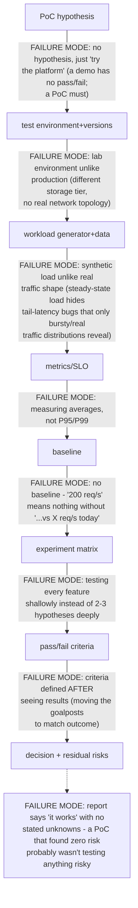

> Learning outcome Translate workload footprint and SLOs into full GPU, MIG, time-slicing or other resource models.

Collect model memory footprint, peak memory with batching/KV cache, latency sensitivity, failure isolation and concurrency. Then test sharing modes. A production recommendation should include how slices/resources are scheduled, observed and reconfigured — not only the hardware feature.

| Workload | Likely starting point | Validate |
|---|---|---|
| large training job | full GPUs / coordinated multi-GPU allocation | scaling efficiency, topology, checkpoint/recovery |
| small dev notebooks | time slicing or shared dev pool | fairness, memory interference, user experience |
| latency-sensitive small inference | MIG where supported if slice fits | P95 latency, isolation, packing efficiency |
| mixed model services | benchmark full/MIG/sharing pools | fragmentation, SLO, operational complexity |


➕ **The PoC pipeline, with the failure mode at each stage named (the source's arrow-diagram, annotated):**

Each arrow in the source diagram is actually a place experienced SAs have seen a PoC go wrong — walking an interviewer through *this* version (failure mode at each stage) is a stronger answer than reciting the stage names.

➕ **Mnemonic: "HEWMBEd" → Hypothesis, Environment, Workload, Metrics, Baseline, Experiment matrix, (pass/fail) Decision.** Awkward on purpose — it forces you to slow down and name each stage rather than skip from "hypothesis" straight to "results," which is exactly the shortcut that turns a PoC into an unfalsifiable demo.

➕ **Sample annotated pass/fail criteria artifact — the missing worked example, for the exact two hypothesis types Practice question 3 asks for:**
```
HYPOTHESIS A — GPU Operator lifecycle automation
"GPU Operator can perform a driver upgrade across a 20-node pool with
zero unplanned inference downtime, completing within a 4-hour
maintenance window."

  Metric                     Pass threshold           Baseline (today, manual)
  Upgrade duration            ≤ 4 hours                ~14 hours across 20 nodes
  Unplanned pod evictions     0 (only planned drains)  N/A — manual has planned outage
  Rollback time if failed     ≤ 30 min                 N/A — no rollback path today
  ➤ WHY these thresholds: "4 hours" isn't arbitrary — it's the customer's
    stated maintenance window from discovery. A PoC that succeeds in 6
    hours technically "worked" but FAILS this criterion, because the
    criterion encodes an actual operational constraint, not a nice-to-have.

HYPOTHESIS B — LLM P95 latency at target concurrency
"Model Y on serving engine X sustains 200 concurrent requests with
P95 TTFT < 1s and P95 inter-token latency < 50ms, at ≤ €Z/1M tokens."

  Metric                     Pass threshold           Baseline (naive single-GPU)
  P95 TTFT                   < 1.0s                   2.3s (measured, no batching)
  P95 inter-token latency    < 50ms                   80ms
  Cost per 1M tokens          ≤ €Z (customer's number) N/A — no production number yet
  Concurrency at pass         200 sustained, not burst  peaks at 40 before queueing
  ➤ WHY these are different criteria in KIND, not just number: Hypothesis A
    is almost entirely an OPERATIONS test (can we change this system safely
    within a business constraint); Hypothesis B is almost entirely a
    PERFORMANCE test (does this system meet an SLO at load). Conflating them
    into one PoC plan is the single most common scoping mistake — they need
    different environments, different instrumentation, and often different
    people running them.
```

➕ **Extra worked scenario — the "customer asks for a 2-week PoC of everything" trap, handled live:**
> **Situation:** the customer's actual ask (per the source scenario) is "PoC of GPU Kubernetes" with no scoping. In the room, before agreeing to anything, the SA's job is step 1: "what production decision should this PoC unblock?" If the customer can't answer that in one sentence, the PoC itself is premature — the actual next step is *more discovery* (Chapter 1), not a PoC plan.
> Suppose the customer's honest answer, after being pushed, turns out to be "we're not sure GPU Operator will survive our air-gapped update process." That's now a single, sharp hypothesis (a Deep Dive 5-flavored operations risk), and the 2-week window should be spent entirely on Hypothesis A above, not split across latency benchmarking the customer never actually needed answered.
> **Interview-ready line:** "A 2-week PoC of 'GPU Kubernetes' is a scoping failure waiting to happen — my first move is always to find the one or two decisions actually blocked, because 2 weeks is enough time to answer 2 real questions well and not enough to answer 10 shallowly."

➕ **The unfalsifiable-PoC test (a sanity check worth naming explicitly):** if you can't describe, in advance, a result that would make the PoC a FAIL, it isn't a PoC — it's a showroom with extra steps. Before starting, ask: "what does failure look like, concretely, in numbers?" If nobody can answer, the pass/fail step (step 3 in the worked scenario) hasn't actually been done yet, regardless of what the plan document says.

## Practice
1. Ask what production decision the PoC should enable: lifecycle automation, serving performance, distributed training, tenancy, networking?
2. Choose 2–3 hypotheses rather than attempting every platform feature.
3. Write PoC success criteria for GPU Operator lifecycle automation and for LLM P95 latency — two very different hypotheses.

➕ 4. Using the unfalsifiable-PoC test above, review a PoC plan you've written or seen in the past and identify whether it had a concrete, numeric FAIL condition stated before execution — if not, retroactively write one and explain what evidence would have triggered it.
➕ 5. A stakeholder wants the PoC report to say "GPU Kubernetes works great" with no caveats, because it's going into a board deck. Write the one-paragraph version of the decision report format (validated / failed / unknown / recommendation / next risk) that keeps the residual-risk honesty intact while still being usable in that deck — name what you would NOT compromise on.


> Learning outcome Normalize cost by useful work and include operations, headroom, failure and licensing.

Hardware/hour price is only one input. Calculate usable throughput at the target SLO, utilization under real demand, failure/maintenance reserve, storage/network, software licensing and staff operational cost. Cloud elasticity can reduce idle capacity but may have availability/quota/data-egress constraints. On-prem may improve steady-state economics but introduces procurement and lifecycle burden.

```
cost_per_million_tokens = total_hourly_cost / (tokens_per_hour / 1_000_000)
effective_capacity = nominal_capacity * expected_utilization * availability_factor
```