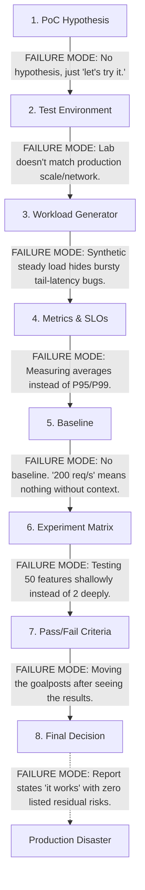

# Chapter 2 — Capacity & TCO Masterclass

| Chapter metadata | Value |
|---|---|
| Volume | 08 — Architecture, Strategy, and Technical Leadership |
| Difficulty | Advanced |
| Estimated reading time | 30 minutes |
| Primary audience | Solutions Architects, FinOps, Platform Engineers |
| Core question | How do you prove that your multi-million dollar AI infrastructure design is financially and technically viable? |

## Introduction

Hardware hourly pricing is just a single variable in a massive, multi-dimensional equation. 

A naive engineer buys GPUs based purely on the sticker price of the server. A Senior Architect calculates the **Total Cost of Ownership (TCO)** by normalizing costs against useful work done (e.g., cost per million tokens), factoring in network overhead, storage, software licensing, power, cooling, failure rates, and human operational burden.

Furthermore, capacity planning in AI is brutal. If you under-provision, your training jobs crash due to Out of Memory (OOM) errors. If you over-provision, you are burning millions of dollars in idle silicon. This chapter teaches the mathematics of GPU capacity, workload sharing, and how to execute a defensible Proof of Concept (PoC).

## 1. Translating Workloads to Hardware Models

Before buying capacity, you must translate the workload footprint into a specific GPU resource model. You must collect the model's memory footprint, peak memory during batching/KV cache generation, latency sensitivity, and concurrency requirements.

Based on this math, you select the hardware sharing strategy:

| Workload Type | Optimal Resource Strategy | What must be Validated in a PoC? |
|---|---|---|
| **Large Distributed Training** | Dedicated Full GPUs (Multi-Node) | Scaling efficiency, InfiniBand topology mapping, checkpoint/recovery speed. |
| **Small Dev/Jupyter Notebooks** | Time-Slicing / Shared Dev Pool | Fairness limits, memory interference between users, perceived UX. |
| **Latency-Sensitive Inference** | Multi-Instance GPU (MIG) | Strict P95 latency guarantees, hardware-level fault isolation, packing efficiency. |
| **Mixed Model Services** | Dynamic Benchmarking (MIG vs. Full) | Memory fragmentation, SLO adherence under burst traffic, operational complexity. |

A production recommendation must define not just the hardware feature (e.g., "Use MIG"), but exactly how those slices are scheduled by Kubernetes, how they are observed by Prometheus, and how they are reconfigured during maintenance.

## 2. The Mathematics of TCO and Useful Work

TCO is not "Server Cost + Electricity." In AI, TCO must be calculated based on **Effective Capacity**.

```text
cost_per_million_tokens = total_hourly_cost / (tokens_per_hour / 1_000_000)

effective_capacity = nominal_capacity * expected_utilization * availability_factor
```

If you buy a cheaper on-premises cluster, but your storage network bottlenecks the GPUs so they only achieve 40% utilization, and your team spends 20% of their time fixing driver crashes (availability factor), your `effective_capacity` is terrible, and your `cost_per_million_tokens` will actually be higher than renting expensive, highly-utilized cloud instances.

## 3. The Proof of Concept (PoC) Pipeline

A PoC is not a "demo." A demo shows that software can turn on. A PoC tests a specific, falsifiable hypothesis to eliminate technical risk.

**The Unfalsifiable-PoC Test:** If you cannot describe, in advance, a numeric result that would make the PoC a **FAIL**, it is not a PoC. 

### The Failure Modes of a PoC Pipeline
Every stage of a PoC has a distinct failure mode that inexperienced teams fall into.



### Creating Strict Pass/Fail Criteria

A professional PoC isolates operations tests from performance tests.

**Hypothesis A (Operations): GPU Operator Lifecycle Automation**
*   *Hypothesis:* The NVIDIA GPU Operator can perform a driver upgrade across a 20-node pool with zero unplanned inference downtime, completing within a 4-hour maintenance window.
*   *Pass Threshold:* Upgrade duration ≤ 4 hours. Unplanned pod evictions = 0. Rollback time if failed ≤ 30 min.
*   *Baseline:* Currently takes 14 hours manually with guaranteed downtime.

**Hypothesis B (Performance): LLM P95 Latency**
*   *Hypothesis:* Model X on Triton serving engine sustains 200 concurrent requests with P95 Time-To-First-Token (TTFT) < 1s.
*   *Pass Threshold:* P95 TTFT < 1.0s. Sustained concurrency = 200.
*   *Baseline:* Currently peaks at 40 concurrent requests before queuing spikes to 2.3s latency.

These are fundamentally different tests requiring different environments and instrumentation.

## Customer Scenario (Senior Level)

**The Situation:**
A customer asks for a "2-week PoC of GPU Kubernetes." They want to test distributed training, MIG inference, GPU Operator upgrades, and storage integration all at once to present to their board.

**The Senior Architect Response:**
"A two-week PoC covering the entire stack is a scoping failure waiting to happen. In two weeks, we can test everything shallowly, but we will uncover no actual risk, effectively making the PoC an unfalsifiable demo. 

My first step is to ask: **What specific production decision is this PoC meant to unblock?**

If the customer admits they are terrified that the GPU Operator will corrupt their air-gapped environment, we throw out the performance testing. We spend the entire two weeks building a rigid, automated test of the air-gapped driver upgrade process (Hypothesis A). 

If the customer is unsure if a 70B model will meet their customer-facing SLA of 1-second latency, we throw out the operations test and focus purely on load testing inference with MIG vs. full GPUs (Hypothesis B). 

Two weeks is enough time to answer two real questions deeply, with strict numeric pass/fail thresholds. We must isolate the greatest technical risk and test only that."

## Interview Preparation

**Conceptual:** What is the difference between a Demo and a PoC? *(Hint: A demo proves functionality. A PoC is a scientific experiment designed to test a specific, falsifiable hypothesis with strict numeric pass/fail criteria to unblock a production decision).*

**Architecture:** Why is measuring 'Average Latency' dangerous during an AI inference PoC? *(Hint: Averages hide tail-latency anomalies. You could have an average latency of 50ms, but 5% of your requests (the P95/P99 tail) might take 5 seconds due to GPU memory swapping or network jitter. You must always measure P95 and P99 under bursty, production-like load shapes).*
