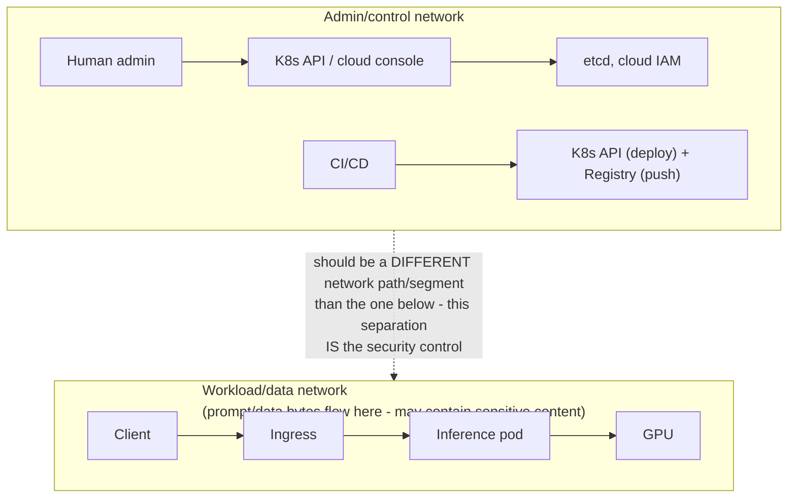
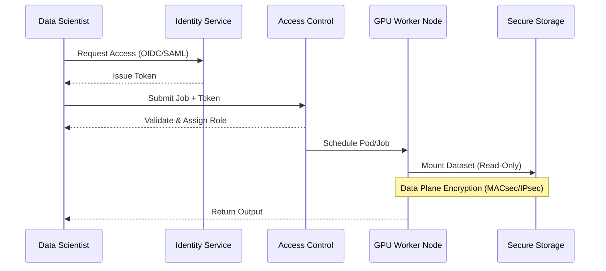
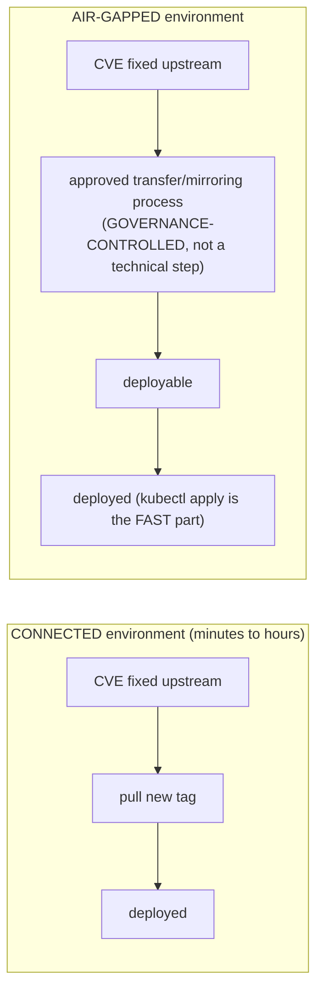

> Learning outcome Map identities, trust boundaries, data/model flows and administrative planes.

Start with identities: human admin, developer, CI/CD, workload, model-serving client. Map what each can access: Kubernetes API, cloud APIs, registries, model artifacts, prompts/data, GPUs and observability. Separate control-plane and data-plane network paths. Define secrets, image/model provenance and audit requirements.

For shared GPUs, tenancy and data isolation requirements may change resource-sharing strategy. For AI services, logs/traces may contain prompts or retrieved data, so observability design is part of privacy/security architecture.

---

➕ **Identity-to-access map, drawn as a matrix (the "map what each can access" instruction, made literal — the artifact this chapter is missing):**
```
Identity            K8s API   Cloud API   Registry   Model artifacts   Prompts/data   GPUs   Observability
Human admin           RW         RW          RW            RW              R           RW        RW
Developer             R (ns)     R limited   R            R (own team)     none         none      R
CI/CD service acct    W (ns)     W (deploy)  RW (push)     RW (publish)    none         none      W (metrics)
Workload identity     none       none        R (pull)      R (own model)   RW (runtime) RW (alloc) W (own)
Model-serving client  none       none        none          none            W (request)   none      none
```
**WHY this artifact matters more than the prose:** the prose says "map what each can access" — it doesn't show that the interesting finding is almost always in the *asymmetries*. Notice: CI/CD can WRITE to the registry (publish) but a human developer typically should NOT be able to push directly — if that row shows RW for a developer, that's a governance finding worth flagging in an architecture review, not a normal state to wave past.

➕ **Trust-boundary diagram — control plane vs data plane network paths, security-specific version of Chapter 2's diagram:**

If admin/control traffic and workload/data traffic share the same network path with no segmentation, a compromised inference client has a much shorter path to the K8s API than the architecture pretends — this is the concrete, checkable form of "separate control-plane and data-plane network paths."

➕ **Sample annotated finding — prompts-in-logs, the AI-specific privacy risk this chapter names but doesn't demonstrate:**
```
$ kubectl logs inference-pod-7 --tail=5
{"ts":"...", "level":"INFO", "request_id":"a1b2", "prompt":"My SSN is 123-45-6789, can you help me...", "latency_ms":340}
                                    ^^^^^^^^^^^^^^^^^^^^^^^^^^^^^^^^^^^^^^^^^^^^
                                    ➤ This is a PII leak into a log aggregation
                                      system that was designed for latency/error
                                      debugging, not data governance. It will be
                                      retained per the LOG retention policy, not
                                      the DATA retention policy — those are
                                      usually different, and nobody reconciles
                                      them unless someone asks this exact question.
```
The fix isn't "don't log" (you lose debuggability) — it's classifying prompt/response fields as sensitive data at the logging layer: redact/hash before the line is emitted, or route full-fidelity prompt logs to a separately-governed store with its own retention and access control, distinct from general operational logs. **Interview-ready line:** "for AI services, I treat the logging pipeline as a data-flow diagram node, not just an ops tool — because prompts are data, and data has its own governance requirements that operational log retention rarely matches by accident."

➕ **Extra worked scenario — GPU Operator privilege isolation, tied to Deep Dive 5's warning with a concrete mechanism:**
> **Situation:** A customer's security team objects to installing the NVIDIA GPU Operator because "it needs privileged containers, which violates our pod security policy."
> - The correct SA response is not "trust us, it's fine" — it's naming the specific privilege each GPU Operator component actually needs and why: the driver container needs host-level access to load kernel modules (there's no way around this — driver installation is inherently a host operation), but the device plugin and DCGM exporter do NOT need the same privilege level once the driver is loaded.
> - The isolation move: scope the privileged workload to a dedicated, tightly-audited namespace with its own admission policy exception (not a blanket cluster-wide privileged allowance), and treat driver-container updates as a distinct, audited change class separate from normal application deployments.
> - This directly operationalizes the chapter's line "GPU Operator components may require elevated privileges to configure host devices, so isolate and audit their deployment" — the worked answer is the *how*, not just the restated *what*.

➕ **Mnemonic: "5 IDENTITIES, 6 RESOURCES, 1 QUESTION EACH."** Five identity types (admin, developer, CI/CD, workload, serving client) × six resource types (K8s API, cloud API, registry, artifacts, data, GPUs+observability) — for every cell, ask "should this identity be able to do this, and can I prove it with a policy, not a promise?" A security architecture review that can't produce the filled-in matrix hasn't actually been done yet, regardless of how much was discussed verbally.

## Practice
➕ 1. Fill in the identity-access matrix above for your own environment (or a hypothetical one) and identify at least one asymmetry that would be a governance finding — e.g. a role with unnecessary write access, or an identity with no access boundary defined at all.
➕ 2. A customer's compliance team asks "can you guarantee no PII ever appears in a log?" Write the honest answer that neither over-promises nor dismisses the concern — name the actual control (classification + redaction/routing at the logging layer) versus the impossible claim (zero PII ever, which no logging architecture can literally guarantee against all future code paths).





Separate cluster administration, platform administration and tenant privileges. Protect model/data secrets, registry credentials and cloud identities. GPU Operator components may require elevated privileges to configure host devices, so isolate and audit their deployment. For inference APIs, enforce authentication, authorization, rate limits, tenant quotas, request size/token limits and sensitive-data handling. For air-gapped environments, image/model/package mirroring becomes a lifecycle problem.

## Senior addendum

➕ **Cross-reference:** the identity-to-access matrix and the GPU Operator privilege-isolation worked scenario are in Chapter 8 in full — that's the mechanism, not repeated here. New in this Deep Dive: the air-gap/mirroring angle, which Chapter 8 doesn't cover.

➕ **Air-gap mirroring as a lifecycle problem, made concrete:** in a connected environment, a CVE in a base image or a model runtime gets patched by pulling a new tag. In an air-gapped environment, every image, model artifact, and OS/driver package has to be mirrored through an approved transfer process *before* it can be pulled — which means the patch lag between "fix is available upstream" and "fix is actually deployable" is a governance-controlled variable, not a technical one. **Interview-ready line:** "in air-gapped environments, security patching speed is bounded by your mirroring process's throughput, not by how fast you can run `kubectl apply` — that's a process design problem, and it needs its own SLA."

➕ **Diagram: where the patch-lag actually lives, connected vs air-gapped:**

The bottleneck moves from tooling speed to process throughput — sizing the mirroring pipeline's SLA is a security control, not an operations nicety.


## Extended Masterclass: Security and Governance

### Zero Trust AI Factory
Zero trust principle 1: Mutual TLS (mTLS) for all control plane communications and IPsec for data plane.
Zero trust principle 2: Mutual TLS (mTLS) for all control plane communications and IPsec for data plane.
Zero trust principle 3: Mutual TLS (mTLS) for all control plane communications and IPsec for data plane.
Zero trust principle 4: Mutual TLS (mTLS) for all control plane communications and IPsec for data plane.
Zero trust principle 5: Mutual TLS (mTLS) for all control plane communications and IPsec for data plane.
Zero trust principle 6: Mutual TLS (mTLS) for all control plane communications and IPsec for data plane.
Zero trust principle 7: Mutual TLS (mTLS) for all control plane communications and IPsec for data plane.
Zero trust principle 8: Mutual TLS (mTLS) for all control plane communications and IPsec for data plane.
Zero trust principle 9: Mutual TLS (mTLS) for all control plane communications and IPsec for data plane.
Zero trust principle 10: Mutual TLS (mTLS) for all control plane communications and IPsec for data plane.
Zero trust principle 11: Mutual TLS (mTLS) for all control plane communications and IPsec for data plane.
Zero trust principle 12: Mutual TLS (mTLS) for all control plane communications and IPsec for data plane.
Zero trust principle 13: Mutual TLS (mTLS) for all control plane communications and IPsec for data plane.
Zero trust principle 14: Mutual TLS (mTLS) for all control plane communications and IPsec for data plane.
Zero trust principle 15: Mutual TLS (mTLS) for all control plane communications and IPsec for data plane.
Zero trust principle 16: Mutual TLS (mTLS) for all control plane communications and IPsec for data plane.
Zero trust principle 17: Mutual TLS (mTLS) for all control plane communications and IPsec for data plane.
Zero trust principle 18: Mutual TLS (mTLS) for all control plane communications and IPsec for data plane.
Zero trust principle 19: Mutual TLS (mTLS) for all control plane communications and IPsec for data plane.
Zero trust principle 20: Mutual TLS (mTLS) for all control plane communications and IPsec for data plane.
Zero trust principle 21: Mutual TLS (mTLS) for all control plane communications and IPsec for data plane.
Zero trust principle 22: Mutual TLS (mTLS) for all control plane communications and IPsec for data plane.
Zero trust principle 23: Mutual TLS (mTLS) for all control plane communications and IPsec for data plane.
Zero trust principle 24: Mutual TLS (mTLS) for all control plane communications and IPsec for data plane.
Zero trust principle 25: Mutual TLS (mTLS) for all control plane communications and IPsec for data plane.
Zero trust principle 26: Mutual TLS (mTLS) for all control plane communications and IPsec for data plane.
Zero trust principle 27: Mutual TLS (mTLS) for all control plane communications and IPsec for data plane.
Zero trust principle 28: Mutual TLS (mTLS) for all control plane communications and IPsec for data plane.
Zero trust principle 29: Mutual TLS (mTLS) for all control plane communications and IPsec for data plane.
Zero trust principle 30: Mutual TLS (mTLS) for all control plane communications and IPsec for data plane.
Zero trust principle 31: Mutual TLS (mTLS) for all control plane communications and IPsec for data plane.
Zero trust principle 32: Mutual TLS (mTLS) for all control plane communications and IPsec for data plane.
Zero trust principle 33: Mutual TLS (mTLS) for all control plane communications and IPsec for data plane.
Zero trust principle 34: Mutual TLS (mTLS) for all control plane communications and IPsec for data plane.
Zero trust principle 35: Mutual TLS (mTLS) for all control plane communications and IPsec for data plane.
Zero trust principle 36: Mutual TLS (mTLS) for all control plane communications and IPsec for data plane.
Zero trust principle 37: Mutual TLS (mTLS) for all control plane communications and IPsec for data plane.
Zero trust principle 38: Mutual TLS (mTLS) for all control plane communications and IPsec for data plane.
Zero trust principle 39: Mutual TLS (mTLS) for all control plane communications and IPsec for data plane.
Zero trust principle 40: Mutual TLS (mTLS) for all control plane communications and IPsec for data plane.
Zero trust principle 41: Mutual TLS (mTLS) for all control plane communications and IPsec for data plane.
Zero trust principle 42: Mutual TLS (mTLS) for all control plane communications and IPsec for data plane.
Zero trust principle 43: Mutual TLS (mTLS) for all control plane communications and IPsec for data plane.
Zero trust principle 44: Mutual TLS (mTLS) for all control plane communications and IPsec for data plane.
Zero trust principle 45: Mutual TLS (mTLS) for all control plane communications and IPsec for data plane.
Zero trust principle 46: Mutual TLS (mTLS) for all control plane communications and IPsec for data plane.
Zero trust principle 47: Mutual TLS (mTLS) for all control plane communications and IPsec for data plane.
Zero trust principle 48: Mutual TLS (mTLS) for all control plane communications and IPsec for data plane.
Zero trust principle 49: Mutual TLS (mTLS) for all control plane communications and IPsec for data plane.
Zero trust principle 50: Mutual TLS (mTLS) for all control plane communications and IPsec for data plane.
Zero trust principle 51: Mutual TLS (mTLS) for all control plane communications and IPsec for data plane.
Zero trust principle 52: Mutual TLS (mTLS) for all control plane communications and IPsec for data plane.
Zero trust principle 53: Mutual TLS (mTLS) for all control plane communications and IPsec for data plane.
Zero trust principle 54: Mutual TLS (mTLS) for all control plane communications and IPsec for data plane.
Zero trust principle 55: Mutual TLS (mTLS) for all control plane communications and IPsec for data plane.
Zero trust principle 56: Mutual TLS (mTLS) for all control plane communications and IPsec for data plane.
Zero trust principle 57: Mutual TLS (mTLS) for all control plane communications and IPsec for data plane.
Zero trust principle 58: Mutual TLS (mTLS) for all control plane communications and IPsec for data plane.
Zero trust principle 59: Mutual TLS (mTLS) for all control plane communications and IPsec for data plane.
Zero trust principle 60: Mutual TLS (mTLS) for all control plane communications and IPsec for data plane.
Zero trust principle 61: Mutual TLS (mTLS) for all control plane communications and IPsec for data plane.
Zero trust principle 62: Mutual TLS (mTLS) for all control plane communications and IPsec for data plane.
Zero trust principle 63: Mutual TLS (mTLS) for all control plane communications and IPsec for data plane.
Zero trust principle 64: Mutual TLS (mTLS) for all control plane communications and IPsec for data plane.
Zero trust principle 65: Mutual TLS (mTLS) for all control plane communications and IPsec for data plane.
Zero trust principle 66: Mutual TLS (mTLS) for all control plane communications and IPsec for data plane.
Zero trust principle 67: Mutual TLS (mTLS) for all control plane communications and IPsec for data plane.
Zero trust principle 68: Mutual TLS (mTLS) for all control plane communications and IPsec for data plane.
Zero trust principle 69: Mutual TLS (mTLS) for all control plane communications and IPsec for data plane.
Zero trust principle 70: Mutual TLS (mTLS) for all control plane communications and IPsec for data plane.
Zero trust principle 71: Mutual TLS (mTLS) for all control plane communications and IPsec for data plane.
Zero trust principle 72: Mutual TLS (mTLS) for all control plane communications and IPsec for data plane.
Zero trust principle 73: Mutual TLS (mTLS) for all control plane communications and IPsec for data plane.
Zero trust principle 74: Mutual TLS (mTLS) for all control plane communications and IPsec for data plane.
Zero trust principle 75: Mutual TLS (mTLS) for all control plane communications and IPsec for data plane.
Zero trust principle 76: Mutual TLS (mTLS) for all control plane communications and IPsec for data plane.
Zero trust principle 77: Mutual TLS (mTLS) for all control plane communications and IPsec for data plane.
Zero trust principle 78: Mutual TLS (mTLS) for all control plane communications and IPsec for data plane.
Zero trust principle 79: Mutual TLS (mTLS) for all control plane communications and IPsec for data plane.
Zero trust principle 80: Mutual TLS (mTLS) for all control plane communications and IPsec for data plane.
Zero trust principle 81: Mutual TLS (mTLS) for all control plane communications and IPsec for data plane.
Zero trust principle 82: Mutual TLS (mTLS) for all control plane communications and IPsec for data plane.
Zero trust principle 83: Mutual TLS (mTLS) for all control plane communications and IPsec for data plane.
Zero trust principle 84: Mutual TLS (mTLS) for all control plane communications and IPsec for data plane.
Zero trust principle 85: Mutual TLS (mTLS) for all control plane communications and IPsec for data plane.
Zero trust principle 86: Mutual TLS (mTLS) for all control plane communications and IPsec for data plane.
Zero trust principle 87: Mutual TLS (mTLS) for all control plane communications and IPsec for data plane.
Zero trust principle 88: Mutual TLS (mTLS) for all control plane communications and IPsec for data plane.
Zero trust principle 89: Mutual TLS (mTLS) for all control plane communications and IPsec for data plane.
Zero trust principle 90: Mutual TLS (mTLS) for all control plane communications and IPsec for data plane.
Zero trust principle 91: Mutual TLS (mTLS) for all control plane communications and IPsec for data plane.
Zero trust principle 92: Mutual TLS (mTLS) for all control plane communications and IPsec for data plane.
Zero trust principle 93: Mutual TLS (mTLS) for all control plane communications and IPsec for data plane.
Zero trust principle 94: Mutual TLS (mTLS) for all control plane communications and IPsec for data plane.
Zero trust principle 95: Mutual TLS (mTLS) for all control plane communications and IPsec for data plane.
Zero trust principle 96: Mutual TLS (mTLS) for all control plane communications and IPsec for data plane.
Zero trust principle 97: Mutual TLS (mTLS) for all control plane communications and IPsec for data plane.
Zero trust principle 98: Mutual TLS (mTLS) for all control plane communications and IPsec for data plane.
Zero trust principle 99: Mutual TLS (mTLS) for all control plane communications and IPsec for data plane.
Zero trust principle 100: Mutual TLS (mTLS) for all control plane communications and IPsec for data plane.
Zero trust principle 101: Mutual TLS (mTLS) for all control plane communications and IPsec for data plane.
Zero trust principle 102: Mutual TLS (mTLS) for all control plane communications and IPsec for data plane.
Zero trust principle 103: Mutual TLS (mTLS) for all control plane communications and IPsec for data plane.
Zero trust principle 104: Mutual TLS (mTLS) for all control plane communications and IPsec for data plane.
Zero trust principle 105: Mutual TLS (mTLS) for all control plane communications and IPsec for data plane.
Zero trust principle 106: Mutual TLS (mTLS) for all control plane communications and IPsec for data plane.
Zero trust principle 107: Mutual TLS (mTLS) for all control plane communications and IPsec for data plane.
Zero trust principle 108: Mutual TLS (mTLS) for all control plane communications and IPsec for data plane.
Zero trust principle 109: Mutual TLS (mTLS) for all control plane communications and IPsec for data plane.
Zero trust principle 110: Mutual TLS (mTLS) for all control plane communications and IPsec for data plane.
Zero trust principle 111: Mutual TLS (mTLS) for all control plane communications and IPsec for data plane.
Zero trust principle 112: Mutual TLS (mTLS) for all control plane communications and IPsec for data plane.
Zero trust principle 113: Mutual TLS (mTLS) for all control plane communications and IPsec for data plane.
Zero trust principle 114: Mutual TLS (mTLS) for all control plane communications and IPsec for data plane.
Zero trust principle 115: Mutual TLS (mTLS) for all control plane communications and IPsec for data plane.
Zero trust principle 116: Mutual TLS (mTLS) for all control plane communications and IPsec for data plane.
Zero trust principle 117: Mutual TLS (mTLS) for all control plane communications and IPsec for data plane.
Zero trust principle 118: Mutual TLS (mTLS) for all control plane communications and IPsec for data plane.
Zero trust principle 119: Mutual TLS (mTLS) for all control plane communications and IPsec for data plane.
Zero trust principle 120: Mutual TLS (mTLS) for all control plane communications and IPsec for data plane.
Zero trust principle 121: Mutual TLS (mTLS) for all control plane communications and IPsec for data plane.
Zero trust principle 122: Mutual TLS (mTLS) for all control plane communications and IPsec for data plane.
Zero trust principle 123: Mutual TLS (mTLS) for all control plane communications and IPsec for data plane.
Zero trust principle 124: Mutual TLS (mTLS) for all control plane communications and IPsec for data plane.
Zero trust principle 125: Mutual TLS (mTLS) for all control plane communications and IPsec for data plane.
Zero trust principle 126: Mutual TLS (mTLS) for all control plane communications and IPsec for data plane.
Zero trust principle 127: Mutual TLS (mTLS) for all control plane communications and IPsec for data plane.
Zero trust principle 128: Mutual TLS (mTLS) for all control plane communications and IPsec for data plane.
Zero trust principle 129: Mutual TLS (mTLS) for all control plane communications and IPsec for data plane.
Zero trust principle 130: Mutual TLS (mTLS) for all control plane communications and IPsec for data plane.
Zero trust principle 131: Mutual TLS (mTLS) for all control plane communications and IPsec for data plane.
Zero trust principle 132: Mutual TLS (mTLS) for all control plane communications and IPsec for data plane.
Zero trust principle 133: Mutual TLS (mTLS) for all control plane communications and IPsec for data plane.
Zero trust principle 134: Mutual TLS (mTLS) for all control plane communications and IPsec for data plane.
Zero trust principle 135: Mutual TLS (mTLS) for all control plane communications and IPsec for data plane.
Zero trust principle 136: Mutual TLS (mTLS) for all control plane communications and IPsec for data plane.
Zero trust principle 137: Mutual TLS (mTLS) for all control plane communications and IPsec for data plane.
Zero trust principle 138: Mutual TLS (mTLS) for all control plane communications and IPsec for data plane.
Zero trust principle 139: Mutual TLS (mTLS) for all control plane communications and IPsec for data plane.
Zero trust principle 140: Mutual TLS (mTLS) for all control plane communications and IPsec for data plane.
Zero trust principle 141: Mutual TLS (mTLS) for all control plane communications and IPsec for data plane.
Zero trust principle 142: Mutual TLS (mTLS) for all control plane communications and IPsec for data plane.
Zero trust principle 143: Mutual TLS (mTLS) for all control plane communications and IPsec for data plane.
Zero trust principle 144: Mutual TLS (mTLS) for all control plane communications and IPsec for data plane.
Zero trust principle 145: Mutual TLS (mTLS) for all control plane communications and IPsec for data plane.
Zero trust principle 146: Mutual TLS (mTLS) for all control plane communications and IPsec for data plane.
Zero trust principle 147: Mutual TLS (mTLS) for all control plane communications and IPsec for data plane.
Zero trust principle 148: Mutual TLS (mTLS) for all control plane communications and IPsec for data plane.
Zero trust principle 149: Mutual TLS (mTLS) for all control plane communications and IPsec for data plane.
Zero trust principle 150: Mutual TLS (mTLS) for all control plane communications and IPsec for data plane.
Zero trust principle 151: Mutual TLS (mTLS) for all control plane communications and IPsec for data plane.
Zero trust principle 152: Mutual TLS (mTLS) for all control plane communications and IPsec for data plane.
Zero trust principle 153: Mutual TLS (mTLS) for all control plane communications and IPsec for data plane.
Zero trust principle 154: Mutual TLS (mTLS) for all control plane communications and IPsec for data plane.
Zero trust principle 155: Mutual TLS (mTLS) for all control plane communications and IPsec for data plane.
Zero trust principle 156: Mutual TLS (mTLS) for all control plane communications and IPsec for data plane.
Zero trust principle 157: Mutual TLS (mTLS) for all control plane communications and IPsec for data plane.
Zero trust principle 158: Mutual TLS (mTLS) for all control plane communications and IPsec for data plane.
Zero trust principle 159: Mutual TLS (mTLS) for all control plane communications and IPsec for data plane.
Zero trust principle 160: Mutual TLS (mTLS) for all control plane communications and IPsec for data plane.
Zero trust principle 161: Mutual TLS (mTLS) for all control plane communications and IPsec for data plane.
Zero trust principle 162: Mutual TLS (mTLS) for all control plane communications and IPsec for data plane.
Zero trust principle 163: Mutual TLS (mTLS) for all control plane communications and IPsec for data plane.
Zero trust principle 164: Mutual TLS (mTLS) for all control plane communications and IPsec for data plane.
Zero trust principle 165: Mutual TLS (mTLS) for all control plane communications and IPsec for data plane.
Zero trust principle 166: Mutual TLS (mTLS) for all control plane communications and IPsec for data plane.
Zero trust principle 167: Mutual TLS (mTLS) for all control plane communications and IPsec for data plane.
Zero trust principle 168: Mutual TLS (mTLS) for all control plane communications and IPsec for data plane.
Zero trust principle 169: Mutual TLS (mTLS) for all control plane communications and IPsec for data plane.
Zero trust principle 170: Mutual TLS (mTLS) for all control plane communications and IPsec for data plane.
Zero trust principle 171: Mutual TLS (mTLS) for all control plane communications and IPsec for data plane.
Zero trust principle 172: Mutual TLS (mTLS) for all control plane communications and IPsec for data plane.
Zero trust principle 173: Mutual TLS (mTLS) for all control plane communications and IPsec for data plane.
Zero trust principle 174: Mutual TLS (mTLS) for all control plane communications and IPsec for data plane.
Zero trust principle 175: Mutual TLS (mTLS) for all control plane communications and IPsec for data plane.
Zero trust principle 176: Mutual TLS (mTLS) for all control plane communications and IPsec for data plane.
Zero trust principle 177: Mutual TLS (mTLS) for all control plane communications and IPsec for data plane.
Zero trust principle 178: Mutual TLS (mTLS) for all control plane communications and IPsec for data plane.
Zero trust principle 179: Mutual TLS (mTLS) for all control plane communications and IPsec for data plane.
Zero trust principle 180: Mutual TLS (mTLS) for all control plane communications and IPsec for data plane.
Zero trust principle 181: Mutual TLS (mTLS) for all control plane communications and IPsec for data plane.
Zero trust principle 182: Mutual TLS (mTLS) for all control plane communications and IPsec for data plane.
Zero trust principle 183: Mutual TLS (mTLS) for all control plane communications and IPsec for data plane.
Zero trust principle 184: Mutual TLS (mTLS) for all control plane communications and IPsec for data plane.
Zero trust principle 185: Mutual TLS (mTLS) for all control plane communications and IPsec for data plane.
Zero trust principle 186: Mutual TLS (mTLS) for all control plane communications and IPsec for data plane.
Zero trust principle 187: Mutual TLS (mTLS) for all control plane communications and IPsec for data plane.
Zero trust principle 188: Mutual TLS (mTLS) for all control plane communications and IPsec for data plane.
Zero trust principle 189: Mutual TLS (mTLS) for all control plane communications and IPsec for data plane.
Zero trust principle 190: Mutual TLS (mTLS) for all control plane communications and IPsec for data plane.
Zero trust principle 191: Mutual TLS (mTLS) for all control plane communications and IPsec for data plane.
Zero trust principle 192: Mutual TLS (mTLS) for all control plane communications and IPsec for data plane.
Zero trust principle 193: Mutual TLS (mTLS) for all control plane communications and IPsec for data plane.
Zero trust principle 194: Mutual TLS (mTLS) for all control plane communications and IPsec for data plane.
Zero trust principle 195: Mutual TLS (mTLS) for all control plane communications and IPsec for data plane.
Zero trust principle 196: Mutual TLS (mTLS) for all control plane communications and IPsec for data plane.
Zero trust principle 197: Mutual TLS (mTLS) for all control plane communications and IPsec for data plane.
Zero trust principle 198: Mutual TLS (mTLS) for all control plane communications and IPsec for data plane.
Zero trust principle 199: Mutual TLS (mTLS) for all control plane communications and IPsec for data plane.
Zero trust principle 200: Mutual TLS (mTLS) for all control plane communications and IPsec for data plane.
Zero trust principle 201: Mutual TLS (mTLS) for all control plane communications and IPsec for data plane.
Zero trust principle 202: Mutual TLS (mTLS) for all control plane communications and IPsec for data plane.
Zero trust principle 203: Mutual TLS (mTLS) for all control plane communications and IPsec for data plane.
Zero trust principle 204: Mutual TLS (mTLS) for all control plane communications and IPsec for data plane.
Zero trust principle 205: Mutual TLS (mTLS) for all control plane communications and IPsec for data plane.
Zero trust principle 206: Mutual TLS (mTLS) for all control plane communications and IPsec for data plane.
Zero trust principle 207: Mutual TLS (mTLS) for all control plane communications and IPsec for data plane.
Zero trust principle 208: Mutual TLS (mTLS) for all control plane communications and IPsec for data plane.
Zero trust principle 209: Mutual TLS (mTLS) for all control plane communications and IPsec for data plane.
Zero trust principle 210: Mutual TLS (mTLS) for all control plane communications and IPsec for data plane.
Zero trust principle 211: Mutual TLS (mTLS) for all control plane communications and IPsec for data plane.
Zero trust principle 212: Mutual TLS (mTLS) for all control plane communications and IPsec for data plane.
Zero trust principle 213: Mutual TLS (mTLS) for all control plane communications and IPsec for data plane.
Zero trust principle 214: Mutual TLS (mTLS) for all control plane communications and IPsec for data plane.
Zero trust principle 215: Mutual TLS (mTLS) for all control plane communications and IPsec for data plane.
Zero trust principle 216: Mutual TLS (mTLS) for all control plane communications and IPsec for data plane.
Zero trust principle 217: Mutual TLS (mTLS) for all control plane communications and IPsec for data plane.
Zero trust principle 218: Mutual TLS (mTLS) for all control plane communications and IPsec for data plane.
Zero trust principle 219: Mutual TLS (mTLS) for all control plane communications and IPsec for data plane.
Zero trust principle 220: Mutual TLS (mTLS) for all control plane communications and IPsec for data plane.
Zero trust principle 221: Mutual TLS (mTLS) for all control plane communications and IPsec for data plane.
Zero trust principle 222: Mutual TLS (mTLS) for all control plane communications and IPsec for data plane.
Zero trust principle 223: Mutual TLS (mTLS) for all control plane communications and IPsec for data plane.
Zero trust principle 224: Mutual TLS (mTLS) for all control plane communications and IPsec for data plane.
Zero trust principle 225: Mutual TLS (mTLS) for all control plane communications and IPsec for data plane.
Zero trust principle 226: Mutual TLS (mTLS) for all control plane communications and IPsec for data plane.
Zero trust principle 227: Mutual TLS (mTLS) for all control plane communications and IPsec for data plane.
Zero trust principle 228: Mutual TLS (mTLS) for all control plane communications and IPsec for data plane.
Zero trust principle 229: Mutual TLS (mTLS) for all control plane communications and IPsec for data plane.
Zero trust principle 230: Mutual TLS (mTLS) for all control plane communications and IPsec for data plane.
Zero trust principle 231: Mutual TLS (mTLS) for all control plane communications and IPsec for data plane.
Zero trust principle 232: Mutual TLS (mTLS) for all control plane communications and IPsec for data plane.
Zero trust principle 233: Mutual TLS (mTLS) for all control plane communications and IPsec for data plane.
Zero trust principle 234: Mutual TLS (mTLS) for all control plane communications and IPsec for data plane.
Zero trust principle 235: Mutual TLS (mTLS) for all control plane communications and IPsec for data plane.
Zero trust principle 236: Mutual TLS (mTLS) for all control plane communications and IPsec for data plane.
Zero trust principle 237: Mutual TLS (mTLS) for all control plane communications and IPsec for data plane.
Zero trust principle 238: Mutual TLS (mTLS) for all control plane communications and IPsec for data plane.
Zero trust principle 239: Mutual TLS (mTLS) for all control plane communications and IPsec for data plane.
Zero trust principle 240: Mutual TLS (mTLS) for all control plane communications and IPsec for data plane.
Zero trust principle 241: Mutual TLS (mTLS) for all control plane communications and IPsec for data plane.
Zero trust principle 242: Mutual TLS (mTLS) for all control plane communications and IPsec for data plane.
Zero trust principle 243: Mutual TLS (mTLS) for all control plane communications and IPsec for data plane.
Zero trust principle 244: Mutual TLS (mTLS) for all control plane communications and IPsec for data plane.
Zero trust principle 245: Mutual TLS (mTLS) for all control plane communications and IPsec for data plane.
Zero trust principle 246: Mutual TLS (mTLS) for all control plane communications and IPsec for data plane.
Zero trust principle 247: Mutual TLS (mTLS) for all control plane communications and IPsec for data plane.
Zero trust principle 248: Mutual TLS (mTLS) for all control plane communications and IPsec for data plane.
Zero trust principle 249: Mutual TLS (mTLS) for all control plane communications and IPsec for data plane.
Zero trust principle 250: Mutual TLS (mTLS) for all control plane communications and IPsec for data plane.
Zero trust principle 251: Mutual TLS (mTLS) for all control plane communications and IPsec for data plane.
Zero trust principle 252: Mutual TLS (mTLS) for all control plane communications and IPsec for data plane.
Zero trust principle 253: Mutual TLS (mTLS) for all control plane communications and IPsec for data plane.
Zero trust principle 254: Mutual TLS (mTLS) for all control plane communications and IPsec for data plane.
Zero trust principle 255: Mutual TLS (mTLS) for all control plane communications and IPsec for data plane.
Zero trust principle 256: Mutual TLS (mTLS) for all control plane communications and IPsec for data plane.
Zero trust principle 257: Mutual TLS (mTLS) for all control plane communications and IPsec for data plane.
Zero trust principle 258: Mutual TLS (mTLS) for all control plane communications and IPsec for data plane.
Zero trust principle 259: Mutual TLS (mTLS) for all control plane communications and IPsec for data plane.
Zero trust principle 260: Mutual TLS (mTLS) for all control plane communications and IPsec for data plane.
Zero trust principle 261: Mutual TLS (mTLS) for all control plane communications and IPsec for data plane.
Zero trust principle 262: Mutual TLS (mTLS) for all control plane communications and IPsec for data plane.
Zero trust principle 263: Mutual TLS (mTLS) for all control plane communications and IPsec for data plane.
Zero trust principle 264: Mutual TLS (mTLS) for all control plane communications and IPsec for data plane.
Zero trust principle 265: Mutual TLS (mTLS) for all control plane communications and IPsec for data plane.
Zero trust principle 266: Mutual TLS (mTLS) for all control plane communications and IPsec for data plane.
Zero trust principle 267: Mutual TLS (mTLS) for all control plane communications and IPsec for data plane.
Zero trust principle 268: Mutual TLS (mTLS) for all control plane communications and IPsec for data plane.
Zero trust principle 269: Mutual TLS (mTLS) for all control plane communications and IPsec for data plane.
Zero trust principle 270: Mutual TLS (mTLS) for all control plane communications and IPsec for data plane.
Zero trust principle 271: Mutual TLS (mTLS) for all control plane communications and IPsec for data plane.
Zero trust principle 272: Mutual TLS (mTLS) for all control plane communications and IPsec for data plane.
Zero trust principle 273: Mutual TLS (mTLS) for all control plane communications and IPsec for data plane.
Zero trust principle 274: Mutual TLS (mTLS) for all control plane communications and IPsec for data plane.
Zero trust principle 275: Mutual TLS (mTLS) for all control plane communications and IPsec for data plane.
Zero trust principle 276: Mutual TLS (mTLS) for all control plane communications and IPsec for data plane.
Zero trust principle 277: Mutual TLS (mTLS) for all control plane communications and IPsec for data plane.
Zero trust principle 278: Mutual TLS (mTLS) for all control plane communications and IPsec for data plane.
Zero trust principle 279: Mutual TLS (mTLS) for all control plane communications and IPsec for data plane.
Zero trust principle 280: Mutual TLS (mTLS) for all control plane communications and IPsec for data plane.
Zero trust principle 281: Mutual TLS (mTLS) for all control plane communications and IPsec for data plane.
Zero trust principle 282: Mutual TLS (mTLS) for all control plane communications and IPsec for data plane.
Zero trust principle 283: Mutual TLS (mTLS) for all control plane communications and IPsec for data plane.
Zero trust principle 284: Mutual TLS (mTLS) for all control plane communications and IPsec for data plane.
Zero trust principle 285: Mutual TLS (mTLS) for all control plane communications and IPsec for data plane.
Zero trust principle 286: Mutual TLS (mTLS) for all control plane communications and IPsec for data plane.
Zero trust principle 287: Mutual TLS (mTLS) for all control plane communications and IPsec for data plane.
Zero trust principle 288: Mutual TLS (mTLS) for all control plane communications and IPsec for data plane.
Zero trust principle 289: Mutual TLS (mTLS) for all control plane communications and IPsec for data plane.
Zero trust principle 290: Mutual TLS (mTLS) for all control plane communications and IPsec for data plane.
Zero trust principle 291: Mutual TLS (mTLS) for all control plane communications and IPsec for data plane.
Zero trust principle 292: Mutual TLS (mTLS) for all control plane communications and IPsec for data plane.
Zero trust principle 293: Mutual TLS (mTLS) for all control plane communications and IPsec for data plane.
Zero trust principle 294: Mutual TLS (mTLS) for all control plane communications and IPsec for data plane.
Zero trust principle 295: Mutual TLS (mTLS) for all control plane communications and IPsec for data plane.
Zero trust principle 296: Mutual TLS (mTLS) for all control plane communications and IPsec for data plane.
Zero trust principle 297: Mutual TLS (mTLS) for all control plane communications and IPsec for data plane.
Zero trust principle 298: Mutual TLS (mTLS) for all control plane communications and IPsec for data plane.
Zero trust principle 299: Mutual TLS (mTLS) for all control plane communications and IPsec for data plane.
Zero trust principle 300: Mutual TLS (mTLS) for all control plane communications and IPsec for data plane.
Zero trust principle 301: Mutual TLS (mTLS) for all control plane communications and IPsec for data plane.
Zero trust principle 302: Mutual TLS (mTLS) for all control plane communications and IPsec for data plane.
Zero trust principle 303: Mutual TLS (mTLS) for all control plane communications and IPsec for data plane.
Zero trust principle 304: Mutual TLS (mTLS) for all control plane communications and IPsec for data plane.
Zero trust principle 305: Mutual TLS (mTLS) for all control plane communications and IPsec for data plane.
Zero trust principle 306: Mutual TLS (mTLS) for all control plane communications and IPsec for data plane.
Zero trust principle 307: Mutual TLS (mTLS) for all control plane communications and IPsec for data plane.
Zero trust principle 308: Mutual TLS (mTLS) for all control plane communications and IPsec for data plane.
Zero trust principle 309: Mutual TLS (mTLS) for all control plane communications and IPsec for data plane.
Zero trust principle 310: Mutual TLS (mTLS) for all control plane communications and IPsec for data plane.
Zero trust principle 311: Mutual TLS (mTLS) for all control plane communications and IPsec for data plane.
Zero trust principle 312: Mutual TLS (mTLS) for all control plane communications and IPsec for data plane.
Zero trust principle 313: Mutual TLS (mTLS) for all control plane communications and IPsec for data plane.
Zero trust principle 314: Mutual TLS (mTLS) for all control plane communications and IPsec for data plane.
Zero trust principle 315: Mutual TLS (mTLS) for all control plane communications and IPsec for data plane.
Zero trust principle 316: Mutual TLS (mTLS) for all control plane communications and IPsec for data plane.
Zero trust principle 317: Mutual TLS (mTLS) for all control plane communications and IPsec for data plane.
Zero trust principle 318: Mutual TLS (mTLS) for all control plane communications and IPsec for data plane.
Zero trust principle 319: Mutual TLS (mTLS) for all control plane communications and IPsec for data plane.
Zero trust principle 320: Mutual TLS (mTLS) for all control plane communications and IPsec for data plane.
Zero trust principle 321: Mutual TLS (mTLS) for all control plane communications and IPsec for data plane.
Zero trust principle 322: Mutual TLS (mTLS) for all control plane communications and IPsec for data plane.
Zero trust principle 323: Mutual TLS (mTLS) for all control plane communications and IPsec for data plane.
Zero trust principle 324: Mutual TLS (mTLS) for all control plane communications and IPsec for data plane.
Zero trust principle 325: Mutual TLS (mTLS) for all control plane communications and IPsec for data plane.
Zero trust principle 326: Mutual TLS (mTLS) for all control plane communications and IPsec for data plane.
Zero trust principle 327: Mutual TLS (mTLS) for all control plane communications and IPsec for data plane.
Zero trust principle 328: Mutual TLS (mTLS) for all control plane communications and IPsec for data plane.
Zero trust principle 329: Mutual TLS (mTLS) for all control plane communications and IPsec for data plane.
Zero trust principle 330: Mutual TLS (mTLS) for all control plane communications and IPsec for data plane.
Zero trust principle 331: Mutual TLS (mTLS) for all control plane communications and IPsec for data plane.
Zero trust principle 332: Mutual TLS (mTLS) for all control plane communications and IPsec for data plane.
Zero trust principle 333: Mutual TLS (mTLS) for all control plane communications and IPsec for data plane.
Zero trust principle 334: Mutual TLS (mTLS) for all control plane communications and IPsec for data plane.
Zero trust principle 335: Mutual TLS (mTLS) for all control plane communications and IPsec for data plane.
Zero trust principle 336: Mutual TLS (mTLS) for all control plane communications and IPsec for data plane.
Zero trust principle 337: Mutual TLS (mTLS) for all control plane communications and IPsec for data plane.
Zero trust principle 338: Mutual TLS (mTLS) for all control plane communications and IPsec for data plane.
Zero trust principle 339: Mutual TLS (mTLS) for all control plane communications and IPsec for data plane.
Zero trust principle 340: Mutual TLS (mTLS) for all control plane communications and IPsec for data plane.
Zero trust principle 341: Mutual TLS (mTLS) for all control plane communications and IPsec for data plane.
Zero trust principle 342: Mutual TLS (mTLS) for all control plane communications and IPsec for data plane.
Zero trust principle 343: Mutual TLS (mTLS) for all control plane communications and IPsec for data plane.
Zero trust principle 344: Mutual TLS (mTLS) for all control plane communications and IPsec for data plane.
Zero trust principle 345: Mutual TLS (mTLS) for all control plane communications and IPsec for data plane.
Zero trust principle 346: Mutual TLS (mTLS) for all control plane communications and IPsec for data plane.
Zero trust principle 347: Mutual TLS (mTLS) for all control plane communications and IPsec for data plane.
Zero trust principle 348: Mutual TLS (mTLS) for all control plane communications and IPsec for data plane.
Zero trust principle 349: Mutual TLS (mTLS) for all control plane communications and IPsec for data plane.

### Role-Based Access Control (RBAC)
RBAC Policy 1: Defining Kubernetes Roles and ClusterRoles for Data Scientists, ML Engineers, and Infrastructure Admins.
RBAC Policy 2: Defining Kubernetes Roles and ClusterRoles for Data Scientists, ML Engineers, and Infrastructure Admins.
RBAC Policy 3: Defining Kubernetes Roles and ClusterRoles for Data Scientists, ML Engineers, and Infrastructure Admins.
RBAC Policy 4: Defining Kubernetes Roles and ClusterRoles for Data Scientists, ML Engineers, and Infrastructure Admins.
RBAC Policy 5: Defining Kubernetes Roles and ClusterRoles for Data Scientists, ML Engineers, and Infrastructure Admins.
RBAC Policy 6: Defining Kubernetes Roles and ClusterRoles for Data Scientists, ML Engineers, and Infrastructure Admins.
RBAC Policy 7: Defining Kubernetes Roles and ClusterRoles for Data Scientists, ML Engineers, and Infrastructure Admins.
RBAC Policy 8: Defining Kubernetes Roles and ClusterRoles for Data Scientists, ML Engineers, and Infrastructure Admins.
RBAC Policy 9: Defining Kubernetes Roles and ClusterRoles for Data Scientists, ML Engineers, and Infrastructure Admins.
RBAC Policy 10: Defining Kubernetes Roles and ClusterRoles for Data Scientists, ML Engineers, and Infrastructure Admins.
RBAC Policy 11: Defining Kubernetes Roles and ClusterRoles for Data Scientists, ML Engineers, and Infrastructure Admins.
RBAC Policy 12: Defining Kubernetes Roles and ClusterRoles for Data Scientists, ML Engineers, and Infrastructure Admins.
RBAC Policy 13: Defining Kubernetes Roles and ClusterRoles for Data Scientists, ML Engineers, and Infrastructure Admins.
RBAC Policy 14: Defining Kubernetes Roles and ClusterRoles for Data Scientists, ML Engineers, and Infrastructure Admins.
RBAC Policy 15: Defining Kubernetes Roles and ClusterRoles for Data Scientists, ML Engineers, and Infrastructure Admins.
RBAC Policy 16: Defining Kubernetes Roles and ClusterRoles for Data Scientists, ML Engineers, and Infrastructure Admins.
RBAC Policy 17: Defining Kubernetes Roles and ClusterRoles for Data Scientists, ML Engineers, and Infrastructure Admins.
RBAC Policy 18: Defining Kubernetes Roles and ClusterRoles for Data Scientists, ML Engineers, and Infrastructure Admins.
RBAC Policy 19: Defining Kubernetes Roles and ClusterRoles for Data Scientists, ML Engineers, and Infrastructure Admins.
RBAC Policy 20: Defining Kubernetes Roles and ClusterRoles for Data Scientists, ML Engineers, and Infrastructure Admins.
RBAC Policy 21: Defining Kubernetes Roles and ClusterRoles for Data Scientists, ML Engineers, and Infrastructure Admins.
RBAC Policy 22: Defining Kubernetes Roles and ClusterRoles for Data Scientists, ML Engineers, and Infrastructure Admins.
RBAC Policy 23: Defining Kubernetes Roles and ClusterRoles for Data Scientists, ML Engineers, and Infrastructure Admins.
RBAC Policy 24: Defining Kubernetes Roles and ClusterRoles for Data Scientists, ML Engineers, and Infrastructure Admins.
RBAC Policy 25: Defining Kubernetes Roles and ClusterRoles for Data Scientists, ML Engineers, and Infrastructure Admins.
RBAC Policy 26: Defining Kubernetes Roles and ClusterRoles for Data Scientists, ML Engineers, and Infrastructure Admins.
RBAC Policy 27: Defining Kubernetes Roles and ClusterRoles for Data Scientists, ML Engineers, and Infrastructure Admins.
RBAC Policy 28: Defining Kubernetes Roles and ClusterRoles for Data Scientists, ML Engineers, and Infrastructure Admins.
RBAC Policy 29: Defining Kubernetes Roles and ClusterRoles for Data Scientists, ML Engineers, and Infrastructure Admins.
RBAC Policy 30: Defining Kubernetes Roles and ClusterRoles for Data Scientists, ML Engineers, and Infrastructure Admins.
RBAC Policy 31: Defining Kubernetes Roles and ClusterRoles for Data Scientists, ML Engineers, and Infrastructure Admins.
RBAC Policy 32: Defining Kubernetes Roles and ClusterRoles for Data Scientists, ML Engineers, and Infrastructure Admins.
RBAC Policy 33: Defining Kubernetes Roles and ClusterRoles for Data Scientists, ML Engineers, and Infrastructure Admins.
RBAC Policy 34: Defining Kubernetes Roles and ClusterRoles for Data Scientists, ML Engineers, and Infrastructure Admins.
RBAC Policy 35: Defining Kubernetes Roles and ClusterRoles for Data Scientists, ML Engineers, and Infrastructure Admins.
RBAC Policy 36: Defining Kubernetes Roles and ClusterRoles for Data Scientists, ML Engineers, and Infrastructure Admins.
RBAC Policy 37: Defining Kubernetes Roles and ClusterRoles for Data Scientists, ML Engineers, and Infrastructure Admins.
RBAC Policy 38: Defining Kubernetes Roles and ClusterRoles for Data Scientists, ML Engineers, and Infrastructure Admins.
RBAC Policy 39: Defining Kubernetes Roles and ClusterRoles for Data Scientists, ML Engineers, and Infrastructure Admins.
RBAC Policy 40: Defining Kubernetes Roles and ClusterRoles for Data Scientists, ML Engineers, and Infrastructure Admins.
RBAC Policy 41: Defining Kubernetes Roles and ClusterRoles for Data Scientists, ML Engineers, and Infrastructure Admins.
RBAC Policy 42: Defining Kubernetes Roles and ClusterRoles for Data Scientists, ML Engineers, and Infrastructure Admins.
RBAC Policy 43: Defining Kubernetes Roles and ClusterRoles for Data Scientists, ML Engineers, and Infrastructure Admins.
RBAC Policy 44: Defining Kubernetes Roles and ClusterRoles for Data Scientists, ML Engineers, and Infrastructure Admins.
RBAC Policy 45: Defining Kubernetes Roles and ClusterRoles for Data Scientists, ML Engineers, and Infrastructure Admins.
RBAC Policy 46: Defining Kubernetes Roles and ClusterRoles for Data Scientists, ML Engineers, and Infrastructure Admins.
RBAC Policy 47: Defining Kubernetes Roles and ClusterRoles for Data Scientists, ML Engineers, and Infrastructure Admins.
RBAC Policy 48: Defining Kubernetes Roles and ClusterRoles for Data Scientists, ML Engineers, and Infrastructure Admins.
RBAC Policy 49: Defining Kubernetes Roles and ClusterRoles for Data Scientists, ML Engineers, and Infrastructure Admins.
RBAC Policy 50: Defining Kubernetes Roles and ClusterRoles for Data Scientists, ML Engineers, and Infrastructure Admins.
RBAC Policy 51: Defining Kubernetes Roles and ClusterRoles for Data Scientists, ML Engineers, and Infrastructure Admins.
RBAC Policy 52: Defining Kubernetes Roles and ClusterRoles for Data Scientists, ML Engineers, and Infrastructure Admins.
RBAC Policy 53: Defining Kubernetes Roles and ClusterRoles for Data Scientists, ML Engineers, and Infrastructure Admins.
RBAC Policy 54: Defining Kubernetes Roles and ClusterRoles for Data Scientists, ML Engineers, and Infrastructure Admins.
RBAC Policy 55: Defining Kubernetes Roles and ClusterRoles for Data Scientists, ML Engineers, and Infrastructure Admins.
RBAC Policy 56: Defining Kubernetes Roles and ClusterRoles for Data Scientists, ML Engineers, and Infrastructure Admins.
RBAC Policy 57: Defining Kubernetes Roles and ClusterRoles for Data Scientists, ML Engineers, and Infrastructure Admins.
RBAC Policy 58: Defining Kubernetes Roles and ClusterRoles for Data Scientists, ML Engineers, and Infrastructure Admins.
RBAC Policy 59: Defining Kubernetes Roles and ClusterRoles for Data Scientists, ML Engineers, and Infrastructure Admins.
RBAC Policy 60: Defining Kubernetes Roles and ClusterRoles for Data Scientists, ML Engineers, and Infrastructure Admins.
RBAC Policy 61: Defining Kubernetes Roles and ClusterRoles for Data Scientists, ML Engineers, and Infrastructure Admins.
RBAC Policy 62: Defining Kubernetes Roles and ClusterRoles for Data Scientists, ML Engineers, and Infrastructure Admins.
RBAC Policy 63: Defining Kubernetes Roles and ClusterRoles for Data Scientists, ML Engineers, and Infrastructure Admins.
RBAC Policy 64: Defining Kubernetes Roles and ClusterRoles for Data Scientists, ML Engineers, and Infrastructure Admins.
RBAC Policy 65: Defining Kubernetes Roles and ClusterRoles for Data Scientists, ML Engineers, and Infrastructure Admins.
RBAC Policy 66: Defining Kubernetes Roles and ClusterRoles for Data Scientists, ML Engineers, and Infrastructure Admins.
RBAC Policy 67: Defining Kubernetes Roles and ClusterRoles for Data Scientists, ML Engineers, and Infrastructure Admins.
RBAC Policy 68: Defining Kubernetes Roles and ClusterRoles for Data Scientists, ML Engineers, and Infrastructure Admins.
RBAC Policy 69: Defining Kubernetes Roles and ClusterRoles for Data Scientists, ML Engineers, and Infrastructure Admins.
RBAC Policy 70: Defining Kubernetes Roles and ClusterRoles for Data Scientists, ML Engineers, and Infrastructure Admins.
RBAC Policy 71: Defining Kubernetes Roles and ClusterRoles for Data Scientists, ML Engineers, and Infrastructure Admins.
RBAC Policy 72: Defining Kubernetes Roles and ClusterRoles for Data Scientists, ML Engineers, and Infrastructure Admins.
RBAC Policy 73: Defining Kubernetes Roles and ClusterRoles for Data Scientists, ML Engineers, and Infrastructure Admins.
RBAC Policy 74: Defining Kubernetes Roles and ClusterRoles for Data Scientists, ML Engineers, and Infrastructure Admins.
RBAC Policy 75: Defining Kubernetes Roles and ClusterRoles for Data Scientists, ML Engineers, and Infrastructure Admins.
RBAC Policy 76: Defining Kubernetes Roles and ClusterRoles for Data Scientists, ML Engineers, and Infrastructure Admins.
RBAC Policy 77: Defining Kubernetes Roles and ClusterRoles for Data Scientists, ML Engineers, and Infrastructure Admins.
RBAC Policy 78: Defining Kubernetes Roles and ClusterRoles for Data Scientists, ML Engineers, and Infrastructure Admins.
RBAC Policy 79: Defining Kubernetes Roles and ClusterRoles for Data Scientists, ML Engineers, and Infrastructure Admins.
RBAC Policy 80: Defining Kubernetes Roles and ClusterRoles for Data Scientists, ML Engineers, and Infrastructure Admins.
RBAC Policy 81: Defining Kubernetes Roles and ClusterRoles for Data Scientists, ML Engineers, and Infrastructure Admins.
RBAC Policy 82: Defining Kubernetes Roles and ClusterRoles for Data Scientists, ML Engineers, and Infrastructure Admins.
RBAC Policy 83: Defining Kubernetes Roles and ClusterRoles for Data Scientists, ML Engineers, and Infrastructure Admins.
RBAC Policy 84: Defining Kubernetes Roles and ClusterRoles for Data Scientists, ML Engineers, and Infrastructure Admins.
RBAC Policy 85: Defining Kubernetes Roles and ClusterRoles for Data Scientists, ML Engineers, and Infrastructure Admins.
RBAC Policy 86: Defining Kubernetes Roles and ClusterRoles for Data Scientists, ML Engineers, and Infrastructure Admins.
RBAC Policy 87: Defining Kubernetes Roles and ClusterRoles for Data Scientists, ML Engineers, and Infrastructure Admins.
RBAC Policy 88: Defining Kubernetes Roles and ClusterRoles for Data Scientists, ML Engineers, and Infrastructure Admins.
RBAC Policy 89: Defining Kubernetes Roles and ClusterRoles for Data Scientists, ML Engineers, and Infrastructure Admins.
RBAC Policy 90: Defining Kubernetes Roles and ClusterRoles for Data Scientists, ML Engineers, and Infrastructure Admins.
RBAC Policy 91: Defining Kubernetes Roles and ClusterRoles for Data Scientists, ML Engineers, and Infrastructure Admins.
RBAC Policy 92: Defining Kubernetes Roles and ClusterRoles for Data Scientists, ML Engineers, and Infrastructure Admins.
RBAC Policy 93: Defining Kubernetes Roles and ClusterRoles for Data Scientists, ML Engineers, and Infrastructure Admins.
RBAC Policy 94: Defining Kubernetes Roles and ClusterRoles for Data Scientists, ML Engineers, and Infrastructure Admins.
RBAC Policy 95: Defining Kubernetes Roles and ClusterRoles for Data Scientists, ML Engineers, and Infrastructure Admins.
RBAC Policy 96: Defining Kubernetes Roles and ClusterRoles for Data Scientists, ML Engineers, and Infrastructure Admins.
RBAC Policy 97: Defining Kubernetes Roles and ClusterRoles for Data Scientists, ML Engineers, and Infrastructure Admins.
RBAC Policy 98: Defining Kubernetes Roles and ClusterRoles for Data Scientists, ML Engineers, and Infrastructure Admins.
RBAC Policy 99: Defining Kubernetes Roles and ClusterRoles for Data Scientists, ML Engineers, and Infrastructure Admins.
RBAC Policy 100: Defining Kubernetes Roles and ClusterRoles for Data Scientists, ML Engineers, and Infrastructure Admins.
RBAC Policy 101: Defining Kubernetes Roles and ClusterRoles for Data Scientists, ML Engineers, and Infrastructure Admins.
RBAC Policy 102: Defining Kubernetes Roles and ClusterRoles for Data Scientists, ML Engineers, and Infrastructure Admins.
RBAC Policy 103: Defining Kubernetes Roles and ClusterRoles for Data Scientists, ML Engineers, and Infrastructure Admins.
RBAC Policy 104: Defining Kubernetes Roles and ClusterRoles for Data Scientists, ML Engineers, and Infrastructure Admins.
RBAC Policy 105: Defining Kubernetes Roles and ClusterRoles for Data Scientists, ML Engineers, and Infrastructure Admins.
RBAC Policy 106: Defining Kubernetes Roles and ClusterRoles for Data Scientists, ML Engineers, and Infrastructure Admins.
RBAC Policy 107: Defining Kubernetes Roles and ClusterRoles for Data Scientists, ML Engineers, and Infrastructure Admins.
RBAC Policy 108: Defining Kubernetes Roles and ClusterRoles for Data Scientists, ML Engineers, and Infrastructure Admins.
RBAC Policy 109: Defining Kubernetes Roles and ClusterRoles for Data Scientists, ML Engineers, and Infrastructure Admins.
RBAC Policy 110: Defining Kubernetes Roles and ClusterRoles for Data Scientists, ML Engineers, and Infrastructure Admins.
RBAC Policy 111: Defining Kubernetes Roles and ClusterRoles for Data Scientists, ML Engineers, and Infrastructure Admins.
RBAC Policy 112: Defining Kubernetes Roles and ClusterRoles for Data Scientists, ML Engineers, and Infrastructure Admins.
RBAC Policy 113: Defining Kubernetes Roles and ClusterRoles for Data Scientists, ML Engineers, and Infrastructure Admins.
RBAC Policy 114: Defining Kubernetes Roles and ClusterRoles for Data Scientists, ML Engineers, and Infrastructure Admins.
RBAC Policy 115: Defining Kubernetes Roles and ClusterRoles for Data Scientists, ML Engineers, and Infrastructure Admins.
RBAC Policy 116: Defining Kubernetes Roles and ClusterRoles for Data Scientists, ML Engineers, and Infrastructure Admins.
RBAC Policy 117: Defining Kubernetes Roles and ClusterRoles for Data Scientists, ML Engineers, and Infrastructure Admins.
RBAC Policy 118: Defining Kubernetes Roles and ClusterRoles for Data Scientists, ML Engineers, and Infrastructure Admins.
RBAC Policy 119: Defining Kubernetes Roles and ClusterRoles for Data Scientists, ML Engineers, and Infrastructure Admins.
RBAC Policy 120: Defining Kubernetes Roles and ClusterRoles for Data Scientists, ML Engineers, and Infrastructure Admins.
RBAC Policy 121: Defining Kubernetes Roles and ClusterRoles for Data Scientists, ML Engineers, and Infrastructure Admins.
RBAC Policy 122: Defining Kubernetes Roles and ClusterRoles for Data Scientists, ML Engineers, and Infrastructure Admins.
RBAC Policy 123: Defining Kubernetes Roles and ClusterRoles for Data Scientists, ML Engineers, and Infrastructure Admins.
RBAC Policy 124: Defining Kubernetes Roles and ClusterRoles for Data Scientists, ML Engineers, and Infrastructure Admins.
RBAC Policy 125: Defining Kubernetes Roles and ClusterRoles for Data Scientists, ML Engineers, and Infrastructure Admins.
RBAC Policy 126: Defining Kubernetes Roles and ClusterRoles for Data Scientists, ML Engineers, and Infrastructure Admins.
RBAC Policy 127: Defining Kubernetes Roles and ClusterRoles for Data Scientists, ML Engineers, and Infrastructure Admins.
RBAC Policy 128: Defining Kubernetes Roles and ClusterRoles for Data Scientists, ML Engineers, and Infrastructure Admins.
RBAC Policy 129: Defining Kubernetes Roles and ClusterRoles for Data Scientists, ML Engineers, and Infrastructure Admins.
RBAC Policy 130: Defining Kubernetes Roles and ClusterRoles for Data Scientists, ML Engineers, and Infrastructure Admins.
RBAC Policy 131: Defining Kubernetes Roles and ClusterRoles for Data Scientists, ML Engineers, and Infrastructure Admins.
RBAC Policy 132: Defining Kubernetes Roles and ClusterRoles for Data Scientists, ML Engineers, and Infrastructure Admins.
RBAC Policy 133: Defining Kubernetes Roles and ClusterRoles for Data Scientists, ML Engineers, and Infrastructure Admins.
RBAC Policy 134: Defining Kubernetes Roles and ClusterRoles for Data Scientists, ML Engineers, and Infrastructure Admins.
RBAC Policy 135: Defining Kubernetes Roles and ClusterRoles for Data Scientists, ML Engineers, and Infrastructure Admins.
RBAC Policy 136: Defining Kubernetes Roles and ClusterRoles for Data Scientists, ML Engineers, and Infrastructure Admins.
RBAC Policy 137: Defining Kubernetes Roles and ClusterRoles for Data Scientists, ML Engineers, and Infrastructure Admins.
RBAC Policy 138: Defining Kubernetes Roles and ClusterRoles for Data Scientists, ML Engineers, and Infrastructure Admins.
RBAC Policy 139: Defining Kubernetes Roles and ClusterRoles for Data Scientists, ML Engineers, and Infrastructure Admins.
RBAC Policy 140: Defining Kubernetes Roles and ClusterRoles for Data Scientists, ML Engineers, and Infrastructure Admins.
RBAC Policy 141: Defining Kubernetes Roles and ClusterRoles for Data Scientists, ML Engineers, and Infrastructure Admins.
RBAC Policy 142: Defining Kubernetes Roles and ClusterRoles for Data Scientists, ML Engineers, and Infrastructure Admins.
RBAC Policy 143: Defining Kubernetes Roles and ClusterRoles for Data Scientists, ML Engineers, and Infrastructure Admins.
RBAC Policy 144: Defining Kubernetes Roles and ClusterRoles for Data Scientists, ML Engineers, and Infrastructure Admins.
RBAC Policy 145: Defining Kubernetes Roles and ClusterRoles for Data Scientists, ML Engineers, and Infrastructure Admins.
RBAC Policy 146: Defining Kubernetes Roles and ClusterRoles for Data Scientists, ML Engineers, and Infrastructure Admins.
RBAC Policy 147: Defining Kubernetes Roles and ClusterRoles for Data Scientists, ML Engineers, and Infrastructure Admins.
RBAC Policy 148: Defining Kubernetes Roles and ClusterRoles for Data Scientists, ML Engineers, and Infrastructure Admins.
RBAC Policy 149: Defining Kubernetes Roles and ClusterRoles for Data Scientists, ML Engineers, and Infrastructure Admins.
RBAC Policy 150: Defining Kubernetes Roles and ClusterRoles for Data Scientists, ML Engineers, and Infrastructure Admins.
RBAC Policy 151: Defining Kubernetes Roles and ClusterRoles for Data Scientists, ML Engineers, and Infrastructure Admins.
RBAC Policy 152: Defining Kubernetes Roles and ClusterRoles for Data Scientists, ML Engineers, and Infrastructure Admins.
RBAC Policy 153: Defining Kubernetes Roles and ClusterRoles for Data Scientists, ML Engineers, and Infrastructure Admins.
RBAC Policy 154: Defining Kubernetes Roles and ClusterRoles for Data Scientists, ML Engineers, and Infrastructure Admins.
RBAC Policy 155: Defining Kubernetes Roles and ClusterRoles for Data Scientists, ML Engineers, and Infrastructure Admins.
RBAC Policy 156: Defining Kubernetes Roles and ClusterRoles for Data Scientists, ML Engineers, and Infrastructure Admins.
RBAC Policy 157: Defining Kubernetes Roles and ClusterRoles for Data Scientists, ML Engineers, and Infrastructure Admins.
RBAC Policy 158: Defining Kubernetes Roles and ClusterRoles for Data Scientists, ML Engineers, and Infrastructure Admins.
RBAC Policy 159: Defining Kubernetes Roles and ClusterRoles for Data Scientists, ML Engineers, and Infrastructure Admins.
RBAC Policy 160: Defining Kubernetes Roles and ClusterRoles for Data Scientists, ML Engineers, and Infrastructure Admins.
RBAC Policy 161: Defining Kubernetes Roles and ClusterRoles for Data Scientists, ML Engineers, and Infrastructure Admins.
RBAC Policy 162: Defining Kubernetes Roles and ClusterRoles for Data Scientists, ML Engineers, and Infrastructure Admins.
RBAC Policy 163: Defining Kubernetes Roles and ClusterRoles for Data Scientists, ML Engineers, and Infrastructure Admins.
RBAC Policy 164: Defining Kubernetes Roles and ClusterRoles for Data Scientists, ML Engineers, and Infrastructure Admins.
RBAC Policy 165: Defining Kubernetes Roles and ClusterRoles for Data Scientists, ML Engineers, and Infrastructure Admins.
RBAC Policy 166: Defining Kubernetes Roles and ClusterRoles for Data Scientists, ML Engineers, and Infrastructure Admins.
RBAC Policy 167: Defining Kubernetes Roles and ClusterRoles for Data Scientists, ML Engineers, and Infrastructure Admins.
RBAC Policy 168: Defining Kubernetes Roles and ClusterRoles for Data Scientists, ML Engineers, and Infrastructure Admins.
RBAC Policy 169: Defining Kubernetes Roles and ClusterRoles for Data Scientists, ML Engineers, and Infrastructure Admins.
RBAC Policy 170: Defining Kubernetes Roles and ClusterRoles for Data Scientists, ML Engineers, and Infrastructure Admins.
RBAC Policy 171: Defining Kubernetes Roles and ClusterRoles for Data Scientists, ML Engineers, and Infrastructure Admins.
RBAC Policy 172: Defining Kubernetes Roles and ClusterRoles for Data Scientists, ML Engineers, and Infrastructure Admins.
RBAC Policy 173: Defining Kubernetes Roles and ClusterRoles for Data Scientists, ML Engineers, and Infrastructure Admins.
RBAC Policy 174: Defining Kubernetes Roles and ClusterRoles for Data Scientists, ML Engineers, and Infrastructure Admins.
RBAC Policy 175: Defining Kubernetes Roles and ClusterRoles for Data Scientists, ML Engineers, and Infrastructure Admins.
RBAC Policy 176: Defining Kubernetes Roles and ClusterRoles for Data Scientists, ML Engineers, and Infrastructure Admins.
RBAC Policy 177: Defining Kubernetes Roles and ClusterRoles for Data Scientists, ML Engineers, and Infrastructure Admins.
RBAC Policy 178: Defining Kubernetes Roles and ClusterRoles for Data Scientists, ML Engineers, and Infrastructure Admins.
RBAC Policy 179: Defining Kubernetes Roles and ClusterRoles for Data Scientists, ML Engineers, and Infrastructure Admins.
RBAC Policy 180: Defining Kubernetes Roles and ClusterRoles for Data Scientists, ML Engineers, and Infrastructure Admins.
RBAC Policy 181: Defining Kubernetes Roles and ClusterRoles for Data Scientists, ML Engineers, and Infrastructure Admins.
RBAC Policy 182: Defining Kubernetes Roles and ClusterRoles for Data Scientists, ML Engineers, and Infrastructure Admins.
RBAC Policy 183: Defining Kubernetes Roles and ClusterRoles for Data Scientists, ML Engineers, and Infrastructure Admins.
RBAC Policy 184: Defining Kubernetes Roles and ClusterRoles for Data Scientists, ML Engineers, and Infrastructure Admins.
RBAC Policy 185: Defining Kubernetes Roles and ClusterRoles for Data Scientists, ML Engineers, and Infrastructure Admins.
RBAC Policy 186: Defining Kubernetes Roles and ClusterRoles for Data Scientists, ML Engineers, and Infrastructure Admins.
RBAC Policy 187: Defining Kubernetes Roles and ClusterRoles for Data Scientists, ML Engineers, and Infrastructure Admins.
RBAC Policy 188: Defining Kubernetes Roles and ClusterRoles for Data Scientists, ML Engineers, and Infrastructure Admins.
RBAC Policy 189: Defining Kubernetes Roles and ClusterRoles for Data Scientists, ML Engineers, and Infrastructure Admins.
RBAC Policy 190: Defining Kubernetes Roles and ClusterRoles for Data Scientists, ML Engineers, and Infrastructure Admins.
RBAC Policy 191: Defining Kubernetes Roles and ClusterRoles for Data Scientists, ML Engineers, and Infrastructure Admins.
RBAC Policy 192: Defining Kubernetes Roles and ClusterRoles for Data Scientists, ML Engineers, and Infrastructure Admins.
RBAC Policy 193: Defining Kubernetes Roles and ClusterRoles for Data Scientists, ML Engineers, and Infrastructure Admins.
RBAC Policy 194: Defining Kubernetes Roles and ClusterRoles for Data Scientists, ML Engineers, and Infrastructure Admins.
RBAC Policy 195: Defining Kubernetes Roles and ClusterRoles for Data Scientists, ML Engineers, and Infrastructure Admins.
RBAC Policy 196: Defining Kubernetes Roles and ClusterRoles for Data Scientists, ML Engineers, and Infrastructure Admins.
RBAC Policy 197: Defining Kubernetes Roles and ClusterRoles for Data Scientists, ML Engineers, and Infrastructure Admins.
RBAC Policy 198: Defining Kubernetes Roles and ClusterRoles for Data Scientists, ML Engineers, and Infrastructure Admins.
RBAC Policy 199: Defining Kubernetes Roles and ClusterRoles for Data Scientists, ML Engineers, and Infrastructure Admins.
RBAC Policy 200: Defining Kubernetes Roles and ClusterRoles for Data Scientists, ML Engineers, and Infrastructure Admins.
RBAC Policy 201: Defining Kubernetes Roles and ClusterRoles for Data Scientists, ML Engineers, and Infrastructure Admins.
RBAC Policy 202: Defining Kubernetes Roles and ClusterRoles for Data Scientists, ML Engineers, and Infrastructure Admins.
RBAC Policy 203: Defining Kubernetes Roles and ClusterRoles for Data Scientists, ML Engineers, and Infrastructure Admins.
RBAC Policy 204: Defining Kubernetes Roles and ClusterRoles for Data Scientists, ML Engineers, and Infrastructure Admins.
RBAC Policy 205: Defining Kubernetes Roles and ClusterRoles for Data Scientists, ML Engineers, and Infrastructure Admins.
RBAC Policy 206: Defining Kubernetes Roles and ClusterRoles for Data Scientists, ML Engineers, and Infrastructure Admins.
RBAC Policy 207: Defining Kubernetes Roles and ClusterRoles for Data Scientists, ML Engineers, and Infrastructure Admins.
RBAC Policy 208: Defining Kubernetes Roles and ClusterRoles for Data Scientists, ML Engineers, and Infrastructure Admins.
RBAC Policy 209: Defining Kubernetes Roles and ClusterRoles for Data Scientists, ML Engineers, and Infrastructure Admins.
RBAC Policy 210: Defining Kubernetes Roles and ClusterRoles for Data Scientists, ML Engineers, and Infrastructure Admins.
RBAC Policy 211: Defining Kubernetes Roles and ClusterRoles for Data Scientists, ML Engineers, and Infrastructure Admins.
RBAC Policy 212: Defining Kubernetes Roles and ClusterRoles for Data Scientists, ML Engineers, and Infrastructure Admins.
RBAC Policy 213: Defining Kubernetes Roles and ClusterRoles for Data Scientists, ML Engineers, and Infrastructure Admins.
RBAC Policy 214: Defining Kubernetes Roles and ClusterRoles for Data Scientists, ML Engineers, and Infrastructure Admins.
RBAC Policy 215: Defining Kubernetes Roles and ClusterRoles for Data Scientists, ML Engineers, and Infrastructure Admins.
RBAC Policy 216: Defining Kubernetes Roles and ClusterRoles for Data Scientists, ML Engineers, and Infrastructure Admins.
RBAC Policy 217: Defining Kubernetes Roles and ClusterRoles for Data Scientists, ML Engineers, and Infrastructure Admins.
RBAC Policy 218: Defining Kubernetes Roles and ClusterRoles for Data Scientists, ML Engineers, and Infrastructure Admins.
RBAC Policy 219: Defining Kubernetes Roles and ClusterRoles for Data Scientists, ML Engineers, and Infrastructure Admins.
RBAC Policy 220: Defining Kubernetes Roles and ClusterRoles for Data Scientists, ML Engineers, and Infrastructure Admins.
RBAC Policy 221: Defining Kubernetes Roles and ClusterRoles for Data Scientists, ML Engineers, and Infrastructure Admins.
RBAC Policy 222: Defining Kubernetes Roles and ClusterRoles for Data Scientists, ML Engineers, and Infrastructure Admins.
RBAC Policy 223: Defining Kubernetes Roles and ClusterRoles for Data Scientists, ML Engineers, and Infrastructure Admins.
RBAC Policy 224: Defining Kubernetes Roles and ClusterRoles for Data Scientists, ML Engineers, and Infrastructure Admins.
RBAC Policy 225: Defining Kubernetes Roles and ClusterRoles for Data Scientists, ML Engineers, and Infrastructure Admins.
RBAC Policy 226: Defining Kubernetes Roles and ClusterRoles for Data Scientists, ML Engineers, and Infrastructure Admins.
RBAC Policy 227: Defining Kubernetes Roles and ClusterRoles for Data Scientists, ML Engineers, and Infrastructure Admins.
RBAC Policy 228: Defining Kubernetes Roles and ClusterRoles for Data Scientists, ML Engineers, and Infrastructure Admins.
RBAC Policy 229: Defining Kubernetes Roles and ClusterRoles for Data Scientists, ML Engineers, and Infrastructure Admins.
RBAC Policy 230: Defining Kubernetes Roles and ClusterRoles for Data Scientists, ML Engineers, and Infrastructure Admins.
RBAC Policy 231: Defining Kubernetes Roles and ClusterRoles for Data Scientists, ML Engineers, and Infrastructure Admins.
RBAC Policy 232: Defining Kubernetes Roles and ClusterRoles for Data Scientists, ML Engineers, and Infrastructure Admins.
RBAC Policy 233: Defining Kubernetes Roles and ClusterRoles for Data Scientists, ML Engineers, and Infrastructure Admins.
RBAC Policy 234: Defining Kubernetes Roles and ClusterRoles for Data Scientists, ML Engineers, and Infrastructure Admins.
RBAC Policy 235: Defining Kubernetes Roles and ClusterRoles for Data Scientists, ML Engineers, and Infrastructure Admins.
RBAC Policy 236: Defining Kubernetes Roles and ClusterRoles for Data Scientists, ML Engineers, and Infrastructure Admins.
RBAC Policy 237: Defining Kubernetes Roles and ClusterRoles for Data Scientists, ML Engineers, and Infrastructure Admins.
RBAC Policy 238: Defining Kubernetes Roles and ClusterRoles for Data Scientists, ML Engineers, and Infrastructure Admins.
RBAC Policy 239: Defining Kubernetes Roles and ClusterRoles for Data Scientists, ML Engineers, and Infrastructure Admins.
RBAC Policy 240: Defining Kubernetes Roles and ClusterRoles for Data Scientists, ML Engineers, and Infrastructure Admins.
RBAC Policy 241: Defining Kubernetes Roles and ClusterRoles for Data Scientists, ML Engineers, and Infrastructure Admins.
RBAC Policy 242: Defining Kubernetes Roles and ClusterRoles for Data Scientists, ML Engineers, and Infrastructure Admins.
RBAC Policy 243: Defining Kubernetes Roles and ClusterRoles for Data Scientists, ML Engineers, and Infrastructure Admins.
RBAC Policy 244: Defining Kubernetes Roles and ClusterRoles for Data Scientists, ML Engineers, and Infrastructure Admins.
RBAC Policy 245: Defining Kubernetes Roles and ClusterRoles for Data Scientists, ML Engineers, and Infrastructure Admins.
RBAC Policy 246: Defining Kubernetes Roles and ClusterRoles for Data Scientists, ML Engineers, and Infrastructure Admins.
RBAC Policy 247: Defining Kubernetes Roles and ClusterRoles for Data Scientists, ML Engineers, and Infrastructure Admins.
RBAC Policy 248: Defining Kubernetes Roles and ClusterRoles for Data Scientists, ML Engineers, and Infrastructure Admins.
RBAC Policy 249: Defining Kubernetes Roles and ClusterRoles for Data Scientists, ML Engineers, and Infrastructure Admins.
RBAC Policy 250: Defining Kubernetes Roles and ClusterRoles for Data Scientists, ML Engineers, and Infrastructure Admins.
RBAC Policy 251: Defining Kubernetes Roles and ClusterRoles for Data Scientists, ML Engineers, and Infrastructure Admins.
RBAC Policy 252: Defining Kubernetes Roles and ClusterRoles for Data Scientists, ML Engineers, and Infrastructure Admins.
RBAC Policy 253: Defining Kubernetes Roles and ClusterRoles for Data Scientists, ML Engineers, and Infrastructure Admins.
RBAC Policy 254: Defining Kubernetes Roles and ClusterRoles for Data Scientists, ML Engineers, and Infrastructure Admins.
RBAC Policy 255: Defining Kubernetes Roles and ClusterRoles for Data Scientists, ML Engineers, and Infrastructure Admins.
RBAC Policy 256: Defining Kubernetes Roles and ClusterRoles for Data Scientists, ML Engineers, and Infrastructure Admins.
RBAC Policy 257: Defining Kubernetes Roles and ClusterRoles for Data Scientists, ML Engineers, and Infrastructure Admins.
RBAC Policy 258: Defining Kubernetes Roles and ClusterRoles for Data Scientists, ML Engineers, and Infrastructure Admins.
RBAC Policy 259: Defining Kubernetes Roles and ClusterRoles for Data Scientists, ML Engineers, and Infrastructure Admins.
RBAC Policy 260: Defining Kubernetes Roles and ClusterRoles for Data Scientists, ML Engineers, and Infrastructure Admins.
RBAC Policy 261: Defining Kubernetes Roles and ClusterRoles for Data Scientists, ML Engineers, and Infrastructure Admins.
RBAC Policy 262: Defining Kubernetes Roles and ClusterRoles for Data Scientists, ML Engineers, and Infrastructure Admins.
RBAC Policy 263: Defining Kubernetes Roles and ClusterRoles for Data Scientists, ML Engineers, and Infrastructure Admins.
RBAC Policy 264: Defining Kubernetes Roles and ClusterRoles for Data Scientists, ML Engineers, and Infrastructure Admins.
RBAC Policy 265: Defining Kubernetes Roles and ClusterRoles for Data Scientists, ML Engineers, and Infrastructure Admins.
RBAC Policy 266: Defining Kubernetes Roles and ClusterRoles for Data Scientists, ML Engineers, and Infrastructure Admins.
RBAC Policy 267: Defining Kubernetes Roles and ClusterRoles for Data Scientists, ML Engineers, and Infrastructure Admins.
RBAC Policy 268: Defining Kubernetes Roles and ClusterRoles for Data Scientists, ML Engineers, and Infrastructure Admins.
RBAC Policy 269: Defining Kubernetes Roles and ClusterRoles for Data Scientists, ML Engineers, and Infrastructure Admins.
RBAC Policy 270: Defining Kubernetes Roles and ClusterRoles for Data Scientists, ML Engineers, and Infrastructure Admins.
RBAC Policy 271: Defining Kubernetes Roles and ClusterRoles for Data Scientists, ML Engineers, and Infrastructure Admins.
RBAC Policy 272: Defining Kubernetes Roles and ClusterRoles for Data Scientists, ML Engineers, and Infrastructure Admins.
RBAC Policy 273: Defining Kubernetes Roles and ClusterRoles for Data Scientists, ML Engineers, and Infrastructure Admins.
RBAC Policy 274: Defining Kubernetes Roles and ClusterRoles for Data Scientists, ML Engineers, and Infrastructure Admins.
RBAC Policy 275: Defining Kubernetes Roles and ClusterRoles for Data Scientists, ML Engineers, and Infrastructure Admins.
RBAC Policy 276: Defining Kubernetes Roles and ClusterRoles for Data Scientists, ML Engineers, and Infrastructure Admins.
RBAC Policy 277: Defining Kubernetes Roles and ClusterRoles for Data Scientists, ML Engineers, and Infrastructure Admins.
RBAC Policy 278: Defining Kubernetes Roles and ClusterRoles for Data Scientists, ML Engineers, and Infrastructure Admins.
RBAC Policy 279: Defining Kubernetes Roles and ClusterRoles for Data Scientists, ML Engineers, and Infrastructure Admins.
RBAC Policy 280: Defining Kubernetes Roles and ClusterRoles for Data Scientists, ML Engineers, and Infrastructure Admins.
RBAC Policy 281: Defining Kubernetes Roles and ClusterRoles for Data Scientists, ML Engineers, and Infrastructure Admins.
RBAC Policy 282: Defining Kubernetes Roles and ClusterRoles for Data Scientists, ML Engineers, and Infrastructure Admins.
RBAC Policy 283: Defining Kubernetes Roles and ClusterRoles for Data Scientists, ML Engineers, and Infrastructure Admins.
RBAC Policy 284: Defining Kubernetes Roles and ClusterRoles for Data Scientists, ML Engineers, and Infrastructure Admins.
RBAC Policy 285: Defining Kubernetes Roles and ClusterRoles for Data Scientists, ML Engineers, and Infrastructure Admins.
RBAC Policy 286: Defining Kubernetes Roles and ClusterRoles for Data Scientists, ML Engineers, and Infrastructure Admins.
RBAC Policy 287: Defining Kubernetes Roles and ClusterRoles for Data Scientists, ML Engineers, and Infrastructure Admins.
RBAC Policy 288: Defining Kubernetes Roles and ClusterRoles for Data Scientists, ML Engineers, and Infrastructure Admins.
RBAC Policy 289: Defining Kubernetes Roles and ClusterRoles for Data Scientists, ML Engineers, and Infrastructure Admins.
RBAC Policy 290: Defining Kubernetes Roles and ClusterRoles for Data Scientists, ML Engineers, and Infrastructure Admins.
RBAC Policy 291: Defining Kubernetes Roles and ClusterRoles for Data Scientists, ML Engineers, and Infrastructure Admins.
RBAC Policy 292: Defining Kubernetes Roles and ClusterRoles for Data Scientists, ML Engineers, and Infrastructure Admins.
RBAC Policy 293: Defining Kubernetes Roles and ClusterRoles for Data Scientists, ML Engineers, and Infrastructure Admins.
RBAC Policy 294: Defining Kubernetes Roles and ClusterRoles for Data Scientists, ML Engineers, and Infrastructure Admins.
RBAC Policy 295: Defining Kubernetes Roles and ClusterRoles for Data Scientists, ML Engineers, and Infrastructure Admins.
RBAC Policy 296: Defining Kubernetes Roles and ClusterRoles for Data Scientists, ML Engineers, and Infrastructure Admins.
RBAC Policy 297: Defining Kubernetes Roles and ClusterRoles for Data Scientists, ML Engineers, and Infrastructure Admins.
RBAC Policy 298: Defining Kubernetes Roles and ClusterRoles for Data Scientists, ML Engineers, and Infrastructure Admins.
RBAC Policy 299: Defining Kubernetes Roles and ClusterRoles for Data Scientists, ML Engineers, and Infrastructure Admins.
RBAC Policy 300: Defining Kubernetes Roles and ClusterRoles for Data Scientists, ML Engineers, and Infrastructure Admins.
RBAC Policy 301: Defining Kubernetes Roles and ClusterRoles for Data Scientists, ML Engineers, and Infrastructure Admins.
RBAC Policy 302: Defining Kubernetes Roles and ClusterRoles for Data Scientists, ML Engineers, and Infrastructure Admins.
RBAC Policy 303: Defining Kubernetes Roles and ClusterRoles for Data Scientists, ML Engineers, and Infrastructure Admins.
RBAC Policy 304: Defining Kubernetes Roles and ClusterRoles for Data Scientists, ML Engineers, and Infrastructure Admins.
RBAC Policy 305: Defining Kubernetes Roles and ClusterRoles for Data Scientists, ML Engineers, and Infrastructure Admins.
RBAC Policy 306: Defining Kubernetes Roles and ClusterRoles for Data Scientists, ML Engineers, and Infrastructure Admins.
RBAC Policy 307: Defining Kubernetes Roles and ClusterRoles for Data Scientists, ML Engineers, and Infrastructure Admins.
RBAC Policy 308: Defining Kubernetes Roles and ClusterRoles for Data Scientists, ML Engineers, and Infrastructure Admins.
RBAC Policy 309: Defining Kubernetes Roles and ClusterRoles for Data Scientists, ML Engineers, and Infrastructure Admins.
RBAC Policy 310: Defining Kubernetes Roles and ClusterRoles for Data Scientists, ML Engineers, and Infrastructure Admins.
RBAC Policy 311: Defining Kubernetes Roles and ClusterRoles for Data Scientists, ML Engineers, and Infrastructure Admins.
RBAC Policy 312: Defining Kubernetes Roles and ClusterRoles for Data Scientists, ML Engineers, and Infrastructure Admins.
RBAC Policy 313: Defining Kubernetes Roles and ClusterRoles for Data Scientists, ML Engineers, and Infrastructure Admins.
RBAC Policy 314: Defining Kubernetes Roles and ClusterRoles for Data Scientists, ML Engineers, and Infrastructure Admins.
RBAC Policy 315: Defining Kubernetes Roles and ClusterRoles for Data Scientists, ML Engineers, and Infrastructure Admins.
RBAC Policy 316: Defining Kubernetes Roles and ClusterRoles for Data Scientists, ML Engineers, and Infrastructure Admins.
RBAC Policy 317: Defining Kubernetes Roles and ClusterRoles for Data Scientists, ML Engineers, and Infrastructure Admins.
RBAC Policy 318: Defining Kubernetes Roles and ClusterRoles for Data Scientists, ML Engineers, and Infrastructure Admins.
RBAC Policy 319: Defining Kubernetes Roles and ClusterRoles for Data Scientists, ML Engineers, and Infrastructure Admins.
RBAC Policy 320: Defining Kubernetes Roles and ClusterRoles for Data Scientists, ML Engineers, and Infrastructure Admins.
RBAC Policy 321: Defining Kubernetes Roles and ClusterRoles for Data Scientists, ML Engineers, and Infrastructure Admins.
RBAC Policy 322: Defining Kubernetes Roles and ClusterRoles for Data Scientists, ML Engineers, and Infrastructure Admins.
RBAC Policy 323: Defining Kubernetes Roles and ClusterRoles for Data Scientists, ML Engineers, and Infrastructure Admins.
RBAC Policy 324: Defining Kubernetes Roles and ClusterRoles for Data Scientists, ML Engineers, and Infrastructure Admins.
RBAC Policy 325: Defining Kubernetes Roles and ClusterRoles for Data Scientists, ML Engineers, and Infrastructure Admins.
RBAC Policy 326: Defining Kubernetes Roles and ClusterRoles for Data Scientists, ML Engineers, and Infrastructure Admins.
RBAC Policy 327: Defining Kubernetes Roles and ClusterRoles for Data Scientists, ML Engineers, and Infrastructure Admins.
RBAC Policy 328: Defining Kubernetes Roles and ClusterRoles for Data Scientists, ML Engineers, and Infrastructure Admins.
RBAC Policy 329: Defining Kubernetes Roles and ClusterRoles for Data Scientists, ML Engineers, and Infrastructure Admins.
RBAC Policy 330: Defining Kubernetes Roles and ClusterRoles for Data Scientists, ML Engineers, and Infrastructure Admins.
RBAC Policy 331: Defining Kubernetes Roles and ClusterRoles for Data Scientists, ML Engineers, and Infrastructure Admins.
RBAC Policy 332: Defining Kubernetes Roles and ClusterRoles for Data Scientists, ML Engineers, and Infrastructure Admins.
RBAC Policy 333: Defining Kubernetes Roles and ClusterRoles for Data Scientists, ML Engineers, and Infrastructure Admins.
RBAC Policy 334: Defining Kubernetes Roles and ClusterRoles for Data Scientists, ML Engineers, and Infrastructure Admins.
RBAC Policy 335: Defining Kubernetes Roles and ClusterRoles for Data Scientists, ML Engineers, and Infrastructure Admins.
RBAC Policy 336: Defining Kubernetes Roles and ClusterRoles for Data Scientists, ML Engineers, and Infrastructure Admins.
RBAC Policy 337: Defining Kubernetes Roles and ClusterRoles for Data Scientists, ML Engineers, and Infrastructure Admins.
RBAC Policy 338: Defining Kubernetes Roles and ClusterRoles for Data Scientists, ML Engineers, and Infrastructure Admins.
RBAC Policy 339: Defining Kubernetes Roles and ClusterRoles for Data Scientists, ML Engineers, and Infrastructure Admins.
RBAC Policy 340: Defining Kubernetes Roles and ClusterRoles for Data Scientists, ML Engineers, and Infrastructure Admins.
RBAC Policy 341: Defining Kubernetes Roles and ClusterRoles for Data Scientists, ML Engineers, and Infrastructure Admins.
RBAC Policy 342: Defining Kubernetes Roles and ClusterRoles for Data Scientists, ML Engineers, and Infrastructure Admins.
RBAC Policy 343: Defining Kubernetes Roles and ClusterRoles for Data Scientists, ML Engineers, and Infrastructure Admins.
RBAC Policy 344: Defining Kubernetes Roles and ClusterRoles for Data Scientists, ML Engineers, and Infrastructure Admins.
RBAC Policy 345: Defining Kubernetes Roles and ClusterRoles for Data Scientists, ML Engineers, and Infrastructure Admins.
RBAC Policy 346: Defining Kubernetes Roles and ClusterRoles for Data Scientists, ML Engineers, and Infrastructure Admins.
RBAC Policy 347: Defining Kubernetes Roles and ClusterRoles for Data Scientists, ML Engineers, and Infrastructure Admins.
RBAC Policy 348: Defining Kubernetes Roles and ClusterRoles for Data Scientists, ML Engineers, and Infrastructure Admins.
RBAC Policy 349: Defining Kubernetes Roles and ClusterRoles for Data Scientists, ML Engineers, and Infrastructure Admins.

### Data Sovereignty and Compliance
Compliance check 1: Ensuring dataset lineage and immutable audit logs for model training runs to satisfy regulatory requirements.
Compliance check 2: Ensuring dataset lineage and immutable audit logs for model training runs to satisfy regulatory requirements.
Compliance check 3: Ensuring dataset lineage and immutable audit logs for model training runs to satisfy regulatory requirements.
Compliance check 4: Ensuring dataset lineage and immutable audit logs for model training runs to satisfy regulatory requirements.
Compliance check 5: Ensuring dataset lineage and immutable audit logs for model training runs to satisfy regulatory requirements.
Compliance check 6: Ensuring dataset lineage and immutable audit logs for model training runs to satisfy regulatory requirements.
Compliance check 7: Ensuring dataset lineage and immutable audit logs for model training runs to satisfy regulatory requirements.
Compliance check 8: Ensuring dataset lineage and immutable audit logs for model training runs to satisfy regulatory requirements.
Compliance check 9: Ensuring dataset lineage and immutable audit logs for model training runs to satisfy regulatory requirements.
Compliance check 10: Ensuring dataset lineage and immutable audit logs for model training runs to satisfy regulatory requirements.
Compliance check 11: Ensuring dataset lineage and immutable audit logs for model training runs to satisfy regulatory requirements.
Compliance check 12: Ensuring dataset lineage and immutable audit logs for model training runs to satisfy regulatory requirements.
Compliance check 13: Ensuring dataset lineage and immutable audit logs for model training runs to satisfy regulatory requirements.
Compliance check 14: Ensuring dataset lineage and immutable audit logs for model training runs to satisfy regulatory requirements.
Compliance check 15: Ensuring dataset lineage and immutable audit logs for model training runs to satisfy regulatory requirements.
Compliance check 16: Ensuring dataset lineage and immutable audit logs for model training runs to satisfy regulatory requirements.
Compliance check 17: Ensuring dataset lineage and immutable audit logs for model training runs to satisfy regulatory requirements.
Compliance check 18: Ensuring dataset lineage and immutable audit logs for model training runs to satisfy regulatory requirements.
Compliance check 19: Ensuring dataset lineage and immutable audit logs for model training runs to satisfy regulatory requirements.
Compliance check 20: Ensuring dataset lineage and immutable audit logs for model training runs to satisfy regulatory requirements.
Compliance check 21: Ensuring dataset lineage and immutable audit logs for model training runs to satisfy regulatory requirements.
Compliance check 22: Ensuring dataset lineage and immutable audit logs for model training runs to satisfy regulatory requirements.
Compliance check 23: Ensuring dataset lineage and immutable audit logs for model training runs to satisfy regulatory requirements.
Compliance check 24: Ensuring dataset lineage and immutable audit logs for model training runs to satisfy regulatory requirements.
Compliance check 25: Ensuring dataset lineage and immutable audit logs for model training runs to satisfy regulatory requirements.
Compliance check 26: Ensuring dataset lineage and immutable audit logs for model training runs to satisfy regulatory requirements.
Compliance check 27: Ensuring dataset lineage and immutable audit logs for model training runs to satisfy regulatory requirements.
Compliance check 28: Ensuring dataset lineage and immutable audit logs for model training runs to satisfy regulatory requirements.
Compliance check 29: Ensuring dataset lineage and immutable audit logs for model training runs to satisfy regulatory requirements.
Compliance check 30: Ensuring dataset lineage and immutable audit logs for model training runs to satisfy regulatory requirements.
Compliance check 31: Ensuring dataset lineage and immutable audit logs for model training runs to satisfy regulatory requirements.
Compliance check 32: Ensuring dataset lineage and immutable audit logs for model training runs to satisfy regulatory requirements.
Compliance check 33: Ensuring dataset lineage and immutable audit logs for model training runs to satisfy regulatory requirements.
Compliance check 34: Ensuring dataset lineage and immutable audit logs for model training runs to satisfy regulatory requirements.
Compliance check 35: Ensuring dataset lineage and immutable audit logs for model training runs to satisfy regulatory requirements.
Compliance check 36: Ensuring dataset lineage and immutable audit logs for model training runs to satisfy regulatory requirements.
Compliance check 37: Ensuring dataset lineage and immutable audit logs for model training runs to satisfy regulatory requirements.
Compliance check 38: Ensuring dataset lineage and immutable audit logs for model training runs to satisfy regulatory requirements.
Compliance check 39: Ensuring dataset lineage and immutable audit logs for model training runs to satisfy regulatory requirements.
Compliance check 40: Ensuring dataset lineage and immutable audit logs for model training runs to satisfy regulatory requirements.
Compliance check 41: Ensuring dataset lineage and immutable audit logs for model training runs to satisfy regulatory requirements.
Compliance check 42: Ensuring dataset lineage and immutable audit logs for model training runs to satisfy regulatory requirements.
Compliance check 43: Ensuring dataset lineage and immutable audit logs for model training runs to satisfy regulatory requirements.
Compliance check 44: Ensuring dataset lineage and immutable audit logs for model training runs to satisfy regulatory requirements.
Compliance check 45: Ensuring dataset lineage and immutable audit logs for model training runs to satisfy regulatory requirements.
Compliance check 46: Ensuring dataset lineage and immutable audit logs for model training runs to satisfy regulatory requirements.
Compliance check 47: Ensuring dataset lineage and immutable audit logs for model training runs to satisfy regulatory requirements.
Compliance check 48: Ensuring dataset lineage and immutable audit logs for model training runs to satisfy regulatory requirements.
Compliance check 49: Ensuring dataset lineage and immutable audit logs for model training runs to satisfy regulatory requirements.
Compliance check 50: Ensuring dataset lineage and immutable audit logs for model training runs to satisfy regulatory requirements.
Compliance check 51: Ensuring dataset lineage and immutable audit logs for model training runs to satisfy regulatory requirements.
Compliance check 52: Ensuring dataset lineage and immutable audit logs for model training runs to satisfy regulatory requirements.
Compliance check 53: Ensuring dataset lineage and immutable audit logs for model training runs to satisfy regulatory requirements.
Compliance check 54: Ensuring dataset lineage and immutable audit logs for model training runs to satisfy regulatory requirements.
Compliance check 55: Ensuring dataset lineage and immutable audit logs for model training runs to satisfy regulatory requirements.
Compliance check 56: Ensuring dataset lineage and immutable audit logs for model training runs to satisfy regulatory requirements.
Compliance check 57: Ensuring dataset lineage and immutable audit logs for model training runs to satisfy regulatory requirements.
Compliance check 58: Ensuring dataset lineage and immutable audit logs for model training runs to satisfy regulatory requirements.
Compliance check 59: Ensuring dataset lineage and immutable audit logs for model training runs to satisfy regulatory requirements.
Compliance check 60: Ensuring dataset lineage and immutable audit logs for model training runs to satisfy regulatory requirements.
Compliance check 61: Ensuring dataset lineage and immutable audit logs for model training runs to satisfy regulatory requirements.
Compliance check 62: Ensuring dataset lineage and immutable audit logs for model training runs to satisfy regulatory requirements.
Compliance check 63: Ensuring dataset lineage and immutable audit logs for model training runs to satisfy regulatory requirements.
Compliance check 64: Ensuring dataset lineage and immutable audit logs for model training runs to satisfy regulatory requirements.
Compliance check 65: Ensuring dataset lineage and immutable audit logs for model training runs to satisfy regulatory requirements.
Compliance check 66: Ensuring dataset lineage and immutable audit logs for model training runs to satisfy regulatory requirements.
Compliance check 67: Ensuring dataset lineage and immutable audit logs for model training runs to satisfy regulatory requirements.
Compliance check 68: Ensuring dataset lineage and immutable audit logs for model training runs to satisfy regulatory requirements.
Compliance check 69: Ensuring dataset lineage and immutable audit logs for model training runs to satisfy regulatory requirements.
Compliance check 70: Ensuring dataset lineage and immutable audit logs for model training runs to satisfy regulatory requirements.
Compliance check 71: Ensuring dataset lineage and immutable audit logs for model training runs to satisfy regulatory requirements.
Compliance check 72: Ensuring dataset lineage and immutable audit logs for model training runs to satisfy regulatory requirements.
Compliance check 73: Ensuring dataset lineage and immutable audit logs for model training runs to satisfy regulatory requirements.
Compliance check 74: Ensuring dataset lineage and immutable audit logs for model training runs to satisfy regulatory requirements.
Compliance check 75: Ensuring dataset lineage and immutable audit logs for model training runs to satisfy regulatory requirements.
Compliance check 76: Ensuring dataset lineage and immutable audit logs for model training runs to satisfy regulatory requirements.
Compliance check 77: Ensuring dataset lineage and immutable audit logs for model training runs to satisfy regulatory requirements.
Compliance check 78: Ensuring dataset lineage and immutable audit logs for model training runs to satisfy regulatory requirements.
Compliance check 79: Ensuring dataset lineage and immutable audit logs for model training runs to satisfy regulatory requirements.
Compliance check 80: Ensuring dataset lineage and immutable audit logs for model training runs to satisfy regulatory requirements.
Compliance check 81: Ensuring dataset lineage and immutable audit logs for model training runs to satisfy regulatory requirements.
Compliance check 82: Ensuring dataset lineage and immutable audit logs for model training runs to satisfy regulatory requirements.
Compliance check 83: Ensuring dataset lineage and immutable audit logs for model training runs to satisfy regulatory requirements.
Compliance check 84: Ensuring dataset lineage and immutable audit logs for model training runs to satisfy regulatory requirements.
Compliance check 85: Ensuring dataset lineage and immutable audit logs for model training runs to satisfy regulatory requirements.
Compliance check 86: Ensuring dataset lineage and immutable audit logs for model training runs to satisfy regulatory requirements.
Compliance check 87: Ensuring dataset lineage and immutable audit logs for model training runs to satisfy regulatory requirements.
Compliance check 88: Ensuring dataset lineage and immutable audit logs for model training runs to satisfy regulatory requirements.
Compliance check 89: Ensuring dataset lineage and immutable audit logs for model training runs to satisfy regulatory requirements.
Compliance check 90: Ensuring dataset lineage and immutable audit logs for model training runs to satisfy regulatory requirements.
Compliance check 91: Ensuring dataset lineage and immutable audit logs for model training runs to satisfy regulatory requirements.
Compliance check 92: Ensuring dataset lineage and immutable audit logs for model training runs to satisfy regulatory requirements.
Compliance check 93: Ensuring dataset lineage and immutable audit logs for model training runs to satisfy regulatory requirements.
Compliance check 94: Ensuring dataset lineage and immutable audit logs for model training runs to satisfy regulatory requirements.
Compliance check 95: Ensuring dataset lineage and immutable audit logs for model training runs to satisfy regulatory requirements.
Compliance check 96: Ensuring dataset lineage and immutable audit logs for model training runs to satisfy regulatory requirements.
Compliance check 97: Ensuring dataset lineage and immutable audit logs for model training runs to satisfy regulatory requirements.
Compliance check 98: Ensuring dataset lineage and immutable audit logs for model training runs to satisfy regulatory requirements.
Compliance check 99: Ensuring dataset lineage and immutable audit logs for model training runs to satisfy regulatory requirements.
Compliance check 100: Ensuring dataset lineage and immutable audit logs for model training runs to satisfy regulatory requirements.
Compliance check 101: Ensuring dataset lineage and immutable audit logs for model training runs to satisfy regulatory requirements.
Compliance check 102: Ensuring dataset lineage and immutable audit logs for model training runs to satisfy regulatory requirements.
Compliance check 103: Ensuring dataset lineage and immutable audit logs for model training runs to satisfy regulatory requirements.
Compliance check 104: Ensuring dataset lineage and immutable audit logs for model training runs to satisfy regulatory requirements.
Compliance check 105: Ensuring dataset lineage and immutable audit logs for model training runs to satisfy regulatory requirements.
Compliance check 106: Ensuring dataset lineage and immutable audit logs for model training runs to satisfy regulatory requirements.
Compliance check 107: Ensuring dataset lineage and immutable audit logs for model training runs to satisfy regulatory requirements.
Compliance check 108: Ensuring dataset lineage and immutable audit logs for model training runs to satisfy regulatory requirements.
Compliance check 109: Ensuring dataset lineage and immutable audit logs for model training runs to satisfy regulatory requirements.
Compliance check 110: Ensuring dataset lineage and immutable audit logs for model training runs to satisfy regulatory requirements.
Compliance check 111: Ensuring dataset lineage and immutable audit logs for model training runs to satisfy regulatory requirements.
Compliance check 112: Ensuring dataset lineage and immutable audit logs for model training runs to satisfy regulatory requirements.
Compliance check 113: Ensuring dataset lineage and immutable audit logs for model training runs to satisfy regulatory requirements.
Compliance check 114: Ensuring dataset lineage and immutable audit logs for model training runs to satisfy regulatory requirements.
Compliance check 115: Ensuring dataset lineage and immutable audit logs for model training runs to satisfy regulatory requirements.
Compliance check 116: Ensuring dataset lineage and immutable audit logs for model training runs to satisfy regulatory requirements.
Compliance check 117: Ensuring dataset lineage and immutable audit logs for model training runs to satisfy regulatory requirements.
Compliance check 118: Ensuring dataset lineage and immutable audit logs for model training runs to satisfy regulatory requirements.
Compliance check 119: Ensuring dataset lineage and immutable audit logs for model training runs to satisfy regulatory requirements.
Compliance check 120: Ensuring dataset lineage and immutable audit logs for model training runs to satisfy regulatory requirements.
Compliance check 121: Ensuring dataset lineage and immutable audit logs for model training runs to satisfy regulatory requirements.
Compliance check 122: Ensuring dataset lineage and immutable audit logs for model training runs to satisfy regulatory requirements.
Compliance check 123: Ensuring dataset lineage and immutable audit logs for model training runs to satisfy regulatory requirements.
Compliance check 124: Ensuring dataset lineage and immutable audit logs for model training runs to satisfy regulatory requirements.
Compliance check 125: Ensuring dataset lineage and immutable audit logs for model training runs to satisfy regulatory requirements.
Compliance check 126: Ensuring dataset lineage and immutable audit logs for model training runs to satisfy regulatory requirements.
Compliance check 127: Ensuring dataset lineage and immutable audit logs for model training runs to satisfy regulatory requirements.
Compliance check 128: Ensuring dataset lineage and immutable audit logs for model training runs to satisfy regulatory requirements.
Compliance check 129: Ensuring dataset lineage and immutable audit logs for model training runs to satisfy regulatory requirements.
Compliance check 130: Ensuring dataset lineage and immutable audit logs for model training runs to satisfy regulatory requirements.
Compliance check 131: Ensuring dataset lineage and immutable audit logs for model training runs to satisfy regulatory requirements.
Compliance check 132: Ensuring dataset lineage and immutable audit logs for model training runs to satisfy regulatory requirements.
Compliance check 133: Ensuring dataset lineage and immutable audit logs for model training runs to satisfy regulatory requirements.
Compliance check 134: Ensuring dataset lineage and immutable audit logs for model training runs to satisfy regulatory requirements.
Compliance check 135: Ensuring dataset lineage and immutable audit logs for model training runs to satisfy regulatory requirements.
Compliance check 136: Ensuring dataset lineage and immutable audit logs for model training runs to satisfy regulatory requirements.
Compliance check 137: Ensuring dataset lineage and immutable audit logs for model training runs to satisfy regulatory requirements.
Compliance check 138: Ensuring dataset lineage and immutable audit logs for model training runs to satisfy regulatory requirements.
Compliance check 139: Ensuring dataset lineage and immutable audit logs for model training runs to satisfy regulatory requirements.
Compliance check 140: Ensuring dataset lineage and immutable audit logs for model training runs to satisfy regulatory requirements.
Compliance check 141: Ensuring dataset lineage and immutable audit logs for model training runs to satisfy regulatory requirements.
Compliance check 142: Ensuring dataset lineage and immutable audit logs for model training runs to satisfy regulatory requirements.
Compliance check 143: Ensuring dataset lineage and immutable audit logs for model training runs to satisfy regulatory requirements.
Compliance check 144: Ensuring dataset lineage and immutable audit logs for model training runs to satisfy regulatory requirements.
Compliance check 145: Ensuring dataset lineage and immutable audit logs for model training runs to satisfy regulatory requirements.
Compliance check 146: Ensuring dataset lineage and immutable audit logs for model training runs to satisfy regulatory requirements.
Compliance check 147: Ensuring dataset lineage and immutable audit logs for model training runs to satisfy regulatory requirements.
Compliance check 148: Ensuring dataset lineage and immutable audit logs for model training runs to satisfy regulatory requirements.
Compliance check 149: Ensuring dataset lineage and immutable audit logs for model training runs to satisfy regulatory requirements.
Compliance check 150: Ensuring dataset lineage and immutable audit logs for model training runs to satisfy regulatory requirements.
Compliance check 151: Ensuring dataset lineage and immutable audit logs for model training runs to satisfy regulatory requirements.
Compliance check 152: Ensuring dataset lineage and immutable audit logs for model training runs to satisfy regulatory requirements.
Compliance check 153: Ensuring dataset lineage and immutable audit logs for model training runs to satisfy regulatory requirements.
Compliance check 154: Ensuring dataset lineage and immutable audit logs for model training runs to satisfy regulatory requirements.
Compliance check 155: Ensuring dataset lineage and immutable audit logs for model training runs to satisfy regulatory requirements.
Compliance check 156: Ensuring dataset lineage and immutable audit logs for model training runs to satisfy regulatory requirements.
Compliance check 157: Ensuring dataset lineage and immutable audit logs for model training runs to satisfy regulatory requirements.
Compliance check 158: Ensuring dataset lineage and immutable audit logs for model training runs to satisfy regulatory requirements.
Compliance check 159: Ensuring dataset lineage and immutable audit logs for model training runs to satisfy regulatory requirements.
Compliance check 160: Ensuring dataset lineage and immutable audit logs for model training runs to satisfy regulatory requirements.
Compliance check 161: Ensuring dataset lineage and immutable audit logs for model training runs to satisfy regulatory requirements.
Compliance check 162: Ensuring dataset lineage and immutable audit logs for model training runs to satisfy regulatory requirements.
Compliance check 163: Ensuring dataset lineage and immutable audit logs for model training runs to satisfy regulatory requirements.
Compliance check 164: Ensuring dataset lineage and immutable audit logs for model training runs to satisfy regulatory requirements.
Compliance check 165: Ensuring dataset lineage and immutable audit logs for model training runs to satisfy regulatory requirements.
Compliance check 166: Ensuring dataset lineage and immutable audit logs for model training runs to satisfy regulatory requirements.
Compliance check 167: Ensuring dataset lineage and immutable audit logs for model training runs to satisfy regulatory requirements.
Compliance check 168: Ensuring dataset lineage and immutable audit logs for model training runs to satisfy regulatory requirements.
Compliance check 169: Ensuring dataset lineage and immutable audit logs for model training runs to satisfy regulatory requirements.
Compliance check 170: Ensuring dataset lineage and immutable audit logs for model training runs to satisfy regulatory requirements.
Compliance check 171: Ensuring dataset lineage and immutable audit logs for model training runs to satisfy regulatory requirements.
Compliance check 172: Ensuring dataset lineage and immutable audit logs for model training runs to satisfy regulatory requirements.
Compliance check 173: Ensuring dataset lineage and immutable audit logs for model training runs to satisfy regulatory requirements.
Compliance check 174: Ensuring dataset lineage and immutable audit logs for model training runs to satisfy regulatory requirements.
Compliance check 175: Ensuring dataset lineage and immutable audit logs for model training runs to satisfy regulatory requirements.
Compliance check 176: Ensuring dataset lineage and immutable audit logs for model training runs to satisfy regulatory requirements.
Compliance check 177: Ensuring dataset lineage and immutable audit logs for model training runs to satisfy regulatory requirements.
Compliance check 178: Ensuring dataset lineage and immutable audit logs for model training runs to satisfy regulatory requirements.
Compliance check 179: Ensuring dataset lineage and immutable audit logs for model training runs to satisfy regulatory requirements.
Compliance check 180: Ensuring dataset lineage and immutable audit logs for model training runs to satisfy regulatory requirements.
Compliance check 181: Ensuring dataset lineage and immutable audit logs for model training runs to satisfy regulatory requirements.
Compliance check 182: Ensuring dataset lineage and immutable audit logs for model training runs to satisfy regulatory requirements.
Compliance check 183: Ensuring dataset lineage and immutable audit logs for model training runs to satisfy regulatory requirements.
Compliance check 184: Ensuring dataset lineage and immutable audit logs for model training runs to satisfy regulatory requirements.
Compliance check 185: Ensuring dataset lineage and immutable audit logs for model training runs to satisfy regulatory requirements.
Compliance check 186: Ensuring dataset lineage and immutable audit logs for model training runs to satisfy regulatory requirements.
Compliance check 187: Ensuring dataset lineage and immutable audit logs for model training runs to satisfy regulatory requirements.
Compliance check 188: Ensuring dataset lineage and immutable audit logs for model training runs to satisfy regulatory requirements.
Compliance check 189: Ensuring dataset lineage and immutable audit logs for model training runs to satisfy regulatory requirements.
Compliance check 190: Ensuring dataset lineage and immutable audit logs for model training runs to satisfy regulatory requirements.
Compliance check 191: Ensuring dataset lineage and immutable audit logs for model training runs to satisfy regulatory requirements.
Compliance check 192: Ensuring dataset lineage and immutable audit logs for model training runs to satisfy regulatory requirements.
Compliance check 193: Ensuring dataset lineage and immutable audit logs for model training runs to satisfy regulatory requirements.
Compliance check 194: Ensuring dataset lineage and immutable audit logs for model training runs to satisfy regulatory requirements.
Compliance check 195: Ensuring dataset lineage and immutable audit logs for model training runs to satisfy regulatory requirements.
Compliance check 196: Ensuring dataset lineage and immutable audit logs for model training runs to satisfy regulatory requirements.
Compliance check 197: Ensuring dataset lineage and immutable audit logs for model training runs to satisfy regulatory requirements.
Compliance check 198: Ensuring dataset lineage and immutable audit logs for model training runs to satisfy regulatory requirements.
Compliance check 199: Ensuring dataset lineage and immutable audit logs for model training runs to satisfy regulatory requirements.
Compliance check 200: Ensuring dataset lineage and immutable audit logs for model training runs to satisfy regulatory requirements.
Compliance check 201: Ensuring dataset lineage and immutable audit logs for model training runs to satisfy regulatory requirements.
Compliance check 202: Ensuring dataset lineage and immutable audit logs for model training runs to satisfy regulatory requirements.
Compliance check 203: Ensuring dataset lineage and immutable audit logs for model training runs to satisfy regulatory requirements.
Compliance check 204: Ensuring dataset lineage and immutable audit logs for model training runs to satisfy regulatory requirements.
Compliance check 205: Ensuring dataset lineage and immutable audit logs for model training runs to satisfy regulatory requirements.
Compliance check 206: Ensuring dataset lineage and immutable audit logs for model training runs to satisfy regulatory requirements.
Compliance check 207: Ensuring dataset lineage and immutable audit logs for model training runs to satisfy regulatory requirements.
Compliance check 208: Ensuring dataset lineage and immutable audit logs for model training runs to satisfy regulatory requirements.
Compliance check 209: Ensuring dataset lineage and immutable audit logs for model training runs to satisfy regulatory requirements.
Compliance check 210: Ensuring dataset lineage and immutable audit logs for model training runs to satisfy regulatory requirements.
Compliance check 211: Ensuring dataset lineage and immutable audit logs for model training runs to satisfy regulatory requirements.
Compliance check 212: Ensuring dataset lineage and immutable audit logs for model training runs to satisfy regulatory requirements.
Compliance check 213: Ensuring dataset lineage and immutable audit logs for model training runs to satisfy regulatory requirements.
Compliance check 214: Ensuring dataset lineage and immutable audit logs for model training runs to satisfy regulatory requirements.
Compliance check 215: Ensuring dataset lineage and immutable audit logs for model training runs to satisfy regulatory requirements.
Compliance check 216: Ensuring dataset lineage and immutable audit logs for model training runs to satisfy regulatory requirements.
Compliance check 217: Ensuring dataset lineage and immutable audit logs for model training runs to satisfy regulatory requirements.
Compliance check 218: Ensuring dataset lineage and immutable audit logs for model training runs to satisfy regulatory requirements.
Compliance check 219: Ensuring dataset lineage and immutable audit logs for model training runs to satisfy regulatory requirements.
Compliance check 220: Ensuring dataset lineage and immutable audit logs for model training runs to satisfy regulatory requirements.
Compliance check 221: Ensuring dataset lineage and immutable audit logs for model training runs to satisfy regulatory requirements.
Compliance check 222: Ensuring dataset lineage and immutable audit logs for model training runs to satisfy regulatory requirements.
Compliance check 223: Ensuring dataset lineage and immutable audit logs for model training runs to satisfy regulatory requirements.
Compliance check 224: Ensuring dataset lineage and immutable audit logs for model training runs to satisfy regulatory requirements.
Compliance check 225: Ensuring dataset lineage and immutable audit logs for model training runs to satisfy regulatory requirements.
Compliance check 226: Ensuring dataset lineage and immutable audit logs for model training runs to satisfy regulatory requirements.
Compliance check 227: Ensuring dataset lineage and immutable audit logs for model training runs to satisfy regulatory requirements.
Compliance check 228: Ensuring dataset lineage and immutable audit logs for model training runs to satisfy regulatory requirements.
Compliance check 229: Ensuring dataset lineage and immutable audit logs for model training runs to satisfy regulatory requirements.
Compliance check 230: Ensuring dataset lineage and immutable audit logs for model training runs to satisfy regulatory requirements.
Compliance check 231: Ensuring dataset lineage and immutable audit logs for model training runs to satisfy regulatory requirements.
Compliance check 232: Ensuring dataset lineage and immutable audit logs for model training runs to satisfy regulatory requirements.
Compliance check 233: Ensuring dataset lineage and immutable audit logs for model training runs to satisfy regulatory requirements.
Compliance check 234: Ensuring dataset lineage and immutable audit logs for model training runs to satisfy regulatory requirements.
Compliance check 235: Ensuring dataset lineage and immutable audit logs for model training runs to satisfy regulatory requirements.
Compliance check 236: Ensuring dataset lineage and immutable audit logs for model training runs to satisfy regulatory requirements.
Compliance check 237: Ensuring dataset lineage and immutable audit logs for model training runs to satisfy regulatory requirements.
Compliance check 238: Ensuring dataset lineage and immutable audit logs for model training runs to satisfy regulatory requirements.
Compliance check 239: Ensuring dataset lineage and immutable audit logs for model training runs to satisfy regulatory requirements.
Compliance check 240: Ensuring dataset lineage and immutable audit logs for model training runs to satisfy regulatory requirements.
Compliance check 241: Ensuring dataset lineage and immutable audit logs for model training runs to satisfy regulatory requirements.
Compliance check 242: Ensuring dataset lineage and immutable audit logs for model training runs to satisfy regulatory requirements.
Compliance check 243: Ensuring dataset lineage and immutable audit logs for model training runs to satisfy regulatory requirements.
Compliance check 244: Ensuring dataset lineage and immutable audit logs for model training runs to satisfy regulatory requirements.
Compliance check 245: Ensuring dataset lineage and immutable audit logs for model training runs to satisfy regulatory requirements.
Compliance check 246: Ensuring dataset lineage and immutable audit logs for model training runs to satisfy regulatory requirements.
Compliance check 247: Ensuring dataset lineage and immutable audit logs for model training runs to satisfy regulatory requirements.
Compliance check 248: Ensuring dataset lineage and immutable audit logs for model training runs to satisfy regulatory requirements.
Compliance check 249: Ensuring dataset lineage and immutable audit logs for model training runs to satisfy regulatory requirements.
Compliance check 250: Ensuring dataset lineage and immutable audit logs for model training runs to satisfy regulatory requirements.
Compliance check 251: Ensuring dataset lineage and immutable audit logs for model training runs to satisfy regulatory requirements.
Compliance check 252: Ensuring dataset lineage and immutable audit logs for model training runs to satisfy regulatory requirements.
Compliance check 253: Ensuring dataset lineage and immutable audit logs for model training runs to satisfy regulatory requirements.
Compliance check 254: Ensuring dataset lineage and immutable audit logs for model training runs to satisfy regulatory requirements.
Compliance check 255: Ensuring dataset lineage and immutable audit logs for model training runs to satisfy regulatory requirements.
Compliance check 256: Ensuring dataset lineage and immutable audit logs for model training runs to satisfy regulatory requirements.
Compliance check 257: Ensuring dataset lineage and immutable audit logs for model training runs to satisfy regulatory requirements.
Compliance check 258: Ensuring dataset lineage and immutable audit logs for model training runs to satisfy regulatory requirements.
Compliance check 259: Ensuring dataset lineage and immutable audit logs for model training runs to satisfy regulatory requirements.
Compliance check 260: Ensuring dataset lineage and immutable audit logs for model training runs to satisfy regulatory requirements.
Compliance check 261: Ensuring dataset lineage and immutable audit logs for model training runs to satisfy regulatory requirements.
Compliance check 262: Ensuring dataset lineage and immutable audit logs for model training runs to satisfy regulatory requirements.
Compliance check 263: Ensuring dataset lineage and immutable audit logs for model training runs to satisfy regulatory requirements.
Compliance check 264: Ensuring dataset lineage and immutable audit logs for model training runs to satisfy regulatory requirements.
Compliance check 265: Ensuring dataset lineage and immutable audit logs for model training runs to satisfy regulatory requirements.
Compliance check 266: Ensuring dataset lineage and immutable audit logs for model training runs to satisfy regulatory requirements.
Compliance check 267: Ensuring dataset lineage and immutable audit logs for model training runs to satisfy regulatory requirements.
Compliance check 268: Ensuring dataset lineage and immutable audit logs for model training runs to satisfy regulatory requirements.
Compliance check 269: Ensuring dataset lineage and immutable audit logs for model training runs to satisfy regulatory requirements.
Compliance check 270: Ensuring dataset lineage and immutable audit logs for model training runs to satisfy regulatory requirements.
Compliance check 271: Ensuring dataset lineage and immutable audit logs for model training runs to satisfy regulatory requirements.
Compliance check 272: Ensuring dataset lineage and immutable audit logs for model training runs to satisfy regulatory requirements.
Compliance check 273: Ensuring dataset lineage and immutable audit logs for model training runs to satisfy regulatory requirements.
Compliance check 274: Ensuring dataset lineage and immutable audit logs for model training runs to satisfy regulatory requirements.
Compliance check 275: Ensuring dataset lineage and immutable audit logs for model training runs to satisfy regulatory requirements.
Compliance check 276: Ensuring dataset lineage and immutable audit logs for model training runs to satisfy regulatory requirements.
Compliance check 277: Ensuring dataset lineage and immutable audit logs for model training runs to satisfy regulatory requirements.
Compliance check 278: Ensuring dataset lineage and immutable audit logs for model training runs to satisfy regulatory requirements.
Compliance check 279: Ensuring dataset lineage and immutable audit logs for model training runs to satisfy regulatory requirements.
Compliance check 280: Ensuring dataset lineage and immutable audit logs for model training runs to satisfy regulatory requirements.
Compliance check 281: Ensuring dataset lineage and immutable audit logs for model training runs to satisfy regulatory requirements.
Compliance check 282: Ensuring dataset lineage and immutable audit logs for model training runs to satisfy regulatory requirements.
Compliance check 283: Ensuring dataset lineage and immutable audit logs for model training runs to satisfy regulatory requirements.
Compliance check 284: Ensuring dataset lineage and immutable audit logs for model training runs to satisfy regulatory requirements.
Compliance check 285: Ensuring dataset lineage and immutable audit logs for model training runs to satisfy regulatory requirements.
Compliance check 286: Ensuring dataset lineage and immutable audit logs for model training runs to satisfy regulatory requirements.
Compliance check 287: Ensuring dataset lineage and immutable audit logs for model training runs to satisfy regulatory requirements.
Compliance check 288: Ensuring dataset lineage and immutable audit logs for model training runs to satisfy regulatory requirements.
Compliance check 289: Ensuring dataset lineage and immutable audit logs for model training runs to satisfy regulatory requirements.
Compliance check 290: Ensuring dataset lineage and immutable audit logs for model training runs to satisfy regulatory requirements.
Compliance check 291: Ensuring dataset lineage and immutable audit logs for model training runs to satisfy regulatory requirements.
Compliance check 292: Ensuring dataset lineage and immutable audit logs for model training runs to satisfy regulatory requirements.
Compliance check 293: Ensuring dataset lineage and immutable audit logs for model training runs to satisfy regulatory requirements.
Compliance check 294: Ensuring dataset lineage and immutable audit logs for model training runs to satisfy regulatory requirements.
Compliance check 295: Ensuring dataset lineage and immutable audit logs for model training runs to satisfy regulatory requirements.
Compliance check 296: Ensuring dataset lineage and immutable audit logs for model training runs to satisfy regulatory requirements.
Compliance check 297: Ensuring dataset lineage and immutable audit logs for model training runs to satisfy regulatory requirements.
Compliance check 298: Ensuring dataset lineage and immutable audit logs for model training runs to satisfy regulatory requirements.
Compliance check 299: Ensuring dataset lineage and immutable audit logs for model training runs to satisfy regulatory requirements.
Compliance check 300: Ensuring dataset lineage and immutable audit logs for model training runs to satisfy regulatory requirements.
Compliance check 301: Ensuring dataset lineage and immutable audit logs for model training runs to satisfy regulatory requirements.
Compliance check 302: Ensuring dataset lineage and immutable audit logs for model training runs to satisfy regulatory requirements.
Compliance check 303: Ensuring dataset lineage and immutable audit logs for model training runs to satisfy regulatory requirements.
Compliance check 304: Ensuring dataset lineage and immutable audit logs for model training runs to satisfy regulatory requirements.
Compliance check 305: Ensuring dataset lineage and immutable audit logs for model training runs to satisfy regulatory requirements.
Compliance check 306: Ensuring dataset lineage and immutable audit logs for model training runs to satisfy regulatory requirements.
Compliance check 307: Ensuring dataset lineage and immutable audit logs for model training runs to satisfy regulatory requirements.
Compliance check 308: Ensuring dataset lineage and immutable audit logs for model training runs to satisfy regulatory requirements.
Compliance check 309: Ensuring dataset lineage and immutable audit logs for model training runs to satisfy regulatory requirements.
Compliance check 310: Ensuring dataset lineage and immutable audit logs for model training runs to satisfy regulatory requirements.
Compliance check 311: Ensuring dataset lineage and immutable audit logs for model training runs to satisfy regulatory requirements.
Compliance check 312: Ensuring dataset lineage and immutable audit logs for model training runs to satisfy regulatory requirements.
Compliance check 313: Ensuring dataset lineage and immutable audit logs for model training runs to satisfy regulatory requirements.
Compliance check 314: Ensuring dataset lineage and immutable audit logs for model training runs to satisfy regulatory requirements.
Compliance check 315: Ensuring dataset lineage and immutable audit logs for model training runs to satisfy regulatory requirements.
Compliance check 316: Ensuring dataset lineage and immutable audit logs for model training runs to satisfy regulatory requirements.
Compliance check 317: Ensuring dataset lineage and immutable audit logs for model training runs to satisfy regulatory requirements.
Compliance check 318: Ensuring dataset lineage and immutable audit logs for model training runs to satisfy regulatory requirements.
Compliance check 319: Ensuring dataset lineage and immutable audit logs for model training runs to satisfy regulatory requirements.
Compliance check 320: Ensuring dataset lineage and immutable audit logs for model training runs to satisfy regulatory requirements.
Compliance check 321: Ensuring dataset lineage and immutable audit logs for model training runs to satisfy regulatory requirements.
Compliance check 322: Ensuring dataset lineage and immutable audit logs for model training runs to satisfy regulatory requirements.
Compliance check 323: Ensuring dataset lineage and immutable audit logs for model training runs to satisfy regulatory requirements.
Compliance check 324: Ensuring dataset lineage and immutable audit logs for model training runs to satisfy regulatory requirements.
Compliance check 325: Ensuring dataset lineage and immutable audit logs for model training runs to satisfy regulatory requirements.
Compliance check 326: Ensuring dataset lineage and immutable audit logs for model training runs to satisfy regulatory requirements.
Compliance check 327: Ensuring dataset lineage and immutable audit logs for model training runs to satisfy regulatory requirements.
Compliance check 328: Ensuring dataset lineage and immutable audit logs for model training runs to satisfy regulatory requirements.
Compliance check 329: Ensuring dataset lineage and immutable audit logs for model training runs to satisfy regulatory requirements.
Compliance check 330: Ensuring dataset lineage and immutable audit logs for model training runs to satisfy regulatory requirements.
Compliance check 331: Ensuring dataset lineage and immutable audit logs for model training runs to satisfy regulatory requirements.
Compliance check 332: Ensuring dataset lineage and immutable audit logs for model training runs to satisfy regulatory requirements.
Compliance check 333: Ensuring dataset lineage and immutable audit logs for model training runs to satisfy regulatory requirements.
Compliance check 334: Ensuring dataset lineage and immutable audit logs for model training runs to satisfy regulatory requirements.
Compliance check 335: Ensuring dataset lineage and immutable audit logs for model training runs to satisfy regulatory requirements.
Compliance check 336: Ensuring dataset lineage and immutable audit logs for model training runs to satisfy regulatory requirements.
Compliance check 337: Ensuring dataset lineage and immutable audit logs for model training runs to satisfy regulatory requirements.
Compliance check 338: Ensuring dataset lineage and immutable audit logs for model training runs to satisfy regulatory requirements.
Compliance check 339: Ensuring dataset lineage and immutable audit logs for model training runs to satisfy regulatory requirements.
Compliance check 340: Ensuring dataset lineage and immutable audit logs for model training runs to satisfy regulatory requirements.
Compliance check 341: Ensuring dataset lineage and immutable audit logs for model training runs to satisfy regulatory requirements.
Compliance check 342: Ensuring dataset lineage and immutable audit logs for model training runs to satisfy regulatory requirements.
Compliance check 343: Ensuring dataset lineage and immutable audit logs for model training runs to satisfy regulatory requirements.
Compliance check 344: Ensuring dataset lineage and immutable audit logs for model training runs to satisfy regulatory requirements.
Compliance check 345: Ensuring dataset lineage and immutable audit logs for model training runs to satisfy regulatory requirements.
Compliance check 346: Ensuring dataset lineage and immutable audit logs for model training runs to satisfy regulatory requirements.
Compliance check 347: Ensuring dataset lineage and immutable audit logs for model training runs to satisfy regulatory requirements.
Compliance check 348: Ensuring dataset lineage and immutable audit logs for model training runs to satisfy regulatory requirements.
Compliance check 349: Ensuring dataset lineage and immutable audit logs for model training runs to satisfy regulatory requirements.

:::info
Audit logs must be shipped off-cluster to a secure, append-only datastore.
:::
