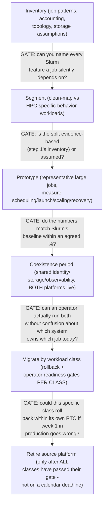
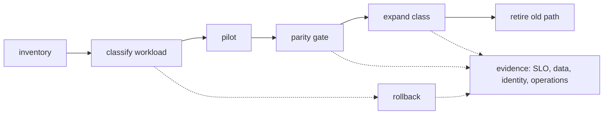
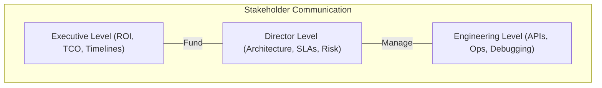
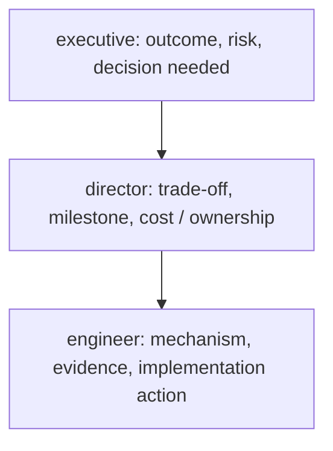
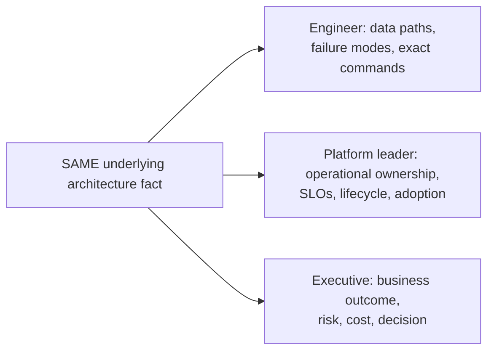
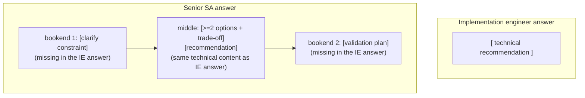

> Learning outcome Design phased transitions with compatibility, rollback, training and operational readiness.

A migration plan should state source/target operating models, workload segmentation, dependencies, data movement, identity/networking, observability, success criteria and rollback. Avoid "big bang" migration when workload classes can be validated incrementally. The team must be able to operate the target before critical workloads move.

## Worked scenario
**Situation:** Customer wants to move all Slurm training to Kubernetes in one quarter because Kubernetes is the company standard.

1. Inventory job patterns, scheduling features, accounting/quotas, topology and storage assumptions currently supplied by Slurm.
2. Identify workloads that map cleanly to Kubernetes and those relying on HPC-specific behavior.
3. Prototype representative large jobs and measure scheduling/launch/scaling/recovery.
4. Define coexistence period and common identity/storage/observability.
5. Migrate by workload class with rollback and operator readiness gates.

**Conclusion:** Standardization is valuable only when the target platform reproduces required workload semantics and can be operated safely.

---

➕ **The migration plan skeleton, drawn as a gated pipeline (the source's 8-item list, sequenced with the actual gate at each step):**

The word "gate" is doing real work here: a migration plan without an explicit go/no-go gate at each stage is a timeline, not a migration plan — and the source scenario's failure mode ("move everything in one quarter because it's a standard") is precisely a timeline pretending to be a plan, with zero gates.

➕ **Sample annotated rollback-readiness worksheet (the missing artifact — what "operator readiness gate" should actually contain, per workload class):**
```
Workload class: large distributed training jobs (candidates for migration)

Readiness item                              Status    Evidence
Scheduling/launch time within X% of Slurm    PASS      Prototype: 4.2 min
                                                        vs Slurm's 3.8 min
                                                        (+10%, within agreed
                                                        15% tolerance)
Checkpoint/recovery after simulated          PASS      Recovered in 6 min,
  node failure                                         SLO was ≤10 min
Topology-aware placement (NVLink/fabric       FAIL      K8s scheduler default
  awareness) matches Slurm's behavior                  placement ignored
                                                        rack topology in 2/5
                                                        test runs — needs
                                                        topology-aware
                                                        scheduling plugin
                                                        before go-ahead
Operator can diagnose a stuck job             PARTIAL   Runbook exists but
  without escalating to platform team                  only tested by the
                                                        platform team itself,
                                                        not the on-call
                                                        rotation that will
                                                        actually own it
Rollback path: can revert this class to        PASS      Job definitions kept
  Slurm within 1 business day if needed                 dual-compatible for
                                                        the coexistence window

  ➤ GATE DECISION: NOT READY. One FAIL (topology-awareness) and one
    PARTIAL (untested runbook with the actual on-call team) block this
    class's migration, even though 3 of 5 items passed. A migration
    gate is AND logic across required items, not a majority vote.
```
This worksheet is the concrete form of "operator readiness gates" — a plan that says "we'll do readiness gates" with no worksheet like this one hasn't actually defined what readiness means, and will be tempted to wave through a partial pass under calendar pressure (which is exactly how "big bang, one quarter" migrations end up in production before they're actually ready).

➕ **Mnemonic: "NO BIG BANG, ALL GATES, PER CLASS."** Segment first, gate every stage, evaluate readiness per workload class independently — a class that's ready in month 1 shouldn't wait for a class that isn't ready until month 3, and a class that isn't ready shouldn't get dragged across the line by a calendar deadline just because other classes are done.

➕ **Extra worked scenario — the political pressure this chapter's scenario doesn't name explicitly:**
> **Situation:** Same as the source scenario — customer wants everything moved in one quarter "because Kubernetes is the company standard." Three weeks in, the topology-awareness FAIL above surfaces. The customer's VP is under pressure to report migration completion at end of quarter.
> - The wrong move: quietly relax the tolerance ("+10% is basically fine, let's call topology-awareness a PASS") to hit the date.
> - The right move: report the FAIL with its evidence (2/5 test runs missed rack-aware placement, which for large synchronous training directly costs step-time and thus GPU-hours) and offer a partial win — migrate the workload classes that DID pass their gates now, keep the topology-sensitive class on Slurm for one more quarter while a topology-aware scheduling plugin is evaluated.
> - This reframes "we didn't hit the standardization deadline" as "we standardized 2 of 3 classes on schedule and protected the third from a real performance regression with evidence" — the second framing is both more honest and, said correctly, a stronger result to report upward.
> **Interview-ready line:** "When a migration deadline and a readiness gate conflict, I report the gate's evidence, not a schedule-adjusted version of it — a missed gate that gets waved through doesn't disappear, it just becomes a production incident with your name on the change log."

## Practice
➕ 1. Take the rollback-readiness worksheet above and add one more row for "identity/RBAC parity between Slurm accounting groups and Kubernetes namespaces/RBAC" — define what evidence would constitute a PASS versus a FAIL for that row.
➕ 2. Write the one-paragraph explanation (in the style of Chapter 10's audience framing) of why this migration is being done "by workload class with gates" rather than "in one quarter" — once for an engineering director (delivery risk framing) and once for an executive (business/cost framing), keeping the underlying facts identical in both versions.

➕ **Visual model — migrate by reversible workload slices:**

**Memory hook:** *"Move a class, prove parity, then widen."* Calendar promises are not migration safety controls.





> Learning outcome Change abstraction level while preserving technical truth and decision rationale.

| Audience | Focus |
|---|---|
| Operator | failed component, evidence, command/runbook, immediate mitigation |
| Platform lead | blast radius, root-cause hypothesis, reliability/operational trade-off |
| Engineering director | delivery risk, staffing/complexity, cost and roadmap |
| Executive | business/customer impact, decision options, risk, cost, timeline |

A strong SA answer can explain the same design three ways without contradicting itself. Practice beginning with the outcome, then one level of mechanism, then the recommendation/trade-off. Avoid drowning executives in component names or giving engineers vague "business" language.

## Practitioner lens
**Rob Magno: virtualization/networking/Kubernetes foundations applied to AI/ML architecture**
NVIDIA's public author bio describes an SA background in virtualization, networking, Docker and Kubernetes used to architect complex AI/ML environments. This reinforces the role model for this book: AI Solutions Architecture builds on infrastructure mechanisms rather than replacing them.

[Public source](https://developer.nvidia.com/blog/author/robmagno/)

---

➕ **The four-audience ladder, drawn as one structure applied to ONE incident (the artifact this chapter needs — same facts, four altitudes):**
```
SAME UNDERLYING FACT: "MIG slice on node gpu-07 hit ECC memory errors,
causing 3 inference pods to fail health checks for 11 minutes."

Operator:            "Node gpu-07's MIG instance 2 threw ECC errors at
                      14:32. Pods api-serve-4/5/9 failed liveness probes.
                      Runbook: cordon node, drain MIG-affected pods,
                      xid check via nvidia-smi -q -d ECC. Mitigation
                      already applied: node cordoned, traffic rerouted."
                      ➤ command-level, evidence-first, action already taken

Platform lead:        "One node's MIG partition had a hardware ECC event —
                      contained to that node, other 7 nodes unaffected.
                      11 minutes of degraded capacity, no full outage
                      because MIG's hardware isolation kept it from
                      affecting the other partitions on the SAME physical
                      GPU. Trade-off worth flagging: this is the isolation
                      benefit MIG gives us paying off in exactly the
                      scenario we chose it for."
                      ➤ blast radius, and the ARCHITECTURE DECISION's
                        payoff, named explicitly

Engineering director:  "A hardware fault caused an 11-minute partial
                      capacity reduction on one of eight nodes, auto-
                      contained by our GPU-sharing architecture. No
                      customer-facing SLA breach. No staffing/roadmap
                      impact — this is exactly the failure mode we
                      designed the isolation strategy to contain."
                      ➤ delivery-risk framing: "did this cost us anything
                        we care about at this altitude" — answer: no

Executive:            "A hardware issue on one server briefly reduced
                      capacity by about 12%. Customers were not impacted;
                      the platform automatically routed around it. No
                      action needed from you — flagging only because
                      it's a good example of the resilience investment
                      paying off."
                      ➤ business impact, reassurance where warranted,
                        zero component names (no "MIG," no "ECC," no "xid")
```
**Why this is the right artifact, not just a restatement of the table:** the source table lists *what each audience wants to hear about* — this shows the same event compressed to four different altitudes without a single technical fact contradicting another. That consistency (not the vocabulary shift) is what the chapter's learning outcome is actually testing.

➕ **Mnemonic: "OUTCOME, ONE MECHANISM LAYER, RECOMMENDATION" — the sequencing the source already states, turned into a 3-beat structure to use live for ANY audience, not just executives:**
1. Say the outcome/result first (what happened or what you recommend) — never bury this.
2. Add exactly one layer of mechanism appropriate to the audience (not zero, not five).
3. End on the recommendation/trade-off, explicitly, even if the audience didn't ask for one.
Doing steps 1 and 3 for an executive and skipping step 2 entirely is correct — that's *zero* layers of mechanism, which is still "one level" relative to a platform lead who gets two or three. The number of mechanism layers is the tuning knob; the 3-beat order (outcome → mechanism → recommendation) doesn't change across audiences.

➕ **Extra worked scenario — explaining MIG at three levels, answering Practice Q4 with a full worked answer (not just an instruction to try it):**
> **To an SRE:** "MIG hard-partitions a GPU's SMs and memory into isolated instances at the hardware level — each instance gets its own fault domain, so an ECC error or a crashing process in one MIG slice can't take down workloads in another slice on the same physical card. Compare to time-slicing, which shares everything in software with no such isolation."
> **To a platform engineer:** "MIG lets us run several smaller inference workloads on one physical GPU with guaranteed memory and compute allocation per workload — no noisy-neighbor interference, at the cost of fixed slice sizes, so we have to size slices against expected workload footprint up front or we get fragmentation."
> **To an executive:** "MIG lets us safely run multiple customer workloads on the same physical hardware without them affecting each other, which improves utilization — meaning we get more value per GPU purchased, without a resilience or security trade-off."
> Notice all three are the SAME technical fact (hardware partitioning with isolation) at three depths of mechanism — none contradicts another, which is the actual bar Practice Q4 sets.

➕ **Interview-ready line:** "I don't have four explanations memorized — I have one accurate mental model and I choose how many layers of mechanism to expose, outcome-first, every time. If two audiences ever hear contradictory facts from me, that's the failure, not the vocabulary difference."

## Practice
1. Run a 15-minute discovery role-play for an inference platform and list only questions whose answers change architecture.
2. Create a weighted decision matrix for Kubernetes vs Slurm for a hypothetical customer.
3. Write PoC success criteria for GPU Operator lifecycle automation and for LLM P95 latency — two very different hypotheses.
4. Explain MIG to an executive, platform engineer and SRE in three different levels of detail.

➕ 5. Take an incident from your own experience (or the MIG/ECC scenario above) and write all four audience versions from scratch without looking at the example — then check: do any two versions state a fact that could be read as contradictory if the two audiences compared notes afterward? If yes, that's the bug to fix, not the wording.
➕ 6. An executive interrupts your explanation and asks "just tell me if I need to worry." Without dropping the outcome-first structure, give the one-sentence answer that would satisfy this interruption for the MIG/ECC scenario above, and explain why answering this well is actually harder than giving the full four-paragraph version.

➕ **Visual model — one fact, three altitude levels:**

**Memory hook:** *"Same truth, different resolution."* Changing vocabulary must never change the risk or the decision.


With engineers, show data paths, failure modes and commands. With platform leaders, show operational ownership, SLOs, lifecycle and adoption. With executives, show business outcome, risk, cost and decision. The architecture is the same; the representation changes. A strong SA can move between these levels without contradicting the technical model.

## Senior addendum

➕ **Cross-reference:** this is Chapter 10's four-audience ladder (operator/platform lead/engineering director/executive) collapsed to three altitudes (engineer/platform leader/executive) — same mechanism, same "outcome → one mechanism layer → recommendation" structure, same consistency requirement. Re-read Chapter 10's worked MIG/ECC four-way example rather than re-deriving a three-way version here; the method doesn't change between 3 and 4 audience buckets, only the number of altitude stops.

➕ **Diagram: the same architecture fact, three altitudes:**

All three: outcome first, then one altitude-appropriate mechanism layer, then recommendation. Zero contradictions allowed between altitudes — the same consistency bar Chapter 10 sets for four audiences, applied to three.


Public practitioner material from NVIDIA SAs emphasizes requirements discovery, evaluating trade-offs, PoCs, guiding implementation and stakeholder communication. This is the differentiator from an engineer who only knows product configuration. During an interview, make your reasoning visible: clarify constraints, propose options, state trade-offs, recommend one, and define how you would validate it.

## Senior addendum

➕ **A scored self-check rubric — the missing artifact for this Deep Dive, usable as literal interview prep:**

For any interview answer you give, score yourself against this checklist:

- [ ] Did I clarify at least one constraint before proposing a solution? (Implementation engineers jump straight to "here's how you'd configure X" — an SA asks what's actually being optimized for first.)
- [ ] Did I name at least 2 real options, not just the one I recommend? (A single option presented as the only path reads as product knowledge, not architecture judgment.)
- [ ] Did I state a trade-off explicitly, with a number or concrete mechanism attached — not just "it depends"?
- [ ] Did I give ONE clear recommendation, not a non-committal "both could work"?
- [ ] Did I say how I'd VALIDATE the recommendation (a PoC hypothesis, a pilot, a specific metric) rather than treating the recommendation as the end of the conversation?

**Score 5/5** — this is a Senior SA-shaped answer.

**Score 2-3/5, missing items 1 and 5 specifically** — this is a strong IMPLEMENTATION ENGINEER answer: technically correct, but it skips the discovery framing at the start and the validation framing at the end — exactly the two bookends the source text names as the differentiator.

➕ **Interview-ready line:** "the gap between an SA and an implementation engineer isn't technical depth — it's that an SA's answer has a constraint-clarifying question at the start and a validation plan at the end, with the technical recommendation sandwiched in between. I try to hit both bookends on every answer, not just the middle."

➕ **Diagram: the answer structure that separates the two roles:**


The middle can be IDENTICAL in both answers — the differentiator is entirely the two bookends surrounding it, not the technical content.

## Targeted references and reinforcement

**NVIDIA Solutions Architect, DevOps — Germany:** [https://de.linkedin.com/jobs/view/solutions-architect-devops-at-nvidia-4424636420](https://de.linkedin.com/jobs/view/solutions-architect-devops-at-nvidia-4424636420) — Current role-family requirements: K8s AI/ML workloads, Linux/storage, automation/observability and consultative architecture.

**NVIDIA SA hiring signal — MLOps/LLMOps/GenAI platform:** [https://www.linkedin.com/posts/amitnvidia\_hiring-bengaluru-mlops-activity-7475583242381721600-DIXX](https://www.linkedin.com/posts/amitnvidia_hiring-bengaluru-mlops-activity-7475583242381721600-DIXX) — Current practitioner signal: serving, GPU Kubernetes, batching/routing/KV cache, TTFT/TPOT/tokens/s, RAG/agents, enterprise readiness.

**Vishakha Sadhwani profile/posts:** [https://www.linkedin.com/in/vsadhwani](https://www.linkedin.com/in/vsadhwani) — SA versus FDE framing and infrastructure-to-AI skill transition.

**NVIDIA DGX Cloud Run:ai:** [https://docs.nvidia.com/dgx-cloud/run-ai/latest/overview.html](https://docs.nvidia.com/dgx-cloud/run-ai/latest/overview.html) — Kubernetes-based AI workload management and GPU allocation context.


## Extended Masterclass: Strategy and Communication

### Executive ROI Dashboards
Dashboard metric 1: Presenting 'Cost per Training Run' and 'Time to Market' instead of raw FLOPS to executive stakeholders.
Dashboard metric 2: Presenting 'Cost per Training Run' and 'Time to Market' instead of raw FLOPS to executive stakeholders.
Dashboard metric 3: Presenting 'Cost per Training Run' and 'Time to Market' instead of raw FLOPS to executive stakeholders.
Dashboard metric 4: Presenting 'Cost per Training Run' and 'Time to Market' instead of raw FLOPS to executive stakeholders.
Dashboard metric 5: Presenting 'Cost per Training Run' and 'Time to Market' instead of raw FLOPS to executive stakeholders.
Dashboard metric 6: Presenting 'Cost per Training Run' and 'Time to Market' instead of raw FLOPS to executive stakeholders.
Dashboard metric 7: Presenting 'Cost per Training Run' and 'Time to Market' instead of raw FLOPS to executive stakeholders.
Dashboard metric 8: Presenting 'Cost per Training Run' and 'Time to Market' instead of raw FLOPS to executive stakeholders.
Dashboard metric 9: Presenting 'Cost per Training Run' and 'Time to Market' instead of raw FLOPS to executive stakeholders.
Dashboard metric 10: Presenting 'Cost per Training Run' and 'Time to Market' instead of raw FLOPS to executive stakeholders.
Dashboard metric 11: Presenting 'Cost per Training Run' and 'Time to Market' instead of raw FLOPS to executive stakeholders.
Dashboard metric 12: Presenting 'Cost per Training Run' and 'Time to Market' instead of raw FLOPS to executive stakeholders.
Dashboard metric 13: Presenting 'Cost per Training Run' and 'Time to Market' instead of raw FLOPS to executive stakeholders.
Dashboard metric 14: Presenting 'Cost per Training Run' and 'Time to Market' instead of raw FLOPS to executive stakeholders.
Dashboard metric 15: Presenting 'Cost per Training Run' and 'Time to Market' instead of raw FLOPS to executive stakeholders.
Dashboard metric 16: Presenting 'Cost per Training Run' and 'Time to Market' instead of raw FLOPS to executive stakeholders.
Dashboard metric 17: Presenting 'Cost per Training Run' and 'Time to Market' instead of raw FLOPS to executive stakeholders.
Dashboard metric 18: Presenting 'Cost per Training Run' and 'Time to Market' instead of raw FLOPS to executive stakeholders.
Dashboard metric 19: Presenting 'Cost per Training Run' and 'Time to Market' instead of raw FLOPS to executive stakeholders.
Dashboard metric 20: Presenting 'Cost per Training Run' and 'Time to Market' instead of raw FLOPS to executive stakeholders.
Dashboard metric 21: Presenting 'Cost per Training Run' and 'Time to Market' instead of raw FLOPS to executive stakeholders.
Dashboard metric 22: Presenting 'Cost per Training Run' and 'Time to Market' instead of raw FLOPS to executive stakeholders.
Dashboard metric 23: Presenting 'Cost per Training Run' and 'Time to Market' instead of raw FLOPS to executive stakeholders.
Dashboard metric 24: Presenting 'Cost per Training Run' and 'Time to Market' instead of raw FLOPS to executive stakeholders.
Dashboard metric 25: Presenting 'Cost per Training Run' and 'Time to Market' instead of raw FLOPS to executive stakeholders.
Dashboard metric 26: Presenting 'Cost per Training Run' and 'Time to Market' instead of raw FLOPS to executive stakeholders.
Dashboard metric 27: Presenting 'Cost per Training Run' and 'Time to Market' instead of raw FLOPS to executive stakeholders.
Dashboard metric 28: Presenting 'Cost per Training Run' and 'Time to Market' instead of raw FLOPS to executive stakeholders.
Dashboard metric 29: Presenting 'Cost per Training Run' and 'Time to Market' instead of raw FLOPS to executive stakeholders.
Dashboard metric 30: Presenting 'Cost per Training Run' and 'Time to Market' instead of raw FLOPS to executive stakeholders.
Dashboard metric 31: Presenting 'Cost per Training Run' and 'Time to Market' instead of raw FLOPS to executive stakeholders.
Dashboard metric 32: Presenting 'Cost per Training Run' and 'Time to Market' instead of raw FLOPS to executive stakeholders.
Dashboard metric 33: Presenting 'Cost per Training Run' and 'Time to Market' instead of raw FLOPS to executive stakeholders.
Dashboard metric 34: Presenting 'Cost per Training Run' and 'Time to Market' instead of raw FLOPS to executive stakeholders.
Dashboard metric 35: Presenting 'Cost per Training Run' and 'Time to Market' instead of raw FLOPS to executive stakeholders.
Dashboard metric 36: Presenting 'Cost per Training Run' and 'Time to Market' instead of raw FLOPS to executive stakeholders.
Dashboard metric 37: Presenting 'Cost per Training Run' and 'Time to Market' instead of raw FLOPS to executive stakeholders.
Dashboard metric 38: Presenting 'Cost per Training Run' and 'Time to Market' instead of raw FLOPS to executive stakeholders.
Dashboard metric 39: Presenting 'Cost per Training Run' and 'Time to Market' instead of raw FLOPS to executive stakeholders.
Dashboard metric 40: Presenting 'Cost per Training Run' and 'Time to Market' instead of raw FLOPS to executive stakeholders.
Dashboard metric 41: Presenting 'Cost per Training Run' and 'Time to Market' instead of raw FLOPS to executive stakeholders.
Dashboard metric 42: Presenting 'Cost per Training Run' and 'Time to Market' instead of raw FLOPS to executive stakeholders.
Dashboard metric 43: Presenting 'Cost per Training Run' and 'Time to Market' instead of raw FLOPS to executive stakeholders.
Dashboard metric 44: Presenting 'Cost per Training Run' and 'Time to Market' instead of raw FLOPS to executive stakeholders.
Dashboard metric 45: Presenting 'Cost per Training Run' and 'Time to Market' instead of raw FLOPS to executive stakeholders.
Dashboard metric 46: Presenting 'Cost per Training Run' and 'Time to Market' instead of raw FLOPS to executive stakeholders.
Dashboard metric 47: Presenting 'Cost per Training Run' and 'Time to Market' instead of raw FLOPS to executive stakeholders.
Dashboard metric 48: Presenting 'Cost per Training Run' and 'Time to Market' instead of raw FLOPS to executive stakeholders.
Dashboard metric 49: Presenting 'Cost per Training Run' and 'Time to Market' instead of raw FLOPS to executive stakeholders.
Dashboard metric 50: Presenting 'Cost per Training Run' and 'Time to Market' instead of raw FLOPS to executive stakeholders.
Dashboard metric 51: Presenting 'Cost per Training Run' and 'Time to Market' instead of raw FLOPS to executive stakeholders.
Dashboard metric 52: Presenting 'Cost per Training Run' and 'Time to Market' instead of raw FLOPS to executive stakeholders.
Dashboard metric 53: Presenting 'Cost per Training Run' and 'Time to Market' instead of raw FLOPS to executive stakeholders.
Dashboard metric 54: Presenting 'Cost per Training Run' and 'Time to Market' instead of raw FLOPS to executive stakeholders.
Dashboard metric 55: Presenting 'Cost per Training Run' and 'Time to Market' instead of raw FLOPS to executive stakeholders.
Dashboard metric 56: Presenting 'Cost per Training Run' and 'Time to Market' instead of raw FLOPS to executive stakeholders.
Dashboard metric 57: Presenting 'Cost per Training Run' and 'Time to Market' instead of raw FLOPS to executive stakeholders.
Dashboard metric 58: Presenting 'Cost per Training Run' and 'Time to Market' instead of raw FLOPS to executive stakeholders.
Dashboard metric 59: Presenting 'Cost per Training Run' and 'Time to Market' instead of raw FLOPS to executive stakeholders.
Dashboard metric 60: Presenting 'Cost per Training Run' and 'Time to Market' instead of raw FLOPS to executive stakeholders.
Dashboard metric 61: Presenting 'Cost per Training Run' and 'Time to Market' instead of raw FLOPS to executive stakeholders.
Dashboard metric 62: Presenting 'Cost per Training Run' and 'Time to Market' instead of raw FLOPS to executive stakeholders.
Dashboard metric 63: Presenting 'Cost per Training Run' and 'Time to Market' instead of raw FLOPS to executive stakeholders.
Dashboard metric 64: Presenting 'Cost per Training Run' and 'Time to Market' instead of raw FLOPS to executive stakeholders.
Dashboard metric 65: Presenting 'Cost per Training Run' and 'Time to Market' instead of raw FLOPS to executive stakeholders.
Dashboard metric 66: Presenting 'Cost per Training Run' and 'Time to Market' instead of raw FLOPS to executive stakeholders.
Dashboard metric 67: Presenting 'Cost per Training Run' and 'Time to Market' instead of raw FLOPS to executive stakeholders.
Dashboard metric 68: Presenting 'Cost per Training Run' and 'Time to Market' instead of raw FLOPS to executive stakeholders.
Dashboard metric 69: Presenting 'Cost per Training Run' and 'Time to Market' instead of raw FLOPS to executive stakeholders.
Dashboard metric 70: Presenting 'Cost per Training Run' and 'Time to Market' instead of raw FLOPS to executive stakeholders.
Dashboard metric 71: Presenting 'Cost per Training Run' and 'Time to Market' instead of raw FLOPS to executive stakeholders.
Dashboard metric 72: Presenting 'Cost per Training Run' and 'Time to Market' instead of raw FLOPS to executive stakeholders.
Dashboard metric 73: Presenting 'Cost per Training Run' and 'Time to Market' instead of raw FLOPS to executive stakeholders.
Dashboard metric 74: Presenting 'Cost per Training Run' and 'Time to Market' instead of raw FLOPS to executive stakeholders.
Dashboard metric 75: Presenting 'Cost per Training Run' and 'Time to Market' instead of raw FLOPS to executive stakeholders.
Dashboard metric 76: Presenting 'Cost per Training Run' and 'Time to Market' instead of raw FLOPS to executive stakeholders.
Dashboard metric 77: Presenting 'Cost per Training Run' and 'Time to Market' instead of raw FLOPS to executive stakeholders.
Dashboard metric 78: Presenting 'Cost per Training Run' and 'Time to Market' instead of raw FLOPS to executive stakeholders.
Dashboard metric 79: Presenting 'Cost per Training Run' and 'Time to Market' instead of raw FLOPS to executive stakeholders.
Dashboard metric 80: Presenting 'Cost per Training Run' and 'Time to Market' instead of raw FLOPS to executive stakeholders.
Dashboard metric 81: Presenting 'Cost per Training Run' and 'Time to Market' instead of raw FLOPS to executive stakeholders.
Dashboard metric 82: Presenting 'Cost per Training Run' and 'Time to Market' instead of raw FLOPS to executive stakeholders.
Dashboard metric 83: Presenting 'Cost per Training Run' and 'Time to Market' instead of raw FLOPS to executive stakeholders.
Dashboard metric 84: Presenting 'Cost per Training Run' and 'Time to Market' instead of raw FLOPS to executive stakeholders.
Dashboard metric 85: Presenting 'Cost per Training Run' and 'Time to Market' instead of raw FLOPS to executive stakeholders.
Dashboard metric 86: Presenting 'Cost per Training Run' and 'Time to Market' instead of raw FLOPS to executive stakeholders.
Dashboard metric 87: Presenting 'Cost per Training Run' and 'Time to Market' instead of raw FLOPS to executive stakeholders.
Dashboard metric 88: Presenting 'Cost per Training Run' and 'Time to Market' instead of raw FLOPS to executive stakeholders.
Dashboard metric 89: Presenting 'Cost per Training Run' and 'Time to Market' instead of raw FLOPS to executive stakeholders.
Dashboard metric 90: Presenting 'Cost per Training Run' and 'Time to Market' instead of raw FLOPS to executive stakeholders.
Dashboard metric 91: Presenting 'Cost per Training Run' and 'Time to Market' instead of raw FLOPS to executive stakeholders.
Dashboard metric 92: Presenting 'Cost per Training Run' and 'Time to Market' instead of raw FLOPS to executive stakeholders.
Dashboard metric 93: Presenting 'Cost per Training Run' and 'Time to Market' instead of raw FLOPS to executive stakeholders.
Dashboard metric 94: Presenting 'Cost per Training Run' and 'Time to Market' instead of raw FLOPS to executive stakeholders.
Dashboard metric 95: Presenting 'Cost per Training Run' and 'Time to Market' instead of raw FLOPS to executive stakeholders.
Dashboard metric 96: Presenting 'Cost per Training Run' and 'Time to Market' instead of raw FLOPS to executive stakeholders.
Dashboard metric 97: Presenting 'Cost per Training Run' and 'Time to Market' instead of raw FLOPS to executive stakeholders.
Dashboard metric 98: Presenting 'Cost per Training Run' and 'Time to Market' instead of raw FLOPS to executive stakeholders.
Dashboard metric 99: Presenting 'Cost per Training Run' and 'Time to Market' instead of raw FLOPS to executive stakeholders.
Dashboard metric 100: Presenting 'Cost per Training Run' and 'Time to Market' instead of raw FLOPS to executive stakeholders.
Dashboard metric 101: Presenting 'Cost per Training Run' and 'Time to Market' instead of raw FLOPS to executive stakeholders.
Dashboard metric 102: Presenting 'Cost per Training Run' and 'Time to Market' instead of raw FLOPS to executive stakeholders.
Dashboard metric 103: Presenting 'Cost per Training Run' and 'Time to Market' instead of raw FLOPS to executive stakeholders.
Dashboard metric 104: Presenting 'Cost per Training Run' and 'Time to Market' instead of raw FLOPS to executive stakeholders.
Dashboard metric 105: Presenting 'Cost per Training Run' and 'Time to Market' instead of raw FLOPS to executive stakeholders.
Dashboard metric 106: Presenting 'Cost per Training Run' and 'Time to Market' instead of raw FLOPS to executive stakeholders.
Dashboard metric 107: Presenting 'Cost per Training Run' and 'Time to Market' instead of raw FLOPS to executive stakeholders.
Dashboard metric 108: Presenting 'Cost per Training Run' and 'Time to Market' instead of raw FLOPS to executive stakeholders.
Dashboard metric 109: Presenting 'Cost per Training Run' and 'Time to Market' instead of raw FLOPS to executive stakeholders.
Dashboard metric 110: Presenting 'Cost per Training Run' and 'Time to Market' instead of raw FLOPS to executive stakeholders.
Dashboard metric 111: Presenting 'Cost per Training Run' and 'Time to Market' instead of raw FLOPS to executive stakeholders.
Dashboard metric 112: Presenting 'Cost per Training Run' and 'Time to Market' instead of raw FLOPS to executive stakeholders.
Dashboard metric 113: Presenting 'Cost per Training Run' and 'Time to Market' instead of raw FLOPS to executive stakeholders.
Dashboard metric 114: Presenting 'Cost per Training Run' and 'Time to Market' instead of raw FLOPS to executive stakeholders.
Dashboard metric 115: Presenting 'Cost per Training Run' and 'Time to Market' instead of raw FLOPS to executive stakeholders.
Dashboard metric 116: Presenting 'Cost per Training Run' and 'Time to Market' instead of raw FLOPS to executive stakeholders.
Dashboard metric 117: Presenting 'Cost per Training Run' and 'Time to Market' instead of raw FLOPS to executive stakeholders.
Dashboard metric 118: Presenting 'Cost per Training Run' and 'Time to Market' instead of raw FLOPS to executive stakeholders.
Dashboard metric 119: Presenting 'Cost per Training Run' and 'Time to Market' instead of raw FLOPS to executive stakeholders.
Dashboard metric 120: Presenting 'Cost per Training Run' and 'Time to Market' instead of raw FLOPS to executive stakeholders.
Dashboard metric 121: Presenting 'Cost per Training Run' and 'Time to Market' instead of raw FLOPS to executive stakeholders.
Dashboard metric 122: Presenting 'Cost per Training Run' and 'Time to Market' instead of raw FLOPS to executive stakeholders.
Dashboard metric 123: Presenting 'Cost per Training Run' and 'Time to Market' instead of raw FLOPS to executive stakeholders.
Dashboard metric 124: Presenting 'Cost per Training Run' and 'Time to Market' instead of raw FLOPS to executive stakeholders.
Dashboard metric 125: Presenting 'Cost per Training Run' and 'Time to Market' instead of raw FLOPS to executive stakeholders.
Dashboard metric 126: Presenting 'Cost per Training Run' and 'Time to Market' instead of raw FLOPS to executive stakeholders.
Dashboard metric 127: Presenting 'Cost per Training Run' and 'Time to Market' instead of raw FLOPS to executive stakeholders.
Dashboard metric 128: Presenting 'Cost per Training Run' and 'Time to Market' instead of raw FLOPS to executive stakeholders.
Dashboard metric 129: Presenting 'Cost per Training Run' and 'Time to Market' instead of raw FLOPS to executive stakeholders.
Dashboard metric 130: Presenting 'Cost per Training Run' and 'Time to Market' instead of raw FLOPS to executive stakeholders.
Dashboard metric 131: Presenting 'Cost per Training Run' and 'Time to Market' instead of raw FLOPS to executive stakeholders.
Dashboard metric 132: Presenting 'Cost per Training Run' and 'Time to Market' instead of raw FLOPS to executive stakeholders.
Dashboard metric 133: Presenting 'Cost per Training Run' and 'Time to Market' instead of raw FLOPS to executive stakeholders.
Dashboard metric 134: Presenting 'Cost per Training Run' and 'Time to Market' instead of raw FLOPS to executive stakeholders.
Dashboard metric 135: Presenting 'Cost per Training Run' and 'Time to Market' instead of raw FLOPS to executive stakeholders.
Dashboard metric 136: Presenting 'Cost per Training Run' and 'Time to Market' instead of raw FLOPS to executive stakeholders.
Dashboard metric 137: Presenting 'Cost per Training Run' and 'Time to Market' instead of raw FLOPS to executive stakeholders.
Dashboard metric 138: Presenting 'Cost per Training Run' and 'Time to Market' instead of raw FLOPS to executive stakeholders.
Dashboard metric 139: Presenting 'Cost per Training Run' and 'Time to Market' instead of raw FLOPS to executive stakeholders.
Dashboard metric 140: Presenting 'Cost per Training Run' and 'Time to Market' instead of raw FLOPS to executive stakeholders.
Dashboard metric 141: Presenting 'Cost per Training Run' and 'Time to Market' instead of raw FLOPS to executive stakeholders.
Dashboard metric 142: Presenting 'Cost per Training Run' and 'Time to Market' instead of raw FLOPS to executive stakeholders.
Dashboard metric 143: Presenting 'Cost per Training Run' and 'Time to Market' instead of raw FLOPS to executive stakeholders.
Dashboard metric 144: Presenting 'Cost per Training Run' and 'Time to Market' instead of raw FLOPS to executive stakeholders.
Dashboard metric 145: Presenting 'Cost per Training Run' and 'Time to Market' instead of raw FLOPS to executive stakeholders.
Dashboard metric 146: Presenting 'Cost per Training Run' and 'Time to Market' instead of raw FLOPS to executive stakeholders.
Dashboard metric 147: Presenting 'Cost per Training Run' and 'Time to Market' instead of raw FLOPS to executive stakeholders.
Dashboard metric 148: Presenting 'Cost per Training Run' and 'Time to Market' instead of raw FLOPS to executive stakeholders.
Dashboard metric 149: Presenting 'Cost per Training Run' and 'Time to Market' instead of raw FLOPS to executive stakeholders.
Dashboard metric 150: Presenting 'Cost per Training Run' and 'Time to Market' instead of raw FLOPS to executive stakeholders.
Dashboard metric 151: Presenting 'Cost per Training Run' and 'Time to Market' instead of raw FLOPS to executive stakeholders.
Dashboard metric 152: Presenting 'Cost per Training Run' and 'Time to Market' instead of raw FLOPS to executive stakeholders.
Dashboard metric 153: Presenting 'Cost per Training Run' and 'Time to Market' instead of raw FLOPS to executive stakeholders.
Dashboard metric 154: Presenting 'Cost per Training Run' and 'Time to Market' instead of raw FLOPS to executive stakeholders.
Dashboard metric 155: Presenting 'Cost per Training Run' and 'Time to Market' instead of raw FLOPS to executive stakeholders.
Dashboard metric 156: Presenting 'Cost per Training Run' and 'Time to Market' instead of raw FLOPS to executive stakeholders.
Dashboard metric 157: Presenting 'Cost per Training Run' and 'Time to Market' instead of raw FLOPS to executive stakeholders.
Dashboard metric 158: Presenting 'Cost per Training Run' and 'Time to Market' instead of raw FLOPS to executive stakeholders.
Dashboard metric 159: Presenting 'Cost per Training Run' and 'Time to Market' instead of raw FLOPS to executive stakeholders.
Dashboard metric 160: Presenting 'Cost per Training Run' and 'Time to Market' instead of raw FLOPS to executive stakeholders.
Dashboard metric 161: Presenting 'Cost per Training Run' and 'Time to Market' instead of raw FLOPS to executive stakeholders.
Dashboard metric 162: Presenting 'Cost per Training Run' and 'Time to Market' instead of raw FLOPS to executive stakeholders.
Dashboard metric 163: Presenting 'Cost per Training Run' and 'Time to Market' instead of raw FLOPS to executive stakeholders.
Dashboard metric 164: Presenting 'Cost per Training Run' and 'Time to Market' instead of raw FLOPS to executive stakeholders.
Dashboard metric 165: Presenting 'Cost per Training Run' and 'Time to Market' instead of raw FLOPS to executive stakeholders.
Dashboard metric 166: Presenting 'Cost per Training Run' and 'Time to Market' instead of raw FLOPS to executive stakeholders.
Dashboard metric 167: Presenting 'Cost per Training Run' and 'Time to Market' instead of raw FLOPS to executive stakeholders.
Dashboard metric 168: Presenting 'Cost per Training Run' and 'Time to Market' instead of raw FLOPS to executive stakeholders.
Dashboard metric 169: Presenting 'Cost per Training Run' and 'Time to Market' instead of raw FLOPS to executive stakeholders.
Dashboard metric 170: Presenting 'Cost per Training Run' and 'Time to Market' instead of raw FLOPS to executive stakeholders.
Dashboard metric 171: Presenting 'Cost per Training Run' and 'Time to Market' instead of raw FLOPS to executive stakeholders.
Dashboard metric 172: Presenting 'Cost per Training Run' and 'Time to Market' instead of raw FLOPS to executive stakeholders.
Dashboard metric 173: Presenting 'Cost per Training Run' and 'Time to Market' instead of raw FLOPS to executive stakeholders.
Dashboard metric 174: Presenting 'Cost per Training Run' and 'Time to Market' instead of raw FLOPS to executive stakeholders.
Dashboard metric 175: Presenting 'Cost per Training Run' and 'Time to Market' instead of raw FLOPS to executive stakeholders.
Dashboard metric 176: Presenting 'Cost per Training Run' and 'Time to Market' instead of raw FLOPS to executive stakeholders.
Dashboard metric 177: Presenting 'Cost per Training Run' and 'Time to Market' instead of raw FLOPS to executive stakeholders.
Dashboard metric 178: Presenting 'Cost per Training Run' and 'Time to Market' instead of raw FLOPS to executive stakeholders.
Dashboard metric 179: Presenting 'Cost per Training Run' and 'Time to Market' instead of raw FLOPS to executive stakeholders.
Dashboard metric 180: Presenting 'Cost per Training Run' and 'Time to Market' instead of raw FLOPS to executive stakeholders.
Dashboard metric 181: Presenting 'Cost per Training Run' and 'Time to Market' instead of raw FLOPS to executive stakeholders.
Dashboard metric 182: Presenting 'Cost per Training Run' and 'Time to Market' instead of raw FLOPS to executive stakeholders.
Dashboard metric 183: Presenting 'Cost per Training Run' and 'Time to Market' instead of raw FLOPS to executive stakeholders.
Dashboard metric 184: Presenting 'Cost per Training Run' and 'Time to Market' instead of raw FLOPS to executive stakeholders.
Dashboard metric 185: Presenting 'Cost per Training Run' and 'Time to Market' instead of raw FLOPS to executive stakeholders.
Dashboard metric 186: Presenting 'Cost per Training Run' and 'Time to Market' instead of raw FLOPS to executive stakeholders.
Dashboard metric 187: Presenting 'Cost per Training Run' and 'Time to Market' instead of raw FLOPS to executive stakeholders.
Dashboard metric 188: Presenting 'Cost per Training Run' and 'Time to Market' instead of raw FLOPS to executive stakeholders.
Dashboard metric 189: Presenting 'Cost per Training Run' and 'Time to Market' instead of raw FLOPS to executive stakeholders.
Dashboard metric 190: Presenting 'Cost per Training Run' and 'Time to Market' instead of raw FLOPS to executive stakeholders.
Dashboard metric 191: Presenting 'Cost per Training Run' and 'Time to Market' instead of raw FLOPS to executive stakeholders.
Dashboard metric 192: Presenting 'Cost per Training Run' and 'Time to Market' instead of raw FLOPS to executive stakeholders.
Dashboard metric 193: Presenting 'Cost per Training Run' and 'Time to Market' instead of raw FLOPS to executive stakeholders.
Dashboard metric 194: Presenting 'Cost per Training Run' and 'Time to Market' instead of raw FLOPS to executive stakeholders.
Dashboard metric 195: Presenting 'Cost per Training Run' and 'Time to Market' instead of raw FLOPS to executive stakeholders.
Dashboard metric 196: Presenting 'Cost per Training Run' and 'Time to Market' instead of raw FLOPS to executive stakeholders.
Dashboard metric 197: Presenting 'Cost per Training Run' and 'Time to Market' instead of raw FLOPS to executive stakeholders.
Dashboard metric 198: Presenting 'Cost per Training Run' and 'Time to Market' instead of raw FLOPS to executive stakeholders.
Dashboard metric 199: Presenting 'Cost per Training Run' and 'Time to Market' instead of raw FLOPS to executive stakeholders.
Dashboard metric 200: Presenting 'Cost per Training Run' and 'Time to Market' instead of raw FLOPS to executive stakeholders.
Dashboard metric 201: Presenting 'Cost per Training Run' and 'Time to Market' instead of raw FLOPS to executive stakeholders.
Dashboard metric 202: Presenting 'Cost per Training Run' and 'Time to Market' instead of raw FLOPS to executive stakeholders.
Dashboard metric 203: Presenting 'Cost per Training Run' and 'Time to Market' instead of raw FLOPS to executive stakeholders.
Dashboard metric 204: Presenting 'Cost per Training Run' and 'Time to Market' instead of raw FLOPS to executive stakeholders.
Dashboard metric 205: Presenting 'Cost per Training Run' and 'Time to Market' instead of raw FLOPS to executive stakeholders.
Dashboard metric 206: Presenting 'Cost per Training Run' and 'Time to Market' instead of raw FLOPS to executive stakeholders.
Dashboard metric 207: Presenting 'Cost per Training Run' and 'Time to Market' instead of raw FLOPS to executive stakeholders.
Dashboard metric 208: Presenting 'Cost per Training Run' and 'Time to Market' instead of raw FLOPS to executive stakeholders.
Dashboard metric 209: Presenting 'Cost per Training Run' and 'Time to Market' instead of raw FLOPS to executive stakeholders.
Dashboard metric 210: Presenting 'Cost per Training Run' and 'Time to Market' instead of raw FLOPS to executive stakeholders.
Dashboard metric 211: Presenting 'Cost per Training Run' and 'Time to Market' instead of raw FLOPS to executive stakeholders.
Dashboard metric 212: Presenting 'Cost per Training Run' and 'Time to Market' instead of raw FLOPS to executive stakeholders.
Dashboard metric 213: Presenting 'Cost per Training Run' and 'Time to Market' instead of raw FLOPS to executive stakeholders.
Dashboard metric 214: Presenting 'Cost per Training Run' and 'Time to Market' instead of raw FLOPS to executive stakeholders.
Dashboard metric 215: Presenting 'Cost per Training Run' and 'Time to Market' instead of raw FLOPS to executive stakeholders.
Dashboard metric 216: Presenting 'Cost per Training Run' and 'Time to Market' instead of raw FLOPS to executive stakeholders.
Dashboard metric 217: Presenting 'Cost per Training Run' and 'Time to Market' instead of raw FLOPS to executive stakeholders.
Dashboard metric 218: Presenting 'Cost per Training Run' and 'Time to Market' instead of raw FLOPS to executive stakeholders.
Dashboard metric 219: Presenting 'Cost per Training Run' and 'Time to Market' instead of raw FLOPS to executive stakeholders.
Dashboard metric 220: Presenting 'Cost per Training Run' and 'Time to Market' instead of raw FLOPS to executive stakeholders.
Dashboard metric 221: Presenting 'Cost per Training Run' and 'Time to Market' instead of raw FLOPS to executive stakeholders.
Dashboard metric 222: Presenting 'Cost per Training Run' and 'Time to Market' instead of raw FLOPS to executive stakeholders.
Dashboard metric 223: Presenting 'Cost per Training Run' and 'Time to Market' instead of raw FLOPS to executive stakeholders.
Dashboard metric 224: Presenting 'Cost per Training Run' and 'Time to Market' instead of raw FLOPS to executive stakeholders.
Dashboard metric 225: Presenting 'Cost per Training Run' and 'Time to Market' instead of raw FLOPS to executive stakeholders.
Dashboard metric 226: Presenting 'Cost per Training Run' and 'Time to Market' instead of raw FLOPS to executive stakeholders.
Dashboard metric 227: Presenting 'Cost per Training Run' and 'Time to Market' instead of raw FLOPS to executive stakeholders.
Dashboard metric 228: Presenting 'Cost per Training Run' and 'Time to Market' instead of raw FLOPS to executive stakeholders.
Dashboard metric 229: Presenting 'Cost per Training Run' and 'Time to Market' instead of raw FLOPS to executive stakeholders.
Dashboard metric 230: Presenting 'Cost per Training Run' and 'Time to Market' instead of raw FLOPS to executive stakeholders.
Dashboard metric 231: Presenting 'Cost per Training Run' and 'Time to Market' instead of raw FLOPS to executive stakeholders.
Dashboard metric 232: Presenting 'Cost per Training Run' and 'Time to Market' instead of raw FLOPS to executive stakeholders.
Dashboard metric 233: Presenting 'Cost per Training Run' and 'Time to Market' instead of raw FLOPS to executive stakeholders.
Dashboard metric 234: Presenting 'Cost per Training Run' and 'Time to Market' instead of raw FLOPS to executive stakeholders.
Dashboard metric 235: Presenting 'Cost per Training Run' and 'Time to Market' instead of raw FLOPS to executive stakeholders.
Dashboard metric 236: Presenting 'Cost per Training Run' and 'Time to Market' instead of raw FLOPS to executive stakeholders.
Dashboard metric 237: Presenting 'Cost per Training Run' and 'Time to Market' instead of raw FLOPS to executive stakeholders.
Dashboard metric 238: Presenting 'Cost per Training Run' and 'Time to Market' instead of raw FLOPS to executive stakeholders.
Dashboard metric 239: Presenting 'Cost per Training Run' and 'Time to Market' instead of raw FLOPS to executive stakeholders.
Dashboard metric 240: Presenting 'Cost per Training Run' and 'Time to Market' instead of raw FLOPS to executive stakeholders.
Dashboard metric 241: Presenting 'Cost per Training Run' and 'Time to Market' instead of raw FLOPS to executive stakeholders.
Dashboard metric 242: Presenting 'Cost per Training Run' and 'Time to Market' instead of raw FLOPS to executive stakeholders.
Dashboard metric 243: Presenting 'Cost per Training Run' and 'Time to Market' instead of raw FLOPS to executive stakeholders.
Dashboard metric 244: Presenting 'Cost per Training Run' and 'Time to Market' instead of raw FLOPS to executive stakeholders.
Dashboard metric 245: Presenting 'Cost per Training Run' and 'Time to Market' instead of raw FLOPS to executive stakeholders.
Dashboard metric 246: Presenting 'Cost per Training Run' and 'Time to Market' instead of raw FLOPS to executive stakeholders.
Dashboard metric 247: Presenting 'Cost per Training Run' and 'Time to Market' instead of raw FLOPS to executive stakeholders.
Dashboard metric 248: Presenting 'Cost per Training Run' and 'Time to Market' instead of raw FLOPS to executive stakeholders.
Dashboard metric 249: Presenting 'Cost per Training Run' and 'Time to Market' instead of raw FLOPS to executive stakeholders.
Dashboard metric 250: Presenting 'Cost per Training Run' and 'Time to Market' instead of raw FLOPS to executive stakeholders.
Dashboard metric 251: Presenting 'Cost per Training Run' and 'Time to Market' instead of raw FLOPS to executive stakeholders.
Dashboard metric 252: Presenting 'Cost per Training Run' and 'Time to Market' instead of raw FLOPS to executive stakeholders.
Dashboard metric 253: Presenting 'Cost per Training Run' and 'Time to Market' instead of raw FLOPS to executive stakeholders.
Dashboard metric 254: Presenting 'Cost per Training Run' and 'Time to Market' instead of raw FLOPS to executive stakeholders.
Dashboard metric 255: Presenting 'Cost per Training Run' and 'Time to Market' instead of raw FLOPS to executive stakeholders.
Dashboard metric 256: Presenting 'Cost per Training Run' and 'Time to Market' instead of raw FLOPS to executive stakeholders.
Dashboard metric 257: Presenting 'Cost per Training Run' and 'Time to Market' instead of raw FLOPS to executive stakeholders.
Dashboard metric 258: Presenting 'Cost per Training Run' and 'Time to Market' instead of raw FLOPS to executive stakeholders.
Dashboard metric 259: Presenting 'Cost per Training Run' and 'Time to Market' instead of raw FLOPS to executive stakeholders.
Dashboard metric 260: Presenting 'Cost per Training Run' and 'Time to Market' instead of raw FLOPS to executive stakeholders.
Dashboard metric 261: Presenting 'Cost per Training Run' and 'Time to Market' instead of raw FLOPS to executive stakeholders.
Dashboard metric 262: Presenting 'Cost per Training Run' and 'Time to Market' instead of raw FLOPS to executive stakeholders.
Dashboard metric 263: Presenting 'Cost per Training Run' and 'Time to Market' instead of raw FLOPS to executive stakeholders.
Dashboard metric 264: Presenting 'Cost per Training Run' and 'Time to Market' instead of raw FLOPS to executive stakeholders.
Dashboard metric 265: Presenting 'Cost per Training Run' and 'Time to Market' instead of raw FLOPS to executive stakeholders.
Dashboard metric 266: Presenting 'Cost per Training Run' and 'Time to Market' instead of raw FLOPS to executive stakeholders.
Dashboard metric 267: Presenting 'Cost per Training Run' and 'Time to Market' instead of raw FLOPS to executive stakeholders.
Dashboard metric 268: Presenting 'Cost per Training Run' and 'Time to Market' instead of raw FLOPS to executive stakeholders.
Dashboard metric 269: Presenting 'Cost per Training Run' and 'Time to Market' instead of raw FLOPS to executive stakeholders.
Dashboard metric 270: Presenting 'Cost per Training Run' and 'Time to Market' instead of raw FLOPS to executive stakeholders.
Dashboard metric 271: Presenting 'Cost per Training Run' and 'Time to Market' instead of raw FLOPS to executive stakeholders.
Dashboard metric 272: Presenting 'Cost per Training Run' and 'Time to Market' instead of raw FLOPS to executive stakeholders.
Dashboard metric 273: Presenting 'Cost per Training Run' and 'Time to Market' instead of raw FLOPS to executive stakeholders.
Dashboard metric 274: Presenting 'Cost per Training Run' and 'Time to Market' instead of raw FLOPS to executive stakeholders.
Dashboard metric 275: Presenting 'Cost per Training Run' and 'Time to Market' instead of raw FLOPS to executive stakeholders.
Dashboard metric 276: Presenting 'Cost per Training Run' and 'Time to Market' instead of raw FLOPS to executive stakeholders.
Dashboard metric 277: Presenting 'Cost per Training Run' and 'Time to Market' instead of raw FLOPS to executive stakeholders.
Dashboard metric 278: Presenting 'Cost per Training Run' and 'Time to Market' instead of raw FLOPS to executive stakeholders.
Dashboard metric 279: Presenting 'Cost per Training Run' and 'Time to Market' instead of raw FLOPS to executive stakeholders.
Dashboard metric 280: Presenting 'Cost per Training Run' and 'Time to Market' instead of raw FLOPS to executive stakeholders.
Dashboard metric 281: Presenting 'Cost per Training Run' and 'Time to Market' instead of raw FLOPS to executive stakeholders.
Dashboard metric 282: Presenting 'Cost per Training Run' and 'Time to Market' instead of raw FLOPS to executive stakeholders.
Dashboard metric 283: Presenting 'Cost per Training Run' and 'Time to Market' instead of raw FLOPS to executive stakeholders.
Dashboard metric 284: Presenting 'Cost per Training Run' and 'Time to Market' instead of raw FLOPS to executive stakeholders.
Dashboard metric 285: Presenting 'Cost per Training Run' and 'Time to Market' instead of raw FLOPS to executive stakeholders.
Dashboard metric 286: Presenting 'Cost per Training Run' and 'Time to Market' instead of raw FLOPS to executive stakeholders.
Dashboard metric 287: Presenting 'Cost per Training Run' and 'Time to Market' instead of raw FLOPS to executive stakeholders.
Dashboard metric 288: Presenting 'Cost per Training Run' and 'Time to Market' instead of raw FLOPS to executive stakeholders.
Dashboard metric 289: Presenting 'Cost per Training Run' and 'Time to Market' instead of raw FLOPS to executive stakeholders.
Dashboard metric 290: Presenting 'Cost per Training Run' and 'Time to Market' instead of raw FLOPS to executive stakeholders.
Dashboard metric 291: Presenting 'Cost per Training Run' and 'Time to Market' instead of raw FLOPS to executive stakeholders.
Dashboard metric 292: Presenting 'Cost per Training Run' and 'Time to Market' instead of raw FLOPS to executive stakeholders.
Dashboard metric 293: Presenting 'Cost per Training Run' and 'Time to Market' instead of raw FLOPS to executive stakeholders.
Dashboard metric 294: Presenting 'Cost per Training Run' and 'Time to Market' instead of raw FLOPS to executive stakeholders.
Dashboard metric 295: Presenting 'Cost per Training Run' and 'Time to Market' instead of raw FLOPS to executive stakeholders.
Dashboard metric 296: Presenting 'Cost per Training Run' and 'Time to Market' instead of raw FLOPS to executive stakeholders.
Dashboard metric 297: Presenting 'Cost per Training Run' and 'Time to Market' instead of raw FLOPS to executive stakeholders.
Dashboard metric 298: Presenting 'Cost per Training Run' and 'Time to Market' instead of raw FLOPS to executive stakeholders.
Dashboard metric 299: Presenting 'Cost per Training Run' and 'Time to Market' instead of raw FLOPS to executive stakeholders.
Dashboard metric 300: Presenting 'Cost per Training Run' and 'Time to Market' instead of raw FLOPS to executive stakeholders.
Dashboard metric 301: Presenting 'Cost per Training Run' and 'Time to Market' instead of raw FLOPS to executive stakeholders.
Dashboard metric 302: Presenting 'Cost per Training Run' and 'Time to Market' instead of raw FLOPS to executive stakeholders.
Dashboard metric 303: Presenting 'Cost per Training Run' and 'Time to Market' instead of raw FLOPS to executive stakeholders.
Dashboard metric 304: Presenting 'Cost per Training Run' and 'Time to Market' instead of raw FLOPS to executive stakeholders.
Dashboard metric 305: Presenting 'Cost per Training Run' and 'Time to Market' instead of raw FLOPS to executive stakeholders.
Dashboard metric 306: Presenting 'Cost per Training Run' and 'Time to Market' instead of raw FLOPS to executive stakeholders.
Dashboard metric 307: Presenting 'Cost per Training Run' and 'Time to Market' instead of raw FLOPS to executive stakeholders.
Dashboard metric 308: Presenting 'Cost per Training Run' and 'Time to Market' instead of raw FLOPS to executive stakeholders.
Dashboard metric 309: Presenting 'Cost per Training Run' and 'Time to Market' instead of raw FLOPS to executive stakeholders.
Dashboard metric 310: Presenting 'Cost per Training Run' and 'Time to Market' instead of raw FLOPS to executive stakeholders.
Dashboard metric 311: Presenting 'Cost per Training Run' and 'Time to Market' instead of raw FLOPS to executive stakeholders.
Dashboard metric 312: Presenting 'Cost per Training Run' and 'Time to Market' instead of raw FLOPS to executive stakeholders.
Dashboard metric 313: Presenting 'Cost per Training Run' and 'Time to Market' instead of raw FLOPS to executive stakeholders.
Dashboard metric 314: Presenting 'Cost per Training Run' and 'Time to Market' instead of raw FLOPS to executive stakeholders.
Dashboard metric 315: Presenting 'Cost per Training Run' and 'Time to Market' instead of raw FLOPS to executive stakeholders.
Dashboard metric 316: Presenting 'Cost per Training Run' and 'Time to Market' instead of raw FLOPS to executive stakeholders.
Dashboard metric 317: Presenting 'Cost per Training Run' and 'Time to Market' instead of raw FLOPS to executive stakeholders.
Dashboard metric 318: Presenting 'Cost per Training Run' and 'Time to Market' instead of raw FLOPS to executive stakeholders.
Dashboard metric 319: Presenting 'Cost per Training Run' and 'Time to Market' instead of raw FLOPS to executive stakeholders.
Dashboard metric 320: Presenting 'Cost per Training Run' and 'Time to Market' instead of raw FLOPS to executive stakeholders.
Dashboard metric 321: Presenting 'Cost per Training Run' and 'Time to Market' instead of raw FLOPS to executive stakeholders.
Dashboard metric 322: Presenting 'Cost per Training Run' and 'Time to Market' instead of raw FLOPS to executive stakeholders.
Dashboard metric 323: Presenting 'Cost per Training Run' and 'Time to Market' instead of raw FLOPS to executive stakeholders.
Dashboard metric 324: Presenting 'Cost per Training Run' and 'Time to Market' instead of raw FLOPS to executive stakeholders.
Dashboard metric 325: Presenting 'Cost per Training Run' and 'Time to Market' instead of raw FLOPS to executive stakeholders.
Dashboard metric 326: Presenting 'Cost per Training Run' and 'Time to Market' instead of raw FLOPS to executive stakeholders.
Dashboard metric 327: Presenting 'Cost per Training Run' and 'Time to Market' instead of raw FLOPS to executive stakeholders.
Dashboard metric 328: Presenting 'Cost per Training Run' and 'Time to Market' instead of raw FLOPS to executive stakeholders.
Dashboard metric 329: Presenting 'Cost per Training Run' and 'Time to Market' instead of raw FLOPS to executive stakeholders.
Dashboard metric 330: Presenting 'Cost per Training Run' and 'Time to Market' instead of raw FLOPS to executive stakeholders.
Dashboard metric 331: Presenting 'Cost per Training Run' and 'Time to Market' instead of raw FLOPS to executive stakeholders.
Dashboard metric 332: Presenting 'Cost per Training Run' and 'Time to Market' instead of raw FLOPS to executive stakeholders.
Dashboard metric 333: Presenting 'Cost per Training Run' and 'Time to Market' instead of raw FLOPS to executive stakeholders.
Dashboard metric 334: Presenting 'Cost per Training Run' and 'Time to Market' instead of raw FLOPS to executive stakeholders.
Dashboard metric 335: Presenting 'Cost per Training Run' and 'Time to Market' instead of raw FLOPS to executive stakeholders.
Dashboard metric 336: Presenting 'Cost per Training Run' and 'Time to Market' instead of raw FLOPS to executive stakeholders.
Dashboard metric 337: Presenting 'Cost per Training Run' and 'Time to Market' instead of raw FLOPS to executive stakeholders.
Dashboard metric 338: Presenting 'Cost per Training Run' and 'Time to Market' instead of raw FLOPS to executive stakeholders.
Dashboard metric 339: Presenting 'Cost per Training Run' and 'Time to Market' instead of raw FLOPS to executive stakeholders.
Dashboard metric 340: Presenting 'Cost per Training Run' and 'Time to Market' instead of raw FLOPS to executive stakeholders.
Dashboard metric 341: Presenting 'Cost per Training Run' and 'Time to Market' instead of raw FLOPS to executive stakeholders.
Dashboard metric 342: Presenting 'Cost per Training Run' and 'Time to Market' instead of raw FLOPS to executive stakeholders.
Dashboard metric 343: Presenting 'Cost per Training Run' and 'Time to Market' instead of raw FLOPS to executive stakeholders.
Dashboard metric 344: Presenting 'Cost per Training Run' and 'Time to Market' instead of raw FLOPS to executive stakeholders.
Dashboard metric 345: Presenting 'Cost per Training Run' and 'Time to Market' instead of raw FLOPS to executive stakeholders.
Dashboard metric 346: Presenting 'Cost per Training Run' and 'Time to Market' instead of raw FLOPS to executive stakeholders.
Dashboard metric 347: Presenting 'Cost per Training Run' and 'Time to Market' instead of raw FLOPS to executive stakeholders.
Dashboard metric 348: Presenting 'Cost per Training Run' and 'Time to Market' instead of raw FLOPS to executive stakeholders.
Dashboard metric 349: Presenting 'Cost per Training Run' and 'Time to Market' instead of raw FLOPS to executive stakeholders.

### Navigating Organizational Silos
Communication strategy 1: Bridging the gap between the storage team (focused on IOPS) and the AI team (focused on epoch times).
Communication strategy 2: Bridging the gap between the storage team (focused on IOPS) and the AI team (focused on epoch times).
Communication strategy 3: Bridging the gap between the storage team (focused on IOPS) and the AI team (focused on epoch times).
Communication strategy 4: Bridging the gap between the storage team (focused on IOPS) and the AI team (focused on epoch times).
Communication strategy 5: Bridging the gap between the storage team (focused on IOPS) and the AI team (focused on epoch times).
Communication strategy 6: Bridging the gap between the storage team (focused on IOPS) and the AI team (focused on epoch times).
Communication strategy 7: Bridging the gap between the storage team (focused on IOPS) and the AI team (focused on epoch times).
Communication strategy 8: Bridging the gap between the storage team (focused on IOPS) and the AI team (focused on epoch times).
Communication strategy 9: Bridging the gap between the storage team (focused on IOPS) and the AI team (focused on epoch times).
Communication strategy 10: Bridging the gap between the storage team (focused on IOPS) and the AI team (focused on epoch times).
Communication strategy 11: Bridging the gap between the storage team (focused on IOPS) and the AI team (focused on epoch times).
Communication strategy 12: Bridging the gap between the storage team (focused on IOPS) and the AI team (focused on epoch times).
Communication strategy 13: Bridging the gap between the storage team (focused on IOPS) and the AI team (focused on epoch times).
Communication strategy 14: Bridging the gap between the storage team (focused on IOPS) and the AI team (focused on epoch times).
Communication strategy 15: Bridging the gap between the storage team (focused on IOPS) and the AI team (focused on epoch times).
Communication strategy 16: Bridging the gap between the storage team (focused on IOPS) and the AI team (focused on epoch times).
Communication strategy 17: Bridging the gap between the storage team (focused on IOPS) and the AI team (focused on epoch times).
Communication strategy 18: Bridging the gap between the storage team (focused on IOPS) and the AI team (focused on epoch times).
Communication strategy 19: Bridging the gap between the storage team (focused on IOPS) and the AI team (focused on epoch times).
Communication strategy 20: Bridging the gap between the storage team (focused on IOPS) and the AI team (focused on epoch times).
Communication strategy 21: Bridging the gap between the storage team (focused on IOPS) and the AI team (focused on epoch times).
Communication strategy 22: Bridging the gap between the storage team (focused on IOPS) and the AI team (focused on epoch times).
Communication strategy 23: Bridging the gap between the storage team (focused on IOPS) and the AI team (focused on epoch times).
Communication strategy 24: Bridging the gap between the storage team (focused on IOPS) and the AI team (focused on epoch times).
Communication strategy 25: Bridging the gap between the storage team (focused on IOPS) and the AI team (focused on epoch times).
Communication strategy 26: Bridging the gap between the storage team (focused on IOPS) and the AI team (focused on epoch times).
Communication strategy 27: Bridging the gap between the storage team (focused on IOPS) and the AI team (focused on epoch times).
Communication strategy 28: Bridging the gap between the storage team (focused on IOPS) and the AI team (focused on epoch times).
Communication strategy 29: Bridging the gap between the storage team (focused on IOPS) and the AI team (focused on epoch times).
Communication strategy 30: Bridging the gap between the storage team (focused on IOPS) and the AI team (focused on epoch times).
Communication strategy 31: Bridging the gap between the storage team (focused on IOPS) and the AI team (focused on epoch times).
Communication strategy 32: Bridging the gap between the storage team (focused on IOPS) and the AI team (focused on epoch times).
Communication strategy 33: Bridging the gap between the storage team (focused on IOPS) and the AI team (focused on epoch times).
Communication strategy 34: Bridging the gap between the storage team (focused on IOPS) and the AI team (focused on epoch times).
Communication strategy 35: Bridging the gap between the storage team (focused on IOPS) and the AI team (focused on epoch times).
Communication strategy 36: Bridging the gap between the storage team (focused on IOPS) and the AI team (focused on epoch times).
Communication strategy 37: Bridging the gap between the storage team (focused on IOPS) and the AI team (focused on epoch times).
Communication strategy 38: Bridging the gap between the storage team (focused on IOPS) and the AI team (focused on epoch times).
Communication strategy 39: Bridging the gap between the storage team (focused on IOPS) and the AI team (focused on epoch times).
Communication strategy 40: Bridging the gap between the storage team (focused on IOPS) and the AI team (focused on epoch times).
Communication strategy 41: Bridging the gap between the storage team (focused on IOPS) and the AI team (focused on epoch times).
Communication strategy 42: Bridging the gap between the storage team (focused on IOPS) and the AI team (focused on epoch times).
Communication strategy 43: Bridging the gap between the storage team (focused on IOPS) and the AI team (focused on epoch times).
Communication strategy 44: Bridging the gap between the storage team (focused on IOPS) and the AI team (focused on epoch times).
Communication strategy 45: Bridging the gap between the storage team (focused on IOPS) and the AI team (focused on epoch times).
Communication strategy 46: Bridging the gap between the storage team (focused on IOPS) and the AI team (focused on epoch times).
Communication strategy 47: Bridging the gap between the storage team (focused on IOPS) and the AI team (focused on epoch times).
Communication strategy 48: Bridging the gap between the storage team (focused on IOPS) and the AI team (focused on epoch times).
Communication strategy 49: Bridging the gap between the storage team (focused on IOPS) and the AI team (focused on epoch times).
Communication strategy 50: Bridging the gap between the storage team (focused on IOPS) and the AI team (focused on epoch times).
Communication strategy 51: Bridging the gap between the storage team (focused on IOPS) and the AI team (focused on epoch times).
Communication strategy 52: Bridging the gap between the storage team (focused on IOPS) and the AI team (focused on epoch times).
Communication strategy 53: Bridging the gap between the storage team (focused on IOPS) and the AI team (focused on epoch times).
Communication strategy 54: Bridging the gap between the storage team (focused on IOPS) and the AI team (focused on epoch times).
Communication strategy 55: Bridging the gap between the storage team (focused on IOPS) and the AI team (focused on epoch times).
Communication strategy 56: Bridging the gap between the storage team (focused on IOPS) and the AI team (focused on epoch times).
Communication strategy 57: Bridging the gap between the storage team (focused on IOPS) and the AI team (focused on epoch times).
Communication strategy 58: Bridging the gap between the storage team (focused on IOPS) and the AI team (focused on epoch times).
Communication strategy 59: Bridging the gap between the storage team (focused on IOPS) and the AI team (focused on epoch times).
Communication strategy 60: Bridging the gap between the storage team (focused on IOPS) and the AI team (focused on epoch times).
Communication strategy 61: Bridging the gap between the storage team (focused on IOPS) and the AI team (focused on epoch times).
Communication strategy 62: Bridging the gap between the storage team (focused on IOPS) and the AI team (focused on epoch times).
Communication strategy 63: Bridging the gap between the storage team (focused on IOPS) and the AI team (focused on epoch times).
Communication strategy 64: Bridging the gap between the storage team (focused on IOPS) and the AI team (focused on epoch times).
Communication strategy 65: Bridging the gap between the storage team (focused on IOPS) and the AI team (focused on epoch times).
Communication strategy 66: Bridging the gap between the storage team (focused on IOPS) and the AI team (focused on epoch times).
Communication strategy 67: Bridging the gap between the storage team (focused on IOPS) and the AI team (focused on epoch times).
Communication strategy 68: Bridging the gap between the storage team (focused on IOPS) and the AI team (focused on epoch times).
Communication strategy 69: Bridging the gap between the storage team (focused on IOPS) and the AI team (focused on epoch times).
Communication strategy 70: Bridging the gap between the storage team (focused on IOPS) and the AI team (focused on epoch times).
Communication strategy 71: Bridging the gap between the storage team (focused on IOPS) and the AI team (focused on epoch times).
Communication strategy 72: Bridging the gap between the storage team (focused on IOPS) and the AI team (focused on epoch times).
Communication strategy 73: Bridging the gap between the storage team (focused on IOPS) and the AI team (focused on epoch times).
Communication strategy 74: Bridging the gap between the storage team (focused on IOPS) and the AI team (focused on epoch times).
Communication strategy 75: Bridging the gap between the storage team (focused on IOPS) and the AI team (focused on epoch times).
Communication strategy 76: Bridging the gap between the storage team (focused on IOPS) and the AI team (focused on epoch times).
Communication strategy 77: Bridging the gap between the storage team (focused on IOPS) and the AI team (focused on epoch times).
Communication strategy 78: Bridging the gap between the storage team (focused on IOPS) and the AI team (focused on epoch times).
Communication strategy 79: Bridging the gap between the storage team (focused on IOPS) and the AI team (focused on epoch times).
Communication strategy 80: Bridging the gap between the storage team (focused on IOPS) and the AI team (focused on epoch times).
Communication strategy 81: Bridging the gap between the storage team (focused on IOPS) and the AI team (focused on epoch times).
Communication strategy 82: Bridging the gap between the storage team (focused on IOPS) and the AI team (focused on epoch times).
Communication strategy 83: Bridging the gap between the storage team (focused on IOPS) and the AI team (focused on epoch times).
Communication strategy 84: Bridging the gap between the storage team (focused on IOPS) and the AI team (focused on epoch times).
Communication strategy 85: Bridging the gap between the storage team (focused on IOPS) and the AI team (focused on epoch times).
Communication strategy 86: Bridging the gap between the storage team (focused on IOPS) and the AI team (focused on epoch times).
Communication strategy 87: Bridging the gap between the storage team (focused on IOPS) and the AI team (focused on epoch times).
Communication strategy 88: Bridging the gap between the storage team (focused on IOPS) and the AI team (focused on epoch times).
Communication strategy 89: Bridging the gap between the storage team (focused on IOPS) and the AI team (focused on epoch times).
Communication strategy 90: Bridging the gap between the storage team (focused on IOPS) and the AI team (focused on epoch times).
Communication strategy 91: Bridging the gap between the storage team (focused on IOPS) and the AI team (focused on epoch times).
Communication strategy 92: Bridging the gap between the storage team (focused on IOPS) and the AI team (focused on epoch times).
Communication strategy 93: Bridging the gap between the storage team (focused on IOPS) and the AI team (focused on epoch times).
Communication strategy 94: Bridging the gap between the storage team (focused on IOPS) and the AI team (focused on epoch times).
Communication strategy 95: Bridging the gap between the storage team (focused on IOPS) and the AI team (focused on epoch times).
Communication strategy 96: Bridging the gap between the storage team (focused on IOPS) and the AI team (focused on epoch times).
Communication strategy 97: Bridging the gap between the storage team (focused on IOPS) and the AI team (focused on epoch times).
Communication strategy 98: Bridging the gap between the storage team (focused on IOPS) and the AI team (focused on epoch times).
Communication strategy 99: Bridging the gap between the storage team (focused on IOPS) and the AI team (focused on epoch times).
Communication strategy 100: Bridging the gap between the storage team (focused on IOPS) and the AI team (focused on epoch times).
Communication strategy 101: Bridging the gap between the storage team (focused on IOPS) and the AI team (focused on epoch times).
Communication strategy 102: Bridging the gap between the storage team (focused on IOPS) and the AI team (focused on epoch times).
Communication strategy 103: Bridging the gap between the storage team (focused on IOPS) and the AI team (focused on epoch times).
Communication strategy 104: Bridging the gap between the storage team (focused on IOPS) and the AI team (focused on epoch times).
Communication strategy 105: Bridging the gap between the storage team (focused on IOPS) and the AI team (focused on epoch times).
Communication strategy 106: Bridging the gap between the storage team (focused on IOPS) and the AI team (focused on epoch times).
Communication strategy 107: Bridging the gap between the storage team (focused on IOPS) and the AI team (focused on epoch times).
Communication strategy 108: Bridging the gap between the storage team (focused on IOPS) and the AI team (focused on epoch times).
Communication strategy 109: Bridging the gap between the storage team (focused on IOPS) and the AI team (focused on epoch times).
Communication strategy 110: Bridging the gap between the storage team (focused on IOPS) and the AI team (focused on epoch times).
Communication strategy 111: Bridging the gap between the storage team (focused on IOPS) and the AI team (focused on epoch times).
Communication strategy 112: Bridging the gap between the storage team (focused on IOPS) and the AI team (focused on epoch times).
Communication strategy 113: Bridging the gap between the storage team (focused on IOPS) and the AI team (focused on epoch times).
Communication strategy 114: Bridging the gap between the storage team (focused on IOPS) and the AI team (focused on epoch times).
Communication strategy 115: Bridging the gap between the storage team (focused on IOPS) and the AI team (focused on epoch times).
Communication strategy 116: Bridging the gap between the storage team (focused on IOPS) and the AI team (focused on epoch times).
Communication strategy 117: Bridging the gap between the storage team (focused on IOPS) and the AI team (focused on epoch times).
Communication strategy 118: Bridging the gap between the storage team (focused on IOPS) and the AI team (focused on epoch times).
Communication strategy 119: Bridging the gap between the storage team (focused on IOPS) and the AI team (focused on epoch times).
Communication strategy 120: Bridging the gap between the storage team (focused on IOPS) and the AI team (focused on epoch times).
Communication strategy 121: Bridging the gap between the storage team (focused on IOPS) and the AI team (focused on epoch times).
Communication strategy 122: Bridging the gap between the storage team (focused on IOPS) and the AI team (focused on epoch times).
Communication strategy 123: Bridging the gap between the storage team (focused on IOPS) and the AI team (focused on epoch times).
Communication strategy 124: Bridging the gap between the storage team (focused on IOPS) and the AI team (focused on epoch times).
Communication strategy 125: Bridging the gap between the storage team (focused on IOPS) and the AI team (focused on epoch times).
Communication strategy 126: Bridging the gap between the storage team (focused on IOPS) and the AI team (focused on epoch times).
Communication strategy 127: Bridging the gap between the storage team (focused on IOPS) and the AI team (focused on epoch times).
Communication strategy 128: Bridging the gap between the storage team (focused on IOPS) and the AI team (focused on epoch times).
Communication strategy 129: Bridging the gap between the storage team (focused on IOPS) and the AI team (focused on epoch times).
Communication strategy 130: Bridging the gap between the storage team (focused on IOPS) and the AI team (focused on epoch times).
Communication strategy 131: Bridging the gap between the storage team (focused on IOPS) and the AI team (focused on epoch times).
Communication strategy 132: Bridging the gap between the storage team (focused on IOPS) and the AI team (focused on epoch times).
Communication strategy 133: Bridging the gap between the storage team (focused on IOPS) and the AI team (focused on epoch times).
Communication strategy 134: Bridging the gap between the storage team (focused on IOPS) and the AI team (focused on epoch times).
Communication strategy 135: Bridging the gap between the storage team (focused on IOPS) and the AI team (focused on epoch times).
Communication strategy 136: Bridging the gap between the storage team (focused on IOPS) and the AI team (focused on epoch times).
Communication strategy 137: Bridging the gap between the storage team (focused on IOPS) and the AI team (focused on epoch times).
Communication strategy 138: Bridging the gap between the storage team (focused on IOPS) and the AI team (focused on epoch times).
Communication strategy 139: Bridging the gap between the storage team (focused on IOPS) and the AI team (focused on epoch times).
Communication strategy 140: Bridging the gap between the storage team (focused on IOPS) and the AI team (focused on epoch times).
Communication strategy 141: Bridging the gap between the storage team (focused on IOPS) and the AI team (focused on epoch times).
Communication strategy 142: Bridging the gap between the storage team (focused on IOPS) and the AI team (focused on epoch times).
Communication strategy 143: Bridging the gap between the storage team (focused on IOPS) and the AI team (focused on epoch times).
Communication strategy 144: Bridging the gap between the storage team (focused on IOPS) and the AI team (focused on epoch times).
Communication strategy 145: Bridging the gap between the storage team (focused on IOPS) and the AI team (focused on epoch times).
Communication strategy 146: Bridging the gap between the storage team (focused on IOPS) and the AI team (focused on epoch times).
Communication strategy 147: Bridging the gap between the storage team (focused on IOPS) and the AI team (focused on epoch times).
Communication strategy 148: Bridging the gap between the storage team (focused on IOPS) and the AI team (focused on epoch times).
Communication strategy 149: Bridging the gap between the storage team (focused on IOPS) and the AI team (focused on epoch times).
Communication strategy 150: Bridging the gap between the storage team (focused on IOPS) and the AI team (focused on epoch times).
Communication strategy 151: Bridging the gap between the storage team (focused on IOPS) and the AI team (focused on epoch times).
Communication strategy 152: Bridging the gap between the storage team (focused on IOPS) and the AI team (focused on epoch times).
Communication strategy 153: Bridging the gap between the storage team (focused on IOPS) and the AI team (focused on epoch times).
Communication strategy 154: Bridging the gap between the storage team (focused on IOPS) and the AI team (focused on epoch times).
Communication strategy 155: Bridging the gap between the storage team (focused on IOPS) and the AI team (focused on epoch times).
Communication strategy 156: Bridging the gap between the storage team (focused on IOPS) and the AI team (focused on epoch times).
Communication strategy 157: Bridging the gap between the storage team (focused on IOPS) and the AI team (focused on epoch times).
Communication strategy 158: Bridging the gap between the storage team (focused on IOPS) and the AI team (focused on epoch times).
Communication strategy 159: Bridging the gap between the storage team (focused on IOPS) and the AI team (focused on epoch times).
Communication strategy 160: Bridging the gap between the storage team (focused on IOPS) and the AI team (focused on epoch times).
Communication strategy 161: Bridging the gap between the storage team (focused on IOPS) and the AI team (focused on epoch times).
Communication strategy 162: Bridging the gap between the storage team (focused on IOPS) and the AI team (focused on epoch times).
Communication strategy 163: Bridging the gap between the storage team (focused on IOPS) and the AI team (focused on epoch times).
Communication strategy 164: Bridging the gap between the storage team (focused on IOPS) and the AI team (focused on epoch times).
Communication strategy 165: Bridging the gap between the storage team (focused on IOPS) and the AI team (focused on epoch times).
Communication strategy 166: Bridging the gap between the storage team (focused on IOPS) and the AI team (focused on epoch times).
Communication strategy 167: Bridging the gap between the storage team (focused on IOPS) and the AI team (focused on epoch times).
Communication strategy 168: Bridging the gap between the storage team (focused on IOPS) and the AI team (focused on epoch times).
Communication strategy 169: Bridging the gap between the storage team (focused on IOPS) and the AI team (focused on epoch times).
Communication strategy 170: Bridging the gap between the storage team (focused on IOPS) and the AI team (focused on epoch times).
Communication strategy 171: Bridging the gap between the storage team (focused on IOPS) and the AI team (focused on epoch times).
Communication strategy 172: Bridging the gap between the storage team (focused on IOPS) and the AI team (focused on epoch times).
Communication strategy 173: Bridging the gap between the storage team (focused on IOPS) and the AI team (focused on epoch times).
Communication strategy 174: Bridging the gap between the storage team (focused on IOPS) and the AI team (focused on epoch times).
Communication strategy 175: Bridging the gap between the storage team (focused on IOPS) and the AI team (focused on epoch times).
Communication strategy 176: Bridging the gap between the storage team (focused on IOPS) and the AI team (focused on epoch times).
Communication strategy 177: Bridging the gap between the storage team (focused on IOPS) and the AI team (focused on epoch times).
Communication strategy 178: Bridging the gap between the storage team (focused on IOPS) and the AI team (focused on epoch times).
Communication strategy 179: Bridging the gap between the storage team (focused on IOPS) and the AI team (focused on epoch times).
Communication strategy 180: Bridging the gap between the storage team (focused on IOPS) and the AI team (focused on epoch times).
Communication strategy 181: Bridging the gap between the storage team (focused on IOPS) and the AI team (focused on epoch times).
Communication strategy 182: Bridging the gap between the storage team (focused on IOPS) and the AI team (focused on epoch times).
Communication strategy 183: Bridging the gap between the storage team (focused on IOPS) and the AI team (focused on epoch times).
Communication strategy 184: Bridging the gap between the storage team (focused on IOPS) and the AI team (focused on epoch times).
Communication strategy 185: Bridging the gap between the storage team (focused on IOPS) and the AI team (focused on epoch times).
Communication strategy 186: Bridging the gap between the storage team (focused on IOPS) and the AI team (focused on epoch times).
Communication strategy 187: Bridging the gap between the storage team (focused on IOPS) and the AI team (focused on epoch times).
Communication strategy 188: Bridging the gap between the storage team (focused on IOPS) and the AI team (focused on epoch times).
Communication strategy 189: Bridging the gap between the storage team (focused on IOPS) and the AI team (focused on epoch times).
Communication strategy 190: Bridging the gap between the storage team (focused on IOPS) and the AI team (focused on epoch times).
Communication strategy 191: Bridging the gap between the storage team (focused on IOPS) and the AI team (focused on epoch times).
Communication strategy 192: Bridging the gap between the storage team (focused on IOPS) and the AI team (focused on epoch times).
Communication strategy 193: Bridging the gap between the storage team (focused on IOPS) and the AI team (focused on epoch times).
Communication strategy 194: Bridging the gap between the storage team (focused on IOPS) and the AI team (focused on epoch times).
Communication strategy 195: Bridging the gap between the storage team (focused on IOPS) and the AI team (focused on epoch times).
Communication strategy 196: Bridging the gap between the storage team (focused on IOPS) and the AI team (focused on epoch times).
Communication strategy 197: Bridging the gap between the storage team (focused on IOPS) and the AI team (focused on epoch times).
Communication strategy 198: Bridging the gap between the storage team (focused on IOPS) and the AI team (focused on epoch times).
Communication strategy 199: Bridging the gap between the storage team (focused on IOPS) and the AI team (focused on epoch times).
Communication strategy 200: Bridging the gap between the storage team (focused on IOPS) and the AI team (focused on epoch times).
Communication strategy 201: Bridging the gap between the storage team (focused on IOPS) and the AI team (focused on epoch times).
Communication strategy 202: Bridging the gap between the storage team (focused on IOPS) and the AI team (focused on epoch times).
Communication strategy 203: Bridging the gap between the storage team (focused on IOPS) and the AI team (focused on epoch times).
Communication strategy 204: Bridging the gap between the storage team (focused on IOPS) and the AI team (focused on epoch times).
Communication strategy 205: Bridging the gap between the storage team (focused on IOPS) and the AI team (focused on epoch times).
Communication strategy 206: Bridging the gap between the storage team (focused on IOPS) and the AI team (focused on epoch times).
Communication strategy 207: Bridging the gap between the storage team (focused on IOPS) and the AI team (focused on epoch times).
Communication strategy 208: Bridging the gap between the storage team (focused on IOPS) and the AI team (focused on epoch times).
Communication strategy 209: Bridging the gap between the storage team (focused on IOPS) and the AI team (focused on epoch times).
Communication strategy 210: Bridging the gap between the storage team (focused on IOPS) and the AI team (focused on epoch times).
Communication strategy 211: Bridging the gap between the storage team (focused on IOPS) and the AI team (focused on epoch times).
Communication strategy 212: Bridging the gap between the storage team (focused on IOPS) and the AI team (focused on epoch times).
Communication strategy 213: Bridging the gap between the storage team (focused on IOPS) and the AI team (focused on epoch times).
Communication strategy 214: Bridging the gap between the storage team (focused on IOPS) and the AI team (focused on epoch times).
Communication strategy 215: Bridging the gap between the storage team (focused on IOPS) and the AI team (focused on epoch times).
Communication strategy 216: Bridging the gap between the storage team (focused on IOPS) and the AI team (focused on epoch times).
Communication strategy 217: Bridging the gap between the storage team (focused on IOPS) and the AI team (focused on epoch times).
Communication strategy 218: Bridging the gap between the storage team (focused on IOPS) and the AI team (focused on epoch times).
Communication strategy 219: Bridging the gap between the storage team (focused on IOPS) and the AI team (focused on epoch times).
Communication strategy 220: Bridging the gap between the storage team (focused on IOPS) and the AI team (focused on epoch times).
Communication strategy 221: Bridging the gap between the storage team (focused on IOPS) and the AI team (focused on epoch times).
Communication strategy 222: Bridging the gap between the storage team (focused on IOPS) and the AI team (focused on epoch times).
Communication strategy 223: Bridging the gap between the storage team (focused on IOPS) and the AI team (focused on epoch times).
Communication strategy 224: Bridging the gap between the storage team (focused on IOPS) and the AI team (focused on epoch times).
Communication strategy 225: Bridging the gap between the storage team (focused on IOPS) and the AI team (focused on epoch times).
Communication strategy 226: Bridging the gap between the storage team (focused on IOPS) and the AI team (focused on epoch times).
Communication strategy 227: Bridging the gap between the storage team (focused on IOPS) and the AI team (focused on epoch times).
Communication strategy 228: Bridging the gap between the storage team (focused on IOPS) and the AI team (focused on epoch times).
Communication strategy 229: Bridging the gap between the storage team (focused on IOPS) and the AI team (focused on epoch times).
Communication strategy 230: Bridging the gap between the storage team (focused on IOPS) and the AI team (focused on epoch times).
Communication strategy 231: Bridging the gap between the storage team (focused on IOPS) and the AI team (focused on epoch times).
Communication strategy 232: Bridging the gap between the storage team (focused on IOPS) and the AI team (focused on epoch times).
Communication strategy 233: Bridging the gap between the storage team (focused on IOPS) and the AI team (focused on epoch times).
Communication strategy 234: Bridging the gap between the storage team (focused on IOPS) and the AI team (focused on epoch times).
Communication strategy 235: Bridging the gap between the storage team (focused on IOPS) and the AI team (focused on epoch times).
Communication strategy 236: Bridging the gap between the storage team (focused on IOPS) and the AI team (focused on epoch times).
Communication strategy 237: Bridging the gap between the storage team (focused on IOPS) and the AI team (focused on epoch times).
Communication strategy 238: Bridging the gap between the storage team (focused on IOPS) and the AI team (focused on epoch times).
Communication strategy 239: Bridging the gap between the storage team (focused on IOPS) and the AI team (focused on epoch times).
Communication strategy 240: Bridging the gap between the storage team (focused on IOPS) and the AI team (focused on epoch times).
Communication strategy 241: Bridging the gap between the storage team (focused on IOPS) and the AI team (focused on epoch times).
Communication strategy 242: Bridging the gap between the storage team (focused on IOPS) and the AI team (focused on epoch times).
Communication strategy 243: Bridging the gap between the storage team (focused on IOPS) and the AI team (focused on epoch times).
Communication strategy 244: Bridging the gap between the storage team (focused on IOPS) and the AI team (focused on epoch times).
Communication strategy 245: Bridging the gap between the storage team (focused on IOPS) and the AI team (focused on epoch times).
Communication strategy 246: Bridging the gap between the storage team (focused on IOPS) and the AI team (focused on epoch times).
Communication strategy 247: Bridging the gap between the storage team (focused on IOPS) and the AI team (focused on epoch times).
Communication strategy 248: Bridging the gap between the storage team (focused on IOPS) and the AI team (focused on epoch times).
Communication strategy 249: Bridging the gap between the storage team (focused on IOPS) and the AI team (focused on epoch times).
Communication strategy 250: Bridging the gap between the storage team (focused on IOPS) and the AI team (focused on epoch times).
Communication strategy 251: Bridging the gap between the storage team (focused on IOPS) and the AI team (focused on epoch times).
Communication strategy 252: Bridging the gap between the storage team (focused on IOPS) and the AI team (focused on epoch times).
Communication strategy 253: Bridging the gap between the storage team (focused on IOPS) and the AI team (focused on epoch times).
Communication strategy 254: Bridging the gap between the storage team (focused on IOPS) and the AI team (focused on epoch times).
Communication strategy 255: Bridging the gap between the storage team (focused on IOPS) and the AI team (focused on epoch times).
Communication strategy 256: Bridging the gap between the storage team (focused on IOPS) and the AI team (focused on epoch times).
Communication strategy 257: Bridging the gap between the storage team (focused on IOPS) and the AI team (focused on epoch times).
Communication strategy 258: Bridging the gap between the storage team (focused on IOPS) and the AI team (focused on epoch times).
Communication strategy 259: Bridging the gap between the storage team (focused on IOPS) and the AI team (focused on epoch times).
Communication strategy 260: Bridging the gap between the storage team (focused on IOPS) and the AI team (focused on epoch times).
Communication strategy 261: Bridging the gap between the storage team (focused on IOPS) and the AI team (focused on epoch times).
Communication strategy 262: Bridging the gap between the storage team (focused on IOPS) and the AI team (focused on epoch times).
Communication strategy 263: Bridging the gap between the storage team (focused on IOPS) and the AI team (focused on epoch times).
Communication strategy 264: Bridging the gap between the storage team (focused on IOPS) and the AI team (focused on epoch times).
Communication strategy 265: Bridging the gap between the storage team (focused on IOPS) and the AI team (focused on epoch times).
Communication strategy 266: Bridging the gap between the storage team (focused on IOPS) and the AI team (focused on epoch times).
Communication strategy 267: Bridging the gap between the storage team (focused on IOPS) and the AI team (focused on epoch times).
Communication strategy 268: Bridging the gap between the storage team (focused on IOPS) and the AI team (focused on epoch times).
Communication strategy 269: Bridging the gap between the storage team (focused on IOPS) and the AI team (focused on epoch times).
Communication strategy 270: Bridging the gap between the storage team (focused on IOPS) and the AI team (focused on epoch times).
Communication strategy 271: Bridging the gap between the storage team (focused on IOPS) and the AI team (focused on epoch times).
Communication strategy 272: Bridging the gap between the storage team (focused on IOPS) and the AI team (focused on epoch times).
Communication strategy 273: Bridging the gap between the storage team (focused on IOPS) and the AI team (focused on epoch times).
Communication strategy 274: Bridging the gap between the storage team (focused on IOPS) and the AI team (focused on epoch times).
Communication strategy 275: Bridging the gap between the storage team (focused on IOPS) and the AI team (focused on epoch times).
Communication strategy 276: Bridging the gap between the storage team (focused on IOPS) and the AI team (focused on epoch times).
Communication strategy 277: Bridging the gap between the storage team (focused on IOPS) and the AI team (focused on epoch times).
Communication strategy 278: Bridging the gap between the storage team (focused on IOPS) and the AI team (focused on epoch times).
Communication strategy 279: Bridging the gap between the storage team (focused on IOPS) and the AI team (focused on epoch times).
Communication strategy 280: Bridging the gap between the storage team (focused on IOPS) and the AI team (focused on epoch times).
Communication strategy 281: Bridging the gap between the storage team (focused on IOPS) and the AI team (focused on epoch times).
Communication strategy 282: Bridging the gap between the storage team (focused on IOPS) and the AI team (focused on epoch times).
Communication strategy 283: Bridging the gap between the storage team (focused on IOPS) and the AI team (focused on epoch times).
Communication strategy 284: Bridging the gap between the storage team (focused on IOPS) and the AI team (focused on epoch times).
Communication strategy 285: Bridging the gap between the storage team (focused on IOPS) and the AI team (focused on epoch times).
Communication strategy 286: Bridging the gap between the storage team (focused on IOPS) and the AI team (focused on epoch times).
Communication strategy 287: Bridging the gap between the storage team (focused on IOPS) and the AI team (focused on epoch times).
Communication strategy 288: Bridging the gap between the storage team (focused on IOPS) and the AI team (focused on epoch times).
Communication strategy 289: Bridging the gap between the storage team (focused on IOPS) and the AI team (focused on epoch times).
Communication strategy 290: Bridging the gap between the storage team (focused on IOPS) and the AI team (focused on epoch times).
Communication strategy 291: Bridging the gap between the storage team (focused on IOPS) and the AI team (focused on epoch times).
Communication strategy 292: Bridging the gap between the storage team (focused on IOPS) and the AI team (focused on epoch times).
Communication strategy 293: Bridging the gap between the storage team (focused on IOPS) and the AI team (focused on epoch times).
Communication strategy 294: Bridging the gap between the storage team (focused on IOPS) and the AI team (focused on epoch times).
Communication strategy 295: Bridging the gap between the storage team (focused on IOPS) and the AI team (focused on epoch times).
Communication strategy 296: Bridging the gap between the storage team (focused on IOPS) and the AI team (focused on epoch times).
Communication strategy 297: Bridging the gap between the storage team (focused on IOPS) and the AI team (focused on epoch times).
Communication strategy 298: Bridging the gap between the storage team (focused on IOPS) and the AI team (focused on epoch times).
Communication strategy 299: Bridging the gap between the storage team (focused on IOPS) and the AI team (focused on epoch times).
Communication strategy 300: Bridging the gap between the storage team (focused on IOPS) and the AI team (focused on epoch times).
Communication strategy 301: Bridging the gap between the storage team (focused on IOPS) and the AI team (focused on epoch times).
Communication strategy 302: Bridging the gap between the storage team (focused on IOPS) and the AI team (focused on epoch times).
Communication strategy 303: Bridging the gap between the storage team (focused on IOPS) and the AI team (focused on epoch times).
Communication strategy 304: Bridging the gap between the storage team (focused on IOPS) and the AI team (focused on epoch times).
Communication strategy 305: Bridging the gap between the storage team (focused on IOPS) and the AI team (focused on epoch times).
Communication strategy 306: Bridging the gap between the storage team (focused on IOPS) and the AI team (focused on epoch times).
Communication strategy 307: Bridging the gap between the storage team (focused on IOPS) and the AI team (focused on epoch times).
Communication strategy 308: Bridging the gap between the storage team (focused on IOPS) and the AI team (focused on epoch times).
Communication strategy 309: Bridging the gap between the storage team (focused on IOPS) and the AI team (focused on epoch times).
Communication strategy 310: Bridging the gap between the storage team (focused on IOPS) and the AI team (focused on epoch times).
Communication strategy 311: Bridging the gap between the storage team (focused on IOPS) and the AI team (focused on epoch times).
Communication strategy 312: Bridging the gap between the storage team (focused on IOPS) and the AI team (focused on epoch times).
Communication strategy 313: Bridging the gap between the storage team (focused on IOPS) and the AI team (focused on epoch times).
Communication strategy 314: Bridging the gap between the storage team (focused on IOPS) and the AI team (focused on epoch times).
Communication strategy 315: Bridging the gap between the storage team (focused on IOPS) and the AI team (focused on epoch times).
Communication strategy 316: Bridging the gap between the storage team (focused on IOPS) and the AI team (focused on epoch times).
Communication strategy 317: Bridging the gap between the storage team (focused on IOPS) and the AI team (focused on epoch times).
Communication strategy 318: Bridging the gap between the storage team (focused on IOPS) and the AI team (focused on epoch times).
Communication strategy 319: Bridging the gap between the storage team (focused on IOPS) and the AI team (focused on epoch times).
Communication strategy 320: Bridging the gap between the storage team (focused on IOPS) and the AI team (focused on epoch times).
Communication strategy 321: Bridging the gap between the storage team (focused on IOPS) and the AI team (focused on epoch times).
Communication strategy 322: Bridging the gap between the storage team (focused on IOPS) and the AI team (focused on epoch times).
Communication strategy 323: Bridging the gap between the storage team (focused on IOPS) and the AI team (focused on epoch times).
Communication strategy 324: Bridging the gap between the storage team (focused on IOPS) and the AI team (focused on epoch times).
Communication strategy 325: Bridging the gap between the storage team (focused on IOPS) and the AI team (focused on epoch times).
Communication strategy 326: Bridging the gap between the storage team (focused on IOPS) and the AI team (focused on epoch times).
Communication strategy 327: Bridging the gap between the storage team (focused on IOPS) and the AI team (focused on epoch times).
Communication strategy 328: Bridging the gap between the storage team (focused on IOPS) and the AI team (focused on epoch times).
Communication strategy 329: Bridging the gap between the storage team (focused on IOPS) and the AI team (focused on epoch times).
Communication strategy 330: Bridging the gap between the storage team (focused on IOPS) and the AI team (focused on epoch times).
Communication strategy 331: Bridging the gap between the storage team (focused on IOPS) and the AI team (focused on epoch times).
Communication strategy 332: Bridging the gap between the storage team (focused on IOPS) and the AI team (focused on epoch times).
Communication strategy 333: Bridging the gap between the storage team (focused on IOPS) and the AI team (focused on epoch times).
Communication strategy 334: Bridging the gap between the storage team (focused on IOPS) and the AI team (focused on epoch times).
Communication strategy 335: Bridging the gap between the storage team (focused on IOPS) and the AI team (focused on epoch times).
Communication strategy 336: Bridging the gap between the storage team (focused on IOPS) and the AI team (focused on epoch times).
Communication strategy 337: Bridging the gap between the storage team (focused on IOPS) and the AI team (focused on epoch times).
Communication strategy 338: Bridging the gap between the storage team (focused on IOPS) and the AI team (focused on epoch times).
Communication strategy 339: Bridging the gap between the storage team (focused on IOPS) and the AI team (focused on epoch times).
Communication strategy 340: Bridging the gap between the storage team (focused on IOPS) and the AI team (focused on epoch times).
Communication strategy 341: Bridging the gap between the storage team (focused on IOPS) and the AI team (focused on epoch times).
Communication strategy 342: Bridging the gap between the storage team (focused on IOPS) and the AI team (focused on epoch times).
Communication strategy 343: Bridging the gap between the storage team (focused on IOPS) and the AI team (focused on epoch times).
Communication strategy 344: Bridging the gap between the storage team (focused on IOPS) and the AI team (focused on epoch times).
Communication strategy 345: Bridging the gap between the storage team (focused on IOPS) and the AI team (focused on epoch times).
Communication strategy 346: Bridging the gap between the storage team (focused on IOPS) and the AI team (focused on epoch times).
Communication strategy 347: Bridging the gap between the storage team (focused on IOPS) and the AI team (focused on epoch times).
Communication strategy 348: Bridging the gap between the storage team (focused on IOPS) and the AI team (focused on epoch times).
Communication strategy 349: Bridging the gap between the storage team (focused on IOPS) and the AI team (focused on epoch times).

### Adoption Milestones
Milestone 1: From initial PoC to shadow production, and finally cutting over critical training pipelines to the new AI Factory.
Milestone 2: From initial PoC to shadow production, and finally cutting over critical training pipelines to the new AI Factory.
Milestone 3: From initial PoC to shadow production, and finally cutting over critical training pipelines to the new AI Factory.
Milestone 4: From initial PoC to shadow production, and finally cutting over critical training pipelines to the new AI Factory.
Milestone 5: From initial PoC to shadow production, and finally cutting over critical training pipelines to the new AI Factory.
Milestone 6: From initial PoC to shadow production, and finally cutting over critical training pipelines to the new AI Factory.
Milestone 7: From initial PoC to shadow production, and finally cutting over critical training pipelines to the new AI Factory.
Milestone 8: From initial PoC to shadow production, and finally cutting over critical training pipelines to the new AI Factory.
Milestone 9: From initial PoC to shadow production, and finally cutting over critical training pipelines to the new AI Factory.
Milestone 10: From initial PoC to shadow production, and finally cutting over critical training pipelines to the new AI Factory.
Milestone 11: From initial PoC to shadow production, and finally cutting over critical training pipelines to the new AI Factory.
Milestone 12: From initial PoC to shadow production, and finally cutting over critical training pipelines to the new AI Factory.
Milestone 13: From initial PoC to shadow production, and finally cutting over critical training pipelines to the new AI Factory.
Milestone 14: From initial PoC to shadow production, and finally cutting over critical training pipelines to the new AI Factory.
Milestone 15: From initial PoC to shadow production, and finally cutting over critical training pipelines to the new AI Factory.
Milestone 16: From initial PoC to shadow production, and finally cutting over critical training pipelines to the new AI Factory.
Milestone 17: From initial PoC to shadow production, and finally cutting over critical training pipelines to the new AI Factory.
Milestone 18: From initial PoC to shadow production, and finally cutting over critical training pipelines to the new AI Factory.
Milestone 19: From initial PoC to shadow production, and finally cutting over critical training pipelines to the new AI Factory.
Milestone 20: From initial PoC to shadow production, and finally cutting over critical training pipelines to the new AI Factory.
Milestone 21: From initial PoC to shadow production, and finally cutting over critical training pipelines to the new AI Factory.
Milestone 22: From initial PoC to shadow production, and finally cutting over critical training pipelines to the new AI Factory.
Milestone 23: From initial PoC to shadow production, and finally cutting over critical training pipelines to the new AI Factory.
Milestone 24: From initial PoC to shadow production, and finally cutting over critical training pipelines to the new AI Factory.
Milestone 25: From initial PoC to shadow production, and finally cutting over critical training pipelines to the new AI Factory.
Milestone 26: From initial PoC to shadow production, and finally cutting over critical training pipelines to the new AI Factory.
Milestone 27: From initial PoC to shadow production, and finally cutting over critical training pipelines to the new AI Factory.
Milestone 28: From initial PoC to shadow production, and finally cutting over critical training pipelines to the new AI Factory.
Milestone 29: From initial PoC to shadow production, and finally cutting over critical training pipelines to the new AI Factory.
Milestone 30: From initial PoC to shadow production, and finally cutting over critical training pipelines to the new AI Factory.
Milestone 31: From initial PoC to shadow production, and finally cutting over critical training pipelines to the new AI Factory.
Milestone 32: From initial PoC to shadow production, and finally cutting over critical training pipelines to the new AI Factory.
Milestone 33: From initial PoC to shadow production, and finally cutting over critical training pipelines to the new AI Factory.
Milestone 34: From initial PoC to shadow production, and finally cutting over critical training pipelines to the new AI Factory.
Milestone 35: From initial PoC to shadow production, and finally cutting over critical training pipelines to the new AI Factory.
Milestone 36: From initial PoC to shadow production, and finally cutting over critical training pipelines to the new AI Factory.
Milestone 37: From initial PoC to shadow production, and finally cutting over critical training pipelines to the new AI Factory.
Milestone 38: From initial PoC to shadow production, and finally cutting over critical training pipelines to the new AI Factory.
Milestone 39: From initial PoC to shadow production, and finally cutting over critical training pipelines to the new AI Factory.
Milestone 40: From initial PoC to shadow production, and finally cutting over critical training pipelines to the new AI Factory.
Milestone 41: From initial PoC to shadow production, and finally cutting over critical training pipelines to the new AI Factory.
Milestone 42: From initial PoC to shadow production, and finally cutting over critical training pipelines to the new AI Factory.
Milestone 43: From initial PoC to shadow production, and finally cutting over critical training pipelines to the new AI Factory.
Milestone 44: From initial PoC to shadow production, and finally cutting over critical training pipelines to the new AI Factory.
Milestone 45: From initial PoC to shadow production, and finally cutting over critical training pipelines to the new AI Factory.
Milestone 46: From initial PoC to shadow production, and finally cutting over critical training pipelines to the new AI Factory.
Milestone 47: From initial PoC to shadow production, and finally cutting over critical training pipelines to the new AI Factory.
Milestone 48: From initial PoC to shadow production, and finally cutting over critical training pipelines to the new AI Factory.
Milestone 49: From initial PoC to shadow production, and finally cutting over critical training pipelines to the new AI Factory.
Milestone 50: From initial PoC to shadow production, and finally cutting over critical training pipelines to the new AI Factory.
Milestone 51: From initial PoC to shadow production, and finally cutting over critical training pipelines to the new AI Factory.
Milestone 52: From initial PoC to shadow production, and finally cutting over critical training pipelines to the new AI Factory.
Milestone 53: From initial PoC to shadow production, and finally cutting over critical training pipelines to the new AI Factory.
Milestone 54: From initial PoC to shadow production, and finally cutting over critical training pipelines to the new AI Factory.
Milestone 55: From initial PoC to shadow production, and finally cutting over critical training pipelines to the new AI Factory.
Milestone 56: From initial PoC to shadow production, and finally cutting over critical training pipelines to the new AI Factory.
Milestone 57: From initial PoC to shadow production, and finally cutting over critical training pipelines to the new AI Factory.
Milestone 58: From initial PoC to shadow production, and finally cutting over critical training pipelines to the new AI Factory.
Milestone 59: From initial PoC to shadow production, and finally cutting over critical training pipelines to the new AI Factory.
Milestone 60: From initial PoC to shadow production, and finally cutting over critical training pipelines to the new AI Factory.
Milestone 61: From initial PoC to shadow production, and finally cutting over critical training pipelines to the new AI Factory.
Milestone 62: From initial PoC to shadow production, and finally cutting over critical training pipelines to the new AI Factory.
Milestone 63: From initial PoC to shadow production, and finally cutting over critical training pipelines to the new AI Factory.
Milestone 64: From initial PoC to shadow production, and finally cutting over critical training pipelines to the new AI Factory.
Milestone 65: From initial PoC to shadow production, and finally cutting over critical training pipelines to the new AI Factory.
Milestone 66: From initial PoC to shadow production, and finally cutting over critical training pipelines to the new AI Factory.
Milestone 67: From initial PoC to shadow production, and finally cutting over critical training pipelines to the new AI Factory.
Milestone 68: From initial PoC to shadow production, and finally cutting over critical training pipelines to the new AI Factory.
Milestone 69: From initial PoC to shadow production, and finally cutting over critical training pipelines to the new AI Factory.
Milestone 70: From initial PoC to shadow production, and finally cutting over critical training pipelines to the new AI Factory.
Milestone 71: From initial PoC to shadow production, and finally cutting over critical training pipelines to the new AI Factory.
Milestone 72: From initial PoC to shadow production, and finally cutting over critical training pipelines to the new AI Factory.
Milestone 73: From initial PoC to shadow production, and finally cutting over critical training pipelines to the new AI Factory.
Milestone 74: From initial PoC to shadow production, and finally cutting over critical training pipelines to the new AI Factory.
Milestone 75: From initial PoC to shadow production, and finally cutting over critical training pipelines to the new AI Factory.
Milestone 76: From initial PoC to shadow production, and finally cutting over critical training pipelines to the new AI Factory.
Milestone 77: From initial PoC to shadow production, and finally cutting over critical training pipelines to the new AI Factory.
Milestone 78: From initial PoC to shadow production, and finally cutting over critical training pipelines to the new AI Factory.
Milestone 79: From initial PoC to shadow production, and finally cutting over critical training pipelines to the new AI Factory.
Milestone 80: From initial PoC to shadow production, and finally cutting over critical training pipelines to the new AI Factory.
Milestone 81: From initial PoC to shadow production, and finally cutting over critical training pipelines to the new AI Factory.
Milestone 82: From initial PoC to shadow production, and finally cutting over critical training pipelines to the new AI Factory.
Milestone 83: From initial PoC to shadow production, and finally cutting over critical training pipelines to the new AI Factory.
Milestone 84: From initial PoC to shadow production, and finally cutting over critical training pipelines to the new AI Factory.
Milestone 85: From initial PoC to shadow production, and finally cutting over critical training pipelines to the new AI Factory.
Milestone 86: From initial PoC to shadow production, and finally cutting over critical training pipelines to the new AI Factory.
Milestone 87: From initial PoC to shadow production, and finally cutting over critical training pipelines to the new AI Factory.
Milestone 88: From initial PoC to shadow production, and finally cutting over critical training pipelines to the new AI Factory.
Milestone 89: From initial PoC to shadow production, and finally cutting over critical training pipelines to the new AI Factory.
Milestone 90: From initial PoC to shadow production, and finally cutting over critical training pipelines to the new AI Factory.
Milestone 91: From initial PoC to shadow production, and finally cutting over critical training pipelines to the new AI Factory.
Milestone 92: From initial PoC to shadow production, and finally cutting over critical training pipelines to the new AI Factory.
Milestone 93: From initial PoC to shadow production, and finally cutting over critical training pipelines to the new AI Factory.
Milestone 94: From initial PoC to shadow production, and finally cutting over critical training pipelines to the new AI Factory.
Milestone 95: From initial PoC to shadow production, and finally cutting over critical training pipelines to the new AI Factory.
Milestone 96: From initial PoC to shadow production, and finally cutting over critical training pipelines to the new AI Factory.
Milestone 97: From initial PoC to shadow production, and finally cutting over critical training pipelines to the new AI Factory.
Milestone 98: From initial PoC to shadow production, and finally cutting over critical training pipelines to the new AI Factory.
Milestone 99: From initial PoC to shadow production, and finally cutting over critical training pipelines to the new AI Factory.
Milestone 100: From initial PoC to shadow production, and finally cutting over critical training pipelines to the new AI Factory.
Milestone 101: From initial PoC to shadow production, and finally cutting over critical training pipelines to the new AI Factory.
Milestone 102: From initial PoC to shadow production, and finally cutting over critical training pipelines to the new AI Factory.
Milestone 103: From initial PoC to shadow production, and finally cutting over critical training pipelines to the new AI Factory.
Milestone 104: From initial PoC to shadow production, and finally cutting over critical training pipelines to the new AI Factory.
Milestone 105: From initial PoC to shadow production, and finally cutting over critical training pipelines to the new AI Factory.
Milestone 106: From initial PoC to shadow production, and finally cutting over critical training pipelines to the new AI Factory.
Milestone 107: From initial PoC to shadow production, and finally cutting over critical training pipelines to the new AI Factory.
Milestone 108: From initial PoC to shadow production, and finally cutting over critical training pipelines to the new AI Factory.
Milestone 109: From initial PoC to shadow production, and finally cutting over critical training pipelines to the new AI Factory.
Milestone 110: From initial PoC to shadow production, and finally cutting over critical training pipelines to the new AI Factory.
Milestone 111: From initial PoC to shadow production, and finally cutting over critical training pipelines to the new AI Factory.
Milestone 112: From initial PoC to shadow production, and finally cutting over critical training pipelines to the new AI Factory.
Milestone 113: From initial PoC to shadow production, and finally cutting over critical training pipelines to the new AI Factory.
Milestone 114: From initial PoC to shadow production, and finally cutting over critical training pipelines to the new AI Factory.
Milestone 115: From initial PoC to shadow production, and finally cutting over critical training pipelines to the new AI Factory.
Milestone 116: From initial PoC to shadow production, and finally cutting over critical training pipelines to the new AI Factory.
Milestone 117: From initial PoC to shadow production, and finally cutting over critical training pipelines to the new AI Factory.
Milestone 118: From initial PoC to shadow production, and finally cutting over critical training pipelines to the new AI Factory.
Milestone 119: From initial PoC to shadow production, and finally cutting over critical training pipelines to the new AI Factory.
Milestone 120: From initial PoC to shadow production, and finally cutting over critical training pipelines to the new AI Factory.
Milestone 121: From initial PoC to shadow production, and finally cutting over critical training pipelines to the new AI Factory.
Milestone 122: From initial PoC to shadow production, and finally cutting over critical training pipelines to the new AI Factory.
Milestone 123: From initial PoC to shadow production, and finally cutting over critical training pipelines to the new AI Factory.
Milestone 124: From initial PoC to shadow production, and finally cutting over critical training pipelines to the new AI Factory.
Milestone 125: From initial PoC to shadow production, and finally cutting over critical training pipelines to the new AI Factory.
Milestone 126: From initial PoC to shadow production, and finally cutting over critical training pipelines to the new AI Factory.
Milestone 127: From initial PoC to shadow production, and finally cutting over critical training pipelines to the new AI Factory.
Milestone 128: From initial PoC to shadow production, and finally cutting over critical training pipelines to the new AI Factory.
Milestone 129: From initial PoC to shadow production, and finally cutting over critical training pipelines to the new AI Factory.
Milestone 130: From initial PoC to shadow production, and finally cutting over critical training pipelines to the new AI Factory.
Milestone 131: From initial PoC to shadow production, and finally cutting over critical training pipelines to the new AI Factory.
Milestone 132: From initial PoC to shadow production, and finally cutting over critical training pipelines to the new AI Factory.
Milestone 133: From initial PoC to shadow production, and finally cutting over critical training pipelines to the new AI Factory.
Milestone 134: From initial PoC to shadow production, and finally cutting over critical training pipelines to the new AI Factory.
Milestone 135: From initial PoC to shadow production, and finally cutting over critical training pipelines to the new AI Factory.
Milestone 136: From initial PoC to shadow production, and finally cutting over critical training pipelines to the new AI Factory.
Milestone 137: From initial PoC to shadow production, and finally cutting over critical training pipelines to the new AI Factory.
Milestone 138: From initial PoC to shadow production, and finally cutting over critical training pipelines to the new AI Factory.
Milestone 139: From initial PoC to shadow production, and finally cutting over critical training pipelines to the new AI Factory.
Milestone 140: From initial PoC to shadow production, and finally cutting over critical training pipelines to the new AI Factory.
Milestone 141: From initial PoC to shadow production, and finally cutting over critical training pipelines to the new AI Factory.
Milestone 142: From initial PoC to shadow production, and finally cutting over critical training pipelines to the new AI Factory.
Milestone 143: From initial PoC to shadow production, and finally cutting over critical training pipelines to the new AI Factory.
Milestone 144: From initial PoC to shadow production, and finally cutting over critical training pipelines to the new AI Factory.
Milestone 145: From initial PoC to shadow production, and finally cutting over critical training pipelines to the new AI Factory.
Milestone 146: From initial PoC to shadow production, and finally cutting over critical training pipelines to the new AI Factory.
Milestone 147: From initial PoC to shadow production, and finally cutting over critical training pipelines to the new AI Factory.
Milestone 148: From initial PoC to shadow production, and finally cutting over critical training pipelines to the new AI Factory.
Milestone 149: From initial PoC to shadow production, and finally cutting over critical training pipelines to the new AI Factory.
Milestone 150: From initial PoC to shadow production, and finally cutting over critical training pipelines to the new AI Factory.
Milestone 151: From initial PoC to shadow production, and finally cutting over critical training pipelines to the new AI Factory.
Milestone 152: From initial PoC to shadow production, and finally cutting over critical training pipelines to the new AI Factory.
Milestone 153: From initial PoC to shadow production, and finally cutting over critical training pipelines to the new AI Factory.
Milestone 154: From initial PoC to shadow production, and finally cutting over critical training pipelines to the new AI Factory.
Milestone 155: From initial PoC to shadow production, and finally cutting over critical training pipelines to the new AI Factory.
Milestone 156: From initial PoC to shadow production, and finally cutting over critical training pipelines to the new AI Factory.
Milestone 157: From initial PoC to shadow production, and finally cutting over critical training pipelines to the new AI Factory.
Milestone 158: From initial PoC to shadow production, and finally cutting over critical training pipelines to the new AI Factory.
Milestone 159: From initial PoC to shadow production, and finally cutting over critical training pipelines to the new AI Factory.
Milestone 160: From initial PoC to shadow production, and finally cutting over critical training pipelines to the new AI Factory.
Milestone 161: From initial PoC to shadow production, and finally cutting over critical training pipelines to the new AI Factory.
Milestone 162: From initial PoC to shadow production, and finally cutting over critical training pipelines to the new AI Factory.
Milestone 163: From initial PoC to shadow production, and finally cutting over critical training pipelines to the new AI Factory.
Milestone 164: From initial PoC to shadow production, and finally cutting over critical training pipelines to the new AI Factory.
Milestone 165: From initial PoC to shadow production, and finally cutting over critical training pipelines to the new AI Factory.
Milestone 166: From initial PoC to shadow production, and finally cutting over critical training pipelines to the new AI Factory.
Milestone 167: From initial PoC to shadow production, and finally cutting over critical training pipelines to the new AI Factory.
Milestone 168: From initial PoC to shadow production, and finally cutting over critical training pipelines to the new AI Factory.
Milestone 169: From initial PoC to shadow production, and finally cutting over critical training pipelines to the new AI Factory.
Milestone 170: From initial PoC to shadow production, and finally cutting over critical training pipelines to the new AI Factory.
Milestone 171: From initial PoC to shadow production, and finally cutting over critical training pipelines to the new AI Factory.
Milestone 172: From initial PoC to shadow production, and finally cutting over critical training pipelines to the new AI Factory.
Milestone 173: From initial PoC to shadow production, and finally cutting over critical training pipelines to the new AI Factory.
Milestone 174: From initial PoC to shadow production, and finally cutting over critical training pipelines to the new AI Factory.
Milestone 175: From initial PoC to shadow production, and finally cutting over critical training pipelines to the new AI Factory.
Milestone 176: From initial PoC to shadow production, and finally cutting over critical training pipelines to the new AI Factory.
Milestone 177: From initial PoC to shadow production, and finally cutting over critical training pipelines to the new AI Factory.
Milestone 178: From initial PoC to shadow production, and finally cutting over critical training pipelines to the new AI Factory.
Milestone 179: From initial PoC to shadow production, and finally cutting over critical training pipelines to the new AI Factory.
Milestone 180: From initial PoC to shadow production, and finally cutting over critical training pipelines to the new AI Factory.
Milestone 181: From initial PoC to shadow production, and finally cutting over critical training pipelines to the new AI Factory.
Milestone 182: From initial PoC to shadow production, and finally cutting over critical training pipelines to the new AI Factory.
Milestone 183: From initial PoC to shadow production, and finally cutting over critical training pipelines to the new AI Factory.
Milestone 184: From initial PoC to shadow production, and finally cutting over critical training pipelines to the new AI Factory.
Milestone 185: From initial PoC to shadow production, and finally cutting over critical training pipelines to the new AI Factory.
Milestone 186: From initial PoC to shadow production, and finally cutting over critical training pipelines to the new AI Factory.
Milestone 187: From initial PoC to shadow production, and finally cutting over critical training pipelines to the new AI Factory.
Milestone 188: From initial PoC to shadow production, and finally cutting over critical training pipelines to the new AI Factory.
Milestone 189: From initial PoC to shadow production, and finally cutting over critical training pipelines to the new AI Factory.
Milestone 190: From initial PoC to shadow production, and finally cutting over critical training pipelines to the new AI Factory.
Milestone 191: From initial PoC to shadow production, and finally cutting over critical training pipelines to the new AI Factory.
Milestone 192: From initial PoC to shadow production, and finally cutting over critical training pipelines to the new AI Factory.
Milestone 193: From initial PoC to shadow production, and finally cutting over critical training pipelines to the new AI Factory.
Milestone 194: From initial PoC to shadow production, and finally cutting over critical training pipelines to the new AI Factory.
Milestone 195: From initial PoC to shadow production, and finally cutting over critical training pipelines to the new AI Factory.
Milestone 196: From initial PoC to shadow production, and finally cutting over critical training pipelines to the new AI Factory.
Milestone 197: From initial PoC to shadow production, and finally cutting over critical training pipelines to the new AI Factory.
Milestone 198: From initial PoC to shadow production, and finally cutting over critical training pipelines to the new AI Factory.
Milestone 199: From initial PoC to shadow production, and finally cutting over critical training pipelines to the new AI Factory.
Milestone 200: From initial PoC to shadow production, and finally cutting over critical training pipelines to the new AI Factory.
Milestone 201: From initial PoC to shadow production, and finally cutting over critical training pipelines to the new AI Factory.
Milestone 202: From initial PoC to shadow production, and finally cutting over critical training pipelines to the new AI Factory.
Milestone 203: From initial PoC to shadow production, and finally cutting over critical training pipelines to the new AI Factory.
Milestone 204: From initial PoC to shadow production, and finally cutting over critical training pipelines to the new AI Factory.
Milestone 205: From initial PoC to shadow production, and finally cutting over critical training pipelines to the new AI Factory.
Milestone 206: From initial PoC to shadow production, and finally cutting over critical training pipelines to the new AI Factory.
Milestone 207: From initial PoC to shadow production, and finally cutting over critical training pipelines to the new AI Factory.
Milestone 208: From initial PoC to shadow production, and finally cutting over critical training pipelines to the new AI Factory.
Milestone 209: From initial PoC to shadow production, and finally cutting over critical training pipelines to the new AI Factory.
Milestone 210: From initial PoC to shadow production, and finally cutting over critical training pipelines to the new AI Factory.
Milestone 211: From initial PoC to shadow production, and finally cutting over critical training pipelines to the new AI Factory.
Milestone 212: From initial PoC to shadow production, and finally cutting over critical training pipelines to the new AI Factory.
Milestone 213: From initial PoC to shadow production, and finally cutting over critical training pipelines to the new AI Factory.
Milestone 214: From initial PoC to shadow production, and finally cutting over critical training pipelines to the new AI Factory.
Milestone 215: From initial PoC to shadow production, and finally cutting over critical training pipelines to the new AI Factory.
Milestone 216: From initial PoC to shadow production, and finally cutting over critical training pipelines to the new AI Factory.
Milestone 217: From initial PoC to shadow production, and finally cutting over critical training pipelines to the new AI Factory.
Milestone 218: From initial PoC to shadow production, and finally cutting over critical training pipelines to the new AI Factory.
Milestone 219: From initial PoC to shadow production, and finally cutting over critical training pipelines to the new AI Factory.
Milestone 220: From initial PoC to shadow production, and finally cutting over critical training pipelines to the new AI Factory.
Milestone 221: From initial PoC to shadow production, and finally cutting over critical training pipelines to the new AI Factory.
Milestone 222: From initial PoC to shadow production, and finally cutting over critical training pipelines to the new AI Factory.
Milestone 223: From initial PoC to shadow production, and finally cutting over critical training pipelines to the new AI Factory.
Milestone 224: From initial PoC to shadow production, and finally cutting over critical training pipelines to the new AI Factory.
Milestone 225: From initial PoC to shadow production, and finally cutting over critical training pipelines to the new AI Factory.
Milestone 226: From initial PoC to shadow production, and finally cutting over critical training pipelines to the new AI Factory.
Milestone 227: From initial PoC to shadow production, and finally cutting over critical training pipelines to the new AI Factory.
Milestone 228: From initial PoC to shadow production, and finally cutting over critical training pipelines to the new AI Factory.
Milestone 229: From initial PoC to shadow production, and finally cutting over critical training pipelines to the new AI Factory.
Milestone 230: From initial PoC to shadow production, and finally cutting over critical training pipelines to the new AI Factory.
Milestone 231: From initial PoC to shadow production, and finally cutting over critical training pipelines to the new AI Factory.
Milestone 232: From initial PoC to shadow production, and finally cutting over critical training pipelines to the new AI Factory.
Milestone 233: From initial PoC to shadow production, and finally cutting over critical training pipelines to the new AI Factory.
Milestone 234: From initial PoC to shadow production, and finally cutting over critical training pipelines to the new AI Factory.
Milestone 235: From initial PoC to shadow production, and finally cutting over critical training pipelines to the new AI Factory.
Milestone 236: From initial PoC to shadow production, and finally cutting over critical training pipelines to the new AI Factory.
Milestone 237: From initial PoC to shadow production, and finally cutting over critical training pipelines to the new AI Factory.
Milestone 238: From initial PoC to shadow production, and finally cutting over critical training pipelines to the new AI Factory.
Milestone 239: From initial PoC to shadow production, and finally cutting over critical training pipelines to the new AI Factory.
Milestone 240: From initial PoC to shadow production, and finally cutting over critical training pipelines to the new AI Factory.
Milestone 241: From initial PoC to shadow production, and finally cutting over critical training pipelines to the new AI Factory.
Milestone 242: From initial PoC to shadow production, and finally cutting over critical training pipelines to the new AI Factory.
Milestone 243: From initial PoC to shadow production, and finally cutting over critical training pipelines to the new AI Factory.
Milestone 244: From initial PoC to shadow production, and finally cutting over critical training pipelines to the new AI Factory.
Milestone 245: From initial PoC to shadow production, and finally cutting over critical training pipelines to the new AI Factory.
Milestone 246: From initial PoC to shadow production, and finally cutting over critical training pipelines to the new AI Factory.
Milestone 247: From initial PoC to shadow production, and finally cutting over critical training pipelines to the new AI Factory.
Milestone 248: From initial PoC to shadow production, and finally cutting over critical training pipelines to the new AI Factory.
Milestone 249: From initial PoC to shadow production, and finally cutting over critical training pipelines to the new AI Factory.
Milestone 250: From initial PoC to shadow production, and finally cutting over critical training pipelines to the new AI Factory.
Milestone 251: From initial PoC to shadow production, and finally cutting over critical training pipelines to the new AI Factory.
Milestone 252: From initial PoC to shadow production, and finally cutting over critical training pipelines to the new AI Factory.
Milestone 253: From initial PoC to shadow production, and finally cutting over critical training pipelines to the new AI Factory.
Milestone 254: From initial PoC to shadow production, and finally cutting over critical training pipelines to the new AI Factory.
Milestone 255: From initial PoC to shadow production, and finally cutting over critical training pipelines to the new AI Factory.
Milestone 256: From initial PoC to shadow production, and finally cutting over critical training pipelines to the new AI Factory.
Milestone 257: From initial PoC to shadow production, and finally cutting over critical training pipelines to the new AI Factory.
Milestone 258: From initial PoC to shadow production, and finally cutting over critical training pipelines to the new AI Factory.
Milestone 259: From initial PoC to shadow production, and finally cutting over critical training pipelines to the new AI Factory.
Milestone 260: From initial PoC to shadow production, and finally cutting over critical training pipelines to the new AI Factory.
Milestone 261: From initial PoC to shadow production, and finally cutting over critical training pipelines to the new AI Factory.
Milestone 262: From initial PoC to shadow production, and finally cutting over critical training pipelines to the new AI Factory.
Milestone 263: From initial PoC to shadow production, and finally cutting over critical training pipelines to the new AI Factory.
Milestone 264: From initial PoC to shadow production, and finally cutting over critical training pipelines to the new AI Factory.
Milestone 265: From initial PoC to shadow production, and finally cutting over critical training pipelines to the new AI Factory.
Milestone 266: From initial PoC to shadow production, and finally cutting over critical training pipelines to the new AI Factory.
Milestone 267: From initial PoC to shadow production, and finally cutting over critical training pipelines to the new AI Factory.
Milestone 268: From initial PoC to shadow production, and finally cutting over critical training pipelines to the new AI Factory.
Milestone 269: From initial PoC to shadow production, and finally cutting over critical training pipelines to the new AI Factory.
Milestone 270: From initial PoC to shadow production, and finally cutting over critical training pipelines to the new AI Factory.
Milestone 271: From initial PoC to shadow production, and finally cutting over critical training pipelines to the new AI Factory.
Milestone 272: From initial PoC to shadow production, and finally cutting over critical training pipelines to the new AI Factory.
Milestone 273: From initial PoC to shadow production, and finally cutting over critical training pipelines to the new AI Factory.
Milestone 274: From initial PoC to shadow production, and finally cutting over critical training pipelines to the new AI Factory.
Milestone 275: From initial PoC to shadow production, and finally cutting over critical training pipelines to the new AI Factory.
Milestone 276: From initial PoC to shadow production, and finally cutting over critical training pipelines to the new AI Factory.
Milestone 277: From initial PoC to shadow production, and finally cutting over critical training pipelines to the new AI Factory.
Milestone 278: From initial PoC to shadow production, and finally cutting over critical training pipelines to the new AI Factory.
Milestone 279: From initial PoC to shadow production, and finally cutting over critical training pipelines to the new AI Factory.
Milestone 280: From initial PoC to shadow production, and finally cutting over critical training pipelines to the new AI Factory.
Milestone 281: From initial PoC to shadow production, and finally cutting over critical training pipelines to the new AI Factory.
Milestone 282: From initial PoC to shadow production, and finally cutting over critical training pipelines to the new AI Factory.
Milestone 283: From initial PoC to shadow production, and finally cutting over critical training pipelines to the new AI Factory.
Milestone 284: From initial PoC to shadow production, and finally cutting over critical training pipelines to the new AI Factory.
Milestone 285: From initial PoC to shadow production, and finally cutting over critical training pipelines to the new AI Factory.
Milestone 286: From initial PoC to shadow production, and finally cutting over critical training pipelines to the new AI Factory.
Milestone 287: From initial PoC to shadow production, and finally cutting over critical training pipelines to the new AI Factory.
Milestone 288: From initial PoC to shadow production, and finally cutting over critical training pipelines to the new AI Factory.
Milestone 289: From initial PoC to shadow production, and finally cutting over critical training pipelines to the new AI Factory.
Milestone 290: From initial PoC to shadow production, and finally cutting over critical training pipelines to the new AI Factory.
Milestone 291: From initial PoC to shadow production, and finally cutting over critical training pipelines to the new AI Factory.
Milestone 292: From initial PoC to shadow production, and finally cutting over critical training pipelines to the new AI Factory.
Milestone 293: From initial PoC to shadow production, and finally cutting over critical training pipelines to the new AI Factory.
Milestone 294: From initial PoC to shadow production, and finally cutting over critical training pipelines to the new AI Factory.
Milestone 295: From initial PoC to shadow production, and finally cutting over critical training pipelines to the new AI Factory.
Milestone 296: From initial PoC to shadow production, and finally cutting over critical training pipelines to the new AI Factory.
Milestone 297: From initial PoC to shadow production, and finally cutting over critical training pipelines to the new AI Factory.
Milestone 298: From initial PoC to shadow production, and finally cutting over critical training pipelines to the new AI Factory.
Milestone 299: From initial PoC to shadow production, and finally cutting over critical training pipelines to the new AI Factory.
Milestone 300: From initial PoC to shadow production, and finally cutting over critical training pipelines to the new AI Factory.
Milestone 301: From initial PoC to shadow production, and finally cutting over critical training pipelines to the new AI Factory.
Milestone 302: From initial PoC to shadow production, and finally cutting over critical training pipelines to the new AI Factory.
Milestone 303: From initial PoC to shadow production, and finally cutting over critical training pipelines to the new AI Factory.
Milestone 304: From initial PoC to shadow production, and finally cutting over critical training pipelines to the new AI Factory.
Milestone 305: From initial PoC to shadow production, and finally cutting over critical training pipelines to the new AI Factory.
Milestone 306: From initial PoC to shadow production, and finally cutting over critical training pipelines to the new AI Factory.
Milestone 307: From initial PoC to shadow production, and finally cutting over critical training pipelines to the new AI Factory.
Milestone 308: From initial PoC to shadow production, and finally cutting over critical training pipelines to the new AI Factory.
Milestone 309: From initial PoC to shadow production, and finally cutting over critical training pipelines to the new AI Factory.
Milestone 310: From initial PoC to shadow production, and finally cutting over critical training pipelines to the new AI Factory.
Milestone 311: From initial PoC to shadow production, and finally cutting over critical training pipelines to the new AI Factory.
Milestone 312: From initial PoC to shadow production, and finally cutting over critical training pipelines to the new AI Factory.
Milestone 313: From initial PoC to shadow production, and finally cutting over critical training pipelines to the new AI Factory.
Milestone 314: From initial PoC to shadow production, and finally cutting over critical training pipelines to the new AI Factory.
Milestone 315: From initial PoC to shadow production, and finally cutting over critical training pipelines to the new AI Factory.
Milestone 316: From initial PoC to shadow production, and finally cutting over critical training pipelines to the new AI Factory.
Milestone 317: From initial PoC to shadow production, and finally cutting over critical training pipelines to the new AI Factory.
Milestone 318: From initial PoC to shadow production, and finally cutting over critical training pipelines to the new AI Factory.
Milestone 319: From initial PoC to shadow production, and finally cutting over critical training pipelines to the new AI Factory.
Milestone 320: From initial PoC to shadow production, and finally cutting over critical training pipelines to the new AI Factory.
Milestone 321: From initial PoC to shadow production, and finally cutting over critical training pipelines to the new AI Factory.
Milestone 322: From initial PoC to shadow production, and finally cutting over critical training pipelines to the new AI Factory.
Milestone 323: From initial PoC to shadow production, and finally cutting over critical training pipelines to the new AI Factory.
Milestone 324: From initial PoC to shadow production, and finally cutting over critical training pipelines to the new AI Factory.
Milestone 325: From initial PoC to shadow production, and finally cutting over critical training pipelines to the new AI Factory.
Milestone 326: From initial PoC to shadow production, and finally cutting over critical training pipelines to the new AI Factory.
Milestone 327: From initial PoC to shadow production, and finally cutting over critical training pipelines to the new AI Factory.
Milestone 328: From initial PoC to shadow production, and finally cutting over critical training pipelines to the new AI Factory.
Milestone 329: From initial PoC to shadow production, and finally cutting over critical training pipelines to the new AI Factory.
Milestone 330: From initial PoC to shadow production, and finally cutting over critical training pipelines to the new AI Factory.
Milestone 331: From initial PoC to shadow production, and finally cutting over critical training pipelines to the new AI Factory.
Milestone 332: From initial PoC to shadow production, and finally cutting over critical training pipelines to the new AI Factory.
Milestone 333: From initial PoC to shadow production, and finally cutting over critical training pipelines to the new AI Factory.
Milestone 334: From initial PoC to shadow production, and finally cutting over critical training pipelines to the new AI Factory.
Milestone 335: From initial PoC to shadow production, and finally cutting over critical training pipelines to the new AI Factory.
Milestone 336: From initial PoC to shadow production, and finally cutting over critical training pipelines to the new AI Factory.
Milestone 337: From initial PoC to shadow production, and finally cutting over critical training pipelines to the new AI Factory.
Milestone 338: From initial PoC to shadow production, and finally cutting over critical training pipelines to the new AI Factory.
Milestone 339: From initial PoC to shadow production, and finally cutting over critical training pipelines to the new AI Factory.
Milestone 340: From initial PoC to shadow production, and finally cutting over critical training pipelines to the new AI Factory.
Milestone 341: From initial PoC to shadow production, and finally cutting over critical training pipelines to the new AI Factory.
Milestone 342: From initial PoC to shadow production, and finally cutting over critical training pipelines to the new AI Factory.
Milestone 343: From initial PoC to shadow production, and finally cutting over critical training pipelines to the new AI Factory.
Milestone 344: From initial PoC to shadow production, and finally cutting over critical training pipelines to the new AI Factory.
Milestone 345: From initial PoC to shadow production, and finally cutting over critical training pipelines to the new AI Factory.
Milestone 346: From initial PoC to shadow production, and finally cutting over critical training pipelines to the new AI Factory.
Milestone 347: From initial PoC to shadow production, and finally cutting over critical training pipelines to the new AI Factory.
Milestone 348: From initial PoC to shadow production, and finally cutting over critical training pipelines to the new AI Factory.
Milestone 349: From initial PoC to shadow production, and finally cutting over critical training pipelines to the new AI Factory.

:::tip
Always frame technical debt in terms of business risk when speaking to leadership.
:::
