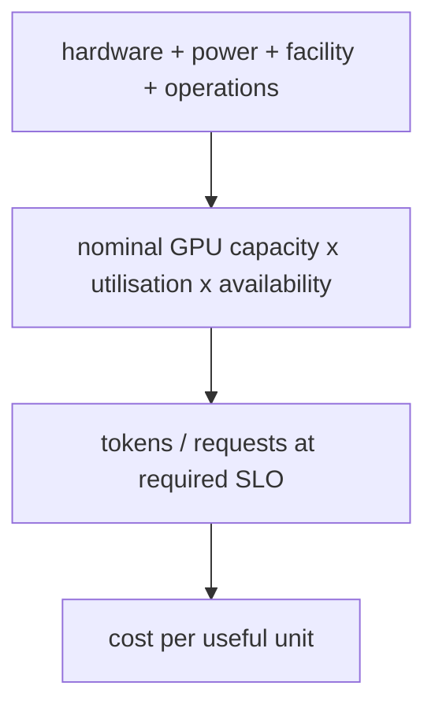

> Learning outcome Normalize cost by useful work and include operations, headroom, failure and licensing.

Hardware/hour price is only one input. Calculate usable throughput at the target SLO, utilization under real demand, failure/maintenance reserve, storage/network, software licensing and staff operational cost. Cloud elasticity can reduce idle capacity but may have availability/quota/data-egress constraints. On-prem may improve steady-state economics but introduces procurement and lifecycle burden.

```
cost_per_million_tokens = total_hourly_cost / (tokens_per_hour / 1_000_000)
effective_capacity = nominal_capacity * expected_utilization * availability_factor
```

---

➕ **The two formulas, unpacked into a full worked TCO calculation with real numbers (the missing artifact):**
```text
GIVEN
8× H100 node, cloud on-demand: $28.00/hr (illustrative rate)
Storage (checkpoint + dataset tier): $2.10/hr (attached, amortized)
Network egress (model artifact pulls): $0.90/hr (amortized, bursty in reality)
Software licensing (serving engine, etc): $1.50/hr (amortized annual license)
Staff operational cost (on-call, 0.1 FTE
allocated to this node pool): $3.20/hr (fully-loaded engineer cost / hrs)
TOTAL HOURLY COST: $35.70/hr
Nominal throughput (vendor/benchmark best case): 12,000 tokens/sec (theoretical peak)
Expected utilization (real traffic, not lab): 0.55 ← THIS is the number
most naive quotes skip
Availability factor (maintenance + failure reserve): 0.92 ← 8% reserved for
upgrades/node loss/drains
effective_capacity = 12,000 × 0.55 × 0.92
= 6,072 tokens/sec USABLE (not 12,000)
tokens_per_hour = 6,072 × 3600 = 21,859,200
cost_per_million_tokens = $35.70 / (21,859,200 / 1,000,000)
= $35.70 / 21.86
= $1.63 per 1M tokens
➤ COMPARE to the naive (wrong) calculation using nominal throughput with
no utilization/availability discount and hardware cost only
$28.00 / (12,000×3600/1,000,000) = $28.00 / 43.2 = $0.65 per 1M tokens
The naive number is 2.5x too optimistic — it ignores utilization,
availability, AND four real cost lines (storage, network, licensing,
staff). This is the exact gap a customer's finance team will find
after go-live if the SA quotes the naive number, and it is the single
most damaging credibility failure a TCO conversation can have.
```

➕ **ASCII breakdown of where the "true" cost per token actually goes (the visualization the raw formula hides):**
```
$35.70/hr total, broken down:
Hardware  ████████████████████████████████████░░░░░░░░  $28.00 (78%)
Storage   ███░░░░░░░░░░░░░░░░░░░░░░░░░░░░░░░░░░░░░░░░░░  $2.10  (6%)
Network   █░░░░░░░░░░░░░░░░░░░░░░░░░░░░░░░░░░░░░░░░░░░░  $0.90  (3%)
Licensing ██░░░░░░░░░░░░░░░░░░░░░░░░░░░░░░░░░░░░░░░░░░░░  $1.50  (4%)
Staff     ████░░░░░░░░░░░░░░░░░░░░░░░░░░░░░░░░░░░░░░░░░░  $3.20  (9%)
```
Hardware dominates (78%), which is exactly why utilization and availability factors matter more than shaving the other four line items — a 10-point utilization improvement (0.55→0.65) moves the effective cost per token far more than eliminating the entire network line item would. **This is the number to lead with in a customer conversation about "where should we optimize cost first."**

➕ **Mnemonic: "NEVER QUOTE THE SPEC SHEET."** Nominal/theoretical throughput numbers (spec sheets, vendor benchmarks) are the *numerator's* raw ingredient, never the answer — utilization and availability factors are not optional footnotes, they are load-bearing multipliers that can cut effective capacity by 40-50% versus nominal, as shown above (12,000 → 6,072 tokens/sec, a 49% reduction).

➕ **Extra worked scenario — cloud vs on-prem TCO conversation, with the actual trade named:**
> **Situation:** Customer asks "wouldn't on-prem just be cheaper — we already own the building?"
> - On-prem removes the $28.00/hr on-demand *rate* but replaces it with amortized capex (GPU purchase price ÷ expected useful life ÷ utilized hours) — if utilization is LOW (say the same 0.55), the amortized-per-hour cost can be worse than cloud on-demand, because capex keeps accruing "cost" whether or not the GPU is busy, while cloud on-demand can in principle be turned off (though real customers rarely scale to zero cleanly).
> - The chapter's own line applies exactly here: "on-prem may improve steady-state economics but introduces procurement and lifecycle burden" — steady-state (high, predictable utilization) is where capex amortization wins; bursty/uncertain demand is where cloud elasticity's per-hour flexibility wins, even at a higher nominal rate.
> - The actual answer to give a customer: "cheaper" depends entirely on utilization forecast accuracy and burstiness, not on the sticker price of either option — and the SA's job is to run the effective_capacity math against the customer's REAL utilization pattern, not the vendor's or the customer's optimistic guess.
> **Interview-ready line:** "On-prem versus cloud isn't a price comparison, it's a utilization-forecast risk comparison — capex punishes a wrong utilization guess much harder than a per-hour cloud rate does."

➕ **The "cost of SLO misses" line, made concrete (Deep Dive 3 references this too — this is where it's derived):** if the pass/fail criterion from Chapter 6's PoC is P95 TTFT < 1s, and effective_capacity is sized assuming 0.55 utilization, then a traffic spike to 0.75 utilization doesn't just slow things down proportionally — queueing systems degrade non-linearly near saturation. A TCO conversation that only budgets for average utilization, with no headroom, is implicitly betting the customer's SLO on traffic never spiking above the average — which is precisely the assumption most production incidents disprove.

## Practice
➕ 1. Recompute the worked TCO example above with utilization raised from 0.55 to 0.70 (holding availability factor at 0.92) — quantify how much cost_per_million_tokens drops, and use that number to make the case for investing in better autoscaling/batching (which raises utilization) versus just buying more GPUs.
➕ 2. A customer's finance team pushes back: "your $1.63/1M tokens is higher than [public API provider]'s advertised price — why would we build this ourselves?" Write the two things a TCO conversation should surface before answering the price question directly (hint: what's NOT comparable between a fully-loaded internal number and a competitor's advertised retail price — data residency/control, and whether the competitor's number includes their own equivalent hidden costs).

➕ **Visual model — cost per useful outcome is a funnel:**

**Memory hook:** *"Price the outcome at the SLO, not the hardware hour."*
