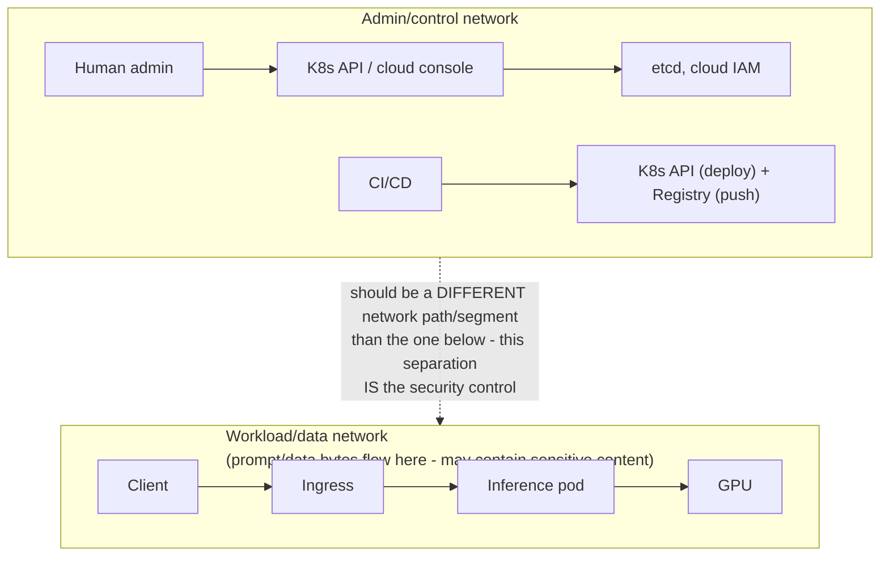

> Learning outcome Map identities, trust boundaries, data/model flows and administrative planes.

Start with identities: human admin, developer, CI/CD, workload, model-serving client. Map what each can access: Kubernetes API, cloud APIs, registries, model artifacts, prompts/data, GPUs and observability. Separate control-plane and data-plane network paths. Define secrets, image/model provenance and audit requirements.

For shared GPUs, tenancy and data isolation requirements may change resource-sharing strategy. For AI services, logs/traces may contain prompts or retrieved data, so observability design is part of privacy/security architecture.

---

➕ **Identity-to-access map, drawn as a matrix (the "map what each can access" instruction, made literal — the artifact this chapter is missing):**
```
Identity            K8s API   Cloud API   Registry   Model artifacts   Prompts/data   GPUs   Observability
Human admin           RW         RW          RW            RW              R           RW        RW
Developer             R (ns)     R limited   R            R (own team)     none         none      R
CI/CD service acct    W (ns)     W (deploy)  RW (push)     RW (publish)    none         none      W (metrics)
Workload identity     none       none        R (pull)      R (own model)   RW (runtime) RW (alloc) W (own)
Model-serving client  none       none        none          none            W (request)   none      none
```
**WHY this artifact matters more than the prose:** the prose says "map what each can access" — it doesn't show that the interesting finding is almost always in the *asymmetries*. Notice: CI/CD can WRITE to the registry (publish) but a human developer typically should NOT be able to push directly — if that row shows RW for a developer, that's a governance finding worth flagging in an architecture review, not a normal state to wave past.

➕ **Trust-boundary diagram — control plane vs data plane network paths, security-specific version of Chapter 2's diagram:**

If admin/control traffic and workload/data traffic share the same network path with no segmentation, a compromised inference client has a much shorter path to the K8s API than the architecture pretends — this is the concrete, checkable form of "separate control-plane and data-plane network paths."

➕ **Sample annotated finding — prompts-in-logs, the AI-specific privacy risk this chapter names but doesn't demonstrate:**
```
$ kubectl logs inference-pod-7 --tail=5
{"ts":"...", "level":"INFO", "request_id":"a1b2", "prompt":"My SSN is 123-45-6789, can you help me...", "latency_ms":340}
                                    ^^^^^^^^^^^^^^^^^^^^^^^^^^^^^^^^^^^^^^^^^^^^
                                    ➤ This is a PII leak into a log aggregation
                                      system that was designed for latency/error
                                      debugging, not data governance. It will be
                                      retained per the LOG retention policy, not
                                      the DATA retention policy — those are
                                      usually different, and nobody reconciles
                                      them unless someone asks this exact question.
```
The fix isn't "don't log" (you lose debuggability) — it's classifying prompt/response fields as sensitive data at the logging layer: redact/hash before the line is emitted, or route full-fidelity prompt logs to a separately-governed store with its own retention and access control, distinct from general operational logs. **Interview-ready line:** "for AI services, I treat the logging pipeline as a data-flow diagram node, not just an ops tool — because prompts are data, and data has its own governance requirements that operational log retention rarely matches by accident."

➕ **Extra worked scenario — GPU Operator privilege isolation, tied to Deep Dive 5's warning with a concrete mechanism:**
> **Situation:** A customer's security team objects to installing the NVIDIA GPU Operator because "it needs privileged containers, which violates our pod security policy."
> - The correct SA response is not "trust us, it's fine" — it's naming the specific privilege each GPU Operator component actually needs and why: the driver container needs host-level access to load kernel modules (there's no way around this — driver installation is inherently a host operation), but the device plugin and DCGM exporter do NOT need the same privilege level once the driver is loaded.
> - The isolation move: scope the privileged workload to a dedicated, tightly-audited namespace with its own admission policy exception (not a blanket cluster-wide privileged allowance), and treat driver-container updates as a distinct, audited change class separate from normal application deployments.
> - This directly operationalizes the chapter's line "GPU Operator components may require elevated privileges to configure host devices, so isolate and audit their deployment" — the worked answer is the *how*, not just the restated *what*.

➕ **Mnemonic: "5 IDENTITIES, 6 RESOURCES, 1 QUESTION EACH."** Five identity types (admin, developer, CI/CD, workload, serving client) × six resource types (K8s API, cloud API, registry, artifacts, data, GPUs+observability) — for every cell, ask "should this identity be able to do this, and can I prove it with a policy, not a promise?" A security architecture review that can't produce the filled-in matrix hasn't actually been done yet, regardless of how much was discussed verbally.

## Practice
➕ 1. Fill in the identity-access matrix above for your own environment (or a hypothetical one) and identify at least one asymmetry that would be a governance finding — e.g. a role with unnecessary write access, or an identity with no access boundary defined at all.
➕ 2. A customer's compliance team asks "can you guarantee no PII ever appears in a log?" Write the honest answer that neither over-promises nor dismisses the concern — name the actual control (classification + redaction/routing at the logging layer) versus the impossible claim (zero PII ever, which no logging architecture can literally guarantee against all future code paths).
