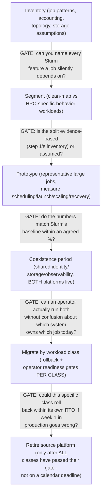
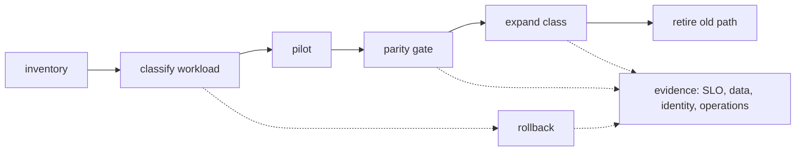

> Learning outcome Design phased transitions with compatibility, rollback, training and operational readiness.

A migration plan should state source/target operating models, workload segmentation, dependencies, data movement, identity/networking, observability, success criteria and rollback. Avoid "big bang" migration when workload classes can be validated incrementally. The team must be able to operate the target before critical workloads move.

## Worked scenario
**Situation:** Customer wants to move all Slurm training to Kubernetes in one quarter because Kubernetes is the company standard.

1. Inventory job patterns, scheduling features, accounting/quotas, topology and storage assumptions currently supplied by Slurm.
2. Identify workloads that map cleanly to Kubernetes and those relying on HPC-specific behavior.
3. Prototype representative large jobs and measure scheduling/launch/scaling/recovery.
4. Define coexistence period and common identity/storage/observability.
5. Migrate by workload class with rollback and operator readiness gates.

**Conclusion:** Standardization is valuable only when the target platform reproduces required workload semantics and can be operated safely.

---

➕ **The migration plan skeleton, drawn as a gated pipeline (the source's 8-item list, sequenced with the actual gate at each step):**

The word "gate" is doing real work here: a migration plan without an explicit go/no-go gate at each stage is a timeline, not a migration plan — and the source scenario's failure mode ("move everything in one quarter because it's a standard") is precisely a timeline pretending to be a plan, with zero gates.

➕ **Sample annotated rollback-readiness worksheet (the missing artifact — what "operator readiness gate" should actually contain, per workload class):**
```
Workload class: large distributed training jobs (candidates for migration)

Readiness item                              Status    Evidence
Scheduling/launch time within X% of Slurm    PASS      Prototype: 4.2 min
                                                        vs Slurm's 3.8 min
                                                        (+10%, within agreed
                                                        15% tolerance)
Checkpoint/recovery after simulated          PASS      Recovered in 6 min,
  node failure                                         SLO was ≤10 min
Topology-aware placement (NVLink/fabric       FAIL      K8s scheduler default
  awareness) matches Slurm's behavior                  placement ignored
                                                        rack topology in 2/5
                                                        test runs — needs
                                                        topology-aware
                                                        scheduling plugin
                                                        before go-ahead
Operator can diagnose a stuck job             PARTIAL   Runbook exists but
  without escalating to platform team                  only tested by the
                                                        platform team itself,
                                                        not the on-call
                                                        rotation that will
                                                        actually own it
Rollback path: can revert this class to        PASS      Job definitions kept
  Slurm within 1 business day if needed                 dual-compatible for
                                                        the coexistence window

  ➤ GATE DECISION: NOT READY. One FAIL (topology-awareness) and one
    PARTIAL (untested runbook with the actual on-call team) block this
    class's migration, even though 3 of 5 items passed. A migration
    gate is AND logic across required items, not a majority vote.
```
This worksheet is the concrete form of "operator readiness gates" — a plan that says "we'll do readiness gates" with no worksheet like this one hasn't actually defined what readiness means, and will be tempted to wave through a partial pass under calendar pressure (which is exactly how "big bang, one quarter" migrations end up in production before they're actually ready).

➕ **Mnemonic: "NO BIG BANG, ALL GATES, PER CLASS."** Segment first, gate every stage, evaluate readiness per workload class independently — a class that's ready in month 1 shouldn't wait for a class that isn't ready until month 3, and a class that isn't ready shouldn't get dragged across the line by a calendar deadline just because other classes are done.

➕ **Extra worked scenario — the political pressure this chapter's scenario doesn't name explicitly:**
> **Situation:** Same as the source scenario — customer wants everything moved in one quarter "because Kubernetes is the company standard." Three weeks in, the topology-awareness FAIL above surfaces. The customer's VP is under pressure to report migration completion at end of quarter.
> - The wrong move: quietly relax the tolerance ("+10% is basically fine, let's call topology-awareness a PASS") to hit the date.
> - The right move: report the FAIL with its evidence (2/5 test runs missed rack-aware placement, which for large synchronous training directly costs step-time and thus GPU-hours) and offer a partial win — migrate the workload classes that DID pass their gates now, keep the topology-sensitive class on Slurm for one more quarter while a topology-aware scheduling plugin is evaluated.
> - This reframes "we didn't hit the standardization deadline" as "we standardized 2 of 3 classes on schedule and protected the third from a real performance regression with evidence" — the second framing is both more honest and, said correctly, a stronger result to report upward.
> **Interview-ready line:** "When a migration deadline and a readiness gate conflict, I report the gate's evidence, not a schedule-adjusted version of it — a missed gate that gets waved through doesn't disappear, it just becomes a production incident with your name on the change log."

## Practice
➕ 1. Take the rollback-readiness worksheet above and add one more row for "identity/RBAC parity between Slurm accounting groups and Kubernetes namespaces/RBAC" — define what evidence would constitute a PASS versus a FAIL for that row.
➕ 2. Write the one-paragraph explanation (in the style of Chapter 10's audience framing) of why this migration is being done "by workload class with gates" rather than "in one quarter" — once for an engineering director (delivery risk framing) and once for an executive (business/cost framing), keeping the underlying facts identical in both versions.

➕ **Visual model — migrate by reversible workload slices:**

**Memory hook:** *"Move a class, prove parity, then widen."* Calendar promises are not migration safety controls.
