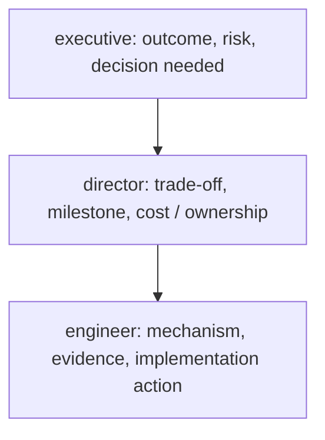

## Communicate at three levels

- Executive: outcome, risk, cost range, decision and next step.
- Engineering leadership: architecture boundaries, trade-offs, operating model and validation.
- Implementer: versions, APIs/configuration, rollout, observability and runbooks.

The recommendation should remain consistent while vocabulary and detail change.

> Learning outcome Change abstraction level while preserving technical truth and decision rationale.

| Audience | Focus |
|---|---|
| Operator | failed component, evidence, command/runbook, immediate mitigation |
| Platform lead | blast radius, root-cause hypothesis, reliability/operational trade-off |
| Engineering director | delivery risk, staffing/complexity, cost and roadmap |
| Executive | business/customer impact, decision options, risk, cost, timeline |

A strong SA answer can explain the same design three ways without contradicting itself. Practice beginning with the outcome, then one level of mechanism, then the recommendation/trade-off. Avoid drowning executives in component names or giving engineers vague "business" language.

## Practitioner lens
**Rob Magno: virtualization/networking/Kubernetes foundations applied to AI/ML architecture**
NVIDIA's public author bio describes an SA background in virtualization, networking, Docker and Kubernetes used to architect complex AI/ML environments. This reinforces the role model for this book: AI Solutions Architecture builds on infrastructure mechanisms rather than replacing them.

[Public source](https://developer.nvidia.com/blog/author/robmagno/)

---

**The four-audience ladder, drawn as one structure applied to ONE incident (the artifact this chapter needs — same facts, four altitudes):**
```
SAME UNDERLYING FACT: "MIG slice on node gpu-07 hit ECC memory errors,
causing 3 inference pods to fail health checks for 11 minutes."

Operator:            "Node gpu-07's MIG instance 2 threw ECC errors at
                      14:32. Pods api-serve-4/5/9 failed liveness probes.
                      Runbook: cordon node, drain MIG-affected pods,
                      xid check via nvidia-smi -q -d ECC. Mitigation
                      already applied: node cordoned, traffic rerouted."
                      ➤ command-level, evidence-first, action already taken

Platform lead:        "One node's MIG partition had a hardware ECC event —
                      contained to that node, other 7 nodes unaffected.
                      11 minutes of degraded capacity, no full outage
                      because MIG's hardware isolation kept it from
                      affecting the other partitions on the SAME physical
                      GPU. Trade-off worth flagging: this is the isolation
                      benefit MIG gives us paying off in exactly the
                      scenario we chose it for."
                      ➤ blast radius, and the ARCHITECTURE DECISION's
                        payoff, named explicitly

Engineering director:  "A hardware fault caused an 11-minute partial
                      capacity reduction on one of eight nodes, auto-
                      contained by our GPU-sharing architecture. No
                      customer-facing SLA breach. No staffing/roadmap
                      impact — this is exactly the failure mode we
                      designed the isolation strategy to contain."
                      ➤ delivery-risk framing: "did this cost us anything
                        we care about at this altitude" — answer: no

Executive:            "A hardware issue on one server briefly reduced
                      capacity by about 12%. Customers were not impacted;
                      the platform automatically routed around it. No
                      action needed from you — flagging only because
                      it's a good example of the resilience investment
                      paying off."
                      ➤ business impact, reassurance where warranted,
                        zero component names (no "MIG," no "ECC," no "xid")
```
**Why this is the right artifact, not just a restatement of the table:** the source table lists *what each audience wants to hear about* — this shows the same event compressed to four different altitudes without a single technical fact contradicting another. That consistency (not the vocabulary shift) is what the chapter's learning outcome is actually testing.

**Mnemonic: "OUTCOME, ONE MECHANISM LAYER, RECOMMENDATION" — the sequencing the source already states, turned into a 3-beat structure to use live for ANY audience, not just executives:**
1. Say the outcome/result first (what happened or what you recommend) — never bury this.
2. Add exactly one layer of mechanism appropriate to the audience (not zero, not five).
3. End on the recommendation/trade-off, explicitly, even if the audience didn't ask for one.
Doing steps 1 and 3 for an executive and skipping step 2 entirely is correct — that's *zero* layers of mechanism, which is still "one level" relative to a platform lead who gets two or three. The number of mechanism layers is the tuning knob; the 3-beat order (outcome → mechanism → recommendation) doesn't change across audiences.

**Extra worked scenario — explaining MIG at three levels, answering Practice Q4 with a full worked answer (not just an instruction to try it):**
> **To an SRE:** "MIG hard-partitions a GPU's SMs and memory into isolated instances at the hardware level — each instance gets its own fault domain, so an ECC error or a crashing process in one MIG slice can't take down workloads in another slice on the same physical card. Compare to time-slicing, which shares everything in software with no such isolation."
> **To a platform engineer:** "MIG lets us run several smaller inference workloads on one physical GPU with guaranteed memory and compute allocation per workload — no noisy-neighbor interference, at the cost of fixed slice sizes, so we have to size slices against expected workload footprint up front or we get fragmentation."
> **To an executive:** "MIG lets us safely run multiple customer workloads on the same physical hardware without them affecting each other, which improves utilization — meaning we get more value per GPU purchased, without a resilience or security trade-off."
> Notice all three are the SAME technical fact (hardware partitioning with isolation) at three depths of mechanism — none contradicts another, which is the actual bar Practice Q4 sets.

**Interview-ready line:** "I don't have four explanations memorized — I have one accurate working model and I choose how many layers of mechanism to expose, outcome-first, every time. If two audiences ever hear contradictory facts from me, that's the failure, not the vocabulary difference."

## Practice
1. Run a 15-minute discovery role-play for an inference platform and list only questions whose answers change architecture.
2. Create a weighted decision matrix for Kubernetes vs Slurm for a hypothetical customer.
3. Write PoC success criteria for GPU Operator lifecycle automation and for LLM P95 latency — two very different hypotheses.
4. Explain MIG to an executive, platform engineer and SRE in three different levels of detail.

5. Take an incident from your own experience (or the MIG/ECC scenario above) and write all four audience versions from scratch without looking at the example — then check: do any two versions state a fact that could be read as contradictory if the two audiences compared notes afterward? If yes, that's the bug to fix, not the wording.
6. An executive interrupts your explanation and asks "just tell me if I need to worry." Without dropping the outcome-first structure, give the one-sentence answer that would satisfy this interruption for the MIG/ECC scenario above, and explain why answering this well is actually harder than giving the full four-paragraph version.

**Visual model — one fact, three altitude levels:**

**Key takeaway:** *"Same truth, different resolution."* Changing vocabulary must never change the risk or the decision.
