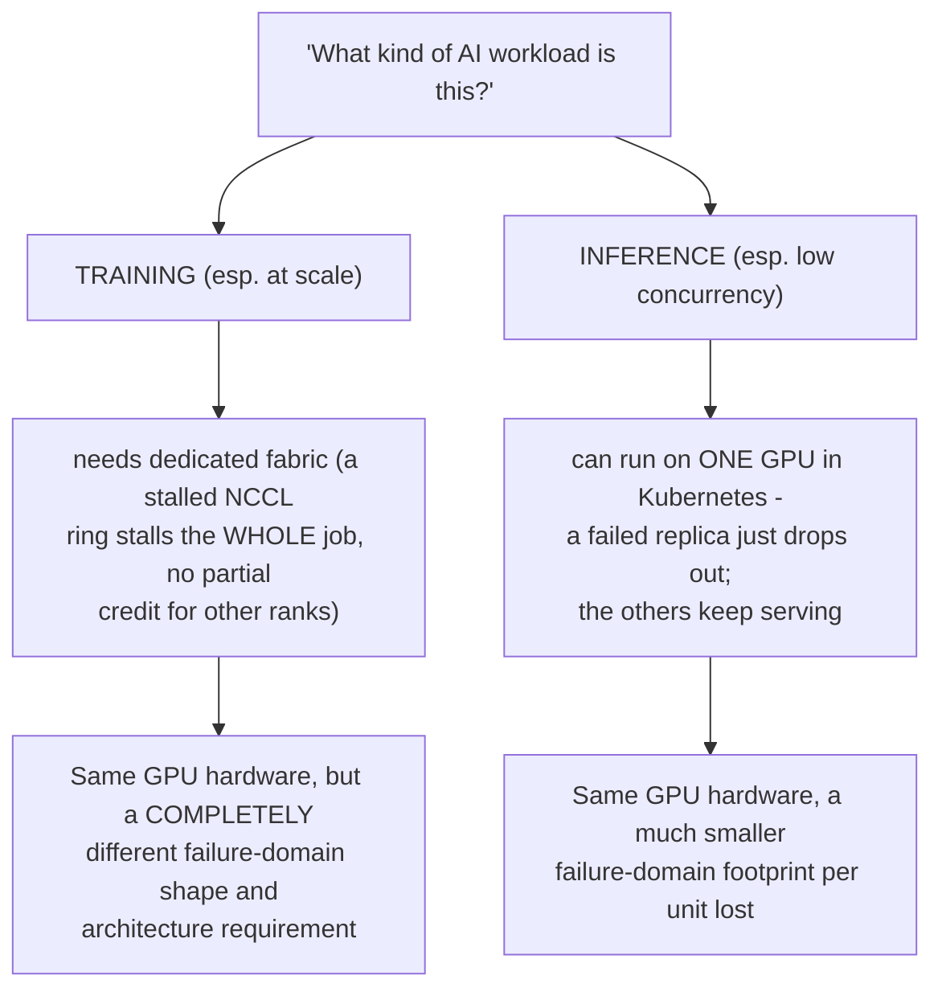
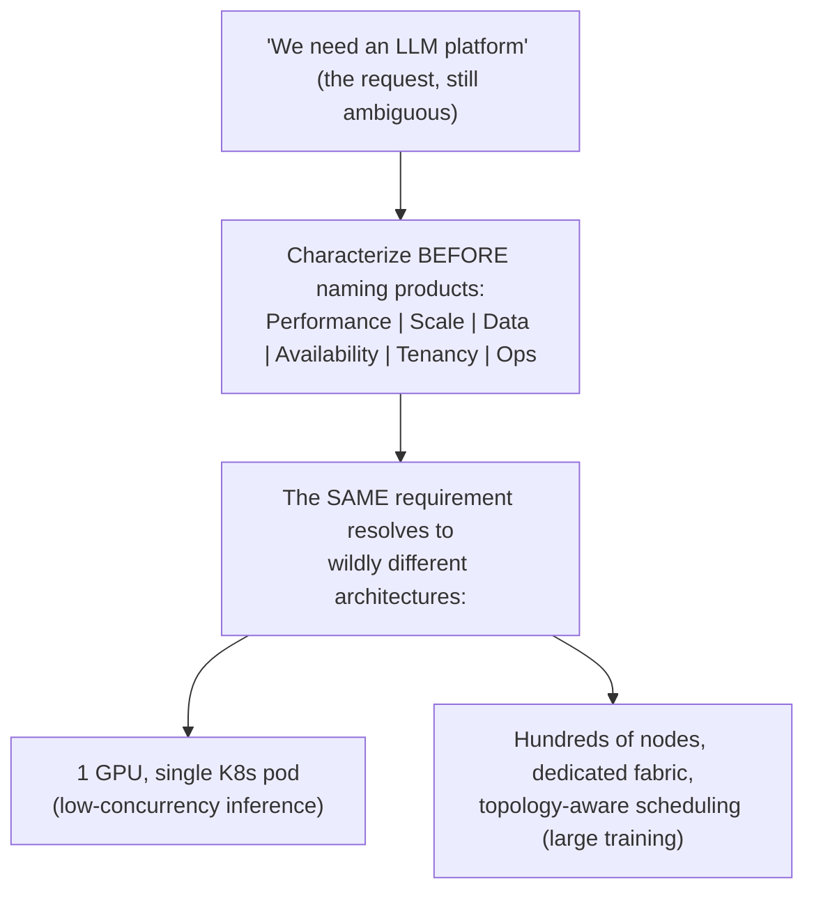

Do not start a customer conversation with products. Characterize workload: training versus inference, model sizes, precision, sequence lengths, concurrency, batch behavior, data volume, checkpoint frequency, latency/throughput SLOs, tenancy, regions, compliance, lifecycle and operator skills. The same “LLM platform” requirement can imply one GPU in Kubernetes or hundreds of nodes with a dedicated fabric.

<!-- source-table:1 -->

| Discovery area | Questions that change design |
| --- | --- |
| Performance | TTFT/ITL targets? tokens/s? training step time? tail latency? |
| Scale | peak concurrency, model count, GPU count, growth, burstiness? |
| Data | dataset size, small-file count, checkpoint size/frequency, locality? |
| Availability | RTO/RPO, multi-zone/rack, maintenance windows, failover behavior? |
| Tenancy | hard isolation or fair-share? chargeback? reservations? priorities? |
| Operations | Kubernetes or Slurm skills? GitOps? on-call ownership? air-gap? |

## Build from the normal path

**Workload characterization record**

**FOURTH EDITION — SENIOR ENGINEERING EXPANSION · VOLUME 8**

**Customer discovery, AI factory architecture, PoCs and senior trade-off decisions**

This expansion keeps the Fourth Edition teaching flow and adds the depth expected from a senior infrastructure engineer and customer-facing Solutions Architect. The emphasis is mechanism first: understand what the system is doing, observe it with concrete tools, then reason about failure, scale, reliability, performance and trade-offs.

The practitioner material used to shape the scope is a signal, not an authority. Technical behavior is anchored in official documentation and first-principles systems reasoning. Your Staff Engineer study guide contributes useful patterns around Kubernetes, observability, distributed systems, platform design and failure isolation; the NVIDIA material adds GPU systems, AI workloads, accelerated networking and customer architecture.

_Figure A. A senior SA turns ambiguity into evidence, then into a decision._

**What Figure A's caption is actually claiming, made checkable:** "ambiguity into evidence" is Chapter 1's discovery method (questions that eliminate options); "evidence into a decision" is Chapter 3's weighted trade-off matrix. Figure A is effectively the one-sentence summary of the entire volume's arc — every chapter from here on is either producing evidence (discovery, workload characterization, PoC results, TCO math) or converting evidence into a decision (trade-off matrices, decision workshops, migration gates). If a chapter's content doesn't map to one of those two verbs, that's worth noticing.

**Cross-reference table — which chapter each Deep Dive extends**

| Deep Dive | Extends chapter(s) | New content here vs. full re-derivation |
|---|---|---|
| 1. Workload characterization before architecture | Ch.1 (Discovery) | New discovery-area table (performance/scale/data/availability/tenancy/ops) — genuinely additive, cross-ref Ch.1's W-S-S-D-S-O-E areas |
| 2. AI factory layered architecture | Ch.2 (Data/control paths) | Extends Ch.2's six-path diagram to a full layered-system view — new diagram added |
| 3. Capacity and TCO: convert SLO into resources | Ch.5 (GPU sharing), Ch.7 (TCO) | Mostly restates Ch.7's formulas at portfolio level — cross-referenced, new content is the utilization-vs-isolation trade explicit framing |
| 4. PoC design: test the uncertainty | Ch.6 (PoC design) | Same hypothesis-first method as Ch.6, applied to 5 new named uncertainty domains — new pass/fail table is genuinely additive |
| 5. Security and governance for GPU/AI platforms | Ch.8 (Security) | Same identity/boundary method as Ch.8 — cross-referenced, new content is air-gap/mirroring specifics |
| 6. Decision workshops: K8s, Slurm, Run:ai, NIM, Dynamo | Ch.3 (Trade-off matrices), Ch.4 (K8s vs Slurm) | Extends Ch.4's binary decision to a 5-component composition — new layering diagram added |
| 7. Communicate at three levels | Ch.10 (Customer communication) | Nearly identical to Ch.10's four-audience ladder (3 vs 4 levels) — cross-referenced, not re-derived |
| 8. Practitioner role model: SA vs implementation engineer | Ch.1, Ch.10 | New content: a scored self-check rubric |

**Deep Dive 1 — additions**

**The "one GPU vs hundreds of nodes" claim, made concrete with the actual branching variable:** the single highest-leverage discovery answer here is *training-vs-inference*, because it changes the failure-domain shape, not just the GPU count. Inference at low concurrency genuinely can run on one GPU in Kubernetes. Training at scale needs a dedicated fabric because a single stalled NCCL ring stalls the *entire* job — there's no "the other replicas keep serving" grace period like there is for inference. This is the same control/data-plane distinction from Ch.2, applied to why training and inference are architecturally different animals even on identical hardware.

**Diagram: the training-vs-inference branch, drawn as the decision this chapter's opening question actually is:**

Both branches can be the correct answer to "we need an LLM platform" — the diagram is the reminder that the words in the request never determine which branch applies; only the training-vs-inference discovery answer does.

**Diagram: the six discovery areas as a gate before naming any product:**

