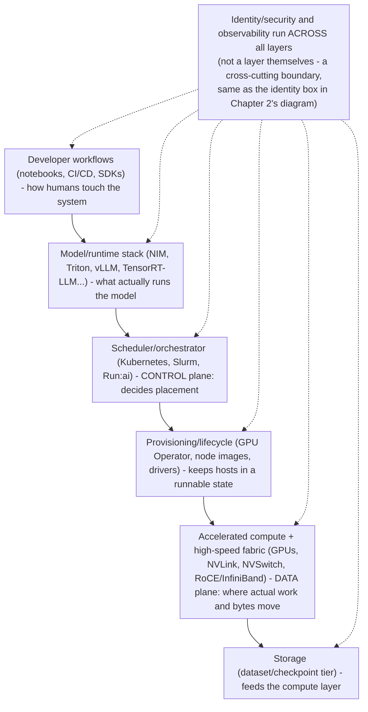
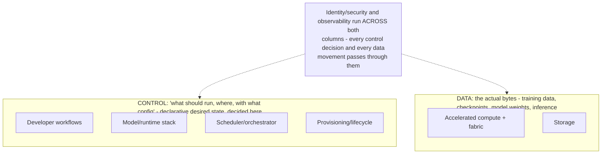

_Figure B. Architecture reviews must connect user workloads to orchestration, accelerated compute, network, storage and operations._

An AI factory is an integrated system, not “GPUs plus Kubernetes”. Compute nodes, high-speed fabric, storage, provisioning/lifecycle, scheduler/orchestrator, model/runtime stack, observability, identity/security and developer workflows must form one operational product. The data path and control path should be explicit in the diagram.

## Senior addendum

➕ **The layered view, drawn (extends Chapter 2's six-path diagram from a request-flow view to a full-stack view — this is genuinely new, not a re-derivation):**

**Why "not GPUs plus Kubernetes" is the correct one-liner to defend:** a customer who thinks they've built an AI factory by provisioning GPUs and installing Kubernetes has covered exactly 2 of these 6 layers, and typically the two that are hardest to get wrong. The layers that actually fail in production — provisioning/lifecycle (driver drift), storage (can't feed the GPUs fast enough), and the model/runtime stack (wrong batching config) — are the ones the "GPUs + K8s" mental model skips entirely.

➕ **Diagram: data path and control path traced through the same layers (the explicit overlay the source text asks for):**

The six-layer stack answers "what are the pieces"; this overlay answers "which pieces decide, and which pieces carry" — the same distinction Chapter 2 draws for a single request, now applied to the whole factory.
