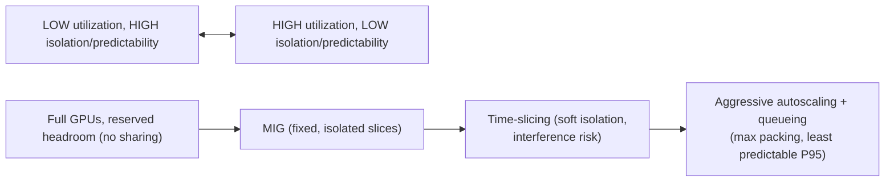
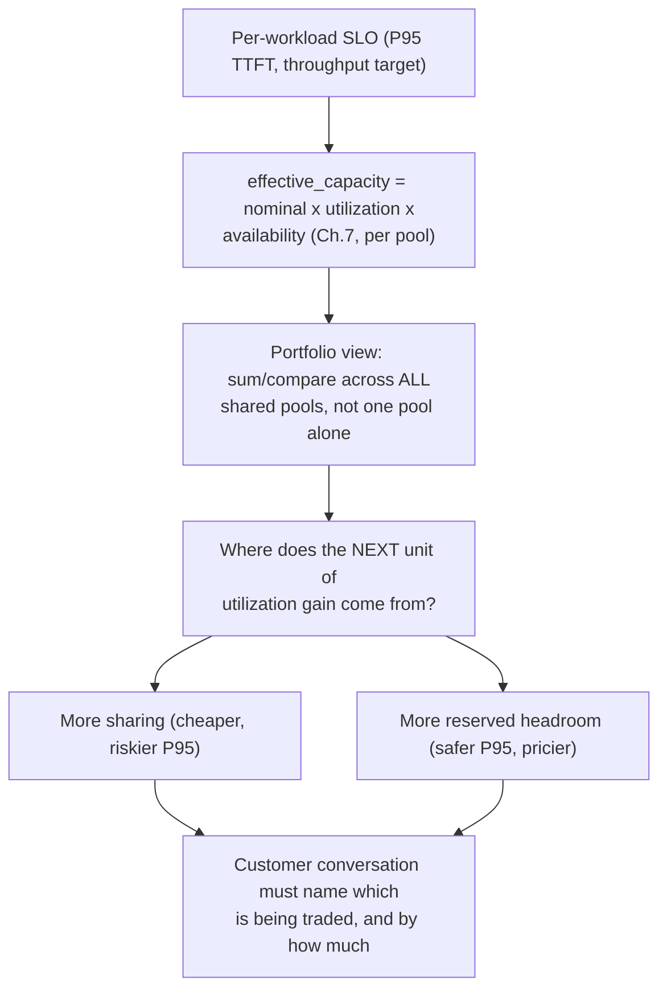

Sizing begins with a measured throughput/latency point for a specific model, engine, precision, hardware and traffic distribution. Then account for peak load, headroom, failure capacity, maintenance, model replicas, load time and utilization. TCO includes GPU hours, CPU/RAM, storage, network, licenses, operator effort, idle capacity and cost of SLO misses. Avoid quoting theoretical GPU peak performance as application capacity.

For shared platforms, utilization is a portfolio problem. MIG, fractional scheduling, queueing, reservations, priorities and autoscaling change both efficiency and predictability. The customer conversation should make the trade explicit: highest utilization can conflict with deterministic latency or isolation.

## Build from the normal path

**The utilization-vs-isolation trade, stated as the one line worth memorizing for this chapter specifically:** "the same lever that raises utilization (more sharing, more queueing, more autoscaling aggressiveness) is the lever that raises latency variance — you cannot maximize both on the same GPU pool simultaneously, so the customer conversation has to name which one is being traded for the other, and by how much." This directly connects Chapter 5's MIG-vs-time-slicing isolate/elastic framing to Chapter 7's cost math: a pool tuned for maximum utilization is, by construction, the pool with the least predictable P95 latency.

**Diagram: the utilization-vs-isolation trade as one slider, not two independent knobs:**

Moving right on this line raises utilization and raises P95 latency variance in the SAME motion — there is no position that maximizes both at once.

**Diagram: SLO into resources, at the portfolio level (extends Chapter 7's single-pool formula):**

