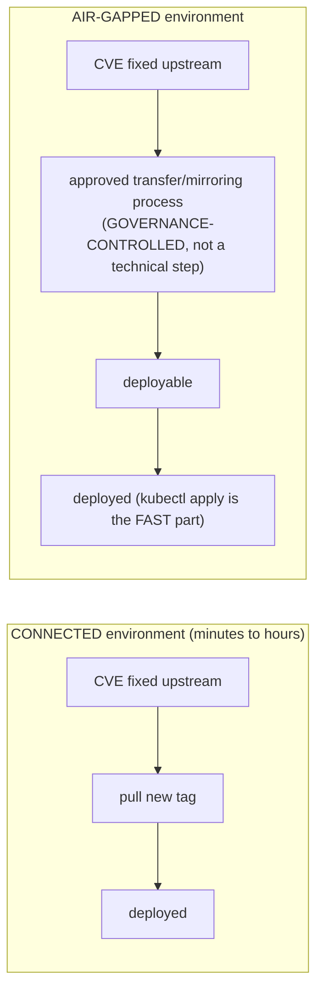

Separate cluster administration, platform administration and tenant privileges. Protect model/data secrets, registry credentials and cloud identities. GPU Operator components may require elevated privileges to configure host devices, so isolate and audit their deployment. For inference APIs, enforce authentication, authorization, rate limits, tenant quotas, request size/token limits and sensitive-data handling. For air-gapped environments, image/model/package mirroring becomes a lifecycle problem.

## Build from the normal path

**Air-gap mirroring as a lifecycle problem, made concrete:** in a connected environment, a CVE in a base image or a model runtime gets patched by pulling a new tag. In an air-gapped environment, every image, model artifact, and OS/driver package has to be mirrored through an approved transfer process *before* it can be pulled — which means the patch lag between "fix is available upstream" and "fix is actually deployable" is a governance-controlled variable, not a technical one. **Interview-ready line:** "in air-gapped environments, security patching speed is bounded by your mirroring process's throughput, not by how fast you can run `kubectl apply` — that's a process design problem, and it needs its own SLA."

**Diagram: where the patch-lag actually lives, connected vs air-gapped:**

The bottleneck moves from tooling speed to process throughput — sizing the mirroring pipeline's SLA is a security control, not an operations nicety.
