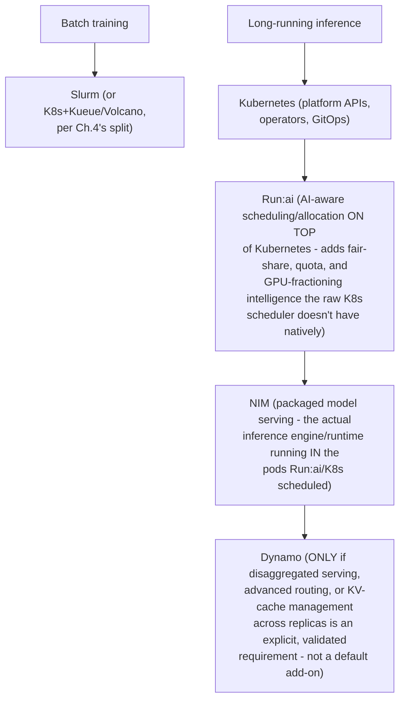
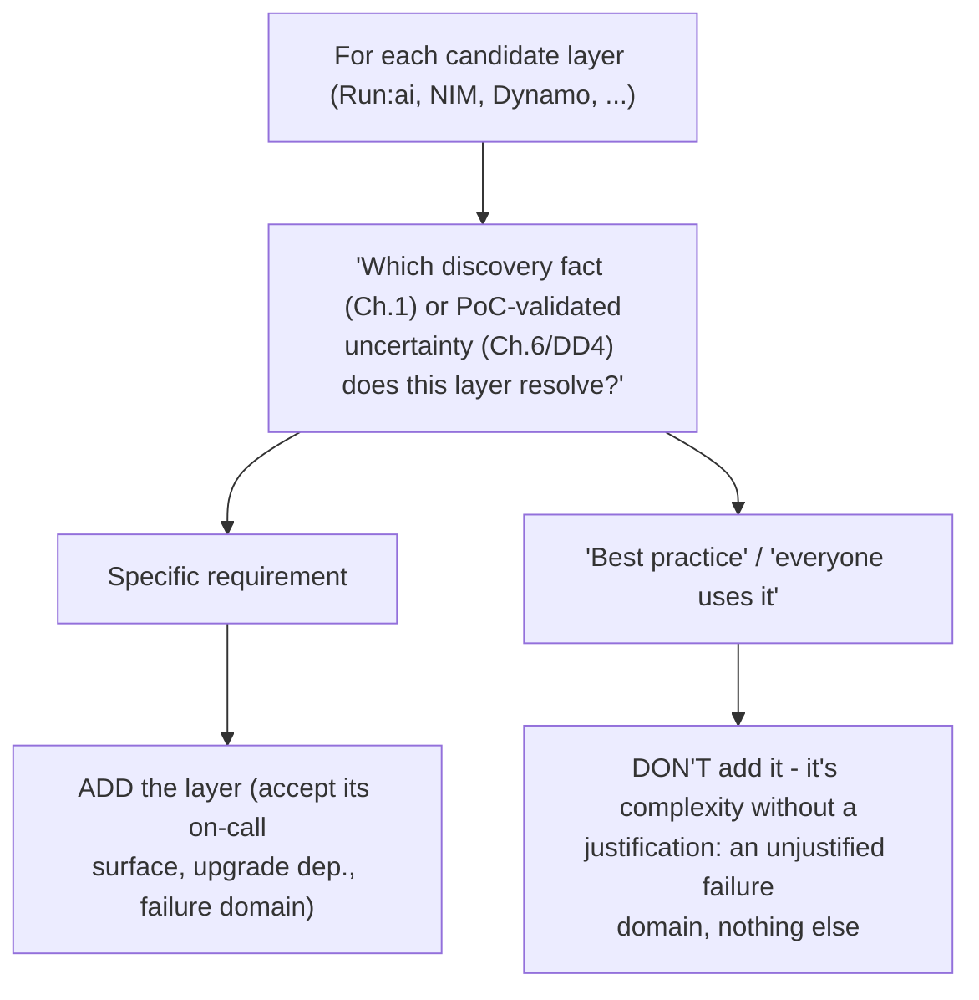

The correct answer is often a composition. Kubernetes may host long-running inference, platform APIs and operators. Slurm may run tightly coupled batch training. Run:ai may provide AI-aware scheduling and GPU allocation on Kubernetes. NIM provides packaged model serving; Dynamo coordinates distributed inference when advanced routing, cache management or disaggregated serving is justified. Every layer adds capability and operational responsibility; only add it to solve an explicit requirement.

## Build from the normal path

**The 5-component composition, drawn as a layering diagram (extends Chapter 4's binary K8s-vs-Slurm decision tree to the full 5-way composition space named here):**

**The "only add it to solve an explicit requirement" line, turned into a check anyone can run in a design review:** for every layer in this stack, ask "which discovery fact (Chapter 1) or PoC-validated uncertainty (Chapter 6/Deep Dive 4) does this component resolve?" If a layer's answer is "it's a good practice" or "it's what everyone uses," rather than a specific requirement, that's a complexity add without a justification — and every added layer is also an added on-call surface, an added upgrade dependency, and an added failure domain (Chapter 2's control/data-path reasoning applies to each one individually).

**Diagram: the per-layer add/don't-add check, run against each candidate component:**

