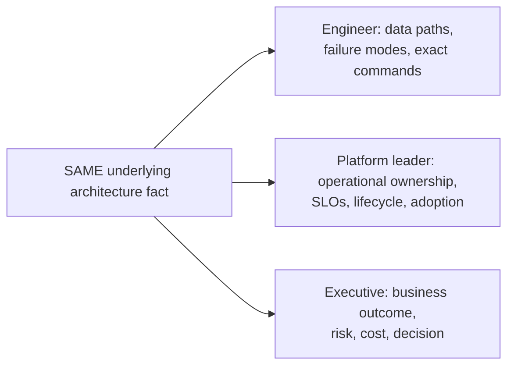

With engineers, show data paths, failure modes and commands. With platform leaders, show operational ownership, SLOs, lifecycle and adoption. With executives, show business outcome, risk, cost and decision. The architecture is the same; the representation changes. A strong SA can move between these levels without contradicting the technical model.

## Build from the normal path

**Diagram: the same architecture fact, three altitudes:**

All three: outcome first, then one altitude-appropriate mechanism layer, then recommendation. Zero contradictions allowed between altitudes — the same consistency bar Chapter 10 sets for four audiences, applied to three.

### Worked example: recurring GPU-node failures

The shared fact is: two nodes produced repeated uncorrectable GPU errors after a driver rollout, jobs were rescheduled, and the canary policy prevented wider deployment.

- **Engineer:** “Xid and DCGM evidence is isolated to two canary nodes. Drain them, preserve diagnostics, compare firmware/driver state with a known-good node, then run the admission test before returning either node.”
- **Platform leader:** “The canary contained the blast radius, but the admission gate did not catch this error class. Pause the rollout, add the failing health signal to the gate, and track lost GPU-hours and recovery time.”
- **Executive:** “The staged rollout prevented a fleet-wide interruption. Delay the remaining deployment while engineering validates the compatibility issue; the cost is a short schedule slip rather than broad training downtime.”

The facts, uncertainty and recommendation stay consistent. Only the mechanism depth and decision horizon change. Before presenting, write one sentence each for evidence, user impact, uncertainty, recommendation and owner; derive every audience version from those five sentences.
