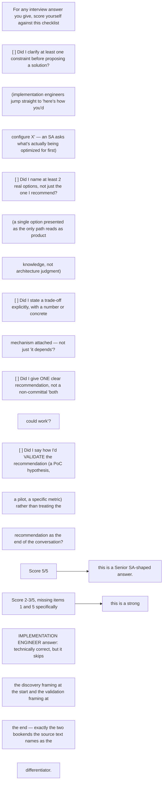
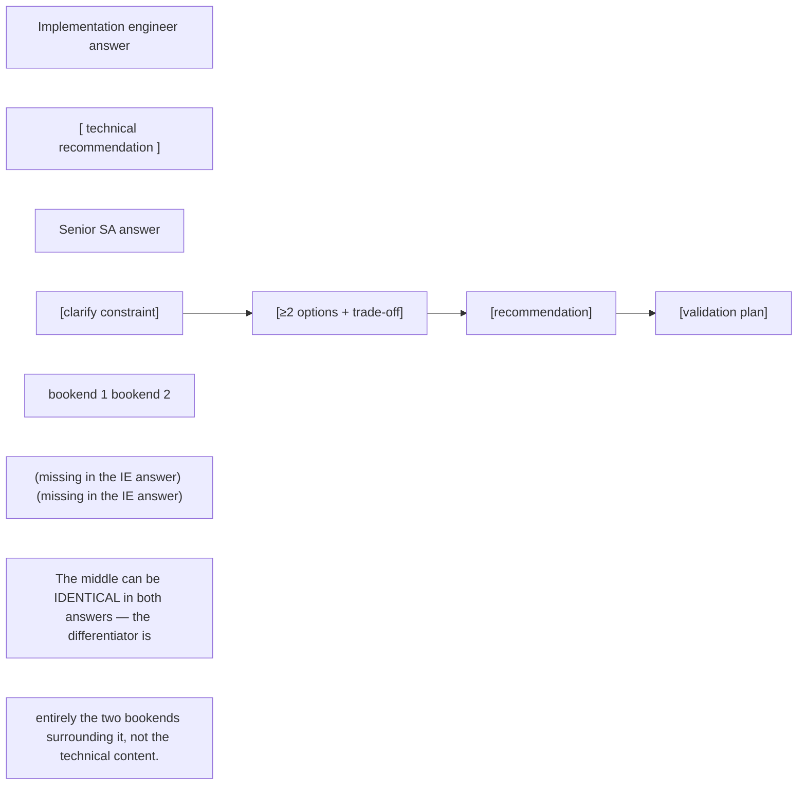

Public practitioner material from NVIDIA SAs emphasizes requirements discovery, evaluating trade-offs, PoCs, guiding implementation and stakeholder communication. This is the differentiator from an engineer who only knows product configuration. During an interview, make your reasoning visible: clarify constraints, propose options, state trade-offs, recommend one, and define how you would validate it.

## Senior addendum

➕ **A scored self-check rubric — the missing artifact for this Deep Dive, usable as literal interview prep:**

➕ **Interview-ready line:** "the gap between an SA and an implementation engineer isn't technical depth — it's that an SA's answer has a constraint-clarifying question at the start and a validation plan at the end, with the technical recommendation sandwiched in between. I try to hit both bookends on every answer, not just the middle."

➕ **Diagram: the answer structure that separates the two roles:**

## Targeted references and reinforcement

**NVIDIA Solutions Architect, DevOps — Germany:** [https://de.linkedin.com/jobs/view/solutions-architect-devops-at-nvidia-4424636420](https://de.linkedin.com/jobs/view/solutions-architect-devops-at-nvidia-4424636420) — Current role-family requirements: K8s AI/ML workloads, Linux/storage, automation/observability and consultative architecture.

**NVIDIA SA hiring signal — MLOps/LLMOps/GenAI platform:** [https://www.linkedin.com/posts/amitnvidia\_hiring-bengaluru-mlops-activity-7475583242381721600-DIXX](https://www.linkedin.com/posts/amitnvidia_hiring-bengaluru-mlops-activity-7475583242381721600-DIXX) — Current practitioner signal: serving, GPU Kubernetes, batching/routing/KV cache, TTFT/TPOT/tokens/s, RAG/agents, enterprise readiness.

**Vishakha Sadhwani profile/posts:** [https://www.linkedin.com/in/vsadhwani](https://www.linkedin.com/in/vsadhwani) — SA versus FDE framing and infrastructure-to-AI skill transition.

**NVIDIA DGX Cloud Run:ai:** [https://docs.nvidia.com/dgx-cloud/run-ai/latest/overview.html](https://docs.nvidia.com/dgx-cloud/run-ai/latest/overview.html) — Kubernetes-based AI workload management and GPU allocation context.
