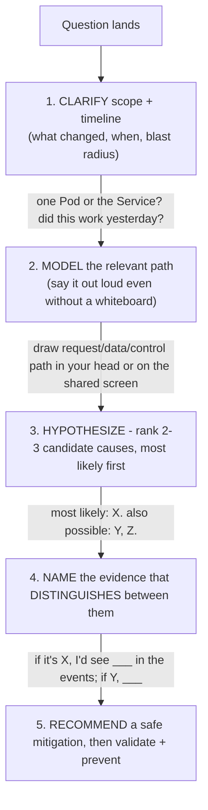
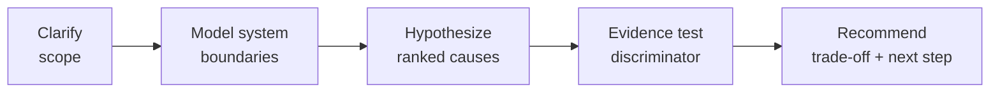

## Foundations: start here before using the interview question bank

### What this volume is trying to teach

Interview practice should reveal whether you can transfer knowledge into reasoning and communication. It should not be your first exposure to Linux, Python, Kubernetes, GPU, AI or HPC concepts. Question banks compress context by design; use them after the matching core material.

### The first mental model

A strong technical answer usually has this shape:

1. clarify scope, objective and constraints;
2. state a simple normal-path model;
3. identify important boundaries or options;
4. choose evidence or comparison criteria;
5. recommend a safe action or design;
6. validate the original outcome;
7. mention risk, rollback and prevention when relevant.

This is not a script to recite. It is a thinking discipline that keeps answers connected to the question.

### Different questions test different skills

| Question type | What it tests |
|---|---|
| Foundation | Can you explain the mechanism accurately and plainly? |
| Coding | Can you turn requirements into readable, testable behavior? |
| Troubleshooting | Can you reduce uncertainty with ordered evidence? |
| Architecture | Can you discover requirements and compare trade-offs? |
| Customer scenario | Can you adapt depth, influence and communicate risk? |
| Behavioral | Can you show ownership and measurable impact from real experience? |

### What to do when a topic is new

Do not memorize the provided answer points. Mark the unknown nouns, return to the foundation/core chapter, draw the normal path, run or study one observation, and then answer in your own words. If you cannot explain why a command separates two hypotheses, the command is not yet part of your reasoning.

### A practical study loop

Choose one question. Answer aloud for two minutes. Review for undefined jargon, missing normal path, random command lists and unsupported conclusions. Study the exposed gap. Answer again without reading notes. Then add one follow-up involving scale, failure or customer trade-offs.

### Example: turn a weak troubleshooting answer into reasoning

Question: "A GPU workload is slow. What do you check?"

Weak answer:

> I check `nvidia-smi`, Kubernetes logs and restart the Pod.

Why it is weak: no scope, no workload outcome, random layers, and a mutation before evidence.

Stronger structure:

1. Clarify whether this is training or inference and define "slow" as step time, tokens/s, TTFT or another metric.
2. Scope to model/version, nodes, replicas, time and recent changes.
3. Draw the path: request/data → CPU/framework → GPU → communication/storage → output.
4. Compare application outcome and per-stage timing with a known-good baseline.
5. Use GPU/host/network/storage evidence only for affected scope.
6. Rank hypotheses and name the observation separating each pair.
7. Choose a reversible mitigation, preserve evidence and validate the original metric.

The stronger answer does not need every command. It shows you know what each command would prove.

### Example: architecture answer

Question: "Design an LLM inference platform."

Start with discovery:

- model sizes/precisions and number of models;
- prompt/output distributions;
- concurrency and arrival pattern;
- TTFT, inter-token, total latency and availability objectives;
- data sensitivity, tenancy and residency;
- current platform skills and deployment environment;
- cost/growth and failure-recovery needs.

Then draw request, model artifact, control, trust and observability paths. Compare feasible engines/platform patterns using benchmarks and operating trade-offs. End with a recommended first design and a PoC that tests capacity, latency, failure and operability.

### Coding practice should expose the thought process

For a Python log-aggregation task:

1. restate input/output and malformed-input behavior;
2. show a small example manually;
3. choose dictionary/Counter because lookup/aggregation is the operation;
4. implement pure parsing and aggregation first;
5. test empty, malformed and duplicate cases;
6. discuss streaming, memory and I/O only after correctness;
7. add CLI/logging/exit behavior if asked for productionization.

Do not jump to classes or concurrency to appear senior.

### Self-scoring rubric

Score each answer 0–2:

| Dimension | 0 | 1 | 2 |
|---|---|---|---|
| Clarity | jargon/list | partial structure | plain mechanism and explicit conclusion |
| Scope | none | some assumptions | objective, constraints and affected boundary clear |
| Technical model | incorrect/absent | incomplete | normal path and ownership accurate |
| Evidence | random commands | some relevant checks | observations discriminate hypotheses |
| Safety | destructive first | mitigation mentioned | blast radius, rollback and validation explicit |
| Senior judgment | product answer | trade-off named | options tied to requirements and uncertainty |

A low score routes you back to a specific learning action. It is not solved by rehearsing the same words faster.

### Four-pass mock-interview progression

1. **Open book:** explain using diagrams and notes.
2. **Closed book:** reproduce the normal path and core answer.
3. **Adversarial follow-up:** handle scale, failure, security or conflicting requirements.
4. **Timed simulation:** concise answer with a clear recommendation and invitation to deepen.

Record yourself. Remove acronyms you cannot define, claims without evidence and background that does not affect the decision.

### Readiness check

Begin mock interviews only after you can explain the underlying topics to a curious engineer, not only to an interviewer. Being able to say "I have not used that exact product, but here is how I would model and validate it" is stronger than inventing certainty.

### Check your understanding

**Q1: Why is a command list weaker than an evidence plan?**
A: Commands without hypotheses do not show which uncertainty each observation reduces or how the result changes the next decision.

**Q2: What should you do when you have not used the exact product named?**
A: State that boundary honestly, explain the mechanism you do know, and describe how you would validate the unfamiliar product with official evidence and a safe test.

### Glossary

- **Scope** — the affected systems, users, time window, and blast radius.
- **Normal path** — the expected sequence of components and state transitions.
- **Hypothesis** — a testable possible explanation.
- **Discriminating evidence** — an observation that separates competing hypotheses.
- **Rollback** — a prepared way to reverse a change or mitigation.

### Ready to continue

- Give a two-minute answer with scope, model, evidence, recommendation, and validation.
- Explain what each proposed command would and would not prove.
- State assumptions instead of inventing certainty.

**VOLUME 9**

**JR2018680 Interview Preparation**

Coding, full-stack troubleshooting, AI infrastructure architecture and customer scenarios

> Fourth Edition - Teaching text with mechanisms, examples, visuals, scenarios and exercises

Independent study guide based on public documentation and public practitioner material. Not an NVIDIA publication.

> Learning outcome Use clarification, hypotheses, evidence and trade-offs so the interviewer can follow your technical judgment.

Figure 1. Strong answers are ordered reasoning, not command dumps.

For troubleshooting, say what you need to know, then state the first branch of your hypothesis tree and what evidence will distinguish it. For architecture, discover requirements before naming technologies. For Python, state the algorithm/data structure before typing. This makes seniority visible even when you do not remember one command or API exactly.

> Bad opening “I would check logs, restart the Pod, and see if it works.”

> Better opening “First I want to scope whether this is one Pod/node or the service. If the Pod is Pending, container logs do not exist yet; I’ll read scheduling events to determine whether capacity, taint/affinity, PVC or GPU resource accounting is blocking placement.”

## Senior Engineering Expansion preface (Fourth Edition, Volume 9)

**Senior NVIDIA Solutions Architect interview drills and answer patterns**

This expansion keeps the Fourth Edition teaching flow and adds the depth expected from a senior infrastructure engineer and customer-facing Solutions Architect. The emphasis is mechanism first: understand what the system is doing, observe it with concrete tools, then reason about failure, scale, reliability, performance and trade-offs.

The practitioner material used to shape the scope is a signal, not an authority. Technical behavior is anchored in official documentation and first-principles systems reasoning. Your Staff Engineer study guide contributes useful patterns around Kubernetes, observability, distributed systems, platform design and failure isolation; the NVIDIA material adds GPU systems, AI workloads, accelerated networking and customer architecture.

_Figure A. The interviewer should hear your reasoning, not only the final technology choice._

## ➕ Additions

➕ **Why this chapter matters more than any single technical fact:** in a 45-minute loop, an interviewer forms most of their "senior or not" judgment from *how* you approach a question, not whether you land the exact right command on the first try. Two candidates who both eventually diagnose the same OOMKilled Pod are scored completely differently if one opens with "let me check logs" and the other opens with "first — is this one Pod, one node, or the whole Service, and did anything change recently?" This chapter is the meta-skill every other chapter in this volume assumes you already have.

➕ **The answer framework as a decision flow (memorize this shape, not the words):**

➕ **Memory hook / one-liner to recall this under pressure:** *"C-M-H-E-R — Clarify, Model, Hypothesize, name Evidence, Recommend."* If you forget everything else, the two moves that separate senior from mid-level are step 1 (clarify before diagnosing) and step 4 (name evidence that *distinguishes* hypotheses, not just evidence that confirms your first guess — confirmation-seeking is the single most common tell of a non-senior answer).

➕ **Interview-ready line — the one sentence to say when a question is intentionally vague (and NVIDIA loop questions often are, on purpose, to see if you ask):**
> "Before I pick a first command, can I clarify [scope/timeline/blast radius] — that changes which branch I go down first."
This single sentence does three things simultaneously: it signals you don't jump to conclusions, it buys you information that actually changes your answer, and it costs you nothing even if the interviewer says "assume whatever you like" — you then state your assumption explicitly instead of hiding it, which is still the senior move.

➕ **Annotated sample answer transcript — the "Pod is Pending" prompt from the Better-opening box above, extended to a full 90-second spoken answer with WHY each sentence works:**

> **Interviewer:** "A GPU Pod has been Pending for 10 minutes. Walk me through it."
>
> **Candidate:** "First I want to scope whether this is one Pod or several — if it's fleet-wide, that points at capacity or a controller problem rather than this specific Pod's spec." *(← clarify + immediately states WHY the clarification matters — not clarification for its own sake)*
>
> "Assuming it's this one Pod: since it's Pending, no container has started, so I go straight to `kubectl describe pod` and read the Events section rather than logs, which don't exist yet." *(← names the evidence source and explicitly rules out a wrong first move — logs — showing awareness of what information exists at each lifecycle stage)*
>
> "My leading hypothesis for a GPU workload specifically is resource accounting — either the `nvidia.com/gpu` request can't be satisfied by any node's allocatable, or a taint/toleration or nodeSelector for a specific GPU SKU doesn't match. My second hypothesis is PVC binding if this job needs a volume with topology constraints." *(← ranks hypotheses, and ties the ranking to GPU-specific realism instead of generic Kubernetes trivia — this is what makes it read as SA-for-AI-infra rather than generic K8s admin)*
>
> "The `FailedScheduling` event message will directly distinguish these — it names the predicate that failed, e.g. 'Insufficient nvidia.com/gpu' versus a taint mismatch versus volume node affinity conflict." *(← names the exact evidence and what it looks like for each branch — this is the step most candidates skip)*
>
> "If it's capacity and autoscaler is enabled, I'd check whether any node group the autoscaler can create actually satisfies the GPU type/taint/topology — autoscaler isn't a blanket fix for unschedulable constraints." *(← foreshadows Chapter 4's worked scenario, shows the candidate already knows the common trap)*

➕ **Why this works, summarized:** every sentence either (a) narrows the hypothesis space, (b) names a concrete artifact (event, field, message) that will be checked, or (c) states the reasoning connecting evidence to conclusion. Nothing in the transcript is a command dump with no narration.

➕ **Extra worked scenario (new, not in the original source) — applying the framework to a question that isn't troubleshooting at all, to prove the framework generalizes:**
> **Prompt:** "A customer asks: 'Should we use MIG or time-slicing for our inference fleet?' You have 30 seconds before you need to say something."
> 1. **Clarify:** "Is isolation/predictability more important than density here, and do you know your per-request memory footprint?" — even a rhetorical clarify, spoken aloud, buys you time and shows you didn't jump to a technology name.
> 2. **Model:** briefly state what each mechanism actually does at the hardware level — MIG partitions SM/memory/cache into hardware-isolated instances; time-slicing shares the whole GPU with context-switch overhead and no memory isolation.
> 3. **Hypothesize:** "If your workloads are latency-sensitive and multi-tenant, MIG's isolation is probably worth the fixed-partition inflexibility. If they're bursty and same-tenant, time-slicing's flexibility probably wins."
> 4. **Evidence:** "The number that actually decides this is measured P99 latency variance under co-located load in a PoC — not a spec sheet."
> 5. **Recommend:** "I'd default to recommending a short PoC measuring exactly that before committing either way."
> **Interview-ready line:** "I can give you a default lean, but the actual answer is benchmark-derived, not opinion-derived — and I'd say that sentence out loud even if the interviewer pushes for a single word answer."

➕ **Common failure modes to explicitly avoid (say what NOT to do, because naming the anti-pattern out loud is itself a senior signal):**
- Command-dumping: reciting `kubectl get`, `describe`, `logs`, `top` in sequence with no stated hypothesis between them.
- False confidence: picking one cause and defending it instead of naming what would falsify it.
- Silence under ambiguity: not stating the assumption you're making when the interviewer refuses to clarify — always narrate the assumption instead of guessing silently.
- Jumping to the mitigation before evidence: "restart it" without having named why that's safe (idempotent? stateful? will it recur?).

## Practice
➕ 1. Take the "Bad opening" line from the original box above and rewrite it live, out loud, timed to 20 seconds, using the C-M-H-E-R shape. Record yourself — most candidates are shocked how much filler ("um, so basically") disappears once the shape is memorized.
➕ 2. Pick any Chapter 3-9 worked scenario in this volume and, before reading its steps, run your own C-M-H-E-R pass cold. Compare your hypothesis ranking against the book's — where you diverge is your study gap, not a wrong answer.

➕ **Visual model — expose the reasoning chain, not a memorized conclusion:**

**Memory hook:** *"Question first, mechanism second, answer last."*
