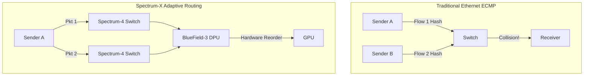
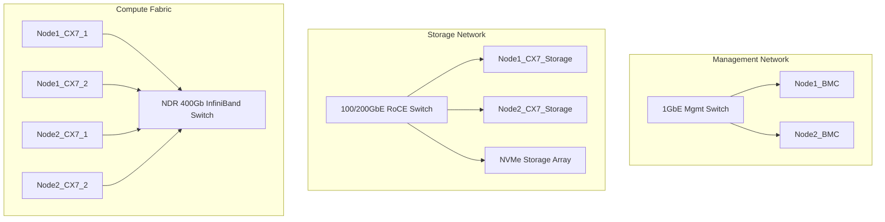

# Masterclass: The Hardware & Ecosystem Gauntlet

## Foundations: start here before using the interview question bank {#foundations-start-here-before-using-the-interview-question-bank}

Welcome to the definitive masterclass on the NVIDIA Hardware and Ecosystem stack. This document is engineered for seasoned DevOps, SRE, Platform, and ML Infrastructure engineers preparing for rigorous architectural discussions. We will not be covering superficial product definitions. Instead, we are diving deep into the **"Why"** behind NVIDIA's architectural decisions. 

In this volume, we tackle four highly critical questions:
- **Q1:** The deep technical nuances of NVIDIA's Software and Hardware tools/systems.
- **Q12:** The triumvirate of networking: ConnectX (NIC), Spectrum-X (Ethernet), and Quantum (InfiniBand).
- **Q13/14:** The Generative AI OS (NIMs and NeMo) and Customer Education (DGX vs BasePOD vs SuperPOD onboarding).

---

## Module 1: The NVIDIA Hardware & Software Stack (Q1)

When discussing the NVIDIA stack, most engineers default to listing acronyms: CUDA, TensorRT, DGX. This is a trap. To pass an architectural gauntlet, you must explain **how these components interact at a systems level**, how they mitigate bottlenecks (like PCIe congestion and CPU overhead), and why they are designed the way they are.

### 1.1 The Hardware Foundation: Beyond the GPU

The modern GPU (e.g., Hopper H100, Blackwell B200) is no longer a peripheral; it is the center of the computing universe. The CPU is now a glorified data fetcher and orchestrator.

#### The "Why" of Multi-Instance GPU (MIG)
MIG was introduced in Ampere and refined in Hopper. Why? Because large GPUs are often underutilized during inference or small-scale training. 
- **The Mechanism:** MIG physically partitions the GPU (up to 7 slices on H100) at the hardware level. This is not software virtualization (like vGPU or MPS). Each MIG instance has dedicated L2 cache, memory bandwidth, and compute cores.
- **The Why:** Software partitioning (MPS - Multi-Process Service) shares the memory space and L2 cache, meaning one misbehaving process (e.g., a memory leak or an unoptimized kernel) can cause latency spikes for others. MIG physically isolates workloads, providing deterministic latency and fault isolation, critical for multi-tenant Kubernetes environments.

:::danger Interview Trap
Do not confuse MIG, MPS, and Time-Slicing. 
- **Time-Slicing:** Context switching (high latency overhead).
- **MPS:** Spatial sharing (good for concurrent execution from a single tenant, but zero fault isolation).
- **MIG:** Physical partitioning (strict isolation, strict QoS, requires reconfiguring the GPU topology).
:::

:::tip Golden Answer
"I utilize MIG when I need strict hardware-level fault isolation and guaranteed QoS in a multi-tenant Kubernetes environment. I use MPS when a single tenant has multiple small, concurrent kernels and I want to maximize overall SM utilization without the overhead of re-partitioning the hardware."
:::

### 1.2 Systems Architecture: DGX, HGX, MGX

NVIDIA doesn't just sell GPUs; they sell system topologies designed to eliminate data movement bottlenecks.

#### HGX (Hyperscale Graphics Extension)
HGX is the baseboard. It contains 4 or 8 GPUs connected via NVLink and NVSwitch.
- **The Why:** PCIe Gen5 maxes out at 128 GB/s (bidirectional). An H100 GPU requires orders of magnitude more bandwidth to communicate with its peers during operations like `AllReduce` in distributed training. NVLink 4.0 provides 900 GB/s bidirectional bandwidth per GPU. NVSwitch creates a non-blocking all-to-all network *on the motherboard*.

#### DGX (Data Center GPU Extension)
DGX is the fully integrated appliance. 
- **The Why:** A DGX system (like DGX H100) is essentially an HGX baseboard married to dual x86 CPUs, massive amounts of system RAM, and a highly specific PCIe topology. Notice how a DGX H100 has 4x OSFP ports (8x 400Gbps links) going directly to the GPUs via PCIe Gen5 switches? This topology (Rail-optimized) ensures that GPU 0 can speak directly to the network without traversing the CPU root complex.

:::info Whiteboard Strategy
Draw a DGX H100 PCIe tree. Show the CPU at the top, but emphasize the PCIe switches below the CPU. Show the NICs (ConnectX-7) plugged directly into the same PCIe switches as the GPUs. Draw an arrow bypassing the CPU entirely (GPUDirect RDMA). Explain that this topology reduces latency and completely bypasses CPU memory bandwidth limits.
:::

### 1.3 The Software Stack: Moving Data Efficiently

Compute is fast. Moving data to the compute is slow. The entire NVIDIA software stack is designed to mask or eliminate data movement latency.

#### CUDA and Magnum IO
CUDA is the baseline, but Magnum IO is the unsung hero for Infrastructure Engineers.
- **NCCL (NVIDIA Collective Communication Library):** If you are running PyTorch DistributedDataParallel (DDP), you are using NCCL. NCCL automatically discovers the optimal topology (NVLink, PCIe, InfiniBand) and constructs rings or trees for collective operations (`AllReduce`, `AllGather`).
- **GPUDirect Storage (GDS):** 
  - **The Problem:** Traditionally, reading data from NVMe to GPU memory required moving data: NVMe -> PCIe -> System RAM -> CPU bounce buffer -> PCIe -> GPU RAM.
  - **The Solution:** GDS allows direct DMA from NVMe storage over PCIe directly into GPU memory. 
  - **The Why:** This drops CPU utilization to near zero for I/O operations and significantly reduces latency, crucial for feeding data-hungry LLM training loops.

### Deep Dive Scenario 1: Optimizing the NCCL Topology
In a cluster of 64 nodes, understanding how NCCL forms its rings is critical. 
1. **Intra-node:** NCCL detects NVSwitch and uses it for extremely fast `AllReduce`.
2. **Inter-node:** NCCL detects the ConnectX-7 adapters and maps them to the GPUs. 
If a user misconfigures the `NCCL_TOPO_FILE` or if the PCIe topology is masked by a hypervisor, NCCL might fallback to routing traffic through the CPU or using a sub-optimal network path. 
*Fix:* Always validate topology using `nvidia-smi topo -m` and run `nccl-tests` (e.g., `all_reduce_perf`) to baseline bandwidth before handing the cluster to data scientists.

---

## Module 2: The Data Center Networking Trinity (Q12)

The network is the computer. In AI, a 1% network packet drop can cause a 50% degradation in job completion time. This is because synchronous training (like Ring-AllReduce) is only as fast as the slowest link.

### 2.1 InfiniBand (Quantum)

InfiniBand is not just "fast Ethernet". It is a lossless-by-design, software-defined network built for HPC.

- **The Architecture:** Quantum switches (NDR 400Gbps) utilize credit-based flow control. A node cannot send data unless it knows the remote buffer has space. There are no dropped packets due to congestion.
- **SHARP (Scalable Hierarchical Aggregation and Reduction Protocol):** This is the killer feature.
  - **The Problem:** In a standard `AllReduce`, GPUs send tensors to each other, adding them up over the network. This consumes massive network bandwidth and GPU compute time.
  - **The Solution:** SHARP offloads the mathematical reduction (addition) to the ASICs *inside the Quantum switch*. 
  - **The Why:** The switch receives data from multiple nodes, adds it together in hardware, and broadcasts the result. This cuts network traffic by 50% for collective operations.

:::tip Golden Answer
"When a customer asks why they can't just use their existing Enterprise Ethernet for a 1,000-GPU cluster, I explain credit-based flow control versus PFC (Priority Flow Control). Ethernet relies on dropping packets or pausing links reactively. InfiniBand is proactive. I then whiteboard how SHARP offloads in-network computing, fundamentally changing the scaling mathematics of large parameter models."
:::

### 2.2 Ethernet (Spectrum-X)

Why did NVIDIA build Spectrum-X if InfiniBand is so good? Because many enterprises demand Ethernet for multi-tenant, cloud-native deployments, but traditional Ethernet fails spectacularly at AI workloads due to microbursts and incast congestion.

- **RoCEv2 (RDMA over Converged Ethernet):** RDMA bypasses the CPU kernel completely. But RoCEv2 requires a lossless network. 
- **The Spectrum-X Solution:**
  - **Adaptive Routing:** Traditional Ethernet uses ECMP (Equal-Cost Multi-Path), which hashes flows to paths. If two "elephant flows" hash to the same path, they collide and cause congestion, even if other paths are empty. Spectrum-X dynamically routes packets packet-by-packet (not flow-by-flow) across all available paths.
  - **Out-of-Order Execution (BlueField-3):** Because packets take different paths, they arrive out of order. The BlueField-3 DPU buffers and reorders them in hardware before presenting them to the GPU, making the network behavior transparent to NCCL.
  - **Advanced Congestion Control:** Spectrum-X uses hardware telemetry to predict congestion and throttle senders precisely.

:::danger Interview Trap
Do not say "RoCE is just as good as InfiniBand." They have different profiles. InfiniBand provides absolute lowest latency and SHARP offloads. Spectrum-X provides cloud-scale multi-tenancy with InfiniBand-like performance by fixing Ethernet's fundamental flaws (ECMP hashing and reactive congestion control).
:::

### 2.3 ConnectX vs BlueField

- **ConnectX-7:** The SmartNIC. It provides hardware offloads for RDMA, encryption (IPsec/TLS), and storage (NVMe-oF). It is the standard for DGX systems where the CPU is dedicated to managing the local system.
- **BlueField-3:** The DPU (Data Processing Unit). It has an integrated array of ARM cores. 
  - **The Why:** In a cloud environment, you don't trust the host OS (tenant). The BlueField DPU runs the hypervisor's networking stack, firewall, and storage initiator *on the ARM cores*. The host OS only sees a standard virtio-net or NVMe device. It isolates infrastructure management from the tenant's compute domain.

### Engineering Deep Dive 1: Tuning RoCEv2 DCQCN
When deploying RoCEv2 without Spectrum-X, you must tune DCQCN (Data Center Quantized Congestion Notification). This involves configuring PFC (Priority Flow Control) classes and ECN (Explicit Congestion Notification) thresholds. 
If PFC thresholds are set incorrectly, you risk a "PFC Storm" where pause frames propagate through the network, locking up the entire fabric. 
*Whiteboard Tip:* Draw the ingress buffer of a switch. Show the headroom buffer, the XOFF threshold (send pause frame), and the XON threshold (resume sending). Explain how cable length impacts the required headroom buffer size due to light-propagation delay.

---

## Module 3: Generative AI OS - NIMs and NeMo (Q13)

The hardware is the engine, but the software ecosystem is how enterprises actually derive value. We are shifting from monolithic model deployment to microservices architectures.

### 3.1 NVIDIA Inference Microservices (NIM)

NIM is the deployment vehicle for production AI. 
- **The Problem:** Deploying an open-source LLM (like Llama-3) in production requires stitching together a model, an inference engine (like vLLM or TensorRT-LLM), an API server (like Triton Inference Server), handling model weights, optimizing for the specific GPU architecture, and building Docker containers. This takes weeks and is fragile.
- **The Solution:** NIM packages the model weights, TensorRT-LLM engine, Triton API server, and CUDA dependencies into a single, pre-optimized Docker container. 

#### Under the Hood of NIM
A NIM container isn't just a wrapper. At startup, the NIM orchestrator checks the physical GPU architecture (e.g., Ada vs Hopper). It automatically selects the optimal TensorRT engine profile (pre-compiled for that specific SM architecture) and configures Triton for the optimal batch size and KV cache memory allocation.

:::info Whiteboard Strategy
Draw the NIM architecture stack:
1. **Top Layer:** Standard OpenAI-compatible REST/gRPC API.
2. **Middle Layer:** Triton Inference Server (handling dynamic batching and request queuing).
3. **Execution Engine:** TensorRT-LLM (handling PagedAttention, KV cache management, and continuous in-flight batching).
4. **Bottom Layer:** Optimized model weights (FP8/INT8 quantized).
Explain how this standardizes deployment across diverse infrastructure.
:::

### 3.2 NVIDIA NeMo Framework

While NIM is for inference, NeMo is the end-to-end framework for data curation, training, fine-tuning, and alignment.
- **Data Curation:** Tools to extract, deduplicate, and filter petabytes of text.
- **Megatron-Core:** The absolute core of NeMo's training capability. 
  - **The Why:** Training a 70B model cannot fit on a single GPU (requires ~140GB just for weights, plus gradients and optimizer states). Megatron-Core implements 3D Parallelism:
    1. **Data Parallelism (DP):** Replicate the model across workers, split the dataset.
    2. **Tensor Parallelism (TP):** Split individual matrix multiplication operations *across multiple GPUs within a single node* (using high-speed NVLink).
    3. **Pipeline Parallelism (PP):** Split the layers of the model across multiple nodes.

:::tip Golden Answer
"When a customer wants to train a foundational model, I explain that PyTorch DDP is insufficient. I introduce NeMo and Megatron-Core to implement 3D Parallelism. I strategically place Tensor Parallelism within the DGX node to utilize the 900 GB/s NVLink, and Pipeline/Data Parallelism across the InfiniBand network, optimizing the communication-to-compute ratio."
:::

### NeMo Guardrails Production Scenario 1
Customer requires strict safety bounds on their customer-service LLM. Instead of relying purely on system prompts (which can be jailbroken), we deploy NeMo Guardrails. 
*Architecture:* We position NeMo Guardrails as a semantic gateway between the user application and the NIM microservice. It uses smaller embedding models to detect topical bounds (e.g., "competitor_mention") and executes Colang scripts to gracefully redirect the conversation *before* the expensive generation occurs on the LLM.

---

## Module 4: Customer Education & Onboarding (Q14)

Infrastructure engineers must not only build systems; they must educate customers on the architectural realities of scale. A customer buying a single DGX node has fundamentally different needs than one building a SuperPOD.

### 4.1 DGX System Onboarding (The Single Node)

- **Target:** Data science teams, small PoCs.
- **Topology:** Single node, 8 GPUs. 
- **Focus:** The onboarding conversation here is entirely about maximizing single-node efficiency. We teach the customer about Base Command Manager (BCM) for bare-metal OS provisioning, Docker, and the NVIDIA Container Toolkit (nvidia-docker).
- **The Trap:** Customers often try to run legacy monolithic Python scripts on a DGX. We must educate them on Jupyter integration, NGC containers, and utilizing MIG for parallel experimentation.

### 4.2 BasePOD Onboarding (The Rack Scale)

- **Target:** Mid-size enterprises, fine-tuning, departmental infrastructure.
- **Topology:** 2 to 8 DGX nodes, single InfiniBand or Ethernet switch fabric, centralized high-performance storage (e.g., VAST, WEKA, NetApp).
- **Focus:** The conversation shifts from single-node execution to distributed computing. 
  - We must teach the concept of the **Compute Fabric** vs the **Storage Fabric** vs the **Management Fabric**.
  - We introduce Kubernetes, Slurm, and the NVIDIA Network Operator/GPU Operator.

### 4.3 SuperPOD Onboarding (The Data Center Scale)

- **Target:** Cloud Service Providers (CSPs), sovereign AI, massive foundational model training.
- **Topology:** 32+ DGX nodes, multi-tier non-blocking network (Fat-Tree/Clos topology), liquid cooling.
- **Focus:** At this scale, Mean Time Between Failures (MTBF) drops dramatically. If you have 4,000 GPUs, hardware *will* fail daily.
  - The conversation is about **Resilience, Telemetry, and Rail Optimization**.
  - **Rail Optimization Explained:** In a SuperPOD, GPU 0 on Node 1 should communicate with GPU 0 on Node 2 using the exact same physical switch (a "rail"). This ensures 1-hop latency for Tensor Parallelism. 
  - We must teach the customer how to use UFM (Unified Fabric Manager) for predictive failure analysis and Base Command for scheduling jobs around degraded nodes.

:::danger Interview Trap
Do not treat a SuperPOD as just a "big BasePOD." A SuperPOD requires facility-level engineering (power density, rear-door heat exchangers, liquid cooling CDU management). Your onboarding must bridge the gap between Data Center Facilities (HVAC/Power) and the MLOps software team.
:::

### High-Scale Troubleshooting Scenario 1: The Straggler Problem
At SuperPOD scale, a job that normally takes 10 hours suddenly takes 30 hours. 
1. **Symptom:** GPU utilization on 1023 GPUs is at 10%, while 1 GPU is at 100%. 
2. **Diagnosis:** This is a classic "straggler" issue in synchronous training. The fast GPUs are blocked in an `AllReduce` wait state. 
3. **Investigation:** We use DCGM (Data Center GPU Manager) to check PCIe correctable errors and thermal throttling (clocks dropping). We use UFM telemetry to check for InfiniBand symbol errors or link retries on the specific leaf switch connecting the slow node.
4. **Resolution:** We identify a degraded active optical cable (AOC). We drain the node in Slurm, replace the cable, reset the counters, and resume training from the last checkpoint.

---
## Conclusion

This masterclass requires strict adherence to architectural first principles. Whether discussing hardware isolation (MIG), network topology (RoCEv2 vs IB), software delivery (NIM), or scaling paradigms (SuperPOD), the professional infrastructure engineer always anchors their decisions to physical realities: bandwidth, latency, failure domains, and hardware offloads.
