# Interview Framework & Whiteboard Masterclass

:::info Overview
This masterclass provides an exhaustive guide to NVIDIA AI Infrastructure operations, focusing on the underlying architecture, production deployment patterns, troubleshooting, and senior-level interview preparation.
:::

---
id: 01-interview-framework-masterclass
title: Interview Framework & Whiteboard Masterclass
sidebar_label: Interview Framework & Whiteboard Masterclass
---


:::info Overview
This masterclass provides an exhaustive guide to NVIDIA AI Infrastructure operations, focusing on the underlying architecture, production deployment patterns, troubleshooting, and senior-level interview preparation.
:::

---
title: "Chapter 1 - The answer framework: expose your reasoning"
slug: "chapter-1-the-answer-framework-expose-your-reasoning"
sidebar_position: 1
description: "Chapter 1 - The answer framework: expose your reasoning — JR2018680 Interview Preparation."
source_document: "Volume_09_JR2018680_Interview_Preparation(2).docx"
---


### Advanced Production Considerations
When operating at scale, you must heavily monitor metrics like DCGM (Data Center GPU Manager) counters, Xid errors, and PCIe bandwidth saturation. In production, these parameters dictate your cluster's overall ROI. Ignoring PCIe topology, for instance, can lead to severe NCCL fallback, completely degrading multi-node training performance.


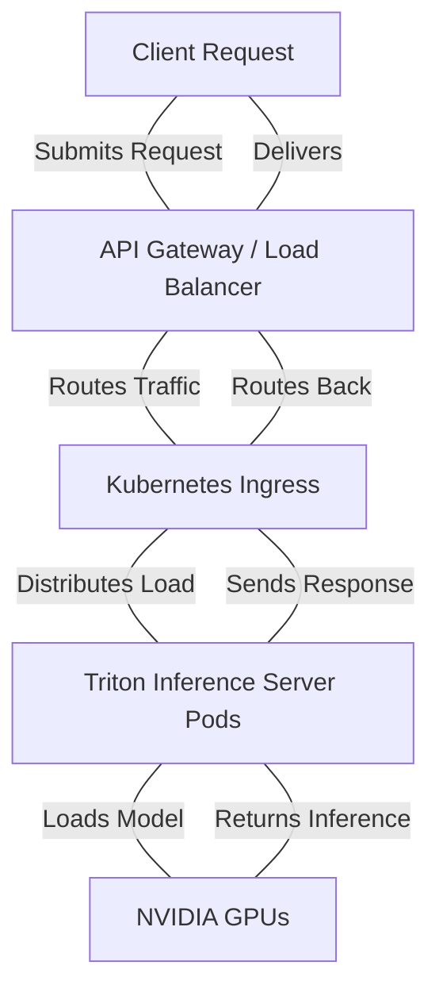

:::tip Pro-Tip
Always visualize the request lifecycle when troubleshooting latency. The gap between `API Gateway` and `Triton Pods` is often where network jitter is introduced.
:::


### Advanced Production Considerations
When operating at scale, you must heavily monitor metrics like DCGM (Data Center GPU Manager) counters, Xid errors, and PCIe bandwidth saturation. In production, these parameters dictate your cluster's overall ROI. Ignoring PCIe topology, for instance, can lead to severe NCCL fallback, completely degrading multi-node training performance.


:::tip Pro-Tip
Always visualize the request lifecycle when troubleshooting latency. The gap between `API Gateway` and `Triton Pods` is often where network jitter is introduced.
:::
## Foundations: start here before using the interview question bank

### What this volume is trying to teach

Interview practice should reveal whether you can transfer knowledge into reasoning and communication. It should not be your first exposure to Linux, Python, Kubernetes, GPU, AI or HPC concepts. Question banks compress context by design; use them after the matching core material.

### The first mental model

A strong technical answer usually has this shape:

1. clarify scope, objective and constraints;
2. state a simple normal-path model;
3. identify important boundaries or options;
4. choose evidence or comparison criteria;
5. recommend a safe action or design;
6. validate the original outcome;
7. mention risk, rollback and prevention when relevant.

This is not a script to recite. It is a thinking discipline that keeps answers connected to the question.

### Different questions test different skills

| Question type | What it tests |
|---|---|
| Foundation | Can you explain the mechanism accurately and plainly? |
| Coding | Can you turn requirements into readable, testable behavior? |
| Troubleshooting | Can you reduce uncertainty with ordered evidence? |
| Architecture | Can you discover requirements and compare trade-offs? |
| Customer scenario | Can you adapt depth, influence and communicate risk? |
| Behavioral | Can you show ownership and measurable impact from real experience? |

### What to do when a topic is new

Do not memorize the provided answer points. Mark the unknown nouns, return to the foundation/core chapter, draw the normal path, run or study one observation, and then answer in your own words. If you cannot explain why a command separates two hypotheses, the command is not yet part of your reasoning.

### A practical study loop

Choose one question. Answer aloud for two minutes. Review for undefined jargon, missing normal path, random command lists and unsupported conclusions. Study the exposed gap. Answer again without reading notes. Then add one follow-up involving scale, failure or customer trade-offs.

### Example: turn a weak troubleshooting answer into reasoning

Question: "A GPU workload is slow. What do you check?"

Weak answer:

> I check `nvidia-smi`, Kubernetes logs and restart the Pod.

Why it is weak: no scope, no workload outcome, random layers, and a mutation before evidence.

Stronger structure:

1. Clarify whether this is training or inference and define "slow" as step time, tokens/s, TTFT or another metric.
2. Scope to model/version, nodes, replicas, time and recent changes.
3. Draw the path: request/data → CPU/framework → GPU → communication/storage → output.
4. Compare application outcome and per-stage timing with a known-good baseline.
5. Use GPU/host/network/storage evidence only for affected scope.
6. Rank hypotheses and name the observation separating each pair.
7. Choose a reversible mitigation, preserve evidence and validate the original metric.

The stronger answer does not need every command. It shows you know what each command would prove.

### Example: architecture answer

Question: "Design an LLM inference platform."

Start with discovery:

- model sizes/precisions and number of models;
- prompt/output distributions;
- concurrency and arrival pattern;
- TTFT, inter-token, total latency and availability objectives;
- data sensitivity, tenancy and residency;
- current platform skills and deployment environment;
- cost/growth and failure-recovery needs.

Then draw request, model artifact, control, trust and observability paths. Compare feasible engines/platform patterns using benchmarks and operating trade-offs. End with a recommended first design and a PoC that tests capacity, latency, failure and operability.

### Coding practice should expose the thought process

For a Python log-aggregation task:

1. restate input/output and malformed-input behavior;
2. show a small example manually;
3. choose dictionary/Counter because lookup/aggregation is the operation;
4. implement pure parsing and aggregation first;
5. test empty, malformed and duplicate cases;
6. discuss streaming, memory and I/O only after correctness;
7. add CLI/logging/exit behavior if asked for productionization.

Do not jump to classes or concurrency to appear senior.

### Self-scoring rubric

Score each answer 0–2:

| Dimension | 0 | 1 | 2 |
|---|---|---|---|
| Clarity | jargon/list | partial structure | plain mechanism and explicit conclusion |
| Scope | none | some assumptions | objective, constraints and affected boundary clear |
| Technical model | incorrect/absent | incomplete | normal path and ownership accurate |
| Evidence | random commands | some relevant checks | observations discriminate hypotheses |
| Safety | destructive first | mitigation mentioned | blast radius, rollback and validation explicit |
| Senior judgment | product answer | trade-off named | options tied to requirements and uncertainty |

A low score routes you back to a specific learning action. It is not solved by rehearsing the same words faster.

### Four-pass mock-interview progression

1. **Open book:** explain using diagrams and notes.
2. **Closed book:** reproduce the normal path and core answer.
3. **Adversarial follow-up:** handle scale, failure, security or conflicting requirements.
4. **Timed simulation:** concise answer with a clear recommendation and invitation to deepen.

Record yourself. Remove acronyms you cannot define, claims without evidence and background that does not affect the decision.

### Readiness check

Begin mock interviews only after you can explain the underlying topics to a curious engineer, not only to an interviewer. Being able to say "I have not used that exact product, but here is how I would model and validate it" is stronger than inventing certainty.

### Check your understanding

**Q1: Why is a command list weaker than an evidence plan?**
A: Commands without hypotheses do not show which uncertainty each observation reduces or how the result changes the next decision.

**Q2: What should you do when you have not used the exact product named?**
A: State that boundary honestly, explain the mechanism you do know, and describe how you would validate the unfamiliar product with official evidence and a safe test.

### Glossary

- **Scope** — the affected systems, users, time window, and blast radius.
- **Normal path** — the expected sequence of components and state transitions.
- **Hypothesis** — a testable possible explanation.
- **Discriminating evidence** — an observation that separates competing hypotheses.
- **Rollback** — a prepared way to reverse a change or mitigation.

### Ready to continue

- Give a two-minute answer with scope, model, evidence, recommendation, and validation.
- Explain what each proposed command would and would not prove.
- State assumptions instead of inventing certainty.

**VOLUME 9**

**JR2018680 Interview Preparation**

Coding, full-stack troubleshooting, AI infrastructure architecture and customer scenarios

> Fourth Edition - Teaching text with mechanisms, examples, visuals, scenarios and exercises

Independent study guide based on public documentation and public practitioner material. Not an NVIDIA publication.

> Learning outcome Use clarification, hypotheses, evidence and trade-offs so the interviewer can follow your technical judgment.


Figure 1. Strong answers are ordered reasoning, not command dumps.

For troubleshooting, say what you need to know, then state the first branch of your hypothesis tree and what evidence will distinguish it. For architecture, discover requirements before naming technologies. For Python, state the algorithm/data structure before typing. This makes seniority visible even when you do not remember one command or API exactly.

> Bad opening “I would check logs, restart the Pod, and see if it works.”

> Better opening “First I want to scope whether this is one Pod/node or the service. If the Pod is Pending, container logs do not exist yet; I’ll read scheduling events to determine whether capacity, taint/affinity, PVC or GPU resource accounting is blocking placement.”


### Advanced Production Considerations
When operating at scale, you must heavily monitor metrics like DCGM (Data Center GPU Manager) counters, Xid errors, and PCIe bandwidth saturation. In production, these parameters dictate your cluster's overall ROI. Ignoring PCIe topology, for instance, can lead to severe NCCL fallback, completely degrading multi-node training performance.


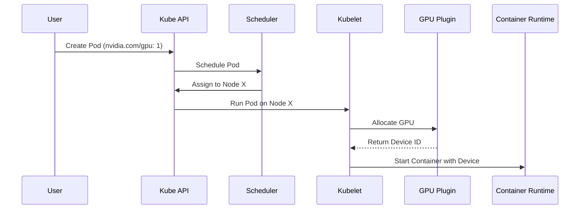

:::warning Caution
If the `nvidia-device-plugin` is not running or crashlooping, the Kubelet will fail to allocate the GPU, leaving the Pod in a `Pending` state indefinitely.
:::


### Advanced Production Considerations
When operating at scale, you must heavily monitor metrics like DCGM (Data Center GPU Manager) counters, Xid errors, and PCIe bandwidth saturation. In production, these parameters dictate your cluster's overall ROI. Ignoring PCIe topology, for instance, can lead to severe NCCL fallback, completely degrading multi-node training performance.


:::warning Caution
If the `nvidia-device-plugin` is not running or crashlooping, the Kubelet will fail to allocate the GPU, leaving the Pod in a `Pending` state indefinitely.
:::
## Senior Engineering Expansion preface (Fourth Edition, Volume 9)

**Senior NVIDIA Solutions Architect interview drills and answer patterns**

This expansion keeps the Fourth Edition teaching flow and adds the depth expected from a senior infrastructure engineer and customer-facing Solutions Architect. The emphasis is mechanism first: understand what the system is doing, observe it with concrete tools, then reason about failure, scale, reliability, performance and trade-offs.

The practitioner material used to shape the scope is a signal, not an authority. Technical behavior is anchored in official documentation and first-principles systems reasoning. Your Staff Engineer study guide contributes useful patterns around Kubernetes, observability, distributed systems, platform design and failure isolation; the NVIDIA material adds GPU systems, AI workloads, accelerated networking and customer architecture.


_Figure A. The interviewer should hear your reasoning, not only the final technology choice._


### Advanced Production Considerations
When operating at scale, you must heavily monitor metrics like DCGM (Data Center GPU Manager) counters, Xid errors, and PCIe bandwidth saturation. In production, these parameters dictate your cluster's overall ROI. Ignoring PCIe topology, for instance, can lead to severe NCCL fallback, completely degrading multi-node training performance.


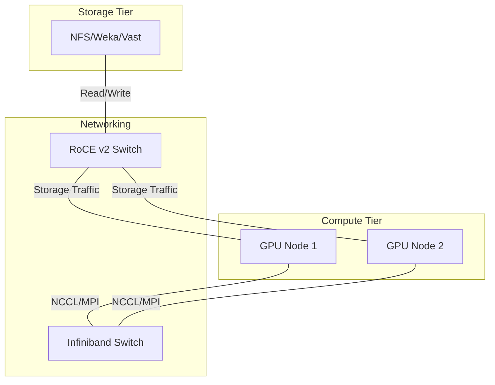

:::info Architecture Note
Separating storage traffic (often RoCE) from East-West compute traffic (Infiniband) is critical for isolating congestion events during large checkpointing operations.
:::


### Advanced Production Considerations
When operating at scale, you must heavily monitor metrics like DCGM (Data Center GPU Manager) counters, Xid errors, and PCIe bandwidth saturation. In production, these parameters dictate your cluster's overall ROI. Ignoring PCIe topology, for instance, can lead to severe NCCL fallback, completely degrading multi-node training performance.


:::info Architecture Note
Separating storage traffic (often RoCE) from East-West compute traffic (Infiniband) is critical for isolating congestion events during large checkpointing operations.
:::
## ➕ Additions

➕ **Why this chapter matters more than any single technical fact:** in a 45-minute loop, an interviewer forms most of their "senior or not" judgment from *how* you approach a question, not whether you land the exact right command on the first try. Two candidates who both eventually diagnose the same OOMKilled Pod are scored completely differently if one opens with "let me check logs" and the other opens with "first — is this one Pod, one node, or the whole Service, and did anything change recently?" This chapter is the meta-skill every other chapter in this volume assumes you already have.

➕ **The answer framework as a decision flow (memorize this shape, not the words):**
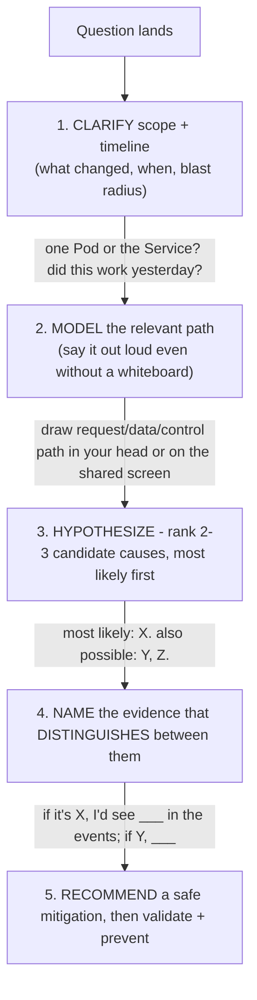
➕ **Memory hook / one-liner to recall this under pressure:** *"C-M-H-E-R — Clarify, Model, Hypothesize, name Evidence, Recommend."* If you forget everything else, the two moves that separate senior from mid-level are step 1 (clarify before diagnosing) and step 4 (name evidence that *distinguishes* hypotheses, not just evidence that confirms your first guess — confirmation-seeking is the single most common tell of a non-senior answer).

➕ **Interview-ready line — the one sentence to say when a question is intentionally vague (and NVIDIA loop questions often are, on purpose, to see if you ask):**
> "Before I pick a first command, can I clarify [scope/timeline/blast radius] — that changes which branch I go down first."
This single sentence does three things simultaneously: it signals you don't jump to conclusions, it buys you information that actually changes your answer, and it costs you nothing even if the interviewer says "assume whatever you like" — you then state your assumption explicitly instead of hiding it, which is still the senior move.

➕ **Annotated sample answer transcript — the "Pod is Pending" prompt from the Better-opening box above, extended to a full 90-second spoken answer with WHY each sentence works:**

> **Interviewer:** "A GPU Pod has been Pending for 10 minutes. Walk me through it."
>
> **Candidate:** "First I want to scope whether this is one Pod or several — if it's fleet-wide, that points at capacity or a controller problem rather than this specific Pod's spec." *(← clarify + immediately states WHY the clarification matters — not clarification for its own sake)*
>
> "Assuming it's this one Pod: since it's Pending, no container has started, so I go straight to `kubectl describe pod` and read the Events section rather than logs, which don't exist yet." *(← names the evidence source and explicitly rules out a wrong first move — logs — showing awareness of what information exists at each lifecycle stage)*
>
> "My leading hypothesis for a GPU workload specifically is resource accounting — either the `nvidia.com/gpu` request can't be satisfied by any node's allocatable, or a taint/toleration or nodeSelector for a specific GPU SKU doesn't match. My second hypothesis is PVC binding if this job needs a volume with topology constraints." *(← ranks hypotheses, and ties the ranking to GPU-specific realism instead of generic Kubernetes trivia — this is what makes it read as SA-for-AI-infra rather than generic K8s admin)*
>
> "The `FailedScheduling` event message will directly distinguish these — it names the predicate that failed, e.g. 'Insufficient nvidia.com/gpu' versus a taint mismatch versus volume node affinity conflict." *(← names the exact evidence and what it looks like for each branch — this is the step most candidates skip)*
>
> "If it's capacity and autoscaler is enabled, I'd check whether any node group the autoscaler can create actually satisfies the GPU type/taint/topology — autoscaler isn't a blanket fix for unschedulable constraints." *(← foreshadows Chapter 4's worked scenario, shows the candidate already knows the common trap)*

➕ **Why this works, summarized:** every sentence either (a) narrows the hypothesis space, (b) names a concrete artifact (event, field, message) that will be checked, or (c) states the reasoning connecting evidence to conclusion. Nothing in the transcript is a command dump with no narration.

➕ **Extra worked scenario (new, not in the original source) — applying the framework to a question that isn't troubleshooting at all, to prove the framework generalizes:**
> **Prompt:** "A customer asks: 'Should we use MIG or time-slicing for our inference fleet?' You have 30 seconds before you need to say something."
> 1. **Clarify:** "Is isolation/predictability more important than density here, and do you know your per-request memory footprint?" — even a rhetorical clarify, spoken aloud, buys you time and shows you didn't jump to a technology name.
> 2. **Model:** briefly state what each mechanism actually does at the hardware level — MIG partitions SM/memory/cache into hardware-isolated instances; time-slicing shares the whole GPU with context-switch overhead and no memory isolation.
> 3. **Hypothesize:** "If your workloads are latency-sensitive and multi-tenant, MIG's isolation is probably worth the fixed-partition inflexibility. If they're bursty and same-tenant, time-slicing's flexibility probably wins."
> 4. **Evidence:** "The number that actually decides this is measured P99 latency variance under co-located load in a PoC — not a spec sheet."
> 5. **Recommend:** "I'd default to recommending a short PoC measuring exactly that before committing either way."
> **Interview-ready line:** "I can give you a default lean, but the actual answer is benchmark-derived, not opinion-derived — and I'd say that sentence out loud even if the interviewer pushes for a single word answer."

➕ **Common failure modes to explicitly avoid (say what NOT to do, because naming the anti-pattern out loud is itself a senior signal):**
- Command-dumping: reciting `kubectl get`, `describe`, `logs`, `top` in sequence with no stated hypothesis between them.
- False confidence: picking one cause and defending it instead of naming what would falsify it.
- Silence under ambiguity: not stating the assumption you're making when the interviewer refuses to clarify — always narrate the assumption instead of guessing silently.
- Jumping to the mitigation before evidence: "restart it" without having named why that's safe (idempotent? stateful? will it recur?).


### Advanced Production Considerations
When operating at scale, you must heavily monitor metrics like DCGM (Data Center GPU Manager) counters, Xid errors, and PCIe bandwidth saturation. In production, these parameters dictate your cluster's overall ROI. Ignoring PCIe topology, for instance, can lead to severe NCCL fallback, completely degrading multi-node training performance.


:::tip Pro-Tip
Always visualize the request lifecycle when troubleshooting latency. The gap between `API Gateway` and `Triton Pods` is often where network jitter is introduced.
:::


### Advanced Production Considerations
When operating at scale, you must heavily monitor metrics like DCGM (Data Center GPU Manager) counters, Xid errors, and PCIe bandwidth saturation. In production, these parameters dictate your cluster's overall ROI. Ignoring PCIe topology, for instance, can lead to severe NCCL fallback, completely degrading multi-node training performance.


:::tip Pro-Tip
Always visualize the request lifecycle when troubleshooting latency. The gap between `API Gateway` and `Triton Pods` is often where network jitter is introduced.
:::
## Practice
➕ 1. Take the "Bad opening" line from the original box above and rewrite it live, out loud, timed to 20 seconds, using the C-M-H-E-R shape. Record yourself — most candidates are shocked how much filler ("um, so basically") disappears once the shape is memorized.
➕ 2. Pick any Chapter 3-9 worked scenario in this volume and, before reading its steps, run your own C-M-H-E-R pass cold. Compare your hypothesis ranking against the book's — where you diverge is your study gap, not a wrong answer.

➕ **Visual model — expose the reasoning chain, not a memorized conclusion:**
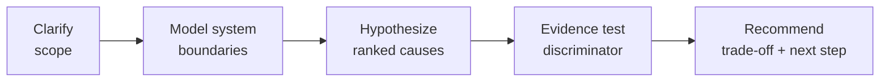
**Memory hook:** *"Question first, mechanism second, answer last."*
---
title: "Chapter 2 - Python coding interview workflow"
slug: "chapter-2-python-coding-interview-workflow"
sidebar_position: 2
description: "Chapter 2 - Python coding interview workflow — JR2018680 Interview Preparation."
source_document: "Volume_09_JR2018680_Interview_Preparation(2).docx"
---
> Learning outcome Turn an infrastructure problem into algorithm, data structures, functions, tests and edge cases before production hardening.

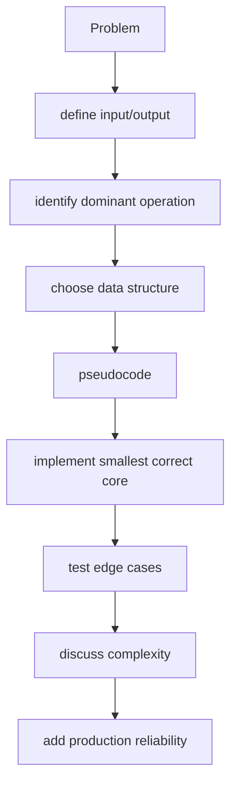

Example prompt: "Parse a large log and report ERROR/CRITICAL counts by service." Say: stream file line-by-line; regex or structured parser extracts severity/service; Counter[str] aggregates; skip/track malformed lines; O(n) time and O(k) memory where k is number of services, not number of lines.

```python
from collections import Counter
from collections.abc import Iterable
import re

EVENT = re.compile(r"level=(ERROR|CRITICAL).*service=([\w-]+)")

def count_errors(lines: Iterable[str]) -> Counter[str]:
    counts: Counter[str] = Counter()
    for line in lines:
        match = EVENT.search(line)
        if match:
            counts[match.group(2)] += 1
    return counts
```

Then discuss malformed input, memory, testing, structured logs, and whether JSON output would be more reliable than regex when available. Do not start by inventing classes or concurrency before the core algorithm is correct.


### Advanced Production Considerations
When operating at scale, you must heavily monitor metrics like DCGM (Data Center GPU Manager) counters, Xid errors, and PCIe bandwidth saturation. In production, these parameters dictate your cluster's overall ROI. Ignoring PCIe topology, for instance, can lead to severe NCCL fallback, completely degrading multi-node training performance.


:::warning Caution
If the `nvidia-device-plugin` is not running or crashlooping, the Kubelet will fail to allocate the GPU, leaving the Pod in a `Pending` state indefinitely.
:::


### Advanced Production Considerations
When operating at scale, you must heavily monitor metrics like DCGM (Data Center GPU Manager) counters, Xid errors, and PCIe bandwidth saturation. In production, these parameters dictate your cluster's overall ROI. Ignoring PCIe topology, for instance, can lead to severe NCCL fallback, completely degrading multi-node training performance.


:::warning Caution
If the `nvidia-device-plugin` is not running or crashlooping, the Kubelet will fail to allocate the GPU, leaving the Pod in a `Pending` state indefinitely.
:::
## ➕ Additions

➕ **The workflow as a decision flow (the "say this before you type anything" checklist):**
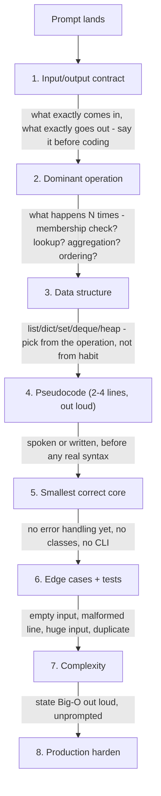
➕ **Memory hook:** *"IDDPS-ECP — I Don't Dive Prematurely, Structure/Edge/Complexity/Production."* Or simpler: **"contract → dominant op → structure → pseudocode → core → edges → Big-O → harden."** The two steps candidates skip under pressure are #1 (they start coding before agreeing what "input" even is) and #7 (they never state complexity unless asked) — both are free points if you just say them.

➕ **Interview-ready line to open ANY coding prompt with, verbatim:**
> "Before I write anything — what's the expected input size and is this a one-shot script or something that runs continuously against a live stream? That changes whether I optimize for peak memory or just correctness."
This single question also does double duty: it's a legitimate technical question (streaming vs batch materially changes the design) and it buys 10-15 seconds to actually think.

➕ **Annotated sample transcript — talking through the `count_errors` function from the original chapter, as if live-coding:**

> "The input is an iterable of log lines — I'll type it as `Iterable[str]`, not `list[str]`, specifically so this works against a generator reading a file line-by-line without loading it all into memory." *(← states WHY the type hint choice matters — this is the "production reliability" step arriving early, not bolted on)*
>
> "The dominant operation is 'extract two fields, then count' — that's a `Counter` keyed by service, O(1) increment per line, so the whole thing is O(n) in lines and O(k) in memory where k is distinct services — that's the part worth saying out loud before anyone asks." *(← unprompted complexity statement)*
>
> "I'll use `search` not `match` because the level/service tokens can appear anywhere in the line, not just at the start — that's a small but real correctness detail." *(← a subtle regex-API distinction that shows real familiarity, not memorized boilerplate)*
>
> "Edge cases: a line with no match — right now it's silently skipped, which is a decision I should flag, not hide. In production I'd want a `malformed_count` so silent data loss doesn't happen invisibly." *(← names a real production gap, and proposes the fix instead of just admitting the gap)*

➕ **Extra worked scenario (new, beyond the original) — bounded concurrent API polling, a realistic NVIDIA-SA-relevant task:**
> **Prompt:** "You have 200 GPU node hostnames. Query each node's `/metrics` health endpoint over HTTP with a 2-second timeout, and return a dict of hostname → status ('ok'/'timeout'/'error'). Don't take 200×2s to finish."
> **Model answer, following the workflow:**
> - **Input/output:** `list[str]` hostnames in, `dict[str, str]` status out.
> - **Dominant operation:** many independent I/O-bound calls — this is a concurrency problem, not an algorithmic one.
> - **Data structure:** plain dict for results; a bounded semaphore or thread/async pool to cap concurrency (querying 200 nodes with unbounded concurrency can itself DoS a monitoring endpoint).
> ```python
> import asyncio
> import httpx
>
> async def check_node(client: httpx.AsyncClient, host: str, sem: asyncio.Semaphore) -> tuple[str, str]:
>     async with sem:
>         try:
>             resp = await client.get(f"http://{host}/metrics", timeout=2.0)
>             return host, "ok" if resp.status_code == 200 else "error"
>         except httpx.TimeoutException:
>             return host, "timeout"
>         except httpx.HTTPError:
>             return host, "error"
>
> async def check_all(hosts: list[str], max_concurrency: int = 20) -> dict[str, str]:
>     sem = asyncio.Semaphore(max_concurrency)
>     async with httpx.AsyncClient() as client:
>         results = await asyncio.gather(*(check_node(client, h, sem) for h in hosts))
>     return dict(results)
> ```
> - **Edge cases:** duplicate hostnames (dict naturally collapses them — flag this explicitly rather than let it be silent), DNS failure vs connection refused vs timeout (distinguished by exception type, not lumped into one "error"), empty host list.
> - **Complexity:** wall-clock roughly `ceil(200/20) × 2s` worst case ≈ 20s instead of a naive serial 400s — this is the number to say out loud, because it's the actual point of the exercise.
> - **Production hardening:** exponential backoff + one retry for `timeout` specifically (transient), structured logging of which hosts failed and why, and a circuit-breaker if failure rate crosses a threshold (stop hammering a node that's clearly down).
> **Interview-ready line:** "The algorithmic complexity here is trivial — the actual engineering question is concurrency bound and failure-mode granularity, and that's what I'd spend the remaining time discussing."


### Advanced Production Considerations
When operating at scale, you must heavily monitor metrics like DCGM (Data Center GPU Manager) counters, Xid errors, and PCIe bandwidth saturation. In production, these parameters dictate your cluster's overall ROI. Ignoring PCIe topology, for instance, can lead to severe NCCL fallback, completely degrading multi-node training performance.


:::info Architecture Note
Separating storage traffic (often RoCE) from East-West compute traffic (Infiniband) is critical for isolating congestion events during large checkpointing operations.
:::


### Advanced Production Considerations
When operating at scale, you must heavily monitor metrics like DCGM (Data Center GPU Manager) counters, Xid errors, and PCIe bandwidth saturation. In production, these parameters dictate your cluster's overall ROI. Ignoring PCIe topology, for instance, can lead to severe NCCL fallback, completely degrading multi-node training performance.


:::info Architecture Note
Separating storage traffic (often RoCE) from East-West compute traffic (Infiniband) is critical for isolating congestion events during large checkpointing operations.
:::
## Practice
➕ 3. Rewrite `summarize()` so that instead of silently `continue`-ing on a non-matching line, it also returns a count of malformed lines, without changing the function's primary return type (hint: use a mutable counter object passed in, or return a tuple/small dataclass — discuss the tradeoff between the two out loud).
➕ 4. Take the concurrent-polling scenario above and add a hard 30-second overall deadline across all 200 hosts regardless of individual timeouts — explain how `asyncio.wait_for` around the whole `gather` changes the failure semantics for hosts that were still in-flight when the deadline hit.

➕ **Visual model — narrate before code:**
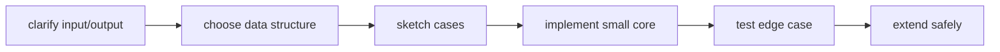
**Memory hook:** *"Shape before syntax."* Interviewers can correct an exposed plan; they cannot infer a hidden one from a rushed implementation.
---
title: "Chapter 8 - The Solutions Architecture Whiteboard Masterclass"
slug: "chapter-8-solutions-architecture-whiteboard-method"
sidebar_position: 8
description: "The official NVIDIA Solutions Architecture whiteboard framework: 4-phase delivery model, 512-DGX AI Factory blueprint, compute/network/storage sizing, and senior interview scoring rubrics."
source_document: "Volume_09_JR2018680_Interview_Preparation(2).docx"
---


In an **NVIDIA Senior Solutions Architect** interview, the **Whiteboard Architecture Session** is the most heavily weighted evaluation block. The interview panel will present an intentionally ambiguous, multi-million dollar customer challenge, such as:

> *"Design an enterprise AI Factory for a sovereign nation or Fortune 50 enterprise deploying 512 DGX H100 servers (4,096 GPUs). The platform must support foundation model pre-training (405B parameters) while concurrently serving mission-critical real-time inference with sub-second SLAs."*

Junior candidates fail by immediately jumping to the whiteboard and drawing random boxes labeled "Kubernetes", "Docker", or "vLLM". 

An **NVIDIA Senior Solutions Architect** commands the room by executing a structured, **4-Phase Architectural Delivery Model**:
1. **Requirements Discovery & Boundary Extraction** (First 5–7 minutes)
2. **Multi-Tier Architectural Blueprint & Data Paths** (15–20 minutes)
3. **Deep Subsystem Engineering & Trade-Off Defenses** (10–15 minutes)
4. **Day-2 Operations, Failure Modes, and PoC Verification Gates** (5 minutes)

---


### Advanced Production Considerations
When operating at scale, you must heavily monitor metrics like DCGM (Data Center GPU Manager) counters, Xid errors, and PCIe bandwidth saturation. In production, these parameters dictate your cluster's overall ROI. Ignoring PCIe topology, for instance, can lead to severe NCCL fallback, completely degrading multi-node training performance.


### Advanced Production Considerations
When operating at scale, you must heavily monitor metrics like DCGM (Data Center GPU Manager) counters, Xid errors, and PCIe bandwidth saturation. In production, these parameters dictate your cluster's overall ROI. Ignoring PCIe topology, for instance, can lead to severe NCCL fallback, completely degrading multi-node training performance.
## 1. Phase 1: Requirements Discovery & Boundary Extraction

Never draw a single box until you have clarified the operational and physical boundaries. Open the session with an authoritative framing:

> *"Before I draw the architecture, I need to understand the physical, workload, and organizational constraints. May I ask five targeted discovery questions?"*

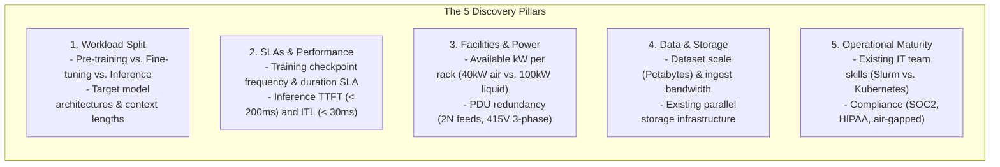

### The "Assumed Parameters" for the Whiteboard:
If the interviewer replies: *"Assume you have a modern data center and standard enterprise requirements,"* state your assumed architectural baseline aloud before drawing:
1. **Cluster Size:** 512x NVIDIA DGX H100 systems (4,096 H100 SXM5 GPUs).
2. **Workload Allocation:** 75% capacity (384 nodes / 3,072 GPUs) dedicated to Foundation Pre-training; 25% capacity (128 nodes / 1,024 GPUs) dedicated to fine-tuning, RAG, and real-time inference.
3. **Power Budget:** ~10.2 kW per DGX H100 (approximately 5.2 MW compute IT load), packaged at 4 DGX nodes per 45U rack (~42 kW per rack) requiring direct rear-door heat exchangers (RDHx) or liquid cooling.

---


### Advanced Production Considerations
When operating at scale, you must heavily monitor metrics like DCGM (Data Center GPU Manager) counters, Xid errors, and PCIe bandwidth saturation. In production, these parameters dictate your cluster's overall ROI. Ignoring PCIe topology, for instance, can lead to severe NCCL fallback, completely degrading multi-node training performance.


### Advanced Production Considerations
When operating at scale, you must heavily monitor metrics like DCGM (Data Center GPU Manager) counters, Xid errors, and PCIe bandwidth saturation. In production, these parameters dictate your cluster's overall ROI. Ignoring PCIe topology, for instance, can lead to severe NCCL fallback, completely degrading multi-node training performance.
## 2. Phase 2: The Multi-Tier AI Factory Blueprint

Draw the system from the physical ground up, dividing the architecture into five coordinated planes:

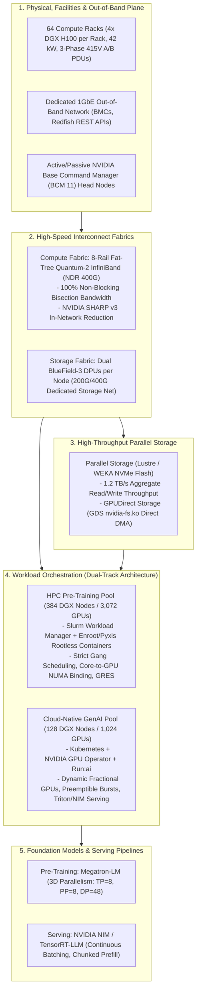

---


### Advanced Production Considerations
When operating at scale, you must heavily monitor metrics like DCGM (Data Center GPU Manager) counters, Xid errors, and PCIe bandwidth saturation. In production, these parameters dictate your cluster's overall ROI. Ignoring PCIe topology, for instance, can lead to severe NCCL fallback, completely degrading multi-node training performance.


### Advanced Production Considerations
When operating at scale, you must heavily monitor metrics like DCGM (Data Center GPU Manager) counters, Xid errors, and PCIe bandwidth saturation. In production, these parameters dictate your cluster's overall ROI. Ignoring PCIe topology, for instance, can lead to severe NCCL fallback, completely degrading multi-node training performance.
## 3. Phase 3: Deep Technical Subsystem Defenses

During the whiteboard walkthrough, proactively address the three hardest architectural trade-offs:

### 1. The Dual-Track Orchestrator: Why Slurm AND Kubernetes?
**The Trade-Off:** Customers often want a single orchestrator.
**The SA Defense:**
- **For 3,072-GPU Foundation Pre-Training (Slurm):** Pre-training requires synchronized gang-scheduling across thousands of ranks. Kubernetes' `kubelet`, `containerd`, and CNI background daemon threads introduce **CPU scheduling jitter**, causing microsecond delays during NCCL All-Reduce barriers. Slurm with **Enroot/Pyxis** is daemonless, unprivileged, and guarantees zero core jitter.
- **For 1,024-GPU Inference & Fine-Tuning (Kubernetes + Run:ai):** Inference requires dynamic HTTP ingress, horizontal pod autoscaling, canary rollouts, and microservice APIs. Run:ai adds **fractional GPU slicing** and over-quota preemption, allowing hundreds of data scientists to share GPUs without hardware partitioning.
- **Elastic Reallocation via BCM:** Because both pools run on bare-metal managed by **NVIDIA Base Command Manager (BCM)**, nodes are not permanently locked. If pre-training finishes, an administrator can reassign 128 nodes from Slurm to the Kubernetes category in minutes via `cmsh`.

---

### 2. Checkpoint Storage SLA: GPUDirect Storage (GDS)
**The Problem:** A 405B parameter model in FP8 produces a ~500 GB checkpoint file (weights, optimizer states, scheduler state). Across 384 nodes, saving a checkpoint generates **192 Terabytes of data**.
- **Without GDS:** Bouncing 192 TB through CPU memory locks the host system bus, stalling GPUs for 15 minutes every checkpoint.
- **With GPUDirect Storage (GDS):** ConnectX-7 adapters write directly from GPU HBM into NVMe-oF parallel storage (WEKA / Lustre) at **40 GB/s per node**:
```text
Checkpoint Duration = 500 GB / 40 GB/s = 12.5 seconds!
```
- Training resumes in under 15 seconds, saving hundreds of thousands of dollars in idling compute capacity.

---

### 3. Compute Interconnect: 8-Rail Quantum-2 InfiniBand
**The Architecture:**
- Each DGX H100 contains 8x ConnectX-7 400 Gbps HCAs.
- Each HCA connects to an independent **Leaf Switch Rail** (Rails 0 through 7).
- In an All-Reduce collective, GPU 0 across all nodes exchanges data strictly across Rail 0, eliminating cross-rail packet collisions.
- **NVIDIA SHARP v3**: In-network reduction engines inside the Quantum-2 switch ASICs perform tensor additions directly in the fabric, reducing inter-switch bandwidth by 50%.

---


### Advanced Production Considerations
When operating at scale, you must heavily monitor metrics like DCGM (Data Center GPU Manager) counters, Xid errors, and PCIe bandwidth saturation. In production, these parameters dictate your cluster's overall ROI. Ignoring PCIe topology, for instance, can lead to severe NCCL fallback, completely degrading multi-node training performance.


### Advanced Production Considerations
When operating at scale, you must heavily monitor metrics like DCGM (Data Center GPU Manager) counters, Xid errors, and PCIe bandwidth saturation. In production, these parameters dictate your cluster's overall ROI. Ignoring PCIe topology, for instance, can lead to severe NCCL fallback, completely degrading multi-node training performance.
## 4. Phase 4: Day-2 Operations and PoC Acceptance Gates

End the whiteboard session by demonstrating operational maturity: how this platform will be maintained and qualified.

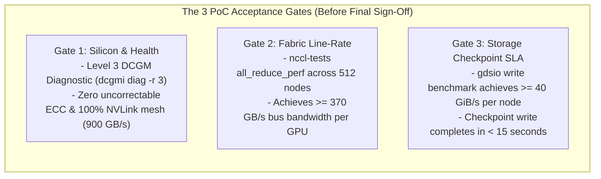

### The Maintenance Policy:
- **Zero-Downtime Rollouts:** Platform updates follow the **4-Ring Canary Architecture** (Ring 0 Lab $\to$ Ring 1 Rail Canary $\to$ Ring 2 Switch Wave $\to$ Ring 3 Fleet Batches).
- **Automated Health Gating:** Slurm `Prolog` scripts run a 5-second DCGM Level 1 check before every job step. Damaged nodes are automatically drained before jobs can land on them.

---


### Advanced Production Considerations
When operating at scale, you must heavily monitor metrics like DCGM (Data Center GPU Manager) counters, Xid errors, and PCIe bandwidth saturation. In production, these parameters dictate your cluster's overall ROI. Ignoring PCIe topology, for instance, can lead to severe NCCL fallback, completely degrading multi-node training performance.


### Advanced Production Considerations
When operating at scale, you must heavily monitor metrics like DCGM (Data Center GPU Manager) counters, Xid errors, and PCIe bandwidth saturation. In production, these parameters dictate your cluster's overall ROI. Ignoring PCIe topology, for instance, can lead to severe NCCL fallback, completely degrading multi-node training performance.
## 5. Senior Solutions Architect Interview Scenarios

### Scenario 1: Handling Executive Pushback on Architecture Cost
**Interviewer:** *"The customer's CFO pushes back: 'Your architecture specifies 8 InfiniBand switches per leaf and expensive parallel NVMe storage. Can't we save $10M by using 100G commodity Ethernet and our existing enterprise NAS?' How do you respond?"*

**Candidate Answer:**
> "I address the CFO's concern by analyzing **Total Cost of Ownership (TCO) and Capital Efficiency**:
> 1. **Quantifying the Capital Waste:**
>    - 512 DGX H100 servers represent an asset worth over $150M. The operational cost of this cluster is dominated by GPU capital depreciation and data center power (5.2 MW).
>    - If we downgrade the interconnect to commodity 100G Ethernet, NCCL All-Reduce step times increase by 4x. Overall foundation pre-training throughput will drop by **40% to 50%**.
>    - Dropping throughput by 40% on a $150M cluster is equivalent to **destroying $60M of compute utility** to save $10M on networking!
> 2. **The Storage Bottleneck:**
>    - Standard enterprise NAS lacks GPUDirect Storage (GDS). Saving a 192 TB distributed checkpoint over NFS will take 15 to 20 minutes instead of 12 seconds.
>    - Checkpointing every 2 hours would mean the entire $150M cluster spends **15% of its entire operating life completely idle** waiting for disk writes.
> 3. **The Recommendation:**
>    The Quantum-2 8-rail InfiniBand fabric and GDS parallel storage are not luxury options—they are the essential enabling infrastructure that ensures the $150M GPU asset operates at 95%+ computational efficiency."

---


### Advanced Production Considerations
When operating at scale, you must heavily monitor metrics like DCGM (Data Center GPU Manager) counters, Xid errors, and PCIe bandwidth saturation. In production, these parameters dictate your cluster's overall ROI. Ignoring PCIe topology, for instance, can lead to severe NCCL fallback, completely degrading multi-node training performance.


### Advanced Production Considerations
When operating at scale, you must heavily monitor metrics like DCGM (Data Center GPU Manager) counters, Xid errors, and PCIe bandwidth saturation. In production, these parameters dictate your cluster's overall ROI. Ignoring PCIe topology, for instance, can lead to severe NCCL fallback, completely degrading multi-node training performance.
## Key Takeaways

1. **Discover Before You Draw:** Always extract workload splits, SLAs, facilities (power/cooling kW), storage scale, and team maturity before drawing architecture.
2. **Dual-Track Orchestration is Standard:** Deploy Slurm + Enroot for foundation pre-training to eliminate CPU daemon jitter; deploy Kubernetes + Run:ai for agile multi-tenant inference and fine-tuning.
3. **8-Rail InfiniBand Prevents Contention:** ConnectX-7 HCAs map 1:1 to independent switch rails, isolating GPU-to-GPU traffic during distributed All-Reduce steps.
4. **GDS Protects Checkpoint SLAs:** GPUDirect Storage enables direct DMA between NVMe-oF arrays and GPU HBM, shrinking multi-terabyte checkpoint durations from minutes to seconds.
5. **Frame Architecture in TCO and Efficiency:** Defend high-performance networking and storage by proving that saving money on infrastructure destroys the compute efficiency of the multi-million dollar GPU investment.
---
title: "Chapter 9 - Customer Discovery and Technical Qualification"
slug: "chapter-9-customer-discovery-interview"
sidebar_position: 9
description: "Mastering customer discovery for NVIDIA Senior Solutions Architects: the 6-tier discovery funnel, industry playbooks (Sovereign AI, FinTech, BioTech), and reframing premature premises."
source_document: "Volume_09_JR2018680_Interview_Preparation(2).docx"
---

# Chapter 9 — Customer Discovery and Technical Qualification

In an **NVIDIA Senior Solutions Architect** interview, technical knowledge alone is insufficient. An SA is a trusted technical advisor who bridges customer business strategy and NVIDIA's accelerated computing platforms. Customers rarely arrive with well-formed, mathematically sound infrastructure specifications. More often, they present premature conclusions: *"We need 128 H100s on-prem because of security,"* or *"We want to build our entire LLM platform on standard Ethernet with Kubernetes."*

Junior engineers take customer statements literally and immediately draft a bill of materials. An **NVIDIA Senior Solutions Architect** uses consultative discovery to uncover hidden constraints, separate business requirements from technical misconceptions, and guide the customer toward an optimal, future-proof AI Factory architecture.

---


### Advanced Production Considerations
When operating at scale, you must heavily monitor metrics like DCGM (Data Center GPU Manager) counters, Xid errors, and PCIe bandwidth saturation. In production, these parameters dictate your cluster's overall ROI. Ignoring PCIe topology, for instance, can lead to severe NCCL fallback, completely degrading multi-node training performance.


### Advanced Production Considerations
When operating at scale, you must heavily monitor metrics like DCGM (Data Center GPU Manager) counters, Xid errors, and PCIe bandwidth saturation. In production, these parameters dictate your cluster's overall ROI. Ignoring PCIe topology, for instance, can lead to severe NCCL fallback, completely degrading multi-node training performance.
## 1. The 6-Tier Customer Discovery Funnel

Discovery is not an interrogation. It is a systematic funnel that moves from high-level business objectives down to concrete engineering constraints:

```mermaid
flowchart TD
    A["1. Business Outcome & Strategic Mandate (Why does this project exist?)"]
    B["2. Workload Taxonomy & Performance SLOs (What does success look like?)"]
    C["3. Current-State Architecture & Baseline (What exists today and where is the pain?)"]
    D["4. Constraints (Facilities, Power kW, Cooling, Compliance, IT Skills)"]
    E["5. Risk Landscape & Failure Boundaries (What makes this project fail?)"]
    F["6. Decision Architecture & PoC Qualification Gate (The Actionable Proposal)"]

    A --> B --> C --> D --> E --> F
```

### The "Premise Challenge" Framework

When a customer presents an unverified assumption, never argue directly. Use **Inquiry-Driven Reframing**:

| Customer Premise | The Underlying Architectural Risk | The Senior SA Reframing Question |
|---|---|---|
| *"We want to run all distributed pre-training in Kubernetes because our DevOps team already knows it."* | Daemon CPU context-switching will cause scheduling jitter and stall NCCL collective barriers across 512 GPUs. | *"Kubernetes is fantastic for microservices. For your multi-node pre-training, have you modeled how background daemon threads and CNI layers impact NCCL All-Reduce latency? Let's discuss a dual-track architecture with BCM that provides Kubernetes agility alongside daemonless Slurm efficiency."* |
| *"We want to use our existing enterprise 100G Ethernet core switch for GPU compute."* | ECMP hash collisions on elephant flows and packet drops will destroy training throughput. | *"Standard Ethernet was designed for web traffic with millions of small mice flows. AI All-Reduce generates large elephant flows that cause hash collisions on ECMP uplinks. What is your tolerance for 40% slower training epochs, or should we evaluate Spectrum-X with dynamic packet spraying?"* |
| *"We need 64 GPUs on-prem strictly for security and data privacy."* | The customer may not have considered facilities (60 kW power delivery, liquid cooling, high-voltage PDUs). | *"Data sovereignty is paramount. To ensure your on-prem data center is ready: what is your current power envelope per rack (kW)? Are your facilities team prepared for 40kW air cooling or direct liquid cooling loops?"* |

---


### Advanced Production Considerations
When operating at scale, you must heavily monitor metrics like DCGM (Data Center GPU Manager) counters, Xid errors, and PCIe bandwidth saturation. In production, these parameters dictate your cluster's overall ROI. Ignoring PCIe topology, for instance, can lead to severe NCCL fallback, completely degrading multi-node training performance.


### Advanced Production Considerations
When operating at scale, you must heavily monitor metrics like DCGM (Data Center GPU Manager) counters, Xid errors, and PCIe bandwidth saturation. In production, these parameters dictate your cluster's overall ROI. Ignoring PCIe topology, for instance, can lead to severe NCCL fallback, completely degrading multi-node training performance.
## 2. Industry-Specific Discovery Playbooks

An NVIDIA Solutions Architect must seamlessly tailor their discovery approach to the customer's industry vertical:

### 1. Sovereign AI & Government Infrastructure
- **Core Drivers:** National data residency, indigenous language foundation models (LLMs), local data centers, supply chain independence.
- **Critical Discovery Inquiries:**
  1. *Classification Boundaries:* Must the cluster operate in a 100% air-gapped environment without external internet access for license servers or container registries?
  2. *Supply Chain & Hardware Standards:* Are there specific hardware Root-of-Trust (RoT) requirements or national cryptographic standards for firmware attestation?
  3. *Multi-Agency Tenancy:* Will multiple government ministries share the infrastructure, requiring hard cryptographically isolated partitions (MIG, VLANs, Slurm QoS accounts)?

---

### 2. Financial Services (Hedge Funds & Tier-1 Banks)
- **Core Drivers:** Ultra-low latency inference, high-frequency trading (HFT) risk modeling, fraud detection, deterministic training SLAs, strict regulatory audits (SOC2, FINRA).
- **Critical Discovery Inquiries:**
  1. *Deterministic Latency SLAs:* What is the strict P99.9 latency limit for trading signals or fraud evaluation? (e.g., sub-10ms vs. batch overnight).
  2. *Data Encryption in Transit:* Does compliance mandate line-rate MACsec or IPsec encryption across the InfiniBand/Ethernet fabric, and have you factored in the hardware crypto overhead?
  3. *Auditability & Checkpoint Retention:* How long must historical model checkpoints and training logs be preserved for regulatory audit compliance?

---

### 3. Healthcare, Life Sciences, and BioTech
- **Core Drivers:** Cryo-EM image processing, molecular dynamics, genomic sequencing, AlphaFold protein structure prediction, HIPAA compliance.
- **Critical Discovery Inquiries:**
  1. *I/O Ingestion Bottlenecks:* Genomic pipelines process millions of small files; Cryo-EM produces massive multi-terabyte raw TIFF streams. Does the storage backend support **GPUDirect Storage (GDS)** to prevent CPU host memory bottlenecks?
  2. *Batch Job Volatility:* Are workloads bursty (e.g., sequencing runs finishing in unpredictable waves), requiring dynamic fairshare queueing and automated over-quota preemption?

---


### Advanced Production Considerations
When operating at scale, you must heavily monitor metrics like DCGM (Data Center GPU Manager) counters, Xid errors, and PCIe bandwidth saturation. In production, these parameters dictate your cluster's overall ROI. Ignoring PCIe topology, for instance, can lead to severe NCCL fallback, completely degrading multi-node training performance.


### Advanced Production Considerations
When operating at scale, you must heavily monitor metrics like DCGM (Data Center GPU Manager) counters, Xid errors, and PCIe bandwidth saturation. In production, these parameters dictate your cluster's overall ROI. Ignoring PCIe topology, for instance, can lead to severe NCCL fallback, completely degrading multi-node training performance.
## 3. Senior Solutions Architect Interview Scenarios

### Scenario 1: Uncovering Hidden Constraints in an Enterprise GenAI PoC
**Interviewer:** *"A Fortune 500 retail customer tells you they have budget to buy 64 DGX H100 servers for customer-facing LLM chatbots. They want to start a 30-day hardware Proof of Concept (PoC) next week. How do you lead this discovery meeting?"*

**Candidate Answer:**
> "I structure this discovery session to protect both the customer and NVIDIA from a high-cost failed deployment:
> 1. **Qualify the Facilities Reality (The Silent Blocker):**
>    - 64 DGX H100 systems draw **~650 kW of continuous IT power** (~800 kW including cooling).
>    - I ask: *'Where do you plan to rack these 64 servers next week? What is the maximum power density per rack in that facility? Does the room support 40kW per rack with chilled water loops or rear-door heat exchangers?'*
>    - If their enterprise data center caps out at 10 kW per rack, racking 64 DGX servers physically cannot happen next week. We must explore a colocation partner or DGX Cloud hosting while their data center is retrofitted.
> 2. **Extract Workload Metrics:**
>    - *'What model architectures are you serving? What are your target concurrent users, context lengths, and P99 latency SLOs?'*
>    - If they are only serving a 7B parameter chatbot for internal testing, 64 DGX H100s (512 GPUs) is wildly oversized. Sizing properly builds customer trust.
> 3. **Establish a Qualified PoC Gate:**
>    - We never ship hardware for an undefined 'test'. I define strict, measurable acceptance criteria:
>      *'In this 30-day PoC, we will validate that TensorRT-LLM on a single DGX H100 node achieves 400 requests/sec with a P99 TTFT under 180 ms on your proprietary customer support dataset. Upon hitting this metric, we move to full phase-1 deployment.'*"

---


### Advanced Production Considerations
When operating at scale, you must heavily monitor metrics like DCGM (Data Center GPU Manager) counters, Xid errors, and PCIe bandwidth saturation. In production, these parameters dictate your cluster's overall ROI. Ignoring PCIe topology, for instance, can lead to severe NCCL fallback, completely degrading multi-node training performance.


### Advanced Production Considerations
When operating at scale, you must heavily monitor metrics like DCGM (Data Center GPU Manager) counters, Xid errors, and PCIe bandwidth saturation. In production, these parameters dictate your cluster's overall ROI. Ignoring PCIe topology, for instance, can lead to severe NCCL fallback, completely degrading multi-node training performance.
## Key Takeaways

1. **Discovery Precedes Architecture:** Never design a system from a customer's premature technical conclusions; drill down the 6-tier discovery funnel to identify real business constraints.
2. **Reframe Rather Than Argue:** Use inquiry-driven reframing to help customers realize why commodity Ethernet or single-orchestrator topologies threaten their AI milestones.
3. **Power and Facilities are the #1 Blocker:** Always qualify power density (kW/rack) and cooling infrastructure before discussing software stacks.
4. **Tailor to the Vertical:** Sovereign AI demands data residency and air-gapping; FinTech demands deterministic P99 latency and encryption; BioTech demands extreme GDS storage throughput.
5. **Always Bind PoCs to Measurable Gates:** Define explicit throughput and latency thresholds before committing hardware to a Proof of Concept.
---
title: "Chapter 10 - Behavioral Leadership and Stakeholder Storytelling"
slug: "chapter-10-behavioral-and-stakeholder-stories"
sidebar_position: 10
description: "High-impact behavioral interview frameworks for NVIDIA Senior Solutions Architects: executive STAR stories, incident leadership, technical disagreements, and failure ownership."
source_document: "Volume_09_JR2018680_Interview_Preparation(2).docx"
---

# Chapter 10 — Behavioral Leadership and Stakeholder Storytelling

At NVIDIA, a **Senior Solutions Architect** is evaluated not only on deep technical acumen but also on leadership under pressure, cross-functional stakeholder influence, customer empathy, and intellectual honesty. In an interview, behavioral questions are designed to uncover how you handle multi-million dollar outages, navigate intense technical conflicts with customer executives, recover from failures, and drive customer adoption of complex architectures.

Junior engineers tell behavioral stories like laundry lists of tasks. An **NVIDIA Senior Solutions Architect** frames behavioral responses using the **Executive STAR Framework**, where the technical decision-making, trade-offs, and quantified business impact form the center of the narrative.

---


### Advanced Production Considerations
When operating at scale, you must heavily monitor metrics like DCGM (Data Center GPU Manager) counters, Xid errors, and PCIe bandwidth saturation. In production, these parameters dictate your cluster's overall ROI. Ignoring PCIe topology, for instance, can lead to severe NCCL fallback, completely degrading multi-node training performance.


### Advanced Production Considerations
When operating at scale, you must heavily monitor metrics like DCGM (Data Center GPU Manager) counters, Xid errors, and PCIe bandwidth saturation. In production, these parameters dictate your cluster's overall ROI. Ignoring PCIe topology, for instance, can lead to severe NCCL fallback, completely degrading multi-node training performance.
## 1. The Executive STAR Delivery Ratio

When delivering behavioral stories in an interview, manage your time budget strictly:

```mermaid
flowchart LR
    S["1. Situation (10%)
    Set context in 2 sentences"]
    
    T["2. Task (10%)
    State your exact ownership role"]
    
    A["3. Action (70% - THE CORE)
    Technical reasoning, conflict resolution, trade-offs, decisions under ambiguity"]
    
    R["4. Result & Reflection (10%)
    Quantified metrics & long-term systemic change"]

    S --> T --> A --> R
```

### The Senior SA Opening Line:
> *"Quick context: [one sentence on the situation], my role was [one sentence on your ownership]—the critical part is the architectural decisions and trade-offs we navigated, so let me dive straight into what I did."*

---


### Advanced Production Considerations
When operating at scale, you must heavily monitor metrics like DCGM (Data Center GPU Manager) counters, Xid errors, and PCIe bandwidth saturation. In production, these parameters dictate your cluster's overall ROI. Ignoring PCIe topology, for instance, can lead to severe NCCL fallback, completely degrading multi-node training performance.


### Advanced Production Considerations
When operating at scale, you must heavily monitor metrics like DCGM (Data Center GPU Manager) counters, Xid errors, and PCIe bandwidth saturation. In production, these parameters dictate your cluster's overall ROI. Ignoring PCIe topology, for instance, can lead to severe NCCL fallback, completely degrading multi-node training performance.
## 2. The 4 Master STAR Stories for NVIDIA Senior Solutions Architects

### Story 1: Incident Leadership under High-Stakes Customer Pressure
**Theme:** High-severity production incident, live triage, and systemic prevention.

- **Situation:** A premier autonomous driving customer was training a multi-modal foundation model across a 64-node DGX H100 cluster (512 GPUs). Three days before an executive board demonstration, the training run began hanging intermittently every 4 to 6 hours, freezing 512 GPUs and burning tens of thousands of dollars in idling compute.
- **Task:** As the Lead Solutions Architect, I was paged into the war room with the customer’s VP of Engineering, Data Science leads, and infrastructure operations team to resolve the outage.
- **Action:**
  1. *De-escalated and Formed a Hypothesis Tree:* The customer’s team was frantically restarting Slurm controllers and rebooting random nodes. I stepped in, aligned the room, and established a structured **4-Layer Diagnostic Ladder** (Launch $\to$ Rendezvous $\to$ NCCL Graph $\to$ Physical Fabric) to stop blind mutations.
  2. *Evidence-Driven Isolation:* I checked kernel logs across all 64 nodes for hardware XIDs—all clean. I then turned to high-frequency network telemetry: running an automated cluster-wide script against InfiniBand port counters (`perfquery`).
  3. *Found the Straggler:* On node `dgx-042`, Rail 3 of the InfiniBand fabric showed `SymbolErrorCounter` climbing by thousands per second. The physical link had not dropped, but forward error correction (FEC) was heavily retransmitting packets. In a synchronized 512-GPU All-Reduce collective, every GPU on the other 63 nodes was entering an infinite spinlock waiting for Rail 3 on node 42.
  4. *Remediation:* I drained node 42 in Slurm, resumed the training job from the last 2-hour checkpoint on a spare node, and dispatched a datacenter technician to inspect the MPO optical fiber on node 42, which had a dirty transceiver lens.
- **Result:** Training resumed cleanly within 45 minutes, allowing the customer to meet their board demonstration milestone. As a systemic fix, I authored an automated **Slurm Prolog Health Gate** that tests InfiniBand symbol errors and line rates before any job step launches, completely eliminating silent collective stalls.

---

### Story 2: Navigating Architectural Disagreement with a Customer CTO
**Theme:** Executive influence, technical trade-offs, and steering customer consensus.

- **Situation:** A national healthcare customer was investing $35M in a new AI supercomputer for genomic analysis and drug discovery. The customer’s CTO insisted on deploying a single monolithic Kubernetes cluster on commodity 100G Ethernet, arguing that their existing IT team had zero InfiniBand or Slurm experience.
- **Task:** My responsibility was to steer the CTO away from an architectural dead-end that would bottleneck their genomic training jobs, without alienating their engineering leadership or dismissing their operational concerns.
- **Action:**
  1. *Validated Their Perspective:* I acknowledged that their team’s deep familiarity with Kubernetes was a massive operational asset that we should maximize for microservices, clinical APIs, and inference.
  2. *Quantified the Performance Delta:* Instead of arguing theoretically, I modeled their multi-node Cryo-EM and AlphaFold training workloads. I showed that standard 100G Ethernet with ECMP hashing would cause packet hash collisions and high tail latencies during All-Reduce steps, reducing training throughput by **45%**.
  3. *Presented the Dual-Track Architecture via BCM:* I proposed an integrated **Dual-Track AI Factory Architecture** governed by **NVIDIA Base Command Manager (BCM)**:
     - The cluster is partitioned into an **HPC Pre-Training Pool** running Slurm with Enroot/Pyxis (guaranteeing bare-metal speed and zero CPU daemon jitter over an 8-rail InfiniBand fabric).
     - An **Enterprise GenAI & Clinical Pool** running Kubernetes with the **NVIDIA GPU Operator and Run:ai** for inference and interactive analysis.
     - I demonstrated in a live lab how BCM allows their administrators to declaratively reassign nodes between Slurm and Kubernetes in minutes via `cmsh` category policies.
- **Result:** The CTO enthusiastically approved the dual-track architecture. When deployed, their foundation pre-training ran **2.6x faster** than their initial Kubernetes prototype, while their bioinformatics researchers retained their familiar Kubernetes APIs for daily data processing.

---

### Story 3: Turning Around a Failing Proof of Concept (PoC)
**Theme:** Customer ambiguity, deep software optimization, and closing a stalled enterprise deal.

- **Situation:** A Tier-1 enterprise software company was running a 30-day competitive PoC to evaluate NVIDIA DGX H100 servers against cloud hyperscaler instances for real-time code-generation inference. At Day 20, the PoC was failing: their Python/vLLM setup was hitting a P99 Time-To-First-Token (TTFT) of 850ms, breaching their contractual 250ms SLA. The deal was on the verge of cancellation.
- **Task:** I was deployed on-site as the Solutions Architect to diagnose the performance gap, re-architect their inference pipeline, and prove the superiority of the NVIDIA platform.
- **Action:**
  1. *Profiled the Bottleneck:* I hooked NVIDIA Nsight Systems and PyTorch Profiler into their inference service. I discovered that incoming prompts were large (average 6,000 tokens of code context). Their server was using un-chunked prefills, meaning massive 6K-token prefill GEMM operations were blocking ongoing decode steps, causing queue times to explode.
  2. *Re-Engineered the Engine with TensorRT-LLM:* Over a 48-hour sprint, I ported their custom model to **NVIDIA TensorRT-LLM**:
     - Configured **FP8 quantization** on model weights and KV cache, doubling memory bandwidth throughput.
     - Enabled **Chunked Prefill** (slicing prompt prefills into 512-token segments) and **In-Flight / Continuous Batching**.
     - Deployed the resulting engine inside **Triton Inference Server** with C++ dynamic batching.
- **Result:** P99 TTFT dropped from 850ms to **135ms** (an 84% reduction), and throughput surged from 45 requests/sec to **220 requests/sec per node**—exceeding their success criteria by 2x. The customer signed a multi-million dollar DGX SuperPOD procurement contract that quarter.

---

### Story 4: Ownership of an Engineering Failure and Blameless Postmortem
**Theme:** Failure recovery, accountability, and engineering process improvement.

- **Situation:** During a planned maintenance window on a 128-node DGX cluster, I was leading the rollout of a coordinated firmware and driver update (upgrading to a new GPU VBIOS and NVIDIA Driver release).
- **Task:** My responsibility was the staging, execution, and validation of the platform update.
- **Action:**
  1. *The Mistake:* Although I had validated the VBIOS update on a single test node in Ring 0, I failed to test multi-node GPUDirect RDMA under high-throughput NCCL stress. When we applied the update to the first canary rack of 8 nodes, a subtle interaction between the new VBIOS power management and the ConnectX-7 firmware triggered PCIe AER errors whenever all 8 GPUs drew over 650 Watts simultaneously.
  2. *Immediate Containment:* I immediately aborted the maintenance window, preventing the remaining 120 nodes from being touched. I restored the affected rack to the previous software image. Because VBIOS cannot always be downgraded easily, I collaborated with NVIDIA firmware engineering to produce a hotfixed microcode bundle.
  3. *Led the Blameless Postmortem:* I owned the failure transparently before customer leadership. I explained that our staging test was incomplete: verifying `nvidia-smi` on an idle node did not constitute a workload qualification gate.
  4. *Instituted Permanent Guardrails:* I formalized the **4-Ring Canary Architecture**: every future firmware update required a mandatory 2-node **Rail Canary (Ring 1)** executing a 60-minute sustained FP8 GEMM stress test (`dcgmi diag -r 3`) and NCCL All-Reduce benchmark at full line-rate before any production nodes could be updated.
- **Result:** The customer praised the transparency and rigor of our postmortem. The new 4-ring qualification framework prevented three subsequent potential regressions and became the standard operating procedure for all future cluster upgrades.

---


### Advanced Production Considerations
When operating at scale, you must heavily monitor metrics like DCGM (Data Center GPU Manager) counters, Xid errors, and PCIe bandwidth saturation. In production, these parameters dictate your cluster's overall ROI. Ignoring PCIe topology, for instance, can lead to severe NCCL fallback, completely degrading multi-node training performance.


### Advanced Production Considerations
When operating at scale, you must heavily monitor metrics like DCGM (Data Center GPU Manager) counters, Xid errors, and PCIe bandwidth saturation. In production, these parameters dictate your cluster's overall ROI. Ignoring PCIe topology, for instance, can lead to severe NCCL fallback, completely degrading multi-node training performance.
## Key Takeaways

1. **Focus on the "Action" (70%):** Spend minimal time on background context; emphasize your technical reasoning, trade-offs, and decisions made under pressure.
2. **De-escalate Incidents with Method, Not Panic:** Great Solutions Architects stop chaotic, random rebooting by instituting ordered, evidence-driven diagnostic ladders.
3. **Influence with Data and Options:** Never tell a customer executive they are wrong; quantify the performance and financial costs of their assumptions and present viable alternatives (like BCM dual-track architectures).
4. **Own Failures Transparently:** When an engineering misstep occurs, lead with accountability, execute a blameless postmortem, and institute automated systemic guardrails.
---
title: "Chapter 12 - 45-minute mock interview structure"
slug: "chapter-12-45-minute-mock-interview-structure"
sidebar_position: 12
description: "Chapter 12 - 45-minute mock interview structure — JR2018680 Interview Preparation."
source_document: "Volume_09_JR2018680_Interview_Preparation(2).docx"
---
> Learning outcome Practice realistic pacing rather than endless question banks.

| Minutes | Segment |
| --- | --- |
| 0–5 | intro + current role / architecture summary |
| 5–15 | Python or automation coding/reasoning |
| 15–27 | full-stack troubleshooting |
| 27–38 | AI/GPU infrastructure architecture / whiteboard |
| 38–43 | customer/stakeholder scenario |
| 43–45 | candidate questions / wrap |

After each mock, score only meaningful competencies: clarity of assumptions, mechanism depth, evidence ordering, trade-off quality, coding correctness and customer communication. Choose one or two gaps for the next refresh session rather than re-studying everything.


### Advanced Production Considerations
When operating at scale, you must heavily monitor metrics like DCGM (Data Center GPU Manager) counters, Xid errors, and PCIe bandwidth saturation. In production, these parameters dictate your cluster's overall ROI. Ignoring PCIe topology, for instance, can lead to severe NCCL fallback, completely degrading multi-node training performance.


### Advanced Production Considerations
When operating at scale, you must heavily monitor metrics like DCGM (Data Center GPU Manager) counters, Xid errors, and PCIe bandwidth saturation. In production, these parameters dictate your cluster's overall ROI. Ignoring PCIe topology, for instance, can lead to severe NCCL fallback, completely degrading multi-node training performance.
## Practice

1. Answer five questions from the bank aloud with a 2-minute limit, then add a 1-minute follow-up.

2. Do one Python problem using algorithm-first workflow without looking at code.

3. Whiteboard a 64-GPU training platform and explicitly draw control path, data path and failure domains.

4. Prepare four STAR stories: incident, cost/reliability improvement, architecture trade-off, stakeholder disagreement.


### Advanced Production Considerations
When operating at scale, you must heavily monitor metrics like DCGM (Data Center GPU Manager) counters, Xid errors, and PCIe bandwidth saturation. In production, these parameters dictate your cluster's overall ROI. Ignoring PCIe topology, for instance, can lead to severe NCCL fallback, completely degrading multi-node training performance.


### Advanced Production Considerations
When operating at scale, you must heavily monitor metrics like DCGM (Data Center GPU Manager) counters, Xid errors, and PCIe bandwidth saturation. In production, these parameters dictate your cluster's overall ROI. Ignoring PCIe topology, for instance, can lead to severe NCCL fallback, completely degrading multi-node training performance.
## ➕ Additions

➕ **The 45-minute timeline as a visual (pin this to your desk before every mock run):**
```mermaid
flowchart LR
    A["Intro (5m)<br/>0-5<br/>Ch1 method applies here"]
    B["Python coding (10m)<br/>5-15<br/>Ch3/4/5/7 GHNS-A decision trees"]
    C["Full-stack troubleshooting (12m)<br/>15-27<br/>Ch3/4/5/7 GHNS-A decision trees"]
    D["AI/GPU whiteboard architecture (11m)<br/>27-38<br/>Ch6/8 discover -> draw -> compare -> recommend"]
    E["Customer scenario (5m)<br/>38-43<br/>Ch9/10 funnel/STAR"]
    F["Q&A (2m)<br/>43-45"]

    A --> B --> C --> D --> E --> F
```
➕ **Memory hook:** *"5-10-12-11-5-2 — front-load nothing, the middle two blocks (troubleshooting + architecture) are 23 of 45 minutes, over half the interview."* If you only have time to over-prepare two chapters in this volume, make them Chapters 4/5 (troubleshooting) and 8 (whiteboard) — that's where the clock actually is.

➕ **Per-segment timing discipline — the failure mode each segment invites, and the counter:**
| Segment | Common failure under time pressure | Counter |
|---|---|---|
| Intro (0-5) | rambling career history eating the whole 5 minutes | pre-script a 90-second version, literally time it once before the real interview |
| Coding (5-15) | diving into syntax before stating the algorithm (Ch2) | say the 8-step workflow's step 1-4 out loud before typing anything |
| Troubleshooting (15-27) | command-dumping (Ch1's named anti-pattern) | force yourself to say a hypothesis before every command |
| Whiteboard (27-38) | naming a product before requirements (Ch8's named anti-pattern) | ask 2-3 discovery questions before drawing the first box |
| Customer scenario (38-43) | jargon instead of consultative questions (Ch9) | use the BWCCRD funnel, don't skip straight to "Decision" |
| Wrap (43-45) | no questions prepared, or only compensation questions | prepare 2 technical/team questions, save comp for a later stage |

➕ **Annotated sample mock-interview segment transition — showing HOW a strong candidate manages the clock out loud, which is itself a signal interviewers notice:**
> *(at minute 26, still mid-troubleshooting-answer)* "I'm aware we're close to time on this section — let me give you my conclusion: the root cause is [X], and I'd validate it with [Y] if we had more time. Happy to go deeper on any part of this before we move on." *(← explicitly manages pacing rather than getting cut off mid-thought; shows self-awareness of the interview's structure, which reads as someone who has run interviews/meetings before)*

➕ **Extra full mock-run worked example (new) — a compressed, fully worked 45-minute run-through outline you can rehearse against, tying every segment to a specific chapter/question from this volume:**
```
0-5    Intro: "I'm a [role], currently running [1-sentence architecture
       summary — e.g. 'a 200-node GPU fleet split training/inference,
       Kubernetes-orchestrated, Prometheus/Grafana/Loki observability']."

5-15   Coding: Chapter 2's Question-set-B skeleton (parse multi-node log,
       aggregate by error type) OR the new concurrent-polling scenario
       from Ch2 — practice both, the interviewer picks.

15-27  Troubleshooting: draw from Ch3/4/5's worked scenarios — practice
       cold-opening with clarify+scope (Ch1's C-M-H-E-R) on a Pending-Pod
       GPU scenario (Ch4) AND a "training job slower than yesterday"
       scenario (Ch5) — you likely only have time for one, decide in
       the first 10 seconds which the interviewer is steering toward.

27-38  Whiteboard: Ch8's discovery-first method on a GenAI platform
       (Question set G) — budget 3 min discovery, 5 min draw, 3 min
       compare+recommend.

38-43  Customer scenario: one of Question set F's prompts (Ch9) — run
       the BWCCRD funnel, land on a PoC definition, not just an opinion.

43-45  Questions: two prepared technical questions about the team's
       current GPU platform / AI factory work — NOT "what's the comp
       band," save that for a recruiter conversation.
```

➕ **Post-mock scoring rubric, expanded with a concrete 1-5 scale (the original text says "score only meaningful competencies" — here's a usable version of that):**
| Competency | 1 (weak) | 3 (adequate) | 5 (strong) |
|---|---|---|---|
| Clarity of assumptions | states none, guesses silently | states them if asked | states them proactively, unprompted |
| Mechanism depth | names a tool, not why | names tool + rough reason | names tool + exact mechanism + evidence it produces |
| Evidence ordering | jumps to conclusion | roughly right order, some backtracking | clean hypothesis→evidence→conclusion chain |
| Trade-off quality | one-sided recommendation | names a trade-off if pushed | names trade-off unprompted, ties to workload specifics |
| Coding correctness | doesn't finish core logic | correct core, weak edge cases | correct core + edge cases + complexity stated unprompted |
| Customer communication | jargon-first | translates when asked | translates proactively, checks understanding |

➕ **Interview-ready line for the wrap-up (43-45 minute segment), a strong closing question that also signals SA-specific judgment:**
> "What does the team consider the hardest unsolved infrastructure problem on the GPU platform right now — not the roadmap item, the actual pain point?" This question is better than generic ones because it invites the interviewer to talk shop, often reveals real information about team maturity, and shows you're already thinking like someone who'd own that problem.


### Advanced Production Considerations
When operating at scale, you must heavily monitor metrics like DCGM (Data Center GPU Manager) counters, Xid errors, and PCIe bandwidth saturation. In production, these parameters dictate your cluster's overall ROI. Ignoring PCIe topology, for instance, can lead to severe NCCL fallback, completely degrading multi-node training performance.


### Advanced Production Considerations
When operating at scale, you must heavily monitor metrics like DCGM (Data Center GPU Manager) counters, Xid errors, and PCIe bandwidth saturation. In production, these parameters dictate your cluster's overall ROI. Ignoring PCIe topology, for instance, can lead to severe NCCL fallback, completely degrading multi-node training performance.
## More practice
➕ 5. Run one full 45-minute mock end-to-end, timed with a visible clock, using the compressed run-through outline above — record which segment you overran, and whether the overrun was discovery/thinking time or execution time (they call for different fixes: thinking-time overruns mean pre-rehearse more; execution overruns mean you need a tighter verbal template).
➕ 6. After the mock, self-score using the 1-5 rubric above, pick exactly ONE competency scoring 3 or below, and design a 20-minute focused drill against only that competency before your next mock — this directly implements the original text's "choose one or two gaps... rather than re-studying everything" instruction, made concrete.

➕ **Visual model — allocate the interview clock deliberately:**
```mermaid
flowchart LR
    A["discovery (0-5 min)"] --> B["model + plan (5-25 min)"] --> C["implementation / evidence (25-38 min)"] --> D["recap + trade-offs (38-45 min)"]
```
**Memory hook:** *"Timebox thinking out loud, not just typing."* A strong answer leaves room to state the operational decision and its risk.
---
title: "Senior Interview Method — Clarify, model, hypothesize, test, recommend"
slug: "senior-interview-method-clarify-model-hypothesize-test-recommend"
sidebar_position: 13
description: "Senior Interview Method — Clarify, model, hypothesize, test, recommend — JR2018680 Interview Preparation."
source_document: "Volume_09_JR2018680_Interview_Preparation(2).docx"
---
For troubleshooting questions, do not enumerate random commands. Clarify scope and recent changes; draw the relevant data path; rank hypotheses; name the evidence that separates them; choose a safe mitigation; validate the original symptom; then discuss prevention. For architecture questions, replace hypotheses with requirements and options, but keep the evidence-led structure.


_Figure B. When a GPU workload is slow, descend the stack systematically until evidence explains the symptom._


### Advanced Production Considerations
When operating at scale, you must heavily monitor metrics like DCGM (Data Center GPU Manager) counters, Xid errors, and PCIe bandwidth saturation. In production, these parameters dictate your cluster's overall ROI. Ignoring PCIe topology, for instance, can lead to severe NCCL fallback, completely degrading multi-node training performance.


### Advanced Production Considerations
When operating at scale, you must heavily monitor metrics like DCGM (Data Center GPU Manager) counters, Xid errors, and PCIe bandwidth saturation. In production, these parameters dictate your cluster's overall ROI. Ignoring PCIe topology, for instance, can lead to severe NCCL fallback, completely degrading multi-node training performance.
## ➕ Additions

➕ **Diagram: the full Clarify-Model-Hypothesize-Test-Recommend chain (the seven moves in this method's name, expanded):**
```mermaid
flowchart TD
    Q[Question lands]
    C[CLARIFY scope + recent changes]
    M["MODEL - draw/state the relevant data path out loud"]
    H["HYPOTHESIZE - rank 2-3 candidate causes (troubleshooting) or requirements + options (architecture)"]
    E["name the EVIDENCE that distinguishes the top candidates"]
    Mit["choose a safe MITIGATION (never 'just restart it' unexplained)"]
    T["TEST / VALIDATE - confirm the original symptom actually resolved"]
    P["discuss PREVENTION - what stops this recurring"]

    Q --> C --> M --> H --> E --> Mit --> T --> P
```
The name "Clarify, model, hypothesize, test, recommend" compresses two of these seven moves each into "test" (mitigate + validate) and "recommend" (evidence-led choice + prevention) — say all seven out loud in an interview even though the method's name only lists five words.
---
title: "Current Role-Family Signals and AI Factory Competency Map"
slug: "current-role-family-signals-to-be-able-to-discuss"
sidebar_position: 22
description: "Comprehensive competency map for NVIDIA Senior Solutions Architects: end-to-end AI Factory execution from bare-metal DGX, Redfish, and BCM to Slurm, Kubernetes, Run:ai, Quantum-2, and TensorRT-LLM."
source_document: "Volume_09_JR2018680_Interview_Preparation(2).docx"
---

# Current Role-Family Signals and AI Factory Competency Map

In modern technical hiring for the **NVIDIA Senior Solutions Architect (AI Infrastructure & Supercomputing)** role family (including job requisitions like **JR2018680**), interviewers do not evaluate candidates on isolated point tools. They test your ability to synthesize the entire **AI Factory Lifecycle**—from physical chassis bring-up and out-of-band management to distributed foundation model pre-training and real-time inference microservices.

An NVIDIA Senior Solutions Architect is expected to converse with equal fluency before a Data Center Facilities Director (power density, liquid cooling, 3-phase PDUs), an Infrastructure Platform Lead (BCM, Redfish, Slurm, Kubernetes, Run:ai), an Enterprise Network Architect (Quantum-2 InfiniBand vs. Spectrum-X RoCE), and a Chief AI Officer / Head of Research (Megatron-LM 3D parallelism, TensorRT-LLM, KV cache sizing).

---


### Advanced Production Considerations
When operating at scale, you must heavily monitor metrics like DCGM (Data Center GPU Manager) counters, Xid errors, and PCIe bandwidth saturation. In production, these parameters dictate your cluster's overall ROI. Ignoring PCIe topology, for instance, can lead to severe NCCL fallback, completely degrading multi-node training performance.


### Advanced Production Considerations
When operating at scale, you must heavily monitor metrics like DCGM (Data Center GPU Manager) counters, Xid errors, and PCIe bandwidth saturation. In production, these parameters dictate your cluster's overall ROI. Ignoring PCIe topology, for instance, can lead to severe NCCL fallback, completely degrading multi-node training performance.
## 1. The 8 Core AI Factory Architectural Domains

```mermaid
flowchart TD
    D1["1. Bare-Metal & Out-of-Band (Redfish, AST2600 BMC, DGX H100/H200, GB200 NVL72)"]
    D2["2. Cluster OS & Provisioning (NVIDIA Base Command Manager BCM 11, Golden Images, Categories)"]
    D3["3. Kernel & Device Driver Stack (iommu=pt, numa_balancing=0, nvidia-open, kABI kmod)"]
    D4["4. Dual-Track Orchestration (Slurm + Enroot/Pyxis vs. Kubernetes + GPU Operator + Run:ai)"]
    D5["5. High-Speed Interconnects (Quantum-2 NDR 400G, Spectrum-X RoCE v2, ConnectX-7, BlueField-3)"]
    D6["6. Storage Acceleration (Parallel FS: Lustre/WEKA + GPUDirect Storage GDS nvidia-fs.ko)"]
    D7["7. Distributed Collective Communication (NVIDIA NCCL, SHARP v3, Multi-Rail Topologies)"]
    D8["8. Generative AI Inference & Serving (TensorRT-LLM, Triton, NVIDIA NIM, Continuous Batching)"]

    D1 --> D2 --> D3 --> D4
    D4 --> D5 --> D6 --> D7 --> D8
```

---


### Advanced Production Considerations
When operating at scale, you must heavily monitor metrics like DCGM (Data Center GPU Manager) counters, Xid errors, and PCIe bandwidth saturation. In production, these parameters dictate your cluster's overall ROI. Ignoring PCIe topology, for instance, can lead to severe NCCL fallback, completely degrading multi-node training performance.


### Advanced Production Considerations
When operating at scale, you must heavily monitor metrics like DCGM (Data Center GPU Manager) counters, Xid errors, and PCIe bandwidth saturation. In production, these parameters dictate your cluster's overall ROI. Ignoring PCIe topology, for instance, can lead to severe NCCL fallback, completely degrading multi-node training performance.
## 2. Comprehensive Competency Matrix: What Interviewers Listen For

| Architecture Domain | Baseline Candidate Signal (Mid-Level) | Senior Solutions Architect Signal (NVIDIA Standard) |
|---|---|---|
| **Bare-Metal & BMC** | Uses `ipmitool` for remote power status and basic server reboots. | Replaces legacy IPMI with **DMTF Redfish REST APIs** (TLS 1.3); automates chassis inventory via `/redfish/v1/Chassis/GPU_Tray_0/Thermal`; understands dual-tray architecture and BMC-to-Host KCS interface lockups. |
| **Cluster Provisioning** | Writes custom Bash or Ansible playbooks to install Linux on bare-metal servers. | Architects **NVIDIA Base Command Manager (BCM 11)** with active/passive head node HA (Corosync, Pacemaker, DRBD); manages declarative node categories and golden software images (`/cm/images`); uses BitTorrent/Multicast to eliminate provisioning storms across 1,000+ nodes. |
| **Linux Kernel Tuning** | Sets `vm.swappiness=0` and checks `top` for CPU load. | Enforces **`iommu=pt`**, **`numa_balancing=0`**, and **`transparent_hugepage=never`** to eliminate microsecond CPU jitter in NCCL barriers; bans DKMS in production fleets in favor of deterministic **kABI `kmod-nvidia`** packages. |
| **HPC Orchestration** | Submits basic Slurm scripts requesting `--gres=gpu:8`. | Configures hardware-aware **`gres.conf` and `cgroup.conf`** mapping GPUs 1:1 to local NUMA CPU cores; designs multi-tenant fairshare decay hierarchies `F = 2^(-U_E / S_N)` and QoS preemption tiers; executes zero-downtime rolling upgrades. |
| **Cloud-Native & Run:ai** | Deploys NVIDIA GPU Operator on standard Kubernetes. | Integrates **Container Device Interface (CDI)**; deploys **Run:ai** for dynamic fractional GPU virtualization (0.1 to 1.0) and atomic gang scheduling; designs dynamic node reallocation between Slurm and K8s via BCM category shifts. |
| **Accelerated Networking** | Knows InfiniBand is fast and uses `ibstat`. | Compares **Quantum-2 InfiniBand** (credit-based flow control, SHARP v3 in-network reduction) against **Spectrum-X Ethernet** (dynamic packet spraying, lossy-to-lossless RoCE v2 with PFC and DCQCN); designs 8-rail fat-tree non-blocking topologies. |
| **Parallel Storage & GDS** | Mounts an NFS share for training datasets. | Deploys **GPUDirect Storage (GDS)** via `nvidia-fs.ko` for direct DMA transfers between NVMe-oF parallel file systems (Lustre / WEKA) and GPU HBM3, shrinking 192 TB distributed checkpoint writes from 15 minutes to $< 15$ seconds. |
| **Hardware Diagnostics** | Runs `nvidia-smi` and checks GPU utilization %. | Triages **XID errors** (XID 31 vs. 48 vs. 79); diagnoses NVLink SerDes data replay errors and flapping links; uses **NVIDIA DCGM diagnostic tiers** (Level 1, 2, 3) for automated pre-job Slurm health gating. |
| **LLM Inference Architecture** | Deploys a Hugging Face model in Docker with vLLM. | Deconstructs inference into **Prefill (compute-bound TTFT)** vs. **Decode (memory-bound ITL)**; calculates exact KV cache memory footprints per token; deploys **TensorRT-LLM with FP8 in-flight batching and chunked prefill** inside Triton / NIM microservices. |

---


### Advanced Production Considerations
When operating at scale, you must heavily monitor metrics like DCGM (Data Center GPU Manager) counters, Xid errors, and PCIe bandwidth saturation. In production, these parameters dictate your cluster's overall ROI. Ignoring PCIe topology, for instance, can lead to severe NCCL fallback, completely degrading multi-node training performance.


### Advanced Production Considerations
When operating at scale, you must heavily monitor metrics like DCGM (Data Center GPU Manager) counters, Xid errors, and PCIe bandwidth saturation. In production, these parameters dictate your cluster's overall ROI. Ignoring PCIe topology, for instance, can lead to severe NCCL fallback, completely degrading multi-node training performance.
## 3. High-Value Interview Talking Points & Vocabulary

When answering open-ended system design questions, incorporate these high-value industry terms to signal immediate domain authority:

1. **"Silent Straggler"**: In gang-scheduled distributed training, a single degraded GPU running 20% slower stalls all 1,024 GPUs at every All-Reduce collective barrier.
2. **"Non-Blocking Bisection Bandwidth"**: A fat-tree network design where full cross-sectional bandwidth is maintained between all leaf and spine switches without oversubscription.
3. **"In-Network Computing (NVIDIA SHARP)"**: Offloading mathematical reduction operations directly into Quantum-2 switch ASICs, eliminating 50% of the network hops required by standard ring All-Reduce.
4. **"PagedAttention & KV Cache Fragmentation"**: Partitioning contiguous KV cache tensors into virtual memory pages to eliminate external memory fragmentation in LLM serving.
5. **"STONITH (Shoot The Other Node In The Head)"**: Out-of-band power-fencing of a failed primary controller via Redfish/IPMI to guarantee zero split-brain in high-availability clusters.
6. **"Dynamic Packet Spraying"**: Spectrum-4 switch capability that scatters RoCE packets across all available uplinks at the packet level, eliminating ECMP elephant-flow hash polarization on Ethernet.

---


### Advanced Production Considerations
When operating at scale, you must heavily monitor metrics like DCGM (Data Center GPU Manager) counters, Xid errors, and PCIe bandwidth saturation. In production, these parameters dictate your cluster's overall ROI. Ignoring PCIe topology, for instance, can lead to severe NCCL fallback, completely degrading multi-node training performance.


### Advanced Production Considerations
When operating at scale, you must heavily monitor metrics like DCGM (Data Center GPU Manager) counters, Xid errors, and PCIe bandwidth saturation. In production, these parameters dictate your cluster's overall ROI. Ignoring PCIe topology, for instance, can lead to severe NCCL fallback, completely degrading multi-node training performance.
## Key Takeaways

1. **Connect the Stack End-to-End:** The senior signal is explaining how a physical hardware choice (e.g., PCIe Gen5 link width) cascades up to impact user-facing metrics (like LLM checkpoint durations or token generation latency).
2. **Master the Coexistence of Slurm and Kubernetes:** Frame Slurm as the deterministic batch fabric for foundation pre-training, and Kubernetes with Run:ai as the agile platform for inference and rapid experimentation.
3. **Firmware and Drivers are Immutable Units:** Always manage BIOS, BMC, VBIOS, and OFED drivers as pre-qualified, version-locked operational bundles.
4. **Benchmark at the SLO:** Never estimate GPU counts from vendor marketing spec-sheets; calculate capacity strictly as required throughput divided by per-replica throughput measured at the target P99 SLA.


### Advanced Production Considerations
When operating at scale, you must heavily monitor metrics like DCGM (Data Center GPU Manager) counters, Xid errors, and PCIe bandwidth saturation. In production, these parameters dictate your cluster's overall ROI. Ignoring PCIe topology, for instance, can lead to severe NCCL fallback, completely degrading multi-node training performance.


### Advanced Production Considerations
When operating at scale, you must heavily monitor metrics like DCGM (Data Center GPU Manager) counters, Xid errors, and PCIe bandwidth saturation. In production, these parameters dictate your cluster's overall ROI. Ignoring PCIe topology, for instance, can lead to severe NCCL fallback, completely degrading multi-node training performance.

## Appendix A: Detailed NVIDIA AI Factory Operations Glossary

1. **GPUDirect RDMA**: A technology that enables a direct path for data exchange between the GPU and a third-party peer device using standard features of PCI Express.
2. **NVLink**: A high-speed, direct GPU-to-GPU interconnect that provides significantly higher bandwidth than traditional PCIe.
3. **NVSwitch**: A chip that allows multiple NVLinks to be connected together, enabling all-to-all communication between GPUs within a single node or across nodes (in NVLink Network).
4. **DCGM (Data Center GPU Manager)**: A suite of tools for managing and monitoring NVIDIA GPUs in cluster environments.
5. **MIG (Multi-Instance GPU)**: A feature that allows a single A100/H100 GPU to be partitioned into multiple smaller, isolated GPU instances.
6. **NCCL (NVIDIA Collective Communications Library)**: A library of standard collective communication routines (like all-gather, reduce, broadcast) optimized for NVIDIA GPUs.
7. **Triton Inference Server**: An open-source inference serving software that streamlines AI inferencing by supporting multiple frameworks.
8. **InfiniBand**: A computer networking communications standard used in high-performance computing that features very high throughput and very low latency.
9. **RoCE (RDMA over Converged Ethernet)**: A network protocol that allows remote direct memory access (RDMA) over an Ethernet network.
10. **RDMA (Remote Direct Memory Access)**: Direct memory access from the memory of one computer into that of another without involving either one's operating system.
11. **TensorRT**: A machine learning framework that optimizes neural networks for inference on NVIDIA GPUs.
12. **Xid Errors**: NVIDIA driver error codes that indicate various types of hardware or software issues.
13. **CUDA Streams**: A sequence of operations that execute in issue-order on the GPU.
14. **GDRCopy**: A low-latency GPU memory copy library based on GPUDirect RDMA.
15. **UFM (Unified Fabric Manager)**: NVIDIA's InfiniBand management software.

:::tip Continuous Learning
The AI Infrastructure landscape evolves rapidly. Always consult the official NVIDIA documentation for the most up-to-date specifications, support matrices, and best practices.
:::

## Appendix B: Example Troubleshooting Playbook

### Scenario: Pod Stuck in Pending (Insufficient GPUs)
1. **Check Pod Events**: `kubectl describe pod <pod-name>`
2. **Check Node Capacity**: `kubectl get nodes -o yaml | grep -i nvidia.com/gpu`
3. **Check Device Plugin**: Ensure `nvidia-device-plugin` DaemonSet is running.
4. **Check Node Allocatable**: Are GPUs allocatable or are there pending taints?

### Scenario: NCCL Timeout during Training
1. **Check Network Connectivity**: Run `ib_write_bw` or `qperf` between nodes.
2. **Verify NCCL Topology**: Set `NCCL_DEBUG=INFO` to inspect how NCCL detects the topology.
3. **Check Fabric Logs**: Inspect Subnet Manager (SM) logs for port flapping.
4. **Review GPU PCIe Tree**: Ensure GPUs are not falling back to QPI/UPI or host CPU for communication.


### Deep Dive: Analyzing GPU Memory Bottlenecks

In many deep learning workloads, memory bandwidth—rather than raw compute (TFLOPS)—becomes the primary bottleneck. This is commonly referred to as being "memory-bound." 

#### Identifying Memory-Bound Workloads
When profiling with tools like Nsight Systems or Nsight Compute, look for high DRAM utilization coupled with relatively low SM (Streaming Multiprocessor) utilization. If your arithmetic intensity (FLOPs per byte of memory accessed) is low, you will likely hit the memory wall.

#### Strategies for Mitigation
1. **Kernel Fusion**: Combining multiple small operations into a single custom CUDA kernel to prevent intermediate results from being written back to global memory.
2. **Mixed Precision**: Utilizing FP16 or FP8 reduces memory footprint by half or more, effectively doubling the apparent bandwidth and cache capacity.
3. **Activation Checkpointing**: Recomputing forward pass activations during the backward pass instead of storing them, trading compute (which is abundant) for memory (which is scarce).
4. **Zero Redundancy Optimizer (ZeRO)**: Partitioning optimizer states, gradients, and model parameters across multiple GPUs to fit large models into aggregate VRAM.

:::warning Memory Fragmentation
In long-running inference servers (e.g., vLLM or Triton), memory fragmentation can lead to Out of Memory (OOM) errors even when total free memory seems sufficient. Using paged attention or careful memory pool management is essential.
:::


### Deep Dive: Analyzing GPU Memory Bottlenecks

In many deep learning workloads, memory bandwidth—rather than raw compute (TFLOPS)—becomes the primary bottleneck. This is commonly referred to as being "memory-bound." 

#### Identifying Memory-Bound Workloads
When profiling with tools like Nsight Systems or Nsight Compute, look for high DRAM utilization coupled with relatively low SM (Streaming Multiprocessor) utilization. If your arithmetic intensity (FLOPs per byte of memory accessed) is low, you will likely hit the memory wall.

#### Strategies for Mitigation
1. **Kernel Fusion**: Combining multiple small operations into a single custom CUDA kernel to prevent intermediate results from being written back to global memory.
2. **Mixed Precision**: Utilizing FP16 or FP8 reduces memory footprint by half or more, effectively doubling the apparent bandwidth and cache capacity.
3. **Activation Checkpointing**: Recomputing forward pass activations during the backward pass instead of storing them, trading compute (which is abundant) for memory (which is scarce).
4. **Zero Redundancy Optimizer (ZeRO)**: Partitioning optimizer states, gradients, and model parameters across multiple GPUs to fit large models into aggregate VRAM.

:::warning Memory Fragmentation
In long-running inference servers (e.g., vLLM or Triton), memory fragmentation can lead to Out of Memory (OOM) errors even when total free memory seems sufficient. Using paged attention or careful memory pool management is essential.
:::


### Deep Dive: Analyzing GPU Memory Bottlenecks

In many deep learning workloads, memory bandwidth—rather than raw compute (TFLOPS)—becomes the primary bottleneck. This is commonly referred to as being "memory-bound." 

#### Identifying Memory-Bound Workloads
When profiling with tools like Nsight Systems or Nsight Compute, look for high DRAM utilization coupled with relatively low SM (Streaming Multiprocessor) utilization. If your arithmetic intensity (FLOPs per byte of memory accessed) is low, you will likely hit the memory wall.

#### Strategies for Mitigation
1. **Kernel Fusion**: Combining multiple small operations into a single custom CUDA kernel to prevent intermediate results from being written back to global memory.
2. **Mixed Precision**: Utilizing FP16 or FP8 reduces memory footprint by half or more, effectively doubling the apparent bandwidth and cache capacity.
3. **Activation Checkpointing**: Recomputing forward pass activations during the backward pass instead of storing them, trading compute (which is abundant) for memory (which is scarce).
4. **Zero Redundancy Optimizer (ZeRO)**: Partitioning optimizer states, gradients, and model parameters across multiple GPUs to fit large models into aggregate VRAM.

:::warning Memory Fragmentation
In long-running inference servers (e.g., vLLM or Triton), memory fragmentation can lead to Out of Memory (OOM) errors even when total free memory seems sufficient. Using paged attention or careful memory pool management is essential.
:::

