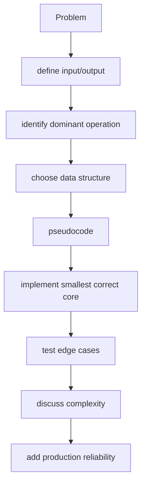
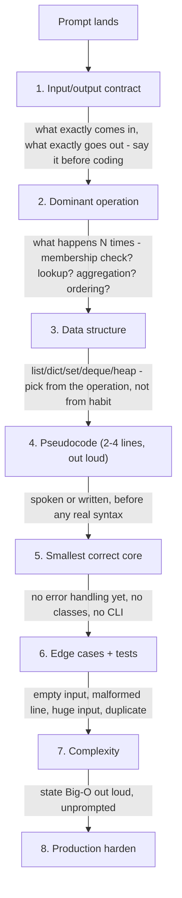
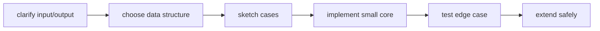

## Coding practice should expose the thought process

For a Python log-aggregation task:

1. restate input/output and malformed-input behavior;
2. show a small example manually;
3. choose dictionary/Counter because lookup/aggregation is the operation;
4. implement pure parsing and aggregation first;
5. test empty, malformed and duplicate cases;
6. discuss streaming, memory and I/O only after correctness;
7. add CLI/logging/exit behavior if asked for productionization.

Do not jump to classes or concurrency to appear senior.

> Learning outcome Turn an infrastructure problem into algorithm, data structures, functions, tests and edge cases before production hardening.



Example prompt: "Parse a large log and report ERROR/CRITICAL counts by service." Say: stream file line-by-line; regex or structured parser extracts severity/service; Counter[str] aggregates; skip/track malformed lines; O(n) time and O(k) memory where k is number of services, not number of lines.

```python
from collections import Counter
from collections.abc import Iterable
import re

EVENT = re.compile(r"level=(ERROR|CRITICAL).*service=([\w-]+)")

def count_errors(lines: Iterable[str]) -> Counter[str]:
    counts: Counter[str] = Counter()
    for line in lines:
        match = EVENT.search(line)
        if match:
            counts[match.group(2)] += 1
    return counts
```

Then discuss malformed input, memory, testing, structured logs, and whether JSON output would be more reliable than regex when available. Do not start by inventing classes or concurrency before the core algorithm is correct.

## Worked explanation and practice

**The workflow as a decision flow (the "say this before you type anything" checklist):**

**Key takeaway:** *"IDDPS-ECP — I Don't Dive Prematurely, Structure/Edge/Complexity/Production."* Or simpler: **"contract → dominant op → structure → pseudocode → core → edges → Big-O → harden."** The two steps candidates skip under pressure are #1 (they start coding before agreeing what "input" even is) and #7 (they never state complexity unless asked) — both are free points if you just say them.

**Interview-ready line to open ANY coding prompt with, verbatim:**
> "Before I write anything — what's the expected input size and is this a one-shot script or something that runs continuously against a live stream? That changes whether I optimize for peak memory or just correctness."
This single question also does double duty: it's a legitimate technical question (streaming vs batch materially changes the design) and it buys 10-15 seconds to actually think.

**Annotated sample transcript — talking through the `count_errors` function from the original chapter, as if live-coding:**

> "The input is an iterable of log lines — I'll type it as `Iterable[str]`, not `list[str]`, specifically so this works against a generator reading a file line-by-line without loading it all into memory." *(← states WHY the type hint choice matters — this is the "production reliability" step arriving early, not bolted on)*
>
> "The dominant operation is 'extract two fields, then count' — that's a `Counter` keyed by service, O(1) increment per line, so the whole thing is O(n) in lines and O(k) in memory where k is distinct services — that's the part worth saying out loud before anyone asks." *(← unprompted complexity statement)*
>
> "I'll use `search` not `match` because the level/service tokens can appear anywhere in the line, not just at the start — that's a small but real correctness detail." *(← a subtle regex-API distinction that shows real familiarity, not memorized boilerplate)*
>
> "Edge cases: a line with no match — right now it's silently skipped, which is a decision I should flag, not hide. In production I'd want a `malformed_count` so silent data loss doesn't happen invisibly." *(← names a real production gap, and proposes the fix instead of just admitting the gap)*

**Extra worked scenario (new, beyond the original) — bounded concurrent API polling, a realistic NVIDIA-SA-relevant task:**
> **Prompt:** "You have 200 GPU node hostnames. Query each node's `/metrics` health endpoint over HTTP with a 2-second timeout, and return a dict of hostname → status ('ok'/'timeout'/'error'). Don't take 200×2s to finish."
> **Model answer, following the workflow:**
> - **Input/output:** `list[str]` hostnames in, `dict[str, str]` status out.
> - **Dominant operation:** many independent I/O-bound calls — this is a concurrency problem, not an algorithmic one.
> - **Data structure:** plain dict for results; a bounded semaphore or thread/async pool to cap concurrency (querying 200 nodes with unbounded concurrency can itself DoS a monitoring endpoint).
> ```python
> import asyncio
> import httpx
>
> async def check_node(client: httpx.AsyncClient, host: str, sem: asyncio.Semaphore) -> tuple[str, str]:
>     async with sem:
>         try:
>             resp = await client.get(f"http://{host}/metrics", timeout=2.0)
>             return host, "ok" if resp.status_code == 200 else "error"
>         except httpx.TimeoutException:
>             return host, "timeout"
>         except httpx.HTTPError:
>             return host, "error"
>
> async def check_all(hosts: list[str], max_concurrency: int = 20) -> dict[str, str]:
>     sem = asyncio.Semaphore(max_concurrency)
>     async with httpx.AsyncClient() as client:
>         results = await asyncio.gather(*(check_node(client, h, sem) for h in hosts))
>     return dict(results)
> ```
> - **Edge cases:** duplicate hostnames (dict naturally collapses them — flag this explicitly rather than let it be silent), DNS failure vs connection refused vs timeout (distinguished by exception type, not lumped into one "error"), empty host list.
> - **Complexity:** wall-clock roughly `ceil(200/20) × 2s` worst case ≈ 20s instead of a naive serial 400s — this is the number to say out loud, because it's the actual point of the exercise.
> - **Production hardening:** exponential backoff + one retry for `timeout` specifically (transient), structured logging of which hosts failed and why, and a circuit-breaker if failure rate crosses a threshold (stop hammering a node that's clearly down).
> **Interview-ready line:** "The algorithmic complexity here is trivial — the actual engineering question is concurrency bound and failure-mode granularity, and that's what I'd spend the remaining time discussing."

## Practice
3. Rewrite `summarize()` so that instead of silently `continue`-ing on a non-matching line, it also returns a count of malformed lines, without changing the function's primary return type (hint: use a mutable counter object passed in, or return a tuple/small dataclass — discuss the tradeoff between the two out loud).
4. Take the concurrent-polling scenario above and add a hard 30-second overall deadline across all 200 hosts regardless of individual timeouts — explain how `asyncio.wait_for` around the whole `gather` changes the failure semantics for hosts that were still in-flight when the deadline hit.

**Visual model — narrate before code:**

**Key takeaway:** *"Shape before syntax."* Interviewers can correct an exposed plan; they cannot infer a hidden one from a rushed implementation.
