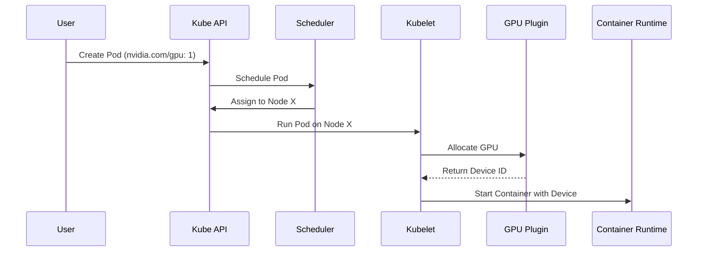
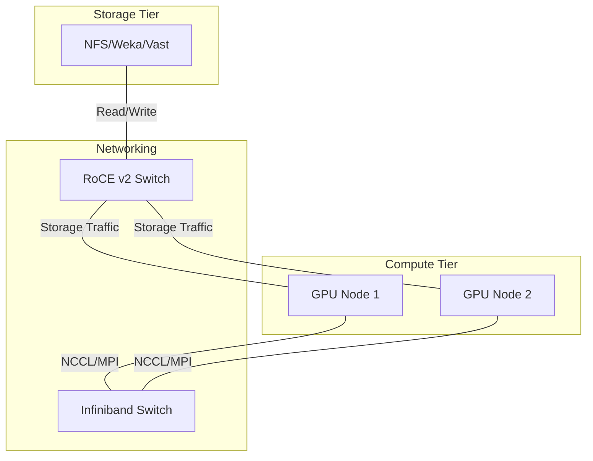

# Troubleshooting Scenarios Masterclass

:::info Overview
This masterclass provides an exhaustive guide to NVIDIA AI Infrastructure operations, focusing on the underlying architecture, production deployment patterns, troubleshooting, and senior-level interview preparation.
:::


In an **NVIDIA AI Factory**, high-end GPUs cannot overcome a misbehaving host operating system. Distributed training frameworks (PyTorch DDP, Megatron-Core) and inference engines (Triton, vLLM) depend on the Linux kernel to schedule worker threads, allocate pinned host staging buffers, manage hugepages, service NVMe I/O, and coordinate GPUDirect DMA over PCIe switches.

When interviewing for an **NVIDIA Senior Solutions Architect** role, generic Linux answers ("I run `top` and restart the service") will result in immediate disqualification. You must demonstrate a **first-principles mental model** of the Linux kernel, diagnose subsystem saturation through precise evidence, and correlate kernel-level stalls with GPU performance degradation.




:::warning Caution
If the `nvidia-device-plugin` is not running or crashlooping, the Kubelet will fail to allocate the GPU, leaving the Pod in a `Pending` state indefinitely.
:::

:::warning Caution
If the `nvidia-device-plugin` is not running or crashlooping, the Kubelet will fail to allocate the GPU, leaving the Pod in a `Pending` state indefinitely.
:::
## 2. Beginner to Advanced Diagnostics

### A. Load Average: Deconstructing the Metric
**Beginner Trap:** Assuming a load average of 64 on a 64-core system means 100% CPU utilization.
**Architectural Truth:** Linux load average is not a CPU measurement. It counts the average number of processes in the **Run queue (R state)** *plus* tasks blocked in **Uninterruptible Sleep (D state)** waiting for disk I/O, NFS locks, or kernel mutexes.

```bash
# 1. Inspect run queue (r) vs. blocked queue (b)
$ vmstat 1 3
procs -----------memory---------- ---swap-- -----io---- -system-- ------cpu-----
 r  b   swpd   free   buff  cache   si   so    bi    bo   in   cs us sy id wa st
 2 38      0 412900  12090 8920100   0    0  1200  4500 4200 6100 12  4 34 50  0
```

- `r = 2`: Only 2 processes are actively competing for CPU execution.
- `b = 38`: 38 processes are stalled in uninterruptible D-state!
- `wa = 50`: The CPU is spending 50% of its cycles idling while waiting for external I/O completion.

#### Isolating D-State Tasks via Kernel Wait Channels (`wchan`):
```bash
# Identify which kernel function is blocking D-state processes
$ for pid in $(ps -eo pid,stat | awk '$2 ~ /D/ {print $1}'); do
    echo "PID $pid ($(cat /proc/$pid/comm)): $(cat /proc/$pid/wchan)"
  done
PID 4102 (python3): nfs_wait_bit_uninterruptible
PID 4103 (python3): nfs_wait_bit_uninterruptible
PID 4821 (torch_worker): wait_on_page_bit
```
*Diagnosis:* The CPU is idle. The training job is stalled because an NFS or parallel storage mount has locked up, causing worker threads to hang in the kernel VFS layer.


### C. Transparent Huge Pages (THP) and Memory Compaction
In deep learning, allocating large GPU staging buffers requires multi-gigabyte memory pools. If Transparent Huge Pages are misconfigured (`always`), the kernel background daemon (`khugepaged`) attempts to compact fragmented 4KB pages into contiguous 2MB pages:

```bash
# Check memory compaction activity
$ grep -E "compact_stall|compact_fail" /proc/vmstat
compact_stall 148291   # Times processes stalled waiting for memory compaction
compact_fail  49201    # Times compaction failed entirely
```
*Impact on AI Workloads:* Memory compaction acquires global spinlocks across CPU cores, introducing **50ms to 2-second latency spikes** into the training loop. This causes NCCL watchdog timeouts.
*The Production Fix:* Set `transparent_hugepage=never` at boot time, and pre-allocate static hugepages if required.




:::info Architecture Note
Separating storage traffic (often RoCE) from East-West compute traffic (Infiniband) is critical for isolating congestion events during large checkpointing operations.
:::

:::info Architecture Note
Separating storage traffic (often RoCE) from East-West compute traffic (Infiniband) is critical for isolating congestion events during large checkpointing operations.
:::
## 3. High-Stakes Senior Solutions Architect Interview Scenarios

### Scenario 1: High System Load with Low CPU Utilization
**Interviewer:** *"You SSH into an accelerated compute node hosting an LLM inference service. `uptime` shows a load average of 48 on a 32-core server, but `top` reports CPU usage is only 15%. What is happening, and how do you locate the root cause?"*

**Candidate Answer:**
> "A high load average paired with low CPU utilization indicates that the system is saturated with processes blocked in **uninterruptible sleep (D-state)** rather than runnable tasks competing for CPU time:
> 1. **Verify Process State:** I run `vmstat 1 3` and inspect the `b` (blocked) column versus the `r` (runnable) column. If `b` is elevated while `r` is low and `wa` (I/O wait) is high, the processes are blocked on external storage or kernel locks.
> 2. **Identify Blocked Tasks and Kernel Wait Channels:** I query `/proc` to inspect the wait channel of the blocked processes:
>    `ps -eo pid,stat,comm,wchan | grep ' D '`
>    If the wait channel shows `nfs_wait_bit_uninterruptible`, `lustre_wait`, or `wait_on_page_bit`, worker threads are stalled waiting on network-attached storage or NVMe page flushing.
> 3. **Inspect Storage Queue Depths and Latencies:** I run `iostat -xz 1 3` to evaluate disk utilization (`%util`), average request queue depth (`aqu-sz`), and average service latency (`await`). If an NVMe drive shows an `await` of > 50ms, a drive controller is failing or an NVMe-oF path is experiencing network drops."


:::tip Pro-Tip
Always visualize the request lifecycle when troubleshooting latency. The gap between `API Gateway` and `Triton Pods` is often where network jitter is introduced.
:::
## Key Takeaways

1. **Load is Not CPU:** Load average measures queued work, combining runnable (`R`) and uninterruptible sleep (`D`) tasks. Always inspect `vmstat` (`r` vs. `b`) before concluding CPU saturation.
2. **PSI Provides Ground Truth:** Use `/proc/pressure/memory` and `/proc/pressure/io` to distinguish transient latency from true system-wide resource stalls.
3. **Disable Transparent Huge Pages:** Background `khugepaged` memory compaction locks CPU cores and introduces fatal latency spikes into distributed training loops.
4. **Audit PCIe Gen5 Link Integrity:** Under thermal or electrical noise, PCIe links train down to Gen1 or reduced widths, crippling GPUDirect RDMA bandwidth while appearing superficially active.
5. **Cgroup Ceilings Cause Exit Code 137:** A process killed by OOM when the host has free RAM indicates a cgroup-level memory quota breach.


# Chapter 4 — Kubernetes, GPU Operator, and Run:ai Platform Troubleshooting

In cloud-native AI platforms, Kubernetes orchestrates both distributed training jobs and real-time inference microservices. However, Kubernetes does not natively understand GPU hardware, NVLink meshes, or CUDA driver boundaries. It relies on a layered extension architecture: **Node Feature Discovery (NFD)**, the **NVIDIA GPU Operator**, the **NVIDIA Device Plugin**, the **Container Device Interface (CDI)**, and virtualization layers like **Run:ai**.

When a Pod requesting `nvidia.com/gpu` fails to start or crashes, the defect rarely lives in the user's Python script. It usually stems from a broken contract between the Kubelet, the container runtime (`containerd`), the device plugin gRPC socket, or the underlying driver operand.

As an **NVIDIA Senior Solutions Architect**, you must understand the exact lifecycle of a GPU Pod, navigate the GPU Operator operand dependency tree, diagnose missing allocatable resources, and troubleshoot multi-tenant scheduling under Run:ai.


:::info Architecture Note
Separating storage traffic (often RoCE) from East-West compute traffic (Infiniband) is critical for isolating congestion events during large checkpointing operations.
:::
## 2. The GPU Pod Lifecycle: State-to-Evidence Matrix

When diagnosing a GPU Pod failure, map the Kubernetes Pod Phase to its exact diagnostic boundary:

| Pod Phase / Status | Primary Diagnostic Boundary | Evidence Command | Likely Root Cause |
|---|---|---|---|
| **`Pending` (Reason: `FailedScheduling`)** | Cluster Scheduler, Quotas, Taints, or GRES Allocatable | `kubectl describe pod <pod> \| grep -A 10 Events` | 1. Cluster GPU capacity saturated.<br/>2. Node tainted (e.g., `nvidia.com/gpu:NoSchedule`) without matching toleration.<br/>3. NodeSelector or NFD label mismatch.<br/>4. PVC storage binding pending in a different zone. |
| **`Pending` (Allocatable: 0 across nodes)** | GPU Operator Device Plugin DaemonSet | `kubectl get nodes -o jsonpath='{.items[*].status.allocatable}'` | Host driver failed to load, preventing the Device Plugin from initializing NVML and registering with Kubelet. |
| **`ContainerCreating` (Stuck > 2m)** | Kubelet, CNI, or CSI Volume Mount | `kubectl describe pod <pod>` | Volume mount lock, container image pull timeout, or CNI IP address exhaustion. |
| **`CreateContainerError` / `RunContainerError`** | Container Runtime (`containerd`), CDI, or NVIDIA Container Toolkit | `crictl inspectp <sandbox_id>` or `journalctl -u containerd` | 1. CDI specification missing or invalid (`/etc/cdi/nvidia.yaml`).<br/>2. `nvidia-container-cli` failed to locate host driver libraries.<br/>3. Missing `RuntimeClass: nvidia`. |
| **`CrashLoopBackOff` (Exit Code 137)** | Linux Memory Cgroups (Host or Container OOM) | `kubectl describe pod <pod> \| grep -i "OOMKilled"` | Process exceeded container `resources.limits.memory` (SIGKILL). |
| **`CrashLoopBackOff` (Exit Code 1)** | Application Layer / CUDA Framework | `kubectl logs <pod> --previous` | PyTorch CUDA initialization failure, library version mismatch, or application exception. |


### Failure 2: `CreateContainerError` — CDI Specification Desynchronization
Starting with modern Kubernetes (1.28+) and Containerd (1.7+), the industry is transitioning from legacy OCI prestart hooks to the **Container Device Interface (CDI)**.

#### The Error Signature:
```text
$ kubectl describe pod triton-inference-0 | tail -8
Warning  Failed   14s   kubelet   Error: failed to create containerd task: failed to generate spec: 
cdi: failed to inject devices: device "nvidia.com/gpu=0" not found in CDI registry
```

#### The Architecture & Remedy:
1. CDI replaces dynamic OCI runtime hooks with static, validated YAML manifests located at `/etc/cdi/nvidia.yaml`.
2. The NVIDIA Container Toolkit operand in the GPU Operator automatically generates this file at boot.
3. If an administrator manually modifies GPU configurations or MIG profiles without restarting the toolkit daemon, the CDI manifest goes stale.
4. **Resolution:** Re-generate the CDI specification on the affected node:
   ```bash
   sudo nvidia-ctk cdi generate --output=/etc/cdi/nvidia.yaml
   sudo systemctl restart containerd
   ```


### Advanced Production Considerations
When operating at scale, you must heavily monitor metrics like DCGM (Data Center GPU Manager) counters, Xid errors, and PCIe bandwidth saturation. In production, these parameters dictate your cluster's overall ROI. Ignoring PCIe topology, for instance, can lead to severe NCCL fallback, completely degrading multi-node training performance.
## 5. Senior Solutions Architect Interview Scenarios

### Scenario 1: GPU Pod Stuck in Pending Despite Cluster Autoscaler
**Interviewer:** *"A customer reports that their distributed training Pods are stuck in `Pending` with `FailedScheduling: 0/32 nodes are available: 32 Insufficient nvidia.com/gpu`. The Kubernetes Cluster Autoscaler is active, but it refuses to spin up new GPU node instances. How do you troubleshoot this?"*

**Candidate Answer:**
> "When the Cluster Autoscaler refuses to scale up despite unschedulable Pods, the failure is governed by **autoscaler predicates, node group constraints, or cloud quota exhaustion**:
> 1. **Step 1: Inspect the Cluster Autoscaler Status ConfigMap:**
>    `kubectl get configmap cluster-autoscaler-status -n kube-system -o yaml`
>    This reveals whether the autoscaler is actively evaluating the pending Pod and whether it identified eligible node groups.
> 2. **Step 2: Check Node Group Max Size and Taints:**
>    - If the GPU node group has reached its maximum size (`maxNodes: 32`), the autoscaler will not scale.
>    - If the Pod lacks tolerations for the default GPU node taints (e.g., `sku=gpu:NoSchedule`), the autoscaler evaluates the new nodes as unable to satisfy the Pod's placement, and rejects scale-up.
> 3. **Step 3: Inspect Autoscaler Logs for Cloud Quota Rejections:**
>    I inspect `kubectl logs -n kube-system -l app=cluster-autoscaler`:
>    Look for `Failed to create instance: OperationNotPermitted: QuotaExceeded for GPU_TOTAL`. The cloud provider (AWS/GCP/Azure) or bare-metal pool is rejecting new instances due to account-level capacity limits."


### Advanced Production Considerations
When operating at scale, you must heavily monitor metrics like DCGM (Data Center GPU Manager) counters, Xid errors, and PCIe bandwidth saturation. In production, these parameters dictate your cluster's overall ROI. Ignoring PCIe topology, for instance, can lead to severe NCCL fallback, completely degrading multi-node training performance.
## Key Takeaways

1. **Two Paths Govern GPU Pods:** Control-plane advertisement (Device Plugin $\to$ Kubelet $\to$ API Server) and runtime injection (CRI $\to$ CDI/Container Toolkit $\to$ Sandbox). A failure can occur in either path.
2. **Missing Allocatable GPUs Trace to Driver Failures:** If `nvidia.com/gpu` is absent from node status, the Device Plugin DaemonSet is almost certainly crashlooping due to an NVML driver mismatch.
3. **CDI is Modern Standard:** In Kubernetes 1.28+, Containerd uses `/etc/cdi/nvidia.yaml` to inject GPU devices; stale CDI manifests cause immediate `CreateContainerError`.
4. **Run:ai Solves Native Kubernetes Limitations:** Run:ai enables fractional GPU sharing without hardware MIG, guarantees atomic gang scheduling for multi-node training, and enforces fairshare over-quota preemption.
5. **Exit Codes Localize the Fault:** Exit code 137 points to Linux memory cgroup limits; exit code 1 points to application exceptions; kernel XIDs indicate physical hardware or driver failures.


# Chapter 5 — GPU Silicon, NVLink, NVSwitch, and Hardware Triage

In large-scale AI supercomputers, GPU hardware does not simply operate in a binary "working" or "broken" state. Under extreme thermal, electrical, and computational stress—such as continuous 700W FP8 tensor operations across 8x SXM5 GPUs—hardware degrades along subtle analog boundaries. GPUs throttle clock frequencies due to voltage ripple, NVLink high-speed serializer/deserializer (SerDes) channels experience symbol errors, and HBM3 memory stacks encounter cosmic ray bit-flips.

When interviewing for an **NVIDIA Senior Solutions Architect** role, you must demonstrate mastery of the silicon and interconnect layers. You are expected to interpret NVIDIA driver **XID error codes**, diagnose NVLink mesh degradation, triage NVSwitch fabric failures, and leverage **DCGM** for deterministic hardware health qualification.


### Advanced Production Considerations
When operating at scale, you must heavily monitor metrics like DCGM (Data Center GPU Manager) counters, Xid errors, and PCIe bandwidth saturation. In production, these parameters dictate your cluster's overall ROI. Ignoring PCIe topology, for instance, can lead to severe NCCL fallback, completely degrading multi-node training performance.
## 2. NVLink and NVSwitch Interconnect Diagnostics

On an 8-GPU **NVIDIA DGX H100**, intra-node communication does not traverse PCIe switches. Instead, all 8 GPUs connect via **NVLink 4** through **4 onboard NVSwitch ASICs**, providing **900 GB/s bidirectional bandwidth per GPU** (7.2 TB/s aggregate per chassis).

```mermaid
flowchart TD
    subgraph SXM_Tray["DGX H100 GPU Tray (8x H100 SXM5 GPUs)"]
        GPU0["GPU 0"]
        GPU1["GPU 1"]
        GPU7["GPU 7"]
    end

    subgraph NVSwitch_Mesh["NVSwitch Interconnect Mesh (4x ASICs)"]
        NVS0["NVSwitch 0"]
        NVS1["NVSwitch 1"]
        NVS2["NVSwitch 2"]
        NVS3["NVSwitch 3"]
    end

    GPU0 <-->|18x NVLinks (900 GB/s)| NVSwitch_Mesh
    GPU1 <-->|18x NVLinks (900 GB/s)| NVSwitch_Mesh
    GPU7 <-->|18x NVLinks (900 GB/s)| NVSwitch_Mesh
```

### Diagnosing NVLink Degradation

If even one of the 18 NVLinks on a GPU drops or suffers physical electrical noise, the entire NVLink mesh becomes asymmetric. NCCL cannot form uniform All-Reduce rings, and collective communication throttles down to the speed of the slowest link.

```bash
# 1. Audit active link counts across all 8 GPUs (Expected: 18 active links per GPU)
$ nvidia-smi nvlink --status
GPU 0: NVIDIA H100 80GB HBM3
        Link 0: Active
        Link 1: Active
        ...
        Link 16: Active
        Link 17: Recovery  <-- CRITICAL: Link 17 is flapping in SerDes recovery!

# 2. Query cumulative NVLink error counters
$ nvidia-smi nvlink -e -i 0
GPU 0: NVIDIA H100 80GB HBM3
        Link 0:
                Data Replay Errors          : 0
                Packet Recovery Errors       : 0
        Link 17:
                Data Replay Errors          : 1482912  <-- Extreme packet retransmissions!
                Packet Recovery Errors       : 42019
```

- **Data Replay Errors:** The physical SerDes receiver detected corrupted cyclic redundancy check (CRC) bits and requested an hardware packet retransmission.
- **Packet Recovery Errors:** The link suffered a physical loss of symbol lock and renegotiated link training.
- **Architectural Impact:** High replay counts consume link bandwidth. A single flapping link causes multi-second pauses in PyTorch backward passes.


### Advanced Production Considerations
When operating at scale, you must heavily monitor metrics like DCGM (Data Center GPU Manager) counters, Xid errors, and PCIe bandwidth saturation. In production, these parameters dictate your cluster's overall ROI. Ignoring PCIe topology, for instance, can lead to severe NCCL fallback, completely degrading multi-node training performance.
## 4. Hardware Qualification via NVIDIA DCGM

The **NVIDIA Data Center GPU Manager (DCGM)** provides standardized diagnostic engines for field triage:

```bash
# Execute Level 3 comprehensive stress validation (Run before returning node to service)
$ sudo dcgmi diag -r 3
+---------------------------+------------------------------------------------+
| Diagnostic                | Result                                         |
+===========================+================================================+
| Deployment                | Pass                                           |
| Blacklist                 | Pass                                           |
| NVML Library              | Pass                                           |
| CUDA Main Library         | Pass                                           |
| Permissions and Devices   | Pass                                           |
| Hardware                  | Pass                                           |
| Memory                    | Pass (HBM3 stress pattern clean)               |
| PCIe                      | Pass (Gen5 32 GT/s line rate validated)        |
| Targeted Stress           | Pass (FP8 GEMM sustained at 700W for 15 mins)  |
+---------------------------+------------------------------------------------+
```


### Scenario 2: Uncorrectable Double-Bit ECC Memory Error (XID 48)
**Interviewer:** *"A node throws XID 48 on GPU 4 during a multi-node checkpoint write. The customer asks: 'Can we just restart the Slurm job and let it run, since the checkpoint write already finished?' How do you respond?"*

**Candidate Answer:**
> "I strictly advise **against** restarting the job on that node and immediately drain the machine:
> 1. **Data Integrity Risk:** XID 48 represents an uncorrectable multi-bit ECC error in the HBM3 memory array. While single-bit errors (XID 92) are corrected transparently by hardware Hamming codes, double-bit errors cannot be corrected.
> 2. **Silent Model Corruption:** If the bitflip occurred in model weights, activation buffers, or optimizer states, the tensor values are corrupted. Continuing training will propagate corrupted gradients throughout the All-Reduce collective, causing loss divergence or NaN values hours or days later.
> 3. **Operational Action:**
>    - Immediately mark the node drained in Slurm: `scontrol update NodeName=<host> State=DRAIN Reason="XID 48: Double-bit ECC on GPU 4"`.
>    - Inspect Dynamic Page Retirement status via `nvidia-smi -q -d PAGE_RETIREMENT`. If the memory controller cannot isolate the corrupted page, the GPU memory module is physically compromised and requires physical replacement."

