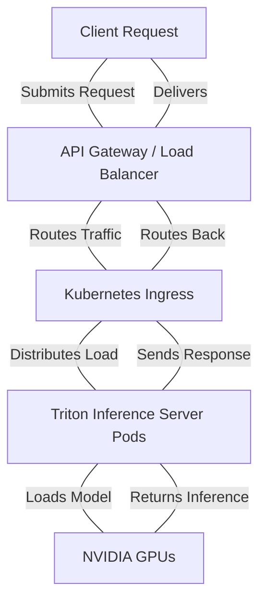
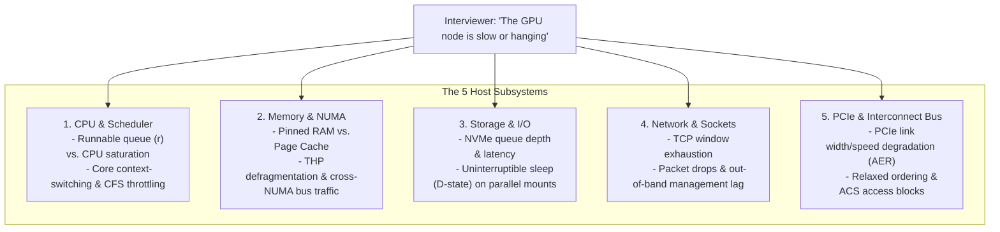
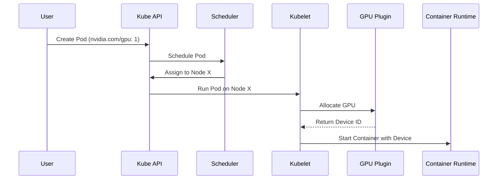
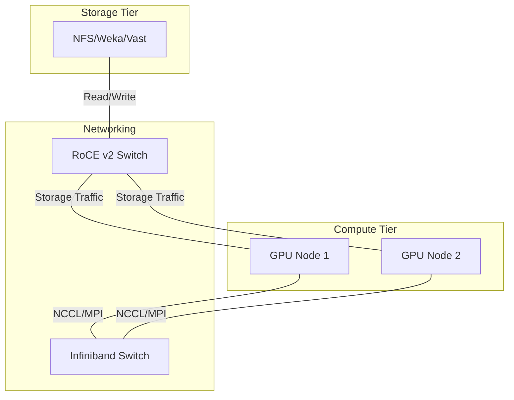
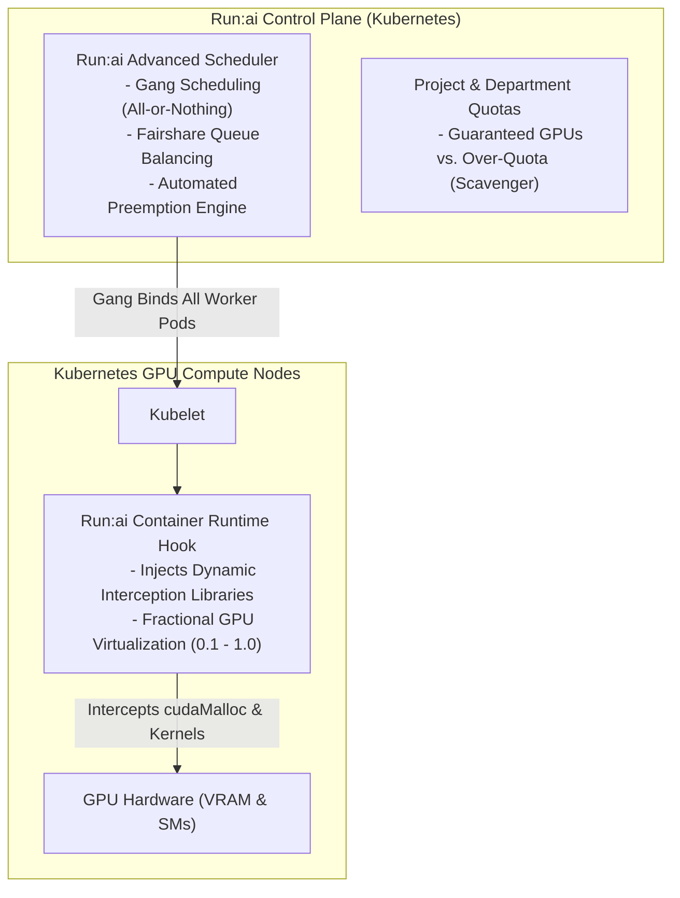
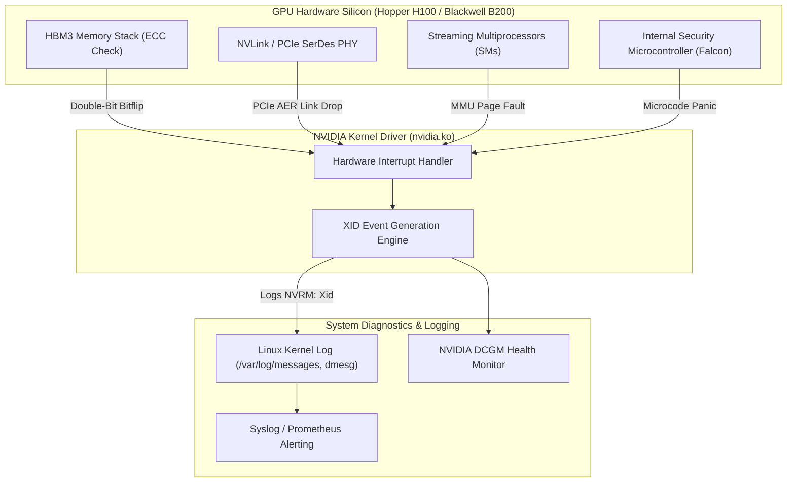
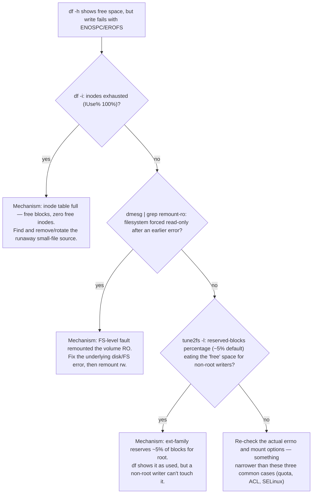
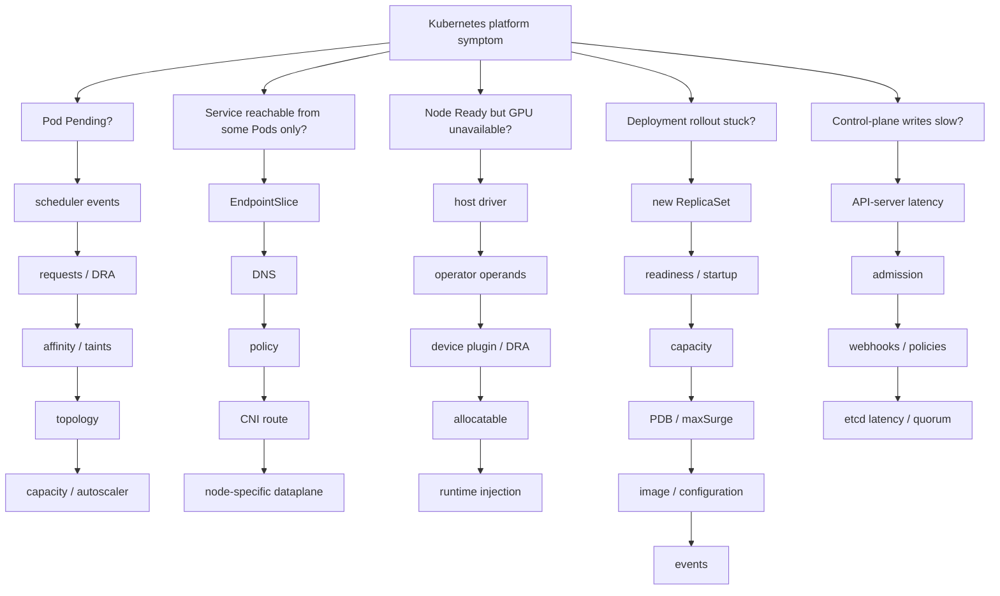
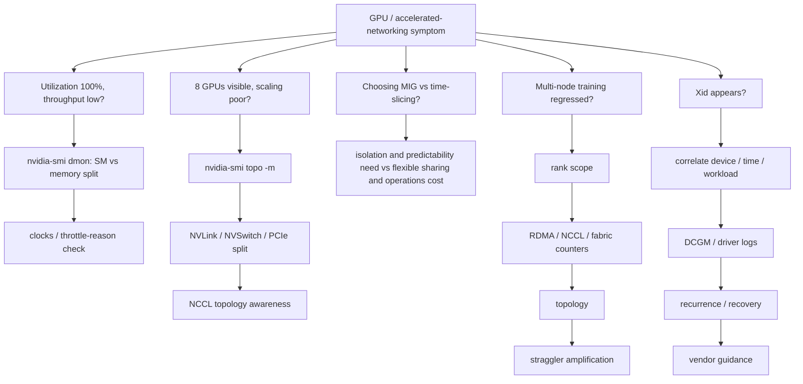

# Troubleshooting Scenarios Masterclass

:::info Overview
This masterclass provides an exhaustive guide to NVIDIA AI Infrastructure operations, focusing on the underlying architecture, production deployment patterns, troubleshooting, and senior-level interview preparation.
:::

---
id: 02-troubleshooting-scenarios-masterclass
title: Troubleshooting Scenarios Masterclass
sidebar_label: Troubleshooting Scenarios Masterclass
---


:::info Overview
This masterclass provides an exhaustive guide to NVIDIA AI Infrastructure operations, focusing on the underlying architecture, production deployment patterns, troubleshooting, and senior-level interview preparation.
:::

---
title: "Chapter 3 - Linux and Host Troubleshooting for AI Infrastructure"
slug: "chapter-3-linux-troubleshooting-questions"
sidebar_position: 3
description: "Linux kernel, CPU, memory, NUMA, I/O, and PCIe troubleshooting for NVIDIA accelerated systems: D-state analysis, PSI metrics, THP compaction, and senior interview answer scripts."
source_document: "Volume_09_JR2018680_Interview_Preparation(2).docx"
---


In an **NVIDIA AI Factory**, high-end GPUs cannot overcome a misbehaving host operating system. Distributed training frameworks (PyTorch DDP, Megatron-Core) and inference engines (Triton, vLLM) depend on the Linux kernel to schedule worker threads, allocate pinned host staging buffers, manage hugepages, service NVMe I/O, and coordinate GPUDirect DMA over PCIe switches.

When interviewing for an **NVIDIA Senior Solutions Architect** role, generic Linux answers ("I run `top` and restart the service") will result in immediate disqualification. You must demonstrate a **first-principles mental model** of the Linux kernel, diagnose subsystem saturation through precise evidence, and correlate kernel-level stalls with GPU performance degradation.

---


### Advanced Production Considerations
When operating at scale, you must heavily monitor metrics like DCGM (Data Center GPU Manager) counters, Xid errors, and PCIe bandwidth saturation. In production, these parameters dictate your cluster's overall ROI. Ignoring PCIe topology, for instance, can lead to severe NCCL fallback, completely degrading multi-node training performance.




:::tip Pro-Tip
Always visualize the request lifecycle when troubleshooting latency. The gap between `API Gateway` and `Triton Pods` is often where network jitter is introduced.
:::


### Advanced Production Considerations
When operating at scale, you must heavily monitor metrics like DCGM (Data Center GPU Manager) counters, Xid errors, and PCIe bandwidth saturation. In production, these parameters dictate your cluster's overall ROI. Ignoring PCIe topology, for instance, can lead to severe NCCL fallback, completely degrading multi-node training performance.


:::tip Pro-Tip
Always visualize the request lifecycle when troubleshooting latency. The gap between `API Gateway` and `Triton Pods` is often where network jitter is introduced.
:::
## 1. The Core Mental Model: The 5 Host Subsystems

When an interviewer presents a vague prompt such as *"The GPU node is unresponsive or running slow,"* divide the physical host into five deterministic subsystems before issuing a single command:



---


### Advanced Production Considerations
When operating at scale, you must heavily monitor metrics like DCGM (Data Center GPU Manager) counters, Xid errors, and PCIe bandwidth saturation. In production, these parameters dictate your cluster's overall ROI. Ignoring PCIe topology, for instance, can lead to severe NCCL fallback, completely degrading multi-node training performance.




:::warning Caution
If the `nvidia-device-plugin` is not running or crashlooping, the Kubelet will fail to allocate the GPU, leaving the Pod in a `Pending` state indefinitely.
:::


### Advanced Production Considerations
When operating at scale, you must heavily monitor metrics like DCGM (Data Center GPU Manager) counters, Xid errors, and PCIe bandwidth saturation. In production, these parameters dictate your cluster's overall ROI. Ignoring PCIe topology, for instance, can lead to severe NCCL fallback, completely degrading multi-node training performance.


:::warning Caution
If the `nvidia-device-plugin` is not running or crashlooping, the Kubelet will fail to allocate the GPU, leaving the Pod in a `Pending` state indefinitely.
:::
## 2. Beginner to Advanced Diagnostics

### A. Load Average: Deconstructing the Metric
**Beginner Trap:** Assuming a load average of 64 on a 64-core system means 100% CPU utilization.
**Architectural Truth:** Linux load average is not a CPU measurement. It counts the average number of processes in the **Run queue (R state)** *plus* tasks blocked in **Uninterruptible Sleep (D state)** waiting for disk I/O, NFS locks, or kernel mutexes.

```bash
# 1. Inspect run queue (r) vs. blocked queue (b)
$ vmstat 1 3
procs -----------memory---------- ---swap-- -----io---- -system-- ------cpu-----
 r  b   swpd   free   buff  cache   si   so    bi    bo   in   cs us sy id wa st
 2 38      0 412900  12090 8920100   0    0  1200  4500 4200 6100 12  4 34 50  0
```

- `r = 2`: Only 2 processes are actively competing for CPU execution.
- `b = 38`: 38 processes are stalled in uninterruptible D-state!
- `wa = 50`: The CPU is spending 50% of its cycles idling while waiting for external I/O completion.

#### Isolating D-State Tasks via Kernel Wait Channels (`wchan`):
```bash
# Identify which kernel function is blocking D-state processes
$ for pid in $(ps -eo pid,stat | awk '$2 ~ /D/ {print $1}'); do
    echo "PID $pid ($(cat /proc/$pid/comm)): $(cat /proc/$pid/wchan)"
  done
PID 4102 (python3): nfs_wait_bit_uninterruptible
PID 4103 (python3): nfs_wait_bit_uninterruptible
PID 4821 (torch_worker): wait_on_page_bit
```
*Diagnosis:* The CPU is idle. The training job is stalled because an NFS or parallel storage mount has locked up, causing worker threads to hang in the kernel VFS layer.

---

### B. Linux Pressure Stall Information (PSI)
Modern Linux kernels (v4.20+) introduce **PSI (`/proc/pressure/`)**, which provides definitive, hardware-level metrics on resource starvation:

```bash
$ cat /proc/pressure/memory
some avg10=42.10 avg60=38.40 avg300=25.10 total=18492012
full avg10=18.50 avg60=12.20 avg300=8.10 total=8921040
```
- **`some`**: Percentage of time during which at least one task was stalled on memory allocation.
- **`full`**: Percentage of time during which **all non-idle tasks** were stalled on memory. A non-zero `full` metric indicates severe host memory thrashing where CPU execution has completely halted.

---

### C. Transparent Huge Pages (THP) and Memory Compaction
In deep learning, allocating large GPU staging buffers requires multi-gigabyte memory pools. If Transparent Huge Pages are misconfigured (`always`), the kernel background daemon (`khugepaged`) attempts to compact fragmented 4KB pages into contiguous 2MB pages:

```bash
# Check memory compaction activity
$ grep -E "compact_stall|compact_fail" /proc/vmstat
compact_stall 148291   # Times processes stalled waiting for memory compaction
compact_fail  49201    # Times compaction failed entirely
```
*Impact on AI Workloads:* Memory compaction acquires global spinlocks across CPU cores, introducing **50ms to 2-second latency spikes** into the training loop. This causes NCCL watchdog timeouts.
*The Production Fix:* Set `transparent_hugepage=never` at boot time, and pre-allocate static hugepages if required.

---

### D. PCIe Bus Degradation and Advanced Error Reporting (AER)
Modern H100/H200 SXM5 systems communicate with ConnectX-7 network adapters over PCIe Gen5 (32 GT/s per lane, x16 width = 64 GB/s theoretical bandwidth).
Under thermal stress or electrical interference, the PCIe controller may silently renegotiate link parameters:

```bash
# 1. Audit link speed and width for all ConnectX-7 network adapters
$ lspci -s 0000:07:00.0 -vvv | grep -E "LnkCap|LnkSta"
LnkCap: Port #0, Speed 32GT/s, Width x16, ASPM not supported
LnkSta: Speed 2.5GT/s (downgraded), Width x4 (downgraded)  <-- CRITICAL HARDWARE FAULT!

# 2. Check for PCIe AER errors in kernel log
$ sudo dmesg -T | grep -i aer
[Thu Aug 12 14:10:22 2026] pcieport 0000:00:01.0: AER: Corrected error received: 0000:07:00.0
[Thu Aug 12 14:10:22 2026] mlx5_core 0000:07:00.0: PCIe Bus Error: severity=Corrected, type=Physical Layer, (Receiver Error)
```
*Diagnosis:* The network card has trained down from Gen5 x16 (32 GT/s) to Gen1 x4 (2.5 GT/s). The link is technically "up", but GPUDirect RDMA bandwidth has collapsed by 90%, causing massive training slowdowns across the entire multi-node cluster.

---


### Advanced Production Considerations
When operating at scale, you must heavily monitor metrics like DCGM (Data Center GPU Manager) counters, Xid errors, and PCIe bandwidth saturation. In production, these parameters dictate your cluster's overall ROI. Ignoring PCIe topology, for instance, can lead to severe NCCL fallback, completely degrading multi-node training performance.




:::info Architecture Note
Separating storage traffic (often RoCE) from East-West compute traffic (Infiniband) is critical for isolating congestion events during large checkpointing operations.
:::


### Advanced Production Considerations
When operating at scale, you must heavily monitor metrics like DCGM (Data Center GPU Manager) counters, Xid errors, and PCIe bandwidth saturation. In production, these parameters dictate your cluster's overall ROI. Ignoring PCIe topology, for instance, can lead to severe NCCL fallback, completely degrading multi-node training performance.


:::info Architecture Note
Separating storage traffic (often RoCE) from East-West compute traffic (Infiniband) is critical for isolating congestion events during large checkpointing operations.
:::
## 3. High-Stakes Senior Solutions Architect Interview Scenarios

### Scenario 1: High System Load with Low CPU Utilization
**Interviewer:** *"You SSH into an accelerated compute node hosting an LLM inference service. `uptime` shows a load average of 48 on a 32-core server, but `top` reports CPU usage is only 15%. What is happening, and how do you locate the root cause?"*

**Candidate Answer:**
> "A high load average paired with low CPU utilization indicates that the system is saturated with processes blocked in **uninterruptible sleep (D-state)** rather than runnable tasks competing for CPU time:
> 1. **Verify Process State:** I run `vmstat 1 3` and inspect the `b` (blocked) column versus the `r` (runnable) column. If `b` is elevated while `r` is low and `wa` (I/O wait) is high, the processes are blocked on external storage or kernel locks.
> 2. **Identify Blocked Tasks and Kernel Wait Channels:** I query `/proc` to inspect the wait channel of the blocked processes:
>    `ps -eo pid,stat,comm,wchan | grep ' D '`
>    If the wait channel shows `nfs_wait_bit_uninterruptible`, `lustre_wait`, or `wait_on_page_bit`, worker threads are stalled waiting on network-attached storage or NVMe page flushing.
> 3. **Inspect Storage Queue Depths and Latencies:** I run `iostat -xz 1 3` to evaluate disk utilization (`%util`), average request queue depth (`aqu-sz`), and average service latency (`await`). If an NVMe drive shows an `await` of > 50ms, a drive controller is failing or an NVMe-oF path is experiencing network drops."

---

### Scenario 2: Memory OOMKilled but Node Shows 128 GB Free RAM
**Interviewer:** *"A researcher submits a multi-GPU PyTorch container job via Slurm. Two minutes into the training run, the job aborts with exit code 137. Inspecting `dmesg` shows an `OOM-Killed process` message, yet running `free -m` on the host reveals 128 GB of unused, available RAM. How is this possible?"*

**Candidate Answer:**
> "This is a textbook distinction between **Host System OOM** and **Cgroup Memory Limit OOM**:
> 1. **Cgroup Enforcement:** When Slurm or Kubernetes launches a container, it places the process tree into a dedicated Linux cgroup (v1 or v2). If the user requested `--mem=64G` in their `sbatch` script or specified a container memory limit of 64 GB, the kernel enforces that hard ceiling inside `/sys/fs/cgroup/memory/` (or `memory.max` in cgroups v2).
> 2. **Kernel Behavior:** As soon as the PyTorch DataLoader pre-fetches datasets into host memory and exceeds 64 GB, the kernel invokes the cgroup-scoped OOM killer (`mem_cgroup_out_of_memory`), sending a `SIGKILL` (signal 9, exit code 128 + 9 = 137) to the primary Python process.
> 3. **Verification:** I verify this by inspecting the kernel log:
>    `dmesg -T | grep -i "invoked oom-killer: gfp_mask"`
>    The log will state: `Task in /slurm/uid_1001/job_48210 killed as a result of limit of /slurm/uid_1001/job_48210`.
> 4. **Solution:** The physical host had plenty of memory; the job was throttled by its declared allocation. The researcher must raise their `--mem` parameter or optimize PyTorch DataLoader worker memory using shared memory (`/dev/shm`)."

---


### Advanced Production Considerations
When operating at scale, you must heavily monitor metrics like DCGM (Data Center GPU Manager) counters, Xid errors, and PCIe bandwidth saturation. In production, these parameters dictate your cluster's overall ROI. Ignoring PCIe topology, for instance, can lead to severe NCCL fallback, completely degrading multi-node training performance.


:::tip Pro-Tip
Always visualize the request lifecycle when troubleshooting latency. The gap between `API Gateway` and `Triton Pods` is often where network jitter is introduced.
:::


### Advanced Production Considerations
When operating at scale, you must heavily monitor metrics like DCGM (Data Center GPU Manager) counters, Xid errors, and PCIe bandwidth saturation. In production, these parameters dictate your cluster's overall ROI. Ignoring PCIe topology, for instance, can lead to severe NCCL fallback, completely degrading multi-node training performance.


:::tip Pro-Tip
Always visualize the request lifecycle when troubleshooting latency. The gap between `API Gateway` and `Triton Pods` is often where network jitter is introduced.
:::
## Key Takeaways

1. **Load is Not CPU:** Load average measures queued work, combining runnable (`R`) and uninterruptible sleep (`D`) tasks. Always inspect `vmstat` (`r` vs. `b`) before concluding CPU saturation.
2. **PSI Provides Ground Truth:** Use `/proc/pressure/memory` and `/proc/pressure/io` to distinguish transient latency from true system-wide resource stalls.
3. **Disable Transparent Huge Pages:** Background `khugepaged` memory compaction locks CPU cores and introduces fatal latency spikes into distributed training loops.
4. **Audit PCIe Gen5 Link Integrity:** Under thermal or electrical noise, PCIe links train down to Gen1 or reduced widths, crippling GPUDirect RDMA bandwidth while appearing superficially active.
5. **Cgroup Ceilings Cause Exit Code 137:** A process killed by OOM when the host has free RAM indicates a cgroup-level memory quota breach.
---
title: "Chapter 4 - Kubernetes, GPU Operator, and Run:ai Platform Troubleshooting"
slug: "chapter-4-kubernetes-troubleshooting-questions"
sidebar_position: 4
description: "Kubernetes GPU platform triage for NVIDIA Solutions Architects: GPU Operator operands, Device Plugin gRPC, CDI vs. OCI hooks, Run:ai fractional virtualization, and senior interview scenarios."
source_document: "Volume_09_JR2018680_Interview_Preparation(2).docx"
---

# Chapter 4 — Kubernetes, GPU Operator, and Run:ai Platform Troubleshooting

In cloud-native AI platforms, Kubernetes orchestrates both distributed training jobs and real-time inference microservices. However, Kubernetes does not natively understand GPU hardware, NVLink meshes, or CUDA driver boundaries. It relies on a layered extension architecture: **Node Feature Discovery (NFD)**, the **NVIDIA GPU Operator**, the **NVIDIA Device Plugin**, the **Container Device Interface (CDI)**, and virtualization layers like **Run:ai**.

When a Pod requesting `nvidia.com/gpu` fails to start or crashes, the defect rarely lives in the user's Python script. It usually stems from a broken contract between the Kubelet, the container runtime (`containerd`), the device plugin gRPC socket, or the underlying driver operand.

As an **NVIDIA Senior Solutions Architect**, you must understand the exact lifecycle of a GPU Pod, navigate the GPU Operator operand dependency tree, diagnose missing allocatable resources, and troubleshoot multi-tenant scheduling under Run:ai.

---


### Advanced Production Considerations
When operating at scale, you must heavily monitor metrics like DCGM (Data Center GPU Manager) counters, Xid errors, and PCIe bandwidth saturation. In production, these parameters dictate your cluster's overall ROI. Ignoring PCIe topology, for instance, can lead to severe NCCL fallback, completely degrading multi-node training performance.


:::warning Caution
If the `nvidia-device-plugin` is not running or crashlooping, the Kubelet will fail to allocate the GPU, leaving the Pod in a `Pending` state indefinitely.
:::


### Advanced Production Considerations
When operating at scale, you must heavily monitor metrics like DCGM (Data Center GPU Manager) counters, Xid errors, and PCIe bandwidth saturation. In production, these parameters dictate your cluster's overall ROI. Ignoring PCIe topology, for instance, can lead to severe NCCL fallback, completely degrading multi-node training performance.


:::warning Caution
If the `nvidia-device-plugin` is not running or crashlooping, the Kubelet will fail to allocate the GPU, leaving the Pod in a `Pending` state indefinitely.
:::
## 1. The Kubernetes GPU Control and Runtime Architecture

A GPU Pod cannot run until two distinct control paths succeed: the **Control-Plane Advertisement Path** and the **Runtime Sandbox Injection Path**.

```mermaid
flowchart TD
    subgraph Host["Host Operating System Layer"]
        DRV["NVIDIA Kernel Modules (nvidia.ko, nvidia-uvm.ko)"]
        DEV["Device Nodes (/dev/nvidia0..7, /dev/nvidiactl)"]
        NVML["NVIDIA Management Library (libnvidia-ml.so)"]
    end

    subgraph GPUOperator["NVIDIA GPU Operator (Namespace: gpu-operator)"]
        NFD["Node Feature Discovery (Labels hardware features)"]
        GFD["GPU Feature Discovery (Labels GPU model, VRAM, arch)"]
        DP["NVIDIA Device Plugin DaemonSet"]
        CDI_OP["NVIDIA Container Toolkit / CDI Operand"]
        DCGM_EXP["DCGM Exporter DaemonSet (Prometheus Metrics)"]
    end

    subgraph K8sNode["Kubernetes Node Architecture"]
        KUBELET["Kubelet (Node Agent)"]
        SOCKET["Plugin Socket: /var/lib/kubelet/device-plugins/nvidia.sock"]
        CRI["Container Runtime (containerd / CRI-O)"]
        CDI_SPEC["CDI Spec: /etc/cdi/nvidia.yaml"]
    end

    subgraph SchedulerPlane["Cluster Control Plane"]
        API["kube-apiserver (Node Status: allocatable.nvidia.com/gpu)"]
        SCHED["kube-scheduler / Run:ai Scheduler"]
    end

    DRV --> DEV
    DEV --> NVML
    NVML --> DP
    DP -->|Registers via gRPC| SOCKET
    SOCKET --> KUBELET
    KUBELET -->|Reports Capacity| API
    API --> SCHED
    
    SCHED -->|Binds Pod to Node| KUBELET
    KUBELET -->|Calls Allocate via gRPC| DP
    DP -->> KUBELET: Returns Device IDs (e.g., GPU-UUID-0)
    KUBELET -->|Instructs Sandbox Creation| CRI
    CRI -->|Consults| CDI_SPEC
    CDI_SPEC -->|Injects /dev/nvidia* & libraries| POD["Running GPU Pod Sandbox"]
```

---


### Advanced Production Considerations
When operating at scale, you must heavily monitor metrics like DCGM (Data Center GPU Manager) counters, Xid errors, and PCIe bandwidth saturation. In production, these parameters dictate your cluster's overall ROI. Ignoring PCIe topology, for instance, can lead to severe NCCL fallback, completely degrading multi-node training performance.


:::info Architecture Note
Separating storage traffic (often RoCE) from East-West compute traffic (Infiniband) is critical for isolating congestion events during large checkpointing operations.
:::


### Advanced Production Considerations
When operating at scale, you must heavily monitor metrics like DCGM (Data Center GPU Manager) counters, Xid errors, and PCIe bandwidth saturation. In production, these parameters dictate your cluster's overall ROI. Ignoring PCIe topology, for instance, can lead to severe NCCL fallback, completely degrading multi-node training performance.


:::info Architecture Note
Separating storage traffic (often RoCE) from East-West compute traffic (Infiniband) is critical for isolating congestion events during large checkpointing operations.
:::
## 2. The GPU Pod Lifecycle: State-to-Evidence Matrix

When diagnosing a GPU Pod failure, map the Kubernetes Pod Phase to its exact diagnostic boundary:

| Pod Phase / Status | Primary Diagnostic Boundary | Evidence Command | Likely Root Cause |
|---|---|---|---|
| **`Pending` (Reason: `FailedScheduling`)** | Cluster Scheduler, Quotas, Taints, or GRES Allocatable | `kubectl describe pod <pod> \| grep -A 10 Events` | 1. Cluster GPU capacity saturated.<br/>2. Node tainted (e.g., `nvidia.com/gpu:NoSchedule`) without matching toleration.<br/>3. NodeSelector or NFD label mismatch.<br/>4. PVC storage binding pending in a different zone. |
| **`Pending` (Allocatable: 0 across nodes)** | GPU Operator Device Plugin DaemonSet | `kubectl get nodes -o jsonpath='{.items[*].status.allocatable}'` | Host driver failed to load, preventing the Device Plugin from initializing NVML and registering with Kubelet. |
| **`ContainerCreating` (Stuck > 2m)** | Kubelet, CNI, or CSI Volume Mount | `kubectl describe pod <pod>` | Volume mount lock, container image pull timeout, or CNI IP address exhaustion. |
| **`CreateContainerError` / `RunContainerError`** | Container Runtime (`containerd`), CDI, or NVIDIA Container Toolkit | `crictl inspectp <sandbox_id>` or `journalctl -u containerd` | 1. CDI specification missing or invalid (`/etc/cdi/nvidia.yaml`).<br/>2. `nvidia-container-cli` failed to locate host driver libraries.<br/>3. Missing `RuntimeClass: nvidia`. |
| **`CrashLoopBackOff` (Exit Code 137)** | Linux Memory Cgroups (Host or Container OOM) | `kubectl describe pod <pod> \| grep -i "OOMKilled"` | Process exceeded container `resources.limits.memory` (SIGKILL). |
| **`CrashLoopBackOff` (Exit Code 1)** | Application Layer / CUDA Framework | `kubectl logs <pod> --previous` | PyTorch CUDA initialization failure, library version mismatch, or application exception. |

---


### Advanced Production Considerations
When operating at scale, you must heavily monitor metrics like DCGM (Data Center GPU Manager) counters, Xid errors, and PCIe bandwidth saturation. In production, these parameters dictate your cluster's overall ROI. Ignoring PCIe topology, for instance, can lead to severe NCCL fallback, completely degrading multi-node training performance.


### Advanced Production Considerations
When operating at scale, you must heavily monitor metrics like DCGM (Data Center GPU Manager) counters, Xid errors, and PCIe bandwidth saturation. In production, these parameters dictate your cluster's overall ROI. Ignoring PCIe topology, for instance, can lead to severe NCCL fallback, completely degrading multi-node training performance.
## 3. Deep-Dive Failure Modes in Production

### Failure 1: The Node Reports `allocatable: nvidia.com/gpu: 0`
**The Symptom:** `kubectl get nodes` shows the node is `Ready`, but Pods requesting GPUs remain `Pending`. Checking the node status reveals:
```bash
$ kubectl get node gpu-node-04 -o jsonpath='{.status.allocatable}'
{"cpu":"128","memory":"515921Mi","pods":"110"}
# Notice: "nvidia.com/gpu" is completely absent from Allocatable and Capacity!
```

#### The Diagnostic Sequence:
1. **Check the Device Plugin Pod on that Node:**
   ```bash
   $ kubectl get pods -n gpu-operator -l app=nvidia-device-plugin-daemonset -o wide | grep gpu-node-04
   nvidia-device-plugin-daemonset-4j2kx   0/1   CrashLoopBackOff   12   28m   gpu-node-04
   ```
2. **Inspect the Device Plugin Container Logs:**
   ```bash
   $ kubectl logs -n gpu-operator nvidia-device-plugin-daemonset-4j2kx
   level=error msg="Failed to initialize NVML: driver/library version mismatch"
   level=fatal msg="Failed to create device plugin: could not load NVML"
   ```
3. **The Root Cause:** A background host OS update refreshed the user-space NVIDIA driver libraries, but the node was not rebooted to reload the matching kernel module. Because NVML cannot talk to the mismatched kernel driver, the Device Plugin crashes.
4. **The Fix:** Drain the node, reboot to load the updated kernel module, verify `nvidia-smi` works, and let the Device Plugin re-register with Kubelet.

---

### Failure 2: `CreateContainerError` — CDI Specification Desynchronization
Starting with modern Kubernetes (1.28+) and Containerd (1.7+), the industry is transitioning from legacy OCI prestart hooks to the **Container Device Interface (CDI)**.

#### The Error Signature:
```text
$ kubectl describe pod triton-inference-0 | tail -8
Warning  Failed   14s   kubelet   Error: failed to create containerd task: failed to generate spec: 
cdi: failed to inject devices: device "nvidia.com/gpu=0" not found in CDI registry
```

#### The Architecture & Remedy:
1. CDI replaces dynamic OCI runtime hooks with static, validated YAML manifests located at `/etc/cdi/nvidia.yaml`.
2. The NVIDIA Container Toolkit operand in the GPU Operator automatically generates this file at boot.
3. If an administrator manually modifies GPU configurations or MIG profiles without restarting the toolkit daemon, the CDI manifest goes stale.
4. **Resolution:** Re-generate the CDI specification on the affected node:
   ```bash
   sudo nvidia-ctk cdi generate --output=/etc/cdi/nvidia.yaml
   sudo systemctl restart containerd
   ```

---


### Advanced Production Considerations
When operating at scale, you must heavily monitor metrics like DCGM (Data Center GPU Manager) counters, Xid errors, and PCIe bandwidth saturation. In production, these parameters dictate your cluster's overall ROI. Ignoring PCIe topology, for instance, can lead to severe NCCL fallback, completely degrading multi-node training performance.


### Advanced Production Considerations
When operating at scale, you must heavily monitor metrics like DCGM (Data Center GPU Manager) counters, Xid errors, and PCIe bandwidth saturation. In production, these parameters dictate your cluster's overall ROI. Ignoring PCIe topology, for instance, can lead to severe NCCL fallback, completely degrading multi-node training performance.
## 4. Run:ai Architecture and Multi-Tenant Scheduling Triage

**Run:ai** runs on top of bare-metal Kubernetes clusters to transform static GPU infrastructure into an elastic, shared computing fabric.



### Why Run:ai Over Native Kubernetes Scheduling:
1. **Dynamic Fractional GPUs:** Native Kubernetes extended resources only support whole integers (`nvidia.com/gpu: 1`). Hardware MIG partitions require re-flashing GPU baseboards and reboots. Run:ai intercepts CUDA memory allocation calls (`cudaMalloc`) in user space, allowing multiple pods to share a single physical H100 GPU (e.g., requesting `gpu: 0.25`) with strict memory isolation.
2. **Gang Scheduling:** Native Kubernetes schedules distributed jobs pod-by-pod. If a 32-pod training job requests 32 GPUs, Kubernetes might schedule 28 pods and leave 4 pods pending, while the 28 running pods sit idle and block other users. Run:ai enforces atomic **Gang Scheduling**: all 32 pods schedule concurrently, or none do.
3. **Fairshare & Over-Quota Preemption:** Research teams are allocated guaranteed GPU quotas. If a team exceeds its quota (bursting into idle cluster capacity), Run:ai marks those jobs as **preemptible**. When the owning team submits work, Run:ai automatically checkpoints and evicts the over-quota jobs within 30 seconds.

---


### Advanced Production Considerations
When operating at scale, you must heavily monitor metrics like DCGM (Data Center GPU Manager) counters, Xid errors, and PCIe bandwidth saturation. In production, these parameters dictate your cluster's overall ROI. Ignoring PCIe topology, for instance, can lead to severe NCCL fallback, completely degrading multi-node training performance.


### Advanced Production Considerations
When operating at scale, you must heavily monitor metrics like DCGM (Data Center GPU Manager) counters, Xid errors, and PCIe bandwidth saturation. In production, these parameters dictate your cluster's overall ROI. Ignoring PCIe topology, for instance, can lead to severe NCCL fallback, completely degrading multi-node training performance.
## 5. Senior Solutions Architect Interview Scenarios

### Scenario 1: GPU Pod Stuck in Pending Despite Cluster Autoscaler
**Interviewer:** *"A customer reports that their distributed training Pods are stuck in `Pending` with `FailedScheduling: 0/32 nodes are available: 32 Insufficient nvidia.com/gpu`. The Kubernetes Cluster Autoscaler is active, but it refuses to spin up new GPU node instances. How do you troubleshoot this?"*

**Candidate Answer:**
> "When the Cluster Autoscaler refuses to scale up despite unschedulable Pods, the failure is governed by **autoscaler predicates, node group constraints, or cloud quota exhaustion**:
> 1. **Step 1: Inspect the Cluster Autoscaler Status ConfigMap:**
>    `kubectl get configmap cluster-autoscaler-status -n kube-system -o yaml`
>    This reveals whether the autoscaler is actively evaluating the pending Pod and whether it identified eligible node groups.
> 2. **Step 2: Check Node Group Max Size and Taints:**
>    - If the GPU node group has reached its maximum size (`maxNodes: 32`), the autoscaler will not scale.
>    - If the Pod lacks tolerations for the default GPU node taints (e.g., `sku=gpu:NoSchedule`), the autoscaler evaluates the new nodes as unable to satisfy the Pod's placement, and rejects scale-up.
> 3. **Step 3: Inspect Autoscaler Logs for Cloud Quota Rejections:**
>    I inspect `kubectl logs -n kube-system -l app=cluster-autoscaler`:
>    Look for `Failed to create instance: OperationNotPermitted: QuotaExceeded for GPU_TOTAL`. The cloud provider (AWS/GCP/Azure) or bare-metal pool is rejecting new instances due to account-level capacity limits."

---

### Scenario 2: PyTorch Pod Crashes with Exit Code 137 vs. Exit Code 1
**Interviewer:** *"A customer's multi-GPU training job crashes 10 minutes into an epoch. The Pod status flips to `CrashLoopBackOff`. How do you immediately determine whether the crash was caused by a hardware failure, a platform memory limit, or a bug in their machine learning code?"*

**Candidate Answer:**
> "I determine the failure boundary immediately by inspecting the **Termination Exit Code and Kernel Audit Logs**:
> 1. **Analyze Termination Status:**
>    `kubectl describe pod <pod_name> | grep -A 5 "Last State"`
>    - **Exit Code 137:** Indicates the process received a `SIGKILL` (128 + 9). I check `OOMKilled: true`. If `OOMKilled` is true, the container exceeded its Kubernetes memory limit (`limits.memory`).
>    - **Exit Code 1 / 255:** Indicates an unhandled user-space exception (e.g., a PyTorch assertion failure, NaN loss crash, or missing Python library). I run `kubectl logs <pod> --previous` to read the Python traceback.
> 2. **Check for Hardware / Driver Kernel XIDs:**
>    If the exit code is 137 or 1, but logs show CUDA runtime initialization failure (`CUDA error: an illegal memory access was encountered`), I query the node's kernel log:
>    `sudo dmesg -T | grep -i "NVRM: Xid"`
>    If an XID 31 (MMU Page Fault), XID 48 (Double-bit ECC), or XID 79 (GPU fallen off the bus) is logged, the failure is a hardware or driver fault, not an application bug."

---


### Advanced Production Considerations
When operating at scale, you must heavily monitor metrics like DCGM (Data Center GPU Manager) counters, Xid errors, and PCIe bandwidth saturation. In production, these parameters dictate your cluster's overall ROI. Ignoring PCIe topology, for instance, can lead to severe NCCL fallback, completely degrading multi-node training performance.


### Advanced Production Considerations
When operating at scale, you must heavily monitor metrics like DCGM (Data Center GPU Manager) counters, Xid errors, and PCIe bandwidth saturation. In production, these parameters dictate your cluster's overall ROI. Ignoring PCIe topology, for instance, can lead to severe NCCL fallback, completely degrading multi-node training performance.
## Key Takeaways

1. **Two Paths Govern GPU Pods:** Control-plane advertisement (Device Plugin $\to$ Kubelet $\to$ API Server) and runtime injection (CRI $\to$ CDI/Container Toolkit $\to$ Sandbox). A failure can occur in either path.
2. **Missing Allocatable GPUs Trace to Driver Failures:** If `nvidia.com/gpu` is absent from node status, the Device Plugin DaemonSet is almost certainly crashlooping due to an NVML driver mismatch.
3. **CDI is Modern Standard:** In Kubernetes 1.28+, Containerd uses `/etc/cdi/nvidia.yaml` to inject GPU devices; stale CDI manifests cause immediate `CreateContainerError`.
4. **Run:ai Solves Native Kubernetes Limitations:** Run:ai enables fractional GPU sharing without hardware MIG, guarantees atomic gang scheduling for multi-node training, and enforces fairshare over-quota preemption.
5. **Exit Codes Localize the Fault:** Exit code 137 points to Linux memory cgroup limits; exit code 1 points to application exceptions; kernel XIDs indicate physical hardware or driver failures.
---
title: "Chapter 5 - GPU Silicon, NVLink, NVSwitch, and Hardware Triage"
slug: "chapter-5-gpu-and-ai-infrastructure-troubleshooting"
sidebar_position: 5
description: "Mastering accelerated hardware diagnostics for NVIDIA Solutions Architects: XID error taxonomy, HBM3 ECC memory failures, NVLink symbol errors, NVSwitch fabric triage, and DCGM diagnostics."
source_document: "Volume_09_JR2018680_Interview_Preparation(2).docx"
---

# Chapter 5 — GPU Silicon, NVLink, NVSwitch, and Hardware Triage

In large-scale AI supercomputers, GPU hardware does not simply operate in a binary "working" or "broken" state. Under extreme thermal, electrical, and computational stress—such as continuous 700W FP8 tensor operations across 8x SXM5 GPUs—hardware degrades along subtle analog boundaries. GPUs throttle clock frequencies due to voltage ripple, NVLink high-speed serializer/deserializer (SerDes) channels experience symbol errors, and HBM3 memory stacks encounter cosmic ray bit-flips.

When interviewing for an **NVIDIA Senior Solutions Architect** role, you must demonstrate mastery of the silicon and interconnect layers. You are expected to interpret NVIDIA driver **XID error codes**, diagnose NVLink mesh degradation, triage NVSwitch fabric failures, and leverage **DCGM** for deterministic hardware health qualification.

---


### Advanced Production Considerations
When operating at scale, you must heavily monitor metrics like DCGM (Data Center GPU Manager) counters, Xid errors, and PCIe bandwidth saturation. In production, these parameters dictate your cluster's overall ROI. Ignoring PCIe topology, for instance, can lead to severe NCCL fallback, completely degrading multi-node training performance.


### Advanced Production Considerations
When operating at scale, you must heavily monitor metrics like DCGM (Data Center GPU Manager) counters, Xid errors, and PCIe bandwidth saturation. In production, these parameters dictate your cluster's overall ROI. Ignoring PCIe topology, for instance, can lead to severe NCCL fallback, completely degrading multi-node training performance.
## 1. The NVIDIA XID Error Architecture and Taxonomy

An **XID error** is an interrupt-driven error report generated by the NVIDIA GPU driver (`nvidia.ko`) and logged directly to the Linux kernel ring buffer (`dmesg`). It represents the single most authoritative diagnostic artifact for GPU silicon and memory failures.



### The Critical XID Reference Table for Solutions Architects

| XID Code | Error Classification | Severity | Root Cause & Silicon Mechanics | Field Remediation Action |
|---|---|---|---|---|
| **XID 31** | **GPU Memory Page Fault** | Moderate (App) | A CUDA thread attempted to read or write an unmapped virtual address, dereferenced a null pointer, or breached memory bounds. | User-space software bug. Inspect CUDA core dump or run `cuda-gdb` / Compute Sanitizer. **Do not RMA hardware.** |
| **XID 43** | **GPU Stopped Processing** | Critical | A compute or graphics engine hung, exceeding the driver's watchdogs. Frequently triggered by an infinite kernel loop or clock domain lockup. | Kill process (`pkill -9`). If persistent across multiple frameworks, suspect power delivery or driver bug. |
| **XID 48** | **Double-Bit ECC Memory Error** | Fatal (Hardware) | An uncorrectable multi-bit error occurred in HBM3/HBM3e memory. Parity cannot restore data integrity; data corruption risk. | **Immediate Node Quarantine.** The GPU is unsafe for training. Drain node in Slurm/K8s, run Level 3 DCGM diagnostic, and initiate RMA. |
| **XID 62** | **Internal Microcontroller Halt** | Fatal (Silicon) | The internal Falcon/GSP (GPU System Processor) microcontroller firmware encountered an unrecoverable exception or bus hang. | Reset GPU via `nvidia-smi --gpu-reset`. If recurring upon reboot, schedule motherboard/SXM tray replacement. |
| **XID 79** | **GPU Fallen Off the Bus** | Catastrophic | The GPU completely vanished from the PCIe configuration space. Caused by fatal power supply droop, PCIe link training collapse, or thermal shutdown. | Node warm reboot fails; requires out-of-band **cold chassis power cycle** via Redfish/IPMI. Inspect PCIe AER logs and power cables. |
| **XID 92** | **High Single-Bit ECC Rate** | Warning | Correctable single-bit errors exceeded the dynamic threshold, indicating impending physical memory cell failure. | Schedule maintenance. The driver will attempt Dynamic Page Retirement (DPR). If pending retirement list overflows, RMA GPU. |

---


### Advanced Production Considerations
When operating at scale, you must heavily monitor metrics like DCGM (Data Center GPU Manager) counters, Xid errors, and PCIe bandwidth saturation. In production, these parameters dictate your cluster's overall ROI. Ignoring PCIe topology, for instance, can lead to severe NCCL fallback, completely degrading multi-node training performance.


### Advanced Production Considerations
When operating at scale, you must heavily monitor metrics like DCGM (Data Center GPU Manager) counters, Xid errors, and PCIe bandwidth saturation. In production, these parameters dictate your cluster's overall ROI. Ignoring PCIe topology, for instance, can lead to severe NCCL fallback, completely degrading multi-node training performance.
## 2. NVLink and NVSwitch Interconnect Diagnostics

On an 8-GPU **NVIDIA DGX H100**, intra-node communication does not traverse PCIe switches. Instead, all 8 GPUs connect via **NVLink 4** through **4 onboard NVSwitch ASICs**, providing **900 GB/s bidirectional bandwidth per GPU** (7.2 TB/s aggregate per chassis).

```mermaid
flowchart TD
    subgraph SXM_Tray["DGX H100 GPU Tray (8x H100 SXM5 GPUs)"]
        GPU0["GPU 0"]
        GPU1["GPU 1"]
        GPU7["GPU 7"]
    end

    subgraph NVSwitch_Mesh["NVSwitch Interconnect Mesh (4x ASICs)"]
        NVS0["NVSwitch 0"]
        NVS1["NVSwitch 1"]
        NVS2["NVSwitch 2"]
        NVS3["NVSwitch 3"]
    end

    GPU0 <-->|18x NVLinks (900 GB/s)| NVSwitch_Mesh
    GPU1 <-->|18x NVLinks (900 GB/s)| NVSwitch_Mesh
    GPU7 <-->|18x NVLinks (900 GB/s)| NVSwitch_Mesh
```

### Diagnosing NVLink Degradation

If even one of the 18 NVLinks on a GPU drops or suffers physical electrical noise, the entire NVLink mesh becomes asymmetric. NCCL cannot form uniform All-Reduce rings, and collective communication throttles down to the speed of the slowest link.

```bash
# 1. Audit active link counts across all 8 GPUs (Expected: 18 active links per GPU)
$ nvidia-smi nvlink --status
GPU 0: NVIDIA H100 80GB HBM3
        Link 0: Active
        Link 1: Active
        ...
        Link 16: Active
        Link 17: Recovery  <-- CRITICAL: Link 17 is flapping in SerDes recovery!

# 2. Query cumulative NVLink error counters
$ nvidia-smi nvlink -e -i 0
GPU 0: NVIDIA H100 80GB HBM3
        Link 0:
                Data Replay Errors          : 0
                Packet Recovery Errors       : 0
        Link 17:
                Data Replay Errors          : 1482912  <-- Extreme packet retransmissions!
                Packet Recovery Errors       : 42019
```

- **Data Replay Errors:** The physical SerDes receiver detected corrupted cyclic redundancy check (CRC) bits and requested an hardware packet retransmission.
- **Packet Recovery Errors:** The link suffered a physical loss of symbol lock and renegotiated link training.
- **Architectural Impact:** High replay counts consume link bandwidth. A single flapping link causes multi-second pauses in PyTorch backward passes.

---


### Advanced Production Considerations
When operating at scale, you must heavily monitor metrics like DCGM (Data Center GPU Manager) counters, Xid errors, and PCIe bandwidth saturation. In production, these parameters dictate your cluster's overall ROI. Ignoring PCIe topology, for instance, can lead to severe NCCL fallback, completely degrading multi-node training performance.


### Advanced Production Considerations
When operating at scale, you must heavily monitor metrics like DCGM (Data Center GPU Manager) counters, Xid errors, and PCIe bandwidth saturation. In production, these parameters dictate your cluster's overall ROI. Ignoring PCIe topology, for instance, can lead to severe NCCL fallback, completely degrading multi-node training performance.
## 3. Thermal and Power Throttling Analysis

An NVIDIA H100 SXM5 GPU operates with a thermal design power (TDP) of up to **700 Watts**. Under heavy sustained GEMM kernels, cooling or power delivery imbalances force the GPU controller to throttle clock frequencies to prevent physical destruction.

### Detecting Throttling via NVML Telemetry

```bash
$ nvidia-smi --query-gpu=index,clocks.current.graphics,clocks.current.sm,clocks.max.sm,temperature.gpu,power.draw,clocks_event_reasons.hw_slowdown,clocks_event_reasons.sw_thermal_slowdown,clocks_event_reasons.hw_power_brake_slowdown --format=csv
index, clocks.current.graphics [MHz], clocks.current.sm [MHz], clocks.max.sm [MHz], temperature.gpu, power.draw [W], clocks_event_reasons.hw_slowdown, clocks_event_reasons.sw_thermal_slowdown, clocks_event_reasons.hw_power_brake_slowdown
0, 1980 MHz, 1980 MHz, 1980 MHz, 48, 680 W, NOT_ACTIVE, NOT_ACTIVE, NOT_ACTIVE
1, 1980 MHz, 1980 MHz, 1980 MHz, 49, 675 W, NOT_ACTIVE, NOT_ACTIVE, NOT_ACTIVE
2, 1140 MHz, 1140 MHz, 1980 MHz, 86, 420 W, ACTIVE, ACTIVE, NOT_ACTIVE
```

#### Interpretation:
- **GPU 0 & 1:** Running at full boost clocks (1980 MHz) and full power (~680 W).
- **GPU 2:** Core clock throttled from 1980 MHz down to **1140 MHz** (a 42% compute drop). Temperature is at 86C with `hw_slowdown` and `sw_thermal_slowdown` marked `ACTIVE`.
- **Root Cause:** Uneven thermal interface material (TIM), air bubble in direct liquid cooling cold plate, or a failed fan tray directly upstream of GPU 2. In synchronized training, this single GPU will slow down the entire cluster.

---


### Advanced Production Considerations
When operating at scale, you must heavily monitor metrics like DCGM (Data Center GPU Manager) counters, Xid errors, and PCIe bandwidth saturation. In production, these parameters dictate your cluster's overall ROI. Ignoring PCIe topology, for instance, can lead to severe NCCL fallback, completely degrading multi-node training performance.


### Advanced Production Considerations
When operating at scale, you must heavily monitor metrics like DCGM (Data Center GPU Manager) counters, Xid errors, and PCIe bandwidth saturation. In production, these parameters dictate your cluster's overall ROI. Ignoring PCIe topology, for instance, can lead to severe NCCL fallback, completely degrading multi-node training performance.
## 4. Hardware Qualification via NVIDIA DCGM

The **NVIDIA Data Center GPU Manager (DCGM)** provides standardized diagnostic engines for field triage:

```bash
# Execute Level 3 comprehensive stress validation (Run before returning node to service)
$ sudo dcgmi diag -r 3
+---------------------------+------------------------------------------------+
| Diagnostic                | Result                                         |
+===========================+================================================+
| Deployment                | Pass                                           |
| Blacklist                 | Pass                                           |
| NVML Library              | Pass                                           |
| CUDA Main Library         | Pass                                           |
| Permissions and Devices   | Pass                                           |
| Hardware                  | Pass                                           |
| Memory                    | Pass (HBM3 stress pattern clean)               |
| PCIe                      | Pass (Gen5 32 GT/s line rate validated)        |
| Targeted Stress           | Pass (FP8 GEMM sustained at 700W for 15 mins)  |
+---------------------------+------------------------------------------------+
```

---


### Advanced Production Considerations
When operating at scale, you must heavily monitor metrics like DCGM (Data Center GPU Manager) counters, Xid errors, and PCIe bandwidth saturation. In production, these parameters dictate your cluster's overall ROI. Ignoring PCIe topology, for instance, can lead to severe NCCL fallback, completely degrading multi-node training performance.


### Advanced Production Considerations
When operating at scale, you must heavily monitor metrics like DCGM (Data Center GPU Manager) counters, Xid errors, and PCIe bandwidth saturation. In production, these parameters dictate your cluster's overall ROI. Ignoring PCIe topology, for instance, can lead to severe NCCL fallback, completely degrading multi-node training performance.
## 5. Senior Solutions Architect Interview Scenarios

### Scenario 1: Triaging an XID 79 ("GPU Has Fallen Off the Bus")
**Interviewer:** *"During a customer's large foundation model pre-training run on a DGX H100 SuperPOD, node 14 abruptly halts. `nvidia-smi` on node 14 reports: `No devices were found`. The kernel log is flooded with `NVRM: GPU at PCI:0000:19:00.0 has fallen off the bus (Xid 79)`. Walk me through the exact failure mechanics and your remediation plan."*

**Candidate Answer:**
> "XID 79 is one of the most severe failure states in accelerated infrastructure:
> 1. **Silicon Mechanics:** XID 79 means the PCIe Root Complex lost communication with the GPU device endpoint. The GPU ceased acknowledging PCIe Transaction Layer Packets (TLPs). This is triggered by three primary hardware events:
>    - **Power Supply Transient Droop:** A sudden current surge during an intense FP8 GEMM kernel caused voltage on the 12V / 48V power plane to drop below the GPU voltage regulator module (VRM) brownout threshold, causing the GPU silicon to reset.
>    - **Thermal Trip:** The GPU junction temperature exceeded thermal trip thresholds (e.g., > 95C), triggering an emergency hardware power cut to prevent silicon burn.
>    - **PCIe Fatal Link Collapse:** Severe signal integrity degradation on the PCIe Gen5 bus resulting in an uncorrectable PCIe AER fatal error.
> 2. **Immediate Remediation Sequence:**
>    - A standard OS reboot (`sudo reboot`) will fail because the PCIe link was severed; the BIOS POST will not detect the device.
>    - I issue a **cold power cycle via out-of-band Redfish or IPMI**:
>      `curl -k -u admin:$PASS -X POST https://<bmc-ip>/redfish/v1/Systems/System_0/Actions/ComputerSystem.Reset -d '{"ResetType": "ForceRestart"}'`
>      This cuts auxiliary power rails, forcing PCIe bridge re-enumeration.
> 3. **Post-Recovery Hardware Qualification:**
>    - Once booted, I inspect `dmesg -T | grep -i aer` for PCIe receiver errors and query BMC sensor logs for power supply faults.
>    - I run a full DCGM Level 3 stress test (`dcgmi diag -r 3`). If the GPU drops off the bus again under 700W load, I submit an RMA for the GPU SXM tray."

---

### Scenario 2: Uncorrectable Double-Bit ECC Memory Error (XID 48)
**Interviewer:** *"A node throws XID 48 on GPU 4 during a multi-node checkpoint write. The customer asks: 'Can we just restart the Slurm job and let it run, since the checkpoint write already finished?' How do you respond?"*

**Candidate Answer:**
> "I strictly advise **against** restarting the job on that node and immediately drain the machine:
> 1. **Data Integrity Risk:** XID 48 represents an uncorrectable multi-bit ECC error in the HBM3 memory array. While single-bit errors (XID 92) are corrected transparently by hardware Hamming codes, double-bit errors cannot be corrected.
> 2. **Silent Model Corruption:** If the bitflip occurred in model weights, activation buffers, or optimizer states, the tensor values are corrupted. Continuing training will propagate corrupted gradients throughout the All-Reduce collective, causing loss divergence or NaN values hours or days later.
> 3. **Operational Action:**
>    - Immediately mark the node drained in Slurm: `scontrol update NodeName=<host> State=DRAIN Reason="XID 48: Double-bit ECC on GPU 4"`.
>    - Inspect Dynamic Page Retirement status via `nvidia-smi -q -d PAGE_RETIREMENT`. If the memory controller cannot isolate the corrupted page, the GPU memory module is physically compromised and requires physical replacement."

---


### Advanced Production Considerations
When operating at scale, you must heavily monitor metrics like DCGM (Data Center GPU Manager) counters, Xid errors, and PCIe bandwidth saturation. In production, these parameters dictate your cluster's overall ROI. Ignoring PCIe topology, for instance, can lead to severe NCCL fallback, completely degrading multi-node training performance.


### Advanced Production Considerations
When operating at scale, you must heavily monitor metrics like DCGM (Data Center GPU Manager) counters, Xid errors, and PCIe bandwidth saturation. In production, these parameters dictate your cluster's overall ROI. Ignoring PCIe topology, for instance, can lead to severe NCCL fallback, completely degrading multi-node training performance.
## Key Takeaways

1. **XIDs are the Source of Truth:** Never guess at GPU failures. Always inspect `dmesg` for specific XID signatures (XID 31 = app bug, XID 48 = uncorrectable ECC, XID 79 = PCIe link collapse).
2. **NVLink Degradation Destroys Collective Performance:** A single flapping NVLink link (high data replay errors) breaks collective symmetry and bottlenecks the entire cluster.
3. **Monitor Thermal Clocks, Not Just GPU Utilization:** A GPU running at 100% utilization while throttled from 1980 MHz to 1140 MHz slows down all 1,024 ranks in a synchronized training run.
4. **XID 79 Mandates Out-of-Band Cold Reset:** Software reboots cannot recover a device that has fallen off the PCIe bus; use Redfish or IPMI to perform a cold chassis power cycle.
5. **Never Tolerate Double-Bit ECC Errors:** Immediately quarantine and drain any node reporting XID 48 to prevent silent mathematical corruption in training runs.
---
title: "Question set A — Linux and host mechanics"
slug: "question-set-a-linux-and-host-mechanics"
sidebar_position: 14
description: "Question set A — Linux and host mechanics — JR2018680 Interview Preparation."
source_document: "Volume_09_JR2018680_Interview_Preparation(2).docx"
---
| Question | What a senior answer should expose |
| --- | --- |
| Load average 40 but CPU 25% — explain | runnable vs D-state tasks, I/O, per-cgroup throttling, vmstat/ps/wchan/PSI |
| Container OOM but node has free RAM | cgroup memory boundary, memory.events, working set, requests/limits |
| Only some GPU nodes are slow | NUMA, PCIe/NIC topology, driver/kernel image, CPU feeder/storage/fabric evidence |
| TCP connection times out | DNS/route/SYN path/firewall/conntrack/listener; packet capture and ss |
| Disk 70% full yet writes fail | inodes, quotas, read-only FS, mount/device errors, filesystem reservations |


### Advanced Production Considerations
When operating at scale, you must heavily monitor metrics like DCGM (Data Center GPU Manager) counters, Xid errors, and PCIe bandwidth saturation. In production, these parameters dictate your cluster's overall ROI. Ignoring PCIe topology, for instance, can lead to severe NCCL fallback, completely degrading multi-node training performance.


### Advanced Production Considerations
When operating at scale, you must heavily monitor metrics like DCGM (Data Center GPU Manager) counters, Xid errors, and PCIe bandwidth saturation. In production, these parameters dictate your cluster's overall ROI. Ignoring PCIe topology, for instance, can lead to severe NCCL fallback, completely degrading multi-node training performance.
## ➕ Additions

➕ **Extra worked scenario (new) — "disk 70% full yet writes fail," fully diagnosed:**
> **Situation:** `df -h` shows 30% free on `/var/log`, but an application logging to that mount gets `ENOSPC`.
> 1. Clarify: is it every write or specific paths? Since when?
> 2. Check inodes, not just blocks: `df -i /var/log` — a directory with millions of tiny files (a runaway per-request log file, a stuck rotation job) can exhaust the inode table while block usage looks fine.
> ```
> $ df -i /var/log
> Filesystem      Inodes  IUsed   IFree IUse% Mounted on
> /dev/sdb1      1310720 1310720      0  100% /var/log
> ```
> 3. If inodes are fine, check for a read-only remount after a filesystem error (`dmesg | grep -i "remount-ro"`), quota (`repquota`), or a reserved-blocks percentage (`tune2fs -l` shows `Reserved block count` — ext-family filesystems reserve ~5% for root by default; a non-root writer can hit ENOSPC while `df` still shows "free" space that's actually root-reserved).
> **Conclusion:** "70% full" from `df -h` and "writes fail" are only connected through one of at least three distinct mechanisms (inodes, RO remount, reserved blocks) — never assume block-capacity is the story just because a percentage is quoted.

➕ **Diagram: "disk has free space, writes still fail" — the three-branch check:**

Whichever branch matches is the actual mechanism — never assume block-capacity is the story just because `df -h` quotes a percentage.


### Advanced Production Considerations
When operating at scale, you must heavily monitor metrics like DCGM (Data Center GPU Manager) counters, Xid errors, and PCIe bandwidth saturation. In production, these parameters dictate your cluster's overall ROI. Ignoring PCIe topology, for instance, can lead to severe NCCL fallback, completely degrading multi-node training performance.


### Advanced Production Considerations
When operating at scale, you must heavily monitor metrics like DCGM (Data Center GPU Manager) counters, Xid errors, and PCIe bandwidth saturation. In production, these parameters dictate your cluster's overall ROI. Ignoring PCIe topology, for instance, can lead to severe NCCL fallback, completely degrading multi-node training performance.
## Practice
➕ 7. Fill an inode table on a scratch filesystem (`for i in $(seq 1 200000); do touch /mnt/scratch/f$i; done` on a small filesystem) and reproduce ENOSPC with free blocks still showing — narrate the `df -i` evidence out loud.
---
title: "Question set C — Kubernetes platform depth"
slug: "question-set-c-kubernetes-platform-depth"
sidebar_position: 16
description: "Question set C — Kubernetes platform depth — JR2018680 Interview Preparation."
source_document: "Volume_09_JR2018680_Interview_Preparation(2).docx"
---
| Prompt | Expected reasoning |
| --- | --- |
| Pod Pending on GPU cluster | scheduler event -> requests/DRA -> affinity/taint -> topology -> capacity/autoscaler |
| Service reachable from some Pods only | EndpointSlice, DNS, policy, CNI route, node-specific dataplane |
| Node Ready but GPU unavailable | host driver -> operator operands -> device plugin/DRA -> allocatable -> runtime injection |
| Deployment rollout stuck | new ReplicaSet, readiness/startup, capacity, PDB/maxSurge, image/config, events |
| Control plane writes slow | apiserver latency, admission webhooks/policies, etcd latency/quorum |


### Advanced Production Considerations
When operating at scale, you must heavily monitor metrics like DCGM (Data Center GPU Manager) counters, Xid errors, and PCIe bandwidth saturation. In production, these parameters dictate your cluster's overall ROI. Ignoring PCIe topology, for instance, can lead to severe NCCL fallback, completely degrading multi-node training performance.


### Advanced Production Considerations
When operating at scale, you must heavily monitor metrics like DCGM (Data Center GPU Manager) counters, Xid errors, and PCIe bandwidth saturation. In production, these parameters dictate your cluster's overall ROI. Ignoring PCIe topology, for instance, can lead to severe NCCL fallback, completely degrading multi-node training performance.
## ➕ Additions

➕ **Diagram: this question set's five prompts as one symptom router (work top to bottom, stop at the first match):**


➕ **Annotated output — "Node Ready but GPU unavailable," the layer trace:**
```bash
$ kubectl describe node gpu-worker-07 | grep -A5 Allocatable
Allocatable
cpu: 62
memory: 240Gi
nvidia.com/gpu: 0 ← Ready node, zero GPUs allocatable
$ kubectl get pods -n gpu-operator -o wide | grep gpu-worker-07
nvidia-device-plugin-daemonset-x9k2p 0/1 CrashLoopBackOff gpu-worker-07
$ kubectl logs -n gpu-operator nvidia-device-plugin-daemonset-x9k2p --previous
Failed to initialize NVML: Driver/library version mismatch
```
The chain: node is `Ready` (kubelet is healthy) but `nvidia.com/gpu` allocatable is 0 because the device plugin — the thing that reports GPU count to the kubelet — can't even start, because the host driver and the container-toolkit-loaded NVML library versions disagree. This is exactly the "host driver → operator operands → device plugin → allocatable" chain the original question set names; the evidence at each layer is a specific `kubectl` object, not a guess.

➕ **Extra worked scenario (new) — "Control plane writes slow," fully diagnosed for a GPU-heavy cluster:**
> **Situation:** `kubectl apply` and Pod creation across the cluster feel sluggish; read operations (`get`, `describe`) are fine.
> 1. Clarify: is it all writes, or specifically Pod creates on GPU nodes? (Admission webhooks scoped to Pods with GPU resources — e.g. the NVIDIA GPU Operator's or a scheduling extender's webhook — are a common culprit that reads-only traffic never touches.)
> 2. Check apiserver metrics: `apiserver_request_duration_seconds` bucketed by verb and resource — isolates whether it's genuinely apiserver-side or downstream.
> 3. Check admission webhook latency specifically — a slow or overloaded mutating/validating webhook adds synchronous latency to every matching write, and GPU-scheduling extenders are exactly the kind of custom webhook that regresses without much operational visibility.
> 4. Check etcd: `etcd_disk_wal_fsync_duration_seconds` and leader/quorum stability — a slow disk under etcd or a recent leader election storm degrades every write cluster-wide, not just GPU-scoped ones.
> **Conclusion:** "Slow writes, fast reads" narrows the search to the write path specifically (admission chain + etcd), and separating "all writes" from "only GPU-Pod writes" is the single fastest way to tell webhook-scoped slowness from etcd-wide slowness.


### Advanced Production Considerations
When operating at scale, you must heavily monitor metrics like DCGM (Data Center GPU Manager) counters, Xid errors, and PCIe bandwidth saturation. In production, these parameters dictate your cluster's overall ROI. Ignoring PCIe topology, for instance, can lead to severe NCCL fallback, completely degrading multi-node training performance.


### Advanced Production Considerations
When operating at scale, you must heavily monitor metrics like DCGM (Data Center GPU Manager) counters, Xid errors, and PCIe bandwidth saturation. In production, these parameters dictate your cluster's overall ROI. Ignoring PCIe topology, for instance, can lead to severe NCCL fallback, completely degrading multi-node training performance.
## Practice
➕ 7. Simulate the device-plugin CrashLoopBackOff scenario above (or read a real cluster's) and write the one-line rule you'd give a junior engineer: "Node Ready + GPU allocatable 0 always means check the device plugin/operator pods on that node before touching the workload."
---
title: "Question set D — GPU and accelerated networking"
slug: "question-set-d-gpu-and-accelerated-networking"
sidebar_position: 17
description: "Question set D — GPU and accelerated networking — JR2018680 Interview Preparation."
source_document: "Volume_09_JR2018680_Interview_Preparation(2).docx"
---
| Prompt | Expected reasoning |
| --- | --- |
| GPU util 100%, throughput low | compute vs memory/communication, clocks, batch, kernel/engine metrics |
| 8 GPUs visible, scaling poor | NVLink/NVSwitch/PCIe topology, NCCL algorithm, CPU/NIC locality |
| MIG or time-slicing? | hard isolation/predictability vs flexible sharing, workload memory/latency, ops |
| Multi-node training regressed | rank scope, RDMA/NCCL/fabric counters, topology, straggler amplification |
| Xid appears | correlate device/time/workload, DCGM/driver logs, recurrence/recovery, vendor guidance |


### Advanced Production Considerations
When operating at scale, you must heavily monitor metrics like DCGM (Data Center GPU Manager) counters, Xid errors, and PCIe bandwidth saturation. In production, these parameters dictate your cluster's overall ROI. Ignoring PCIe topology, for instance, can lead to severe NCCL fallback, completely degrading multi-node training performance.


### Advanced Production Considerations
When operating at scale, you must heavily monitor metrics like DCGM (Data Center GPU Manager) counters, Xid errors, and PCIe bandwidth saturation. In production, these parameters dictate your cluster's overall ROI. Ignoring PCIe topology, for instance, can lead to severe NCCL fallback, completely degrading multi-node training performance.
## ➕ Additions

➕ **Diagram: this question set's five prompts as one GPU/networking triage router:**


➕ **Sample annotated output — GPU util 100% but throughput low, the exact evidence:**
```
$ nvidia-smi dmon -s ucm -c 5
# gpu   sm  mem  enc  dec  mclk  pclk
    0   99   34    0    0  1215  1410
    0   98   35    0    0  1215  1410
    0   99   33    0    0  1215  1410
```
`sm=99%` (SM/compute engine busy) but `mem=34%` (memory bandwidth utilization) is the tell: the GPU is compute-bound and NOT memory-bandwidth-bound, so "GPU is at 100%" alone doesn't tell you if that 100% is doing useful FLOPs efficiently. Cross-check with `mclk`/`pclk` — clocks at their max boost values rules out thermal/power throttling as the cause of "low throughput despite 100% util."
```bash
$ nvidia-smi -q -d PERFORMANCE | grep -A3 'Clocks Throttle Reasons'
Clocks Throttle Reasons
SW Power Cap : Not Active
HW Slowdown : Not Active
HW Thermal Slowdown : Active ← this is the real answer
```
`sm=99%` looked healthy at a glance, but `HW Thermal Slowdown: Active` means the GPU is pinned at 99% *utilization* while its actual *clock* has been reduced by thermal throttling — this is the single most common way "GPU util 100%, throughput low" resolves, and it's completely invisible unless you check throttle reasons specifically, not just `dmon`.

➕ **Second annotated output — Xid error correlation, the DCGM/driver-log evidence chain:**
```
$ dmesg -T | grep -i xid
[Tue Jul 29 03:14:22 2026] NVRM: Xid (PCI:0000:17:00): 79, pid=48213, GPU has fallen off the bus

$ nvidia-smi -q | grep -A2 "GPU UUID\|ECC Errors"
    GPU UUID                     : GPU-3fa1...
    ECC Errors
        Aggregate                : 14200
```
Xid 79 ("GPU has fallen off the bus") is one of the small set of Xid codes that means the GPU has effectively gone offline at the PCIe level — almost always hardware/thermal/power, not a driver or application bug, and it typically does NOT recover without a node reboot/reset. **Interview-ready line:** "Not all Xids are equal — some (like memory ECC double-bit) are software-recoverable-ish with process kill, others (like 'fallen off the bus') mean the node needs to be drained and rebooted; I'd never treat 'an Xid appeared' as one category of severity."

➕ **Extra worked scenario (new) — "8 GPUs visible, scaling poor," fully diagnosed with topology evidence:**
> **Situation:** An 8-GPU single-node job scales to only ~4.5x instead of near-8x on an all-reduce-heavy workload.
> 1. Clarify: is scaling poor from 1→2 GPUs already, or does it degrade specifically past 4?
> 2. `nvidia-smi topo -m` — check whether all 8 GPUs are on the same NVSwitch/NVLink fabric, or split across PCIe switches with no direct GPU-GPU link:
> ```
> $ nvidia-smi topo -m
>       GPU0  GPU1  GPU2  GPU3  GPU4  GPU5  GPU6  GPU7
> GPU0   X    NV12  NV12  NV12  SYS   SYS   SYS   SYS
> GPU1  NV12   X    NV12  NV12  SYS   SYS   SYS   SYS
> GPU4  SYS   SYS   SYS   SYS    X   NV12  NV12  NV12
> ```
> `SYS` between GPU0-3 and GPU4-7 means those two groups only talk over the system/PCIe/QPI path, not NVLink — an all-reduce spanning all 8 GPUs pays a much higher cost crossing that `SYS` link than staying within an NVLink-connected quad. This alone explains sub-linear scaling past 4 GPUs.
> 3. Correlate with `NCCL_DEBUG=INFO` output showing which algorithm/ring NCCL chose and whether it's aware of the topology split.
> 4. Fix directions: confirm NCCL topology detection is correct (`NCCL_TOPO_FILE` if auto-detection is wrong), or restructure the collective (e.g., hierarchical/2-level all-reduce that does intra-quad first) if the hardware topology genuinely has this split.
> **Conclusion:** "8 GPUs visible" says nothing about how they're wired — `nvidia-smi topo -m` is the one command that turns "scaling is poor" into a specific, fixable topology fact.


### Advanced Production Considerations
When operating at scale, you must heavily monitor metrics like DCGM (Data Center GPU Manager) counters, Xid errors, and PCIe bandwidth saturation. In production, these parameters dictate your cluster's overall ROI. Ignoring PCIe topology, for instance, can lead to severe NCCL fallback, completely degrading multi-node training performance.


### Advanced Production Considerations
When operating at scale, you must heavily monitor metrics like DCGM (Data Center GPU Manager) counters, Xid errors, and PCIe bandwidth saturation. In production, these parameters dictate your cluster's overall ROI. Ignoring PCIe topology, for instance, can lead to severe NCCL fallback, completely degrading multi-node training performance.
## Practice
➕ 6. Run `nvidia-smi topo -m` on any multi-GPU box you have access to (even a workstation) and explain out loud, in one sentence per link type (`NV#`, `PIX`, `PXB`, `SYS`), what an all-reduce crossing that link would cost relative to the others.
➕ 7. Given a synthetic `dmesg` log with three different Xid codes (e.g. 79, 48, 13), classify each as "likely hardware, drain the node" vs "possibly software/application-recoverable" and state which single follow-up command you'd run for each to confirm your classification.


### Advanced Production Considerations
When operating at scale, you must heavily monitor metrics like DCGM (Data Center GPU Manager) counters, Xid errors, and PCIe bandwidth saturation. In production, these parameters dictate your cluster's overall ROI. Ignoring PCIe topology, for instance, can lead to severe NCCL fallback, completely degrading multi-node training performance.


### Advanced Production Considerations
When operating at scale, you must heavily monitor metrics like DCGM (Data Center GPU Manager) counters, Xid errors, and PCIe bandwidth saturation. In production, these parameters dictate your cluster's overall ROI. Ignoring PCIe topology, for instance, can lead to severe NCCL fallback, completely degrading multi-node training performance.

## Appendix A: Detailed NVIDIA AI Factory Operations Glossary

1. **GPUDirect RDMA**: A technology that enables a direct path for data exchange between the GPU and a third-party peer device using standard features of PCI Express.
2. **NVLink**: A high-speed, direct GPU-to-GPU interconnect that provides significantly higher bandwidth than traditional PCIe.
3. **NVSwitch**: A chip that allows multiple NVLinks to be connected together, enabling all-to-all communication between GPUs within a single node or across nodes (in NVLink Network).
4. **DCGM (Data Center GPU Manager)**: A suite of tools for managing and monitoring NVIDIA GPUs in cluster environments.
5. **MIG (Multi-Instance GPU)**: A feature that allows a single A100/H100 GPU to be partitioned into multiple smaller, isolated GPU instances.
6. **NCCL (NVIDIA Collective Communications Library)**: A library of standard collective communication routines (like all-gather, reduce, broadcast) optimized for NVIDIA GPUs.
7. **Triton Inference Server**: An open-source inference serving software that streamlines AI inferencing by supporting multiple frameworks.
8. **InfiniBand**: A computer networking communications standard used in high-performance computing that features very high throughput and very low latency.
9. **RoCE (RDMA over Converged Ethernet)**: A network protocol that allows remote direct memory access (RDMA) over an Ethernet network.
10. **RDMA (Remote Direct Memory Access)**: Direct memory access from the memory of one computer into that of another without involving either one's operating system.
11. **TensorRT**: A machine learning framework that optimizes neural networks for inference on NVIDIA GPUs.
12. **Xid Errors**: NVIDIA driver error codes that indicate various types of hardware or software issues.
13. **CUDA Streams**: A sequence of operations that execute in issue-order on the GPU.
14. **GDRCopy**: A low-latency GPU memory copy library based on GPUDirect RDMA.
15. **UFM (Unified Fabric Manager)**: NVIDIA's InfiniBand management software.

:::tip Continuous Learning
The AI Infrastructure landscape evolves rapidly. Always consult the official NVIDIA documentation for the most up-to-date specifications, support matrices, and best practices.
:::

## Appendix B: Example Troubleshooting Playbook

### Scenario: Pod Stuck in Pending (Insufficient GPUs)
1. **Check Pod Events**: `kubectl describe pod <pod-name>`
2. **Check Node Capacity**: `kubectl get nodes -o yaml | grep -i nvidia.com/gpu`
3. **Check Device Plugin**: Ensure `nvidia-device-plugin` DaemonSet is running.
4. **Check Node Allocatable**: Are GPUs allocatable or are there pending taints?

### Scenario: NCCL Timeout during Training
1. **Check Network Connectivity**: Run `ib_write_bw` or `qperf` between nodes.
2. **Verify NCCL Topology**: Set `NCCL_DEBUG=INFO` to inspect how NCCL detects the topology.
3. **Check Fabric Logs**: Inspect Subnet Manager (SM) logs for port flapping.
4. **Review GPU PCIe Tree**: Ensure GPUs are not falling back to QPI/UPI or host CPU for communication.


### Deep Dive: Analyzing GPU Memory Bottlenecks

In many deep learning workloads, memory bandwidth—rather than raw compute (TFLOPS)—becomes the primary bottleneck. This is commonly referred to as being "memory-bound." 

#### Identifying Memory-Bound Workloads
When profiling with tools like Nsight Systems or Nsight Compute, look for high DRAM utilization coupled with relatively low SM (Streaming Multiprocessor) utilization. If your arithmetic intensity (FLOPs per byte of memory accessed) is low, you will likely hit the memory wall.

#### Strategies for Mitigation
1. **Kernel Fusion**: Combining multiple small operations into a single custom CUDA kernel to prevent intermediate results from being written back to global memory.
2. **Mixed Precision**: Utilizing FP16 or FP8 reduces memory footprint by half or more, effectively doubling the apparent bandwidth and cache capacity.
3. **Activation Checkpointing**: Recomputing forward pass activations during the backward pass instead of storing them, trading compute (which is abundant) for memory (which is scarce).
4. **Zero Redundancy Optimizer (ZeRO)**: Partitioning optimizer states, gradients, and model parameters across multiple GPUs to fit large models into aggregate VRAM.

:::warning Memory Fragmentation
In long-running inference servers (e.g., vLLM or Triton), memory fragmentation can lead to Out of Memory (OOM) errors even when total free memory seems sufficient. Using paged attention or careful memory pool management is essential.
:::


### Deep Dive: Analyzing GPU Memory Bottlenecks

In many deep learning workloads, memory bandwidth—rather than raw compute (TFLOPS)—becomes the primary bottleneck. This is commonly referred to as being "memory-bound." 

#### Identifying Memory-Bound Workloads
When profiling with tools like Nsight Systems or Nsight Compute, look for high DRAM utilization coupled with relatively low SM (Streaming Multiprocessor) utilization. If your arithmetic intensity (FLOPs per byte of memory accessed) is low, you will likely hit the memory wall.

#### Strategies for Mitigation
1. **Kernel Fusion**: Combining multiple small operations into a single custom CUDA kernel to prevent intermediate results from being written back to global memory.
2. **Mixed Precision**: Utilizing FP16 or FP8 reduces memory footprint by half or more, effectively doubling the apparent bandwidth and cache capacity.
3. **Activation Checkpointing**: Recomputing forward pass activations during the backward pass instead of storing them, trading compute (which is abundant) for memory (which is scarce).
4. **Zero Redundancy Optimizer (ZeRO)**: Partitioning optimizer states, gradients, and model parameters across multiple GPUs to fit large models into aggregate VRAM.

:::warning Memory Fragmentation
In long-running inference servers (e.g., vLLM or Triton), memory fragmentation can lead to Out of Memory (OOM) errors even when total free memory seems sufficient. Using paged attention or careful memory pool management is essential.
:::


### Deep Dive: Analyzing GPU Memory Bottlenecks

In many deep learning workloads, memory bandwidth—rather than raw compute (TFLOPS)—becomes the primary bottleneck. This is commonly referred to as being "memory-bound." 

#### Identifying Memory-Bound Workloads
When profiling with tools like Nsight Systems or Nsight Compute, look for high DRAM utilization coupled with relatively low SM (Streaming Multiprocessor) utilization. If your arithmetic intensity (FLOPs per byte of memory accessed) is low, you will likely hit the memory wall.

#### Strategies for Mitigation
1. **Kernel Fusion**: Combining multiple small operations into a single custom CUDA kernel to prevent intermediate results from being written back to global memory.
2. **Mixed Precision**: Utilizing FP16 or FP8 reduces memory footprint by half or more, effectively doubling the apparent bandwidth and cache capacity.
3. **Activation Checkpointing**: Recomputing forward pass activations during the backward pass instead of storing them, trading compute (which is abundant) for memory (which is scarce).
4. **Zero Redundancy Optimizer (ZeRO)**: Partitioning optimizer states, gradients, and model parameters across multiple GPUs to fit large models into aggregate VRAM.

:::warning Memory Fragmentation
In long-running inference servers (e.g., vLLM or Triton), memory fragmentation can lead to Out of Memory (OOM) errors even when total free memory seems sufficient. Using paged attention or careful memory pool management is essential.
:::

